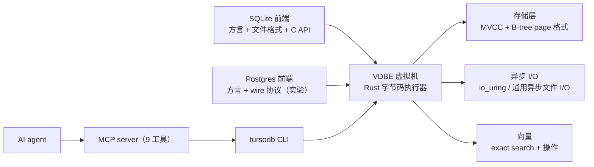

## 核心判断

Turso Database（`tursodatabase/turso`）是一个数据库。它把 SQLite 用 Rust 重写了，但方向不是「再做一个 SQLite 兼容层」。它的做法是把执行器做成一个能编译多种 SQL 方言的虚拟机。

官方借 LLVM 的比喻说得很直白。像 LLVM 用一套中间表示承载多种语言一样，Turso 用一套字节码虚拟机承载多种数据库前端。SQLite 是第一个、也是目前的主前端，保留方言、文件格式和 C API（应用程序接口）。Postgres 前端（实验）已经能用自己的方言和 wire 协议连进来。SQL 以下的存储、并发、查询编译和虚拟机是共享的。

按 README 的说法，这个数据库已经在多个组织跑生产，包括 Turso Cloud、Kin AI 助手和 Spice.ai。但项目还没到 1.0，部分特性仍标 experimental。官方自己建议按对待数据库的常规纪律保留独立备份。

仓库：https://github.com/tursodatabase/turso，23,738 stars / 1,242 forks，Rust，MIT 协议，v0.7.2（2026-07-30 发布），创建于 2023-08-26。

## 关键事实表

| 维度 | 数据 |
|---|---|
| 形态 | in-process SQL database（嵌入式） |
| 核心架构 | SQL 编译进 VDBE 字节码虚拟机，多前端共享同一核心 |
| 前端 | SQLite（主，`COMPAT.md` 列兼容矩阵）、Postgres（实验，`postgres/COMPAT.md`） |
| 写并发 | `BEGIN CONCURRENT` + MVCC（多版本并发控制） |
| 变更捕获 | CDC（change data capture，实时跟踪变更） |
| 异步 I/O | Linux `io_uring` 原生支持 |
| 向量 | exact search + vector manipulation（近似索引仍在路线图） |
| schema（模式）管理 | 扩展 `ALTER` 支持、更快的 schema 变更 |
| 跨平台 | Linux、macOS、Windows、浏览器（WASM） |
| 绑定语言 | Rust、JavaScript/TypeScript、Python、Go、Java、.NET、WebAssembly |
| 实验特性 | Postgres 前端、加密静态存储、DBSP 增量计算、tantivy 全文搜索、`.tshm` 多进程 WAL |
| 路线图 | 向量索引（近似最近邻，类似 libSQL vector search） |
| 当前版本 | v0.7.2（2026-07-30） |
| 状态 | 已在生产运行，未到 1.0，部分特性 experimental |

## 系统总览：一个虚拟机，多个前端



这段架构解释了 Turso 和普通「SQLite 替代品」的区别。SQL 不是唯一能编译进虚拟机的语言，Postgres 只是第二个前端，后面还可以继续加。存储层走 SQLite 原版 B-tree page 格式。写入路径在 `BEGIN CONCURRENT` 下走多版本快照，避免 reader 阻塞 writer。

## 重写动机：fork（派生）还是 rewrite

Turso 团队 2023 年在 [We will rewrite SQLite, and we are going all-in](https://turso.tech/blog/we-will-rewrite-sqlite-and-we-are-going-all-in) 明确了这个选择。核心论点是：fork 模式每追一个上游 patch 都要做 merge（合并）conflict 调解。rewrite 模式把 Rust 生态的 async/await、内存安全、io_uring 等能力直接落到执行器和存储层。如此迭代速度反而更快。

**和 libSQL 的关系**：libSQL 是同一个团队之前对 SQLite 的 fork，Turso 是后续的 Rust 重写。两者现在定位不同——Turso 是进程内嵌的库，不提供 server 端。如果你要的是服务端或托管形态的 SQLite 兼容方案，可以看 libSQL 那条线。要程序内嵌的 Rust 原生 SQLite 替代，选 Turso。

## 架构：从 SQL 文本到字节码再落地

仓库 `core/` 是执行器和存储的 Rust 实现，`bindings/` 是各语言绑定，`cli/` 是 `tursodb` 命令行工具（CLI，带 MCP server 模式），`docs/manual.md` 是用户手册。`COMPAT.md` 单独维护 SQLite 兼容矩阵。第一次接触仓库先看这个文件，能立刻知道哪些方言、哪些 PRAGMA、哪些文件格式已经和原版对齐。Postgres 前端另有一份 `postgres/COMPAT.md`。

执行路径大致分四层：

1. **前端编译** — SQLite 前端把 SQL 编译成字节码，Postgres 前端把 Postgres 方言和 wire 协议编译进同一套字节码。
2. **VDBE 字节码执行器** — 字节码跑在 Rust 的 async runtime 上，这是整个核心。
3. **MVCC 存储层** — 默认走 SQLite 原版 B-tree page 格式，写入路径在 `BEGIN CONCURRENT` 模式下走多版本快照。
4. **异步 I/O 适配** — Linux 上 I/O 走 `io_uring`，非 Linux 平台退到通用的异步文件 I/O。

**MVCC 的取舍**：`BEGIN CONCURRENT` 不是默认模式，需要应用显式声明。默认行为仍是 SQLite 兼容的 serializable，MVCC 是 opt-in 加速。

## 一次查询怎么流过系统

把一条 `SELECT * FROM users` 走一遍：

1. 应用通过 Rust API 调用 `conn.query("SELECT * FROM users", ())`。
2. SQLite 前端把这条 SQL 解析、规划，编译成 VDBE 字节码。
3. VDBE 在异步 runtime 上逐条指令执行，需要读页时走存储层。
4. 存储层在 Linux 上经 `io_uring` 异步取 page，从 B-tree 里拿到结果行。
5. 结果经连接对象返回给应用。

如果走 AI agent（智能体）那条路，入口换成 MCP。agent 调 `execute_query` 工具发同样的 SQL。`tursodb` 把 JSON-RPC 请求翻译成对引擎的调用，结果再以 JSON-RPC 返回。两条路复用同一套引擎，区别只在入口。

## MCP Server：让 AI 直接对数据库读写

README 单独用一套 `<details>` 章节强调了这个能力。Turso CLI 内置一个 Model Context Protocol (MCP) server，让 AI assistant 直接和数据库交互。开启方式：

```shell
tursodb your_database.db --mcp
```

随后在 Claude Code、Claude Desktop、Cursor 的 MCP 配置里加一条：

```json
{
  "mcpServers": {
    "turso": {
      "command": "/path/to/.turso/tursodb",
      "args": ["/path/to/your/database.db", "--mcp"]
    }
  }
}
```

MCP server 暴露 9 个工具：`open_database`、`current_database`、`list_tables`、`describe_table`、`execute_query`（只读 SELECT）、`insert_data`、`update_data`、`delete_data`、`schema_change`。设计边界很清晰：schema 修改和 DML 分开成不同工具，SELECT 单独锁成只读，避免 AI agent 误调 `DROP TABLE`。底层走 JSON-RPC 2.0 over stdio，协议版本 `2024-11-05`。你可以用 `cat << EOF | tursodb --mcp` 直接喂 JSON-RPC 请求做脚本化测试。

**为什么 MCP 对 Turso 是加分项**：SQLite 的传统定位是「应用内嵌的存储」。AI agent 时代这个边界在变。agent 需要直接对数据库做 schema 探索、查询和修改，而不是经由应用层。把 MCP server 嵌进 CLI，等于让 SQLite 文件本身变成 agent 的工具集，不需要应用暴露 API。同类里 DuckDB 有单独的 `duckdb-mcp`。Turso 把 MCP server 直接装进 CLI，用起来更省一步。

## 多语言绑定：production 的 7 条路径

每个 binding 都是仓库内独立子目录 + 独立发布。Rust 端用 `Builder`（建造者模式）构造本地连接，其余语言各有对应入口：

| 语言 | 安装命令 | 典型用法 |
|---|---|---|
| Rust | `cargo add turso` | `Builder::new_local("sqlite.db").build().await?` |
| JavaScript | `npm i @tursodatabase/database` | `connect('sqlite.db')` → `db.prepare(...).all()` |
| Python | `uv pip install pyturso` | `turso.connect("sqlite.db")` → `cur.execute("SELECT...")` |
| Go | `go get turso.tech/database/tursogo` | `sql.Open("turso", "sqlite.db")`（走 `database/sql`） |
| Java | Maven `tech.turso:turso` | JDBC 集成，详见 `bindings/java/README.md` |
| .NET | NuGet `Turso` | `new TursoConnection("Data Source=:memory:")` |
| WebAssembly | `@tursodatabase/database` 浏览器版 | 浏览器内嵌 SQLite 兼容 DB，无后端 |

`pyturso` 上 PyPI，`@tursodatabase/database` 上 npm，Rust 端 `turso` crate 上 crates.io，Java 端 `tech.turso:turso` 上 Maven Central，发布管道齐全。Go 绑定走 `database/sql` 标准接口。这意味着任何兼容 `database/sql` 的 ORM（对象关系映射）都能直接对接。

## 实验性特性：5 条还在孵化的能力

README 把 5 个能力标为 experimental——它们能跑、API 可能改、生产用要慎重：

1. **Postgres 前端** — 支持 Postgres 方言和 wire 协议，兼容参考在 `postgres/COMPAT.md`。
2. **Encryption at rest（静态数据加密）** — 保护静止数据；此处的 rest 是「静止」义，与 REST（表述性状态转移）不是一个词。
3. **Incremental computation with DBSP** — 用 DBSP 做增量视图维护和查询订阅，适合流式处理。
4. **Full-Text Search via tantivy** — 走 [quickwit-oss/tantivy](https://github.com/quickwit-oss/tantivy) 索引器。
5. **`.tshm` 多进程 WAL 协调** — 跨进程 WAL 读写，侧车文件 `.tshm` 当协调器，介于「in-process」和「client-server」之间的中间形态。

这些特性补的主要是 SQLite 原版没有的能力。SQLite 没原生 FTS（要装 FTS5 extension），没静态加密（要 SEE 商业版），没增量视图。Turso 把这些直接放进主分支。

## 路线图：向量索引还没落地

README 的 roadmap 现在只列了 1 条：

> Vector indexing for fast approximate vector search, similar to libSQL vector search

现在的 Turso 已经能做向量 exact search（线性扫描）。也能用 vector manipulation（`vector_distance_cosine()` 之类 SQL 函数）做向量运算。但 ANN（approximate nearest neighbor）索引还没合进 main。libSQL 的 vector search 走 HNSW + DiskANN 路线。Turso 之后大概率会复用同套思路或自研。

**对应用层的判断**：几千条向量的精确检索，现在够用。百万级向量的语义检索，还要等 ANN 索引。

## 测试与可靠性：DST + Antithesis 双层保护

README 的 FAQ 明确：

> Turso is extensively tested by a collection of tools including a native Deterministic Simulation Testing suite and Antithesis, so we are generally confident in the end result. But our bar is SQLite-level reliability, and we will still recommend caution until we are confident it meets that bar.

这段的落点是可靠性（reliability）。核心路径被大量测试覆盖，但对外仍留保守承诺，直到达到 SQLite 的稳定度。

- **Deterministic Simulation Testing (DST)**：Turso 团队自家用的确定性模拟测试框架，用模拟时钟和故障注入复现 corner case。
- **Antithesis**：商业 deterministic simulation testing 平台，对数据库做持续的随机故障注入。

这套测试栈的目标对标 SQLite-level reliability。SQLite 是测试覆盖最密的开源项目之一，Turso 的策略是「用 DST 复现」+「用 Antithesis 持续 fuzz」。官方自己承认还没到 SQLite 的可靠性水位。

**怎么读这句话**：README 说「generally confident」但「recommend caution」。意思是核心路径被大量测试覆盖，但对外仍留了保守的承诺。这反映的状态是「过了自测门槛，但还没对外宣布 1.0 的可靠性承诺」。不能从测试覆盖推出它已经达到 SQLite 的稳定度。

## 生产边界：什么时候用、什么时候不用

适合用 Turso 的场景：

- 你已经在 Rust 栈上，需要一个**进程内嵌的 SQL 引擎**，且愿意等 MVCC / vector 索引成熟
- 你的应用跑在 Linux 上且**想用 io_uring 加速 I/O**（WAL、page fetch）
- 你想让 **AI agent 直接对 SQLite 文件做 schema 探索和 DML**，不想经由应用层 API
- 你做的是**离线 / 边缘 / 嵌入式**项目，需要跨平台（Linux/macOS/Win/WASM）

不要用 Turso 的场景：

- **生产关键业务**对可靠性要求是 SQLite-level，而项目还没到 1.0，官方仍建议保留独立备份
- 你需要 **server 端 / 托管形态**——Turso 是进程内调用，没有 server 端
- 你的向量库是**百万级以上且要求 ANN 索引**——等 roadmap 落地
- 你的团队**不愿意维护 Rust 工具链**——报错时要能读 Rust 的调用栈

已经在生产用 Turso 的项目（README 明确列出）：Turso Cloud（官方云产品）、Kin AI 助手（[mykin.ai](https://mykin.ai/)）、Spice.ai 的数据基础设施。

## 入门路径

**最快 5 分钟**（体验 CLI）：

```shell
curl --proto '=https' --tlsv1.2 -LsSf \
  https://github.com/tursodatabase/turso/releases/latest/download/turso_cli-installer.sh | sh
tursodb
# 进入交互式 shell
turso> CREATE TABLE users (id INT, username TEXT);
turso> INSERT INTO users VALUES (1, 'alice');
turso> SELECT * FROM users;
```

**Rust 项目集成**：

```rust
use turso::Builder;

let db = Builder::new_local("sqlite.db").build().await?;
let conn = db.connect()?;
let res = conn.query("SELECT * FROM users", ()).await?;
```

**浏览器内嵌**（WebAssembly）：

```js
import { connect } from '@tursodatabase/database';
const db = await connect(':memory:');  // 浏览器内 in-memory
const stmt = db.prepare('SELECT * FROM users');
console.log(stmt.all());
```

**AI agent 直连**（Claude Code）：

```shell
claude mcp add my-database -- tursodb ./path/to/your/database.db --mcp
# 重启 Claude Code 后即可用自然语言操作数据库
```

