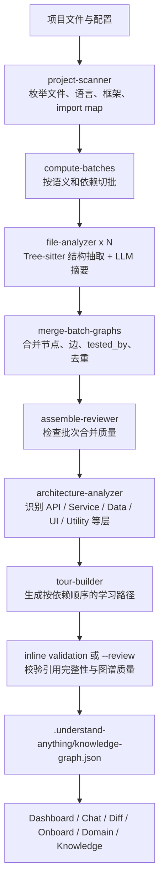

## 核心判断

Understand Anything 把"读代码"拆成了两层：确定性的结构抽取回答"代码里有什么、谁依赖谁"，LLM 回答"这些东西承担什么职责、应该按什么顺序理解"。这比把整个仓库塞进上下文窗口更稳，也比传统代码搜索更适合新人 onboarding、PR review 和大型重构前的影响面判断。

如果把 Understand Anything 只看成一个 Dashboard，会漏掉它更重要的那面——它本质上是一套面向 AI 编程时代的代码库索引格式。扫描结果落到 `.understand-anything/knowledge-graph.json`，Dashboard、聊天、diff 影响分析、onboarding 导览都围绕这份 JSON 工作。图谱不是展示层的副产品，团队可以提交、复用、增量更新。

读完这篇文章，你会知道三件事：Understand Anything 和 Sourcegraph、Cursor/Copilot、依赖分析工具之间边界在哪里；它的多 Agent 流水线为什么同时用 Tree-sitter、确定性脚本和 LLM；哪些团队适合把 `.understand-anything/` 提交到仓库，哪些场景反而不需要。

## 项目现状

| 维度 | 信息 |
|---|---|
| 仓库 | [Egonex-AI/Understand-Anything](https://github.com/Egonex-AI/Understand-Anything) |
| 官方主页 | [understand-anything.com](https://understand-anything.com) |
| 当前定位 | 把代码库、知识库或文档转成可探索、可搜索、可问答的交互式知识图谱 |
| GitHub 数据 | 59,033 Stars、4,903 Forks，取证时间为 2026-06-14 |
| 最新 Release | `v2.7.3`，发布于 2026-05-19 |
| License | MIT |
| 主语言 | TypeScript，仓库语言占比中 TypeScript 约 70.5%，JavaScript 约 16.2%，Python 约 9.5% |
| 支持平台 | Claude Code、Codex、Cursor、VS Code + Copilot、Copilot CLI、Gemini CLI、OpenCode、OpenClaw、Antigravity、Pi Agent、Vibe CLI、Hermes、Cline、KIMI CLI、Trae、Nanobot 等 |

注意事项：旧资料里可能引用 `Lum1104/Understand-Anything` 和 16K-55K 不等的 Stars 数据，这些都已过期。当前仓库主体是 `Egonex-AI/Understand-Anything`（README 仍注明项目最初由 Lum1104 创建）。安装命令、仓库链接和活跃度判断都应以 `Egonex-AI/Understand-Anything` 为准。

## 先看系统地图

Understand Anything 的架构可以分成四层：扫描层、语义分析层、图谱装配层和使用层。



每个阶段的边界是清晰的：扫描、语言识别、import 解析、结构抽取这些能确定性完成的工作，由脚本和 Tree-sitter 完成；文件摘要、标签、业务语义、导览解释这类需要上下文判断的工作，才交给 LLM。拆完之后，图谱有两层：一层是能复现的结构骨架，一层是能解释意图的语义注释。

## 它不是一次 LLM 读仓库

很多代码理解工具的做法是"把仓库喂给模型，让模型总结"。Understand Anything 在 `/understand` 里用了一条更工程化的管线：

1. Phase 0 处理项目根目录、worktree redirect、语言偏好、`.understandignore`、已有 graph 和增量策略。
2. Phase 1 用 `project-scanner` 生成文件清单、语言、框架、行数、文件类别和 import map。
3. Phase 1.5 用 `compute-batches.mjs` 做语义切批，避免一个 Agent 处理过大的上下文。
4. Phase 2 让多个 `file-analyzer` 并行处理批次，默认最多 5 个并发。
5. Phase 3 到 Phase 6 依次合并图、识别层级、生成 tour、执行图谱校验。
6. Phase 7 写出最终 `.understand-anything/knowledge-graph.json` 和元数据，并清理中间目录。

`file-analyzer` 不是直接读源码自由发挥。它会先运行 bundled `extract-structure.mjs`，用 Tree-sitter 和专用 parser 提取函数、类、导入、导出、call graph 以及部分非代码结构。LLM 拿到这些结构化结果后，再补摘要、标签、复杂度和语义边。

这种分层之下，LLM 仍然可能总结错，但它不是凭空猜结构——结构事实先由静态分析给出，LLM 的主要工作是解释与补语义。

## 知识图谱 JSON 到底装了什么

`.understand-anything/knowledge-graph.json` 的字段可以分成五块：

| 字段 | 作用 |
|---|---|
| `project` | 项目名称、描述、语言、框架、分析时间、对应 git commit |
| `nodes` | 文件、函数、类、配置、文档、服务、管道、schema、业务域、流程、步骤等节点 |
| `edges` | `imports`、`contains`、`calls`、`depends_on`、`tested_by`、`configures`、`documents`、`deploys`、`triggers` 等关系 |
| `layers` | 架构层，比如 API、Service、Data、UI、Utility，实际名称会根据项目结构生成 |
| `tour` | 按依赖顺序组织的学习路径，给新人按步骤读 |

这份 JSON 不只是依赖图。传统依赖分析通常只回答"谁 import 了谁"，而 Understand Anything 还会把配置、CI、文档、基础设施、schema 这类非代码文件纳入图谱。在真实项目里，很多"为什么这样设计"的答案藏在 README、Dockerfile、GitHub Actions、OpenAPI schema 或迁移脚本里。

2.7.x 之后还补强了 `tested_by` 边。合并脚本会把测试覆盖关系规范化，尽量从 LLM 批次输出和路径约定中恢复"生产代码 -> 测试文件"的关联，并给被测试的生产节点打上 `tested` 标签。这个细节对 PR review 很有价值：你不仅能看到改动影响了哪些模块，还能看到附近有没有测试保护。

## 一次真实任务如何流过系统

假设刚进一个团队，想知道"支付流程从 API 到数据库经过哪些模块"。传统做法是搜索 `payment`，再从 controller、service、model、job 一路跳。Understand Anything 的路径更像这样：

1. 先在项目里运行 `/understand --language zh`，生成中文摘要和中文 Dashboard UI。
2. 打开 `/understand-dashboard`，在结构图里搜索 `payment` 或"支付"。
3. 如果你更关心业务语义，切到 domain view，看它是否把系统拆成 domain、flow、step。
4. 用 `/understand-chat 支付流程从入口到落库经过哪些模块？` 让它基于图谱回答，而不是让模型临时扫仓库。
5. 准备改代码前运行 `/understand-diff`，让它把当前 git diff 映射到 graph node 和一跳影响面。

读者先得到一张"系统地图"，再进入源码细节。对于 20 万行级别的项目，这个顺序很关键。新人一开始最缺的不是某个函数的解释，而是知道哪些文件是入口、哪些模块是核心、哪些边界不能随便碰。

## Dashboard 不只是画图

Dashboard 目前基于 React 19、Vite、`@xyflow/react`、Dagre、ELK、D3 Force、Graphology、Zustand 和 Tailwind CSS v4。它给同一份图谱提供多种阅读方式。

| 视图或能力 | 解决的问题 |
|---|---|
| Structural Graph | 看文件、函数、类、模块之间的结构关系 |
| Domain View | 用 domain、flow、step 解释业务流程，适合 PM、架构师和跨团队沟通 |
| Knowledge Graph View | 面向 Karpathy 风格 LLM Wiki，把文章、实体、claim 和隐式关系串起来 |
| Layer Visualization | 用颜色和分组展示 API、Service、Data、UI、Utility 等层级 |
| Fuzzy & Semantic Search | 同时支持名称搜索和语义搜索，比如"哪些地方处理认证" |
| Guided Tours | 按依赖顺序生成架构导览，避免新人随机点图 |
| Diff Overlay | 把本地改动叠加到图上，看直接改动节点和一跳影响节点 |
| Persona-Adaptive UI | 根据 junior developer、PM、power user 等角色调整细节密度 |

图本身只是入口。搜索、导览、解释、diff、业务视图都落在同一份 graph 数据上，这才是 Dashboard 和普通"代码转图"工具的区别。

## 快速上手

Claude Code 原生插件安装：

```bash
/plugin marketplace add Egonex-AI/Understand-Anything
/plugin install understand-anything
```

分析当前项目：

```bash
/understand
```

生成中文节点摘要、Dashboard UI 和 guided tour：

```bash
/understand --language zh
```

打开 Dashboard：

```bash
/understand-dashboard
```

继续探索代码库：

```bash
# 询问项目结构或业务流程
/understand-chat How does the payment flow work?

# 分析当前修改影响面
/understand-diff

# 深入解释某个文件或函数
/understand-explain src/auth/login.ts

# 给新人生成 onboarding 指南
/understand-onboard

# 提取业务 domain / flow / step
/understand-domain

# 分析 Karpathy-pattern LLM wiki
/understand-knowledge ~/path/to/wiki
```

Codex、OpenCode、Gemini CLI 等平台可以用统一安装脚本：

```bash
curl -fsSL https://raw.githubusercontent.com/Egonex-AI/Understand-Anything/main/install.sh | bash

# 或直接指定平台，例如 Codex
curl -fsSL https://raw.githubusercontent.com/Egonex-AI/Understand-Anything/main/install.sh | bash -s codex
```

Windows 使用 PowerShell：

```powershell
iwr -useb https://raw.githubusercontent.com/Egonex-AI/Understand-Anything/main/install.ps1 | iex
```

Copilot CLI 的安装命令是：

```bash
copilot plugin install Egonex-AI/Understand-Anything:understand-anything-plugin
```

## 多平台支持的实际含义

Understand Anything 的多平台支持不是每个平台各写一套分析引擎。核心逻辑集中在 `understand-anything-plugin/`：

```text
understand-anything-plugin/
├── agents/             # project-scanner、file-analyzer、architecture-analyzer 等 Agent 定义
├── hooks/              # auto-update post-commit hook
├── packages/
│   ├── core/           # 共享分析核心、schema、search、tree-sitter、tour 等
│   └── dashboard/      # React/Vite Dashboard
├── skills/             # /understand、/understand-dashboard、/understand-chat 等命令
└── src/                # chat、diff、explain、onboard 等能力实现
```

不同平台主要解决"命令如何被宿主识别、插件目录如何被发现、符号链接如何建立"的问题。统一 `install.sh` / `install.ps1` 之后，这部分成本下降不少。`v2.7.3` 的 release note 里也明确提到：旧的分平台安装器不再是主路径，统一安装脚本会根据目标 CLI 建立对应 symlink 和配置。

团队里有人用 Claude Code，有人用 Codex，有人用 Cursor 或 Copilot，理论上仍然可以围绕同一份 `.understand-anything/knowledge-graph.json` 协作。

## Tree-sitter 和 LLM 的边界

Understand Anything 的"混合分析"可以粗略拆成两条线。

第一条线是确定性分析：

- `scan-project.mjs` 负责枚举文件、识别语言、分类文件、估算复杂度。
- `extract-import-map.mjs` 负责解析项目内 import 关系。
- `extract-structure.mjs` 用 Tree-sitter 和专用 parser 抽取函数、类、导入、导出、配置、schema、CI step 等结构。
- `merge-batch-graphs.py` 负责合并、去重、规范 ID、清理 dangling edge，并补充 `tested_by` 关系。

第二条线是 LLM 语义分析：

- `file-analyzer` 给文件、函数、类写摘要、标签和复杂度判断。
- `architecture-analyzer` 把文件和边映射到架构层。
- `tour-builder` 生成按依赖顺序的学习路径。
- `article-analyzer` / `domain-analyzer` 处理知识库和业务域图谱。
- `graph-reviewer` 在 `--review` 模式下执行更完整的 LLM 质量检查；默认路径还有内联确定性校验。

AI 编码工具如果完全依赖 LLM 读源码，容易出现两类问题：上下文不够时漏关系，上下文太大时摘要变泛。Understand Anything 把 LLM 放到"解释结构"的位置，不充当唯一 parser。

## 图谱即文档

README 建议把 `.understand-anything/knowledge-graph.json` 提交到 git。推荐提交 `.understand-anything/` 里的核心工件，排除这些本地中间产物：

```gitignore
.understand-anything/intermediate/
.understand-anything/diff-overlay.json
```

收益：

- 新人 clone 仓库后可以直接打开 Dashboard，不必先跑一遍完整分析。
- PR review 可以围绕同一份图谱讨论影响面。
- 文档不再是独立 Markdown，而是和代码 commit 绑定的结构化索引。
- `--auto-update` 可以挂 post-commit hook，让 graph 跟随提交更新。

代价：大型仓库的 graph 可能超过 10 MB，README 建议用 Git LFS 管理。图谱会包含项目结构、文件摘要、业务语义和部分关系。如果仓库包含敏感业务逻辑或内部系统名称，不要把 graph 当成无害产物随便公开。

## `v2.7.3` 为什么值得单独看

截至本文写作，GitHub 最新 release 是 `v2.7.3`。它在"可复用图谱"这条路线上补了不少细节：

| 更新 | 影响 |
|---|---|
| `--language` 本地化 | 摘要、节点描述、tour、onboarding 内容可以按目标语言生成 |
| Dashboard i18n | Dashboard UI 和分析输出使用同一个 `outputLanguage` 配置 |
| 统一安装脚本 | 多平台安装从一堆脚本收敛到 `install.sh` / `install.ps1` |
| `tested_by` edges | 图谱能展示测试覆盖关系，PR review 时更有用 |
| 文件 / 类双视图 | 大型面向对象项目可以降低图上噪音 |
| 移动端 Dashboard | 不再只是横向滚动桌面视图 |
| 2.7.x 增量流水线 | fingerprint、`.understandignore`、fresh install incremental 等问题得到修复 |
| 无 schema breaking change | release note 标明 v2.5.0 以来没有 graph schema 破坏性变更 |

本地化和增量是这版最有价值的两个变化。前者决定国内团队是否愿意把它用于 onboarding，后者决定图谱能不能从一次性演示变成长期维护的工程资产。

## 和同类工具怎么区分

| 工具或范式 | 强项 | Understand Anything 的不同点 |
|---|---|---|
| Sourcegraph | 跨仓库搜索、代码导航、符号检索 | 更强调 graph、导览、业务视图和 AI 问答 |
| Cursor / Copilot codebase context | 写代码时召回相关上下文 | 不只是给模型上下文，还生成可提交、可视化的 graph 工件 |
| dependency-cruiser / madge | 静态依赖关系分析 | 不止依赖边，还包含摘要、架构层、tour、domain flow、diff overlay |
| DeepWiki / 一次性代码文档 | 快速生成项目说明 | Understand Anything 的图谱可以增量更新并被 Dashboard、chat、diff 复用 |
| 手写架构文档 | 判断力强、上下文细 | 维护成本高，容易和代码漂移；图谱适合作为自动生成底图 |

Understand Anything 不适合替代所有文档。更合适的用法是：它自动生成"项目地形图"，人类维护"关键设计决策、历史原因、风险约束"。前者靠机器更新，后者必须有人判断。

## 适用边界

适合优先尝试的场景：

- 新人加入中大型代码库，需要快速建立系统全貌。
- 多团队共用一个 monorepo，跨域理解成本很高。
- 代码审查前需要知道一个 diff 影响哪些模块。
- 架构文档长期滞后，团队想要一份跟 commit 绑定的结构化索引。
- PM、架构师或技术负责人需要看业务流程，而不是逐文件读源码。
- 个人或团队维护 Karpathy 风格 LLM Wiki，想把文档变成可导航图谱。

不适合优先投入的场景：

- 小项目，文件少、依赖浅，直接读源码更快。
- 主要问题是运行时行为、性能瓶颈或线上状态，静态图谱无法代替 tracing、profiling 和日志。
- 团队无法接受生成物进入仓库，也没有明确的 graph 刷新责任。
- 代码和文档里有大量敏感信息，却没有清晰的脱敏和访问控制。
- 希望它直接替你做架构决策。它能整理结构，但不能替代人判断哪些边界应该保留。

## 采用建议

在团队里试用，不建议一上来全仓库铺开。更稳的路径是：

1. 选一个 5 万到 20 万行之间、文档不太完整但边界还算清晰的项目。
2. 先运行 `/understand --language zh`，只让少数维护者看 Dashboard 和 tour。
3. 用 `/understand-chat` 问 5 个真实 onboarding 问题，比如"请求从入口到数据库经过哪些层""哪个模块处理鉴权""某个 job 依赖哪些 service"。
4. 用一次真实 PR 跑 `/understand-diff`，看它给出的影响面是否符合维护者直觉。
5. 如果结果有用，再决定是否把 `.understand-anything/knowledge-graph.json` 提交到仓库，并约定刷新频率。
6. 对大图启用 Git LFS，对敏感项目先限制 graph 的可见范围。

评估标准不是看 demo 好不好看，而是实际效果：它能不能减少新人第一次定位系统边界的时间，能不能在 review 前暴露影响面，能不能让 AI 编码助手回答项目级问题时少一点盲猜。

## 结语

Understand Anything 面向的是 AI 编程工具正在面对的一个具体问题：模型越来越会写局部代码，但它对项目整体结构仍然容易失明。把代码库转成一份可查询、可导航的知识图谱，就是给模型和人都补一张地图。

这张地图不会替你理解代码，也不会自动保证架构正确。它只是让结构先浮出来，让新人少走弯路，让 PR review 有影响面，让团队把"项目知识"从零散口头经验挪到一个可更新的工程工件里。对大型代码库来说，这已经足够有用。