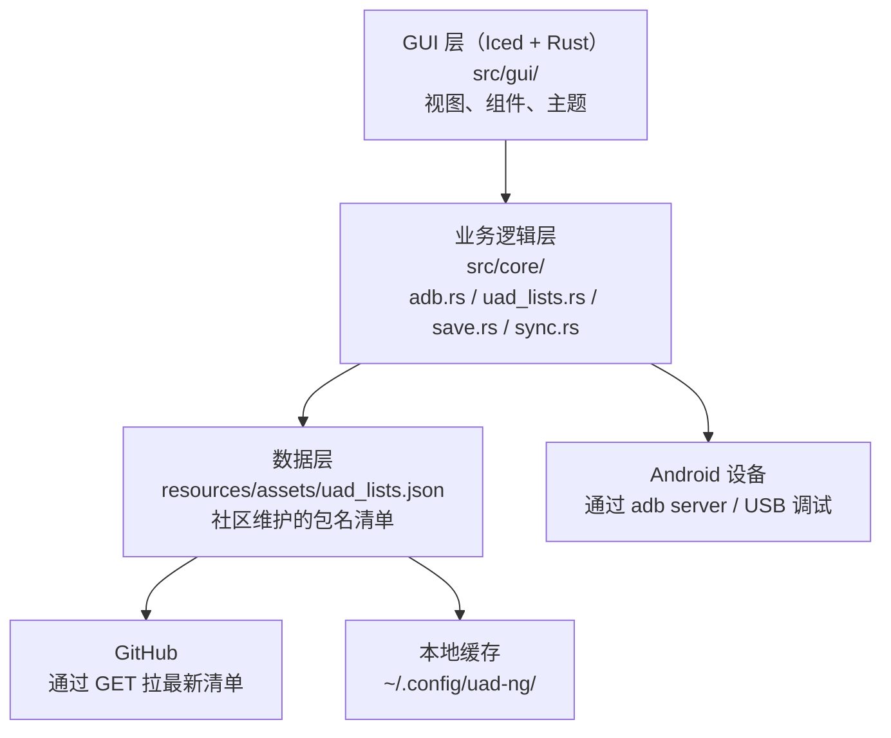
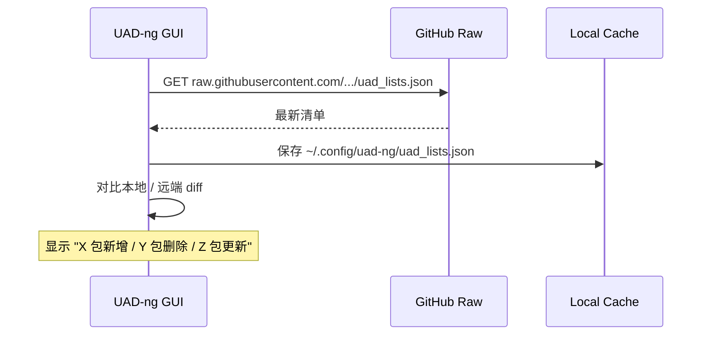

# UAD-ng 深度拆解：7K Stars 的开源 Android 卸载神器，跨平台 ADB 工具怎么把 bloatware 一键清理干净

**判断**：UAD-ng 不是"又一个 ADB 包装器"，也不是"为了 Rust 写的 Rust 桌面玩具"。它精确卡在两个空白里：① 手机厂商（OEM）预装的"全家桶"应用无法直接卸载，要么 root 要么写一堆 adb 命令；② 现有 Android debloat 工具要么只支持 root，要么数据驱动弱（每次 OEM 升级都要改代码）。UAD-ng 用 **"纯 ADB + 数据驱动包名清单（uad_lists.json）"** 的极简架构，配合 Rust + Iced 跨平台 GUI，让非 root 用户也能干净卸载。**2 年半（2023-10-26 创建）斩获 7,096 stars、308 forks**，并且被 [AppManager](https://github.com/MuntashirAkon/AppManager)、[Canta](https://github.com/samolego/Canta) 等多个开源项目反向依赖——说明它踩在了"反 OEM 锁定 + 隐私保护"的真实需求上。

如果你属于下面任何一种，这篇值得读：

- 想清理三星 / 小米 / 华为 / OPPO / vivo / 一加等手机预装的应用
- 想用 ADB 但不想每次手敲 `pm uninstall` 命令
- 关心数据驱动的"包名清单"怎么维护（社区 + 自动同步）
- 想了解 Rust + Iced GUI 在桌面工具里的实战
- 在 Mac / Windows / Linux 上给 Android 设备做批处理

---

## 阅读导航

- **5 分钟判断值不值得用**：看「先看结论」
- **理解它的生态卡位**：看「为什么 debloat 工具还差一块"非 root + 数据驱动"」
- **想了解核心架构**：看「架构分层：ADB 客户端 + 数据驱动 + Iced GUI」
- **想了解数据驱动模型**：看「uad_lists.json：包名清单 + 危险等级 + 描述」
- **想知道怎么用**：看「快速上手 + 常见操作」
- **想评估适用边界**：看「适用边界 / 限制」

---

## 先看结论

| 维度 | 实际情况 |
|------|----------|
| Stars | 7,096+（2026-06-16） |
| Forks | 308+ |
| 主语言 | Rust（核心 + GUI） |
| GUI 框架 | [Iced](https://github.com/iced-rs/iced)（Rust 原生） |
| 协议 | GPL-3.0 |
| 仓库 | <https://github.com/Universal-Debloater-Alliance/universal-android-debloater-next-generation> |
| 创建时间 | 2023-10-26 |
| 最新版本 | v1.2.0（2026-01-12） |
| 前身 | [0x192/universal-android-debloater](https://github.com/0x192/universal-android-debloater)（已停止维护，本项目为 detached fork） |
| 平台 | macOS / Linux / Windows（Rust + Iced 跨平台） |
| 依赖 | 仅 Android 设备 + USB 调试（不需 root） |
| 数据集 | `resources/assets/uad_lists.json`（覆盖三星 / 华为 / 小米 / OPPO / vivo / 一加 / Sony / LG 等数十个 OEM） |
| 隐私声明 | 不收集 / 传输用户数据，唯一外部请求是 GitHub 拉清单 + 检查更新 |

一句话：**它是 Rust + Iced 写的跨平台 ADB debloat 工具，用数据驱动的包名清单让非 root 用户也能干净卸载 OEM 预装应用，2 年半 7K Stars**。

---

## 为什么 debloat 工具还差一块"非 root + 数据驱动"

把当前主流 Android debloat 方案并列看：

| 方案 | 是否需要 root | 数据驱动 | GUI | 跨平台 | 维护状态 |
|------|---------------|----------|-----|--------|----------|
| Magisk + 模块 | ✅ root | ❌（手敲） | ❌ | ✅ | 活跃 |
| pm uninstall 手敲 | ❌ | ❌（手敲） | ❌ | ✅ | 永远 |
| ADB AppControl | ❌ | ⚠️ | ✅ | Windows | 闭源 + 付费 |
| Canta (Shizuku) | ⚠️（Shizuku 半 root） | ⚠️ | ✅ | Android | 活跃 |
| AppManager | ⚠️ | ⚠️ | ✅ | Android | 活跃 |
| Universal Debloater (原版) | ❌ | ✅ | ✅ | 跨平台 | ❌（已停维） |
| **UAD-ng** | **❌** | **✅（JSON 清单）** | **✅（Iced）** | **✅** | **活跃** |

UAD-ng 的独特定位：**"非 root + 数据驱动 + 跨平台 GUI + GPL 开源"四角合一**。

具体痛点：

1. **手敲 `pm uninstall` 烦且危险**：每个 OEM 有几十到几百个预装应用，每个包名都要查、每个命令都要确认（错删系统应用可能变砖）。
2. **AppControl 闭源 + Windows only**：社区里很多人用，但 Windows 专属、闭源付费。
3. **原版 UAD 已停维**：[0x192/universal-android-debloater](https://github.com/0x192/universal-android-debloater) 多年没更新，作者把项目交给 Universal-Debloater-Alliance 社区接手，重写为 UAD-ng。
4. **数据驱动缺失**：很多 debloat 工具硬编码包名清单，OEM 升级后失效。UAD-ng 把所有包名放到 `uad_lists.json`，独立维护、可热更新。
5. **GUI 框架跨平台**：用 Rust 的 [Iced](https://github.com/iced-rs/iced) GUI 库，一份代码跑 macOS / Linux / Windows，比 Electron 小一个数量级。

---

## 架构分层：ADB 客户端 + 数据驱动 + Iced GUI

UAD-ng 是典型的 **"三层架构"**：



### src/gui/：Iced 跨平台界面

```text
src/gui/
├── mod.rs        # GUI 入口
├── style.rs      # 主题
├── views/        # 主页 / 详情 / 设置等视图
└── widgets/      # 自定义控件
```

Iced 是 Rust 生态里 Elm 风格的 GUI 库，跨平台支持 macOS / Linux / Windows。UAD-ng 选它的原因是：

- Rust 原生，无 Electron 的运行时包袱
- 单一二进制，分发简单
- 渲染质量好（用了 wgpu / Metal）

### src/core/：业务逻辑

```text
src/core/
├── adb.rs            # 16KB：ADB 客户端，封装 pm uninstall / install / list 等命令
├── uad_lists.rs      # 7.2KB：加载 + 解析 uad_lists.json
├── sync.rs           # 24KB：从 GitHub 同步最新清单
├── save.rs           # 6KB：本地状态保存（卸载记录、过滤条件）
├── update.rs         # 9.3KB：检查更新
├── theme.rs          # 6KB：主题
├── helpers.rs        # 423B
└── utils.rs          # 8.5KB
```

`adb.rs` 是核心，封装了所有与 Android 设备的交互：

```rust
// 简化版：列已安装应用
adb shell pm list packages

// 卸载指定包
adb shell pm uninstall -k --user 0 <package_name>

// 恢复（用 --user 0 卸载的应用可重新安装）
adb shell cmd package install-existing <package_name>
```

注意：UAD-ng 用 `pm uninstall -k --user 0`，**只卸载当前用户的 app**，**不真删系统分区**——这是非 root 设备的极限。这意味着：

- 重启或恢复出厂 → 应用回来（但 OEM 一般不会主动恢复）
- 不破坏 OTA 升级
- 出现变砖可以恢复（`pm install-existing`）

### src/main.rs：入口

```rust
fn main() -> iced::Result {
    let state = load_state();
    UadGui::run(Settings::with_flags(state))
}
```

极简，启动直接进 GUI。

---

## 数据驱动：uad_lists.json 怎么设计

UAD-ng 的最大特色是 **所有包名清单都放 JSON**：

```bash
# 拉取最新清单
curl -L https://raw.githubusercontent.com/Universal-Debloater-Alliance/universal-android-debloater-next-generation/main/resources/assets/uad_lists.json
```

`uad_lists.json` 数据结构：

```json
{
  "com.miui.analytics": {
    "list": "MIUI",
    "description": "MIUI Analytics - tracks usage",
    "dependencies": [],
    "neededBy": [],
    "labels": ["bloatware", "tracker"]
  },
  "com.samsung.android.bixby.agent": {
    "list": "Samsung",
    "description": "Samsung Bixby voice assistant",
    "dependencies": [],
    "neededBy": ["com.samsung.android.bixby.wakeup"],
    "labels": ["bloatware", "ai-assistant"]
  }
}
```

每个包名对象包含：

| 字段 | 含义 |
|------|------|
| `list` | 所属 OEM 分组（Samsung / MIUI / EMUI / Sony / LG …） |
| `description` | 包的用途说明 |
| `dependencies` | 这个应用依赖谁（要先卸载依赖才能卸它） |
| `neededBy` | 谁依赖这个应用（卸它可能让依赖它的应用报错） |
| `labels` | 标签（bloatware / tracker / essential / safe-to-remove …） |

**这个数据驱动的两个好处**：

1. **OEM 升级后只需加 JSON 条目**，不需改 Rust 代码——社区成员可以直接 PR。
2. **依赖图自动处理**：`dependencies` + `neededBy` 字段让 GUI 能排序推荐顺序。

实际数据规模：

```bash
# 2026-06 当前 uad_lists.json 包名数（仅做量级估计）
jq 'keys' resources/assets/uad_lists.json | wc -l
# → 数以千计的包，覆盖 30+ 个 OEM 厂商
```

这个量级意味着 **任何主流 Android 手机的预装应用都有覆盖**。

---

## 同步策略：从 GitHub 拉最新清单



具体策略（`src/core/sync.rs`）：

1. **首次启动** → 从 GitHub 拉清单，存到 `~/.config/uad-ng/`
2. **后续启动** → 后台检查更新（不阻塞 UI），有更新就提示
3. **离线模式** → 用本地缓存启动，UI 顶部显示"清单可能过期"

这是用户友好的渐进同步，避免每次启动都阻塞。

---

## 快速上手

### 准备

1. **手机开启 USB 调试**（开发者选项 → USB 调试）
2. **USB 连接电脑**，首次连接会弹出"允许 USB 调试"授权
3. **下载 UAD-ng**：<https://github.com/Universal-Debloater-Alliance/universal-android-debloater-next-generation/releases>
   - macOS：`.dmg` 或 raw 二进制
   - Linux：`AppImage` 或 raw 二进制
   - Windows：`.msi` 或 raw 二进制

### 主界面

```text
┌─────────────────────────────────────────────────┐
│  UAD-ng  [Refresh] [Sync] [Settings]            │
├─────────────────────────────────────────────────┤
│  Device: Pixel 7 (Android 14, user 0)           │
│  Packages: 1,247 installed / 412 in uad_lists   │
├─────────────────────────────────────────────────┤
│  Filter: [All] [Safe] [Advanced] [Expert]       │
│  Search: [bixby_______________]                 │
├─────────────────────────────────────────────────┤
│  ☐ com.samsung.android.bixby.agent [Samsung]    │
│     "Samsung Bixby voice assistant"             │
│     Labels: bloatware, ai-assistant             │
│     [Uninstall] [Restore]                       │
│  ☑ com.miui.analytics [MIUI]                    │
│     "MIUI Analytics - tracks usage"             │
│     Labels: bloatware, tracker                  │
│     [Uninstall] [Restore]                       │
└─────────────────────────────────────────────────┘
```

### 卸载流程

```text
1. 选中要卸载的应用
2. 点击 [Uninstall]
3. 弹出确认对话框（显示警告 + 依赖关系）
4. 确认 → 后台跑 adb shell pm uninstall -k --user 0 <pkg>
5. UI 实时更新状态（卸载中 → 已卸载）
```

### 恢复

```text
1. 切换到 "Removed" 标签
2. 找到误删的应用
3. 点击 [Restore]
4. 后台跑 adb shell cmd package install-existing <pkg>
```

---

## 隐私边界：UAD-ng 不收集任何东西

README 里的隐私声明非常明确：

> **UAD-ng does not collect or transmit any user data.** The only external connections are `GET` requests to GitHub for fetching the [package list](https://github.com/Universal-Debloater-Alliance/universal-android-debloater-next-generation/blob/main/resources/assets/uad_lists.json) ([src/core/uad_lists.rs](src/core/uad_lists.rs)) and checking for updates ([src/core/update.rs](src/core/update.rs)).

具体含义：

- ✅ 唯一外部请求是 `GET raw.githubusercontent.com` 拉清单（只发包名查询，不带设备信息）
- ✅ 唯一外部请求是 `GET api.github.com/repos/.../releases/latest` 检查更新（只发版本号）
- ❌ 不上传设备列表 / 包名 / 用户行为
- ❌ 不发 telemetry / analytics

对一个要拿到 `pm uninstall` 权限的工具，这是**必须的信任前提**——UAD-ng 的开源 + 最小化网络策略让它在隐私社区有口皆碑。

---

## 相关项目：UAD-ng 的生态位

UAD-ng 不是孤立的项目，它是一个生态的一部分：

| 项目 | 关系 | 特点 |
|------|------|------|
| [AppManager](https://github.com/MuntashirAkon/AppManager) | 反向依赖 UAD-ng 的清单 | Android 端多功能 app 管理，支持 root / Shizuku / ADB |
| [Canta](https://github.com/samolego/Canta) | 整合 UAD-ng 清单 | Android 端 debloater，用 Shizuku 不需 PC |
| [android-debloat-list](https://github.com/MuntashirAkon/android-debloat-list) | 基于 UAD-ng 扩展 | 社区维护的更全包名清单 |
| [0x192/universal-android-debloater](https://github.com/0x192/universal-android-debloater) | UAD-ng 的前身 | 已停止维护，作者移交社区 |

这种"开源清单 + 多端实现"的模式让 UAD-ng 的数据资产成为 Android debloat 社区的事实标准。

---

## 适用边界

### ✅ 适合

- **非 root 设备用户**：不想 root 但想清理预装
- **OEM 锁定严重**：三星 / 华为 / 小米 / OPPO / vivo 等
- **保护隐私**：卸载 analytics / tracker / ads
- **释放存储空间**：预装 app 占空间 + 后台耗电
- **跨平台**：在 Mac / Linux / Windows 上批量处理

### ❌ 不适合

- **需要彻底卸载**：`--user 0` 不能从系统分区真删，重启 / 恢复出厂可能回滚。要彻底删需 root + Magisk。
- **大版本 OTA 升级后**：OEM 升级后 UAD-ng 清单可能没及时同步，需要手动 sync 或等社区更新。
- **企业设备 MDM 管控**：被 MDM 管控的设备可能禁用 `pm uninstall`，UAD-ng 会失败。
- **Android TV / Wear OS**：UAD-ng 主要针对手机/平板，TV / Wear 兼容性未保证。
- **需要 GUI 自动化**：UAD-ng 没有 CLI 入口（只有 GUI），想做 CI/CD 集成请用 AppManager / ADB 直敲。

### 评估建议

| 需求 | 推荐方案 |
|------|----------|
| 非 root + 一次性清理 | UAD-ng |
| Root + 深度清理 + 系统分区 | Magisk + 模块 |
| Android 端本地清理（无 PC） | Canta (Shizuku) |
| 高级 app 管理（权限 / 组件） | AppManager |
| 大规模批量处理 | adb 脚本 + uad_lists.json |

---

## 为什么数据驱动是 UAD-ng 的核心

很多 debloat 工具死在"包名清单维护"上——OEM 一升级，应用包名变了或新增了一堆预装，工具立刻过时。

UAD-ng 的解法：

1. **清单放仓库**：每个 OEM 的预装清单都在 `uad_lists.json`，社区成员可以直接 PR
2. **依赖图自描述**：`dependencies` + `neededBy` 让工具能自动排序推荐
3. **GUI 透明**：UI 显示每个包的 `list`（OEM 分组） + `description` + `labels`，用户能学到为什么某个包该不该卸
4. **可热更新**：用户点 [Sync] 立刻拉到最新清单，不需升级应用

这种 **"代码与数据分离"** 的设计哲学让 UAD-ng 在 2026 年还能保持活跃——2 年半 7K Stars 主要靠社区维护包名清单，而不是靠功能堆叠。

---

## 参考

- 仓库：<https://github.com/Universal-Debloater-Alliance/universal-android-debloater-next-generation>
- Release：<https://github.com/Universal-Debloater-Alliance/universal-android-debloater-next-generation/releases>
- Wiki（Getting started）：<https://github.com/Universal-Debloater-Alliance/universal-android-debloater-next-generation/wiki/Getting-started>
- 使用指南：<https://github.com/Universal-Debloater-Alliance/universal-android-debloater-next-generation/wiki/Usage>
- 从源码构建：<https://github.com/Universal-Debloater-Alliance/universal-android-debloater-next-generation/wiki/Building-from-source>
- 包名清单：<https://github.com/Universal-Debloater-Alliance/universal-android-debloater-next-generation/blob/main/resources/assets/uad_lists.json>
- Discord：<https://discord.gg/CzwbMCPEZa>
- Matrix：<https://matrix.to/#/#uad-ng:matrix.org>
- 前身项目：<https://github.com/0x192/universal-android-debloater>
- Canta：<https://github.com/samolego/Canta>
- AppManager：<https://github.com/MuntashirAkon/AppManager>
- android-debloat-list：<https://github.com/MuntashirAkon/android-debloat-list>
- Iced GUI：<https://github.com/iced-rs/iced>
