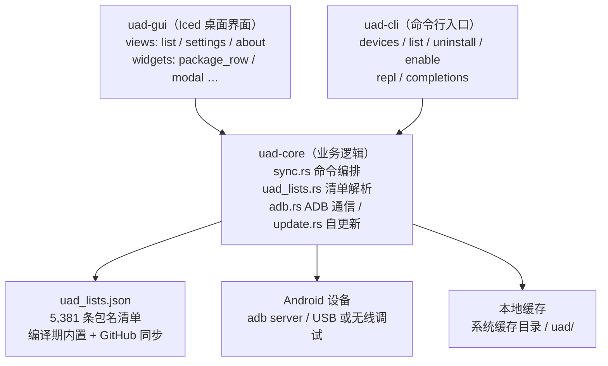

# UAD-ng 深度拆解：9.3K Stars 的开源 Android 卸载工具，跨平台 ADB 工具怎么把 bloatware 一键清理干净

UAD-ng 解决的不是一个问题，而是两个卡在一起的死结。第一，厂商（OEM）预装的应用不给卸载入口，不想 root 就只能手敲一串串 `adb shell pm uninstall`，敲错包名还可能让系统功能异常。第二，就算你愿意敲，也无从判断哪些包能删、删了会坏什么——这些知识散落在各个机型的论坛帖里，没人维护成一份可更新的数据。UAD-ng 把这份知识收进一个 JSON 清单（`uad_lists.json`），程序本身只做两件事：读清单、发 ADB 命令。知识在数据里更新，代码不用动。

这套"代码与清单分离"的架构让它活了下来。项目 2023-10-26 从已停维的 [0x192/universal-android-debloater](https://github.com/0x192/universal-android-debloater) fork 出来，到 2026-09-30 拿到 **9,300 stars、392 forks**（GitHub API 读数），最新版本 v1.2.0（2026-01-12）。README 的 Friends 一节列了它的生态位：Android 端的 [Canta](https://github.com/samolego/Canta) 直接集成这份清单做无 PC debloat，[android-debloat-list](https://github.com/MuntashirAkon/android-debloat-list) 以它为基础扩展——一份清单成了 Android debloat 社区的公共数据源。

如果你正被三星 / 小米 / OPPO / vivo 等厂商的预装应用困扰，或者关心"社区数据 + 纯 ADB"这类工具的架构怎么设计，往下读。

## 先看结论

| 维度 | 实际情况 |
|------|----------|
| Stars | 9,300（2026-09-30 GitHub API 读数） |
| Forks | 392 |
| 主语言 | Rust |
| GUI 框架 | [Iced](https://github.com/iced-rs/iced) 0.14（Rust 原生，wgpu 渲染） |
| 协议 | GPL-3.0 |
| 仓库 | <https://github.com/Universal-Debloater-Alliance/universal-android-debloater-next-generation> |
| 创建时间 | 2023-10-26 |
| 最新版本 | v1.2.0（2026-01-12） |
| 前身 | [0x192/universal-android-debloater](https://github.com/0x192/universal-android-debloater)（已停止维护，本项目为 detached fork） |
| 平台 | macOS（ARM / Intel）/ Linux / Windows |
| 前置条件 | Android 设备 + ADB + USB 调试，不需要 root |
| 数据集 | `resources/assets/uad_lists.json`：5,381 个包名，按 Oem / Misc / Aosp / Carrier / Google 五类组织，每条带卸载风险分级 |
| 隐私 | 不收集 / 传输用户数据，唯一外部请求是 GitHub 拉清单 + 检查更新 |

一句话：**Rust + Iced 写的跨平台 ADB debloat 工具，GUI 和 CLI 双入口，靠社区维护的风险分级包名清单，让非 root 用户停用 OEM 预装应用**。

---

## 为什么 debloat 工具还差一块"非 root + 数据驱动"

debloat（给系统瘦身）指的是清理厂商塞进手机的预装应用，英文里叫 bloatware。把当前主流方案并列看：

| 方案 | 是否需要 root | 数据驱动 | 入口 | 跨平台 | 维护状态 |
|------|---------------|----------|-----|--------|----------|
| Magisk + 模块 | ✅ root | ❌（手敲） | 命令行 | ✅ | 活跃 |
| 手敲 `pm uninstall` | ❌ | ❌ | 命令行 | ✅ | 永远可用 |
| ADB AppControl | ❌ | ⚠️ | GUI | Windows | 闭源 |
| Canta (Shizuku) | ❌（走 Shizuku） | ✅（集成 UAD 清单） | Android GUI | Android | 活跃 |
| AppManager | ⚠️（支持 ADB / Shizuku / root） | ⚠️ | Android GUI | Android | 活跃 |
| Universal Debloater (原版) | ❌ | ✅ | GUI | 跨平台 | ❌（已停维） |
| **UAD-ng** | **❌** | **✅（JSON 清单 + 风险分级）** | **GUI + CLI** | **✅** | **活跃** |

UAD-ng 占的位置：**非 root、清单驱动、跨平台、GPL 开源**，四项同时满足的只有它。

具体痛点：

1. **手敲 `pm uninstall` 烦且危险**：每个 OEM 有几十到几百个预装应用，每个包名都要查、每个命令都要确认（错删有依赖关系的系统应用可能导致功能异常）。
2. **ADB AppControl 闭源 + Windows only**：用的人不少，但 Windows 专属、闭源。
3. **原版 UAD 已停维**：[0x192/universal-android-debloater](https://github.com/0x192/universal-android-debloater) 多年没更新，Universal-Debloater-Alliance 社区接手重写为 UAD-ng。
4. **包名知识没有载体**：哪些预装应用能删、删了会坏什么，散落在论坛帖里。UAD-ng 把这些收进 `uad_lists.json`，每条带风险分级和依赖说明，社区成员直接提 PR 更新，用户点一下同步就能拉到，不用升级程序。

---

## 架构：一个 Cargo workspace，三个 crate

UAD-ng 在 2026 年已经从早期的单 `src/` 结构重构成 Cargo workspace，拆成三个 crate，各管一层：


```mermaid
flowchart TB
  A["uad-gui（Iced 桌面界面）<br/>views: list / settings / about<br/>widgets: package_row / modal …"] --> B["uad-core（业务逻辑）<br/>sync.rs 命令编排<br/>uad_lists.rs 清单解析<br/>adb.rs ADB 通信 / update.rs 自更新"]
  C["uad-cli（命令行入口）<br/>devices / list / uninstall / enable<br/>repl / completions"] --> B
  B --> D["uad_lists.json<br/>5,381 条包名清单<br/>编译期内置 + GitHub 同步"]
  B --> E["Android 设备<br/>adb server / USB 或无线调试"]
  B --> F["本地缓存<br/>系统缓存目录 / uad/"]
```

三层的边界很干净：`uad-core` 不依赖任何界面，`uad-gui` 和 `uad-cli` 都是它的客户端。这也是为什么 CLI 能加进来——底层命令编排本来就在核心层，GUI 和 CLI 只是两种触发方式。

### uad-gui：Iced 跨平台界面

```text
crates/uad-gui/src/
├── main.rs        # 入口：日志初始化 + 启动 GUI
├── gui.rs         # UadGui 状态机
├── views/         # list（主列表）/ settings / about 三个视图
└── widgets/       # package_row、modal、navigation_menu 等控件
```

Iced 是 Rust 生态里 Elm 风格的 GUI 库，用 wgpu 渲染，跨 macOS / Linux / Windows。UAD-ng 选它的理由写在依赖关系里：Rust 原生、单二进制分发、没有 Electron 的运行时包袱。`main.rs` 里有个细节值得注意——启动时设置 `WGPU_POWER_PREF=high` 强制走独立 GPU（双显卡机器上不这么做会崩溃，对应 issue #848）：

```rust
fn main() -> iced::Result {
    // Force WGPU/Iced to use discrete GPU to prevent crashes on PCs with two GPUs.
    std::env::set_var("WGPU_POWER_PREF", "high");
    setup_logger().expect("setup logging");
    UadGui::start()
}
```

日志用 fern 写进系统缓存目录的 `uadng.log`，Windows 上还会附着控制台输出，方便排障。

### uad-core：业务逻辑与 ADB 交互

```text
crates/uad-core/src/
├── sync.rs        # 命令编排：按包状态和 SDK 版本生成 ADB 命令
├── adb.rs         # ADB 进程通信
├── uad_lists.rs   # 清单解析：类型定义 + 加载 + 三级兜底
├── save.rs        # 本地状态保存（卸载记录）
├── update.rs      # 自更新（feature 开关，可编译为 noselfupdate）
├── config.rs      # 配置
└── utils.rs       # 目录设置等工具函数
```

卸载命令不是固定的 `pm uninstall` 一条走到底，而是按设备的 Android SDK 版本分级——这是 UAD-ng 对老设备兼容的解法（`sync.rs` 的 `apply_pkg_state_commands`）：

| 操作 | SDK ≥ 23（Android 6.0+） | SDK 21 / 22（5.x） | SDK 19 / 20（4.4） |
|------|--------------------------|--------------------|---------------------|
| 停用包 | `pm uninstall` | `pm hide` | `pm block` |
| 恢复包 | `cmd package install-existing` | `pm unhide` | `pm unblock` |
| 禁用（不卸载） | `pm disable-user` + `am force-stop` + 清数据 | 同左（不支持则跳过） | 同左 |

多用户设备上会拼上 ` --user <id>`，默认操作 user 0。对老设备降级到 `hide` / `block` 而不是硬发 `pm uninstall`，是因为那两个 ADB 命令在旧系统上需要 root。还有一个防御细节：`request_builder` 对包名做合法性校验，非法包名直接拒绝生成命令，保证插进来的名字不可能拼出注入性的 shell 字符串。

三星设备上有额外一道检测：Knox 或类似机制限制的包，卸载请求会被识别并明确报"该包被厂商限制"，而不是返回一个莫名其妙的失败。

### uad-cli：命令行入口

现在的仓库里还有一个完整的 CLI crate（基于 clap），和 GUI 共用 `uad-core`：

```bash
# 列出连接的设备
uad-ng devices

# 列出包，支持按状态 / 风险分级 / 清单分类 / 关键词过滤
uad-ng list --removal recommended --search bixby

# 卸载，--dry-run 先看会执行什么
uad-ng uninstall com.samsung.android.bixby.agent --dry-run

# 交互式 shell 和自动补全生成
uad-ng repl
uad-ng completions zsh
```

对想批量处理或者把 debloat 写进脚本的人来说，这比早期"只有 GUI"的形态实用得多。

---

## 数据驱动：uad_lists.json 怎么设计

UAD-ng 的核心资产是一个 JSON 文件，程序能用它做什么，全由数据说了算：

```bash
# 直接查看最新清单
curl -L https://raw.githubusercontent.com/Universal-Debloater-Alliance/universal-android-debloater-next-generation/main/resources/assets/uad_lists.json
```

拿 2026-09-30 的仓库快照统计，这份清单收录 **5,381 个包名**，按五个类别组织：

| 类别 | 条目数 | 收什么 |
|------|--------|--------|
| Oem | 4,251 | 三星、小米、OPPO、vivo 等厂商的预装应用 |
| Carrier | 242 | 运营商塞进来的应用 |
| Google | 183 | Google 自家可精简的应用 |
| Aosp | 272 | AOSP 系统组件 |
| Misc | 433 | 不好归类杂项 |

每条记录长这样（真实条目，出自清单本身）：

```json
"org.lineageos.jelly": {
  "list": "Oem",
  "description": "LineageOS Browser App, based on chromium.\nSafe to remove if you don't need it or have replaced it with another app.\nOtherwise there will be no browser app on your device.",
  "dependencies": [],
  "neededBy": [],
  "labels": [],
  "removal": "Recommended"
}
```

| 字段 | 含义 |
|------|------|
| `list` | 五类归属（Oem / Carrier / Google / Aosp / Misc） |
| `description` | 包的用途说明，含删掉后果的提示 |
| `removal` | 卸载风险分级，程序按这个分级过滤展示 |
| `dependencies` | 这个应用依赖谁 |
| `neededBy` | 谁依赖这个应用（卸它前先看这里） |
| `labels` | 标签，实际用得极少（全库只有 3 条带 `mim` 标签） |

关键是 `removal` 字段。它把"这个包能不能删"变成四个离散等级，程序据此决定默认展示什么：**Recommended**（3,003 条，放心删）、**Advanced**（1,158 条，懂行再删）、**Expert**（923 条，删前确认自己在做什么）、**Unsafe**（297 条，删了大概率出问题）。GUI 默认按 Recommended 过滤；Unsafe 包虽然能搜到，但在设置里打开 expert mode 之前，勾选框和操作按钮都是禁用的——把风险控制做在了数据模型里，而不是靠用户自觉。

依赖字段则是第二道保护。`description` 告诉你删了会怎样，`neededBy` 告诉你谁还在用它，两者配合能挡掉大部分"删了一个看起来没用的包、结果相机打不开"这类事故。

这个设计的实际效果：OEM 升级带来新预装应用时，社区成员给 JSON 加条目提 PR 即可，Rust 代码一行不动。清单是数据，更新频率和发布节奏解耦——用户点一下同步就拉到新清单，不用等新版本程序。

---

## 清单加载：三级兜底，离线也能跑

清单从哪来、断了网怎么办，`uad-core` 的 `load_debloat_lists` 给了三级答案（按顺序降级）：

```text
1. 远端拉取   GET raw.githubusercontent.com/.../uad_lists.json
             失败重试 60 次，每次间隔 1 秒；单次下载上限 8 MiB
2. 本地缓存   读取系统缓存目录下的 uad_lists.json（上次拉取的副本）
3. 内置快照   都没有时，读编译进二进制的清单副本（include_str!）
```

第三级是容易被忽略但最关键的一层：发布时仓库里的 `uad_lists.json` 会被 `include_str!` 直接编进二进制。也就是说，一个刚下载、从未联网的 UAD-ng，手里也有一份发布时点的完整清单——离线环境照样能工作，只是数据可能旧一些。

缓存目录跟随系统约定（Rust `dirs::cache_dir()`）：macOS 在 `~/Library/Caches/uad/`，Linux 在 `~/.cache/uad/`，Windows 在 `%LOCALAPPDATA%\uad\`。原版 UAD 时代文档里那个 `~/.config/` 路径已经不再使用。

自更新也是同样的克制风格：默认构建带 self-update 功能，检查更新只向 `api.github.com` 发一个 GET 请求比对版本号；不想要这个行为，可以选 release 里提供的 `noselfupdate` 变体。

---

## 快速上手

### 准备

1. **手机开启 USB 调试**（设置 → 开发者选项 → USB 调试），首次连接电脑时在手机上确认授权。Android 11+ 也可以用无线调试配对，wiki 里有单独说明。
2. **电脑装 ADB**：
   - macOS：`brew install android-platform-tools`
   - Windows：`winget install --id Google.PlatformTools`
   - Linux：用发行版包管理器装 `android-tools` 或 `adb`
3. **备份数据**。wiki Getting-started 第一条就是这句：*"Do a proper backup of your data! You can never be too careful!"* 虽然 `--user 0` 卸载可恢复，但备份永远是第一步。
4. **下载 UAD-ng**（[Releases 页面](https://github.com/Universal-Debloater-Alliance/universal-android-debloater-next-generation/releases)）：
   - Linux：`uad-ng-linux`（单文件二进制）或 `.tar.gz`，下载后 `chmod +x`
   - macOS：分 ARM 和 Intel 两个版本，同样需要 `chmod +x`
   - Windows：`uad-ng-windows.exe`
   - 每种都附 checksum 文件，另有 `noselfupdate` 变体（不带自更新功能）

注意 v1.2.0 的 release 资产里没有 `.msi`、`.AppImage` 这类打包格式，就是裸二进制加压缩包——单文件即下载即用，这也是选 Iced 而不是 Electron 的红利之一。

### 卸载一个应用的完整流程

以三星手机上的 Bixby 语音助手为例，走一遍从打开程序到确认结果的完整链路：

```text
1. 启动 UAD-ng，自动执行 adb devices 找到手机，加载包列表
2. 在主列表按 Recommended 分级过滤，搜索框输入 bixby
3. 选中 com.samsung.android.bixby.agent，
   界面显示清单里的描述、依赖关系和风险分级
4. 点 Uninstall → 确认弹窗 →
   程序向设备发送：adb shell pm uninstall --user 0 com.samsung.android.bixby.agent
5. 列表里该包状态变为 Uninstalled；
   反悔的话点 Restore，对应命令是
   adb shell cmd package install-existing --user 0 com.samsung.android.bixby.agent
```

GUI 里做的事，本质就是第 4 步那一条 ADB 命令。它只作用于 user 0（当前用户），不碰系统分区——APK 文件仍留在 `/system`，所以 OTA 升级不受影响，误删也能恢复。这是非 root 设备的能力边界，UAD-ng 没有也没有必要越过它。

拿不准能不能删的包，还有个中间档：Enabled 状态的包会同时提供 Disable 和 Uninstall 两个按钮，前者走 `pm disable-user`，应用不运行但数据还在，出问题随时 `pm enable` 恢复。先禁用观察几天，再决定卸不卸，是最稳的操作顺序。

同样的操作用 CLI 也能完成，而且可以先空跑验证：

```bash
uad-ng uninstall com.samsung.android.bixby.agent --dry-run
uad-ng uninstall com.samsung.android.bixby.agent
```

---

## 隐私边界：UAD-ng 不收集任何东西

README 里的隐私声明非常明确：

> **UAD-ng does not collect or transmit any user data.** The only external connections are `GET` requests to GitHub for fetching the [package list](https://github.com/Universal-Debloater-Alliance/universal-android-debloater-next-generation/blob/main/resources/assets/uad_lists.json) ([src/core/uad_lists.rs](https://github.com/Universal-Debloater-Alliance/universal-android-debloater-next-generation/blob/HEAD/src/core/uad_lists.rs)) and checking for updates ([src/core/update.rs](https://github.com/Universal-Debloater-Alliance/universal-android-debloater-next-generation/blob/HEAD/src/core/update.rs)).

具体含义：

- ✅ 拉清单是向 `raw.githubusercontent.com` 发 GET 请求取一个静态文件，不带设备信息或用户参数
- ✅ 检查更新是向 `api.github.com` 发 GET 请求比对版本号
- ❌ 不上传设备列表 / 包名 / 用户行为
- ❌ 不发 telemetry / analytics

一个能对手机执行 `pm uninstall` 的工具，用户首先要问的就是"它会把什么传出去"。UAD-ng 的回答写在源码里：全部对外请求就这两类 GET，代码可以逐行复核；不放心自更新机制，release 里还有编译时去掉该功能的 `noselfupdate` 变体。

---

## 相关项目：UAD-ng 的生态位

README 的 Friends 一节给出了它和周边项目的关系，纽带是同一份清单数据：

| 项目 | 与 UAD-ng 的关系 | 特点 |
|------|------|------|
| [Canta](https://github.com/samolego/Canta) | 集成 UAD 清单 | Android 端 debloater，走 Shizuku 提权，不需要 PC |
| [android-debloat-list](https://github.com/MuntashirAkon/android-debloat-list) | 基于 UAD 清单扩展 | AGPL-3.0，独立维护的包名清单项目 |
| [AppManager](https://github.com/MuntashirAkon/AppManager) | 同作者生态项目 | Android 端应用管理器，带强大的 debloat 功能 |
| [De-Bloater](https://github.com/sunilpaulmathew/De-Bloater) | 同一社区的另一条路线 | 用 Magisk 做 debloat |
| [0x192/universal-android-debloater](https://github.com/0x192/universal-android-debloater) | 前身 | 已停止维护，作者移交社区 |

分工很清楚：UAD-ng 占 PC 端，Canta 占手机端，共享同一份清单；android-debloat-list 把清单本身独立成项目继续扩展。数据层成了公共品，实现层各走各路——这份 JSON 清单的影响力，比 UAD-ng 这个程序本身更广。

---

## 适用边界

### ✅ 适合

- **非 root 设备用户**：不想 root 但想清理预装
- **OEM 定制系统**：三星 / 小米 / OPPO / vivo 等预装应用多的机型
- **保护隐私**：停用 analytics / tracker / 广告类预装
- **多设备批量处理**：CLI 支持指定设备与 user，可写进脚本

### ❌ 不适合

- **需要彻底删除 APK**：`--user 0` 方式不删系统分区里的文件，恢复出厂后全部回滚。要真删需要 root + Magisk。
- **刚发的大版本 OTA**：新固件带来的新预装包，要等社区先把条目录进清单；程序本身可以在线拉最新清单，不用升级。
- **企业 MDM 管控设备**：管控策略会拒绝 `pm uninstall`，程序对 Knox 类限制会明确报"厂商限制"，但结果就是删不掉。
- **Android TV / Wear OS**：面向手机 / 平板，TV 和穿戴设备的兼容性官方没有承诺。

### 评估建议

| 需求 | 推荐方案 |
|------|----------|
| 非 root + 一次性清理 | UAD-ng（GUI） |
| 非 root + 脚本化批量处理 | UAD-ng（CLI） |
| Root + 彻底删除系统应用 | Magisk + 模块 |
| 无 PC，手机上直接清理 | Canta（Shizuku） |
| 应用权限 / 组件级管理 | AppManager |

---

## 数据为什么是这个项目的护城河

很多 debloat 工具死在清单维护上——OEM 一升级，包名变了、预装多了一批，硬编码清单的工具立刻过时。UAD-ng 把维护成本转移到了数据层：

1. **清单放仓库**：包名知识集中在 `uad_lists.json`，加一个条目就是一个 PR，不碰代码
2. **风险分级在数据里**：`removal` 字段决定程序展示策略，Unsafe 默认隐藏，不靠用户自觉
3. **依赖关系自描述**：`dependencies` / `neededBy` 让程序能提示"删这个会坏什么"
4. **清单更新与发版解耦**：在线同步拉最新清单，程序版本升级只服务功能变化

回看它的增长曲线——从 2023-10 fork 至今近三年攒下 9,300 stars——驱动力不是功能堆叠，而是社区持续给清单供数：机型越新、收录越全，工具就越好用，越好用越多人贡献条目。数据飞轮转起来了，代码只是那个足够可靠的轮轴。

---

## 常见问题（FAQ）

### Q1: 用 UAD-ng 卸载应用安全吗？

可恢复，但不是零风险。`pm uninstall --user 0` 只影响当前用户，APK 还在系统分区，卸错了用 `cmd package install-existing` 就能恢复。真正的风险在依赖关系上：删了别的应用依赖的组件，可能导致功能异常。所以按 Recommended 分级走；Unsafe 级的包在打开 expert mode 前根本无法操作，这道锁别轻易解开。三星设备上被 Knox 限制的包，程序会直接报厂商限制，试都试不了。

### Q2: 重启手机后卸载的应用会回来吗？

正常重启不会。OEM 一般也不会主动恢复，但恢复出厂设置会把所有 `--user 0` 卸载全部清零，应用全部回来。经常恢复出厂的话，把卸载脚本用 CLI 存一份，恢复后一键重打。

### Q3: UAD-ng 支持所有 Android 手机吗？

程序层面按 Android SDK 分级适配：Android 6.0+ 走 `pm uninstall`，5.x 走 `pm hide`，4.4 走 `pm block`——越老的系统卸载能力越弱（本质是 ADB 命令的限制）。实际好不好用，还要看 `uad_lists.json` 里有没有你机型的条目：三星、小米、OPPO、vivo 等主流厂商覆盖较全，冷门机型可能缺条目，缺了可以自己提 PR。

### Q4: 为什么用 GPL-3.0 协议？

GPL-3.0 要求衍生项目继续开源，这守住了 UAD-ng 的社区属性——没人能拿它闭源商业化。周边项目的协议选择也值得看一眼：Canta 用 LGPL-3.0，android-debloat-list 用 AGPL-3.0，都是 copyleft 系。

### Q5: 怎么贡献包名清单？

直接向 [uad_lists.json](https://github.com/Universal-Debloater-Alliance/universal-android-debloater-next-generation/blob/main/resources/assets/uad_lists.json) 提 PR：包名做 key，value 里写 `list`（五类归属）、`description`（说明用途和删除后果）、`removal`（Recommended / Advanced / Expert / Unsafe 四级）和依赖字段。字段细则见 wiki 的 How-to-contribute，[CONTRIBUTING](https://github.com/Universal-Debloater-Alliance/universal-android-debloater-next-generation/blob/main/CONTRIBUTING.md) 对批量修改有额外要求（比如用自动化脚本改的，要把命令贴进 PR 描述）。

---

## 参考

- 仓库：<https://github.com/Universal-Debloater-Alliance/universal-android-debloater-next-generation>
- Release：<https://github.com/Universal-Debloater-Alliance/universal-android-debloater-next-generation/releases>
- Wiki（Getting started）：<https://github.com/Universal-Debloater-Alliance/universal-android-debloater-next-generation/wiki/Getting-started>
- 使用指南：<https://github.com/Universal-Debloater-Alliance/universal-android-debloater-next-generation/wiki/Usage>
- 从源码构建：<https://github.com/Universal-Debloater-Alliance/universal-android-debloater-next-generation/wiki/Building-from-source>
- 包名清单：<https://github.com/Universal-Debloater-Alliance/universal-android-debloater-next-generation/blob/main/resources/assets/uad_lists.json>
- Discord：<https://discord.gg/CzwbMCPEZa>
- Matrix：<https://matrix.to/#/#uad-ng:matrix.org>
- 前身项目：<https://github.com/0x192/universal-android-debloater>
- Canta：<https://github.com/samolego/Canta>
- AppManager：<https://github.com/MuntashirAkon/AppManager>
- android-debloat-list：<https://github.com/MuntashirAkon/android-debloat-list>
- Iced GUI：<https://github.com/iced-rs/iced>
