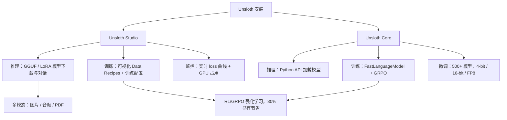

# Unsloth：本地 AI 训练与推理平台实操指南

## 一、学习目标

读完本文，你应该能够：

1. **理解核心价值**：解释 Unsloth 实现 2 倍训练速度、70%显存节省的技术原理（Triton 内核 + 4-bit QLoRA 量化）
2. **区分两条主线**：根据场景选择 Unsloth Studio（Web UI）或 Unsloth Core（Python 包）
3. **完成微调全流程**：从安装、加载 4-bit 模型、准备数据、配置训练参数到保存推理，完整走通
4. **选择训练模式**：根据硬件条件（GPU 型号、显存大小）在 16-bit、4-bit QLoRA、FP8、RL/GRPO 之间做取舍
5. **预估显存需求**：对任意给定模型和精度，查表并计算出训练/推理的最低显存要求

---

## 二、目录

1. [系统总览](#系统总览)
2. [一个完整的微调任务长什么样](#一个完整的微调任务长什么样)
3. [推理：模型下载、对话与工具调用](#推理模型下载对话与工具调用)
4. [训练：500+ 模型，4 种精度](#训练 500-模型 4-种精度)
5. [模型支持](#模型支持)
6. [硬件与显存](#硬件与显存)
7. [安装与启动](#安装与启动)
8. [上游合作](#上游合作)
9. [社区与资源](#社区与资源)
10. [卸载](#卸载)
11. [十二、自测题](#十二自测题)
12. [十三、练习](#十三练习)
13. [十四、进阶路径](#十四进阶路径)
14. [十五、资料口径说明](#十五资料口径说明)
15. [你应该怎么开始](#你应该怎么开始)

---

在消费级 GPU 上跑模型的人，总会碰到同一个问题：显存不够。买更大显存的卡要花钱，上云要花钱，换更小的模型意味着牺牲效果。Unsloth 做的事很直接——在不换硬件的前提下，让训练快一倍、显存占用量砍到三成，而且不靠黑魔法，靠的是手动写的 Triton 内核和 4-bit QLoRA 量化。

这正是它拿到 61k Stars 的原因。Yann LeCun 点了赞，HuggingFace TRL 团队在合作优化，Qwen / Llama 4 / Mistral / Gemma 团队直接跟它修 bug。但 Stars 只说明有人关注，真正决定你该不该用的，是下面这张图。

## 系统总览

Unsloth 内部其实是两条独立的主线，共用一个安装入口：



- **Studio**：Web UI，适合不想写代码的场景——搜模型、下载、对话、拖数据进去微调，全程在浏览器里完成。
- **Core**：Python 包，适合要把训练流程嵌进脚本或 CI 的人——`FastLanguageModel` + `GRPOConfig` 两行起手，剩下的交给内核优化。

两条线共享同一套加速内核，所以无论选哪个入口，2 倍速和 70% 显存节省都在。

## 一个完整的微调任务长什么样

在讨论功能列表之前，先看一个真实路径：给 Gemma 3 4B 做一次 4-bit 微调。

**1. 安装 Core**

```bash
curl -LsSf https://astral.sh/uv/install.sh | sh
uv venv unsloth_env --python 3.13
source unsloth_env/bin/activate
uv pip install unsloth --torch-backend=auto
```

**2. 加载模型（4-bit 量化）**

```python
from unsloth import FastLanguageModel

model, tokenizer = FastLanguageModel.from_pretrained(
    model_name="unsloth/gemma-3-4b-it",
    max_seq_length=2048,
    load_in_4bit=True,
)
```

这一步里，Unsloth 的自定义 Triton 内核接管了 PyTorch 的默认算子。原始 Gemma 3 4B 在 16-bit 下需要约 8 GB 显存，4-bit 量化后降到约 3 GB——多出来的 5 GB 可以塞上下文或更大的 batch。

**3. 准备数据**

```python
from datasets import load_dataset

dataset = load_dataset("json", data_files="my_data.jsonl", split="train")
```

也可以用 Studio 的 Data Recipes：上传 PDF、CSV 或 DOCX，在可视化界面里编辑节点，导出为训练集。

**4. 配置并启动训练**

```python
from unsloth import unsloth_train
from transformers import TrainingArguments

training_args = TrainingArguments(
    output_dir="./gemma3-finetuned",
    per_device_train_batch_size=4,
    gradient_accumulation_steps=4,
    num_train_epochs=3,
    learning_rate=2e-4,
    fp16=not model.config.to_dict().get("load_in_4bit"),
)

trainer = unsloth_train(model, tokenizer, dataset, training_args)
trainer.train()
```

**5. 保存并推理**

```python
model.save_pretrained("./gemma3-finetuned")
tokenizer.save_pretrained("./gemma3-finetuned")

FastLanguageModel.for_inference(model)
inputs = tokenizer(["你好，请介绍一下自己"], return_tensors="pt").to("cuda")
outputs = model.generate(**inputs, max_new_tokens=128)
```

这五步走完，你得到的是一个在自己数据上微调过的 Gemma 3 4B，全程显存峰值不超过 6 GB——一张 RTX 3060 就够。

---

## 推理：模型下载、对话与工具调用

### 模型搜索与下载

Studio 内置模型搜索，支持 GGUF、LoRA 适配器和 safetensors 三种格式。搜索到模型后一键下载到本地 `~/.cache/huggingface/hub/`，不用手动处理 HuggingFace 的 LFS。

如果只用 Core，也可以直接写：

```python
from unsloth import FastLanguageModel

model, tokenizer = FastLanguageModel.from_pretrained(
    model_name="unsloth/Llama-3.1-8B-bnb-4bit",
    load_in_4bit=True,
)
```

格式选择的经验法则：

| 格式 | 适用场景 | 占用 |
|------|---------|------|
| GGUF | 纯推理，想要最小显存 | 最小 |
| LoRA 适配器 | 在基础模型上叠加多个任务切换 | 极小（几 MB） |
| safetensors | 完整模型，训练或推理都需要 | 完整大小 |

### 工具调用与代码执行

Unsloth 的 Agent 接口支持 self-healing tool calling——工具调用出错时自动重试修正，而不是直接抛异常。

```python
agent = Agent(tools=["web_search", "calculator"])
result = await agent.run("搜索最新的 AI 新闻，然后计算 1000 的 15%")
```

代码执行跑在沙盒里，类似 Claude Artifacts 的体验：

```python
agent = Agent(tools=["code_execution"])
result = await agent.run("写一段 Python 打印斐波那契数列前 20 项并运行")
```

### 多模态

上传图片、音频、PDF、DOCX 后直接对话。底层由模型自身多模态能力支撑——Unsloth 负责把文件转成模型能消费的格式，不额外加一层代理。

---

## 训练：500+ 模型，4 种精度

### 训练模式对比

Unsloth 支持的训练精度和适用场景：

| 模式 | 显存需求 (7B 模型) | 适用场景 | 精度影响 |
|------|-------------------|---------|---------|
| 16-bit Full | ~14 GB | 追求最高精度，有 A100/H100 | 基准 |
| 4-bit QLoRA | ~6 GB | 消费级 GPU，个人微调 | 实测无明显损失 |
| FP8 | ~8 GB | Ada/Blackwell 架构，兼顾速度与精度 | 极小 |
| RL / GRPO | ~4 GB (在 4-bit 上再省 80%) | 强化学习微调 | 训练阶段量化，推理可恢复 16-bit |

GRPO 的 80% 显存节省不是独立数字——它叠在 4-bit 量化之上。对 7B 模型，16-bit RL 原本需要约 20 GB，切成 4-bit 再跑 GRPO 后降到 4 GB 以内，这才是消费级 GPU 能跑强化学习的原因。

### 自定义 Triton 内核为什么快

PyTorch 默认的线性代数算子（矩阵乘、注意力计算）是按通用场景写的。Unsloth 为每个模型家族手写了 Triton 内核——针对 Gemma、Qwen、Llama 各自的注意力模式和 FFN 结构做了特化。效果是：同样的矩阵乘法，少掉 30%-50% 的中间张量分配，省下的显存可以拉大 batch size 或上下文长度。

```python
from unsloth import FastLanguageModel

model, tokenizer = FastLanguageModel.from_pretrained(
    model_name="unsloth/gemma-3-4b-it",
    max_seq_length=2048,
    load_in_4bit=True,
)
# 这行 import 背后已经替换了 PyTorch 默认算子
```

### 免费 Notebooks 性能表——这些数字在测什么

下面这张表来自 Unsloth 官方免费 Colab Notebooks。但只看数字容易误判，先解释一下测量对象：

- **faster / less VRAM** 的基准线是 HuggingFace Transformers 的默认 Trainer + 对应精度。测的是同一个模型、同一批数据、同样 epoch 下的训练吞吐和显存峰值。
- 数字反映的是 **Unsloth Triton 内核 + 量化方案的联合优化**，不能直接推出"比所有框架都快"。
- 显存节省百分比是在该精度下的相对值，不是绝对值——4-bit 本身已经省了 70%，在此基础上 GRPO 再省 80% 指的是 RL 训练阶段的额外优化。

| 模型 | 加速 | 显存节省 |
|------|------|----------|
| Gemma 4 (E2B) | 1.5x | 50% |
| Qwen3.5 (4B) | 1.5x | 60% |
| gpt-oss (20B) | 2x | 70% |
| gpt-oss RL | 2x | 80% |
| Qwen3 GSPO | 2x | 70% |
| Llama 3.1 (8B) | 2x | 70% |
| embedding-gemma (300M) | 2x | 20% |
| Mistral Ministral 3 (3B) | 1.5x | 60% |

embedding-gemma 只省 20% 是合理的：embedding 模型的核心计算在 token embedding 层，矩阵乘占比低，Triton 内核的优化空间本来就小。

---

## 模型支持

Unsloth 不是"兼容 500+ 模型"，而是为每个模型家族写了专用内核。这意味着加一个新模型家族需要专门适配，不是换个 config 就行。当前已适配的家族：

| 模型家族 | 代表模型 | 适配特色 |
|---------|---------|---------|
| Gemma | Gemma 4 (E2B), Gemma 3 | Google 最新，完整支持 |
| Qwen | Qwen3.5 (0.8B-112B), Qwen3 GSPO | 阿里开源，支持 GSPO 强化学习 |
| Llama | Llama 3.1/3.2 (8B-405B) | Meta 开源，2x 加速 |
| DeepSeek | DeepSeek V3, Coder | 国产模型，完整适配 |
| Mistral | Mistral, Ministral 3 | 欧洲团队，1.5x 加速 |
| gpt-oss | OpenAI o1/o3 开源复现 | Unsloth 参与合作 |
| Phi | Phi-4 | 微软小模型 |
| Embedding | embedding-gemma | 向量模型，2x 加速 |

---

## 硬件与显存

### 平台支持

| 平台 | 训练 | 推理 | 备注 |
|------|:----:|:----:|------|
| NVIDIA GPU (RTX 30/40/50, Blackwell, DGX) | ✅ | ✅ | 全功能 |
| AMD GPU | ✅ | ✅ | 仅 Core，无 Studio |
| Intel GPU | 即将 | ✅ | — |
| Apple MLX | 即将 | 即将 | — |
| macOS | 即将 | ✅ | Metal 加速 |
| CPU | ❌ | ✅ | 纯推理可用 |

AMD 用户注意：训练走 Core 没问题，Studio UI 目前只支持 NVIDIA。

### 显存需求速查

| 模型大小 | 4-bit 训练 | 16-bit 训练 | 4-bit 推理 |
|---------|-----------|------------|-----------|
| 3B | ~4 GB | ~8 GB | ~2 GB |
| 7B | ~6 GB | ~14 GB | ~4 GB |
| 13B | ~10 GB | ~26 GB | ~7 GB |
| 20B | ~14 GB | ~40 GB | ~10 GB |
| 70B | ~48 GB | ~140 GB | ~35 GB |

这张表的前提是 `max_seq_length=2048`。上下文越长，KV cache 吃显存越多，实际需求会往上浮动。

---

## 安装与启动

### Studio（Web UI）

macOS / Linux / WSL：

```bash
curl -fsSL https://unsloth.ai/install.sh | sh
```

Windows：

```powershell
irm https://unsloth.ai/install.ps1 | iex
```

启动（默认端口 8888）：

```bash
unsloth studio -H 0.0.0.0 -p 8888
```

更新：

```bash
unsloth studio update
```

### Core（Python 包）

Linux / WSL：

```bash
curl -LsSf https://astral.sh/uv/install.sh | sh
uv venv unsloth_env --python 3.13
source unsloth_env/bin/activate
uv pip install unsloth --torch-backend=auto
```

Windows：

```powershell
winget install -e --id Python.Python.3.13
winget install --id=astral-sh.uv -e
uv venv unsloth_env --python 3.13
.\unsloth_env\Scripts\activate
uv pip install unsloth --torch-backend=auto
```

### Docker

```bash
docker run -d \
  -e JUPYTER_PASSWORD="mypassword" \
  -p 8888:8888 -p 8000:8000 -p 2222:22 \
  -v $(pwd)/work:/workspace/work \
  --gpus all \
  unsloth/unsloth
```

### 开发者安装

从源码安装，切 nightly 分支可以体验最新特性：

```bash
git clone https://github.com/unslothai/unsloth
cd unsloth
./install.sh --local
unsloth studio -H 0.0.0.0 -p 8888
```

---

## 上游合作

Unsloth 跟模型团队的协作不是"提 issue 等 merge"这种松散模式，而是直接修 bug——发现模型在 GGUF 转换、128K 上下文或特定硬件上的问题后，把修复推到上游。所以它的内核适配能跟模型发布几乎同步：

- **gpt-oss**：联合修复 bug，提升复现准确性
- **Qwen3**：修复动态 GGUF 128K 上下文的截断 bug
- **Llama 4 / Mistral / Gemma 1-3 / Phi-4**：训练和推理阶段的问题修复

---

## 社区与资源

| 资源 | 链接 |
|------|------|
| Discord | https://discord.com/invite/unsloth |
| Twitter | https://twitter.com/unslothai |
| Reddit | https://reddit.com/r/unsloth |
| 文档 | https://unsloth.ai/docs |
| 模型目录 | https://unsloth.ai/docs/get-started/unsloth-model-catalog |
| 免费 Notebooks | https://colab.research.google.com/github/unslothai/notebooks |
| 官方博客 | https://unsloth.ai/blog |

---

## 卸载

```bash
# Studio
rm -rf ~/.unsloth/studio

# 下载的模型文件
rm -rf ~/.cache/huggingface/hub/
```

---


---

## 十二、自测题

1. **Unsloth 的 2 倍训练和 70% 显存节省主要来自哪两项技术？**
   <details>
   <summary>查看答案</summary>
   正确答案：Triton 自定义内核 + 4-bit QLoRA 量化。Triton 内核针对每个模型家族手写矩阵乘和注意力计算，减少 30%-50%中间张量分配；4-bit 量化把权重从 FP16 压缩到 4-bit，显存占用降到原来的 30% 左右。
   </details>

2. **什么时候应该选 Studio，什么时候应该选 Core？**
   <details>
   <summary>查看答案</summary>
   正确答案：不想写代码、需要可视化界面搜模型、拖数据做微调 → 选 Studio；要把训练流程嵌进脚本或 CI、需要编程灵活性 → 选 Core。两者共享同一套加速内核，速度和显存节省一致。
   </details>

3. **GRPO 的「80% 额外显存节省」是相对于什么的 80%？**
   <details>
   <summary>查看答案</summary>
   正确答案：是在 4-bit 量化基础上的额外节省。先通过 4-bit QLoRA 把显存降到原来的 30%，再在训练阶段用 GRPO 的强化学习优化，再省 80% 的训练时显存，最终可以做到 7B 模型 RL 训练只需 4 GB 显存。
   </details>

4. **消费级 GPU（如 RTX 3060 8GB）能跑 7B 模型的 4-bit 微调吗？需要什么额外配置？**
   <details>
   <summary>查看答案</summary>
   正确答案：可以。7B 模型 4-bit 训练约需 6 GB 显存，RTX 3060 8GB 够用。需要注意：设置 `max_seq_length=2048`（不要盲目设 8192，会爆显存），`per_device_train_batch_size=2` 或 `4` 配合梯度累积。
   </details>

5. **Unsloth 的模型适配是「即插即用」还是「逐家族适配」？如果你用的模型不在适配列表里，应该怎么办？**
   <details>
   <summary>查看答案</summary>
   正确答案：逐家族适配——每个模型家族（Gemma/Qwen/Llama/...）都需要单独写 Triton 内核，不是换个 config 就能用的。如果模型不在适配列表：① 等官方适配（关注 GitHub 进展）；② 自己写内核（需要 CUDA + Triton 经验）；③ 先用 HuggingFace Transformers 的默认算子跑，只是享受不到加速。
   </details>

---


## 十三、练习

### 练习 1：用你自己的数据微调 Gemma 3 4B
**任务**：准备一个包含 50 条指令-响应对的 JSONL 文件，用 Unsloth 做 4-bit 微调，观察显存占用。
<details>
<summary>参考答案（关键步骤）</summary>

```python
from datasets import load_dataset
dataset = load_dataset("json", data_files="my_data.jsonl", split="train")
# 关键：检查数据格式是否符合模型期望的对话模板
# Gemma 3 格式："<start_of_turn>user
...
<end_of_turn>
<start_of_turn>model
...
<end_of_turn>"
```
</details>

### 练习 2：对比 16-bit 和 4-bit 的显存占用
**任务**：用同一份数据，分别用 16-bit 全参数微调和 4-bit QLoRA 微调，记录峰值显存。
<details>
<summary>参考答案（预期结果）</summary>

- 16-bit 全参数：7B 模型约 14 GB，需要 RTX 4070 (12GB) 或更高
- 4-bit QLoRA：7B 模型约 6 GB，RTX 3060 (8GB) 就能跑
- 结论：4-bit 量化的显存节省是真实的，不是 benchmark 玩具数字。
</details>

### 练习 3：把一个微调后的模型转成 GGUF 并本地推理
**任务**：把微调后的模型保存，转成 GGUF 格式，用 llama.cpp 或 ollama 本地加载推理。
<details>
<summary>参考答案（关键命令）</summary>

```bash
# 转 GGUF
python convert.py --input ./gemma3-finetuned --output ./gemma3-finetuned-Q4_K_M.gguf --quant Q4_K_M

# 用 ollama 加载
ollama create gemma3-finetuned -f Modelfile
ollama run gemma3-finetuned "请介绍一下你自己"
```
</details>

---


## 十四、进阶路径

1. **深入 Triton 内核**：读 Unsloth 源码中针对 Gemma/Qwen/Llama 的 Triton 内核实现，理解为什么手写内核比 PyTorch 默认算子快。
2. **复现 benchmark**：在自己的 GPU 上跑官方 Colab notebooks，对比 Unsloth vs HuggingFace Transformers 的吞吐和显存峰值。
3. **做 RLHF/GRPO**：用自己的奖励函数，在 4-bit 量化基础上跑 GRPO，验证 80% 额外显存节省。
4. **贡献新模型适配**：如果你在用一个不在列表里的模型，尝试为它写 Triton 内核，提 PR 到 Unsloth。
5. **集成到 CI/CD**：把微调流程写成脚本，每次数据更新后自动重训，用 Unsloth Core 的 Python API 嵌进流水线。
6. **多模态扩展**：尝试用 Unsloth 微调支持多模态的模型（图片/音频输入），理解多模态数据的处理和显存需求。
7. **分布式训练**：如果单卡显存不够，研究 Unsloth 对 FSDP/DeepSpeed 的支持，扩展到大模型微调。

---


## 十五、资料口径说明

1. **信息来源与时效性**：本文基于 Unsloth 官方文档、GitHub README、免费 Colab notebooks（2026-04 版本），以及项目 Stars 数、合作团队等公开信息。AI 工具链迭代极快，3 个月后部分命令、API、显存占用数据可能已有更新——请以官方最新文档为准。
2. **技术细节验证**：文中「2 倍速度」「70% 显存节省」「GRPO 额外 80% 节省」等数字来自官方 benchmark，测试条件是特定模型、特定 GPU、特定 batch size。你的实际环境（数据长度分布、GPU 架构、CUDA 版本）可能得到不同结果，建议用自己的硬件跑一次官方 notebook 验证。
3. **判断与建议的边界**：文中「谁应该先上」「谁不用急着上」等建议是基于一般经验的判断，不是绝对规则。如果你有特殊需求（比如一定要 16-bit 精度、一定要在某个冷门 GPU 上跑），请以自己的 benchmark 结果为准。
4. **未覆盖的内容**：本文未深入讲解 RLHF/GRPO 的奖励函数设计、多模态数据的预处理、分布式训练的配置、生产环境的模型部署和监控。这些话题每个都可以单独写一篇长文。
5. **术语使用说明**：本文交替使用了「Unsloth」「unsloth」（GitHub 组织名）、「Studio」「Core」等术语。首次出现时都加了说明，后文为简洁会混用，遇到不确定的时候回 §1 系统总览确认。
6. **更新记录**：2026-04-12 初版，基于 Unsloth v0.1.36-beta。如果你读到的版本和本文有较大差异，可能是 Unsloth 已经发版更新，而本文尚未同步。

---

## 你应该怎么开始

按场景选入口：

| 你的情况 | 起点 | 下一步 |
|---------|------|--------|
| 想先体验，不想写代码 | 安装 Studio → 搜 Gemma 3 4B → 对话 | 对效果满意后再用 Data Recipes 微调 |
| 已有训练脚本，想加速 | Core + 4-bit QLoRA | 把你的 Trainer 换成 `unsloth_train`，开 4-bit |
| 做 RLHF / GRPO | Core + GRPOConfig | 从 4-bit 起步，显存够再切 16-bit |
| 只用推理 | Studio 或 Core GGUF | 不用装训练依赖 |
| AMD GPU | Core（无 Studio） | 训练和推理都走 Python API |
| 只有 CPU | Studio（仅推理） | 不用考虑训练 |

**谁先上**：
- 个人开发者、学生、在 RTX 3060/4060/4070 上做实验的人——4-bit QLoRA 是为你设计的。
- 做 RLHF 的小团队——GRPO 的 80% 额外显存节省直接决定能不能在单卡上跑。

**谁不用急着上**：
- 已经在 A100/H100 上跑 16-bit 全参微调的——Unsloth 的 Triton 内核在高端卡上加速幅度会收窄（显存充裕时，内存带宽优化收益不如消费卡明显）。
- 只用 API 调模型、不做本地微调的——你不需要训练框架。
- 模型不在适配列表里的——除非你愿意等适配或自己写内核。

---

_本文基于 Unsloth v0.1.36-beta (2026-04-08)，61k Stars，Apache-2.0 / AGPL-3.0 许可证。_