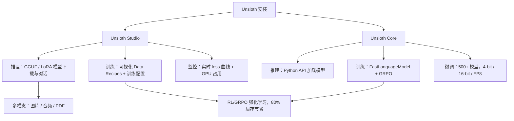

# Unsloth：本地 AI 训练与推理平台实操指南

在消费级 GPU 上跑模型的人，总会碰到同一个问题：显存不够。买更大显存的卡要花钱，上云要花钱，换更小的模型意味着牺牲效果。Unsloth 做的事很直接——在不换硬件的前提下，让训练快一倍、显存占用量砍到三成，而且不靠黑魔法，靠的是手动写的 Triton 内核和 4-bit QLoRA 量化。

这正是它拿到 61k Stars 的原因。Yann LeCun 点了赞，HuggingFace TRL 团队在合作优化，Qwen / Llama 4 / Mistral / Gemma 团队直接跟它修 bug。但 Stars 只说明有人关注，真正决定你该不该用的，是下面这张图。

## 系统总览

Unsloth 内部其实是两条独立的主线，共用一个安装入口：



- **Studio**：Web UI，适合不想写代码的场景——搜模型、下载、对话、拖数据进去微调，全程在浏览器里完成。
- **Core**：Python 包，适合要把训练流程嵌进脚本或 CI 的人——`FastLanguageModel` + `GRPOConfig` 两行起手，剩下的交给内核优化。

两条线共享同一套加速内核，所以无论选哪个入口，2 倍速和 70% 显存节省都在。

## 一个完整的微调任务长什么样

在讨论功能列表之前，先看一个真实路径：给 Gemma 3 4B 做一次 4-bit 微调。

**1. 安装 Core**

```bash
curl -LsSf https://astral.sh/uv/install.sh | sh
uv venv unsloth_env --python 3.13
source unsloth_env/bin/activate
uv pip install unsloth --torch-backend=auto
```

**2. 加载模型（4-bit 量化）**

```python
from unsloth import FastLanguageModel

model, tokenizer = FastLanguageModel.from_pretrained(
    model_name="unsloth/gemma-3-4b-it",
    max_seq_length=2048,
    load_in_4bit=True,
)
```

这一步里，Unsloth 的自定义 Triton 内核接管了 PyTorch 的默认算子。原始 Gemma 3 4B 在 16-bit 下需要约 8 GB 显存，4-bit 量化后降到约 3 GB——多出来的 5 GB 可以塞上下文或更大的 batch。

**3. 准备数据**

```python
from datasets import load_dataset

dataset = load_dataset("json", data_files="my_data.jsonl", split="train")
```

也可以用 Studio 的 Data Recipes：上传 PDF、CSV 或 DOCX，在可视化界面里编辑节点，导出为训练集。

**4. 配置并启动训练**

```python
from unsloth import unsloth_train
from transformers import TrainingArguments

training_args = TrainingArguments(
    output_dir="./gemma3-finetuned",
    per_device_train_batch_size=4,
    gradient_accumulation_steps=4,
    num_train_epochs=3,
    learning_rate=2e-4,
    fp16=not model.config.to_dict().get("load_in_4bit"),
)

trainer = unsloth_train(model, tokenizer, dataset, training_args)
trainer.train()
```

**5. 保存并推理**

```python
model.save_pretrained("./gemma3-finetuned")
tokenizer.save_pretrained("./gemma3-finetuned")

FastLanguageModel.for_inference(model)
inputs = tokenizer(["你好，请介绍一下自己"], return_tensors="pt").to("cuda")
outputs = model.generate(**inputs, max_new_tokens=128)
```

这五步走完，你得到的是一个在自己数据上微调过的 Gemma 3 4B，全程显存峰值不超过 6 GB——一张 RTX 3060 就够。

---

## 推理：模型下载、对话与工具调用

### 模型搜索与下载

Studio 内置模型搜索，支持 GGUF、LoRA 适配器和 safetensors 三种格式。搜索到模型后一键下载到本地 `~/.cache/huggingface/hub/`，不用手动处理 HuggingFace 的 LFS。

如果只用 Core，也可以直接写：

```python
from unsloth import FastLanguageModel

model, tokenizer = FastLanguageModel.from_pretrained(
    model_name="unsloth/Llama-3.1-8B-bnb-4bit",
    load_in_4bit=True,
)
```

格式选择的经验法则：

| 格式 | 适用场景 | 占用 |
|------|---------|------|
| GGUF | 纯推理，想要最小显存 | 最小 |
| LoRA 适配器 | 在基础模型上叠加多个任务切换 | 极小（几 MB） |
| safetensors | 完整模型，训练或推理都需要 | 完整大小 |

### 工具调用与代码执行

Unsloth 的 Agent 接口支持 self-healing tool calling——工具调用出错时自动重试修正，而不是直接抛异常。

```python
agent = Agent(tools=["web_search", "calculator"])
result = await agent.run("搜索最新的 AI 新闻，然后计算 1000 的 15%")
```

代码执行跑在沙盒里，类似 Claude Artifacts 的体验：

```python
agent = Agent(tools=["code_execution"])
result = await agent.run("写一段 Python 打印斐波那契数列前 20 项并运行")
```

### 多模态

上传图片、音频、PDF、DOCX 后直接对话。底层由模型自身多模态能力支撑——Unsloth 负责把文件转成模型能消费的格式，不额外加一层代理。

---

## 训练：500+ 模型，4 种精度

### 训练模式对比

Unsloth 支持的训练精度和适用场景：

| 模式 | 显存需求 (7B 模型) | 适用场景 | 精度影响 |
|------|-------------------|---------|---------|
| 16-bit Full | ~14 GB | 追求最高精度，有 A100/H100 | 基准 |
| 4-bit QLoRA | ~6 GB | 消费级 GPU，个人微调 | 实测无明显损失 |
| FP8 | ~8 GB | Ada/Blackwell 架构，兼顾速度与精度 | 极小 |
| RL / GRPO | ~4 GB (在 4-bit 上再省 80%) | 强化学习微调 | 训练阶段量化，推理可恢复 16-bit |

GRPO 的 80% 显存节省不是独立数字——它叠在 4-bit 量化之上。对 7B 模型，16-bit RL 原本需要约 20 GB，切成 4-bit 再跑 GRPO 后降到 4 GB 以内，这才是消费级 GPU 能跑强化学习的原因。

### 自定义 Triton 内核为什么快

PyTorch 默认的线性代数算子（矩阵乘、注意力计算）是按通用场景写的。Unsloth 为每个模型家族手写了 Triton 内核——针对 Gemma、Qwen、Llama 各自的注意力模式和 FFN 结构做了特化。效果是：同样的矩阵乘法，少掉 30%-50% 的中间张量分配，省下的显存可以拉大 batch size 或上下文长度。

```python
from unsloth import FastLanguageModel

model, tokenizer = FastLanguageModel.from_pretrained(
    model_name="unsloth/gemma-3-4b-it",
    max_seq_length=2048,
    load_in_4bit=True,
)
# 这行 import 背后已经替换了 PyTorch 默认算子
```

### 免费 Notebooks 性能表——这些数字在测什么

下面这张表来自 Unsloth 官方免费 Colab Notebooks。但只看数字容易误判，先解释一下测量对象：

- **faster / less VRAM** 的基准线是 HuggingFace Transformers 的默认 Trainer + 对应精度。测的是同一个模型、同一批数据、同样 epoch 下的训练吞吐和显存峰值。
- 数字反映的是 **Unsloth Triton 内核 + 量化方案的联合优化**，不能直接推出"比所有框架都快"。
- 显存节省百分比是在该精度下的相对值，不是绝对值——4-bit 本身已经省了 70%，在此基础上 GRPO 再省 80% 指的是 RL 训练阶段的额外优化。

| 模型 | 加速 | 显存节省 |
|------|------|----------|
| Gemma 4 (E2B) | 1.5x | 50% |
| Qwen3.5 (4B) | 1.5x | 60% |
| gpt-oss (20B) | 2x | 70% |
| gpt-oss RL | 2x | 80% |
| Qwen3 GSPO | 2x | 70% |
| Llama 3.1 (8B) | 2x | 70% |
| embedding-gemma (300M) | 2x | 20% |
| Mistral Ministral 3 (3B) | 1.5x | 60% |

embedding-gemma 只省 20% 是合理的：embedding 模型的核心计算在 token embedding 层，矩阵乘占比低，Triton 内核的优化空间本来就小。

---

## 模型支持

Unsloth 不是"兼容 500+ 模型"，而是为每个模型家族写了专用内核。这意味着加一个新模型家族需要专门适配，不是换个 config 就行。当前已适配的家族：

| 模型家族 | 代表模型 | 适配特色 |
|---------|---------|---------|
| Gemma | Gemma 4 (E2B), Gemma 3 | Google 最新，完整支持 |
| Qwen | Qwen3.5 (0.8B-112B), Qwen3 GSPO | 阿里开源，支持 GSPO 强化学习 |
| Llama | Llama 3.1/3.2 (8B-405B) | Meta 开源，2x 加速 |
| DeepSeek | DeepSeek V3, Coder | 国产模型，完整适配 |
| Mistral | Mistral, Ministral 3 | 欧洲团队，1.5x 加速 |
| gpt-oss | OpenAI o1/o3 开源复现 | Unsloth 参与合作 |
| Phi | Phi-4 | 微软小模型 |
| Embedding | embedding-gemma | 向量模型，2x 加速 |

---

## 硬件与显存

### 平台支持

| 平台 | 训练 | 推理 | 备注 |
|------|:----:|:----:|------|
| NVIDIA GPU (RTX 30/40/50, Blackwell, DGX) | ✅ | ✅ | 全功能 |
| AMD GPU | ✅ | ✅ | 仅 Core，无 Studio |
| Intel GPU | 即将 | ✅ | — |
| Apple MLX | 即将 | 即将 | — |
| macOS | 即将 | ✅ | Metal 加速 |
| CPU | ❌ | ✅ | 纯推理可用 |

AMD 用户注意：训练走 Core 没问题，Studio UI 目前只支持 NVIDIA。

### 显存需求速查

| 模型大小 | 4-bit 训练 | 16-bit 训练 | 4-bit 推理 |
|---------|-----------|------------|-----------|
| 3B | ~4 GB | ~8 GB | ~2 GB |
| 7B | ~6 GB | ~14 GB | ~4 GB |
| 13B | ~10 GB | ~26 GB | ~7 GB |
| 20B | ~14 GB | ~40 GB | ~10 GB |
| 70B | ~48 GB | ~140 GB | ~35 GB |

这张表的前提是 `max_seq_length=2048`。上下文越长，KV cache 吃显存越多，实际需求会往上浮动。

---

## 安装与启动

### Studio（Web UI）

macOS / Linux / WSL：

```bash
curl -fsSL https://unsloth.ai/install.sh | sh
```

Windows：

```powershell
irm https://unsloth.ai/install.ps1 | iex
```

启动（默认端口 8888）：

```bash
unsloth studio -H 0.0.0.0 -p 8888
```

更新：

```bash
unsloth studio update
```

### Core（Python 包）

Linux / WSL：

```bash
curl -LsSf https://astral.sh/uv/install.sh | sh
uv venv unsloth_env --python 3.13
source unsloth_env/bin/activate
uv pip install unsloth --torch-backend=auto
```

Windows：

```powershell
winget install -e --id Python.Python.3.13
winget install --id=astral-sh.uv -e
uv venv unsloth_env --python 3.13
.\unsloth_env\Scripts\activate
uv pip install unsloth --torch-backend=auto
```

### Docker

```bash
docker run -d \
  -e JUPYTER_PASSWORD="mypassword" \
  -p 8888:8888 -p 8000:8000 -p 2222:22 \
  -v $(pwd)/work:/workspace/work \
  --gpus all \
  unsloth/unsloth
```

### 开发者安装

从源码安装，切 nightly 分支可以体验最新特性：

```bash
git clone https://github.com/unslothai/unsloth
cd unsloth
./install.sh --local
unsloth studio -H 0.0.0.0 -p 8888
```

---

## 上游合作

Unsloth 跟模型团队的协作不是"提 issue 等 merge"这种松散模式，而是直接修 bug——发现模型在 GGUF 转换、128K 上下文或特定硬件上的问题后，把修复推到上游。所以它的内核适配能跟模型发布几乎同步：

- **gpt-oss**：联合修复 bug，提升复现准确性
- **Qwen3**：修复动态 GGUF 128K 上下文的截断 bug
- **Llama 4 / Mistral / Gemma 1-3 / Phi-4**：训练和推理阶段的问题修复

---

## 社区与资源

| 资源 | 链接 |
|------|------|
| Discord | https://discord.com/invite/unsloth |
| Twitter | https://twitter.com/unslothai |
| Reddit | https://reddit.com/r/unsloth |
| 文档 | https://unsloth.ai/docs |
| 模型目录 | https://unsloth.ai/docs/get-started/unsloth-model-catalog |
| 免费 Notebooks | https://colab.research.google.com/github/unslothai/notebooks |
| 官方博客 | https://unsloth.ai/blog |

---

## 卸载

```bash
# Studio
rm -rf ~/.unsloth/studio

# 下载的模型文件
rm -rf ~/.cache/huggingface/hub/
```

---

## 你应该怎么开始

按场景选入口：

| 你的情况 | 起点 | 下一步 |
|---------|------|--------|
| 想先体验，不想写代码 | 安装 Studio → 搜 Gemma 3 4B → 对话 | 对效果满意后再用 Data Recipes 微调 |
| 已有训练脚本，想加速 | Core + 4-bit QLoRA | 把你的 Trainer 换成 `unsloth_train`，开 4-bit |
| 做 RLHF / GRPO | Core + GRPOConfig | 从 4-bit 起步，显存够再切 16-bit |
| 只用推理 | Studio 或 Core GGUF | 不用装训练依赖 |
| AMD GPU | Core（无 Studio） | 训练和推理都走 Python API |
| 只有 CPU | Studio（仅推理） | 不用考虑训练 |

**谁先上**：
- 个人开发者、学生、在 RTX 3060/4060/4070 上做实验的人——4-bit QLoRA 是为你设计的。
- 做 RLHF 的小团队——GRPO 的 80% 额外显存节省直接决定能不能在单卡上跑。

**谁不用急着上**：
- 已经在 A100/H100 上跑 16-bit 全参微调的——Unsloth 的 Triton 内核在高端卡上加速幅度会收窄（显存充裕时，内存带宽优化收益不如消费卡明显）。
- 只用 API 调模型、不做本地微调的——你不需要训练框架。
- 模型不在适配列表里的——除非你愿意等适配或自己写内核。

---

_本文基于 Unsloth v0.1.36-beta (2026-04-08)，61k Stars，Apache-2.0 / AGPL-3.0 许可证。_