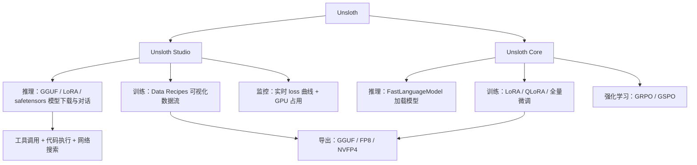

# Unsloth：本地 LLM 训练与推理加速平台

在消费级 GPU 上微调大模型，第一道坎永远是显存。全量微调 7B 模型要几十 GB 显存，大部分个人电脑没有这张卡。Unsloth 解决的就是这个问题：不换硬件，用 4-bit 量化把训练显存压到原来的三成，用自研 Triton 内核把速度提两倍。官方口径是 2 倍训练加速、70% 显存节省，不损失精度。

Unsloth 在 2023 年底以微调加速库开源，2026 年 3 月发布 Studio 之后升级为本地 AI 工作台。截至 2026 年 9 月，GitHub 星标约 7.6 万。它现在有三个入口：桌面应用 Unsloth Desktop、Web 界面 Unsloth Studio、Python 库 Unsloth Core，底层共享同一套加速内核。

## 三条入口：Desktop、Studio 与 Core

| 入口 | 形态 | 适合谁 |
|------|------|--------|
| Unsloth Desktop | 桌面应用，支持 macOS / Windows / Linux | 想开箱即用的个人用户 |
| Unsloth Studio | 浏览器里的 Web UI | 不想写代码，训练和推理都要 |
| Unsloth Core | Python 库，`pip install unsloth` | 要把训练流程写进脚本或 CI 的工程师 |

Studio 和 Core 的分工最值得展开：


```mermaid
graph TD
    A[Unsloth] --> B[Unsloth Studio]
    A --> C[Unsloth Core]
    B --> D[推理：GGUF / LoRA / safetensors 模型下载与对话]
    B --> E[训练：Data Recipes 可视化数据流]
    B --> F[监控：实时 loss 曲线 + GPU 占用]
    C --> G[推理：FastLanguageModel 加载模型]
    C --> H[训练：LoRA / QLoRA / 全量微调]
    C --> I[强化学习：GRPO / GSPO]
    D --> J[工具调用 + 代码执行 + 网络搜索]
    E --> K[导出：GGUF / FP8 / NVFP4]
    H --> K
```

- **Studio**：搜模型、下载、对话、拖数据进去微调，全程浏览器操作。Data Recipes 能把 PDF、CSV、DOCX 拖成训练集，训练时实时看 loss 曲线和 GPU 占用。
- **Core**：`FastLanguageModel` 两行起手，剩下的交给内核优化。适合要复现、要自动化的人。

两条线共享同一套加速内核，2 倍速和 70% 显存节省在哪个入口都一样。

## 一个完整的微调任务长什么样

下面给 Gemma 3 4B 做一次 4-bit QLoRA 微调，走 Core。

**1. 安装 Core**

```bash
curl -LsSf https://astral.sh/uv/install.sh | sh
uv venv unsloth_env --python 3.13
source unsloth_env/bin/activate
uv pip install unsloth --torch-backend=auto
```

**2. 加载模型并注入 LoRA 适配器**

```python
from unsloth import FastLanguageModel, is_bfloat16_supported

model, tokenizer = FastLanguageModel.from_pretrained(
    model_name="unsloth/gemma-3-4b-it",
    max_seq_length=2048,
    load_in_4bit=True,
)

model = FastLanguageModel.get_peft_model(
    model,
    r=16,
    lora_alpha=16,
    target_modules=["q_proj", "k_proj", "v_proj", "o_proj",
                    "gate_proj", "up_proj", "down_proj"],
    use_gradient_checkpointing="unsloth",
    random_state=3407,
)
```

`from_pretrained` 加载时，Unsloth 的自研 Triton 内核已经接管了 PyTorch 默认算子。官方最低显存表中，3B 档 4-bit 训练约 3.5 GB、16-bit 约 8 GB，4B 级模型会略高一些。`get_peft_model` 这一步挂上 LoRA 适配器，训练时只更新适配器参数，不碰基座权重。

**3. 准备数据**

```python
from datasets import load_dataset

dataset = load_dataset("json", data_files="my_data.jsonl", split="train")
```

想让模型学会对话，数据最好是「问题 + 回答」的结构。也可以直接在 Studio 的 Data Recipes 里上传 PDF、CSV、DOCX，可视化编辑节点后导出训练集。

**4. 用 SFTTrainer 启动训练**

```python
from trl import SFTTrainer
from transformers import TrainingArguments

trainer = SFTTrainer(
    model=model,
    tokenizer=tokenizer,
    train_dataset=dataset,
    dataset_text_field="text",
    max_seq_length=2048,
    args=TrainingArguments(
        per_device_train_batch_size=2,
        gradient_accumulation_steps=4,
        warmup_steps=10,
        max_steps=60,
        fp16=not is_bfloat16_supported(),
        bf16=is_bfloat16_supported(),
        logging_steps=1,
        output_dir="outputs",
        optim="adamw_8bit",
        seed=3407,
    ),
)
trainer.train()
```

训练走的是 HuggingFace 生态的标准 `SFTTrainer`（来自 trl 库），Unsloth 的加速发生在底层算子，不需要改训练接口。`is_bfloat16_supported` 帮你自动选 fp16 还是 bf16。

**5. 保存并推理**

```python
model.save_pretrained("./gemma3-finetuned")
tokenizer.save_pretrained("./gemma3-finetuned")

FastLanguageModel.for_inference(model)
inputs = tokenizer(["你好，请介绍一下自己"], return_tensors="pt").to("cuda")
outputs = model.generate(**inputs, max_new_tokens=128)
```

`save_pretrained` 保存的是几 MB 的 LoRA 适配器，部署时叠加回基座模型即可。五步走完，你得到的是一个在自己数据上微调过的 Gemma 3 4B，全程 4-bit 训练显存峰值约 3.5 GB，12 GB 显存的 RTX 3060 就能跑。

---

## 推理：模型下载、对话与工具调用

### 模型搜索与下载

Studio 内置模型搜索，支持 GGUF、LoRA 适配器、safetensors 三种格式。搜到模型后一键下载到本地 HuggingFace 缓存目录（`~/.cache/huggingface/hub/`），不用手动处理 LFS。

只用 Core 也能加载，写法一致：

```python
from unsloth import FastLanguageModel

model, tokenizer = FastLanguageModel.from_pretrained(
    model_name="unsloth/Llama-3.1-8B-bnb-4bit",
    load_in_4bit=True,
)
```

格式选择的经验法则：

| 格式 | 适用场景 | 占用 |
|------|---------|------|
| GGUF | 纯推理，想要最小显存 | 最小 |
| LoRA 适配器 | 在基础模型上叠加多个任务切换 | 极小（几 MB） |
| safetensors | 完整模型，训练或推理都需要 | 完整大小 |

### 工具调用与代码执行

Unsloth 的工具调用能力在两层提供：

**Studio 聊天界面**。内置 self-healing 工具调用——模型输出的工具调用格式不合法时自动修正重试，官方称能把损坏的工具调用减少 50%。还内置沙箱代码执行（跑 Python / Bash）和网页搜索，Agent 能自己读网页、查资料、验证代码。

**OpenAI 兼容 API**。模型加载后，Unsloth 通过 `llama-server` 暴露一个 OpenAI 兼容接口，生成 `sk-unsloth-...` 的 API Key。任何支持 OpenAI API 的客户端都能接上，支持流式、工具调用和视觉输入。连接本地模型到编码 Agent 只需一条命令：

```bash
unsloth start claude        # Claude Code
unsloth start codex         # OpenAI Codex
unsloth start opencode      # OpenCode
```

### 多模态

上传图片、音频、PDF、DOCX 后直接对话。底层由模型自身的多模态能力支撑——Unsloth 负责把文件转成模型能消费的格式，不额外加一层代理。

---

## 训练：500+ 模型，多种精度

### 训练模式对比

官方口径下，7B 模型各训练模式的最低显存：

| 模式 | 7B 模型训练显存 | 适用场景 |
|------|----------------|---------|
| 4-bit QLoRA | 约 5 GB | 消费级 GPU，个人微调首选 |
| 16-bit LoRA | 约 19 GB | 精度优先，效果接近全量微调 |
| 全量微调 | 明显更高 | 资源充足时考虑，通常非必要 |
| FP8 | 官方未公布 | Ada / Blackwell 架构，兼顾速度与精度 |
| GRPO / GSPO | 视模型而定 | 强化学习，训练推理能力 |

GRPO 相比 PPO 移除了 value model 和 reward model，改用 reward function 和多次采样统计估计 advantage，这是它省显存的核心原因。官方给出的参考：15 GB 显存可以把 17B 以内的模型（如 Phi-4 14B）训练成推理模型；最低 5 GB 可以训练 1.5B 以内的推理模型。

### 自定义 Triton 内核为什么快

PyTorch 默认算子按通用场景实现。Unsloth 为每个模型家族手写 Triton 内核，针对 RoPE、MLP、注意力计算特化，再配合 padding-free packing（无填充打包）等技巧。官方博客公布的数据：

- 新的 RoPE 与 MLP 内核 + padding-free packing：训练提速 3 倍、省 30% 显存
- MoE 模型（DeepSeek、GLM、Qwen、gpt-oss）：提速 12 倍、省 35% 显存
- embedding 模型微调：提速 1.8-3.3 倍
- 长上下文 RL：上下文长度可达其他方案的 7 倍

这些数字来自官方基准，具体收益随模型和任务浮动。

### 免费 Notebooks 性能表——这些数字在测什么

下表来自 Unsloth 官方免费 Colab Notebooks。只看数字容易误判，先解释测量对象：

- **faster / less VRAM** 的基准线是原生 HuggingFace Transformers 训练。测的是同一模型、同一批数据、同样 epoch 下的训练吞吐和显存峰值。
- 数字反映的是 **Triton 内核 + 量化方案的联合优化**，不能推出"比所有框架都快"。
- 显存节省是该精度下的相对值。gpt-oss GRPO 的 80% 是指在 GRPO 训练场景下的额外优化，不是通用数字。

| 模型 | 加速 | 显存节省 |
|------|------|----------|
| Gemma 4 (E2B) | 1.5x | 50% |
| Qwen3.5 (4B) | 1.5x | 60% |
| gpt-oss (20B) | 2x | 70% |
| gpt-oss (20B) GRPO | 2x | 80% |
| Qwen3.5 GSPO | 2x | 70% |
| Qwen3 (4B) 高级 GRPO | 2x | 70% |
| Llama 3.1 (8B) | 2x | 70% |
| Llama 3.2 (1B/3B) | 2x | 70% |
| Orpheus-TTS (3B) | 1.5x | 50% |
| embeddinggemma (300M) | 2x | 20% |

embeddinggemma 只省 20% 是合理的：embedding 模型的核心计算在 token embedding 层，矩阵乘占比低，Triton 内核的优化空间本来就小。

---

## 模型支持

Unsloth 支持 500+ 模型，方式是为每个模型家族写专用内核。这是它的能力来源，也是代价所在：加一个新模型家族需要专门适配，换 config 是拿不下来的。当前主要适配的家族：

| 模型家族 | 代表模型 | 说明 |
|---------|---------|------|
| Gemma | Gemma 4（E2B / E4B / 26B-A4B / 31B）、Gemma 3 | Google 开源，支持 QAT、MTP、GGUF、MLX |
| Qwen | Qwen3.8、Qwen3.5（0.8B-397B）、Qwen3 | 阿里开源，支持 GSPO 强化学习 |
| Llama | Llama 4（Scout / Maverick）、Llama 3.x | Meta 开源 |
| DeepSeek | DeepSeek-V4、V3、R1 及蒸馏版 | 深度求索 |
| GLM | GLM-5.3（ox-alpha）、GLM-4/5 | Z.ai |
| Kimi | Kimi K3、Kimi K2.7 Code | 月之暗面 |
| MiniMax | MiniMax-H3、M3 | MiniMax |
| gpt-oss | gpt-oss (20B) | OpenAI 开放权重模型，Unsloth 参与修复 |
| Phi | Phi-4 | 微软小模型 |
| TTS | Orpheus-TTS (3B) | 语音合成 |
| Embedding | embeddinggemma (300M) | 向量模型 |

---

## 硬件与显存

### 平台支持

| 平台 | 训练 | 推理 | 备注 |
|------|:----:|:----:|------|
| NVIDIA GPU | ✅ | ✅ | 全功能；Core 要求 CUDA 能力 7.0+（V100 起） |
| AMD GPU | ✅ | ✅ | 官方指南覆盖 Windows / WSL / Linux |
| Intel GPU | ✅ | ✅ | 官方指南覆盖 |
| Apple（macOS / MLX） | ✅ | ✅ | Studio 支持 MLX 训练，GGUF 推理 |
| CPU | ❌ | ✅ | 聊天与 Data Recipes 可用 |
| Windows | ✅ | ✅ | Studio 原生支持，无需 WSL |

Core 在 NVIDIA 上的硬性要求：CUDA 能力 7.0 及以上（V100、T4、RTX 20/30/40/50、A100、H100 等）。GTX 1070 / 1080 能跑，但慢。

### 显存需求速查

下表是官方公布的 QLoRA（4-bit）与 LoRA（16-bit）**训练**最低显存：

| 模型参数 | 4-bit QLoRA | 16-bit LoRA |
|---------|------------|-------------|
| 3B | 3.5 GB | 8 GB |
| 7B | 5 GB | 19 GB |
| 8B | 6 GB | 22 GB |
| 14B | 8.5 GB | 33 GB |
| 27B | 22 GB | 64 GB |
| 70B | 41 GB | 164 GB |

官方标注这些是绝对最低值。上下文越长、batch 越大，KV cache 和激活值吃得越多，实际占用只会往上走。完整覆盖 3B-405B 的表见官方文档。

---

## 安装与启动

### Studio（Web UI）

macOS / Linux / WSL：

```bash
curl -fsSL https://unsloth.ai/install.sh | sh
```

Windows PowerShell：

```powershell
irm https://unsloth.ai/install.ps1 | iex
```

启动（监听所有网卡，端口 8888）：

```bash
unsloth studio -H 0.0.0.0 -p 8888
```

更新（非 Windows，或重跑安装命令）：

```bash
unsloth studio update
```

### Core（Python 包）

Linux / WSL：

```bash
curl -LsSf https://astral.sh/uv/install.sh | sh
uv venv unsloth_env --python 3.13
source unsloth_env/bin/activate
uv pip install unsloth --torch-backend=auto
```

Windows：

```powershell
winget install -e --id Python.Python.3.13
winget install --id=astral-sh.uv -e
uv venv unsloth_env --python 3.13
.\unsloth_env\Scripts\activate
uv pip install unsloth --torch-backend=auto
```

### Docker

```bash
docker run -d --gpus all --ipc=host \
  -p 8000:8000 -p 8888:8888 \
  -e UNSLOTH_STUDIO_PASSWORD="mypassword" -e JUPYTER_PASSWORD="mypassword" \
  -v "$PWD":/workspace/host \
  unsloth/unsloth
```

启动后 Studio 在 `http://localhost:8000`（用户名 `unsloth`），JupyterLab 在 `http://localhost:8888`。日志用 `docker logs -f` 查看。

### 开发者安装

从源码安装，走 `main` 分支（即最新的 nightly 源码）：

```bash
git clone https://github.com/unslothai/unsloth
cd unsloth
./install.sh --local
unsloth studio -p 8888
```

---

## 上游合作

Unsloth 跟模型团队的协作方式是直接修上游 bug，官方文档有据可查的例子：

- **gpt-oss**：修复训练与推理相关的问题，提升复现准确性
- **Qwen3**：修复动态 GGUF 在 128K 上下文下的截断 bug
- **DeepSeek-V4**：修正多轮对话与工具调用行为
- **Gemma 4**：提供 QAT、MTP、GGUF 与 MLX 的完整支持

内核适配因此能跟模型发布几乎同步。

---

## 社区与资源

| 资源 | 链接 |
|------|------|
| Discord | https://discord.com/invite/unsloth |
| Twitter | https://twitter.com/unslothai |
| Reddit | https://reddit.com/r/unsloth |
| 文档 | https://unsloth.ai/docs |
| 模型目录 | https://unsloth.ai/docs/get-started/unsloth-model-catalog |
| 免费 Notebooks | https://colab.research.google.com/github/unslothai/notebooks |
| 官方博客 | https://unsloth.ai/blog |

---

## 适用边界：什么时候值得用

Unsloth 解决的是"消费级 GPU 上能不能把模型训练起来"的问题，适合两类人：想在本地微调模型、又不想自己写显存优化的人；想用浏览器界面完成训练和推理、不碰代码的人。

也有不必用的场景。如果手上有 A100 / H100 这类大显存卡、追求最高精度，直接跑 16-bit 全量微调即可，量化的显存红利用不上。如果只是偶尔跑一次推理、不做训练，加载原生模型就够，不必引入这套内核。

对多数个人开发者，建议从 Studio 入手：一条命令装好，浏览器里跑通第一个模型，需要脚本化时再切 Core。

---

## 卸载

```bash
# Studio（Mac / Linux / WSL），会删除全部历史记录和缓存
rm -rf ~/.unsloth/studio

# Windows PowerShell
Remove-Item -Recurse -Force "$HOME\.unsloth\studio"

# 下载的模型文件（HuggingFace 默认缓存）
rm -rf ~/.cache/huggingface/hub/
```
