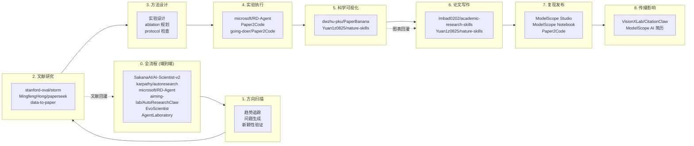
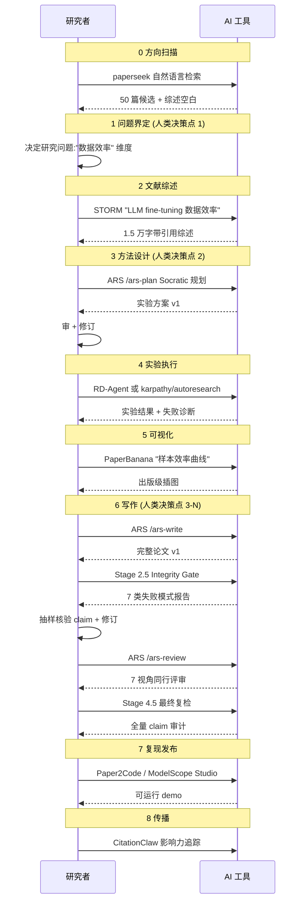

## 这张地图真正值钱的地方是按"科研生命周期"组织项目,不是按 Star 数

[ModelScope 魔搭社区](https://modelscope.cn)开源的 [awesome-vibe-research](https://github.com/modelscope/Awesome-Vibe-Research) 仓库,把科研拆成 9 阶段,然后把每个阶段里"反复可复用、能被同行验证、能逐步演化、表现最优"的 AI 能力挂上去。仓库本身只有 40 多行项目介绍,真正值钱的是那张流程图——它是一张按"科研生命周期"组织的索引,不是 awesome list 那种按 Star 数排序的合集。

但索引归索引,真按这张地图去落地,会发现同一个阶段往往堆着 3 到 5 个看起来都行的项目,而且它们背后代表的是完全不同的工程范式。这篇文章做的事:把 40 多个项目分进 3 大流派,再给一张选择矩阵,告诉你不同情况下该从哪一类工具开始。

5 个直接结论:

- **9 阶段是 3 大流派的工具共同覆盖**,不是 9 个工具。
- **端到端流水线**(AI-Scientist-v2 / RD-Agent / AutoResearchClaw)能独立产出论文,但需要 HITL 兜底。
- **Skill 套件**(ARS / nature-skills)把 AI 锁在"copilot"位置,把决策权留给研究者。
- **单点工具**(STORM / PaperBanana / paperseek)只解决一个阶段,但风险边界最清楚。
- 选哪一类取决于你的研究主题是否小到单点工具能 cover,以及你能投入多少审核时间。

## 9 阶段流程图:从方向扫描到传播影响力

仓库里那张流程图是核心信息源,这里重画一份,把所有阶段和对应工具一次性铺开。读图时注意:同一阶段往往有不止一个流派可以介入。

9 个阶段不是线性穿过一次就完。`0 全流程` 类的项目会跨越多个阶段直接产出论文,而 `2 文献研究` 的输出会反向影响 `1 方向扫描` 的问题界定——文献综述里发现的研究空白,经常比最初的问题假设更值得做。

读这张图最容易掉的坑是:把"全流程"误读成"更高级"。`SakanaAI/AI-Scientist-v2` 看起来比 `stanford-oval/storm` 厉害,实际上它们解决的是不同问题——前者追求"独立完成从想法到论文",后者追求"把一个想法的研究深度做到 Wikipedia 水平"。把这两类工具放同一个阶段里选,会高估全流程工具对单点问题的适配度。

## 3 大流派:端到端流水线、Skill 套件、单点工具

40 多个项目按工程范式分,可以归到 3 大流派。每种流派背后是一套对"AI 在科研里该放哪儿"的回答。

### 流派一:端到端流水线(覆盖 3+ 阶段)

这类项目给你一个"按下去,等几小时,出来一篇论文"的系统。代表项目:

| 项目 | 范式 | 公开成果 | 关键限制 |
|---|---|---|---|
| [SakanaAI/AI-Scientist](https://github.com/SakanaAI/AI-Scientist) (v1) | 模板驱动 3 模板 (NanoGPT/2D Diffusion/Grokking) | 10 篇示例论文,每个模型 × 模板 50 个 idea | 必须自己写模板,新领域覆盖不了 |
| [SakanaAI/AI-Scientist-v2](https://github.com/SakanaAI/AI-Scientist-v2) | agentic tree search + 去除模板依赖 | 首个 ICLR 2025 workshop 接收的纯 AI 论文(均分 6.33 vs workshop 4.87) | 探索性强但单次成功率低于 v1 |
| [karpathy/autoresearch](https://github.com/karpathy/autoresearch) | 单 GPU 5 分钟时间预算,agent 只改 `train.py` | 一晚跑 ~100 个实验 | 极简主义,只覆盖实验阶段 |
| [microsoft/RD-Agent](https://github.com/microsoft/RD-Agent) | R(研究)+ D(开发) 双 agent,覆盖数据/模型 | MLE-bench 第一名 (30.22% All / 51.52% Low) | 工业 R&D 视角,学术写作不是主战场 |
| [aiming-lab/AutoResearchClaw](https://github.com/aiming-lab/AutoResearchClaw) | 23 阶段流水线 + 6 种 HITL 模式 + ARC-Bench | 8 领域 8 篇论文,55 主题 benchmark | HITL 设计本身就是妥协信号 |
| [SamuelSchmidgall/AgentLaboratory](https://github.com/SamuelSchmidgall/AgentLaboratory) | 3 阶段(文献/实验/报告) + AgentRxiv 累积 | 支持 AgentRxiv 让 agent 互相读对方论文 | 计算资源需求未明确建模 |
| [EvoScientist/EvoScientist](https://github.com/EvoScientist/EvoScientist) | 持久记忆 + 技能演化 + 端到端协作 | 自演化能力展示 | 工程化程度低,论文主导 |

**机制差异**:这 7 个项目虽然都标榜"端到端",但内部的 agent 协作机制差别很大。`AI-Scientist-v1` 是单链流水线,`AI-Scientist-v2` 是 progressive agentic tree search,`RD-Agent` 是 Research/Development 双 agent 互锁,`AutoResearchClaw` 是 23 阶段带 stage gate 的强结构流水线,`autoresearch` 是"agent 改一个文件,5 分钟训练一次"的极简迭代。

**适合谁**:研究主题明确、有可复用实验模板(比如 ML benchmark)、能接受"机器出的论文需要人类修改"的研究者。

### 流派二:Skill 套件(覆盖全阶段,但 AI 是 copilot)

这派不是"按一下出论文",而是把一整套"AI 怎么做科研"做成可加载的 skill 文件,装到 Claude Code 或 Codex 里,由人类在每个关键节点拍板。

| 项目 | 形态 | 关键机制 | 协议 |
|---|---|---|---|
| [Imbad0202/academic-research-skills](https://github.com/Imbad0202/academic-research-skills) (ARS, v3.12) | Claude Code 插件,30 秒安装 | 13+12+7+10 阶段 agent + Stage 2.5/4.5 Integrity Gate + 7 类失败模式阻断 | CC BY-NC 4.0 |
| [Yuan1z0825/nature-skills](https://github.com/Yuan1z0825/nature-skills) | Codex 插件 + 本地 skill 套件 | Nature 学术表达 + 绘图规范 + 共享 `_shared` 目录 | (项目自带) |
| [wanshuiyin/Auto-claude-code-research-in-sleep](https://github.com/wanshuiyin/Auto-claude-code-research-in-sleep) (ARIS) | 纯 Markdown skills,无框架 | 跨模型 review loop(Claude Code/Codex/OpenClaw 都可) | 轻量 |

**机制差异**:ARS 把每一类 AI 失败模式做成硬性阻断门,**机器先跑完 7 类失败模式检查,出报告,然后必须等人确认才能继续**。nature-skills 不做阻断,而是给一套"按 Nature 风格写"的规约。ARIS 更轻——它就是个 Markdown skill 集合,跨平台跑。

**核心哲学**:AI 是 copilot,不是 pilot。这套哲学在 ARS 文档里讲得很直白:"This tool won't write your paper for you. It handles the grunt work."

**适合谁**:对 AI 失败模式有警觉、需要每一步可审计的研究者。学术圈用得多,尤其是投稿前最后一道改稿。

### 流派三:单点工具(只覆盖 1 个阶段,边界最清楚)

这派不追求"全流程",而是把科研某一个阶段的活儿做精。代表项目:

| 项目 | 解决的问题 | 输出 |
|---|---|---|
| [stanford-oval/storm](https://github.com/stanford-oval/storm) (NAACL 2024) | 自动生成 Wikipedia-like 带引用文章 | 7 万人用过研究预览 |
| [dwzhu-pku/PaperBanana](https://github.com/dwzhu-pku/PaperBanana) | 自动生成学术插图 (Retriever/Planner/Stylist/Visualizer/Critic 5 agent) | 出版级图表 |
| [MingfengHong/paperseek](https://github.com/MingfengHong/paperseek) | 自然语言文献检索 | 可复核文献列表 |
| [going-doer/Paper2Code](https://github.com/going-doer/Paper2Code) | 论文转可运行代码 | 复现仓库 |
| [Technion-Kishony-lab/data-to-paper](https://github.com/Technion-Kishony-lab/data-to-paper) | 多 agent 自主完成数据到论文全流程 | 可验证论文(后向可追溯) |
| [VisionXLab/CitationClaw](https://github.com/VisionXLab/CitationClaw) | 引用影响力分析 | 可解释影响力图谱 |

**机制差异**:这 6 个项目互不依赖,各自解决一个明确的痛点。STORM 的核心创新是"模拟维基百科作者与领域专家对话",PaperBanana 的核心是 5 个 agent 串行加 critic 反馈循环,paperseek 是检索 agent 反复迭代查询。

**适合谁**:研究流程里某个具体环节明显卡壳、需要快速补强的人。STORM + PaperBanana 是科研新人最容易上手的组合。

## 任务流案例:一份 ML 论文怎么从 0 流到发表

光看流程图不直观。拿一个真实跑过的工作流说一遍——任务是"研究 LLM fine-tuning 在小数据集上的样本效率"。

**3 个关键的人类决策点**:

1. **方向扫描后**——工具能给你 50 篇候选,真正决定研究价值的还是研究者本人。AI 给你"研究空白",你决定"这个空白值不值得追"。
2. **方法设计后**——ARS 给你 3 套实验方案,选哪套、怎么调,只有研究者知道哪些变量在你的领域里有意义。
3. **写作完整性门后**——Stage 2.5 / 4.5 报告只是"机器没看到明显问题",不是"这篇论文合格"。能不能投稿,你说了算。

如果用全流程工具(`AI-Scientist-v2` / `AutoResearchClaw`),这套人类决策点被压缩成"主题输入 + HITL 模式选择"。但**压缩不等于消失**——只是把决策成本前置到"选哪种 HITL 模式"上去了。

## 7 种 AI 失败模式:为什么全自动化暂时是奢望

`Imbad0202/academic-research-skills` 文档直接引用了 [Lu et al. (2026, *Nature* 651:914-919)](https://www.nature.com/articles/s41586-2026-09119) 的 Limitations 章节。这篇论文构建了 The AI Scientist——第一个通过顶级 ML 会议盲审的完全自主 AI 研究系统,ICLR 2025 workshop 得分 6.33/10,workshop 均分 4.87。但论文自己列出了 7 类失败模式:

| 编号 | 失败模式 | 解释 |
|---|---|---|
| M1 | 实现 bug 通过自审 | AI 写的代码有 bug,自审也没发现 |
| M2 | 引用幻觉 | 引了不存在的论文,或把结论错误归因给真实论文 |
| M3 | 实验结果幻觉 | 声称跑了某实验得到某数字,实际没有 |
| M4 | 捷径依赖 | AI 选更简单但不正确的方法路径 |
| M5 | Bug 即洞见 | 把实现错误重新解释为"新发现" |
| M6 | 方法论伪造 | 声称用了某种方法但没正确实施 |
| M7 | 帧锁定 | 早期假设错误锁死后续决策 |

Zhao et al. (2026-05) 进一步给出宏观统计:扫描 arXiv、bioRxiv、SSRN、PMC 上 250 万篇论文的 1.11 亿条引用,**保守估计 2025 年一年就有 146,932 条幻觉引用**。

**对项目选择的影响**:

- 选端到端流水线,意味着 M1-M7 全在你这边。HITL 模式选得不对,失败模式会以不同形式落在你身上。
- 选 Skill 套件,失败模式被显式做成了检查点(ARS 的 Integrity Gate 就是直接对位 M1-M7)。
- 选单点工具,失败模式只发生在该工具覆盖的阶段,边界清楚——但这不意味着你论文其他阶段不会出问题。

## 5 种 HITL 模式:AutoResearchClaw 介入粒度分级

端到端流水线暴露的最大问题是"全自动化带来全风险"。`aiming-lab/AutoResearchClaw` v0.4.0 引入 HITL 系统,提供 5 种主要介入粒度(custom 是这 5 种的组合,不算独立):

| 模式 | 介入粒度 | 适合场景 |
|---|---|---|
| `full-auto` | 0 个介入点,完全自动 | 探索性试水,接受废稿率 |
| `gate-only` | 只在 stage 转换门控 | 大流水线,只想拦关键节点 |
| `checkpoint` | 在关键检查点(方法设计/实验设计/写作门后) | 平衡成本和质量 |
| `step-by-step` | 每步介入 | 学习期,需要看清每一步 |
| `co-pilot` | AI 主导 + 关键决策人类拍板 | 论文投稿,质量优先 |

**`custom` 模式是上面 5 种的组合自由配置**,留给有特殊流程的团队。

**选哪种的实用判断**:

- 你想试水一个 idea,看 AI 能不能跑通——`full-auto`。
- 你要发表论文,需要每段都能解释——`co-pilot` 或 `step-by-step`。
- 你在团队里,你想分阶段给不同人审批——`gate-only`。
- 你在学一个新领域,你想看清楚每一步——`step-by-step` + Stage 2.5/4.5 报告。

## benchmark 解读:这几个数字意味着什么

仓库里被反复引用的几组 benchmark,放在这里拆开说。

**MLE-bench 上的 RD-Agent**

微软 RD-Agent 公开了 MLE-bench(75 个 Kaggle 竞赛构成的 ML 工程 benchmark)结果:

| Agent | Low (Lite) | Medium | High | All |
|---|---|---|---|---|
| RD-Agent o3(R) + GPT-4.1(D) | **51.52%** | 19.3% | 26.67% | 30.22% |
| RD-Agent o1-preview | 48.18% | 8.95% | 18.67% | 22.4% |
| AIDE o1-preview (基线) | 34.3% | 8.8% | 10.0% | 16.9% |

**测的是什么**:AI 在限定时间内(模拟人类 ML 工程师 2-10 小时工作量)解决真实 Kaggle 问题的能力。**反映的是 AI 端到端 ML 工程能力**——选数据、特征工程、模型选择、调参、提交。

**不能推出什么**:不能推出"RD-Agent 也能写论文"。MLE-bench 测的是工程任务,不是科学发现。论文写作的创造性、论证连贯性、引用准确性是另一回事。

**AI-Scientist-v2 在 ICLR workshop**

Lu et al. (2026) 报告 AI-Scientist-v2 生成的论文在 ICLR 2025 workshop 通过盲审,得分 6.33/10,workshop 均分 4.87。

**测的是什么**:机器生成的论文能否通过人类审稿。**反映的是论文外在质量是否过线**。

**不能推出什么**:不能推出"AI 论文和人类论文一样好"。Workshop 不是主会场,接收门槛低;6.33 分在主会场是直接被拒的档位。也不能推出"AI 论文不需要修改"——Lu et al. 自己也指出 M1-M7 失败模式仍然存在。

**ARC-Bench 55 主题 8 领域**

AutoResearchClaw v0.5.0 发布 ARC-Bench:55 个开放性主题,覆盖 ML(25)/HEP(10)/量子(10)/生物(7)/统计(3),每个主题给研究问题+条件+指标+数据集+评分 rubric。

**测的是什么**:AI 在不同科学领域的自主研究能力。**反映的是跨域可推广性**。

**不能推出什么**:不能推出"55 主题代表真实科研多样性"。55 主题每个都偏 ML/NLP 领域能用的范式,生物/统计/物理领域的研究流程可能根本不是这套 pipeline 能 cover 的。

**2025 年 146,932 条幻觉引用**

Zhao et al. (2026-05) 跨 4 个 preprint 平台统计。

**测的是什么**:AI 生成的引用有多少是假的或错配的。**反映的是 AI 引用系统的可信度**。

**不能推出什么**:不能推出"所有 AI 写作工具都有这问题"。成熟工具(ARS v3.7.3+)已经引入三层定位符 + 逐条审计,把幻觉率从被动发现转为主动拦截。但平均下来,**任何没用引用审计的工具都应该被假定有 1-5% 引用幻觉率**。

## 采用顺序:个人 / 团队 / 机构怎么落地

把上面 3 大流派和 5 种 HITL 模式合在一起,给三套落地路径。

### 个人研究者(没有团队,自己写论文)

1. **第一周**:装 [STORM](https://github.com/stanford-oval/storm) + [PaperBanana](https://github.com/dwzhu-pku/PaperBanana) 把文献综述和图表做出来。
2. **第二周**:装 [ARS](https://github.com/Imbad0202/academic-research-skills) 跑通 Stage 1-2,体验 Integrity Gate。
3. **第三周起**:选一个端到端工具(`AI-Scientist-v2` 或 `AutoResearchClaw`)开 `co-pilot` 模式,跑全流程。
4. **写论文时**:打开 ARS 的 `/ars-review` 做 7 视角同行评审 + Stage 4.5 复检。

**不要做**:上来就跑 `full-auto` 然后直接投稿,会被审稿人拍死。

### 5-20 人研究团队(有 PI + 几个学生 + 工程师)

1. **共装一套 Skill 套件**(ARS 或 nature-skills),把团队所有 AI 写论文流程标准化。
2. **指定 1 个 Integrity Gate 守门人**——对所有团队论文的 Stage 2.5/4.5 报告签字。
3. **实验重的项目**用 RD-Agent 或 AutoResearchClaw 跑 MLE-bench-style 工程任务,HITL 选 `gate-only`。
4. **写作重的项目**用 ARS 全流程,人类只在关键节点介入。
5. **团队仓库**用 [ModelScope Studio](https://modelscope.cn/studios) 做复现 demo。

**不要做**:每个学生各自装不同 AI 工具,出来的论文五花八门,审稿标准不统一。

### 机构级(实验室 / 高校院系 / AI 创业公司)

1. **建一个内部"AI 科研工具"评估小组**,3-5 人,每季度评估仓库新增项目。
2. **维护一个内部 benchmark**——用 ARC-Bench 风格的 5-10 主题,跑你们自己领域的端到端流水线。
3. **强约束**:
   - 所有投稿论文必须过 Stage 2.5/4.5 等价检查(不管用什么工具)。
   - 引用必须可审计(三层定位符 + 抽样核验)。
   - 公开方法论:在每篇论文里写明"哪些阶段用了 AI,用了什么工具"。
4. **建立内部 Skill 库**——把团队里验证过的 prompt、template、checklist 沉淀成内部 Skill,提交到 nature-skills 这种公共仓库。

**不要做**:把"用了 AI 写论文"藏着掖着。审稿人看得出来。

## 8 阶段对应平台的差异化建议

`7 复现发布` 和 `8 传播影响` 在仓库里被一笔带过,但这两个阶段恰恰是很多研究者的盲区。

**复现发布**:别用裸 GitHub repo。优先用 [ModelScope Studio](https://modelscope.cn/studios) 或 Hugging Face Spaces,这两个平台给用户一键试跑的能力,直接拉升论文影响力。

**传播影响**:别只发 Twitter/X。[ModelScope AI 简历](https://modelscope.cn/) 把模型/数据集/paper/demo/影响力数据整合在一个 profile 里,比单条 tweet 的可达性高一个量级。[CitationClaw](https://github.com/VisionXLab/CitationClaw) 给你可解释的引用图谱,适合做影响力展示。

## 边界:这套仓库不覆盖什么

这套仓库在以下场景**暂时**不适用:

- **需要严谨同行评审的领域**:医学临床研究、双盲实验、社会科学田野调查——AI 失败模式 M3/M6 在这些领域的代价不是"被退稿",而是"伤害真实的人"。
- **小领域长尾**:如果你研究的主题在 arXiv 上 < 100 篇/年,AI 训练数据稀薄,幻觉率会显著上升。
- **跨文化深度研究**:AI 工具大多基于英语/中文训练,其他语言的研究主题需要先做语料预处理。
- **需要物理实验的研究**:机器人、合成生物、化学合成——这些领域 AI 只能做 planning,实验本身还是人类/机器人做。

**但反过来**:如果你做的研究**是** ML/NLP/AI 本身,或者**接近** AI 工具擅长的工作流(数据驱动 + 模式识别 + 文本生成),那上面这套工具链是当前最务实的选择。

## 结尾:带走一个判断和一个筛选问题

Vibe Research 9 阶段地图的最大价值是把"AI 在科研里能放在哪"切成了 3 种明确范式。

下次你再看到一个号称"端到端 AI 科研系统"的项目,先问三个问题:

1. 它是 Skill 套件、端到端流水线,还是单点工具?
2. 它用什么机制处理 M1-M7 失败模式?是阻断门、HITL 模式、还是什么都没做?
3. 它有没有公开 benchmark?这个 benchmark 测的是什么、不能推出什么?

能答上三个问题的项目值得花时间试;答不上的,先围观。

(完)
