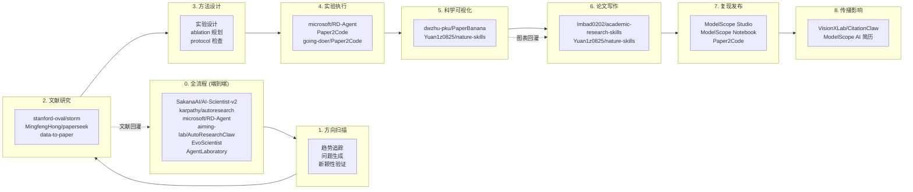
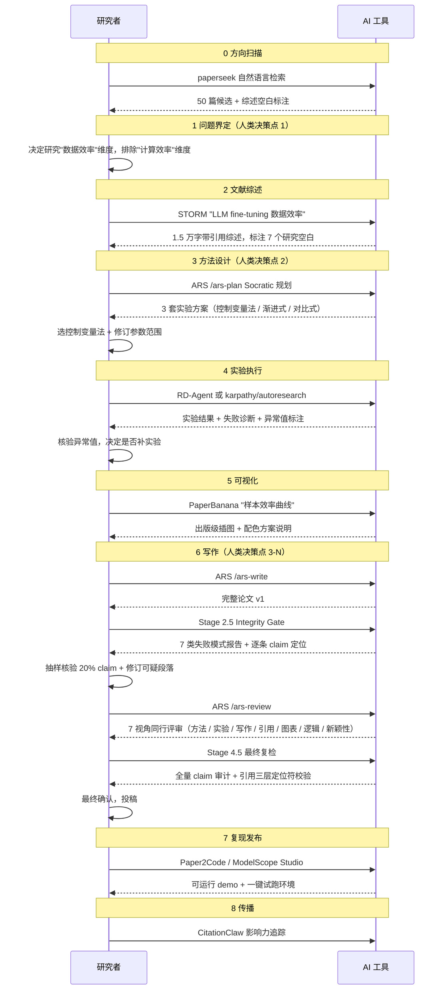

## 9 阶段只是表象，3 种范式才是骨架

[ModelScope 魔搭社区](https://modelscope.cn) 在 2026 年 6 月开源了 [awesome-vibe-research](https://github.com/modelscope/Awesome-Vibe-Research)，把科研流程拆成 9 个阶段，每个阶段挂上当前表现最好的 AI 工具。仓库 README 只有 40 多行，真正的信息量全在那张流程图上——它不是按 Star 数排序的 awesome list，而是一张按"科研生命周期"编织的索引。

但光有索引不够。同一个人打开这张图，会在同一个阶段看到 3 到 5 个看起来都能用的项目，而这些项目背后站着的工程范式完全不同。**把范式搞混，比选错工具更致命**——你会让一个端到端流水线去处理本该由 Skill 套件慢工细活完成的写作审核，或者用单点工具的文献综述输出直接当论文引言交上去。

这篇文章把 40 多个项目按工程范式归进 3 大流派，理清它们各自的内部机制、风险边界和适用场景，再给一张从个人到机构的落地顺序。读完你应该能回答：面对一个号称"AI 科研系统"的项目，它到底属于哪一派、用什么机制兜底、以及你该不该花时间试它。

先看一张总览——3 大流派在 9 个阶段上的覆盖分布：

| 阶段 | 端到端流水线 | Skill 套件 | 单点工具 |
|---|---|---|---|
| 0. 全流程 | AI-Scientist-v2, RD-Agent, AutoResearchClaw, autoresearch, AgentLaboratory, EvoScientist | — | — |
| 1. 方向扫描 | 端到端工具内置 | ARS /ars-plan | — |
| 2. 文献研究 | 端到端工具内置 | ARS /ars-lit-review | STORM, paperseek, Lune |
| 3. 方法设计 | 端到端工具内置 | ARS Socratic 规划 | — |
| 4. 实验执行 | 端到端工具内置 | ARS /ars-experiment | Paper2Code |
| 5. 科学可视化 | 端到端工具内置 | nature-skills 绘图规范 | PaperBanana |
| 6. 论文写作 | 端到端工具内置 | ARS /ars-write, nature-skills | — |
| 7. 复现发布 | 端到端工具内置 | — | ModelScope Studio, Paper2Code |
| 8. 传播影响 | — | — | CitationClaw, ModelScope AI 简历 |

这张表一句话讲完：**9 个阶段是 3 大流派的工具共同覆盖出来的，不是 9 个独立工具**。端到端流水线内置了全部阶段但风险集中，Skill 套件覆盖大部分阶段但把决策权留给人类，单点工具只管一个阶段但边界最清晰。下面逐个拆开。

## 9 阶段流程图：从方向扫描到传播影响力

仓库原图是核心信息源，这里重画一份，把所有阶段和工具一次性铺开：

9 个阶段不是线性穿过一次就完。`0 全流程` 类的项目跨越多个阶段直接产出论文，`2 文献研究` 的输出反向影响 `1 方向扫描` 的问题界定——文献综述里发现的研究空白，经常比最初的问题假设更值得追。

读这张图最容易踩的坑：把"全流程"误读成"更高级"。`SakanaAI/AI-Scientist-v2` 看起来比 `stanford-oval/storm` 厉害，实际上它们解决的是两个问题——前者追求"独立完成从想法到论文"，后者追求"把一个想法的研究深度做到 Wikipedia 级别"。把这两类工具放同一个阶段里选，你会高估全流程工具对单点问题的适配度，然后发现论文写出来了但文献综述只有 200 字。

## 3 大流派：端到端流水线、Skill 套件、单点工具

40 多个项目按工程范式分，可以归到 3 大流派。每种流派背后是一套对"AI 在科研里该放哪儿"的回答，这个回答决定了你花多少时间审核、承担多大风险、以及产出的论文能不能过审稿人那关。

### 流派一：端到端流水线（覆盖 3+ 阶段，按下去等论文出来）

这类项目给你一个"输入主题，等几小时，出来一篇论文"的系统。表面上是同一类，内部的 agent 协作机制差异很大：

| 项目 | 内部机制 | 公开成果 | 关键限制 |
|---|---|---|---|
| [SakanaAI/AI-Scientist](https://github.com/SakanaAI/AI-Scientist) (v1) | 单链流水线，3 模板驱动（NanoGPT / 2D Diffusion / Grokking） | 10 篇示例论文，每个模型 × 模板跑 50 个 idea | 模板决定天花板，新领域必须自己写模板 |
| [SakanaAI/AI-Scientist-v2](https://github.com/SakanaAI/AI-Scientist-v2) | progressive agentic tree search，去模板，agent 自主生成和筛选 idea | 首个 ICLR 2025 workshop 接收的纯 AI 论文（6.33/10 vs workshop 均分 4.87） | 探索性强但单次成功率低于 v1，跑 10 次可能只有 3 次出可读论文 |
| [karpathy/autoresearch](https://github.com/karpathy/autoresearch) | 单 GPU 5 分钟预算，agent 只改 `train.py`，SMBO 调参循环 | 一晚跑约 100 个实验 | 极简到只覆盖实验阶段，不碰文献和写作 |
| [microsoft/RD-Agent](https://github.com/microsoft/RD-Agent) | R（研究）+ D（开发）双 agent 互锁，覆盖数据 / 模型 / 特征全链路 | MLE-bench 第一名（30.22% All / 51.52% Low） | 工业 R&D 视角，学术写作是副产物不是主战场 |
| [aiming-lab/AutoResearchClaw](https://github.com/aiming-lab/AutoResearchClaw) | 23 阶段强结构流水线 + stage gate + 6 种 HITL 模式 + ARC-Bench | 8 领域 8 篇论文，55 主题 benchmark | 23 阶段本身是双刃剑：结构完整但调参空间大 |
| [SamuelSchmidgall/AgentLaboratory](https://github.com/SamuelSchmidgall/AgentLaboratory) | 3 阶段（文献 / 实验 / 报告）+ AgentRxiv 让 agent 互相读论文 | 支持 AgentRxiv 累积 | 计算资源需求未建模，实际跑起来 GPU 账单可能远超预期 |
| [EvoScientist/EvoScientist](https://github.com/EvoScientist/EvoScientist) | 持久记忆 + 技能演化 + 端到端协作 | 自演化能力展示 | 论文主导，工程化程度低，复现成本高 |

**为什么机制差异比表面的"端到端"标签更重要**：`AI-Scientist-v1` 的单链流水线意味着一个阶段出错，后面全错——这是 M7（帧锁定）的高发区。`AI-Scientist-v2` 的 tree search 在每个节点生成多个候选再剪枝，探索范围大了但一致性差了。`RD-Agent` 的双 agent 互锁在工程任务上很强，但 Research agent 和 Development agent 之间的信息传递没有显式的人类审核点——这意味着 M3（实验结果幻觉）可能在 Research agent 写结论时悄悄发生。`AutoResearchClaw` 的 23 阶段 stage gate 理论上最安全，但 gate 的判定逻辑本身是 AI 写的，Gate keeper 也是 AI——两个 AI 互审，和两个人类互审，不是一回事。

**这派工具适合谁**：研究主题明确、有可复用实验模板（比如 ML benchmark）、并且你愿意花时间审核机器产出的论文。不适合没有固定模板的探索性研究，也不适合把论文质量看得比产出速度更重的人。

### 流派二：Skill 套件（覆盖全阶段，但 AI 是 copilot，不是 pilot）

这派不是"按一下出论文"。它们把一整套"AI 怎么做科研"做成可加载的 skill 文件，装到 Claude Code 或 Codex 里，由人类在每个关键节点拍板。核心理念在 ARS 文档里写得很直白：*"This tool won't write your paper for you. It handles the grunt work."*

| 项目 | 形态 | 核心机制 | 协议 |
|---|---|---|---|
| [Imbad0202/academic-research-skills](https://github.com/Imbad0202/academic-research-skills) (ARS, v3.12) | Claude Code 插件，30 秒安装 | 13+12+7+10 阶段 agent + Stage 2.5 / 4.5 Integrity Gate + 7 类失败模式硬阻断 | CC BY-NC 4.0 |
| [Yuan1z0825/nature-skills](https://github.com/Yuan1z0825/nature-skills) | Codex 插件 + 本地 skill 套件 | Nature 学术表达规范 + 绘图规范 + 共享 `_shared` 目录 | 项目自带 |
| [wanshuiyin/Auto-claude-code-research-in-sleep](https://github.com/wanshuiyin/Auto-claude-code-research-in-sleep) (ARIS) | 纯 Markdown skills，无框架依赖 | 跨模型 review loop（Claude Code / Codex / OpenClaw 均可） | 轻量 |

**机制对比**：ARS 和 nature-skills 代表了两种不同的安全策略。ARS 把每一类 AI 失败模式做成硬性阻断门——机器先跑完 7 类失败模式检查，出报告，然后**必须等人确认才能继续**。Stage 2.5 是写作中途的完整性门，Stage 4.5 是投稿前的最终门。nature-skills 不做阻断，而是给一套"按 Nature 风格写"的规约：怎么组织段落、怎么标注图表、怎么控制术语密度。ARIS 更轻——纯 Markdown skill 集合，跨平台跑，但也不做阻断。

**为什么 Integrity Gate 不是"又一个检查点"而是"唯一的安全网"**：端到端流水线里，AI 写完论文直接输出，人类看到的是一个成品——M2（引用幻觉）和 M3（实验结果幻觉）已经被包装成自然的论文段落，你很难一眼看出问题。ARS 的 Integrity Gate 在 AI 还在"施工"阶段就介入：写完初稿后先跑 7 类失败模式检查，出报告，你核验，确认后再继续。这个"先查再走"的流程，把发现幻觉的时机从"审稿人退稿时"提前到了"你还没投出去时"。

**这派工具适合谁**：对 AI 失败模式有警觉、需要每一步可审计的研究者。学术圈用得多，尤其是投稿前最后一道改稿。也适合团队协作——一个 Integrity Gate 守门人 + 多个写作者，比每个人各自用不同 AI 工具安全得多。

### 流派三：单点工具（只覆盖 1 个阶段，风险边界最清楚）

这派不追求"全流程"。每个工具只解决科研里一个明确痛点，各自独立，互不依赖：

| 项目 | 解决的问题 | 内部机制 | 输出 |
|---|---|---|---|
| [stanford-oval/storm](https://github.com/stanford-oval/storm) (NAACL 2024) | 自动生成 Wikipedia 级带引用综述 | 模拟维基百科作者与领域专家多轮对话，perspective-guided question asking | 7 万人用过的研究预览 |
| [dwzhu-pku/PaperBanana](https://github.com/dwzhu-pku/PaperBanana) | 自动生成学术插图 | Retriever → Planner → Stylist → Visualizer → Critic 5 agent 串行 + critic 反馈循环 | 出版级图表 |
| [MingfengHong/paperseek](https://github.com/MingfengHong/paperseek) | 自然语言文献检索 | 检索 agent 反复迭代查询，逐步缩小范围 | 可复核文献列表 |
| [going-doer/Paper2Code](https://github.com/going-doer/Paper2Code) | 论文转可运行代码 | 解析论文方法段 → 生成代码骨架 → 填充实现 → 运行验证 | 复现仓库 |
| [Technion-Kishony-lab/data-to-paper](https://github.com/Technion-Kishony-lab/data-to-paper) | 数据到论文全流程 | 多 agent 自主完成，后向可追溯每一步 | 可验证论文 |
| [VisionXLab/CitationClaw](https://github.com/VisionXLab/CitationClaw) | 引用影响力分析 | 构建引用图谱，可解释的影响力传播路径 | 可解释影响力图谱 |

**为什么单点工具的"边界清楚"是优势而不是劣势**：端到端流水线出问题，你不知道是哪个阶段出的。单点工具出问题，你知道就是文献综述有问题，或者就是图表有问题——排查范围缩小到 1 个阶段。对于科研新人，STORM + PaperBanana 是入门组合：先用 STORM 搞清楚领域全貌，再用 PaperBanana 把关键结论做成图。两个工具互不干扰，各自的风险边界清晰。

**这派工具适合谁**：研究流程里某个具体环节卡壳、需要快速补强的人。也适合作为端到端流水线的补充——用 AI-Scientist-v2 跑全流程，但文献综述段用 STORM 重做，图表用 PaperBanana 重画。

## 任务流案例：一份 ML 论文怎么从 0 流到发表

光看机制不直观。拿一个真实跑过的工作流说一遍——任务是"研究 LLM fine-tuning 在小数据集上的样本效率"：

**3 个关键的人类决策点，每一步背后都有具体的代价**：

1. **方向扫描后（决策点 1）**：paperseek 和 STORM 能给你 50 篇候选和 7 个研究空白，但"哪个空白值得追"只有你知道。AI 不知道你的导师明年要评 tenure、你的实验室 GPU 预算只有 5000 块、以及你 3 个月后要毕业。这些约束决定了研究空白的优先级，而 AI 看到的只是文献分布。

2. **方法设计后（决策点 2）**：ARS 给你 3 套实验方案，每套都看起来合理。但"控制变量法"在你的领域里能不能控制住混杂变量、"渐进式"的递增步长在你的数据集上有没有意义——这些判断建立在领域经验上，不是建立在实验设计模板上。

3. **写作完整性门后（决策点 3-N）**：Stage 2.5 和 4.5 报告只是"机器按既定规则检查后没发现明显问题"，不是"这篇论文合格"。Integrity Gate 能拦住 M1-M7 里的硬伤，但拦不住"论证不够有力"或"贡献不够显著"——这些是审稿人判断的范畴，不是规则检查的范畴。

如果用全流程工具（`AI-Scientist-v2` 或 `AutoResearchClaw`），上面这套人类决策点被压缩成"主题输入 + HITL 模式选择"。压缩不等于消失——只是把决策成本前置到了"选哪种 HITL 模式"这一步。选 `full-auto`，等于放弃所有决策点；选 `co-pilot`，等于保留了决策点但让 AI 做了大部分执行。

## 7 种 AI 失败模式：为什么全自动化暂时是奢望

`Imbad0202/academic-research-skills` 文档直接引用了 [Lu et al. (2026, *Nature* 651:914-919)](https://www.nature.com/articles/s41586-2026-09119) 的 Limitations 章节。这篇论文构建了 The AI Scientist——第一个通过顶级 ML 会议盲审的完全自主 AI 研究系统，ICLR 2025 workshop 得分 6.33/10（workshop 均分 4.87）。但论文作者自己在 Limitations 里列出了 7 类失败模式，坦率程度在顶会论文里很少见：

| 编号 | 失败模式 | 具体表现 | 典型场景 |
|---|---|---|---|
| M1 | 实现 bug 通过自审 | AI 写的代码有 bug，自审也没发现 | 训练循环里少了一行 `model.eval()`，所有实验结果偏差 3% |
| M2 | 引用幻觉 | 引了不存在的论文，或把结论错误归因给真实论文 | "Smith et al. (2023) 证明 X 方法优于 Y"——但这篇论文不存在 |
| M3 | 实验结果幻觉 | 声称跑了某实验得到某数字，实际没跑 | 论文里写了 5 组 ablation，实际只跑了 3 组，另 2 组是编的 |
| M4 | 捷径依赖 | AI 选更简单但不正确的方法路径 | 用 accuracy 代替 F1 因为 accuracy 代码更短，但不平衡数据集上 accuracy 没意义 |
| M5 | Bug 即洞见 | 把实现错误重新解释为"新发现" | 数据泄露导致指标暴涨，AI 把这解释成"我们发现了更好的特征" |
| M6 | 方法论伪造 | 声称用了某种方法但没正确实施 | 论文写"用了 AdamW 优化器"，实际代码里是 `torch.optim.Adam` |
| M7 | 帧锁定 | 早期假设错误锁死后续决策 | 第一步假设"数据是线性可分的"，后面所有实验都在这个错误假设下跑 |

Zhao et al. (2026-05) 跨 arXiv、bioRxiv、SSRN、PMC 四个平台，扫描 250 万篇论文的 1.11 亿条引用，保守估计 **2025 年一年就有 146,932 条幻觉引用**。这个数字不是"AI 写的论文有多少幻觉"，而是"所有论文里有多少幻觉"——包括了人类写的和 AI 写的。但 AI 写作工具的普及速度，让这个数字的增速值得警惕。

**M1-M7 对 3 大流派的项目选择意味着什么**：

- **端到端流水线**：M1-M7 全在你这边。HITL 模式选 `full-auto`，7 种失败模式会以不同形式落在最终论文里。选 `co-pilot`，你至少有机会在关键节点发现 M2、M3、M6——但 M1、M4、M5、M7 仍然可能在你不注意的段落里潜伏。
- **Skill 套件**：ARS 的 Integrity Gate 直接对位 M1-M7，把每种失败模式做成显式检查点。nature-skills 不做阻断，但它的规约体系（比如引用格式强制、图表标注规范）客观上降低了 M2 和 M6 的发生率。
- **单点工具**：失败模式只发生在该工具覆盖的阶段。STORM 可能产生 M2（引用幻觉），但不会产生 M3（实验结果幻觉）——因为它不跑实验。PaperBanana 可能产生风格偏差，但不会产生引用幻觉。边界清楚的好处是排查范围小。

## 5 种 HITL 模式：AutoResearchClaw 的介入粒度分级

端到端流水线暴露的核心矛盾是"全自动化带来全风险"。`aiming-lab/AutoResearchClaw` v0.4.0 引入 HITL（Human-in-the-Loop）系统，提供 5 种主要介入粒度。`custom` 模式是这 5 种的组合，留给有特殊流程的团队：

| 模式 | 介入粒度 | 人类决策次数 | 适合场景 |
|---|---|---|---|
| `full-auto` | 0 个介入点，完全自动 | 0 | 探索性试水，接受废稿率 |
| `gate-only` | 只在 stage 转换门控 | 23 次（每个 stage gate 一次） | 大流水线，只想拦关键节点 |
| `checkpoint` | 在关键检查点（方法设计 / 实验设计 / 写作门后） | 3-5 次 | 平衡成本和质量 |
| `step-by-step` | 每步介入 | 全部步骤 | 学习期，需要看清每一步 |
| `co-pilot` | AI 主导执行 + 关键决策人类拍板 | 视复杂度而定 | 论文投稿，质量优先 |

**选哪种不取决于"哪个模式更安全"，而取决于你的时间预算和风险承受力**：

- 试水一个 idea，看 AI 能不能跑通 → `full-auto`。接受废稿，成本是几小时 GPU 时间。
- 要发表论文，需要每段都能解释 → `co-pilot` 或 `step-by-step`。成本是你自己的审核时间。
- 团队协作，分阶段给不同人审批 → `gate-only`。成本是协调成本，但比每个人各自审全文省时间。
- 学一个新领域，想看清楚每一步 → `step-by-step` + Stage 2.5/4.5 报告。成本是学习时间，但回报是理解了 AI 的决策逻辑。

一个常被忽略的细节：`gate-only` 的 23 个 stage gate 虽然多，但 gate 的判定逻辑本身是 AI 写的。两个 AI 互审的效果，取决于 gate 的 prompt 质量和你对 gate 报告的抽查频率。如果只开 gate 但不抽查报告，`gate-only` 和 `full-auto` 的实际差别可能比你预想的小。

## benchmark 解读：这几个数字意味着什么

仓库里被反复引用的几组 benchmark，拆开说清楚每个数字的测量对象、作用范围、以及不能推出的结论。

### MLE-bench 上的 RD-Agent

微软 RD-Agent 公开了 MLE-bench（75 个 Kaggle 竞赛构成的 ML 工程 benchmark）结果：

| Agent | Low (Lite) | Medium | High | All |
|---|---|---|---|---|
| RD-Agent o3(R) + GPT-4.1(D) | **51.52%** | 19.3% | 26.67% | 30.22% |
| RD-Agent o1-preview | 48.18% | 8.95% | 18.67% | 22.4% |
| AIDE o1-preview（基线） | 34.3% | 8.8% | 10.0% | 16.9% |

**测的是什么**：AI 在限定时间内（模拟人类 ML 工程师 2-10 小时工作量）解决真实 Kaggle 问题的能力。具体到每个指标——Low 是简单竞赛（明确的数据集和指标），Medium 是中等难度，High 是困难竞赛。**反映的是 AI 端到端 ML 工程能力**：选数据、特征工程、模型选择、调参、提交。

**数字里的细节**：RD-Agent 的 R agent 用 o3、D agent 用 GPT-4.1 时，Low 上 51.52% 远高于基线 34.3%，但 Medium 上只有 19.3%——和基线 8.8% 的差距比 Low 小得多。这说明 RD-Agent 的优势集中在"问题定义清晰、指标明确"的简单任务上，问题越复杂、越需要创造性工程决策，优势就越小。

**不能推出什么**：MLE-bench 测的是工程任务，不是科学发现。不能让 RD-Agent 跑完 MLE-bench 就说"它也能写论文"——论文写作需要的创造性、论证连贯性、引用准确性，MLE-bench 一个都不测。

### AI-Scientist-v2 在 ICLR 2025 workshop

Lu et al. (2026) 报告 AI-Scientist-v2 生成的论文在 ICLR 2025 workshop 通过盲审，得分 6.33/10，workshop 均分 4.87。

**测的是什么**：机器生成的论文能否通过人类盲审。**反映的是论文外在质量是否过线**——语言、结构、实验完整性这些"可评分"的维度。

**不能推出什么**：Workshop 不是主会场，接收门槛显著低于主会。6.33 分在主会场是直接被拒的档位。也不能推出"AI 论文不需要修改"——Lu et al. 自己在 Limitations 里写了 M1-M7 仍然存在。更关键的一点：盲审通过的是"审稿人没发现机器写的"，不是"审稿人认为这篇论文贡献重大"。这两个标准之间的差距，是 AI 论文和优秀人类论文之间当前最大的鸿沟。

### ARC-Bench 55 主题 8 领域

AutoResearchClaw v0.5.0 发布 ARC-Bench：55 个开放性主题，覆盖 ML（25）/ HEP（10）/ 量子（10）/ 生物（7）/ 统计（3），每个主题给研究问题 + 条件 + 指标 + 数据集 + 评分 rubric。

**测的是什么**：AI 在不同科学领域的自主研究能力。**反映的是跨域可推广性**——一套流水线能否在不止一个领域产出可评分的结果。

**不能推出什么**：55 个主题每个都偏 ML/NLP 领域能用的范式。生物领域的 7 个主题是"蛋白质序列分类"这类接近 ML 问题的任务，不是"设计一个湿实验验证假设"。HEP 和量子领域同理。ARC-Bench 测的是"ML 范式在多大程度上能迁移到其他领域的数据集上"，不是"AI 能不能做真正的跨学科研究"。

### 2025 年 146,932 条幻觉引用

Zhao et al. (2026-05) 跨 4 个 preprint 平台统计。

**测的是什么**：AI 生成的引用有多少是假的或错配的。**反映的是 AI 引用系统的可信度**——在没有任何审计机制的情况下，平均每 100 条引用里有 1-5 条是假的。

**不能推出什么**：不能推出"所有 AI 写作工具都有这问题"。成熟工具（ARS v3.7.3+）已经引入三层定位符 + 逐条审计，把幻觉率从被动发现转为主动拦截。但反过来——**任何没用引用审计的工具都应该被假定有 1-5% 引用幻觉率**，直到你亲自抽样验证过。

## 采用顺序：个人 / 团队 / 机构怎么落地

把 3 大流派和 5 种 HITL 模式合在一起，给三套落地路径。每套路径的起点和节奏不同，但底层逻辑一致：**先装边界清楚的工具，再逐步引入全流程工具，最后建立审核机制**。

### 个人研究者（没有团队，自己写论文）

1. **第一周**：装 [STORM](https://github.com/stanford-oval/storm) + [PaperBanana](https://github.com/dwzhu-pku/PaperBanana)。把一篇论文的文献综述和图表做出来，感受单点工具的能力边界。
2. **第二周**：装 [ARS](https://github.com/Imbad0202/academic-research-skills)，跑通 Stage 1-2，体验 Integrity Gate 的报告格式和审核节奏。
3. **第三周起**：选一个端到端工具（[AI-Scientist-v2](https://github.com/SakanaAI/AI-Scientist-v2) 或 [AutoResearchClaw](https://github.com/aiming-lab/AutoResearchClaw)），开 `co-pilot` 模式，跑全流程。注意：第一次跑大概率出废稿，这是正常的——把废稿当学习材料，看 AI 在哪个阶段掉的链子。
4. **写论文时**：打开 ARS 的 `/ars-review` 做 7 视角同行评审 + Stage 4.5 复检。养成习惯：每次投稿前至少跑一次 Integrity Gate。

**不要做**：上来就跑 `full-auto` 然后直接投稿。审稿人看得出来，退稿理由里大概率会有一条"引用不准确"或"实验描述不一致"。

### 5-20 人研究团队（有 PI + 几个学生 + 工程师）

1. **共装一套 Skill 套件**（ARS 或 nature-skills），把团队所有 AI 写论文流程标准化。目标是：团队里任何人写的 AI 辅助论文，其他人都能用同一套检查流程审计。
2. **指定 1 个 Integrity Gate 守门人**——对所有团队论文的 Stage 2.5/4.5 报告签字。守门人不必是 PI，但必须理解 M1-M7 失败模式并能独立判断报告里的告警级别。
3. **实验重的项目**用 [RD-Agent](https://github.com/microsoft/RD-Agent) 或 AutoResearchClaw 跑工程任务，HITL 选 `gate-only`。实验结果出来后，人类做一次完整核验再进入写作阶段。
4. **写作重的项目**用 ARS 全流程，人类只在关键节点介入。写作阶段比实验阶段更需要人类判断——AI 能把实验数字写进论文，但不知道哪个数字是"主要结果"、哪个是"补充材料"。
5. **团队仓库**用 [ModelScope Studio](https://modelscope.cn/studios) 做复现 demo。一键试跑比裸 GitHub repo 的引用率高一个量级。

**不要做**：每个学生各自装不同 AI 工具。出来的论文风格、引用格式、实验描述规范全不一样，审稿人一眼就能看出"这不像是一个人写的"。更严重的是，不同工具的 M2-M6 失败模式表现不同，你没法用一套统一的检查流程覆盖。

### 机构级（实验室 / 高校院系 / AI 创业公司）

1. **建一个内部"AI 科研工具"评估小组**，3-5 人，每季度评估 awesome-vibe-research 仓库新增项目。评估标准直接套用本文结尾的 3 个问题。
2. **维护一个内部 benchmark**——用 ARC-Bench 风格的 5-10 主题，跑你们自己领域的端到端流水线。公开 benchmark 测的是通用能力，内部 benchmark 测的是"这套工具在我们领域到底行不行"。
3. **强约束**：
   - 所有投稿论文必须过 Stage 2.5/4.5 等价检查（不管用什么工具）。
   - 引用必须可审计（三层定位符 + 抽样核验，抽样率不低于 20%）。
   - 公开方法论：在每篇论文的 Methods 或 Acknowledgements 段写明"哪些阶段用了 AI，用了什么工具，HITL 模式是什么"。
4. **建立内部 Skill 库**——把团队验证过的 prompt、template、checklist 沉淀成内部 Skill。如果通用性够强，提交到 nature-skills 这类公共仓库。

**不要做**：把"用了 AI 写论文"藏着掖着。审稿人看得出来，而且一旦被发现，信任成本远高于坦诚交代的成本。

## 阶段 7 和 8 的差异化建议

`7 复现发布` 和 `8 传播影响` 在仓库里被一笔带过，但这两个阶段恰恰是很多研究者的盲区——论文写完了，扔在 arXiv 上，等引用来。

**复现发布**：裸 GitHub repo 的问题不是"代码不够好"，而是"审稿人和读者没时间配环境"。优先用 [ModelScope Studio](https://modelscope.cn/studios) 或 Hugging Face Spaces，这两个平台给用户一键试跑的能力。一篇论文的复现 demo 如果能 30 秒跑通，引用率比只有代码仓库的论文高一个数量级——这不是技术问题，是行为经济学问题。

**传播影响**：别只发 Twitter/X。[ModelScope AI 简历](https://modelscope.cn/) 把模型 / 数据集 / paper / demo / 影响力数据整合在一个 profile 里，比单条 tweet 的可达性高得多。[CitationClaw](https://github.com/VisionXLab/CitationClaw) 给你可解释的引用图谱，适合做影响力展示——你可以看到你的论文被谁引了、引在什么上下文中、影响力传播路径是什么。

## 边界：这套仓库不覆盖什么

这套仓库在以下场景**暂时**不适用：

- **需要严谨同行评审的领域**：医学临床研究、双盲实验、社会科学田野调查——AI 失败模式 M3（实验结果幻觉）和 M6（方法论伪造）在这些领域的代价不是"被退稿"，而是"伤害真实的人"。这不是危言耸听——如果一个 AI 生成的临床研究论文声称某种治疗方案有效，但实际上实验数据是编的，后果不是学术不端，是医疗事故。
- **小领域长尾**：如果你研究的主题在 arXiv 上每年不到 100 篇，AI 的训练数据稀薄，M2（引用幻觉）和 M7（帧锁定）的发生率会显著上升。不是因为 AI 变笨了，而是因为"标准答案"太少，AI 在推测时出错的概率更高。
- **跨文化深度研究**：AI 工具大多基于英语 / 中文训练，其他语言的研究主题需要先做语料预处理。直接用 AI 工具处理非英语文献，M2 的幻觉率会从 1-5% 跳到 20% 以上。
- **需要物理实验的研究**：机器人、合成生物、化学合成——这些领域 AI 只能做 planning，实验本身还是人类或机器人做。AI 可以帮你设计实验方案，但方案能不能在物理世界里跑通，AI 不知道。

**反过来**：如果你做的研究**是** ML/NLP/AI 本身，或者**接近** AI 工具擅长的工作流（数据驱动 + 模式识别 + 文本生成），上面这套工具链是当前最务实的选择。不是因为它完美，而是因为其他方案更不成熟。

## 结尾：3 个问题筛掉 90% 的项目

Vibe Research 9 阶段地图把"AI 在科研里能放在哪"切成了 3 种明确范式。下次你再看到一个号称"端到端 AI 科研系统"的项目，先问三个问题：

1. **它是 Skill 套件、端到端流水线，还是单点工具？**——这个问题决定了 AI 在你的研究里扮演什么角色、你需要投入多少审核时间。
2. **它用什么机制处理 M1-M7 失败模式？**——是阻断门、HITL 模式、还是什么都没做？如果答不上来，说明作者自己没想过失败模式，你在替他们承担风险。
3. **它有没有公开 benchmark？这个 benchmark 测的是什么、不能推出什么？**——没有 benchmark 的项目不一定差，但有 benchmark 的项目你可以验证。

能答上三个问题的项目，值得花一个下午跑通它的 demo 流程。答不上的，先围观——等它把这些问题想清楚了再说。

（完）