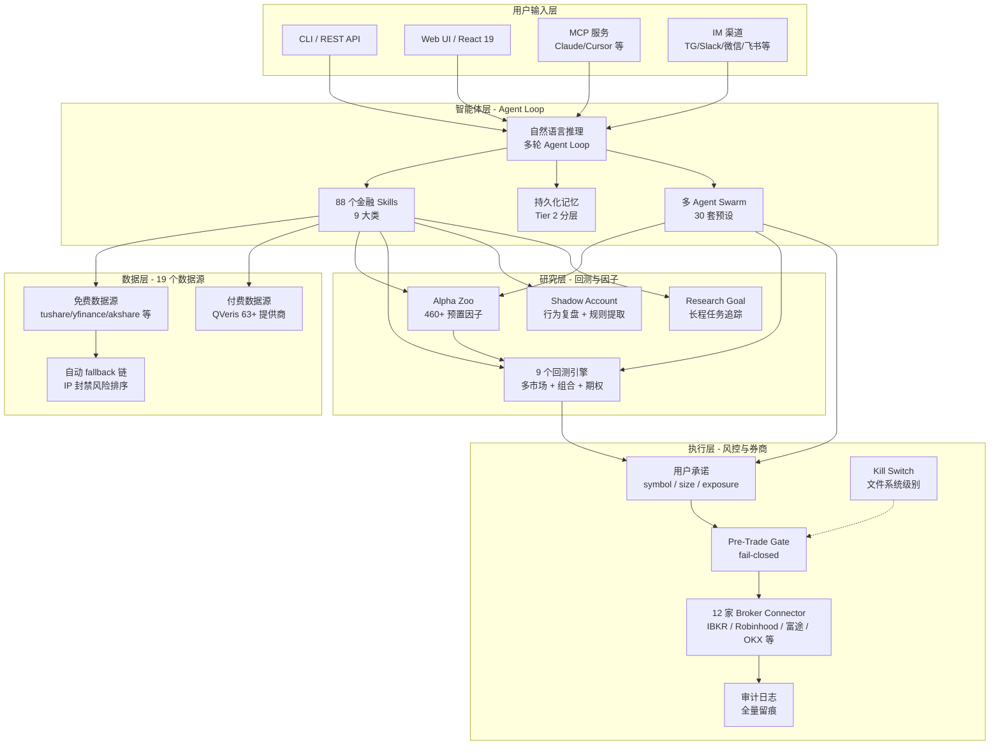

# Vibe-Trading 完全指南：从零开始理解你的个人交易智能体

你有没有过这样的经历——脑子里冒出一个交易想法，觉得「如果均线金叉时买入，应该能赚」，但真要验证它，你得先找数据、写代码、跑回测，折腾一整天，热情早凉了。

现在换一种方式：你直接告诉它「帮我看看沪深 300 的动量策略最近还行不行」，它就去拉数据、算因子、跑回测，最后给你一份带图表的报告。如果你授权，它还能帮你盯着盘，在符合你设定的规则范围内执行交易。

这就是 Vibe-Trading——一个开源的个人交易研究工作台，来自香港大学数据智能实验室（HKUDS）。它把「AI Agent + 量化研究 + 受限实盘」三条线收进一个自然语言工作台，你只需要开口说话，剩下的交给系统。

当然，它也是 v0.1.x 早期项目，不托管资金、不构成投资建议。把预期放在「研究加速器」上，而不是「自动印钞机」上。

---

## 一、先从一张地图开始

如果你没有金融背景，Vibe-Trading 里的「因子」「回测」「Alpha Zoo」「Connector」这些词可能会让你一头雾水。别急，我们先从最上层的视角看它是什么。

### 一句话说清它干什么

Vibe-Trading 可以理解成一个「交易研究工作台」。你用自然语言提出问题，项目把问题拆成五个步骤自动完成：

```
你提问题  →  拉数据  →  算信号  →  模拟交易  →  出报告
```

每一步对应一个模块：

- **Prompt（你提问）**：你说「回测一下沪深 300 的动量策略」，剩下的交给系统
- **Data（数据层）**：loader 去拉取股票、加密、期货等市场数据，如果某个数据源挂了，自动切换到备用源
- **Signal（信号层）**：因子或策略代码把原始数据变成买卖信号——哪只股票分数高，哪只分数低
- **Backtest（回测层）**：用历史数据模拟交易，看这套规则在过去赚了多少、亏了多少
- **Report（报告层）**：输出指标、图表、run card，所有步骤都可复查

它不是券商，也不托管你的资金。它帮你把「研究想法」变成「可运行、可复查、可沉淀」的研究成果。

### 读完本文，你能做什么

- 说清 Vibe-Trading 的核心定位：它护城河在哪、跟 OpenBB / Qlib 有什么不同
- 掌握 9 大核心能力：Skills / Alpha Zoo / Shadow Account / Broker Connector / Robinhood 护栏 / Swarm / Research Goal / Research Autopilot / 持久化记忆
- 完成 pip / Docker 两种安装，跑通 30 秒体验命令
- 用 Shadow Account 分析自己的交易记录，读懂「规则 vs 实际」的差距
- 用 Alpha Zoo 跑因子回测，看懂 IC / IR / alive / reversed / dead 分类
- 配置多 Agent Swarm 与研究目标长程任务
- 排查常见问题
- 在 mandate 约束下安全使用 Robinhood 等券商的受限实盘

---

## 二、核心判断：它凭什么跟别人不一样

Vibe-Trading 跟别的开源项目拉开差距，靠四个别人没拼齐的点：

1. **88 个金融 skills + 68 个研究工具**：A 股 / 港股 / 美股 / 加密全覆盖，19 个免费数据源按 IP 封禁风险自动 fallback，零配置也无单点故障。
2. **460+ 个预置 alpha 因子**：来自 Qlib Alpha158、Kakushadze 101、国泰君安 191 与学术因子。一行命令 `vibe-trading alpha bench --zoo gtja191` 就能跑完一个因子动物园。
3. **Shadow Account（影子账户）**：解析你自己过去的交易记录 → 提取行为规则 → 用规则跑回测。它 diff 出的不是收益率，而是「按你实际执行的规则，本来能赚多少、在哪一步丢了钱」。
4. **Connector-first Broker Architecture（券商连接器优先）**：同一套 CLI 在 12 家券商之间切换（IBKR / Robinhood / 富途 / 老虎 / OKX / 币安等）。Robinhood 实盘带硬护栏：mandate 承诺 + 文件级 kill switch + fail-closed pre-trade + 审计日志 + 自动过期。

一句话：**Vibe-Trading = AI Agent + 量化研究工作流 + 受限实盘，三位一体**。

---

## 三、项目地图

| 维度 | 关键信息 |
|------|----------|
| 仓库 | [HKUDS/Vibe-Trading](https://github.com/HKUDS/Vibe-Trading) |
| 官网 | [vibetrading.wiki](https://vibetrading.wiki/) |
| 文档 | [vibetrading.wiki/docs](https://vibetrading.wiki/docs/) |
| PyPI | [pypi.org/project/vibe-trading-ai](https://pypi.org/project/vibe-trading-ai/) |
| 许可证 | MIT |
| 维护方 | HKUDS（Data Intelligence Lab @ HKU） |
| 当前版本 | v0.1.12（2026-07-22 发布） |

### 系统架构总览

Vibe-Trading 的整体架构拆成五层，按「用户输入 → 信号生成 → 数据查询 → 回测研究 → 风控执行」串联：



读这张图时注意三个容易混淆的边界：

- **智能体层 ≠ 简单 LLM 调用**：Agent Loop 是一个多轮推理循环，88 个 skills 是带数据接入、参数约定和输出契约的模块，不是「让 LLM 猜」。
- **数据层的 fallback 链**：19 个免费数据源按 IP 封禁风险排序，yfinance 被限流时自动切到 Alpha Vantage 或 Tushare，零配置也不会有单点故障。
- **执行层的风控跨研究层**：mandate 在信号生成阶段就要被 read（限制可交易 universe），pre-trade gate 在执行前做最后拦截。两者通过同一个 mandate 配置对象连接。

### 能力矩阵

研究能力一览：

| 维度 | 实现 |
|------|------|
| 自然语言研究 | 多 Agent loop（Plan → Ground → Execute → Validate → Deliver） |
| 多市场回测 | A 股 / 美股 / 港股 / 印度 / 韩国 / 加密 / 外汇 / 期权 / USD-M 永续，共 9 个市场 |
| 免费数据源 | 19 个（tushare / yfinance / akshare / mootdx / ccxt / 腾讯 / 东财 / OKX / 币安等），自动 fallback |
| 付费数据源 | QVeris 数据市场，63+ 家提供商 |
| Alpha 因子 | **460+** 个预置（Qlib158 + Kakushadze 101 + GTJA 191 + 学术 + PIT） |
| Swarm 预设 | 30 套多 Agent 团队（投资委员会、量化台、加密交易台、宏观等） |
| IM 渠道 | 16 个（Telegram / Slack / Discord / QQ / 微信 / 飞书 / 钉钉 / Teams / email 等） |

工程底座一览：

| 维度 | 实现 |
|------|------|
| 后端 | Python 3.11+ / FastAPI |
| 前端 | React 19 |
| Broker | 12 家（IBKR、Robinhood、Tiger、Longbridge、Alpaca、OKX、Binance、Futu、Trading 212、Dhan、Shoonya、MT5-Exness） |
| Skills | **88 个**金融 skills，分 9 大类 |
| 研究工具 | 68 个（Research Autopilot），18 个只读数据工具经 MCP 暴露 |
| 导出 | Pine Script v6 / 通达信 / MetaTrader 5 / vnpy / MCP 服务 |
| 跨平台 | Docker 非 root 用户运行；macOS / Linux / Windows |

---

## 四、金融术语速查表

这些词会反复出现在 README、Alpha Zoo、回测和券商连接器里。先弄懂它们，后面的内容会轻松很多。

| 术语 | 白话解释 | 项目里对应哪里 |
|------|----------|---------------|
| 标的 / symbol | 你研究或交易的对象，比如 `AAPL`、`BTC-USDT`、`600519.SH` | 回测配置里的 `codes`，券商工具里的 `symbol` |
| K 线 / OHLCV | 一段时间内的开盘价、最高价、最低价、收盘价、成交量 | loader 返回的基础行情列：`open/high/low/close/volume` |
| VWAP | 按成交量加权的平均价格，可以理解为「这段时间市场真实成交的平均成本」 | 一些 alpha 需要 `vwap` 列 |
| 因子 / factor / alpha | 给一组股票打分的公式。分数高可能代表更值得买，也可能代表更值得卖，要靠 IC 和回测验证 | `agent/src/factors/zoo/` |
| 策略 / strategy | 把信号变成交易规则：买什么、买多少、什么时候卖、最多持仓多少 | `signal_engine.py` 和回测配置 |
| Signal Engine | 承载策略逻辑的 Python 类，读取行情数据，输出买卖信号 | 回测 run dir 里的 `code/signal_engine.py` |
| 回测 / backtest | 用历史数据模拟「如果当时按这套规则交易，会发生什么」。它只能证明历史表现，不能证明未来收益 | `agent/backtest/runner.py` |
| IC（信息系数） | 因子排名和未来收益排名的相关性。正 IC 说明分数高的股票之后更容易涨 | `compute_ic_series()` |
| IR（信息比率） | IC 均值除以 IC 波动，粗略理解为「这个因子稳定不稳定」 | alpha bench 的排序指标之一 |
| lookahead | 偷看未来数据。比如用今天收盘后才知道的信息去假装今天开盘前就知道——这是量化研究中最常见的作弊方式 | 因子算子禁止负向 shift；回测用下一根 bar 执行来降低风险 |
| PIT | Point-in-time，只使用当时已经公开、可获得的数据 | 财务字段、Shadow Account 入场上下文和回测验证都强调这个边界 |
| warmup | 滚动窗口刚开始时数据不够。例如 20 日均线前 19 天没有有效值 | alpha metadata 的 `min_warmup_bars` |
| 滑点 / slippage | 你想成交的价格和实际成交价格之间的差距 | 不同市场引擎都有自己的简化滑点参数 |
| 回撤 / drawdown | 账户净值从高点跌到低点的幅度。最大回撤是衡量策略痛苦程度的重要指标 | 回测 metrics |
| benchmark | 对照组，例如沪深 300、恒生指数、SPY。策略不是只看赚钱，还要看有没有跑赢参照物 | 回测报告和 benchmark comparison |
| paper / live | paper 是模拟盘，live 是真实账户 | connector profile 的 `environment` |
| mandate | 实盘授权边界：能交易哪些标的、单笔多少、最大仓位、每日亏损限制等 | 实盘下单路径的风控门 |

术语有了，接下来动手。先把它装到你的机器上，跑几个命令感受一下——你会发现，从「知道这些词」到「真的跑起来」，距离比你想象的要短。

---

## 五、安装与快速上手

### 5.1 pip 安装

```bash
pip install vibe-trading-ai
```

可选扩展按需安装：

```bash
pip install "vibe-trading-ai[telegram]"    # Telegram 渠道
pip install "vibe-trading-ai[deepseek]"    # DeepSeek 原生适配器
pip install "vibe-trading-ai[harmonic]"    # 谐波形态检测
```

### 5.2 Docker 部署

```bash
git clone https://github.com/HKUDS/Vibe-Trading.git
cd Vibe-Trading
cp agent/.env.example agent/.env    # 编辑 .env，至少填 OPENAI_API_KEY
docker compose up --build
```

启动后打开 `http://localhost:8899`，前后端都在一个容器里。依赖用哈希锁定，数据落在命名卷，升级可回溯。

### 5.3 30 秒体验

```bash
# 自然语言研究：写想法 → 自动选数据源/技能 → 回测 → 出报告
vibe-trading run -p "Backtest a BTC-USDT 20/50 moving-average strategy for 2024, summarize return and drawdown, then export the report"

# 一行 bench 整个 alpha zoo
vibe-trading alpha bench --zoo gtja191 --universe csi300 --period 2018-2025 --top 20
```

### 5.4 上传自己的交易记录

```bash
vibe-trading --upload trades_export.csv
vibe-trading run -p "Analyze my trading behavior, extract my shadow strategy, and compare it with my actual trades"
```

支持同花顺 / 东方财富 / 富途 / 通用 CSV 四种格式。

### 5.5 四种交互方式

项目把同一套能力暴露在四个入口，按场景挑：

- **CLI**：`vibe-trading` 开头的全部命令，适合脚本化和本地研究
- **Web UI**：三栏式界面，左侧策略树 + 中央对话流 + 右侧回测图表，适合边看边调
- **REST API**：`vibe-trading serve` 起服务后暴露 HTTP 接口，适合二次开发
- **MCP 服务**：接入 Claude Desktop / Cursor / OpenClaw 等 MCP 客户端，让现有 Agent 直接调金融工具

装好了，跑通了，接下来看看它最硬核的部分——88 个 skill、460+ 个因子、Shadow Account 复盘、多 Agent Swarm。这些才是 Vibe-Trading 真正拉开差距的地方。

---

## 六、核心能力拆解

### 6.1 Skills 库（88 个金融技能 / 9 大类）

先澄清一个命名上的坑：这里的 Strategy 分类指交易策略的生成与筛选，不是设计模式里的策略模式（Strategy Pattern）。这种命名冲突在金融软件里不算少见，看语境就能区分。

研究类 skill：

| 分类 | 示例 |
|------|------|
| Data Source（数据源） | `data-routing` / `tushare` / `yfinance` / `okx-market` / `akshare` / `mootdx` / `ccxt` |
| Strategy（策略） | `strategy-generate` / `cross-market-strategy` / `technical-basic` / `candlestick` / `ichimoku` / `elliott-wave` / `smc` / `multi-factor` / `ml-strategy` |
| Analysis（分析） | `factor-research` / `macro-analysis` / `global-macro` / `valuation-model` / `earnings-forecast` / `credit-analysis` / `dividend-analysis` |
| Asset Class（资产类别） | `options-strategy` / `options-advanced` / `convertible-bond` / `etf-analysis` / `asset-allocation` / `sector-rotation` |
| Crypto（加密） | `perp-funding-basis` / `liquidation-heatmap` / `stablecoin-flow` / `defi-yield` / `onchain-analysis` |

交易与工具类 skill：

| 分类 | 示例 |
|------|------|
| Flow（资金流） | `hk-connect-flow` / `us-etf-flow` / `edgar-sec-filings` / `financial-statement` / `adr-hshare` |
| Tool（工具） | `backtest-diagnose` / `report-generate` / `pine-script` / `doc-reader` / `web-reader` / `vnpy-export` / `alpha-zoo` |
| Research（研究） | `strategy-dev-manager` / `correlation-regime` / `earnings-revision` / `pair-trading` / `sentiment-analysis` |
| Risk（风控） | `ashare-pre-st-filter` |

这 88 个 skill 是 Vibe-Trading 跟通用 Agent 的分水岭。通用 Agent 拿到「分析一下宁德时代」，只能靠通用推理硬猜。这里每个 skill 是带数据接入、参数约定和输出契约的模块：`ashare-pre-st-filter` 会真的去拉 ST 名单，`perp-funding-basis` 会真的去取资金费率。它是有金融领域纵深的 Agent，不是「聊天 + 跑代码」。

### 6.2 Alpha Zoo（460+ 个预置 alpha 因子）

因子是 Vibe-Trading 里最容易让非金融读者困惑的部分。把它理解成「排序公式」：每天给很多股票各打一个分，然后看分数高的一组未来表现是否更好。

**重要：因子不是策略**。因子只回答「哪个标的分数更高」，策略还要回答「买多少、什么时候买、什么时候卖、交易成本多少、是否允许集中持仓」。

当前 Alpha Zoo 有 460+ 个 alpha，分成四类：

| Zoo | 数量 | 适合怎么理解 |
|-----|------|-------------|
| `academic` | 10 | 学术风格因子，例如动量、反转、52 周高点、非流动性等，适合入门理解 |
| `alpha101` | 101 | 公式化 alpha，很多公式混合价格、成交量、排名、滚动相关 |
| `gtja191` | 191 | 国泰君安短周期交易型因子，A 股语境更强 |
| `qlib158` | 154 | Qlib Alpha158 特征，常作为机器学习模型的输入特征 |

常见 theme 可以这样读：

- **momentum**：最近强的标的是否继续强
- **reversal**：最近跌多或涨多后是否反向修复
- **volume**：成交量变化是否包含资金行为信息
- **volatility**：波动率是否能解释之后的收益或风险
- **liquidity / microstructure**：流动性、盘口、成交结构相关信号
- **value / quality**：估值或质量风格，通常更偏中长期

先用 CLI 浏览，而不是直接读 460 个源码文件：

```bash
vibe-trading alpha list --zoo academic
vibe-trading alpha show academic_mkt_rf
vibe-trading alpha bench --zoo academic --universe sp500 --period 2020-2025 --top 10
```

一行命令跑完整个 zoo：

```bash
vibe-trading alpha bench --zoo gtja191 --universe csi300 --period 2018-2025 --top 20
```

输出里每个 alpha 会打上五类标签。这组标签决定一个因子的可用性：

- **IC（信息系数）**：因子值与未来收益的秩相关，绝对值越大越好，0 附近说明跟扔硬币差不多
- **IR（信息比率）**：IC 的均值除以波动，衡量预测的稳定性，IR 高说明不是偶尔蒙对一次
- **alive**：IC 显著且方向正确，可以直接进组合
- **reversed**：IC 显著但方向和原始公式反了——这类因子别扔，**取反号往往就是有效因子**，很多量化团队靠这个白捡 alpha
- **dead**：IC 不显著，跟踪的是市场 beta 的伪 alpha，剔除

项目内置的分类逻辑是：IC 均值大于 0.02、IC 为正的比例至少 55%、t 统计显著时归为 `alive`；IC 显著为负时归为 `reversed`；其他归为 `dead`。这不是「可以买入」的结论，只是研究阶段的第一道筛选。

防止因子「作弊」的防护分三道闸：

- **AST purity gate**：因子表达式先编译成抽象语法树（AST），再逐算子检查，从语法层面禁掉未来数据。每个 alpha 模块只允许 import `pandas`/`numpy`/`scipy.*`/`src.factors.base`/`__future__`/`typing`/`math`/`dataclasses`，`os`/`sys`/`subprocess`/`socket`/`urllib`/`requests`/`httpx`/`eval`/`exec`/`compile`/`__import__` 等全部禁止。
- **300-row lookahead sentinel test**：往序列里插入「未来会发生的事件」哨兵，跑一遍回测，看因子是否提前反应。如果因子在事件发生前就异动，说明存在数据泄漏，测试必挂。
- **`pytest-socket` 网络 kill-switch**：测试进程里直接禁网，防止「测试偷偷联网拉未来数据」这种不可能通过代码审查的作弊。

另外，社区 PR 走 DCO 工作流：每个贡献者要签 Developer Certificate of Origin，保证因子来源可追溯。

### 6.3 Shadow Account（影子账户）

这是 Vibe-Trading 最具创意、也最容易被低估的功能。它解决一个真实痛点：**你实盘做了几百笔交易，但你说不清自己的交易系统到底是什么**。直觉是「低买高卖」，实际上可能一直在追涨杀跌。Shadow Account 把「你以为的」和「你实际做的」都摆到桌面上：

| 步骤 | Agent 输出 |
|------|------------|
| 1. 读交易记录 | 解析同花顺 / 东财 / 富途 / 通用 CSV |
| 2. 行为画像 | 持仓天数、胜率、盈亏比、回撤、处置效应、过度交易、追涨杀跌、锚定偏差 |
| 3. 规则提取 | 把反复出现的进出场动作转成显式策略（含 RSI、前 5 日收益等条件入场） |
| 4. 跑影子 | 用提取出的规则回测，高亮规则破坏 / 提前出场 / 错过信号 / 替代交易路径 |
| 5. 出报告 | HTML / PDF 报告 + 可复用的策略代码，可存档或再迭代 |

两个工程细节让它比「拍脑袋复盘」可信：

- **PIT（Point-in-Time）安全的入场上下文**：规则里记录的是入场那一刻的 `entry_rsi14`、`prior_5d_return` 等快照，而不是用事后才知道的数据补写入场理由——复盘不会「事后诸葛亮」。
- **规则与代码共享同一套 `PRICE_FEATURES` 契约**：提取出的规则和生成的信号引擎代码字段一致，规则说得通，代码就能跑，不存在「报告是一套、实现是另一套」。

自己实盘 + 自己跑一遍规则回测，diff 出「按规则 vs 实际」的差距。这是行为金融学和量化的混合产物：行为金融学解释「你为什么会亏」，回测引擎量化「你本来能赚多少」。

### 6.4 Broker Connector 架构（券商连接器优先）

v0.1.9 落地的核心架构变更：**所有券商统一走 connector profile**。同一套命令，切换券商只改一个参数：

```bash
vibe-trading connector list                  # 列所有可用 connector
vibe-trading connector use <name>            # 切换
vibe-trading connector check                 # 健康检查
vibe-trading connector account               # 看账户
vibe-trading connector positions             # 看持仓
vibe-trading connector orders                # 看订单
vibe-trading connector quote                 # 看报价
```

为什么要用 connector 架构而不是每个券商写死一个插件？因为券商接口千差万别：有的是 REST、有的是 FIX、有的是 OAuth MCP。但交易语义是通用的：账户、持仓、订单、报价、历史。接入层按适配器模式组织：把通用语义抽成 profile，把差异留在 adapter 里。新接一家券商只写 adapter，上层研究逻辑一行不改。

**connector 和 loader 要分清**：loader 读行情，connector 连接券商账户。很多新手会把两者混淆——loader 不操作你的账户，connector 才操作。

截止 v0.1.12 已支持 12 家：

| Broker | 类型 | 状态 |
|--------|------|------|
| **IBKR（TWS/Gateway 网关）** | 本地只读 | 稳定 |
| **Robinhood** | OAuth MCP 实盘 | **受 mandate 约束** |
| Tiger（老虎） | 模拟 + 实盘 | 可用 |
| Longbridge（长桥） | 模拟 + 只读 | API 不区分 paper/live |
| Alpaca | 模拟 + 实盘 | 受 mandate 约束 |
| OKX | 模拟 + 实盘 | 受 mandate 约束 |
| Binance | 模拟 + 实盘 | 受 mandate 约束 |
| Futu（富途） | 模拟 + 实盘 | 受 mandate 约束 |
| Trading 212 | 模拟 + 实盘 | 可用 |
| Dhan / Shoonya | 印度券商 | 模拟 + 实盘 |
| MetaTrader 5（Exness） | 外汇/贵金属 | 可用 |

看 connector 时，不要先问「能不能自动交易」，先看 profile 的安全属性：

| Profile 类型 | 含义 | 适合阶段 |
|-------------|------|---------|
| `readonly` | 只读账户、持仓、订单或行情，不会提交订单 | 第一次连接真实账户时优先使用 |
| `paper` | 连接模拟盘或沙盒账户，即使下单也不动用真实资金 | 验证策略、订单字段、成交回报和撤单流程 |
| `live` | 连接真实账户，任何写操作都必须经过授权边界和审计记录 | 只在完全理解风险后使用 |

### 6.5 Robinhood 实盘护栏（关键安全设计）

Robinhood 是**实盘**支持的代表，它的安全设计是「AI 托管真金白银」这类系统的范本。核心问题是：**Agent 拿到下单权限后，怎么保证它无法造成超出你预期的损失？** 答案分五层：

- **Mandate（用户承诺）**：你自己限定 symbol universe / 单笔 order size / 总 exposure / 杠杆 / 每日交易数上限。Agent 的命令只在 mandate 范围内有效。
- **Kill switch（紧急停止）**：文件系统级别的「立即停」，`touch ~/.vibe-trading/KILL_SWITCH` 一行命令，Agent 下一次动作前检查到文件就冻结，不依赖 UI、不依赖网络。设计动机是：当 LLM 失控时，网络可能被阻塞，进程可能被卡死，但文件系统仍然可用。
- **Fail-closed pre-trade gate（下单前自检）**：每笔订单执行前先过校验，任何一项不满足直接拒绝下单——宁可错过也不越界。这是 fail-closed 和 fail-open 的本质区别：系统默认拒绝，而不是默认放行。
- **Audit ledger（审计账本）**：所有动作（谁、什么时间、什么指令、结果如何）全量留痕，出问题能回溯。
- **Auto-expire mandate（自动过期）**：承诺有过期时间，到点自动失效，避免「我忘了关 Agent」这种最朴素的翻车方式。

v0.1.12 又加了一层 **PreTradeAdvisoryInterface**：下单前，Agent 把「准备做什么」发给一个咨询接口过一遍，自查订单是否超限、是否在禁售名单内。

> ⚠️ 官方明确标注：Experimental / use at your own risk。**没有资金托管，没有交易所权限**——broker 持资执行，Vibe-Trading 只传递意图。

### 6.6 Swarm（多 Agent 团队）

单 Agent 研究一个标的时，很容易「自己提假设自己验证」，缺少对抗。Swarm 把不同角色的 Agent 组织成委员会，让结论经过辩论和复核。30 套预设覆盖主流场景：

| Preset | 工作流 |
|--------|--------|
| `investment_committee` | 多空辩论 → 风控复盘 → PM 终审 |
| `global_equities_desk` | A 股 + 港美 + 加密研究员 → 全球策略师 |
| `crypto_trading_desk` | funding/basis + liquidation + flow → 风控 |
| `quant_strategy_desk` | 筛选 + 因子研究 → 回测 → 风控审计 |
| `risk_committee` | 回撤 + 尾风险 + regime review → 签字 |
| `global_allocation_committee` | A 股 + 加密 + 港美 → 跨市场配置 |

`vibe-trading --swarm-presets` 列全 30 套。

Swarm 引擎按 DAG 编排：某些 worker 的产出是另一些 worker 的输入，依赖不满足就阻塞。每个 worker 的状态实时渲染在 Web UI 和聊天时间线里，谁卡住了、卡在哪一步，一眼可见。

### 6.7 Research Goal（研究目标）运行时

类似「task runner」的长期任务机制。goal 自带验收标准、证据、结论和待办项。Agent 工具可以创建 goal 并挂证据；CLI 的 `/goal` 命令直接进入 goal 模式。

goal 把「研究 X」这种模糊指令拆成若干可验证目标，每完成一个挂上证据，卡住的地方明确标成 open item。长程研究（比如「评估一个行业的所有标的」）不会做着做着变成一团乱麻。

### 6.8 Research Autopilot（研究自动驾驶）

v0.1.10 之后新增的端到端流程：**假设 → 研究目标 → 回测**，中间不需要人盯着。支持 cron 定时执行——你可以让系统每周一自动跑一遍「沪深 300 动量因子周度复检」。结果落到 run card，记录研究参数、数据版本、结果，保证可复现。

### 6.9 持久化记忆（Persistent Memory）

项目内置分层记忆（Tier 2 结构）：短期记忆记录当前会话上下文，长期记忆沉淀跨会话的事实与结论。记忆带质量评分，按 Ebbinghaus 遗忘曲线衰减，支持可选 GC。

上周你让它研究过的行业、你纠正过它的偏好，这周再开新会话它还记得，不用重复交代。

---

## 七、任务流案例：一次完整的研究如何流过系统

前面拆了各个模块，这一节把它们串起来。假设你是一个量化研究员，想「评估并回测一个沪深 300 动量策略」，看看这个请求在 Vibe-Trading 里实际经历了什么。

### Step 1：用户输入 → Agent Loop 路由

```bash
vibe-trading run -p "Evaluate a CSI300 momentum strategy, backtest 2018-2025, output report"
```

CLI 收到请求后，Agent Loop 进入 Plan 阶段：分析 prompt 需要哪些能力——动量因子需要 Alpha Zoo 的 `alpha101` 或 `gtja191`，回测需要 `csi300` 数据源，报告需要 `report-generate` skill。Loop 自动选定了 4 个 skill：`data-routing` → `alpha-zoo` → `strategy-generate` → `report-generate`。

### Step 2：数据路由

`data-routing` skill 拿到 `csi300` 标的列表后，按 fallback 优先级查数据源：

1. 先查本地缓存（`~/.vibe-trading/cache`），命中则直接返回
2. 未命中 → 尝试 tushare（需要 token）
3. tushare 限流或 token 未配 → 切 akshare（免费，无需 token）
4. akshare IP 被封 → 切腾讯财经数据源

最终用 akshare 拿到 2018-2025 日的 CSI300 OHLCV 数据，标准化成内部 panel 格式返回给 Agent Loop。

> 容易混淆的一步：**市场 ≠ 数据源 ≠ 券商账户。** 市场决定交易规则（T+1、涨跌停、做空限制），数据源决定历史数据从哪里来（tushare、akshare、yfinance），券商账户只在你需要读取真实账户或模拟/真实下单时才涉及。新手最容易犯的错是「把数据源当券商」，或者反过来「以为连了券商就能自动拿到所有历史数据」。三者是独立的，图中数据路由只处理数据源，与券商无关。

### Step 3：因子计算

Agent Loop 调用 `alpha-zoo` skill，加载 `gtja191` 因子库。在 191 个因子中，自动选出动量主题下的 15 个因子。每个因子通过 AST purity gate 编译后，在 CSI300 数据上计算 IC 和 IR：

```
GTJA_001 (momentum_1m):  IC=0.053, IR=1.24,  alive
GTJA_015 (momentum_3m):  IC=0.038, IR=0.97,  alive
GTJA_042 (reversal_5d):  IC=-0.041, IR=1.02, reversed
```

输出标记：alive 因子可以直接用，reversed 因子取反后用。

### Step 4：策略生成与回测

> 回测不是预测器，而是历史模拟器。它的价值不是告诉你「未来会赚多少」，而是让你在投入真实资金前，先看清一套规则在历史数据里经历过什么：赚了多少、最大亏了多少、交易频率多高、是否只是某一年有效、是否被手续费吃掉。

Agent Loop 取 IC 最高的 5 个因子，调用 `strategy-generate` skill 合成一个等权多因子信号，生成 `signal_engine.py`。这个 Python 文件经过 pre-flight 验证（检查循环自 import、缺少 `generate()`、错误返回类型）后，提交给回测引擎。

回测引擎启动沙箱子进程——网络被 `pytest-socket` 拦截，文件系统被限制在回测目录，无法访问 `~/.vibe-trading/` 中的配置密钥。回测报告包含：

```
夏普比率: 0.87
最大回撤: -18.3%
年化收益: 12.4%
换手率: 45%/月
```

### Step 5：报告输出

`report-generate` skill 把回测结果渲染成 `run_card.json`，记录研究参数、数据版本和结果。同时生成 HTML 报告，包含 IC 热力图、分组收益曲线和因子相关性矩阵。Agent Loop 把结论写入持久化记忆——下次再问 CSI300 动量策略，它记得这次的结果。

### 这个流程跑通的工程前提

1. **数据层 fallback 有 ban-risk 排序**：yfinance 被限流时自动切到 Alpha Vantage 或 Tushare，不会因为一个数据源挂了就整个中断。
2. **Agent Loop 的 microcompact 机制**：长会话自动压缩工具历史，避免 context 爆炸。
3. **回测沙箱有网络隔离**：子进程不能联网，防止因子在回测时偷偷拉未来数据。
4. **run card 记录完整上下文**：回测结果附带数据版本和参数，不是「黑盒输出」。

---

## 八、典型场景

### 场景 A：A 股量化研究员

```bash
# 1. bench 整个 191 个 GTJA 因子在 CSI300 的有效性
vibe-trading alpha bench --zoo gtja191 --universe csi300 --period 2018-2025 --top 20

# 2. 选 IC 最高的 5 个，多因子合成
vibe-trading run -p "Combine the top 5 GTJA alphas on CSI300 into a single factor with equal weight, backtest 2018-2025, output report"

# 3. 导出到通达信，接本地实盘流程
vibe-trading export --format tdx --strategy output
```

### 场景 B：加密量化

```bash
vibe-trading run -p "Build a funding-rate + liquidation heatmap strategy for BTC-USDT perp on OKX, 2024, evaluate with walk-forward"
```

资金费率策略的要点：永续合约的资金费率是「持仓者给对手方付利息」的显式价格。费率极端时，往往对应市场情绪极端，是比价格本身更干净的情绪信号。

### 场景 C：自检交易行为

```bash
vibe-trading --upload my_futu_export.csv
vibe-trading run -p "Analyze my trading behavior, extract my shadow strategy, run backtest on the rules, show me how much I left on the table"
```

「how much I left on the table」是 Shadow Account 报告里最扎心的一行，也最有行动价值。它把「交易纪律问题」翻译成了具体金额。

### 场景 D：跨市场组合

```bash
vibe-trading run -p "Composite backtest: 60% CSI300 + 30% BTC + 10% Gold, 2018-2025, with monthly rebalance, output benchmark-relative return and IR"
```

### 场景 E：受限实盘（Robinhood）

```bash
# 1. 配 mandate，先把笼子焊死
vibe-trading mandate set --symbols "AAPL,MSFT,GOOG" --max-order 100 --max-daily-trades 5

# 2. 连 Robinhood OAuth
vibe-trading connector use robinhood
vibe-trading connector login

# 3. 自然语言下达（只在 mandate 范围内生效）
vibe-trading run -p "Buy 10 AAPL if RSI<30 and 5-day MA crosses above 20-day MA"

# 4. 任何时候 kill switch
touch ~/.vibe-trading/KILL_SWITCH
```

### 场景 F：定时研究（Autopilot）

```bash
vibe-trading schedule add --cron "0 9 * * 1" -p "Weekly CSI300 momentum factor health check, top 10 changes, output run card"
```

每周一早上 9 点自动跑因子健康检查，结果落 run card 可复现——适合长期跟踪策略是否失效。

---

## 九、与同类的对比

| 工具 | 定位 | 与 Vibe-Trading 的差异 |
|------|------|------|
| **Vibe-Trading** | 通用交易研究 + 量化回测 + **受限实盘** + 影子账户 | 88 skills + 460 alphas + 30 swarms + 12 brokers |
| OpenBB | 数据终端 + 因子研究 | **无实盘**，无 Agent |
| QuantConnect | 云端强回测平台 | **Web 端**，不本地，无自然语言 Agent |
| Backtrader | 老牌回测框架 | **单进程**，无 Agent，无因子库 |
| Freqtrade | 加密交易 bot | **重实盘**，无金融研究深度 |
| TradingAgents | 多 Agent 投研 | **无回测无实盘** |
| Hikyuu | A 股量化框架 | **无 Agent**，无多市场 |
| Qlib | 微软量化平台 | **无 Agent**，无实盘 |

Vibe-Trading 的核心差异化是「**AI Agent + 量化研究 + 受限实盘**」三位一体。单看任何一环，都有更强的专用工具：回测不如 QuantConnect，实盘不如 Freqtrade。但把三环收进一个自然语言工作台的，目前开源世界里没有第二家。

---

## 十、边界与盲点

- **0.1.x 早期项目**：v0.1.12（2026-07-22）仍是 0.1.x，**慎上生产实盘**——官方自己也标 Experimental。每周都在高频迭代，升级前先看 changelog。
- **Robinhood 实盘需要美股账户 + 接受 mandate + 接受 broker 风险**；Docker 镜像建议用官方 digest 锁定版本，不要 tag 漂移。
- **Alpha zoo 是公式级**：460+ 个 alpha 是**公开数学内容**，不是「独家因子」——它帮你省的是实现和回测时间，不是提供圣杯，你自己的 alpha 仍然要写。
- **多市场数据源依赖公网**：yfinance / ccxt / tushare 都需要稳定网络，**严格断网环境跑不通**；免费数据源有 IP 封禁风险，fallback 链按风险排序自动切换。
- **界面语言**：Web UI 长期以英文为主，完整中文化仍在推进。
- **量化研究 = 长期投入**：alpha bench 跑完只是开始，**真正赚钱来自因子组合 + 仓位 + 风控 + 纪律**——工具只负责把「想法的验证成本」降下来。
- **Futu / 老虎 / OKX / 币安** 的 paper/live 区分是**结构性**的，配错会**直接下实盘**——上线前必须 `connector check` 核对账户环境。
- **谨防仿冒资产**：官方从未发行或背书任何代币 / memecoin，X 账号 `VibeTrading_HKU`、Virtuals 项目 101845、代币合约 0x640B... 均非官方；社区出现过钓鱼 Discord 邀请，只认官方服务器。

---

## 十一、错误排查

### 安装失败

| 现象 | 排查方向 |
|------|----------|
| `pip install` 超时 | 换国内 PyPI 镜像：`pip install -i https://pypi.tuna.tsinghua.edu.cn/simple vibe-trading-ai` |
| Docker 构建失败 | 确认 Docker Compose v2 以上；检查 `docker compose up --build` 的输出，常见于 `caio`/`pydantic-core` 版本不兼容 |
| 提示 `command not found: vibe-trading` | 确认 Python 3.11+ 已安装，pip 安装路径在 `$PATH` 中 |

### 数据源连接失败

| 现象 | 排查方向 |
|------|----------|
| tushare 报 `no token` | 在 `~/.vibe-trading/.env` 中配置 `TUSHARE_TOKEN=your_token`，或用 akshare（免费免 token）替代 |
| yfinance 数据为空 | yfinance 近期对部分 IP 做了限流，系统会自动 fallback。如果仍为空，检查网络代理设置 |
| 所有数据源都失败 | 运行 `vibe-trading data check` 查看各数据源健康状态 |

### 券商连接问题

| 现象 | 排查方向 |
|------|----------|
| `connector check` 报错 | 确认 broker 账户已开通 API 权限；检查 `.env` 中的 API key 配置 |
| Robinhood OAuth 卡住 | 确认浏览器弹窗未被拦截；OAuth 流程需要手动完成授权 |
| 模拟盘下成了实盘 | 立即运行 `touch ~/.vibe-trading/KILL_SWITCH` 冻结所有交易。检查 connector profile——paper/live 是 connector 的属性，不是运行时参数 |

### 回测与因子

| 现象 | 排查方向 |
|------|----------|
| alpha bench 输出全为 dead | 检查 universe 参数是否合理；缩短回测周期或换更大的 universe |
| 回测结果异常高 | 检查因子是否存在 lookahead 泄漏——运行 `vibe-trading alpha check --lookahead` 触发哨兵测试 |
| 自定义因子被 AST gate 拒绝 | 检查因子代码中是否使用了被禁止的 import（`os`/`sys`/`requests` 等） |

---

## 十二、隐私合规要点

- **API key 配置**：写在本地 `.env`，**不上传任何云端**；不要在非官方部署上用生产 API key。
- **Mandate 过期 = 自动失效**：防止「我忘了关 Agent」这类最朴素的失控。
- **Audit ledger 全留痕**：所有动作可回溯，这是出事时自证清白的唯一凭据。
- **Paper account 优先**：所有新策略先在模拟盘跑，确认行为符合预期再接实盘。
- **安全审计已收尾**：2026-07-10 完成外部安全审计，10 项发现全部修复——回测沙箱用 AST 加固（禁网络/子进程/eval），另有 CSRF / SSRF 防护和 API 认证加固。
- **认准官方资产**：官方从无代币；任何「Vibe-Trading 代币」「官方群拉你连钱包」的消息都是诈骗。

---

## 十三、采用建议

### 适合谁

- 想做「自然语言 + AI Agent + 量化研究」一体化工作流的个人 / 小团队。
- 已有自己的交易记录（券商 export），想跑 Shadow Account 做行为复盘。
- 想跑 GTJA 191 / Qlib 158 / alpha101 这些公开因子库的量化研究员。
- 美股 Robinhood 用户想试「AI Agent 帮我做受限实盘」。

### 不适合谁

- 期望「开箱即用稳定赚钱」——量化研究永远是长期投入，工具省的是验证成本不是亏钱。
- 完全没有量化基础——至少要能读懂 IC / IR / drawdown。
- 强合规场景（国内券商 PB 实盘）——connector 主要支持海外 broker。
- 完全离线 / 纯内网环境。

### 落地顺序

1. **先 paper**：在 Robinhood / Alpaca / OKX 模拟盘跑 Shadow Account 和 alpha bench。
2. **再小资金实盘**：mandate 设紧（max order 10、daily cap 1 单），跑两周看 audit ledger。
3. **多策略分散**：alpha zoo 选 IC 高的 3-5 个组合，区分 alive / reversed。
4. **审计回看**：每月底翻 audit ledger，审视 Agent 干了什么、有没有越界。

---

## 十四、建议学习路线

如果你不知道从哪开始，按这个顺序一天一天来：

1. **第一天：只跑起来。** 安装、初始化、打开 CLI 或 Web UI，问一个你熟悉的问题，不连券商，不下单。

2. **第二天：只看数据。** 选几个你熟悉的标的，理解 symbol、OHLCV、数据源 fallback 和缺失值。

3. **第三天：只看因子。** 从 `academic` zoo 开始，用 `alpha show` 看公式，用 `alpha bench` 看 IC/IR，不急着交易。

4. **第四天：做一个简单回测。** 让 agent 生成一个动量或均线策略，重点看 config、signal_engine、回测指标和交易明细。

5. **第五天：复盘自己的交易。** 如果你有券商导出的 CSV，先用 Trade Journal 和 Shadow Account 看行为画像。没有也没关系，先读报告模板和数据结构。

6. **第六天以后：连接券商。** 从 read-only 和 paper 开始，确认账户、持仓、订单读取正常，再理解 mandate、kill switch 和 fail-closed 的实盘边界。

一组适合入门的命令：

```bash
pip install vibe-trading-ai
vibe-trading init
vibe-trading
vibe-trading serve --port 8899
vibe-trading alpha list --zoo academic
vibe-trading alpha bench --zoo academic --universe sp500 --period 2020-2025 --top 10
vibe-trading connector list
```

---

## 十五、自测题

### 15.1 Vibe-Trading 的核心差异化是什么？

<details>
<summary>点击查看答案</summary>

护城河在四件事：
1. **88 个金融 skills + 68 个研究工具**：A 股 / 港股 / 美股 / 加密全覆盖。
2. **460+ 个预置 alpha 因子**：一行命令跑完一个因子动物园。
3. **Shadow Account**：解析你自己过去的交易记录，提取规则并回测，diff 出「规则 vs 实际」。
4. **Connector-first Broker Architecture**：同一套 API 切换 12 家券商，Robinhood 实盘带硬护栏。

</details>

### 15.2 alpha 因子分类里 reversed 是什么意思？该不该扔掉？

<details>
<summary>点击查看答案</summary>

reversed 表示因子的 IC 显著但方向与原始公式相反。**不要扔，取反号往往就是有效因子**——很多量化团队靠这个白捡 alpha。真正要剔除的是 dead（IC 不显著，只是跟踪市场 beta 的伪 alpha）。

</details>

### 15.3 Alpha Zoo 靠什么防止「未来函数」（lookahead）作弊？

<details>
<summary>点击查看答案</summary>

三道闸：
1. **AST purity gate**：因子表达式先编译成 AST 逐算子检查，语法层面禁掉未来数据引用。
2. **300-row lookahead sentinel test**：插入「未来事件」哨兵，跑回测看因子是否提前反应。
3. **`pytest-socket` 网络 kill-switch**：测试进程禁网，防止偷偷联网拉数据。

</details>

### 15.4 Shadow Account 的工作流程是什么？

<details>
<summary>点击查看答案</summary>

1. **读交易记录**：解析同花顺 / 东财 / 富途 / 通用 CSV。
2. **行为画像**：持仓天数、胜率、盈亏比、回撤、处置效应、过度交易、追涨杀跌、锚定偏差。
3. **规则提取**：把反复出现的进出场动作转成显式策略。
4. **跑影子**：用提取出的规则回测，高亮规则破坏 / 提前出场 / 错过信号。
5. **出报告**：HTML / PDF 报告 + 可复用策略代码。

关键在 PIT 安全的入场上下文：规则记录入场那一刻的快照，复盘不会「事后诸葛亮」。

</details>

### 15.5 Robinhood 实盘的护栏设计是什么？

<details>
<summary>点击查看答案</summary>

五层叠加 + 一层咨询：
1. **Mandate（用户承诺）**：自己设定 symbol universe / order size / exposure / leverage / daily cap。
2. **Kill switch**：文件系统级「立即停」，`touch ~/.vibe-trading/KILL_SWITCH`。
3. **Fail-closed pre-trade gate**：下单前自检，不通过直接拒。
4. **Audit ledger**：所有动作全留痕，可回溯。
5. **Auto-expire mandate**：承诺过期自动失效。
6. **PreTradeAdvisoryInterface（v0.1.12）**：下单前过一遍咨询接口。

</details>

### 15.6 Vibe-Trading 和 OpenBB 有什么区别？

<details>
<summary>点击查看答案</summary>

1. **实盘支持**：Vibe-Trading 有受限实盘（mandate 约束），OpenBB 无实盘。
2. **Agent 支持**：Vibe-Trading 有 AI Agent 与多 Agent Swarm，OpenBB 无。
3. **Alpha 因子**：Vibe-Trading 有 460+ 预置，OpenBB 无。
4. **Shadow Account**：Vibe-Trading 有行为复盘，OpenBB 无。

</details>

---

## 十六、练习

### 练习 1：安装并跑 Alpha Zoo

**任务**：安装 Vibe-Trading，跑 GTJA 191 因子在 CSI300 的回测，解释 top 20 里 reversed 因子的处理方式。

**步骤**：
1. 运行 `pip install vibe-trading-ai`
2. 运行 `vibe-trading alpha bench --zoo gtja191 --universe csi300 --period 2018-2025 --top 20`
3. 观察输出的 IC / IR / alive / reversed / dead 分类
4. 选 IC 最高的 5 个因子，多因子合成并回测

**验收标准**：命令跑通且输出含五类标签；能说出为什么 reversed 因子取反后值得测试。

### 练习 2：用 Shadow Account 分析自己的交易记录

**任务**：上传你自己的交易记录，用 Shadow Account 分析交易行为。

**步骤**：
1. 准备一个交易记录 CSV
2. 运行 `vibe-trading --upload trades_export.csv`
3. 运行 `vibe-trading run -p "Analyze my trading behavior, extract my shadow strategy, run backtest on the rules, show me how much I left on the table"`
4. 查看报告，找到「left on the table」金额

**验收标准**：报告包含行为画像与影子策略回测；你能指出自己交易中至少一个可改进点。

### 练习 3：配置 Robinhood 模拟盘并验证 kill switch

**任务**：配置 Robinhood connector，在模拟盘跑一个简单的策略，验证 kill switch 生效。

**步骤**：
1. 注册 Robinhood 账户（如果没有）
2. 运行 `vibe-trading connector use robinhood`
3. 运行 `vibe-trading connector login`（OAuth 授权）
4. 配 mandate：`vibe-trading mandate set --symbols "AAPL,MSFT" --max-order 10 --max-daily-trades 3`
5. 跑模拟盘：`vibe-trading run -p "Buy 10 AAPL if RSI<30"`
6. 创建 kill switch 文件，再发一条指令，确认被冻结：`touch ~/.vibe-trading/KILL_SWITCH`
7. 查看审计日志：`cat ~/.vibe-trading/audit_ledger.log`

**验收标准**：mandate 外指令被拒；kill switch 后指令被冻结；审计日志里能看到每一步动作。

---

## 十七、进阶方向

### 17.1 理解量化交易的基础理论

- 阅读官方文档（https://vibetrading.wiki/docs/），重点看 data-sources 和 shadow-account 两篇。
- 理解 IC / IR / alive / reversed / dead 分类的业务含义。
- 研究 Alpha Zoo 四个池的来源差异：Qlib 因子偏价量统计、Kakushadze 101 偏公式化、GTJA 191 偏短周期、学术因子偏经济逻辑。

### 17.2 掌握 Shadow Account 的行为分析机制

- 研究行为画像各维度（处置效应、过度交易、锚定偏差）的行为金融学原理。
- 理解 PIT 入场上下文与 PRICE_FEATURES 契约的设计动机。
- 学习如何解读「规则 vs 实际」差距报告，把复盘结论转成交易纪律。

### 17.3 构建自定义金融 Skills

- 学习 88 个 Skills 的分层结构与 9 大类职责边界。
- 拆解一个现有 skill（如 `ashare-pre-st-filter`），理解它的数据接入与输出契约。
- 构建自己的 Skill 并注册到系统。

### 17.4 参与 Alpha Zoo 的贡献

- 在 GitHub 上提交 Issues 和 Pull Request。
- 贡献新的 alpha 因子：数学公式 + 回测验证 + DCO 签名。
- 参与社区讨论（官方 Discord）。

### 17.5 研究多 Agent Swarm 的协作机制

- 研究 `investment_committee` 的多空辩论与 PM 终审机制。
- 理解 `risk_committee` 的签字门禁在流程中的位置。
- 学习用 YAML 自定义 Swarm 预设与 DAG 依赖。

### 17.6 安全使用券商实盘

- 研究 Connector-first 架构与 mandate 设计。
- 验证 fail-closed pre-trade gate 与 kill switch 的边界行为。
- 学习审计日志的解读与月度复盘方法。

### 17.7 构建生产级量化系统

- 设计多因子组合策略，注意 alive / reversed 因子的差异化处理。
- 实现实时仓位管理与风控（mandate 动态收紧）。
- 用定时研究（Autopilot）做策略健康监控，策略失效及时下线。

### 17.8 可以贡献什么

如果你想给项目做贡献，不必一上来碰实盘下单。更稳的路线是从文档、例子、解析器和测试开始：

- **入门文档**：把因子、策略、回测、数据源、券商连接器这些概念写得更适合普通投资者。
- **可复现实例**：增加多市场教学 run，包含数据源、参数、回测指标和风险提示。
- **交易记录导入**：如果某个券商的导出文件能拿到成交、订单、持仓，就归一化到 `TradeRecord`，接入 Shadow Account。
- **连接器文档**：把 paper/live/read-only 的差异讲清楚，避免用户误以为所有连接器都可以直接实盘下单。
- **安全测试**：给 connector guard、live mandate、paper-only 限制、路径沙箱补回归测试。

---

## 十八、资料口径说明

1. **信息来源**：本文参考 Vibe-Trading 官方 GitHub 仓库、官网（vibetrading.wiki）、PyPI 页面与公开技术文档，数字以官方为准。
2. **版本时效性**：本文基于 2026-08-02 时点的 v0.1.12（2026-07-22 发布）。项目每周高频迭代，API / 命令 / 功能可能随版本变化，使用前请核对官方文档最新版。
3. **技术细节验证**：Shadow Account 流程、Alpha Zoo 防护、Robinhood 护栏等细节基于官方文档描述，未在真实环境逐一验证；关键决策前请自行验证。
4. **性能数据未验证**：本文不包含独立性能测试。alpha 的 IC/IR 分数、回测准确性、券商延迟都依赖你的数据源与网络环境，需要自己跑一遍。
5. **安全建议边界**：文中实盘护栏是项目官方设计，不是投资建议。高风险场景请咨询专业合规与安全团队。
6. **数字口径**：skills（88）、alpha（460+）、broker（12）、swarm（30）、市场（9）等数字随版本演进，文中已标注版本来源；同一时点不同渠道口径可能略有差异，以仓库 README 与 `vibe-trading --help` 实际输出为准。

---

## 十九、一句话总结

> Vibe-Trading 是目前「**AI Agent + 量化研究 + 受限实盘**」三位一体覆盖最全的开源方案：88 个 skills、460+ 个 alphas、30 套 swarms、12 家券商连接器把研究流程串完整，Shadow Account 把交易行为量化成可复盘的差距，Robinhood 实盘护栏是「AI 托管真金白银」的教科书设计；但它是 v0.1.x 早期项目，**模拟盘优先、小资金实盘、严审 mandate、常翻 audit ledger**。

---

*📚 仓库：[HKUDS/Vibe-Trading](https://github.com/HKUDS/Vibe-Trading) · 官网：[vibetrading.wiki](https://vibetrading.wiki/) · 教程：[vibetrading.wiki/tutorials/vibe-trading-beginner-zh](https://vibetrading.wiki/tutorials/vibe-trading-beginner-zh) · 文档：[vibetrading.wiki/docs](https://vibetrading.wiki/docs/) · PyPI：[pypi.org/project/vibe-trading-ai](https://pypi.org/project/vibe-trading-ai/) · License：MIT · 出品方：HKUDS（Data Intelligence Lab @ HKU）*