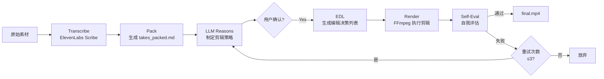

# video-use：用自然语言对话编辑视频——100 Stars 的 AI 视频剪辑革命

> **目标读者**：想要掌握 AI 视频编辑工具的开发者、内容创作者、视频制作团队
> **核心问题**：如何让非专业剪辑师用自然语言完成专业级视频编辑？
> **技术栈**：Python / ElevenLabs Scribe / FFmpeg / Claude Code
> **前置知识**：视频文件格式基础、命令行工具使用经验

---

## §1 设计目标与挑战

### 1.1 传统视频剪辑的困境

视频剪辑是一项耗时且需要专业技能的工作。即便是简单的"去掉语气词"和"停顿"，也需要：

| 传统方式 | 所需技能 | 平均耗时 |
|----------|----------|----------|
| Premiere Pro / Final Cut | 专业剪辑软件操作 | 1-3 小时/10分钟素材 |
| 手写 FFmpeg 命令 | 命令行 + 滤镜链语法 | 30-60 分钟 |
| 委托剪辑师 | 沟通 + 等待 + 返工 | 数小时到数天 |

**核心问题**：创意工作者（创始人、播客、教育者）需要的是"说一句话就能剪视频"，而不是学习剪辑软件。

### 1.2 video-use 的设计目标

**一句话定位**：Drop raw footage in a folder, chat with Claude Code, get `final.mp4` back.

**功能性目标**：
- 去除填充词（umm, uh, 重复语句）
- 自动去除镜头间死空间
- 专业级音频淡入淡出（30ms）
- 自动调色（暖色电影感 / 中性 / 自定义）
- 烧录字幕（可自定义样式）
- 生成动画叠加层（Manim / Remotion / PIL）

**非功能性目标**：
- 无需预设、菜单、复杂界面
- 100% 开源，本地运行
- Session 持久化（下次继续编辑）

### 1.3 核心挑战

| 挑战 | 描述 | 约束条件 |
|------|------|----------|
| **Token 成本** | 直接传视频帧给 LLM：30,000帧 × 1,500 tokens = **45M tokens** | 必须用极低成本方案 |
| **剪辑精度** | 剪切点必须精确到单词边界 | 不能破坏语义完整性 |
| **自我评估** | 如何让 AI 知道剪辑效果好不好 | 必须有客观评估机制 |

---

## §2 核心创新：LLM "读"视频而非"看"视频

### 2.1 方案对比

| 方案 | Token 消耗 | 可行性 | 剪辑精度 |
|------|------------|--------|----------|
| **直接传视频帧** | ~45M tokens/分钟 | ❌ 成本爆炸 | 高 |
| **端到端视频理解模型** | 未知 | ❌ 需要训练 | 不可控 |
| **video-use 方案（Transcript + 按需图片）** | ~12KB 文本 + 少量 PNG | ✅ 可行 | **单词边界精度** |

### 2.2 Layer 1：音频转录（始终加载）

ElevenLabs Scribe 提供：
- **词级时间戳**：每个单词的精确开始/结束时间
- **说话人分离**（Speaker Diarization）：自动识别不同说话人
- **音频事件标注**：`(laughter)`, `(applause)`, `(sigh)`

所有素材打包成 ~12KB 的 `takes_packed.md`：

```markdown
## C0103  (duration: 43.0s, 8 phrases)
  [002.52-005.36] S0 Ninety percent of what a web agent does is completely wasted.
  [006.08-006.74] S0 We fixed this.
```

**关键洞察**：12KB 的文本 vs 45M tokens 的原始帧——压缩比高达 99.97%！

### 2.3 Layer 2：可视化合成图（按需生成）

`timeline_view` 在决策点生成复合图片：
- 胶片条 + 音频波形 + 单词标签
- 仅在需要时调用（模糊停顿、镜头对比、剪切点校验）

```
Naive approach: 30,000 frames × 1,500 tokens = 45M tokens of noise
Video Use: 12KB text + a handful of PNGs
```

### 2.4 设计灵感来源

> 💡 就像 browser-use 给 LLM 提供结构化 DOM 而不是截图一样——video-use 给 LLM 提供结构化文本而不是原始视频。

---

## §3 系统架构与 Pipeline

### 3.1 整体 Pipeline



### 3.2 核心模块

| 模块 | 职责 | 技术实现 |
|------|------|----------|
| **Transcribe** | 音频转文字 + 时间戳 | ElevenLabs Scribe API |
| **Pack** | 整理转录结果 | Python 文本处理 |
| **LLM Reason** | 制定剪辑策略 + 生成 EDL | Claude Code (claude) |
| **Render** | FFmpeg 执行实际剪辑 | subprocess + ffmpeg 命令 |
| **Self-Eval** | 评估剪辑质量 | timeline_view + LLM 判断 |

### 3.3 编辑决策列表（EDL）

LLM 生成的剪辑计划：

```edl
# Edit Decision List for project_name
# Generated by video-use + Claude Code

[CUT] 00:00:02.52 → 00:00:00.00  # Remove: "umm"
[CUT] 00:00:06.74 → 00:00:06.08  # Remove: dead space
[FADE] 00:00:15.00 → 00:00:15.50  # 30ms audio fade
[SUBTITLE] 00:00:03.00 → 00:00:05.00  # "Ninety percent..."
```

---

## §4 核心功能详解

### 4.1 填充词与死空间去除

**检测逻辑**：
1. 识别填充词模式：`umm`, `uh`, `ah`, `er`, 重复单词
2. 识别短停顿（< 0.5秒）和长停顿（> 3秒）
3. LLM 判断：是语义停顿（需要保留）还是无效停顿（需要删除）

```python
# 伪代码示例
filler_patterns = ["umm", "uh", "ah", "er", r"(.+?)\1{2,}"]  # 重复词
silence_threshold = {"short": 0.5, "long": 3.0}
```

**剪切精度**：单词边界级别，不破坏语义的完整性。

### 4.2 自动调色

三种预设 + 自定义 FFmpeg 链：

| 预设 | 风格 | FFmpeg 滤镜链 |
|------|------|---------------|
| **warm_cinematic** | 暖色调电影感 | curves, vibrance |
| **neutral_punch** | 中性高对比 | curves, contrast |
| **custom** | 用户自定义 | 任意 ffmpeg 色彩滤镜 |

### 4.3 音频淡入淡出

**30ms 标准**：在每个剪切点自动添加 30ms 音频淡入淡出，避免音频突兀。

```ffmpeg
# 淡入淡出滤镜
afade=t=in:st=0:d=0.03
afade=t=out:st=10.0:d=0.03
```

### 4.4 字幕生成

默认样式：**2-word UPPERCASE chunks**（每 2 个单词为大写字母分块）。

完全可定制：
- 字数（1-5 词/块）
- 大小写（UPPERCASE / Title Case / 混合）
- 位置（底部居中 / 底部左侧）
- 样式（描边颜色、字体、阴影）

### 4.5 动画叠加层

支持三种动画引擎并行生成：

| 引擎 | 用途 | 并行策略 |
|------|------|----------|
| **Manim** | 数学/图表动画 | 每个动画一个 sub-agent |
| **Remotion** | React 风格动画 | 每个动画一个 sub-agent |
| **PIL** | 简单图片/文字叠加 | 主进程 |

### 4.6 自我评估机制

**核心创新**：在剪切点用 `timeline_view` 渲染输出，然后用 LLM 判断：

评估维度：
1. **视觉跳跃**：两个镜头衔接是否自然
2. **音频连贯**：是否有 pop、click、或不自然的停顿
3. **字幕准确性**：时间轴是否与语音同步

**失败重试**：最多 3 次重渲染机会。

---

## §5 使用方法

### 5.1 安装

```bash
# 1. 克隆并链接到 Claude Code skills 目录
git clone https://github.com/browser-use/video-use
cd video-use
ln -s "$(pwd)" ~/.claude/skills/video-use

# 2. 安装依赖
pip install -e .
brew install ffmpeg           # 必需
brew install yt-dlp            # 可选，用于下载网络视频

# 3. 配置 ElevenLabs API Key
cp .env.example .env
$EDITOR .env                   # ELEVENLABS_API_KEY=...
```

### 5.2 快速开始

```bash
# 1. 准备素材目录
cd /path/to/your/videos        # 放入原始视频文件

# 2. 启动 Claude Code
claude

# 3. 在 Claude Code 中输入自然语言指令
> edit these into a launch video
```

### 5.3 工作流程示例

```
用户: "edit these into a launch video"

Claude Code:
1. 扫描目录，发现 3 个 .mp4 文件
2. 生成剪辑策略并展示给用户
3. 等待用户确认 (y/n)
4. 用户确认后，执行 ffmpeg 剪辑
5. 生成 edit/final.mp4
6. 自我评估，检查剪切点质量
7. 报告完成

输出目录结构:
/path/to/your/videos/
├── source_01.mp4
├── source_02.mp4
├── source_03.mp4
└── edit/
    └── final.mp4        # 最终成品
```

---

## §6 动画叠加层开发扩展

### 6.1 Manim 动画

```python
# animations/manim_example.py
from manim import *

class IntroAnimation(Scene):
    def construct(self):
        text = Text("Introducing Our Product")
        self.play(Write(text))
        self.wait()
```

### 6.2 Remotion 动画

```tsx
// animations/remotion_example.tsx
import { AbsoluteFill } from 'remotion';

export const Intro: React.FC = () => {
  return (
    <AbsoluteFill style={{ backgroundColor: '#000', justifyContent: 'center', alignItems: 'center' }}>
      <h1 style={{ color: '#fff', fontSize: 72 }}>Introducing Our Product</h1>
    </AbsoluteFill>
  );
};
```

### 6.3 PIL 简单叠加

```python
# animations/pil_example.py
from PIL import Image, ImageDraw, ImageFont

def create_title_card(text: str, size=(1920, 1080)):
    img = Image.new('RGB', size, color='black')
    draw = ImageDraw.Draw(img)
    draw.text((960, 540), text, fill='white', anchor='mm')
    return img
```

---

## §7 设计原则总结

### 7.1 五大设计原则

| # | 原则 | 解释 |
|---|------|------|
| 1 | **Text + on-demand visuals** | 不直接传视频帧，用文本作为主要界面 |
| 2 | **Audio is primary** | 剪切来自语音边界和停顿，视觉跟随 |
| 3 | **Ask → confirm → execute → self-eval → persist** | 每步确认，不盲目执行 |
| 4 | **Zero assumptions about content type** | 不预设内容类型，先观察再剪辑 |
| 5 | **12 hard rules for production-correctness** | 技术规范必须遵守，艺术风格自由发挥 |

### 7.2 12 条生产规范（核心规则）

1. 音频淡入淡出：每个剪切点 30ms
2. 填充词必须删除（除非影响语义）
3. 死空间 > 2 秒必须删除
4. 字幕时间轴误差 < 100ms
5. 剪切点必须在单词边界
6. ...（完整规则见 SKILL.md）

### 7.3 可复用的经验

1. **用文本压缩代替原始数据**：将复杂媒体转结构化文本，token 成本降低 99.97%
2. **按需加载可视化**：只在决策点生成图片，而非全量预加载
3. **自我评估循环**：让 AI 验证自己的输出，而不是盲目信任

### 7.4 常见陷阱

| 陷阱 | 描述 | 避免方法 |
|------|------|----------|
| **过度依赖语音识别** | 转录错误会导致剪辑错误 | Self-Eval 环节必须验证 |
| **忽略音频事件** | laughter/applause 可能需要保留 | LLM 判断时考虑上下文 |
| **盲目追求短时长** | 过度剪辑破坏叙事节奏 | 先制定策略再执行 |

---

## §8 常见问题

### Q1: 支持哪些视频格式？
A: 支持 FFmpeg 支持的所有格式（mp4, mov, avi, mkv, webm 等）。

### Q2: 需要多少 ElevenLabs Credits？
A: 每个 10 分钟视频约消耗 ~$0.10 的 ElevenLabs Scribe Credits（具体取决于音频长度和说话人数量）。

### Q3: 能否离线使用？
A: 核心功能可以离线运行，但需要 ElevenLabs API Key 进行语音转录。如果有本地 Whisper 模型替代方案，可以考虑接入。

### Q4: 与 Runway / Pika / Sora 等 AI 视频工具有何区别？
A: video-use **不是生成式 AI**，它是**剪辑工具**。它的作用是帮你从原始素材中剪出成品，而不是生成新视频。

### Q5: 支持多轨道剪辑吗？
A: 当前版本主要针对单一镜头连续拍摄场景。多轨道、更复杂的时间线编辑是未来 roadmap。

---

## 相关资源

- **GitHub**: [browser-use/video-use](https://github.com/browser-use/video-use)
- **Skill 文件**: [SKILL.md](https://github.com/browser-use/video-use/blob/main/SKILL.md)
- **browser-use 组织**: [github.com/browser-use](https://github.com/browser-use)（同名组织的浏览器自动化工具）
- **ElevenLabs Scribe**: [ElevenLabs 语音转文字 API](https://elevenlabs.io/docs/speech-to-text)
- **FFmpeg**: [ffmpeg.org](https://ffmpeg.org/)

---

**文档信息**
- 难度：⭐⭐⭐⭐ 专家设计
- 类型：技术教程 / 架构分析
- 更新日期：2026-04-16
- 预计阅读时间：40-50 分钟
