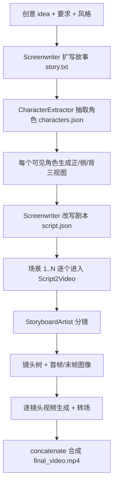

过去一年，AI 视频模型把"几秒钟的片段"越做越好，但把一个故事讲完整这件事没有跟进：角色跨镜头变脸、场景前后跳变、没有剧本结构，问题依旧。ViMax 的切入点很明确——它不训练任何视频模型，而是把生成画质之外的部分做成一条多智能体流水线：故事怎么扩写、角色怎么锁住、分镜怎么拆、镜头怎么接、素材怎么组装。

这个定位决定了看 ViMax 的正确姿势。画面质量的上限取决于你接入了哪家图像和视频模型（Veo、Seedance、GPT Image 2 都在支持之列），ViMax 自己下功夫的是生成之前和之后的两段：叙事规划与一致性管理。它给出的答案是 13 个各司其职的智能体模块、一套逐环节落盘的断点续跑机制，以及一篇 arXiv 技术报告。项目由香港大学 HKUDS 实验室（数据智能实验室）维护，2026 年 9 月已到 v1.2.0，Stars 从 5 月的 5,400 涨到 12,460（截至 2026-09-24，GitHub API）。

下面按"它是什么、怎么运转、一次任务怎么流过系统、代价是什么、该不该用"的顺序展开。

## 项目档案

| 项目 | 数据（截至 2026-09-24） |
| ---- | ---- |
| 仓库 | [HKUDS/ViMax](https://github.com/HKUDS/ViMax) |
| Stars / Forks | 12,460 / 1,878 |
| 许可证 | MIT |
| 语言与环境 | Python，要求 3.12+，uv 管理依赖 |
| 当前版本 | v1.2.0（2026-07-20 发布） |
| 技术报告 | [arXiv:2606.07649](https://arxiv.org/abs/2606.07649)，v1 于 2026-06-02 提交，v2 于 2026-07-21 更新 |
| 支持系统 | README 声明 Linux、Windows（macOS 未列入） |

时间线能看出项目的演进节奏：

- **2026-03-23**：接入 MiniMax 对话模型
- **2026-06-01**：支持 Google Omni 视频生成器
- **2026-06-07**：Novel2Video 工作流发布
- **2026-06-08**：Agent Loop + TUI 交互工作流上线（对话式规划、改稿、恢复会话、上下文压缩）
- **2026-06-09**：发布技术报告
- **2026-07-17**：接入 OpenRouter 的 GPT Image 2 图像生成与 Seedance 2.0 Fast 视频生成
- **2026-07-20**：v1.2.0 发布 Web UI（命名项目、产物与分镜预览、渲染检查点、深色模式）

半年内，它从一条纯命令行管线长成了带 TUI 和 Web UI 的交互工作区。仓库最近一次推送是 2026-09-20，51 个 issue 还开着，迭代没有停。

## 四条工作流：先分清输入和产物

ViMax 的功能都是围绕"你手里有什么"组织的，四条工作流对应四种起点：

| 工作流 | 输入 | 产出 | 适合谁 |
| ---- | ---- | ---- | ---- |
| Idea2Video | 一句话创意 + 创作要求 + 风格 | 故事、角色、剧本、分镜、成片 | 只有个点子，想看它变成画面 |
| Script2Video | 完整剧本（场景 + 对白） | 可控的多场景多镜头视频 | 已有剧本，要保留创作意图 |
| Novel2Video | 长篇小说 | 叙事压缩 + 角色追踪 + 场景规划后的分集视频 | 网文、小说的可视化改编 |
| AutoCameo | 一张人物或宠物的参考照片 | 把"你"写进故事并保持外观一致的客串视频 | 个人趣味创作 |

四条流水线不是并列关系。读代码可以发现，Idea2Video 在生成完故事和剧本后，逐场景调用 Script2VideoPipeline 完成实际渲染——剧本层和渲染层是叠起来的两层，不是四选一的平行入口。

## "多智能体"的两个口径

聊 ViMax 的架构要先分清两个口径，它们经常被混着说。

**宣传口径**来自仓库简介：Director（导演）、Screenwriter（编剧）、Producer（制片）、Video Generator（视频生成器）四位一体。这是产品隐喻，回答"它像一个小型剧组"。

**代码口径**是 `agents/` 目录下的 13 个 Python 模块。`__init__.py` 导出六个核心角色：

| 模块 | 在管线里的实际职责 |
| ---- | ---- |
| Screenwriter | 把创意扩写成故事，再把故事改写成结构化剧本 |
| CharacterExtractor | 从故事/剧本中抽取角色及其外观设定 |
| CharacterPortraitsGenerator | 为每个角色生成正面、侧面、背面三视图参考 |
| StoryboardArtist | 把剧本拆成分镜 |
| CameraImageGenerator | 组织镜头树，管理机位衔接与转场 |
| ReferenceImageSelector | 为每个镜头挑选参考图并生成图像提示词 |

另外七个模块（`novel_compressor`、`script_planner`、`script_enhancer`、`scene_extractor`、`event_extractor`、`global_information_planner`、`best_image_selector`）服务于小说压缩、剧本精修和全局信息规划。对照下来，宣传口径里的"制片"和"视频生成器"在代码里对应的是 `pipelines/` 的调度逻辑和 `tools/` 的模型适配器——真正有"智能体"实感的部分是文本规划层：谁来写故事、谁来拆镜头、谁来管角色。

## 一次 Idea2Video 任务的完整流转

架构图看三遍，不如跟一个任务走一遍。README 自带的示例是：idea 写"如果一只猫和一只狗是最好的朋友，它们遇到一只新猫会发生什么"，要求"面向儿童、不超过 3 个场景"，风格"Cartoon"。这行输入进入 `main_idea2video.py` 之后：



**第一步，故事扩写。** Screenwriter 接收创意和约束（"面向儿童、不超过 3 个场景"），输出完整故事文本，存为 `story.txt`。

**第二步，角色抽取。** CharacterExtractor 扫描故事，把每个角色的身份和外观关键特征结构化成 `characters.json`。这一步还会标记角色是否在画面中出现——只闻其声的旁白角色不会进入后面的肖像生成，代码里用 `is_visible` 字段做了过滤。

**第三步，角色三视图。** CharacterPortraitsGenerator 为每个可见角色生成正面、侧面、背面三张肖像。侧面和背面图由正面图派生编辑而来，从源头上避免了三个视角各画各的——这是锁脸的第一道保险；侧面或背面生成失败时，重试耗尽后直接复用正面图顶替，流水线不中断。多角色的肖像生成是并行的。

**第四步，剧本改写。** Screenwriter 把故事改写成按场景组织的结构化剧本 `script.json`，每个场景带着对白和动作描述。

**第五步，逐场景渲染。** 每个场景交给一个 Script2VideoPipeline，内部再走五小步：StoryboardArtist 设计分镜 → 把分镜拆成逐镜头的视觉描述 → CameraImageGenerator 构建镜头树（理清镜头间的衔接关系）→ ReferenceImageSelector 为每个镜头从角色三视图等素材中挑参考图、生成图像提示词，图像模型据此画出首帧和末帧 → 视频模型在首末帧之间生成片段，相邻镜头之间补转场视频。

**第六步，组装。** 所有场景视频用 moviepy 合并成 `final_video.mp4`。

整条链有一个对使用者非常友好的性质：**每个环节的产物都落盘，重跑时存在即跳过**。`story.txt`、`characters.json`、`character_portraits_registry.json`、`script.json`、每个场景的子目录、最终的 mp4，全部缓存在工作目录里。这意味着生成中断（API 超时、限流、手动 Ctrl-C）之后重跑，前面烧过钱的环节一分钱不重复花。官方在 2026-06-28 的更新里还专门修了 Script2Video 的断点恢复逻辑，并给渲染状态做了持久化——对一个每步都在调付费 API 的系统，这个设计不是锦上添花，是刚需。

## 一致性是怎么做出来的

跨镜头一致性是这类系统最容易吹牛的部分。ViMax 的说法在 arXiv 报告里，落地在代码里，两边能对上：

**叙事层，保故事不崩。** 论文描述为一个"分层叙事引擎"，用检索增强生成（RAG）维持全局故事连贯——长视频拆成多场景后，每个场景的生成都能引用全局设定，而不是只看得到局部上下文。依赖清单里的 `faiss-cpu`（向量检索库）与这个说法对应。

**视觉层，保角色不漂。** 这是代码里证据最硬的部分，三个机制环环相扣：角色三视图把"这个角色长什么样"固化成像素级的参考，而不依赖文字描述的多次转译；ReferenceImageSelector 按镜头需要挑选参考图并生成提示词，避免一张全家福式的参考图什么都想管又什么都管不住；镜头树把镜头之间的父子衔接关系显式建模，首帧、末帧用事件机制同步——转场视频要等父镜头的首帧就绪才开工，信号驱动，不靠碰运气。

**质量层，保成片能看。** 论文写的是"由 VLM 引导的智能体持续监控并优化叙事连贯性与视觉保真度"。这一层的对应物（如 `best_image_selector`）我未逐行读源码，具体筛选策略以代码为准，这里不做展开。

三层的分工可以记成一句话：叙事层管"故事对不对"，视觉层管"角色稳不稳"，质量层管"单帧行不行"。就读到的部分而言，视觉层的声明有实打实的代码对应，叙事层有依赖清单佐证，ViMax 的宣传没有跑在实现前面。

## 模型生态：适配器集，不绑死任何一家

ViMax 自己不生成任何像素，所有生成能力通过 `tools/` 目录下的适配器接入外部模型：

| 类型 | 已接入（据仓库 `tools/` 目录与 README） |
| ---- | ---- |
| 图像生成 | Nanobanana（Google 官方 API 及云雾中转）、豆包 Seedream（云雾中转）、OpenRouter（GPT Image 2） |
| 视频生成 | Google Veo（官方 API 及云雾中转）、豆包 Seedance（云雾中转）、Google Omni（云雾中转）、OpenRouter（Seedance 2.0 Fast） |
| 对话模型 | 经 LangChain 的 `init_chat_model` 接入，README 示例用 OpenRouter 的 Gemini 2.5 Flash Lite；MiniMax 自 2026-03 起可用 |
| 辅助 | BGE 重排序（SiliconFlow API）、渲染后端 |

接入新模型 = 在配置里写一个新的 `class_path`，代价很低。另一个观察是云雾（yunwu）API 中转的出现频率——过半的生成器适配器有云雾版本，作者明显预期了大量国内用户。对使用者来说这意味着：没有 Google API 也能用国产中转把整条链跑通，但所有生成质量的上限，也就随着你选的中转和模型而定。

## 上手路径

环境要求：Python 3.12+，用 [uv](https://docs.astral.sh/uv/getting-started/installation/) 管理依赖。README 声明的操作系统只有 Linux 和 Windows，macOS 未列入（PyTorch 源配置也只针对 linux/win32），Mac 用户需要自行承担兼容风险。

```bash
git clone https://github.com/HKUDS/ViMax.git
cd ViMax
uv sync
```

三种入口，按交互成本从低到高：

**脚本直跑**（最原始，适合理解管线）：复制 `configs/idea2video.yaml` 模板，填三段配置——对话模型、图像生成器、视频生成器（各自的 model、base_url、api_key），然后在 `main_idea2video.py` 里写 idea、user_requirement 和 style，`python main_idea2video.py`。

**Agent TUI**（官方推荐的主力入口）：

```bash
cp configs/agent.example.yaml configs/agent.local.yaml
# 编辑 agent.local.yaml，配置 llm / image / video 三段
vimax tui
```

会话可以新建和恢复（`vimax tui new` / `vimax tui resume`）；API key 也可以不写进配置文件，改用 `VIMAX_LLM_API_KEY`、`VIMAX_IMAGE_API_KEY`、`VIMAX_VIDEO_API_KEY` 三个环境变量。

**Web UI**（v1.2.0 新增）：需要 Node.js 18+，与 TUI 共用同一套 agent 运行时和 `configs/agent.local.yaml` 配置。

```bash
cd web
npm install
npm run dev
# 浏览器打开 http://127.0.0.1:4173
```

服务默认只监听 `127.0.0.1`，跑在远程服务器时用 SSH 端口转发（`ssh -N -L 4173:127.0.0.1:4173 <user>@<server>`），换端口用 `VIMAX_WEB_PORT`。

第一次跑，建议就用 TUI 跑 README 的猫狗示例（不超过 3 个场景），把首次实验的账单压到最低；确认效果和成本都在承受范围内，再上真活。

## 局限与代价

以下每条都有出处，不是臆测：

- **画质上限在底层模型。** ViMax 不生成像素，Veo 和 Seedance 能到什么水平，成片就是什么水平。官方 README 顶部列的"短片段、一致性、纯视觉导向"三条，是它对当前 AI 视频行业现状的判断，也是自己的立项动机——注意"短片段"这一条并没有被 ViMax 消灭，单段时长依然受底层视频模型限制，长视频靠的是拆分和组装。
- **每一步都在烧 API。** 一部多场景片子的账单 = 1 次故事扩写 + N 个角色 × 3 张肖像 + 每镜头 2 张关键帧 + 每镜头 1 段视频 + 转场，成本随镜头数线性增长。断点续跑能避免重复计费，但不能让总价变便宜。
- **音画能力要看版本口径。** v1.2.0 的特性表宣传"音画同步"（角色语音与音效和画面融合），但工具目录里的适配器清单以图像和视频生成器为主，音频管线的成熟度建议在动手前用小案例实测。
- **Roadmap 上还有没兑现的。** MiniMax H3 视频生成、基于 Skills 的自定义工作流扩展，都还是进行时（官方路线图用 ☑️ 标注）。
- **迭代快意味着不稳定。** 半年发了四五个大功能，51 个 issue 开着，今天读的源码细节（端口、配置字段、模块名）下个大版本可能就变。

## 采用建议

**现在就可以试的三类人**：研究多智能体编排的开发者——13 个模块的分工和逐环节落盘设计是一份很好的参考实现；手握小说或剧本、想快速看动态分镜的作者——Novel2Video 和 Script2Video 就是为此设计的；做 AI 视频工作流的工程师——它的适配器层和断点续跑机制可以直接抄。

**建议再等等的**：追求商业交付质量的内容团队。一致性和时长的天花板都压在底层生成模型上，编排层解决不了 Veo 本身的抖动，商业项目里人工修帧的成本可能比省下的制作费还高。

**从哪开始**：clone 之后先别急着接自己的创意，用 TUI 跑一遍猫狗示例，然后打开工作目录（`.working_dir/`）看中间产物——`story.txt`、`characters.json`、三视图肖像、逐场景的镜头文件全都在那里。这是理解 ViMax 架构最快的方式：所有智能体的输出都是可检查的文件，出了问题能定位到具体环节，而不是面对一段来路不明的视频发呆。

## 参考资料

- GitHub 仓库：[HKUDS/ViMax](https://github.com/HKUDS/ViMax)（本文仓库数据与 News 时间线截至 2026-09-24）
- 技术报告：[ViMax: Agentic Video Generation](https://arxiv.org/abs/2606.07649)（arXiv:2606.07649，作者 Lingxuan Huang、Sizhe He、Hengji Zhou、Liqiang Nie、Lianghao Xia、Chao Huang）
- 版本发布：[v1.2.0 Release](https://github.com/HKUDS/ViMax/releases/tag/v1.2.0)（2026-07-20）
