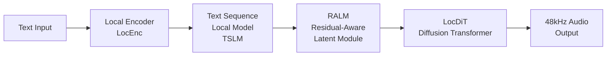

# VoxCPM2：Tokenizer-Free TTS 多语言语音合成指南 ⭐⭐⭐

> **目标读者**：AI语音开发者、研究人员，对TTS系统有一定了解
> **核心问题**：如何实现高质量、多语言、可控的语音合成？

---

## §1 学习目标

完成本文档后，你将掌握：

- ✅ 理解 VoxCPM2 的 Tokenizer-Free 设计理念
- ✅ 掌握 VoxCPM2 的三种语音合成模式
- ✅ 熟练使用 Python API 进行语音生成
- ✅ 了解 Voice Design 和 Voice Cloning 的实现方式
- ✅ 掌握本地部署和微调方法
- ✅ 对比传统 TTS 方案的架构差异

---

## §2 背景与问题动机

### 2.1 传统 TTS 的挑战

传统 Text-to-Speech (TTS) 系统面临以下挑战：

| 挑战 | 说明 | 影响 |
|------|------|------|
| Tokenizer 复杂性 | 需要复杂的文本分析器处理音素、韵律、语调 | 系统复杂、部署困难 |
| 多语言支持 | 不同语言需要不同的 token 字典 | 跨语言迁移困难 |
| 韵律控制 | 难以精确控制语速、语调、情感 | 合成结果不够自然 |
| 资源消耗 | 大模型推理资源需求高 | 难以在端侧部署 |

### 2.2 VoxCPM2 的创新设计

VoxCPM2 提出了 **Tokenizer-Free** 设计理念：

```python
# 传统 TTS 流程
Text → Tokenizer → Phonemes → Model → Audio
     ↑ 复杂的tokenizer需要额外处理

# VoxCPM2 流程  
Text → LocDiT Model → Audio
     ↑ 无需tokenizer，直接建模
```

**核心优势**：

- **简化流程**：去掉 tokenizer，降低系统复杂度
- **原生多语言**：统一模型支持 30 种语言
- **高质量输出**：48kHz 采样率，专业级音质
- **灵活控制**：Voice Design 支持自然语言描述控制
- **轻量推理**：支持多种量化方案（INT4/INT8）

### 2.3 VoxCPM2 产品线

| 模型 | 参数量 | 采样率 | 语言数 | 主要功能 |
|------|--------|--------|--------|----------|
| **VoxCPM2** | 2B | 48kHz | 30+ | Voice Design + Cloning |
| VoxCPM1.5 | 0.6B | 44.1kHz | 2 (zh, en) | 基础 TTS |
| VoxCPM-0.5B | 0.5B | 16kHz | 2 (zh, en) | 轻量级 |

---

## §3 核心架构解析

### 3.1 VoxCPM2 技术架构

VoxCPM2 采用创新的 **LocDiT** 扩散架构：



**各模块功能**：

| 模块 | 全称 | 功能 |
|------|------|------|
| LocEnc | Local Encoder | 文本局部特征提取 |
| TSLM | Text Sequence Local Model | 文本序列建模 |
| RALM | Residual-Aware Latent Module | 残差感知潜在表征 |
| LocDiT | Local Diffusion Transformer | 扩散 transformer 生成 |

### 3.2 与传统 TTS 架构对比

| 维度 | 传统 TTS (VALL-E) | VoxCPM2 |
|------|-------------------|---------|
| 文本处理 | Phoneme Tokenizer | Local Encoder (无需 tokenize) |
| 语言支持 | 单一语言或少量 | 30+ 语言统一建模 |
| 韵律控制 | 有限控制 | Voice Design 自然语言控制 |
| 推理速度 | 慢 | 优化的 LocDiT 加速 |
| 模型规模 | 7B+ 参数 | 2B 参数即可达到好效果 |

### 3.3 MiniCPM-4 Backbone

VoxCPM2 基于 **MiniCPM-4** 作为 backbone：

```python
# MiniCPM-4 架构特点
MiniCPMConfig {
    "dim": 2048,           # 模型维度
    "n_layers": 40,        # Transformer 层数
    "n_heads": 32,         # 注意力头数
    "vocab_size": 122_753, # 词表大小
    "max_seq_len": 4096,  # 最大序列长度
}
```

---

## §4 快速开始

### 4.1 环境安装

```bash
# 基础安装
pip install voxcpm

# GPU 加速（推荐）
pip install torch torchvision torchaudio
pip install voxcpm --extra-index-url https://download.pytorch.org/whl/cu118

# 验证安装
python -c "from voxcpm import VoxCPM; print('VoxCPM installed successfully!')"
```

### 4.2 基础语音合成

```python
from voxcpm import VoxCPM

# 加载模型
model = VoxCPM.from_pretrained("openbmb/VoxCPM2")

# 基础 TTS
text = "Hello, this is a test of VoxCPM2, a tokenizer-free TTS system."
audio = model.generate(text=text)

# 保存音频
model.save(audio, "output.wav")

# 或指定采样率
audio_48k = model.generate(
    text=text,
    sample_rate=48000,  # 48kHz 高质量输出
    cfg_value=2.0,     # Classifier-Free Guidance 强度
    inference_timesteps=10  # 扩散步数，越多越慢但质量越好
)
```

### 4.3 Voice Design 模式

使用自然语言描述创建独特音色：

```python
from voxcpm import VoxCPM

model = VoxCPM.from_pretrained("openbmb/VoxCPM2")

# Voice Design：自然语言描述音色
voice_description = "A warm, friendly female voice with a slight British accent"
audio = model.voice_design(
    text="Good morning! How can I assist you today?",
    voice_prompt=voice_description
)

model.save(audio, "voice_design_output.wav")
```

### 4.4 Voice Cloning 模式

从参考音频克隆音色：

```python
from voxcpm import VoxCPM

model = VoxCPM.from_pretrained("openbmb/VoxCPM2")

# 克隆参考音频
reference_audio = "reference_speaker.wav"
text_to_speak = "This voice will be cloned and used to speak this text."

# 基本克隆
audio = model.clone_voice(
    text=text_to_speak,
    ref_audio=reference_audio
)

# 带风格控制的克隆
audio_with_style = model.clone_voice(
    text=text_to_speak,
    ref_audio=reference_audio,
    style="happy",  # happy, sad, calm, excited
    speaking_rate=1.1  # 语速控制，1.0 为正常
)

model.save(audio_with_style, "cloned_voice.wav")
```

### 4.5 Ultimate Cloning 模式

完美复刻每个语音细节：

```python
# Ultimate Cloning：配合转录文本，完美复刻
audio = model.ultimate_clone(
    text="Transcript of the reference audio",
    ref_audio="reference_with_transcript.wav"
)
```

---

## §5 进阶用法

### 5.1 批量生成

```python
from voxcpm import VoxCPM

model = VoxCPM.from_pretrained("openbmb/VoxCPM2")

# 批量文本合成
texts = [
    "First sentence to synthesize.",
    "Second sentence for batch processing.",
    "Third and final sentence in this batch."
]

# 批量生成
audios = model.batch_generate(
    texts=texts,
    cfg_value=2.0,
    inference_timesteps=10
)

# 保存每个音频
for i, audio in enumerate(audios):
    model.save(audio, f"batch_output_{i}.wav")
```

### 5.2 多语言支持

```python
# 中文语音合成
zh_audio = model.generate(
    text="你好，这是一个中文语音合成的例子。",
    language="zh"  # 自动检测或手动指定
)

# 英文语音合成
en_audio = model.generate(
    text="This is an English speech synthesis example.",
    language="en"
)

# 日文语音合成
ja_audio = model.generate(
    text="これは日本語の音声合成の例です。",
    language="ja"
)

# 自动检测语言
auto_audio = model.generate(
    text="This text will be automatically detected.",
    language="auto"  # 自动检测
)
```

### 5.3 采样率配置

| 采样率 | 适用场景 | 文件大小 |
|--------|----------|----------|
| 16kHz | 电话级质量、端侧部署 | 小 |
| 44.1kHz | CD 音质 | 中 |
| **48kHz** | 专业录音、母带制作 | 大 |

```python
# 不同采样率对比
audio_16k = model.generate(text, sample_rate=16000)  # 轻量
audio_44k = model.generate(text, sample_rate=44100)  # CD音质
audio_48k = model.generate(text, sample_rate=48000)  # 母带级
```

### 5.4 CFG (Classifier-Free Guidance) 调优

```python
# 低 CFG：更多变化，可能不太稳定
audio_var = model.generate(text, cfg_value=1.0)

# 适中 CFG：平衡质量与变化
audio_balanced = model.generate(text, cfg_value=2.0)

# 高 CFG：更稳定但可能过于平滑
audio_stable = model.generate(text, cfg_value=3.0)
```

### 5.5 推理步数配置

```python
# 快速推理（质量较低）
audio_fast = model.generate(text, inference_timesteps=5)

# 标准质量
audio_std = model.generate(text, inference_timesteps=10)

# 高质量（较慢）
audio_hq = model.generate(text, inference_timesteps=20)

# 极致质量
audio_max = model.generate(text, inference_timesteps=50)
```

---

## §6 模型微调

### 6.1 LoRA 微调（推荐）

```python
from voxcpm import VoxCPM, VoxCPMFineTuner

# 加载预训练模型
model = VoxCPM.from_pretrained("openbmb/VoxCPM2")

# 配置 LoRA 微调
finetuner = VoxCPMFineTuner(model)

# 准备微调数据
train_data = [
    {"text": "训练文本1", "audio": "path/to/audio1.wav"},
    {"text": "训练文本2", "audio": "path/to/audio2.wav"},
]

# 开始微调
finetuner.finetune(
    train_data=train_data,
    lora_rank=16,           # LoRA rank
    learning_rate=1e-4,
    epochs=3,
    batch_size=2
)

# 保存微调后的模型
finetuner.save("my_finetuned_voxcpm2")
```

### 6.2 全量微调

```python
# 全量参数微调（需要更多显存）
finetuner.finetune(
    train_data=train_data,
    finetune_mode="full",  # 全量微调
    learning_rate=5e-5,
    epochs=5,
    batch_size=1,  # 全量需要更小 batch
    gradient_accumulation=4
)
```

### 6.3 微调数据准备

```python
# 数据格式示例
dataset = [
    {
        "text": "The quick brown fox jumps over the lazy dog.",
        "audio_path": "/path/to/audio.wav",
        "duration": 3.5,  # 秒
        "language": "en",
        "speaker_id": "speaker_001"
    },
    # ... 更多样本
]

# 保存为 JSONL 格式
import json
with open("voxcpm_ft_data.jsonl", "w") as f:
    for item in dataset:
        f.write(json.dumps(item) + "\n")
```

---

## §7 本地部署

### 7.1 Docker 部署

```bash
# 拉取镜像
docker pull openbmb/voxcpm2:latest

# 运行容器
docker run -p 8080:8080 \
    -v $(pwd)/models:/app/models \
    openbmb/voxcpm2:latest

# API 调用
curl -X POST http://localhost:8080/generate \
    -H "Content-Type: application/json" \
    -d '{"text": "Hello world", "language": "en"}' \
    --output output.wav
```

### 7.2 vLLM 推理加速

```python
# 使用 Nano-vllm 加速推理
from voxcpm import VoxCPM

# vLLM 后端
model = VoxCPM.from_pretrained(
    "openbmb/VoxCPM2",
    backend="vllm",  # 使用 vLLM 加速
    tensor_parallel_size=2  # 多卡并行
)

# 批量推理加速
audios = model.batch_generate(texts, batch_size=32)
```

### 7.3 Apple Silicon (MPS) 加速

```python
# macOS MPS 加速
model = VoxCPM.from_pretrained(
    "openbmb/VoxCPM2",
    device="mps"  # Apple Silicon GPU
)

audio = model.generate(text)
```

### 7.4 ONNX 导出

```python
# 导出为 ONNX 格式
from voxcpm import export

export.to_onnx(
    model=model,
    output_path="voxcpm2.onnx",
    optimize=True  # 优化模型
)
```

---

## §8 生态工具

### 8.1 voxcpm-rs (Rust 实现)

高性能 Rust 实现，适合嵌入式场景：

```bash
# 安装
cargo install voxcpm

# 命令行使用
voxcpm generate --text "Hello" --output hello.wav

# 作为库使用
voxcpm-cli synthesize \
    --model openbmb/VoxCPM2 \
    --text "你好世界" \
    --language zh \
    --output chinese.wav
```

### 8.2 voxcpm-onnxruntime

跨平台 ONNX Runtime 实现：

```python
from voxcpm_onnxruntime import VoxCPM_ONNX

model = VoxCPM_ONNX.from_pretrained(
    "openbmb/VoxCPM2-onnx",
    providers=["CPU", "CUDA", "TensorRT"]
)
```

### 8.3 voxcpm-ane (Apple Neural Engine)

iOS/macOS 原生加速：

```swift
// Swift 调用
import VoxCPM_ANE

let model = VoxCPM_ANE(modelPath: "VoxCPM2.ane")
let audio = try model.generate(
    text: "Hello from Apple Neural Engine!",
    language: .english
)
```

---

## §9 API 参考

### 9.1 核心类

| 类 | 说明 | 主要方法 |
|---|------|---------|
| `VoxCPM` | 主模型类 | `generate()`, `voice_design()`, `clone_voice()` |
| `VoxCPMFineTuner` | 微调器 | `finetune()`, `save()` |
| `VoxCPMConfig` | 配置类 | 模型配置参数 |

### 9.2 generate() 参数

| 参数 | 类型 | 默认值 | 说明 |
|------|------|--------|------|
| `text` | str | 必需 | 待合成文本 |
| `language` | str | "auto" | 语言代码 |
| `sample_rate` | int | 48000 | 采样率 |
| `cfg_value` | float | 2.0 | CFG 强度 |
| `inference_timesteps` | int | 10 | 扩散步数 |
| `temperature` | float | 1.0 | 采样温度 |

### 9.3 voice_design() 参数

| 参数 | 类型 | 默认值 | 说明 |
|------|------|--------|------|
| `text` | str | 必需 | 待合成文本 |
| `voice_prompt` | str | 必需 | 音色描述 |
| `language` | str | "auto" | 语言 |
| `cfg_value` | float | 2.5 | Design 模式建议更高 |

### 9.4 clone_voice() 参数

| 参数 | 类型 | 默认值 | 说明 |
|------|------|--------|------|
| `text` | str | 必需 | 待合成文本 |
| `ref_audio` | str | 必需 | 参考音频路径 |
| `style` | str | None | 风格控制 |
| `speaking_rate` | float | 1.0 | 语速 |

---

## §10 常见问题

### 10.1 显存不足

```python
# 解决方案 1: 减少 batch size
model.generate(texts, batch_size=1)

# 解决方案 2: 使用量化版本
model = VoxCPM.from_pretrained(
    "openbmb/VoxCPM2-quantized-int4"
)

# 解决方案 3: 使用 CPU
model = VoxCPM.from_pretrained(
    "openbmb/VoxCPM2",
    device="cpu"
)
```

### 10.2 生成质量不佳

```python
# 方案 1: 增加推理步数
audio = model.generate(text, inference_timesteps=20)

# 方案 2: 调整 CFG 值
audio = model.generate(text, cfg_value=2.5)

# 方案 3: 使用高质量采样率
audio = model.generate(text, sample_rate=48000)
```

### 10.3 语言检测失败

```python
# 手动指定语言
audio = model.generate(
    text="这是一段中文文本",
    language="zh"  # 明确指定
)

# 支持的语言代码
LANGUAGES = ["zh", "en", "ja", "ko", "fr", "de", "es", "it", "ru", ...]
```

---

## §11 总结

### 11.1 VoxCPM2 核心优势

1. **Tokenizer-Free 设计**：简化 TTS 流程，降低系统复杂度
2. **原生多语言**：30+ 语言统一建模
3. **高质量输出**：48kHz 专业级音质
4. **灵活控制**：Voice Design + Voice Cloning
5. **高效推理**：优化的 LocDiT 架构

### 11.2 适用场景

| 场景 | 推荐模型 | 理由 |
|------|----------|------|
| 对话助手 | VoxCPM2 + Voice Design | 灵活控制音色 |
| 有声读物 | VoxCPM2 + Voice Cloning | 保持一致性 |
| 游戏配音 | VoxCPM2 | 多语言支持 |
| 语音克隆 | VoxCPM2 Ultimate Clone | 完美复刻 |

### 11.3 下一步

| 资源 | 链接 |
|------|------|
| GitHub | https://github.com/OpenBMB/VoxCPM |
| 模型下载 | Hugging Face: openbmb/VoxCPM2 |
| 论文 | arXiv (待发布) |
| Discord | OpenBMB Community |

---

**文档信息**

- 难度：⭐⭐⭐
- 类型：技术教程
- 更新日期：2026-04-12
- 前置知识：Python 基础、TTS 概念、深度学习基础
