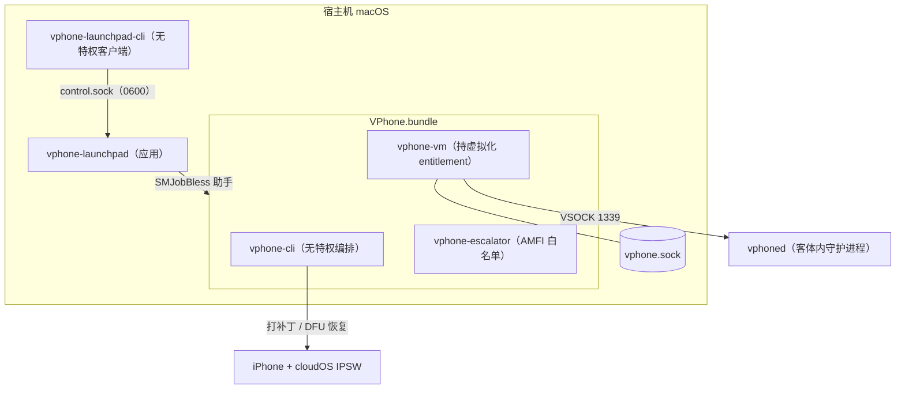

## 核心判断

vphone-cli 把一件以前只存在于安全研究实验室的事变成了命令行和应用操作：在 Apple Silicon Mac 上跑一台**真正的 iOS 虚拟机**——不是模拟器，而是用 Apple 自家 Virtualization.framework 启动的 iPhone 系统。它的技术路线基于 PCC（Private Cloud Compute）研究 VM 基础设施与社区对 Apple 虚拟化栈的逆向（致谢 wh1te4ever 的 super-tart writeup），整条链路是：准备 iPhone 与 cloudOS 两份 IPSW → 打补丁 → DFU 恢复 → 安装 CFW（定制固件）→ 首次启动。

这是一台可克隆、可导出、可程序化操控的 iPhone：每台虚拟机带一个宿主机控制插座（vphone.sock），支持截图、触摸、滑动、硬件按键、剪贴板，每个动作可以内联返回缩略图；再加一组可选的 HTTP/WebSocket API，覆盖应用、文件、进程、UI 树等百余个方法——官方明确面向 AI 驱动的自动化测试场景，仓库里还内置了一个教 coding agent 安装和操控虚拟机的 skill。

截至 2026-10-03，仓库 14,795 stars、1,746 forks，MIT 许可，Swift 为主要语言。它需要 Apple Silicon + macOS 15+，运行时不需要 Xcode、Python 或 Homebrew。它是研究性质的工具，不是消费级产品——这一点决定了它的全部适用边界。

> **版本提示**：本文写作时（2026-09-05）项目还在 1.x 纯 CLI 时代（当日最新版 1.0.13）；9 月 25 日起进入 2.x 应用时代，九天连发 22 个 release（至 2.3.2）。**2.x 无法启动 1.x 创建的虚拟机**，五档固件变体、SSH/VNC 开箱即用、`brew install` 安装路径均已废除。文中涉及旧口径处均单独标注，解读以 2.x 现状为准。

## 它实际上做了什么

Apple 官方从未开放"跑 iOS"的虚拟化能力；vphone-cli 的路径是深度修补 iOS 固件，让它接受 Virtualization.framework 的私有 PV=3 entitlement 环境。2.x 的恢复管线是一次**混合恢复**：先用 cloudOS IPSW 做一次临时恢复，从恢复出来的系统卷里提取 GPU 驱动包（`AppleParavirtGPUMetalIOGPUFamily`），缓存在 `~/.vphone/gpu-drivers/` 下供同版本 cloudOS 复用；然后再用 iPhone17,3 的恢复 IPSW 做第二次恢复，得到一个"云硬件 + iPhone 用户态"的混合系统。打补丁时还会把一个 arm64e GPU 编译器插件放进暂存的驱动包。

`vm create` 自动跑完全部步骤，成功时以 `First boot: vphoned ping succeeded` 收尾——它会真的启动一次 GUI、通过控制插座向客体内的守护进程 vphoned 发一个 ping，然后把这个验证用的虚拟机停掉，不留运行中的实例。交给用户的下一步是 `vm launch`。每一步也都可以手动驱动（`vm new` → `fw prepare` → `fw patch` → `vm launch --dfu` → `restore` → `cfw install` → `vm launch`），便于单阶段调试；`fw prepare` 和 `vm create` 都接受本地路径或 URL 形式的 `--iphone-source` / `--cloudos-source`。

## 系统地图：从应用到客体的五层组件



| 组件 | 职责 | 关键事实 |
|------|------|---------|
| `vphone-launchpad` | Mac 应用，下载校验 bundle、建机器、跑虚拟机 | 独立发版，持有唯一的特权助手（SMJobBless），公证版随 release 提供 |
| `vphone-launchpad-cli` | 应用的无状态命令行客户端 | 经 `~/Library/Application Support/vphone-launchpad/control.sock`（0600）驱动运行中的应用，命令会出现在应用窗口历史里 |
| `vphone-cli` | 准备固件、打补丁、恢复、管理虚拟机 | 无私有 entitlement；AMFI 拒绝时会打印出白名单命令 |
| `vphone-vm` | 运行虚拟机、显示窗口、转发控制插座 | 唯一持有 Apple 私有虚拟化 entitlement 的进程 |
| `vphone-escalator` | 给当前构建的 `vphone-vm` cdhash 做 AMFI 白名单 | 取代 1.x 时代的 `vphone-amfidont` |
| `vphoned` | 客体内守护进程，窗口功能与 API 都经过它 | 以 iOS 交叉编译、预签名后放进 bundle 的 `guest-resources/`，经 VSOCK 1339 提供 HTTP/WebSocket 服务 |

这个 bundle 是"可执行文件的容器"而非 app：里面只有宿主机程序（MacOS/）和要装进客体的 iOS 产物（guest-resources/），全部 ad hoc 签名，只有必需的子进程携带私有 entitlement。Launchpad 2.1.0 起要求 bundle 版本不低于 2.1.0（补丁预设与 escalator 都在那之后引入）。

## 固件与补丁：五档变体已是历史

本文初版所据的 1.x README 给出过一张五档固件变体表，按安全旁路深度递进，是当时理解这个项目的核心：

| 变体 | 启动链补丁 | CFW 阶段 | 说明（1.x 口径） |
|------|-----------|---------|------|
| `less` | 4 | 2 | 近乎无补丁，保留 iOS 全部缓解机制 |
| `regular` | 42 | 10 | 旁路 AMFI/SSV/Img4/TXM |
| `dev` | 53 | 12 | 加 TXM entitlement/debug 旁路 |
| `jb` | 113 | 14 | 完整越狱（首启自动装 Sileo、TrollStore） |
| `exp` | 141 | 18 | jb 超集 + 反 VM 检测研究补丁 |

2.x 把这套选择制整体换成了**声明式补丁清单**：121 个补丁分属九个补丁集（`bootchain`、`kernel.base`、`kernel.cfw`、`kernel.hypervisor`、`kernel.frida`、`devicetree`、`guest.system`、`guest.display`、`guest.identity`），声明文件在 `VPhoneExecutable/VPhoneCommand/FirmwarePatcher/PatchSets/`，用 `vphone-cli fw patches` 即可列出（`--json` 供 Launchpad 的补丁编辑器读取）。公共工作流固定应用完整补丁集（含原 exp 的全部改动），变体不可再选；真正可选的是两套**预设**：`standard`（默认）会关掉两个 Frida Stalker 放宽补丁、三个 `hv_vmm_present` 隐匿补丁和 iPhone17,3 身份改写，`extended` 什么都不关。逐组件的补丁对照史保留在 `Research/0_binary_patch_comparison.md`，旧变体行已被官方标为"research history"。

同步消失的还有 jb 变体的"开箱即用"：现行工作流**不装** Sileo、apt、TrollStore、SSH 或 VNC，虚拟机出厂是一个空环境。需要包管理器时，从 VM 窗口的 **Apps → Install Bootstrap…** 走 roothide 布局装 Irisin（作者自家的 bootstrap 管理器；rootless 布局已弃用），首次安装要把 apt、bash、uikittools、launchctl、openssh-server 一次性全选后 Bootstrap Install——这些包相互依赖，逐个装会中途失败。

## 宿主机代价与机器生命周期

跑 PV=3 私有 entitlement 环境，宿主机必须放松系统防护。现行文档推荐的路子比 1.x 克制：恢复模式里 `csrutil enable --without debug` + `csrutil allow-research-guests enable`，**SIP 保持开启**，只放宽调试限制；然后用 `vphone-escalator allow` 给当前构建的 `vphone-vm` 白名单。更宽松的 A 路径（`csrutil disable` + `sudo nvram boot-args="amfi_get_out_of_my_way=1 -v"`）仍记录在 `Documents/Guides/host-setup.md`，但文档已不再把它当首选。两个细节值得知道：每次重新构建（哪怕只改了签名）都要重跑 `allow`；`vphone-escalator off` 只移除它自己加过的 cdhash。macOS 27 / M6 上 amfid 以 `ARM64E.X1` 变体运行，escalator 因此要以 arm64e + arm64e.x1 双切片的 fat binary 发布（`Research/Host/macos27_m6_amfi.md` 记录了整个定位与修复过程），它不关闭 SIP、不给 amfid 打代码补丁。

`zsh: killed ./vphone-cli` 这个最常见的失败就是 AMFI 没放行；嵌套虚拟机（Mac 本身是 VM）则直接不支持 PV=3。

生命周期管理保持了 1.x 以来的工程化水准：`vm clone` 优先用 APFS 写时复制并保留完整机器状态（含设备身份与引导文件）；`vm export` 默认 zstd 压缩（`--max` 走 xz -9）、自动跳过恢复目录与暂存文件；`vm import` 一条命令还原。所有数据集中在 `~/.vphone/`：虚拟机在 `machines/<name>/`（含磁盘、`config.plist` 与补丁工作文件），IPSW 与 GPU 驱动分别缓存在 `ipsws/`、`gpu-drivers/`，整个树可用 `$VPHONE_ROOT` 重定向，库单独用 `$VPHONE_LIBRARY_ROOT` 覆盖。每台虚拟机默认 64 GB 虚拟盘，固件与临时恢复树另算——官方明确建议**创建任务一次只跑一个**，先查剩余磁盘空间。

网络是 2.x 新增的可配面，每台机器四选一存在 `config.plist` 里：`nat`（默认）、`bridged`（局域网可达）、`tunnel`（vphone-vm 在用户态做网卡，让客体流量跟随 Mac 的 VPN/代理路由，IPv4、仅出站、网关 192.168.127.1）、`none`（离线）。iPadOS 客体也已支持：把 iPad 恢复 IPSW 传给同一个 `vm create` 即可，覆盖 iPad mini (A17 Pro) 到 iPad Pro 13" (M5) 八款 Wi-Fi 机型（兼容性文档里端到端验证记录目前是 iPad mini 一款），蜂窝机型按其 Wi-Fi 孪生机型运行（虚拟机没有基带）。机制上只换用户态：内核、SEP、设备树仍来自 cloudOS，补丁会把 iPad 自己的设备树身份与 2x 屏幕缩放写进一份 guest 副本（详见 `Documents/Guides/ipados.md`）。

## 控制面：一个插座和一套 API

**vphone.sock 是那把万能钥匙。** 每台虚拟机（无头模式也一样）在 `~/.vphone/machines/<name>/vphone.sock` 提供一个 Unix 插座，一条 JSON 进、一条 JSON 出，连接并发服务。请求就七种：`ping`、`screenshot`（全分辨率存文件）、`tap`、`swipe`、`key`（home/power/音量走硬件 HID，其余转发给 `input.key`）、`type`（注意：只写**客体剪贴板**，不模拟输入）、以及 `rpc` 透传调用任意 vphoned 方法。动过屏幕的请求默认在 500 毫秒后附一张小图——那是张**灰度 JPEG 缩略图**，官方明说只够"看一眼有没有变化"，要读文字、颜色、布局就得存 PNG 或走 `ui.describe`/`ui.ocr`。两个坐标系别混用：插座的 tap/swipe 吃 1290×2796 **像素**，vphoned 的 `input.*` 系列吃**屏幕点**。宿主机侧会把输入事件串行化，连续 tap 不会乱序。

**HTTP/WebSocket API 是给程序化集成的完整面。** `vm launch` 时加 `--api-listen 127.0.0.1:8765`，vphone-vm 会把客体 VSOCK 1339 上的 vphoned 服务代理到宿主机 TCP 端口。鉴权用一次性 token（每次启动用 `SecRandomCopyBytes` 生成 32 字节，启动后打印在 `[api] token:` 行；要固定就先设 `VPHONE_API_TOKEN`），三种携带方式任选：`Authorization: Bearer` 头、`?token=` 查询参数、WebSocket 的 `Sec-WebSocket-Protocol`。比较是常数时间的；带 `Origin` 头或 Host 不合规的请求直接 403（关掉浏览器侧表单 POST 和 CSRF 类攻击面），GET 路由只读，JSON 体限 1 MiB。全量目录在 `Research/vphoned_http_api.md`：百余个方法覆盖约十九个区——设备状态、屏幕/亮度/音量、输入手势、UI 树与 OCR、进程、launchd、日志（含崩溃日志）、Darwin 通知、抓包、应用（安装 IPA/TIPA、启动并验证前台）、文件（流式读写）、剪贴板、**位置模拟**、钥匙串（只列不取值）、包（只读）、bootstrap、UDID 覆写、设置助手跳过。几处设计很能说明作者对"评估工具"边界的理解：

- **force 门槛**：`processes.kill`、`services.stop`、`apps.uninstall`、`system.respring`、`system.reboot`、`setup.skip` 等破坏性方法拒绝执行，除非请求带 `"force": true`——把确认显式交给调用方。
- **故意不暴露**：账户密码、开机 logo 渲染、包的安装/卸载/源变更都不在 API 里。
- **位置模拟带回读验证**：`location.set` 走 Xcode 同款序列，之后最多等 5 秒读回一个新鲜且标记为模拟的定位，读不回就报 `unavailable` 并清理——不靠"发了就算成功"。
- **WebSocket 能当 TCP 隧道**：`GET /v1/ports/<port>` 升级后逐块转发到客体的 `127.0.0.1:<port>`，官方例子是用它穿透到客体 SSH（客户端还需本地 TCP-WebSocket 桥）。

生态位也有变迁：1.x README 曾把 MCP 封装指向第三方 [pluginslab/vphone-mcp](https://github.com/pluginslab/vphone-mcp)（Python，包一层 vphone.sock，每个动作内联约 20-30 KB 灰度截图）；2.x 的官方路径换成了仓库内置的 `Skills/vphone-guest-control/` skill——README 里那段 "Let an agent do it" 提示词让 Claude Code、Codex 之类的 agent 自己读 skill、检查环境、装 Launchpad、建机器，并在需要管理员密码或动宿主安全设置时停下来问人。skill 里几条规则写得相当务实：不用 `vm create` 复现问题（一次创建几十 GB）、不改宿主安全设置、force 方法必须出于用户本意、`--api-listen` 只留 loopback（token 走明文 HTTP）。

## 一轮 AI 驱动的 E2E 测试怎么跑

把上面的控制面串起来，一次真实任务是这样的：

```sh
# 1. 启动并打开 API（或直接用 Launchpad 建好的机器）
vphone-cli vm launch myphone --api-listen 127.0.0.1:8765
# 从启动输出抄下 [api] token: 后的值，或预先 export VPHONE_API_TOKEN=...

# 2. 健康检查
curl -H "Authorization: Bearer $TOKEN" http://127.0.0.1:8765/v1/health
# capabilities 字段会列出这个 vphoned 支持的区，老客户端据此隐藏面板

# 3. 用 UI 树定位控件，而不是猜坐标
curl -H "Authorization: Bearer $TOKEN" -H "Content-Type: application/json" \
     -d '{"method":"ui.tree","params":{"nested":true,"max_elements":500}}' \
     http://127.0.0.1:8765/v1/rpc

# 4. 点击（屏幕点坐标），然后要一张全分辨率截图核对
curl -H "Authorization: Bearer $TOKEN" -H "Content-Type: application/json" \
     -d '{"method":"input.tap","params":{"x":120,"y":300}}' \
     http://127.0.0.1:8765/v1/rpc

# 5. 验证前台应用，而不是相信"返回 ok 就是打开了"
curl -H "Authorization: Bearer $TOKEN" -H "Content-Type: application/json" \
     -d '{"method":"apps.foreground","params":{}}' \
     http://127.0.0.1:8765/v1/rpc
```

官方 skill 把第 3、5 步写成了纪律："命令返回 ok 不等于屏幕上出现了预期结果"——每次输入后截图或读 `ui.describe`，每次启动后查 `apps.foreground`。`apps.launch` 的返回里专门有 `frontmost_verified` 字段：它核对 RunningBoard 的实时焦点断言，还会排除主屏小组件渲染器这种也会持有 `UIFocal` 的进程，确认不了就如实返回 `frontmost_verified=false`。对要把 LLM 接进回归测试的团队，这种"每个动作可验证"的设计比多几个花哨方法重要得多。

## 踩坑清单与采用边界

- **卡在 "Press home to continue"**：用 VM 窗口的 **Keys → Home**。1.x 时代答案是 VNC 右键模拟——现行工作流不装 VNC，旧法已不可用。
- **应用启动即崩 `EXC_GUARD`**：内核补丁 `kernel-boot-thread_guard_violation` 只在 iOS 18 基底上启用（那里的启动必需它），26.x 基底触发这个 guard 的应用仍会退出（issue #291）。1.x 的 `--force-exc-guard` 选项已删除。
- **创建失败**：保持 DFU 到 `restore` 退出、确认能访问 Apple 拿签名票据；整个管线失败就换个新名字加 `-v` 重跑 `vm create`，磁盘和内存紧张时不要并行创建。客体起来了但 vphoned 没应答，首启检查会在 300 秒后超时。
- **`vm create` 打印成功但没有虚拟机在跑**：设计如此——那是一次带 ping 验证的临时启动，验证完即停，用 `vm launch` 才是正式开机。
- **设置助手**：1.x FAQ 曾警告初始设置地区别选日本或欧盟（监管检查通不过），现行文档已不再提这条；新增的 `setup.skip`（force）可以直接在已激活客体上跳过设置助手。
- **1.x 的 ldid 重签挂起 bug**（Homebrew stable 的 ldid-procursus 2.1.5 对 entitlements 值恰为 0 的系统二进制会无限写内存，需 `brew install --HEAD ldid-procursus`）：系 1.x host-mount 重签流程的坑，现行文档已不再提及；真遇到重签挂起可回头参考 era README 的分析。

**适合**：iOS 自动化测试（尤其 AI agent 驱动的 E2E）、安全研究、逆向分析、需要多台可重置 iPhone/iPad 的 CI 场景。控制插座 + HTTP API + 官方 skill 让它天然适合接入 LLM 工具链；iPadOS 支持把"平板自动化"也纳入了射程。

**不适合**：日常"想在电脑上玩手机"——SIP 放松、64 GB 起步的磁盘、恢复流程的门槛都在；也不适合生产环境的 App 分发验证——完整补丁集绕过了大量安全机制，行为与真机有差异。修补苹果固件自用属研究范畴，分发补丁后的固件不在此列，具体法律边界仓库未展开，使用者自行评估。

**采用顺序**：想验证能不能跑，从 release 页下载公证版 Launchpad 走图形流程（没有 `-notarized` 文件就照 `Documents/Downloads/README.md` 的表挑一个公证版本，Launchpad 不会自我更新）；要程序化集成，先读 `Research/vphoned_http_api.md` 再决定用插座还是 API；交给 agent 管理时直接用 README 的提示词装载官方 skill。1.x 用户注意虚拟机格式不兼容，迁移即重建。

## 结语

vphone-cli 是 Apple 生态里少见的"把封闭平台拆开给你看"的工具：它不是官方能力的包装，而是社区对 Virtualization.framework 与 iOS 启动链理解的集大成。一个月从纯 CLI 演进到"应用 + skill + API"三件套，说明作者很清楚这个项目的终局用户是程序——无论是跑回归的测试框架，还是看着截图决定下一步点哪的 agent。对做 iOS 自动化或安全研究的人，一台可克隆、可编程、几分钟重建的虚拟 iPhone 改变了实验的成本结构；对其他人，它更像一份可运行的逆向工程教材。

仓库地址：[Lakr233/vphone-cli](https://github.com/Lakr233/vphone-cli)

---

*本文以 2026-10-03 的 main 分支（commit 39381715，v2.3.2）与 GitHub API 当日读数（14,795 stars / 1,746 forks）为基准核查；1.x 口径对照文章发表日（2026-09-05）前最后一个提交 87f796c6（2026-08-31，v1.0.13）。项目演进极快（9 月 25 日以来 22 个 release），机制细节请以仓库 `Documents/Guides/` 与 `Research/` 当前版本为准。*
