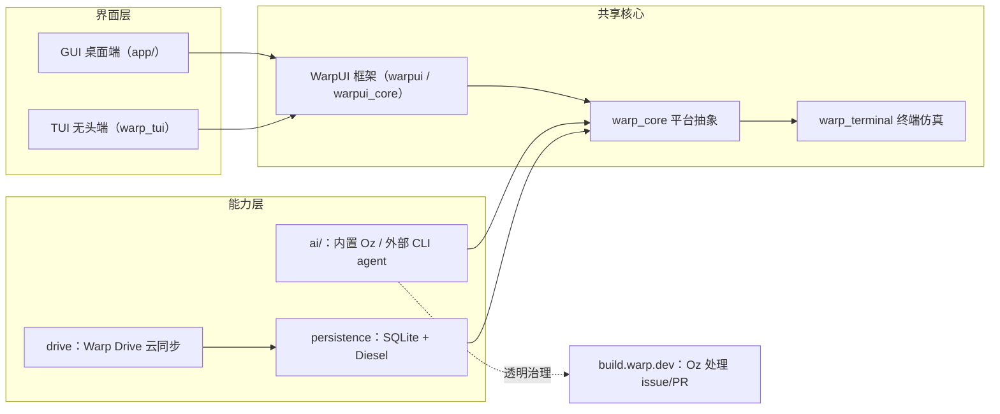

# Warp：从终端模拟器长出来的 Agentic Development Environment

Warp 的取舍一句话能说清：不把 AI 做成终端里的一个聊天框，而是把终端本身当成 agent 的载体。它把一个传统终端模拟器重写成 Rust 代码库，自研 UI 框架撑起两个前端，再让名叫 Oz 的 coding agent 直接参与这个仓库自己的 issue 和 PR 治理，全程在 [build.warp.dev](https://build.warp.dev) 上公开。

[Warp](https://github.com/warpdotdev/warp)（[warpdotdev/warp](https://github.com/warpdotdev/warp)）是 2021 年启动的项目，2025/2026 年转型为官方描述的 **agentic development environment, born out of the terminal**。项目主页是 [warp.dev](https://warp.dev)。

**核心数据**（GitHub API，采集时间 2026-08-07）：

| 字段 | 值 |
|------|-----|
| Stars | 64,025 |
| Forks | 5,391 |
| 主要语言 | Rust |
| License | AGPL-3.0（`warpui` / `warpui_core` 两个 crate 为 MIT） |
| 默认分支 | master（高度活跃，日常推送） |
| 创建时间 | 2021-07-08 |
| 赞助方 | OpenAI（founding sponsor） |

README 底部的说明：

> [!NOTE]
> OpenAI is the founding sponsor of the new, open-source Warp repository, and the new agentic management workflows are powered by GPT models.

---

## 1. 系统总览：三层结构，两条主线

Warp 不是单一的程序，而是一个 Cargo workspace（AGENTS.md 明确写是 60+ 个 member crates）。把它拆开看，是三层结构加两条主线：

- **界面层**：两个前端共享同一套核心——GPU 渲染的 GUI 桌面端（`app/`）和无头 TUI 端（`crates/warp_tui`）。
- **共享核心**：`warpui` / `warpui_core` 自研 UI 框架、`warp_core` 平台抽象、`warp_terminal` 终端仿真。
- **能力层**：`ai/`（内置 Oz agent + 外部 CLI agent）、`persistence`（SQLite/Diesel）、`drive`（Warp Drive 云同步）。

两条主线分别对应"用什么渲染"和"谁来干活"：渲染交给 WarpUI，干活既有内置的 Oz，也允许带自己的 CLI agent 进来。



---

## 2. 两个前端 + WarpUI 框架

终端模拟器用 Rust 写本身就少见，主流方案大多从 C 生态（GTK/Qt）长出来；Warp 更特别的是没挂现成的跨平台框架，而是自研了 UI 框架 WarpUI。AGENTS.md 里写得很清楚：它有 **GUI 和 TUI 两个前端**，共享 `warp_core` / `warpui` 的 Entity/model 核心，渲染方式各自不同。

WarpUI 的核心是 **Entity-Component-Handle 模式**：

- 全局 `App` 对象拥有所有视图/模型（作为 entities）。
- 视图通过 `ViewHandle<T>` 引用其他视图，而不是直接持有。
- `AppContext` 在 render/event 期间提供对 handle 的临时访问。
- `Element` 描述视觉布局，风格受 Flutter 启发，GUI 端在 GPU（WGSL）上渲染。
- 独立的 Actions 系统处理事件。
- 鼠标状态用 `MouseStateHandle`，构建时创建一次后复用；在渲染循环里内联 `MouseStateHandle::default()` 会导致鼠标交互全部失效。

```text
crates/
  warpui/          # WarpUI 框架主 crate（MIT）
  warpui_core/     # 核心抽象，含 TUI 的 cell-grid 元素库（MIT）
  warp_tui/        # 无头 TUI 前端
  warp/            # 主二进制在 app/ 下
  ...
```

License 的切割也对应这层设计：`warpui_core` 和 `warpui` 两个 crate 用 MIT，仓库其余部分用 AGPL-3.0。想复用 UI 框架的人可以只拿 MIT 的部分，不必把改派生代码开源。

---

## 3. Agent 层：Oz 与自带 CLI agent

README 的定位是平台层，不是打包好的 AI 功能：

> Use Warp's built-in coding agent, or bring your own CLI agent (Claude Code, Codex, Gemini CLI, and others).

Agent 层有两条路：内置的 Oz（GPT 驱动），以及任何符合接口规范的外部 CLI agent，比如 Claude Code、Codex、Gemini CLI。这也是它和"只带一个聊天框"的终端本质上的区别——接入点是一个能跑多步 agent 任务的执行环境，而不是一条 prompt。

Oz 的作用不止在终端里。Warp 用 Oz 维护它自己的开源仓库，公开仪表盘 [build.warp.dev](https://build.warp.dev) 展示了这套工作流：

> - Watch thousands of Oz agents triage issues, write specs, implement changes, and review PRs
> - View top contributors and in-flight features
> - Track your own issues with GitHub sign-in
> - Click into active agent sessions in a web-compiled Warp terminal

也就是说，Oz 不是演示，而是在真实处理这个仓库的 issue 和 PR，并且你可以在浏览器里点进一个编译成 Web 的 Warp 终端，看 agent 会话正在干什么。"agent 维护开源仓库"在别处多半是口号，这里能点进去看实时过程，是这套设计里少见的可验证部分。

---

## 4. 状态与同步：SQLite/Diesel + Warp Drive

本地状态用 **SQLite** 存，通过 **Diesel ORM** 管 schema。终端这类桌面应用选 SQLite 有现实理由：单文件、零配置、不需要起一个数据库服务，进程重启后状态直接落在本地文件里，离线也能读。迁移在 `crates/persistence/migrations/`，schema 定义在 `crates/persistence/src/schema.rs`。Warp Drive 的云同步是叠加在上面的可选增强层，让对象跨设备同步；本地是主存储，云同步不改变本地优先的事实。

---

## 5. 一次 issue 到 PR 的流转

把前面几层串起来，看 Oz 在一个真实仓库里怎么干活。Warp 的 README 描述了这套贡献流程：

1. 社区或用户提交 issue。
2. Oz agent 或维护者做 triage，打上就绪标签：`ready-to-spec` 表示设计开放、欢迎社区写 spec；`ready-to-implement` 表示设计已定型、欢迎代码 PR。
3. 在 `ready-to-spec` 的 issue 上，社区或 Oz 写 spec，把设计定下来。
4. 设计定型后转入 `ready-to-implement`，有人提交代码 PR。
5. Oz 参与 review，PR 合入。
6. 整个过程在 build.warp.dev 上透明可见；遇到自动化代理出了问题，可以 `@oss-maintainers` 升级给团队。

这套流程的价值在于把"agent 会失控"的担忧翻译成了可看、可跟、可插手的机制——外部贡献者能清楚看到"哪里能介入"，而不是面对一个黑盒。

---

## 6. 编译与本地运行

README 和 AGENTS.md 给出了标准的本地构建流程：

```bash
# 平台相关初始化（含 common skills 安装）
./script/bootstrap

# 构建并运行 GUI 桌面端
./script/run

# 运行无头 TUI 前端
./script/run-tui

# presubmit 检查（fmt + clippy + tests）
./script/presubmit
```

要连本地 warp-server 实例，用环境变量开关，不是 cargo feature：

```bash
# 连默认 8080 端口的本地 server
WITH_LOCAL_SERVER=1 ./script/run

# 自定义端口（8082）
WITH_LOCAL_SERVER=1 SERVER_ROOT_URL=http://localhost:8082 WS_SERVER_URL=ws://localhost:8082/graphql/v2 ./script/run
```

`SERVER_ROOT_URL` 默认 `http://localhost:8080`，`WS_SERVER_URL` 默认 `ws://localhost:8080/graphql/v2`。测试用 `cargo nextest`（并行、更快），比如补全模块单独跑 `cargo nextest run -p warp_completer --features v2`；提交 PR 前 presubmit 必须通过 fmt、clippy、tests 三项。

---

## 7. 数据怎么读

Stars 从 2026-04 的约 4.4 万涨到 2026-08 的约 6.4 万，三个月涨了约 2 万。这个速度说明"agentic 转型"确实把注意力吸引过来了，但它只反映关注度，不反映 UX 质量或稳定性——star 数高不代表终端好用。

build.warp.dev 上"thousands of Oz agents"的数，是 Warp 自己基础设施的规模，也不是 agent 正确率的基准。它说明 Warp 把 agent 工作流当真在生产里跑，但你不能拿它推断"Oz 比我写的代码更可靠"。

---

## 8. 采用建议与边界

谁适合认真看 Warp：

- 研究 terminal-native AI agent 架构的人——它示范了一条不复用 Electron 的自研 UI + 内置 agent 的路径。
- 对 Rust 自研 UI 框架感兴趣的人，`warpui` / `warpui_core` 是 MIT，可以直接读。
- 想观察"agent 治理开源项目"长什么样的人，build.warp.dev 是最直观的窗口。

谁不必急着上：

- 已有稳定终端工作流、并不需要 agent 化的人，切换成本高，收益不明显。
- 需要在商业闭源产品里内嵌终端、又不想受 AGPL-3.0 约束的团队（只有 `warpui` / `warpui_core` 是 MIT）。
- 对本地从源码构建有顾虑的人——60+ crates 的 workspace，`master` 又是高度活跃的开发分支，构建对硬件和耐心都是考验。

边界也写在明面上：Oz 虽然处理真实 issue，但 README 反复让你遇到自动化问题就 `@oss-maintainers`，说明它的自动化还有兜底入口，不是全自动闭环。

---

## 9. 结尾判断

Warp 最值得关注的不是某一个终端特性，而是它把"terminal-native agent"从概念变成了可运行、可观察、可参与的东西：自研 UI 框架把渲染握在自己手里，Oz 用真实 issue/PR 检验 agent 工作流，build.warp.dev 把过程公开到能点进去看。它不一定是终端的终点，但它把"终端能不能成为 agent 的载体"这个问题，从讨论推进到了可以上手验证的状态。

---

- [Warp 官网](https://warp.dev)
- [Warp 官方文档](https://docs.warp.dev)
- [Warp Agent Dashboard](https://build.warp.dev)
- [工程指南 AGENTS.md](https://github.com/warpdotdev/warp/blob/master/AGENTS.md)
- [Oz Agents 官方介绍](https://www.warp.dev/agents)
- [How Warp Works](https://www.warp.dev/blog/how-warp-works)