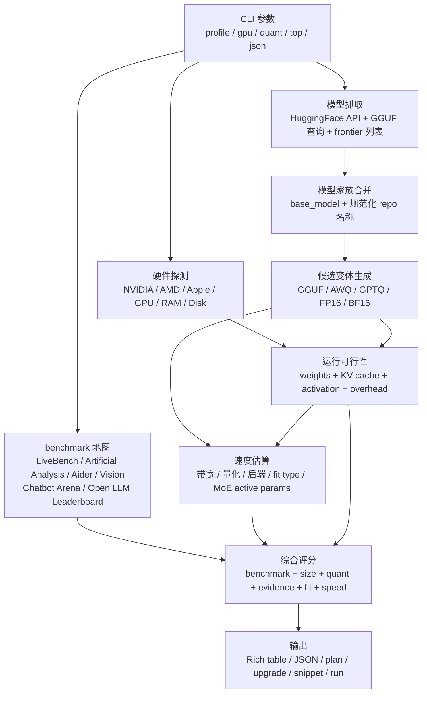

# whichllm 架构拆解：本地 LLM 选型不该只看显存

本地跑大模型时，最容易问错的问题是：这张卡能不能塞下某个模型？更麻烦的是下一步：塞得下的模型通常不止一个，量化格式不止一种，benchmark 新旧不一，HuggingFace 上还混着官方仓库、社区量化、微调分支和缺 metadata 的重打包版本。

whichllm 站在推理后端前面做选型：先读你的硬件，再从 HuggingFace 拉候选模型，把 benchmark 证据、显存估算、速度估算、量化惩罚和来源可信度放进同一套排序里。它把“当前这台机器上，哪个候选最值得先试”变成一张可复查的排序表。

> 资料依据：[Andyyyy64/whichllm](https://github.com/Andyyyy64/whichllm) README、官方文档与 PyPI 信息；核验时间为 2026-06-14。GitHub 页面显示约 4.7k stars；PyPI 最新版本为 0.5.10，发布时间为 2026-06-11。

## 先给结论

想快速看一眼当前机器能跑什么，`uvx whichllm@latest` 就能给出推荐表。把它放进生产决策前，先记住三条边界：

1. **whichllm 排的是候选优先级，不是本机实测吞吐。** README 和 JSON 里的 `estimated_tok_per_sec` 是规划估计值，真实速度还会受驱动、后端、上下文长度、batch、温度和散热影响。
2. **评分不是单一 leaderboard。** 它会合并 LiveBench、Artificial Analysis、Aider、Vision、多模态索引以及冻结的 Chatbot Arena / Open LLM Leaderboard，并按证据等级折扣。
3. **显存只是准入条件。** 排名还会看量化质量、KV cache、部分卸载、MoE 活跃参数、模型时新性和来源可信度。于是会出现一个很合理但反直觉的结果：24 GB 显卡上，一个较新的 27B 模型可能压过一个能塞下的 32B 模型。

更稳的使用方式是：先用 whichllm 缩小候选范围，再用自己的任务集做小规模实测；不要把它的分数当成“这个模型在我的业务里一定最好”的结论。

## 项目坐标

| 字段 | 信息 |
|------|------|
| 仓库 | [Andyyyy64/whichllm](https://github.com/Andyyyy64/whichllm) |
| 最新版本 | 0.5.10（PyPI，2026-06-11） |
| 语言 / 运行要求 | Python 3.11+ |
| License | MIT |
| 分发方式 | `uvx`、`uv tool`、Homebrew、pip |
| 数据来源 | HuggingFace API、公开 benchmark 源、模型卡 metadata、本地硬件探测 |
| 典型输出 | Rich 表格或 `--json` 结构化结果 |
| 主要场景 | 单机 / 单节点本地 LLM 选型、购卡模拟、脚本化推荐、快速拉起模型聊天 |

安装和一次性运行都不重：

```bash
# 一次性运行，不把工具长期装进环境
uvx whichllm@latest

# 经常使用时安装为全局工具
uv tool install whichllm
uv tool upgrade whichllm

# 其他安装路径
brew install andyyyy64/whichllm/whichllm
pip install whichllm
```

## 系统地图：一次推荐如何流过 whichllm

whichllm 的主流程可以拆成 7 步：检测硬件、取模型、取 benchmark、合并家族、生成候选量化、估算能否运行、打分排序。



这张图里最该先看的，是中间两条线。第一条线处理“模型世界”：HuggingFace 上的 repo、GGUF 文件、量化版本、模型家族和 benchmark 证据。第二条线处理“硬件世界”：GPU / RAM / 统一内存 / 磁盘 / 带宽 / 部分卸载。whichllm 的排名发生在两条线交汇之后，而不是在 HuggingFace 搜索结果里直接挑下载量最高的模型。

## 硬件建模：不是 `params × bytes` 就完了

很多本地模型选择工具只做一件事：拿参数量乘以每个权重的字节数，再和显存比大小。这个计算能排除明显跑不动的模型，但会漏掉真实推理里最容易踩的几块开销。

whichllm 把内存需求拆成四项：

```text
required_memory = weights + KV cache + activation + framework overhead
```

这四项影响不同：

| 项目 | 为什么重要 |
|------|------------|
| weights | 模型权重本身，受参数量和量化格式影响最大。 |
| KV cache | 上下文越长越贵；长上下文场景下，它可能比想象中更快吃掉可用显存。 |
| activation | 推理中间状态，通常不如权重醒目，但会影响“刚好塞下”的模型。 |
| framework overhead | 后端、运行时和缓冲区需要额外空间；文档里按约 500 MB 级别估算。 |

硬件探测也不是只读显卡名字。whichllm 会尽量获取 GPU 列表、VRAM、CPU、物理核心、AVX2 / AVX-512、系统 RAM、磁盘剩余空间和操作系统信息。不同平台有不同路径：

| 平台 | 探测方式 |
|------|----------|
| NVIDIA | 优先 `nvidia-ml-py`，失败后退到 `nvidia-smi`。 |
| AMD | Linux 下优先 `rocm-smi`，再退到 `lspci` 与 `/sys/class/drm`；Windows 下使用 WMI / 注册表字段兜底。 |
| Apple Silicon | 通过 `system_profiler` 读取芯片与统一内存信息。 |
| CPU / RAM | 通过 `psutil`、`/proc/cpuinfo`、`sysctl`、`wmic` 等平台接口探测。 |

Apple Silicon 和部分 AMD APU 这类统一内存设备会被单独处理。离散显卡上的“部分卸载”往往意味着 PCIe 往返和明显速度损失；统一内存下权重仍在同一内存池里，惩罚就不能按同一套离散 GPU 逻辑套进去。

多 GPU 场景也要谨慎理解。whichllm 会在 fit check 里汇总可用 GPU 内存，但速度估算通常用最大那张卡作为代表设备；它不等价于完整模拟 tensor parallel 或 pipeline parallel 推理后端。对于多卡服务端部署，它更像初筛工具，不是容量规划系统。

## benchmark 证据链：分数先问“从哪来”

whichllm 的评分比“看 leaderboard 第几名”复杂，核心原因是本地模型生态里同名、变体、量化、微调太多。一个 repo 可能是官方模型，也可能只是别人转的 GGUF；一个模型可能没有直接 benchmark，但它的 base model 或同家族版本有公开分数。

官方文档把 benchmark 证据分成 5 类：

| 证据等级 | 含义 | 使用方式 |
|----------|------|----------|
| `direct` | 独立 benchmark 精确命中当前模型 ID | 可信度最高。 |
| `variant` | 去掉 `-Instruct`、量化后缀等后命中同一变体 | 折扣使用。 |
| `base_model` | 通过 HuggingFace `cardData.base_model` 找到基座模型 | 折扣使用。 |
| `line_interp` | 在同一模型家族内按尺寸插值 | 再折扣，避免过度继承。 |
| `self_reported` | 模型上传者在 HuggingFace model card 里自报 eval | 明显降权。 |

没有证据时，表格会出现 `?`；继承或插值得到的分数通常会用 `~` 标记；只有 uploader 自报时会出现 `!sr`。这些符号不只是装饰，它们决定这个候选该进入第一轮实测，还是只适合放在观察列表里。

benchmark 来源也分层。LiveBench、Artificial Analysis、Aider、Vision / multimodal 这类当前来源会优先反映新模型；Chatbot Arena ELO 和 Open LLM Leaderboard v2 属于冻结或偏旧覆盖层。whichllm 对冻结来源做 lineage-aware recency demotion，避免旧模型长期靠历史榜单分数压过后续同系列新模型。

这个设计处理的是一个真实偏差：2024 年的模型可能有一堆老榜分数，2026 年的新模型可能刚发布还没进某些冻结榜。如果直接拼分，旧模型会被历史数据“保护”；加上 lineage 降权后，推荐结果才更接近当前本地模型生态。

也要反过来看：这些 benchmark 主要回答“公开任务上的相对能力”和“有没有独立证据”。它们不能直接推出模型在你的私有代码库、客服对话、金融文本或长上下文 RAG 里一定表现更好。whichllm 把证据等级摊开，目的不是替你做最终裁决，而是告诉你哪些候选值得先测。

## 综合评分：质量、可跑、能用三件事揉在一起

whichllm 的最终分数 capped 到 0-100。这个数字衡量的是“在这台机器上作为本地候选的可用优先级”，不要把它读成抽象的“模型智商分”。

| 因子 | 作用 |
|------|------|
| benchmark quality | 合并多个 benchmark 源，是质量判断的主要依据。 |
| model size | 作为世界知识和能力的粗略代理；dense 用总参数，MoE 用总参数判断质量。 |
| quantization penalty | 低 bit 量化会乘上质量惩罚；`Q4_K_M`、`Q5_K_M` 这类常见量化惩罚较小，极低 bit 会明显降权。 |
| evidence confidence | `direct` 不打折，继承、插值、自报和无证据都会降权。 |
| runtime fit | full GPU、partial offload、CPU-only 不是同一类体验；部分卸载越重，惩罚越大。 |
| speed adjustment | 速度是 usability gate，不是主要质量信号；低于 fit type 对应阈值会扣分。 |
| source trust | 官方组织和可信转换者有小幅加分，已知 repackager 有小幅惩罚。 |
| popularity | 下载量与 likes 更多用于弱证据场景下的 tie-breaker。 |

这里最容易误读的是速度。whichllm 会输出 `estimated_tok_per_sec`、`speed_confidence`、`speed_range_tok_per_sec` 和 `speed_notes`，但这些字段是估算，不是你机器上跑出来的 benchmark。full GPU 的常规估算通常比 CPU-only、部分卸载、未知带宽或 Apple Silicon MoE 更可靠；看到低置信度速度时，应把它当作“需要实测”的提醒。

## 为什么 27B 会赢过 32B：README 里的 4090 案例

README 里的 4090 示例能直接说明这个取舍：

```text
$ whichllm --gpu "RTX 4090"

#1  Qwen/Qwen3.6-27B     27.8B  Q5_K_M   score 92.8    27 t/s
#2  Qwen/Qwen3-32B       32.0B  Q4_K_M   score 83.0    31 t/s
#3  Qwen/Qwen3-30B-A3B   30.0B  Q5_K_M   score 82.7   102 t/s
```

如果只按参数量选，32B 看起来更大；如果只按速度选，MoE 那行 102 t/s 很诱人。但 whichllm 把三笔账分开：

- **质量账**：27B 的 current benchmark 与时新性更强，足以压过更大的 32B 候选。
- **量化账**：32B 在 24 GB 显存里通常需要更激进的量化，质量惩罚会被算进去。
- **MoE 账**：`Qwen3-30B-A3B` 的速度按活跃参数估算，质量按总参数和 benchmark 证据判断；速度高不等于综合质量最高。

这个例子也说明 whichllm 的定位：它不迷信“大”，也不迷信“快”，而是在“能跑、够强、速度可接受”之间做折中排序。

## 一次真实任务流：给 24 GB 显卡找 coding 模型

假设你有一张 RTX 4090，想给本地 coding agent 找一个先试的模型。流程可以分成两段：先看候选状态，再把结果接到自己的运行时。

第一步，先看 coding profile 下的候选，并打开状态字段：

```bash
whichllm --profile coding --gpu "RTX 4090" --top 5 --status
```

这里要重点看三列：fit type、memory required、speed marker。full GPU 且速度估算置信度正常的候选，通常比“分数略高但 heavy partial offload”的候选更适合日常 coding agent。

第二步，用 JSON 把候选拉进自己的脚本：

```bash
whichllm --profile coding --gpu "RTX 4090" --top 5 --json \
  | jq '.models[] | {
      model_id,
      quantization,
      score,
      estimated_tok_per_sec,
      speed_confidence,
      speed_range_tok_per_sec
    }'
```

第三步，把 HuggingFace 模型 ID 映射到你的运行时。Ollama 模型名不总是等于 HuggingFace repo ID，所以这里通常需要一层映射：

```bash
# 只拿 top 1 的 HuggingFace ID
whichllm --profile coding --top 1 --json | jq -r '.models[0].model_id'

# 再映射到本机已有或准备拉取的 Ollama tag
ollama run qwen3.6:27b
```

如果你用 LM Studio、llama.cpp 或 text-generation-webui，也是同样思路：whichllm 负责排序和候选解释，运行时负责下载、加载、量化兼容和真实吞吐。

## `run` 与 `snippet`：从推荐走到可执行

whichllm 不只输出推荐表，也能直接帮你启动一个临时聊天环境：

```bash
# 指定模型，自动选择合适 GGUF 变体
whichllm run "qwen 2.5 1.5b gguf"

# 不指定模型，让 whichllm 先为当前硬件挑一个
whichllm run

# CPU-only 场景
whichllm run "phi 3 mini gguf" --cpu-only
```

`run` 会通过 `uv` 拉起隔离环境、安装依赖、下载模型并进入交互式聊天。它适合快速验证“能不能跑起来”和“体感是否可接受”，不适合替代你的长期推理服务。公司机器或安全敏感环境里，先用 `snippet` 看清依赖和模型文件，再把安装、下载和缓存路径纳入自己的供应链策略，会比直接运行更稳。

如果你要把模型嵌进自己的 Python 工具，`snippet` 更直接：

```bash
whichllm snippet "qwen 7b"
whichllm snippet "llama 3 8b gguf" --quant Q5_K_M
```

它会打印可复制的 Python 代码，通常基于 `llama-cpp-python` 或 transformers 系列依赖。这个功能的好处是少查一次模型文件名，尤其适合 GGUF repo 里有十几个量化文件时使用。

## 什么时候该信，什么时候要自己测

以下场景适合把 whichllm 放在第一轮筛选：

- 你刚买机器，不知道当前硬件该先跑哪一档模型；
- 你准备升级显卡，想比较 RTX 4090、RTX 5090、H100 或 Apple M 系列之间的候选差异；
- 你要给脚本或 CI 找一个结构化推荐入口；
- 你不想在 HuggingFace 上手动比较几十个 GGUF、AWQ、GPTQ 变体；
- 你关心“候选是否有 benchmark 证据”，而不是只看下载量。

下面这些场景要把 whichllm 当作参考，而不是最终答案：

| 场景 | 原因 |
|------|------|
| 服务端多卡推理 | 它不完整模拟 tensor parallel、pipeline parallel、batch 调度和显存碎片。 |
| 长上下文生产任务 | KV cache 与 RoPE / YaRN / 后端优化会显著改变真实表现。 |
| 小众微调模型 | 可能没有 direct benchmark，只能继承、插值或依赖自报。 |
| 业务专用质量 | 公开 benchmark 不能代表你的代码库、客服语料、法律文本或金融策略任务。 |
| 严格延迟 SLA | `estimated_tok_per_sec` 是规划数，不能替代本机压测。 |
| 安全敏感环境 | `run` 会安装依赖并下载模型；企业环境应先审依赖、锁版本、走内网镜像。 |

一个实用的验收办法是：让 whichllm 给出 top 3，再用你自己的 20-50 条任务样本做小测。评估不要只看回答质量，还要记录首 token 延迟、平均 tok/s、内存峰值、失败率和长上下文稳定性。whichllm 负责缩小搜索空间，你自己的测试负责最后决策。

## 常见误区

**误区一：分数最高就一定最好。**

分数高说明它在 whichllm 当前证据链和硬件估算里更值得优先尝试。对于代码补全、RAG、长文档问答、视觉任务或 agent 工具调用，最终还要看你的任务集。

**误区二：`?` 分数就不能用。**

`?` 代表缺少可用 benchmark，不代表模型差。新发布或小众微调模型很容易出现这个状态。只是你不能把它的分数当成强证据。

**误区三：MoE 的高 tok/s 等于更强。**

MoE 推理速度常按活跃参数估算，但模型质量仍和总参数、训练质量、路由、benchmark 证据有关。速度高是可用性优势，不自动转化为任务质量。

**误区四：HuggingFace ID 可以直接丢给 Ollama。**

Ollama tag、LM Studio 模型文件和 HuggingFace repo ID 不是同一个命名体系。whichllm 的 JSON 输出适合做中间层，真正运行时通常还要映射。

**误区五：`--gpu` 模拟等于真实机器。**

`--gpu` 很适合购卡前比较方向，但它无法模拟驱动版本、散热、PCIe 拓扑、后端编译选项和系统负载。买硬件前可参考，部署前还要实测。

## 推荐采用顺序

把 whichllm 加进本地 LLM 工作流，可以按这个顺序来：

1. **先跑当前机器。**

   ```bash
   uvx whichllm@latest --top 5 --status
   ```

   先确认推荐是否 full GPU、速度估算是否可信、有没有 `~` / `?` / `!sr` 标记。

2. **再按任务 profile 过滤。**

   ```bash
   whichllm --profile coding --top 5
   whichllm --profile math --top 5
   whichllm --profile vision --top 5
   ```

   不同任务对 benchmark 源的依赖不同，通用推荐不一定适合 coding agent 或视觉输入。

3. **用 `--direct` 做强证据对照。**

   ```bash
   whichllm --profile coding --direct --top 5
   ```

   如果 direct 结果和默认结果差很远，说明默认推荐里可能有继承或插值证据，需要多看一眼。

4. **用 `plan` 和 `upgrade` 做购卡判断。**

   ```bash
   whichllm plan "Qwen2.5-72B" --quant Q8_0
   whichllm upgrade "RTX 4090" "RTX 5090" "Apple M4 Max"
   ```

   这一步适合回答“为了跑某个模型，硬件差多少”。

5. **回到自己的评测集。**

   下载 top 2-3 个候选，在同一推理后端、同一 prompt 模板、同一上下文长度下跑小样本。whichllm 的推荐可以帮你少试十几个模型，但不能替你定义业务质量。

## 参考资料

1. [Andyyyy64/whichllm GitHub 仓库](https://github.com/Andyyyy64/whichllm)
2. [whichllm PyPI 页面](https://pypi.org/project/whichllm/)
3. [whichllm Scoring 文档](https://github.com/Andyyyy64/whichllm/blob/main/docs/scoring.md)
4. [whichllm How it works 文档](https://github.com/Andyyyy64/whichllm/blob/main/docs/how-it-works.md)
5. [whichllm Hardware detection and simulation 文档](https://github.com/Andyyyy64/whichllm/blob/main/docs/hardware.md)
6. [Qwen/Qwen3.6-27B HuggingFace 模型页](https://huggingface.co/Qwen/Qwen3.6-27B)

## 最后的判断

whichllm 把本地 LLM 选型拆成了可检查的证据链：模型从哪来，分数从哪来，能不能放进内存，速度估算有多不确定，量化和卸载付出了什么代价。把这些问题摊开之后，本地模型选择才从“下载几个试试看”变成一件能复盘的工程决策。
