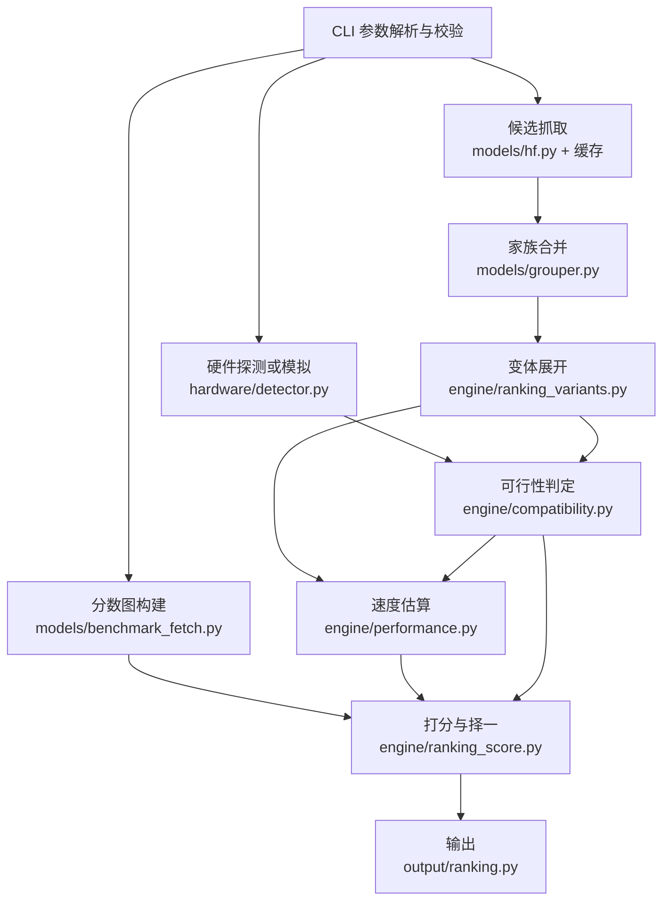

「这张卡能塞下哪个模型」是一个有确定答案的问题，所以它也是最不值得单独问的问题。塞得下的候选通常有几十个，量化格式有三十多种，公开分数来自两三个已经停更的榜单。HuggingFace 上还混着官方仓库、社区转换、微调分支，以及只换了打包方式的重传版本。

whichllm 做的事是把选型拆成四本可以各自复查的账。分数来自哪一档证据，显存按哪几项加起来，每秒词元数从哪条带宽推出来，上传者是谁——这四本账在 0.5.19 里都能落到具体的函数和常量上，这也是它值得读的原因。判断依据是暴露的，不是藏在提示词里的。

它同时也有很明确的边界。whichllm 站在推理后端的前面，不启动模型、不测真机吞吐、不模拟张量并行。把它当成排序器和证据展示台用是对的，当成容量规划系统是错的。

> 本文核验时间与方式：以 0.5.19 为准（GitHub 提交 `4f4fc268`，PyPI 发布于 2026-09-19）。本机克隆仓库、装依赖、跑完自带的 516 个测试，并把文中每一条行为断言用 `whichllm` 命令或 `python -c` 直接执行定案。机器是 Apple M4 / 16 GB，模拟显卡用 `--gpu`。README 与 `docs/` 的措辞和代码不一致时以代码为准，并在下文点明。

## 目录

- [先给判断](#先给判断)
- [三条主线加一本证据账](#三条主线加一本证据账)
- [版本坐标与安装路径](#版本坐标与安装路径)
- [显存估算拆成四项相加](#显存估算拆成四项相加)
- [长上下文才是二十四 GB 卡的边界](#长上下文才是二十四-gb-卡的边界)
- [速度是一条带宽反推公式](#速度是一条带宽反推公式)
- [多卡预算不是把显存相加](#多卡预算不是把显存相加)
- [当前层与冻结层两套分数](#当前层与冻结层两套分数)
- [六档证据等级与三次折扣](#六档证据等级与三次折扣)
- [综合评分怎么落到一个数](#综合评分怎么落到一个数)
- [为什么二十七 B 会压过三十二 B](#为什么二十七-b-会压过三十二-b)
- [一次完整选型流程](#一次完整选型流程)
- [把推荐接进本机的两个子命令](#把推荐接进本机的两个子命令)
- [常见故障与排查](#常见故障与排查)
- [五道自测题](#五道自测题)
- [谁该先用它，谁可以再等等](#谁该先用它谁可以再等等)
- [下一步读哪份代码](#下一步读哪份代码)
- [维护与复核指引](#维护与复核指引)
- [参考](#参考)

## 先给判断

三条会直接影响使用方式的结论：

1. **排序不等于实测。** `estimated_tok_per_sec` 由显存带宽除以每个词元需要读取的权重字节数推出来，再乘量化效率与后端系数（`engine/performance.py:218`）。它没有跑过一个词元。JSON 同时给出 `speed_confidence` 与 `speed_range_tok_per_sec`，就是在提醒这条区间可能宽到 0.35×–2.00×。
2. **分数不是单一排行榜。** 它把两批来源合到一张 0–100 的表上。一批按代际算「当前」，其中 Artificial Analysis 与 Aider 真的会去在线抓，LiveBench 与视觉指数只是较新的内置快照；另一批已经彻底停更，并被人为压了上限——大语言模型排行榜 Open LLM Leaderboard v2 封顶 78，Chatbot Arena 封顶 82。合完还要按六档证据等级再折一次。
3. **显存只是准入条件。** 量化惩罚、KV 缓存、部分卸载、混合专家模型（MoE）的活跃参数、模型代际、上传者身份都会改变最终排名。于是会出现合理但反直觉的结果：24 GB 显卡上排第一的不是能塞下的最大模型。

这三条划出了正确用法：用 whichllm 把候选集从几十个缩到三个，再用自己的任务样本实测。

## 三条主线加一本证据账

`src/whichllm/` 有 73 个 Python 文件、10,466 行（连 `tests/` 与 `scripts/` 一起算是 106 个）。四个目录的职责划分见下表。

| 主线 | 位置 | 回答的问题 |
|------|------|------------|
| 硬件侧 | `hardware/` | 这台机器有多少显存、多大的内存池、多快的带宽，能不能模拟成别的卡 |
| 模型侧 | `models/` | HuggingFace 上有哪些候选、它们属于哪个家族、带哪些量化文件、benchmark 分数从哪来 |
| 判决侧 | `engine/` | 某个候选在某个量化下需要多少内存、能跑多快、值多少分 |
| 呈现侧 | `output/` | 排好的结果怎么变成 Rich 表格、Markdown、JSON，以及标记符号 |


```mermaid
flowchart TD
    CLI["CLI 参数解析与校验"]
    HW["硬件探测或模拟<br/>hardware/detector.py"]
    HF["候选抓取<br/>models/hf.py + 缓存"]
    BM["分数图构建<br/>models/benchmark_fetch.py"]
    GR["家族合并<br/>models/grouper.py"]
    VA["变体展开<br/>engine/ranking_variants.py"]
    CO["可行性判定<br/>engine/compatibility.py"]
    PF["速度估算<br/>engine/performance.py"]
    RK["打分与择一<br/>engine/ranking_score.py"]
    OU["输出<br/>output/ranking.py"]

    CLI --> HW --> CO
    CLI --> HF --> GR --> VA --> CO
    CLI --> BM --> RK
    VA --> PF
    CO --> PF --> RK
    CO --> RK --> OU
```

`docs/how-it-works.md` 把默认命令归纳成 9 步：校验参数、探测硬件、载入或抓取模型、载入或抓取分数、合并家族、摊平回候选、逐变体排序、回填发布日期、打印。本图按同一顺序画，只多标一件事：速度排在可行性之后。还不知道是整卡放下还是溢出到内存，就算不出速度——`estimate_tok_per_sec` 的入参里就带着 `compat.fit_type`。分数图则直接进判决，不参与可行性判定。

## 版本坐标与安装路径

| 字段 | 信息（2026-09-21 核验） |
|------|------|
| 仓库 | [Andyyyy64/whichllm](https://github.com/Andyyyy64/whichllm)，首提交于 2026-03-04 |
| 最新版本 | 0.5.19；PyPI 上传时间 2026-09-19，CHANGELOG 记作 2026-09-20 |
| 自 0.5.10 以来 | 0.5.11 到 0.5.19 共 9 个版本 |
| 规模 | 6,664 stars、369 forks、14 个开放议题 |
| License | MIT |
| 运行要求 | Python 3.11+ |
| 直接依赖 | `typer`、`rich`、`httpx`、`psutil`、`dbgpu[fuzz]`、`nvidia-ml-py` |
| 测试 | `tests/` 31 个文件、516 项，本机 1.71 秒全通过 |
| 缓存 | `~/.cache/whichllm/models.json`（6 小时）、`benchmark.json`（24 小时） |

安装命令本身没有可讨论的余地，要注意的是它依赖 `uv` 与 `dbgpu`：前者被 `run` 用来拉起隔离环境，后者是显卡规格库。

```bash
uvx whichllm@latest            # 一次性运行，不装进环境
uv tool install whichllm       # 常用时安装为全局工具
uv tool upgrade whichllm
brew install andyyyy64/whichllm/whichllm
pip install whichllm
python -m whichllm             # 0.5.11 起可用
```

## 显存估算拆成四项相加

只做「参数量 × 每权重字节数」的工具能排除明显跑不动的模型，但会漏掉真实推理里最容易踩的开销。whichllm 的口径写在 `engine/vram.py:90`：

```text
estimate_vram = weights + kv_cache + activation + FRAMEWORK_OVERHEAD_BYTES
```

| 项目 | 实现里的口径 | 为什么单独算 |
|------|--------------|--------------|
| 权重 | 由参数量乘该量化格式的每权重字节数，或直接用 GGUF 文件实际大小 | 受量化格式影响最大，是唯一能被 `--quant` 直接改变的项 |
| KV 缓存 | `3.5 MiB × 参数量(B) × 上下文长度(K)`，MoE 改用「活跃参数 × 4」 | 上下文越长越贵，是唯一会随对话长度线性膨胀的项 |
| 激活 | `400 MB + 0.08 字节/参数 + 150 MB/4K 上下文` | 长上下文下与 KV 同向增长 |
| 运行时余量 | 常量 `500_000_000`（约 477 MiB） | 后端、图计算缓冲与运行时占位 |

系数 3.5 MiB 是从三份公开报告反推后略微上调的。同文件第 9 到 13 行的注释列出了三个标定点：Qwen2.5-7B 在 8K 上下文下 0.45 GB、Qwen3-32B 在 32K 下 3.1 GB、Llama-3.1-70B 在 32K 下 5.4 GB。顺带一个坑：`estimate_kv_cache` 的文档字符串写的是「约 3 MB」，实际常数是 3.5 MiB。照注释里的数字算会低估约 14%。

0.5.14 加的一项更要紧：滑窗注意力（SWA）模型的 KV 不再按全长上下文算。`engine/vram.py:22` 的有效上下文是 `global_ratio × ctx + (1 - global_ratio) × min(ctx, window)`，且只在抓取阶段确认该架构的主流运行时真的执行滑窗时才启用。这个设计刻意只允许结果变小，不允许变大，所以没声明窗口的模型保持保守值。

硬件探测也不是读一次显卡名字。各平台路径如下（`hardware/detector.py:20` 决定调用顺序）：

| 平台 | 首选 | 退路 |
|------|------|------|
| NVIDIA | `pynvml`（NVML 绑定） | `nvidia-smi --query-gpu=…`，并顺带取最大显存时钟以区分 GTX 1650 的 GDDR5/GDDR6 |
| AMD（仅 Linux 调用） | `rocm-smi` 三次查询：产品名、显存、驱动版本 | `lspci -mm` 与 `/sys/class/drm` |
| Intel（仅 Linux 调用） | `lspci -mm` | sysfs |
| Windows 非 NVIDIA 卡 | `powershell Get-CimInstance Win32_VideoController` | 注册表 `HardwareInformation.qwMemorySize` |
| Apple Silicon | `system_profiler SPHardwareDataType -json` | `sysctl -n iogpu.wired_limit_mb` 决定可用显存上限 |
| CPU 与内存 | `psutil` | Linux 走 `/proc/cpuinfo` 与 `lscpu`，macOS 走 `sysctl`，Windows 先 `wmic` 再 PowerShell |

`--gpu` 模拟走的是 `dbgpu`——一份 2000 多条记录、数据源为 TechPowerUp 的显卡库。Apple 芯片不在库里（它收的是独显），所以被单独短路处理；`hardware/gpu_simulator.py:48` 的注释说明了原因：不做这层短路，`"M1"` 会模糊匹配到 1997 年的 ATI Rage Mobility-M1。

## 长上下文才是二十四 GB 卡的边界

显存四项里只有 KV 缓存与激活随上下文变化，这恰好是本地部署最容易低估的一项。同一张模拟 4090，把 `--context-length` 改三档，排序结果直接改写（2026-09-21 实测）。表里沿用工具自己的 GB 标注，`output/formatting.py:13` 实际是按 1024³ 折算的，所以标出来的「GB」都是 GiB：

| 上下文 | 第一名 | 第二名 | `Qwen/Qwen3.6-27B` 的位置 |
|--------|--------|--------|---------------------------|
| 4096（默认） | Qwen3.6-27B · Q5_K_M · 需 21.2 GB · 91.0 | Qwen3.8-27B · 90.0 | 第 1，Full GPU |
| 32k | Qwen3.6-27B · **Q4_K_M** · 需 21.6 GB · 90.3 | Qwen3.8-27B · 89.4 | 第 1，但量化被自动降档 |
| 128k | gemma-4-26B-A4B-it · Q3_K_M · 需 22.8 GB · 79.8 | gpt-oss-20b · 77.4 | 第 6，退成 Partial、需要 34.1 GB、71.5 |

这张表里有三个信息。32k 时 whichllm 为了把 27B 留在卡上，主动换了更狠的量化。128k 时换不动了，27B 这条稠密模型整线被挤成部分卸载，让位给活跃参数只有 3.8B 的 MoE。所以用默认参数得到的「这张卡跑 27B 很舒服」，在长上下文任务上并不成立。

同一份数据也给出换档的连带代价。27B 从 Q5_K_M 退到 Q4_K_M，质量惩罚从 0.03 涨到 0.05，分数却只掉了 0.7（91.0 → 90.3）。这是因为降档同时把每词元读取量变小了，估计速度从 27.5 涨到 35.5 tok/s，速度项又补回一截。**代价没有消失，只是被另一项抵掉了大半**；而生成质量本身掉了多少，这套分数并不评估。

## 速度是一条带宽反推公式

`engine/performance.py:218` 的核心只有两行：

```text
theoretical_tok_per_sec = memory_bandwidth / bytes_read_per_token
tok_per_sec = theoretical × quant_efficiency × backend_factor
```

`bytes_read_per_token` 对稠密模型就是权重大小；对 MoE 是权重乘一个「活跃比例与带宽相关下限取大」的比例（`performance.py:102`）。下限按 256 GB/s 时 5% 线性外推，封顶 25%。

| 后端 | 系数 | 常见量化的效率系数 |
|------|------|--------------------|
| NVIDIA | 1.00 | Q4_K_M 0.55、NVFP4 0.56、Q5_K_M 0.52、Q6_K 0.50、Q8_0 0.45 |
| Apple | 0.82 | F16/BF16 0.40、IQ2_XXS 0.38、Q1_0 与 TQ1_0 0.32 |
| AMD | 0.78 | 未列出的量化取默认 0.45 |
| Intel | 0.65 | 量化效率三行共用同一张表 |

部分卸载按内存架构分岔（`performance.py:278`）：独显上乘 0.45，Apple Silicon 与共享内存 APU 上乘 0.85。差别来自有没有 PCIe 这道墙。统一内存里权重仍在同一个内存池，超出的只是建议工作集，不是换了介质。这个分支是修出来的。同文件的注释记录了原先一律乘 0.45，结果 M2/M3 Ultra 上的 DeepSeek-R1 级模型报出约 1.7 tok/s，而实际是 4–15。

纯 CPU 路径不读带宽，改用规模的倒数：`18.0 / max(params_b, 0.5)`，再按量化效率相对默认值缩放，下限 0.3 tok/s（`performance.py:234`）。

估计的不确定度单独成表，并直接乘成区间返回：

| `speed_confidence` | 区间系数 | 触发情形（代码可查） |
|--------------------|----------|----------------------|
| high | 0.85–1.20 | 预留给将来的实测数据，当前没有路径会赋值 |
| medium | 0.60–1.60 | 常规显卡估计、合成 GGUF 估计、AMD 共享内存 APU 的 MoE |
| low | 0.35–2.00 | 无带宽数据、部分卸载、纯 CPU、Apple Silicon 上的 MoE、多卡 |

实测能直接对上：模拟 4090 跑 `Qwen/Qwen3.6-27B` 得 `estimated_tok_per_sec = 27.498`、`speed_confidence = "medium"`、`speed_range_tok_per_sec = [16.5, 44.0]`，两端正好是 0.60 倍与 1.60 倍。

速度在评分里是准入门槛，不是质量信号。阈值按形态分档：Full GPU 要 8 tok/s，部分卸载 4，纯 CPU 1.5。低于阈值最多扣 8 分，高于则按对数最多加 8 分。这里有一处 `docs/scoring.md` 没写全：当速度估计根本拿不出来时，扣分不看 tok/s 缺口，而按形态与卸载比例定档，部分卸载最重可到 −24 分（`engine/ranking_score.py:170`）。排序完成后还有一道收尾过滤——只要榜上有不低于 5 tok/s 的候选，就删掉所有低于 1.5 tok/s 的行。

表格里速度颜色按绝对值上色：<4 红、4–10 黄、10–30 绿、≥30 亮绿；`~` 表示 medium 区间，`?` 表示 low。同一行里分数列的 `~` 谈证据、速度列的 `~` 谈置信度，两者不是一回事。

## 多卡预算不是把显存相加

「多卡就是把显存加起来」是最常见的第一版直觉。`engine/compatibility.py:80` 的实现要保守得多，而且分三种情形：

```text
raw_total  = sum(每张卡可用显存)
overhead   = min(raw_total, 卡数 × 0.3 GiB)
effective  = (raw_total - overhead) × utilization
utilization = 0.95（同型号）| 0.90（混插）
```

含共享内存或 Apple 的多卡组合**不合并**，直接取最大的那个内存池，并给出提示。另外，机器上只要有独显，`shared_memory` 且 `vram_bytes` 小于 2 GiB 的核显就不进合并池（`compatibility.py:34`）。否则等于造出一个「独显显存 + 整机内存」的假目标。`docs/hardware.md` 把这条叫做「低孔径核显」，判据本身是那个 2 GiB 阈值。

实测 `--gpu "2x RTX 4090"`：原始 45.6 GB，有效 42.8 GB，与 `(45.6 − 0.6) × 0.95 = 42.75` 对上。表格同时打出一行警告「Multi-GPU fit uses a conservative layer-split budget」。速度侧照旧取显存最大的那张卡当代表设备，整体再乘 0.70，置信度强制降为 low。表里前三名会挂着 `?`，并多出一行「Speed caution」。

结论是：它能回答「两张 4090 大概能把哪个更大的模型塞进显存」，答不了「两张卡张量并行后吞吐是多少」。后者取决于后端的切分模式、互联带宽与批大小，whichllm 不建模这些。

## 当前层与冻结层两套分数

`models/benchmark_fetch.py` 不是一张排行榜，而是两个桶：同一个模型在桶内取各来源里的最大值，跨桶时由当前层覆盖冻结层。

| 桶 | 来源 | 取数方式 | 处理 |
|----|------|----------|------|
| 冻结 | Open LLM Leaderboard v2 | 抓 HuggingFace datasets，2025-06 归档 | 归一化封顶 78 |
| 冻结 | Chatbot Arena ELO | 抓 datasets 行接口，2025-07-17 冻结 | 归一化封顶 82 |
| 当前 | LiveBench | **内置快照**，来自 `table_2026_01_08.csv` | 两点锚定线性拉伸（72→95、35→30） |
| 当前 | Artificial Analysis 指数 | 在线抓取，失败退回内置快照 | 重标定后的新刻度 |
| 当前 | Aider polyglot | 在线抓 `polyglot.yaml` | 结果乘 0.85 后计入 |
| 当前 | 视觉与多模态能力指数 | 无稳定在线源，内置 2026-05 快照 | 只在需要视觉候选时参与 |

封顶就是代际保护的第一层。OLLB 榜首的 47.6 原始分若按线性拉伸会到 91.5，压到 78 之后，当前来源只要有任何一条覆盖就能赢过它。Arena 那边的注释把这层意图说得很直白。

第二层是按家族降权，`models/benchmark_lineage.py`：

```text
factor = max(0.55, 1 - 0.12 × 落后代数)
```

这条降权只作用在一类条目上：**有冻结分，但没有任何当前分覆盖**。有当前来源的条目原样通过，不在表里的家族也不降权。表里跟踪 17 个家族。qwen、llama、deepseek、gemma、phi、glm、kimi 这几条主线之外，还有 granite、olmo、t5、yi、mimo、gpt_oss、mixtral 和 mistral 的三个分支。执行结果：

| 模型 ID | 系数 | 冻结分 78 降为 |
|---------|------|----------------|
| `qwen/qwen2-7b`、`qwen/qwen2.5-7b`、`meta-llama/llama-2-7b` | 0.55 | 42.9 |
| `qwen/qwen3-8b`、`microsoft/phi-3-mini` | 0.64 | 49.9 |
| `meta-llama/llama-3.1-8b` | 0.76 | 59.3 |
| `qwen/qwen3.6-27b`、`microsoft/phi-4`、`meta-llama/llama-4-scout` | 0.88 | 68.6 |
| `qwen/qwen3.8-x` | 1.00 | 78.0 |

命令行工具（CLI）的页脚写着「live AA / LiveBench / Aider merged when reachable」，把 LiveBench 归进了在线抓取那一队。可代码里 `get_livebench_data()` 返回的是内置字典，一次请求都不发。页脚那句是措辞错误，不是行为描述。

所有在线来源并发抓取、30 秒超时，单个失败只记日志、不影响其余（`benchmark_fetch.py:32`）。所以离线或被限流时结果照样出得来，只是退回内置快照那个月份。排名下方那行快照月份就是为这件事准备的。

## 六档证据等级与三次折扣

`BenchmarkEvidence.source` 有六个取值，前五档是有证据、最后一档是没有：

| 档位 | 原始分权重 | 该档置信度 | 命中方式 |
|------|------------|------------|----------|
| `direct` | 0.62 | 1.00 | 独立榜单精确命中当前 ID |
| `base_model` | 0.55 | 0.60 | 顺着 HuggingFace 的 `cardData.base_model` 指针 |
| `variant` | 0.50 | 0.55 | 去掉 `-Instruct`、量化后缀后命中 |
| `line_interp` | 0.40 | 0.22–0.26 | 同家族内按尺寸插值 |
| `self_reported` | 0.30 | 0.40 | 只有上传者写在模型卡里的自报评测 |
| `none` | 0.00 | 0.00 | 无可用证据 |

一个继承来的分数要被折三次，文档说「双重折扣」时漏掉了一层。先按该档位的置信度折，式子是 `score × (0.75 + 0.25 × confidence)`；再乘档位权重；最后落到「继承证据」这一类时还要乘 0.78。把三层乘起来，一条置信度 0.26 的 `line_interp` 总系数是 0.254，而 `direct` 是 0.62。同一条 80 原始分，直接命中贡献 49.6 分，插值只贡献 20.3 分。

还有一道防线：继承必须参数规模说得过去。`engine/ranking.py:125` 检查候选与家族主成员的参数量比，落在 0.5 倍以下或 2 倍以上就把证据作废成 `none`。这条针对的正是「小分支借大得多的基座分数往上爬」，顺手也挡掉了 MTP 头、draft 模型这类同名异物。

表格里分数后面的标记对应关系：不带标记是 `direct`，`~` 是继承或插值，`!sr` 是自报，`?` 是无证据（`output/ranking.py:203`）。想只看强证据，用 `--evidence strict`（等价于 `--direct`）；`--evidence base` 允许 `direct`/`variant`/`base_model` 三档，仍然排除插值和自报。

## 综合评分怎么落到一个数

`engine/ranking_score.py:98` 是全项目唯一决定名次的函数，形状是「先乘后加」：

```text
core   = (bench_raw × 档位权重 + size_score) × (1 - quant_penalty)
core   = core × 证据折扣(0.55 无证据|0.55 自报|0.78 继承|1.0 直接)
core   = core × 形态折扣(Full GPU 1.0 | 部分卸载 0.42–0.88 | 纯 CPU 0.50)
score  = core + speed ± 8 + popularity + source_trust + generation ± + derivative
score  = clamp(score, 0, 100)
```

逐项的实现在这里都能落到数字上：

- **规模分**：`4.2 × log2(参数量B) + 9`，封顶 35。约 73B 触顶，70B 已经到 34.74，于是 70B 与 400B 在规模分上几乎无差别。它刻意不奖励「更大」。MoE 用**总**参数量算规模，因为知识存在全部专家里；活跃参数只在速度那一步出场。
- **量化惩罚**：32 档各有其值，从 `Q8_0` 0.01、`Q5_K_M` 0.03、`Q4_K_M` 0.05、`Q3_K_M` 0.08 一路走到 `Q2_K` 0.25、`IQ2_XXS` 0.40、`Q1_0` 与 `IQ1_S` 0.55。低于 2 bit 的档位曾经统一按 5% 处理，等于奖励极端量化，现在改成 30%–60%。
- **部分卸载折扣**：按溢出比例取 0.42 / 0.52 / 0.62 / 0.76 / 0.86 五档。MoE 若活跃参数那部分确实能留在卡上，折扣放宽到最高 0.88；放宽不了就取 `min(0.76, 原值 + 0.08)`。
- **人气**：下载量与点赞各贡献最多 1.0，再乘一个权重。`direct` 时这个权重是 **0**，有但非直接证据 0.2，自报 0.4，无证据 0.6。也就是说，强证据之下人气完全不起作用。
- **来源可信度**：官方组织 +5，被点名的重传者 −5，受信任的格式转换者继承基座组织的信任、也是 +5。三份名单写死在 `engine/ranking_sources.py`。官方组织 20 个，是 Qwen、meta-llama、google、microsoft、openai、zai-org 这一类直接发布开放权重的实验室。转换者 6 个（bartowski、unsloth、QuantFactory、lmstudio-community、ggml-org、Mungert），重传者 5 个（`TheBloke`、MaziyarPanahi、mradermacher、solidrust、SanctumAI）。原始值最后还要乘 0.2 到 0.6 的权重，所以实际影响远小于 README 表格里那句「−5 到 +5」。
- **代际**：17 个家族各有一张有序表，最老映射到 −6、最新映射到 +10；无证据或自报时乘 1.5，`direct` 时乘 0.6。
- **衍生品惩罚**：名字里命中 29 种模式之一就直接 −10，例如 `uncensored`、`abliterat`、`heretic`、`nsfw`、`roleplay`。理由是这类分支通常只是蹭基座分数走插值。
- **整批排除**：9 个组织的仓库根本不进排名，例如 `openai-community`、`facebook`、`EleutherAI`、`trl-internal-testing`，多是研究脚手架和测试用的假模型。另有 11 种命名模式命中即排除，`tiny-`、`debug-`、`playground`、`ci-` 都在里面。

同家族内部最后择一时另有一个复合键（`ranking_score.py:33`）：上下文塞不下扣 20 分，纯 CPU 候选扣 6 分，要求强证据时 `direct` 加 5 分。`docs/scoring.md` 里那句「最终家族择一键不额外给 Full GPU 加分」说的就是这个键里没有形态项——形态折扣已经在 core 那一步乘过了。

## 为什么二十七 B 会压过三十二 B

README 里那组示例是这样的（原文照录，它是 2026-05 的快照，不是当前输出）：

```text
$ whichllm --gpu "RTX 4090"

#1  Qwen/Qwen3.6-27B     27.8B  Q5_K_M   score 92.8    27 t/s
#2  Qwen/Qwen3-32B       32.0B  Q4_K_M   score 83.0    31 t/s
#3  Qwen/Qwen3-30B-A3B   30.0B  Q5_K_M   score 82.7   102 t/s
```

我在 2026-09-21 用同一参数实跑，名次已经变了，但故事一模一样：

| 名次 | 模型 | 量化 | 需要显存 | 估计速度 | 分数 |
|------|------|------|----------|----------|------|
| 1 | Qwen/Qwen3.6-27B | Q5_K_M | 21.2 GB | 27.5 tok/s | 91.0 |
| 2 | Qwen/Qwen3.8-27B | Q5_K_M | 21.2 GB | 27.5 tok/s | 90.0 |
| 3 | google/gemma-4-31B-it | Q4_K_M | 20.1 GB | 31.6 tok/s | 88.6 |
| 4 | google/gemma-4-26B-A4B-it | Q6_K | 21.0 GB | 122.1 tok/s | 84.0 |
| 8 | Qwen/QwQ-32B | Q4_K_M | 21.0 GB | 30.1 tok/s | 77.6 |

把这几处分开算就看得懂：

- **质量**：规模那一项给不了 32B 多少优势。`4.2 × log2 + 9` 在 27.8B 与 32B 处分别是 29.15 与 30.00，「大 4B」只换来 0.85 分。真正拉开差距的是基准分与代际。
- **量化**：同一张 4090 上，32B 只能取到 Q4_K_M（需要 21.0 GB），27B 却还留着 Q5_K_M（21.2 GB）。惩罚从 0.03 涨到 0.05，而且是乘在整个 core 上。
- **MoE**：第 4 名那 122.1 tok/s 是活跃参数 3.8B 换来的，规模分却仍按总参数 25.8B 算。跑得快，不等于拿第一。

表里前两名的 JSON 分数是 90.99 与 90.02，实际差 0.97，打印时被 `.1f` 抹成了「+1.0」。首选置信度的阈值是 gap ≥ 2.5 记 High、≥ 1.0 记 Medium，所以 0.97 落到 Low（`output/ranking.py:75`），表下方因此写着「Top candidates are very close」。还有一条容易漏看：第一名只要不是整卡、或速度置信度是 low，就再降一级。

## 一次完整选型流程

目标是给一张 4090 找本地编码智能体（agent）的候选。默认表格已经把内存、估计速度、形态、发布日期摊开了（0.5.12 起成为默认，`--status` 因此退化成兼容别名；要看下载量用 `--details`）。

```bash
whichllm --profile coding --gpu "RTX 4090" --top 5
whichllm --profile coding --gpu "RTX 4090" --top 5 --markdown   # 贴进 issue 或群里
```

第二步做证据对照，这是最能改变判断的一步：

```bash
whichllm --profile coding --gpu "RTX 4090" --top 10 --json \
  | jq -r '.models[] | [.rank, .model_id, .quant_type, .benchmark_source,
                         .benchmark_confidence, .quality_score] | @tsv'

whichllm --profile coding --gpu "RTX 4090" --direct --top 10 --json \
  | jq -r '.models[] | [.rank, .model_id, .benchmark_source] | @tsv'
```

实跑给出十条，`benchmark_source` 依次是 `direct`×3、`line_interp`、`base_model`、`variant`、`line_interp`×2、`self_reported`、`line_interp`。十个名次里只有三个有独立榜单撑着，第 4 到第 6 名的置信度分别是 0.26、0.60、0.55。加上 `--direct` 之后只剩那三条 `direct`，其余全部消失。默认榜与强证据榜差多少，就说明有多少名次是靠继承来的证据撑着的。这一步的结果会随 HuggingFace 在线候选池变动，但「十条缩成三条」这个比例在本机几次重跑里都稳定。

第三步把候选交给自己的脚本。JSON 的字段名以实跑为准：表示量化档位的是 `quant_type`，表示分数的是 `quality_score`。写成 `quantization` 和 `score` 取到的是 `null`，这两个键名并不存在。

```bash
whichllm --profile coding --gpu "RTX 4090" --top 5 --json \
  | jq '.models[] | {model_id, quant_type, quality_score, fit_type,
                     vram_required_bytes, estimated_tok_per_sec,
                     speed_confidence, speed_range_tok_per_sec}'
```

HuggingFace 仓库 ID 与 Ollama 的模型标签不是一套命名，中间必须有一层映射：

```bash
whichllm --profile coding --top 1 --json | jq -r '.models[0].model_id'
ollama run qwen3.6:27b     # 名称要按本机实际标签写
```

采购判断用 `plan` 与 `upgrade`。`plan "Qwen2.5-72B" --quant Q8_0` 实测需要 79.6 GB。它逐卡给出「✗ Too small / ~ Partial / ✓ Full GPU」三档，并点明最低够用的卡是 A100 80GB，在那张卡上估 11.8 tok/s；H100 是 19.4，H200 是 27.9。

`upgrade` 会把每套配置与本机对比，给出 ΔQ、Δ速度和一个结论。结论的阈值直接写在 `output/upgrade.py:54`：

| 结论 | 条件 |
|------|------|
| worth it | ΔQ ≥ 12 **且** Δ速度 ≥ 10 tok/s |
| meaningful | ΔQ ≥ 8 **或** Δ速度 ≥ 20 tok/s |
| marginal | ΔQ ≥ 3 或 Δ速度 ≥ 5 tok/s |
| downgrade | ΔQ ≤ −3 或 Δ速度 ≤ −5 tok/s |
| flat | 以上都不满足 |

拿本机那台 16 GB 的 M4 做基准，模拟 4090 得 ΔQ +10.5、Δ速度 +2，判 meaningful；换 5090 得 ΔQ +12.4、Δ速度 +14，判 worth it。两组阈值里一个用「且」、一个用「或」，读结论时值得回头确认这两个字。

两个旋钮会显著改变结果：

- `--vram-headroom` 默认 `auto`，按 `max(512 MB, min(5% × 显存, 2 GiB))` 预留，模拟 4090 上实测算得 1.2 GB。嫌 LM Studio 说「差一点点」就写 `1.5GB`。
- `--speed usable|fast` 是**绝对**门槛（10 与 30 tok/s），与形态无关。`--cpu-only --speed usable` 实测只剩 4 条，最快的是 18 tok/s 的 8B-A1B MoE，27B 那档根本进不来。

## 把推荐接进本机的两个子命令

`run` 不往你的环境里装任何东西。它拼一条 `uv run --no-project --with …` 就地执行（`cli.py:1455`），依赖按格式挑：

| 权重格式 | 注入的依赖 |
|----------|------------|
| GGUF | `llama-cpp-python`、`huggingface-hub` |
| AWQ | `transformers`、`torch`、`accelerate`、`autoawq` |
| GPTQ | 同上，换 `auto-gptq` |
| FP16 / BF16 | `transformers`、`torch`、`accelerate` |

机器上没有 `uv` 会直接停下并给出安装地址，不会退化成用系统 pip。

```bash
whichllm run "qwen 2.5 1.5b gguf"
whichllm run                       # 先为当前硬件挑一个
whichllm run "phi 3 mini gguf" --cpu-only
whichllm snippet "llama 3 8b gguf" --quant Q5_K_M
```

`snippet` 只打印代码片段、不执行，适合公司机器上先审后跑。0.5.16 修过一个值得知道的问题。生成的脚本原先会把仓库 ID、文件名、量化名直接拼进代码，现在统一以 Python 字面量嵌入（`cli.py:1215`）。也就是说，**模型卡里被恶意构造的元数据不能再改写生成代码的结构了**。实跑 `snippet "llama 3 8b gguf" --quant Q5_K_M` 能看到 `repo_id='MaziyarPanahi/…'` 这种带引号的字面量。

那次实跑顺带暴露了一个不对称：它挑中的是 `MaziyarPanahi`，而这个名字就在重传者扣分名单上。原因是 `run` 与 `snippet` 的检索按名字、规模和量化可用性匹配，不查来源可信度，扣分只发生在排序那条线上。**把 `run` 当成「工具已经替你把过来源」来信任，是这份代码不支持的假设。**

## 常见故障与排查

`docs/troubleshooting.md` 列了 21 个条目。下表按现象合并成十行，覆盖日常最容易撞上的那几类：

| 现象 | 先查哪里 | 机制 |
|------|----------|------|
| 一个候选都没有 | `whichllm hardware` 看探测到的显存；再试 `--vram 8` | 显存与可用内存都不够时模型直接不参与排序 |
| 只有一两个能跑，怀疑漏判 | `--fit any`、`--vram-headroom none` | 默认的余量与形态过滤会主动排除贴边候选 |
| 结果像是旧的 | 表下方那行快照月份；`--refresh` 绕开缓存 | 模型缓存 6 小时、分数缓存 24 小时 |
| 第一名带 `?` 或 `!sr` | `--evidence strict` 对照 | 插值与自报证据的三层折扣（见前文） |
| 速度估计和实机差得远 | 看 `speed_confidence` 与 `speed_notes` | 中位估计本身就是 0.6–1.6 倍的区间 |
| `run` 说 `uv is required` | 装 `uv`，或改用 `snippet` 自己跑 | 该子命令把执行完全委托给 uv |
| 内网或镜像环境抓不到模型 | 设 `HF_ENDPOINT` | 0.5.13 起所有 HuggingFace 元数据请求都走它 |
| 磁盘明明够却判不可运行 | 检查家目录剩余空间 | 磁盘余量按家目录测，不是模型缓存所在分区 |
| `--profile math` 和 `general` 结果一样 | 这不是 bug | 0.5.17 起该档只排除带 coding/vision 名字的仓库，不设数学专属权重。实测两档前三名一模一样 |
| `--profile vision` 只剩孤零零一条 | 换 `--profile any` 再看 | 视觉仓库只在 `vision` 与 `any` 两档参与抓取。模拟 4090 实测该档只有 1 条，且 `benchmark_source` 是 `none` |

## 五道自测题

1. 同一张卡，为什么 `--context-length 128k` 会让默认榜的第一名消失？把四项里随上下文变化的那两项各自估一个量级，再说明为什么换量化也救不回来。
2. 一个 7B 的微调分支拿到了它 70B 基座的公开分数。要让它不能靠这个分数往上爬，代码里是哪条判断在起作用？
3. `speed_confidence` 是 `low`、`speed_range_tok_per_sec` 是 `[9.6, 54.0]`，这个候选值不值得进第一轮实测？区间宽度说明什么？
4. `--profile coding` 会筛掉什么，`--profile math` 又会筛掉什么？为什么后者几乎筛不掉头部模型？
5. 表上写「#1 91.0 · #2 90.0」，页脚却把首选置信度标成 Low。哪个数字被格式化过？这时照第一名装，错在哪一步？

## 谁该先用它，谁可以再等等

适合放在第一轮的场景：刚拿到机器不确定该跑哪一档；换卡前想比较 4090 / 5090 / H100 / M 系列的候选差异；要给脚本或 CI 一个结构化推荐入口；不想手工对比几十个 GGUF、AWQ、GPTQ 变体；关心「有没有独立证据」胜过关心下载量。

再等一等的，以及各自的理由：

| 场景 | 为什么不够 |
|------|------------|
| 多卡服务端 | 不建模张量并行与流水并行，权重和 KV 也不会按卡分配，只给一个合并后的保守预算 |
| 严格延迟要求 | 速度是规划数，最宽的区间能到 0.35–2.00 倍 |
| 长上下文生产 | 只有声明了窗口且运行时确实执行的模型才享滑窗折扣，其余按全长算 |
| 业务专用质量 | 公开分数回答不了你的代码库、客服语料或金融文本上的表现 |
| 小众微调与刚发布的模型 | 常落到 `line_interp` 或 `none`，一条 80 原始分只能贡献约 20 分 |
| 安全敏感环境 | `run` 会装依赖并下载权重，且检索不查来源可信度 |

采用顺序按风险从低到高排：

1. `uvx whichllm@latest --top 5`，先看默认榜和表下方那行快照月份。月份太旧就别往下走。
2. 同参数各加 `--details` 与 `--evidence strict` 再跑一遍，看名次里有多少依赖继承。
3. 按任务收一次口子，例如 `--profile coding`。`math` 那一档的实际含义见排查一节。
4. 再收一次运行口子：`--vram-headroom 1.5GB --speed usable --gpu-only`，得到一组确定塞得下且不太慢的候选。
5. 把前三名拿回自己的 20–50 条任务样本实测，记下首字延迟、平均速度、内存峰值与失败率。前四步只是缩小搜索空间，最后这一步才产生可用的结论。

## 下一步读哪份代码

只读四个文件就能掌握全部判决逻辑，顺序也是有意的：

1. `engine/ranking_score.py`（259 行）——名次唯一的决定点，`_compute_quality_score` 一个函数读完就懂。
2. `engine/vram.py`（100 行）——四项内存与滑窗折扣，全项目最短的一段。
3. `engine/performance.py`（284 行）——带宽反推、MoE 读取下限、统一内存那对 0.45/0.85。
4. `models/benchmark_fetch.py`（119 行）——两个桶的合并顺序与降级策略。

想看修 bug 的现场就读 CHANGELOG 的 0.5.11 到 0.5.19 段。多卡模拟、`--vram-headroom`、滑窗折扣、生成脚本的注入修复、`--profile math` 的语义变更、家族合并过度造成的检查点串档，都落在这九个版本里。

## 维护与复核指引

这份文章里的数字有明确保质期，三类内容会先过期：

- **会随数据漂移的**：所有排行榜分数、名次、`published_at`、下载量。它们来自 HuggingFace 与内置快照的合并，快照月份是 2026-05。复核只需 `uvx whichllm@latest --gpu "RTX 4090" --top 8`，对比表下方那行快照月份。
- **会随版本漂移的**：默认列构成、`--status` 的语义、`--profile math` 的行为、量化档位与惩罚表、17 个家族名单、三份来源可信度名单。复核入口是 `src/whichllm/data/quantization.py`、`data/lineage.py`、`engine/ranking_sources.py`，加上 `CHANGELOG.md`。
- **短期稳定的**：四项内存公式、3.5 MiB 的 KV 系数、六档权重、规模分那条曲线、多卡的 0.95 与 0.90、速度区间的三档。这些属于设计决定，要改就得连着测试一起改。`tests/` 那 516 项就是它们的锚点。

术语与符号约定，供后续修订时保持一致。分数列的 `~` / `!sr` / `?` 只谈证据，速度列的 `~` / `?` 只谈估计置信度，两组符号含义不同，不可互换。「冻结层」指 OLLB 与 Arena；「当前层」指 LiveBench、Artificial Analysis、Aider 和视觉指数。指这两个桶时用「层」或「桶」，别写成「缓存」——`~/.cache/whichllm/` 那个缓存是另一回事。

## 参考

1. [Andyyyy64/whichllm 仓库](https://github.com/Andyyyy64/whichllm)（提交 `4f4fc268`，0.5.19）
2. [whichllm PyPI 项目页](https://pypi.org/project/whichllm/)
3. [Scoring 文档](https://github.com/Andyyyy64/whichllm/blob/main/docs/scoring.md)
4. [How it works 文档](https://github.com/Andyyyy64/whichllm/blob/main/docs/how-it-works.md)
5. [Hardware detection and simulation 文档](https://github.com/Andyyyy64/whichllm/blob/main/docs/hardware.md)
6. [Troubleshooting 文档](https://github.com/Andyyyy64/whichllm/blob/main/docs/troubleshooting.md)
7. [CHANGELOG](https://github.com/Andyyyy64/whichllm/blob/main/CHANGELOG.md)
8. [Qwen/Qwen3.6-27B 模型页](https://huggingface.co/Qwen/Qwen3.6-27B)（本次实跑的 HuggingFace 接口返回该仓库，故引用）
