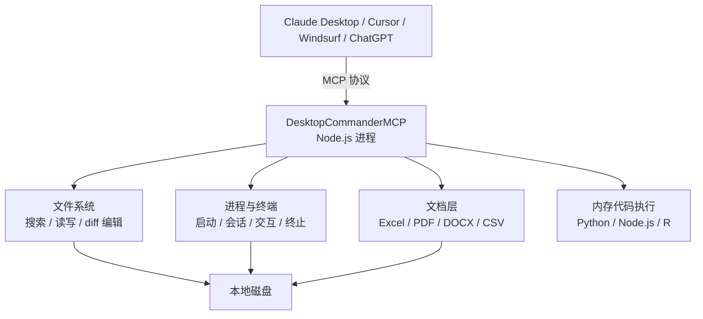

# Desktop Commander：把 AI 从聊天接到本地终端与文件系统

DesktopCommanderMCP 的赌注很直接：**把 AI 的工作半径从"读 / 写单个文件"扩展到"接管本地终端 + 文件系统 + 进程管理"**。截至 2026-07-11，它已累计约 7.5K stars / 950 forks，被 AgentAudit、Archestra、Smithery 等第三方 MCP 目录收录，是 Claude Desktop 上使用最广的终端类 MCP 服务器之一——装好之后，AI 能像开发者一样跑 `npm test`、`git diff`、`python xxx.py`，改完代码自己验证，而不是只能改单个文件。

它解决的是一个具体缺口：Claude Desktop 默认只能读写你授权的目录，跑不了命令。要让 AI 完成"改代码 → 跑测试 → 看结果"的循环，需要一条从模型到终端的通道。MCP（Model Context Protocol，模型上下文协议）是这条通道的开放标准，DesktopCommanderMCP 是这个标准上一个被大量使用的实现。

## 系统地图



能力分两条主线：一条面向**文件与代码**（搜索、读写、精确替换），一条面向**进程与文档**（跑命令、管会话、解析 Office 文件）。

## 基本盘

- GitHub：<https://github.com/wonderwhy-er/DesktopCommanderMCP>
- NPM：<https://www.npmjs.com/package/@wonderwhy-er/desktop-commander>
- Stars / Forks：约 7.5K / 950（2026-07-11）
- 主语言：TypeScript
- 许可证：MIT
- 运行时要求：Node.js ≥ 18
- 主作者：Eduards（wonderwhy-er）
- 配套应用：Desktop Commander App（macOS / Windows 独立客户端，不依赖 Claude Desktop）

## 一句话定位

> Search, update, manage files and run terminal commands with AI

## 核心能力

DesktopCommanderMCP 把 MCP 协议下的几类工具暴露给 AI 客户端：

| 工具类型 | 示例 |
|---|---|
| 文件系统搜索 | `search_code`、`search_files`、`get_file_info`（基于 ripgrep） |
| 文件读写 | `read_file`、`write_file`、`edit_block`（带 diff 预览与精确替换） |
| 进程执行 | `start_process`、`read_process_output`、`interact_with_process` |
| 长任务管理 | 会话异步启动 + 分页读取输出 + 终止 |
| 代码执行 | `execute_code`（Python、Node.js、R 内存执行，不写文件） |
| 数据分析 | 直接分析 CSV / JSON / Excel 文件 |
| Excel 操作 | 读、写、编辑、搜索 .xlsx / .xls / .xlsm |
| PDF / DOCX | 读取转 Markdown，支持创建与修改 |
| 配置管理 | `get_config`、`set_config_value`（命令黑名单、目录白名单、默认 Shell） |

## 与 Claude Desktop / Cursor 集成

`claude_desktop_config.json` 配：

```json
{
  "mcpServers": {
    "desktop-commander": {
      "command": "npx",
      "args": ["-y", "@wonderwhy-er/desktop-commander"]
    }
  }
}
```

如果用的是 Claude Code（命令行版本），一条命令即可注册：

```bash
claude mcp add desktop-commander -- npx -y @wonderwhy-er/desktop-commander
```

前提是机器上有 Node.js ≥ 18。注册并重启客户端后，AI 就获得了：

- 看你的整个项目目录
- 跑 `npm test`、`pytest`、`go test`
- 实时 tail `tail -f` 日志
- 编辑文件时弹出 diff 预览
- 在不写文件的情况下执行 Python 脚本做数据分析

## 关键差异化

1. **长运行进程支持**：很多 AI 编辑器跑命令只能等结束，DesktopCommanderMCP 把进程拆成 `start_process` → `read_process_output` → `interact_with_process` 三个动作，AI 可以启动 dev server、实时读输出、再向同一个进程继续输入
2. **输出分页防上下文溢出**：读进程输出支持 offset / length，还能负偏移读末尾（tail 语义），长日志不会一次性塞爆模型上下文
3. **edit_block + diff preview**：默认按 `old_string → new_string` 精确替换，并要求声明预期替换次数，避免相同代码片段被误改多处；编辑前先弹 diff 给用户确认
4. **内存代码执行**：AI 可以直接跑 Python / Node.js / R 脚本而不写文件，适合一次性数据分析
5. **格式感知的文件层**：`read_file` 按扩展名选处理器——文本按行分页、Excel 返回二维数组、PDF 转带结构的 Markdown、DOCX 返回文本大纲，模型不用先拼 Python 脚本
6. **Office 原生读写**：Excel 支持 .xlsx / .xls / .xlsm 的读、写、编辑、搜索；PDF 与 DOCX 支持创建和修改，DOCX 走底层 XML 精确替换
7. **Remote MCP 支持**：通过 [mcp.desktopcommander.app](https://mcp.desktopcommander.app) 可以从 ChatGPT 网页版、Claude 网页版远程控制桌面

## 任务流案例：让 Claude 帮你 debug 一个 Node.js bug

1. **场景**：你的 Express 应用返回 500
2. **AI 收到你的提问**："我刚改了一个路由，现在 /api/user 返回 500"
3. **AI 通过 DesktopCommanderMCP**：
   - `read_file` 看 routes/user.js
   - `start_process` 跑 `npm test` 看测试是否报错
   - `start_process` 跑 `node -e "require('./routes/user.js')"` 触发 SyntaxError
   - `edit_block` 改文件（弹 diff 让你确认）
   - `start_process` 再跑 npm test 验证通过
4. **AI 总结**：告诉你 bug 在哪、为什么、改了什么

整个过程 AI 没有离开 IDE，没有切换终端，diff 由你 review。

## 与相似项目的对比

| MCP 服务器 | 文件操作 | 终端 | 长进程 | Excel |
|---|---|---|---|---|
| DesktopCommanderMCP | ✅ 搜索 + diff | ✅ | ✅ | ✅ |
| MCP Filesystem Server | ✅ 基础 | ❌ | ❌ | ❌ |
| MCP Git Server | ✅ git | ❌ | ❌ | ❌ |
| MCP Puppeteer | ❌ | ❌ | ✅ 浏览器 | ❌ |
| Claude Code (内置) | ✅ | ✅ | ✅ | ❌ |
| Cursor (内置) | ✅ | ✅ | ⚠️ | ❌ |

DesktopCommanderMCP 的定位：**面向 Claude Desktop 用户的一体化"终端 + 文件 + 进程" MCP 服务器**。Cursor、Claude Code 已内置类似能力；Claude Desktop 本身没有，这类能力要靠第三方 MCP 服务器补齐，DesktopCommanderMCP 是其中覆盖最全、维护最活跃的一个。

## 适用边界

适合：

- **Claude Desktop 用户**——这是它的主要目标场景
- **ChatGPT Plus / Pro 网页版用户**（通过 Remote MCP）——能从浏览器控制桌面
- **企业内 AI 助手**——需要 AI 直接操作本地工作环境的场景
- **学习 MCP 协议**——一个完整、好文档、广泛使用的 MCP 服务器实现

不适合：

- **已经在用 Claude Code / Cursor 内置工具**——它们已经覆盖这些能力
- **想要隔离执行环境**——DesktopCommanderMCP 直接在你的文件系统 / 终端上跑命令，不是沙箱
- **对安全敏感的场景**——任何 prompt injection 都可能让 AI 删文件 / 跑 rm -rf，必须配合 hook 限制

## 安全考虑

这是所有“AI 控制终端”类工具的共性问题。DesktopCommanderMCP 提供了：

- **edit_block diff preview**：编辑文件前必须用户确认
- **路径白名单**：默认只能访问用户配置的工作目录
- **可选沙箱**：支持 Docker 隔离模式

项目在 SECURITY.md 里说得很直白：**目录白名单可能被符号链接或终端命令绕过，命令黑名单也可以通过替换路径绕过**。所以默认配置不能当安全沙箱用：

- 不要让 AI 访问 `.ssh`、`~/.aws`、`~/Documents/财务` 这类敏感目录
- 关键操作（删除文件、git push --force、rm -rf）建议配合 hook 二次确认
- 涉及敏感数据或生产系统时，优先用 Docker 方式运行，只挂载必要目录（官方镜像通过 `dc-workspace` 等卷挂载限制访问面）

## 关键设计观察

1. **MCP 协议是模型 ↔ 工具的"USB-C"**：DesktopCommanderMCP 是这个标准上覆盖最全的实现之一
2. **不是从零造的**：项目构建在官方 MCP Filesystem Server 之上，再叠加搜索、替换和进程会话能力，工程量集中在差异化部分
3. **工具集覆盖度高**：文件 + 进程 + 数据分析 + Office 文档，比单点 MCP 服务器实用
4. **被多个第三方 MCP 目录收录**：AgentAudit、Archestra、Smithery、Glama 等均有条目，可作选型参考
5. **桌面客户端 + MCP 服务器双产品策略**：Desktop Commander App 是 GUI 桌面应用，DesktopCommanderMCP 是 MCP 协议服务器，互相导流

## 学习路径建议

1. **第 1 小时**：按 README 把 DesktopCommanderMCP 配到 Claude Desktop，试用 `read_file` 和 `start_process`
2. **第 1 天**：用 MCP 让 Claude 帮你 debug 一个真实的小项目
3. **第 3 天**：试 Remote MCP，从 ChatGPT 网页版远程控制你的 Mac
4. **第 7 天**：研究 MCP 协议规范，理解 `tools/list` 和 `tools/call` 的交互模式
5. **第 14 天**：基于这个仓库的代码，自己实现一个简单的 MCP 服务器（如对接公司内部 CLI 工具）

## 参考

- 仓库：<https://github.com/wonderwhy-er/DesktopCommanderMCP>
- NPM：<https://www.npmjs.com/package/@wonderwhy-er/desktop-commander>
- FAQ：<https://github.com/wonderwhy-er/DesktopCommanderMCP/blob/main/FAQ.md>
- 安全声明：<https://github.com/wonderwhy-er/DesktopCommanderMCP/blob/main/SECURITY.md>
- Smithery：<https://smithery.ai/server/@wonderwhy-er/desktop-commander>
- AgentAudit 条目：<https://agentaudit.dev/skills/desktop-commander>
- Archestra 条目：<https://archestra.ai/mcp-catalog/wonderwhy-er__DesktopCommanderMCP>
- Glama：<https://glama.ai/mcp/servers/zempur9oh4>
- Remote MCP：<https://mcp.desktopcommander.app>
- Desktop Commander App：<https://desktopcommander.app/>
