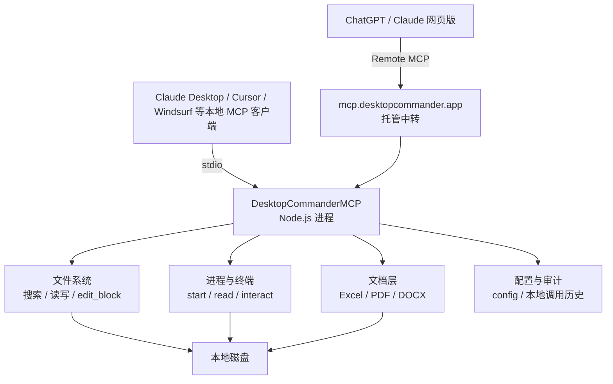

# Desktop Commander：把 AI 从聊天接到本地终端与文件系统

Claude Desktop 会聊天，也能读写你授权的目录，但它开不了终端。"改代码 → 跑测试 → 看报错 → 再改"这个循环，在官方能力表里恰好断在中间一环。DesktopCommanderMCP 补的就是这一环：一个 MCP（Model Context Protocol）服务器，把终端执行、进程会话、全盘文件搜索、diff 编辑和 Office 文档解析打包成 26 个工具，`npx` 一行装进 Claude Desktop，AI 从此能自己跑 `npm test`、看输出、改文件、再跑一次。

这个项目值得看的不是功能清单，而是两件事。一是它怎么把"跑任意命令"这种危险能力做成 AI 可用的接口——长进程拆成会话、输出分页防上下文溢出、搜索走异步任务。二是它的文档对自身危险性少有地诚实：SECURITY.md 开篇就说明内置限制"能减少误操作，但不是安全边界"，真正能隔离风险的只有 Docker / 虚拟机。

按 2026-09-29 读数：GitHub 9,825 stars / 1,232 forks，npm 包 `@wonderwhy-er/desktop-commander` 最近一个月下载约 63.7 万次，最新版 0.2.52 就在当天发布——仅 9 月已连发四版，迭代未见放缓。

## 系统地图


```mermaid
graph TD
    A[Claude Desktop / Cursor / Windsurf 等本地 MCP 客户端] -->|stdio| B[DesktopCommanderMCP<br/>Node.js 进程]
    R[ChatGPT / Claude 网页版] -->|Remote MCP| S[mcp.desktopcommander.app<br/>托管中转] --> B
    B --> C[文件系统<br/>搜索 / 读写 / edit_block]
    B --> D[进程与终端<br/>start / read / interact]
    B --> E[文档层<br/>Excel / PDF / DOCX]
    B --> F[配置与审计<br/>config / 本地调用历史]
    C --> G[本地磁盘]
    D --> G
    E --> G
```

能力分两条主线：一条面向**文件与代码**（搜索、读写、精确替换），一条面向**进程与文档**（跑命令、管会话、解析 Office 文件）。两条线共享一套配置（目录限制、命令黑名单）和一套本地调用历史。

## 基本盘

- GitHub：<https://github.com/wonderwhy-er/DesktopCommanderMCP>
- NPM：<https://www.npmjs.com/package/@wonderwhy-er/desktop-commander>
- Stars / Forks：9,825 / 1,232（2026-09-29）
- 主语言：TypeScript；许可证：MIT
- 运行时要求：Node.js ≥ 18（npm `engines` 字段）
- 当前版本：0.2.52（2026-09-29 发布）
- 作者：Eduards（wonderwhy-er），另有 Discord 社区与 [desktopcommander.app](https://desktopcommander.app/) 官网

项目 README 第一句就交代了出身："Built on top of [MCP Filesystem Server](https://github.com/modelcontextprotocol/servers/tree/main/src/filesystem)"——在官方文件系统服务器之上叠加搜索、替换与进程能力。这让它的文件操作语义与官方参考实现同源，也意味着差异化的工程量集中在进程管理和编辑体验上。

## 工具面板：26 个工具的真实清单

工具清单以 `src/server.ts` 的注册代码为准，按职责分五组：

| 组 | 工具 | 说明 |
|---|---|---|
| 文件读写 | `read_file`、`read_multiple_files`、`write_file`、`create_directory`、`list_directory`、`move_file`、`get_file_info` | 文本按行分页，支持负偏移（tail 语义）读文件末尾；Excel 可按 sheet / range 取 |
| 搜索 | `start_search`、`get_more_search_results`、`stop_search`、`list_searches` | 基于 vscode-ripgrep 的递归搜索，异步任务制：发起、翻页、停止、列出 |
| 编辑 | `edit_block`、`write_pdf` | SEARCH/REPLACE 块精确替换；PDF 从 Markdown 创建或按操作修改 |
| 进程 | `start_process`、`read_process_output`、`interact_with_process`、`force_terminate`、`list_sessions`、`list_processes`、`kill_process` | 会话制：启动、分页读输出、向同一进程续写输入、终止 |
| 配置与元信息 | `get_config`、`set_config_value`、`get_usage_stats`、`get_recent_tool_calls`、`give_feedback_to_desktop_commander`、`get_prompts` | 配置读写、用量统计、本地调用历史查询 |

有两点容易误读。其一，**没有名为 `execute_code` 的工具**——README 里"在内存中执行 Python / Node.js / R 代码"指的是让 Claude 通过 `start_process` 跑 `python -c`、`node -e` 或交互式 REPL，FAQ 原话是 "Any interactive terminal REPL environments"，而不是一个独立的代码执行工具。其二，搜索是异步的：`start_search` 返回任务 ID，结果用 `get_more_search_results` 翻页，这样大目录搜索不会一次塞爆模型上下文。

## 安装与接入

README 给了六种安装方式，按场景选：

```bash
# 方式一（主推）：npx 安装并自动配置 Claude Desktop，重启后生效
npx @wonderwhy-er/desktop-commander@latest setup

# 方式二：Claude Code / 命令行场景，手动注册到用户级配置
claude mcp add --scope user desktop-commander -- npx -y @wonderwhy-er/desktop-commander@latest
```

其余四种：macOS bash 脚本（会顺带装 Node.js）、Smithery、手动改 `claude_desktop_config.json`、Docker。npx 和 Smithery 方式带自动更新——重启 Claude 时拉最新版。

手动配置的 JSON 长这样：

```json
{
  "mcpServers": {
    "desktop-commander": {
      "command": "npx",
      "args": ["-y", "@wonderwhy-er/desktop-commander@latest"]
    }
  }
}
```

Docker 方式（无需 Node.js）把整套环境装进容器，用命名卷持久化工具与工作文件：

```json
{
  "mcpServers": {
    "desktop-commander-in-docker": {
      "command": "docker",
      "args": [
        "run", "-i", "--rm",
        "-v", "dc-workspace:/workspace",
        "-v", "/Users/username/Projects:/mnt/Projects",
        "mcp/desktop-commander:latest"
      ]
    }
  }
}
```

## 三个值得注意的机制

**进程会话是它的骨架。** AI 编辑器跑命令的常见痛点是只能等命令结束。DesktopCommanderMCP 把进程拆成 `start_process`（启动，超时返回首批输出）→ `read_process_output`（带 offset / length 分页读取，负偏移即 tail）→ `interact_with_process`（向同一进程继续输入）。dev server、SSH、数据库 REPL 这类长驻进程因此可以挂在会话里，AI 边看边操作。

**edit_block 把编辑做成可校验的操作。** 替换用 SEARCH/REPLACE 块格式（参数为 `old_string` / `new_string`），默认只替换一处，多处置换需显式传 `expected_replacements`，避免相同片段被误改。精确匹配失败时会退到模糊搜索，返回最接近候选的相似度百分比和 `{-removed-}{+added+}` 格式的字符级差异，所有模糊匹配都有日志可查。要注意的是，MCP 服务器本身没有"弹窗确认"机制——改文件前是否逐步向用户确认，取决于客户端（如 Claude Desktop）的审批设置，这不是这个项目提供的保证。

**文件层按格式分发。** `read_file` 对文本按行分页；PDF 走 `parsePdfToMarkdown` 转成带结构的 Markdown（元数据含作者、标题、页数）；Excel 依赖 exceljs，可指定 sheet 和 range；DOCX 支持读、建、搜，写入时按官方说法做 "surgical XML editing"（底层 XML 精确替换），另有 Markdown 转 DOCX 通道。模型不需要先手写解析脚本，这是它和"裸终端工具"拉开差距的地方。

## 任务流案例：让 Claude 帮你 debug 一个 Node.js 路由

1. 你的 Express 应用 `/api/user` 返回 500，把这句话发给 Claude
2. Claude 用 `read_file` 看 `routes/user.js`，定位可疑改动
3. 用 `start_process` 跑 `npm test`，从分页输出里看哪些用例红了
4. 再跑 `node -e "require('./routes/user.js')"`，让 SyntaxError 直接暴露
5. 用 `edit_block` 提交修正（传 `old_string` / `new_string`），是否逐步审批由客户端设置决定
6. 重跑 `npm test` 确认通过，把结论汇总给你

整个过程 AI 没有离开对话框，终端和编辑器的工作由同一套工具完成。

## 与 IDE 内置能力和其他 MCP 服务器的关系

官方 FAQ 对"和 Cursor / Windsurf 有什么区别"的口径是：Desktop Commander 面向整个操作系统而不是单个工程，Claude "reads files in full rather than chunking them"，可同时跨项目工作。这个对比说得有道理，但选择并不复杂：

- **已经在用 Claude Code 或 Cursor**：它们的内置终端和文件工具已覆盖同类能力，再装一层意义不大
- **主力是 Claude Desktop（或 ChatGPT 网页版）**：没有内置执行能力，这是补齐缺口的最短路径
- **想给官方文件系统服务器加搜索和进程**：README 自述它就是在这上面扩展的，迁移语义成本低

官方 `modelcontextprotocol/servers` 仓库的 `src/` 目录下，`filesystem` 和 `git` 仍在其列，但它们都不含进程管理；曾经列在参考实现里的 Puppeteer 服务器已从该目录移除。Desktop Commander 把"文件 + 终端 + 文档"合并进一个服务器的做法，省掉的是多服务器配置和权限协调成本。

## 安全模型：文档比工具更值得读

这是"AI 控制终端"类工具的共性问题，而这个项目把话说得比大多数同类直白。SECURITY.md（2026 年 7 月更新版）的核心论断有三层：

1. **定位是放大器，不是沙箱**。原话："an **amplifier of whatever the connected AI client asks it to do**"，内置限制是"safety guardrails that reduce accidental or unintended actions, not a security sandbox"。
2. **内置控制全部明码标价**。官方表格里，`allowedDirectories`（目录限制）、命令黑名单、符号链接逃逸防护三项的"是否安全边界"一栏全是 **No**，唯一标 **Yes** 的是 Docker / 虚拟机隔离。原因写得很清楚：终端命令本来就能启动任意程序，路径和命令限制"can be circumvented by design——via shell substitution, absolute paths, or invoking another interpreter"。
3. **威胁模型不含 prompt injection**。项目假定所连接的 AI 客户端及其账号是可信的，不判断请求来自真实用户还是注入攻击；要对抗这类威胁，只能靠操作系统级隔离。

落到配置层面，有三个具体事实值得记住：

- `allowedDirectories` **只约束文件操作，不约束终端命令**——README 原话附了警告符号："terminal commands can still access files outside these directories"
- 把它设成空数组 `[]` 等于对文件操作开放整个文件系统
- 官方建议在**单独的聊天窗口**里改配置，因为 Claude 在工作窗口遇到文件访问受限时，可能自作主张改掉 `allowedDirectories`

遥测与审计是分开的两件事。遥测默认开启，匿名化、不收集文件内容 / 路径 / 命令参数，设 `telemetryEnabled: false` 或让 Claude "disable Desktop Commander telemetry" 即可关闭（细节见 PRIVACY.md）。工具调用历史和有界结果预览则始终只存在本地，可用 `get_recent_tool_calls` 查询，不上传。

## 采用建议

值得装：以 Claude Desktop 或 ChatGPT 网页版为主力、想让 AI 真正动手的的个人开发者；想在一个 MCP 服务器里同时拿到文件、终端、Office 解析的用户；需要一个完整、可读、日更活跃的 MCP 服务器实现来学习协议的人。

不必急：Claude Code / Cursor 深度用户（能力重叠）；把它当沙箱用的人——它不是，有隔离需求就走它的 Docker 安装或虚拟机，且只挂载必要目录。

上手顺序：先用 `npx @wonderwhy-er/desktop-commander@latest setup` 装进 Claude Desktop，试 `read_file` 和 `start_process` 各一次；再把一个真实的小 debug 任务整个交给它；有敏感目录就改 `allowedDirectories` 并配黑名单（记住这只是防误操作），要求隔离的场景直接上 Docker 方式；最后如果需要从网页版 AI 触达家里或公司的机器，看 Remote MCP——本地跑 `npx @wonderwhy-er/desktop-commander@latest remote`，浏览器认证后服务通过 [mcp.desktopcommander.app](https://mcp.desktopcommander.app) 中转，设备端程序运行时才接受命令，服务端对调用参数与结果的临时存储约一分钟内清扫，不留长期审计记录。

## 参考

- 仓库：<https://github.com/wonderwhy-er/DesktopCommanderMCP>
- NPM：<https://www.npmjs.com/package/@wonderwhy-er/desktop-commander>
- FAQ：<https://github.com/wonderwhy-er/DesktopCommanderMCP/blob/main/FAQ.md>
- 安全声明：<https://github.com/wonderwhy-er/DesktopCommanderMCP/blob/main/SECURITY.md>
- Smithery：<https://smithery.ai/server/@wonderwhy-er/desktop-commander>
- AgentAudit：<https://agentaudit.dev/skills/desktop-commander>
- Archestra 目录条目：<https://archestra.ai/mcp-catalog/wonderwhy-er__desktopcommandermcp>
- Glama：<https://glama.ai/mcp/servers/zempur9oh4>
- Remote MCP：<https://mcp.desktopcommander.app>
- 官网：<https://desktopcommander.app/>

本文事实核查基准：GitHub API 与 npm registry（2026-09-29）、仓库 main 分支 README / FAQ / SECURITY.md / `src/server.ts`（v0.2.52，2026-09-29 发布）。文中 stars、下载数为当日快照。
