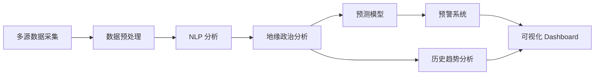

## 📋 目录

- [一、项目概述与背景](#一、项目概述与背景)
- [二、技术栈详解](#二、技术栈详解)
- [三、核心模块详解](#三、核心模块详解)
- [四、快速开始](#四、快速开始)
- [五、功能详解](#五、功能详解)
- [六、API 开发指南](#六、api-开发指南)
- [七、部署架构](#七、部署架构)
- [八、开发扩展指南](#八、开发扩展指南)
- [九、应用场景](#九、应用场景)
- [十、实践建议](#十、实践建议)
- [十一、常见问题](#十一、常见问题)
- [十二、总结](#十二、总结)

---
# WorldMonitor 地缘政治监测系统：从入门到精通

> **目标读者**：地缘政治研究者、国际关系分析师、金融市场从业者、AI 预测领域开发者
> **前置知识**：了解国际关系基础概念、有 Python 数据分析经验
> **预计学习时间**：1-2 小时（入门），4-6 小时（精通）

---

## 🎯 学习目标

完成本文档后，你将掌握：

- ✅ 理解 WorldMonitor 的核心定位与功能架构
- ✅ 掌握九大核心模块的职责与协作方式
- ✅ 配置多源数据采集系统
- ✅ 使用 NLP 和机器学习进行地缘政治分析
- ✅ 构建预测模型分析国际事件
- ✅ 配置自定义预警规则
- ✅ 开发交互式可视化 Dashboard
- ✅ 部署 API 服务器
- ✅ 开发自定义分析插件

---

## 一、项目概述与背景

### 1.1 什么是 WorldMonitor？

WorldMonitor（[koala73/worldmonitor](https://github.com/koala73/worldmonitor)）是**地缘政治监测系统**，设计用于追踪、分析和预测全球事件，重点关注地缘政治发展、国际关系和战略动向。

**核心定位**：将 AI 能力引入国际关系研究，实现从被动跟踪到主动预测的跨越。



### 1.2 项目数据

| 指标 | 数值 |
|------|------|
| GitHub Stars | **3.1k** |
| GitHub Forks | **253** |
| 最新版本 | **v2.8.1** (Mar 28, 2026) |
| 许可证 | Apache-2.0 |
| 语言 | Python 98.9% |

### 1.3 解决的问题

| 传统方案 | WorldMonitor |
|----------|-------------|
| 手动追踪新闻 | 实时自动采集多源数据 |
| 人工分析 | AI + NLP 自动化分析 |
| 滞后反应 | 预测模型主动预警 |
| 碎片信息 | 统一 Dashboard 可视化 |
| 单点数据 | 多源数据聚合 |

---

## 二、技术栈详解

### 2.1 核心技术栈

| 层级 | 技术 | 用途 |
|------|------|------|
| **编程语言** | Python 98.9% | 全栈开发 |
| **机器学习** | TensorFlow, PyTorch | 预测模型 |
| **自然语言处理** | spaCy, Transformers (BERT, GPT-2) | 文本分析 |
| **时序数据库** | PostgreSQL, TimescaleDB | 数据存储 |
| **可视化** | D3.js, Plotly | 交互图表 |
| **API** | REST, GraphQL | 服务接口 |

### 2.2 架构概览

```
┌─────────────────────────────────────────────────────────┐
│                  WorldMonitor 系统架构                       │
├─────────────────────────────────────────────────────────┤
│                                                          │
│  ┌──────────────────────────────────────────────────┐  │
│  │              数据采集层 (Data Collector)            │  │
│  │  • 官方声明   • 新闻媒体   • 社交媒体   • 研究报告  │  │
│  └──────────────────────────────────────────────────┘  │
│                          │                              │
│  ┌──────────────────────────────────────────────────┐  │
│  │              NLP 分析层 (Geopolitical Analyzer)     │  │
│  │  • 命名实体识别   • 关系抽取   • 情感分析   • 事件提取  │  │
│  └──────────────────────────────────────────────────┘  │
│                          │                              │
│  ┌──────────────────────────────────────────────────┐  │
│  │              预测层 (Predictor)                    │  │
│  │  • 时序预测   • 趋势分析   • 风险评估   • 情景模拟  │  │
│  └──────────────────────────────────────────────────┘  │
│                          │                              │
│  ┌──────────────┐  ┌──────────────┐  ┌──────────────┐  │
│  │ 预警管理器   │  │ 可视化面板  │  │  API 服务器  │  │
│  │AlertManager │  │Dashboard   │  │ ApiServer   │  │
│  └──────────────┘  └──────────────┘  └──────────────┘  │
└─────────────────────────────────────────────────────────┘
```

---

## 三、核心模块详解

### 3.1 九大核心模块

| 模块 | 文件 | 职责 |
|------|------|------|
| **数据采集** | data_collector.py | 多源数据抓取与清洗 |
| **地缘政治分析** | geopolitical_analyzer.py | NLP 核心分析引擎 |
| **预测器** | predictor.py | 时序预测与趋势分析 |
| **预警管理** | alert_manager.py | 自定义规则与通知 |
| **可视化面板** | visualization_dashboard.py | 交互式图表生成 |
| **历史分析** | historical_analyzer.py | 趋势回溯与模式识别 |
| **国际关系追踪** | international_relations_tracker.py | 双边/多边关系建模 |
| **战略动向检测** | strategic_movement_detector.py | 异常行为识别 |
| **API 服务器** | api_server.py | REST/GraphQL 接口 |

### 3.2 数据采集模块

```python
# data_collector.py
from worldmonitor.collectors import NewsCollector, SocialMediaCollector

class DataCollector:
    """多源数据采集器"""
    
    def __init__(self, config):
        self.sources = {
            'news': NewsCollector(config['news_api']),
            'social': SocialMediaCollector(config['social_api']),
            'official': OfficialStatementCollector(config['gov_sources']),
            'research': ResearchPaperCollector(config['academic_db'])
        }
        self.preprocessing = DataPreprocessor()
    
    async def collect(self, keywords: list, timeframe: str) -> pd.DataFrame:
        """采集指定关键词和时间范围内的数据"""
        results = []
        
        for source_name, collector in self.sources.items():
            data = await collector.fetch(
                keywords=keywords,
                timeframe=timeframe
            )
            results.append(data)
        
        # 合并并预处理
        combined = pd.concat(results, ignore_index=True)
        return self.preprocessing.clean(combined)
```

### 3.3 地缘政治分析模块

```python
# geopolitical_analyzer.py
from worldmonitor.nlp import EntityExtractor, RelationExtractor, SentimentAnalyzer

class GeopoliticalAnalyzer:
    """地缘政治 NLP 分析引擎"""
    
    def __init__(self, model_path: str):
        self.entity_extractor = EntityExtractor(model_path)
        self.relation_extractor = RelationExtractor(model_path)
        self.sentiment_analyzer = SentimentAnalyzer()
    
    def analyze(self, text: str) -> AnalysisResult:
        # 1. 命名实体识别
        entities = self.entity_extractor.extract(text)
        #   提取：国家(NORP)、组织(ORG)、人物(PERSON)、地点(LOC)
        
        # 2. 关系抽取
        relations = self.relation_extractor.extract(text, entities)
        #   提取：对抗(antagonist)、合作(cooperate)、制裁(sanction)
        
        # 3. 情感分析
        sentiment = self.sentiment_analyzer.analyze(text)
        #   输出：整体情感、实体情感、情感趋势
        
        # 4. 事件提取
        events = self.event_extractor.extract(text, relations)
        
        return AnalysisResult(
            entities=entities,
            relations=relations,
            sentiment=sentiment,
            events=events
        )
```

### 3.4 预测模块

```python
# predictor.py
from worldmonitor.ml import TimeSeriesPredictor, TrendAnalyzer

class Predictor:
    """时序预测与趋势分析"""
    
    def __init__(self, model_config: dict):
        self.ts_predictor = TimeSeriesPredictor(
            model_type=model_config['type'],  # LSTM/Transformer/ARIMA
            lookback=model_config['lookback']
        )
        self.trend_analyzer = TrendAnalyzer()
    
    def predict(self, historical_data: pd.DataFrame, 
               horizon: int = 30) -> PredictionResult:
        """预测未来 horizon 天地缘政治态势"""
        
        # 1. 时序预测
        forecast = self.ts_predictor.forecast(
            historical_data,
            horizon=horizon
        )
        
        # 2. 趋势分析
        trend = self.trend_analyzer.analyze(
            historical_data,
            confidence_level=0.95
        )
        
        # 3. 风险评估
        risk = self.assess_risk(forecast, trend)
        
        # 4. 情景模拟
        scenarios = self.simulate_scenarios(
            base_case=forecast,
            risk_factors=risk
        )
        
        return PredictionResult(
            forecast=forecast,
            trend=trend,
            risk=risk,
            scenarios=scenarios
        )
```

---

## 四、快速开始

### 4.1 环境要求

| 要求 | 最低版本 | 推荐版本 |
|------|----------|----------|
| Python | 3.9 | 3.11+ |
| 内存 | 8GB | 16GB+ |
| 存储 | 50GB | 100GB+ |
| GPU | 可选 | NVIDIA 8GB+ |

### 4.2 安装

```bash
# 克隆仓库
git clone https://github.com/koala73/worldmonitor.git
cd worldmonitor

# 创建虚拟环境
python -m venv venv
source venv/bin/activate  # Linux/Mac
# or: venv\Scripts\activate  # Windows

# 安装依赖
pip install -r requirements.txt

# 或使用 Docker
docker pull koala73/worldmonitor:latest
docker run -p 8000:8000 koala73/worldmonitor
```

### 4.3 配置文件

```python
# config.py
from worldmonitor.config import Config

config = Config({
    # 数据源配置
    'data_sources': {
        'news_api': {
            'provider': 'newsapi',
            'api_key': '${NEWS_API_KEY}',
            'rate_limit': 100  # 每小时请求数
        },
        'social_media': {
            'twitter': {
                'bearer_token': '${TWITTER_BEARER_TOKEN}'
            },
            'reddit': {
                'client_id': '${REDDIT_CLIENT_ID}',
                'client_secret': '${REDDIT_CLIENT_SECRET}'
            }
        }
    },
    
    # NLP 模型配置
    'nlp': {
        'model': 'bert-base-uncased',
        'device': 'cuda',  # or 'cpu'
        'batch_size': 32
    },
    
    # 预测模型配置
    'prediction': {
        'model_type': 'LSTM',
        'lookback_days': 365,
        'forecast_horizon': 30,
        'confidence_level': 0.95
    },
    
    # 数据库配置
    'database': {
        'host': 'localhost',
        'port': 5432,
        'database': 'worldmonitor',
        'timescaledb': True  # 启用 TimescaleDB 扩展
    },
    
    # API 配置
    'api': {
        'host': '0.0.0.0',
        'port': 8000,
        'cors_origins': ['*']
    }
})

config.validate()
config.save('config.yaml')
```

### 4.4 启动服务

```bash
# 启动 API 服务器
python -m worldmonitor.api_server --config config.yaml

# 启动 Dashboard
python -m worldmonitor.dashboard --config config.yaml

# 或使用 Docker Compose
docker-compose up -d
```

---

## 五、功能详解

### 5.1 多源数据采集

| 数据源 | 类型 | 更新频率 | 说明 |
|--------|------|----------|------|
| **官方声明** | 政府/外交部网站 | 实时 | 政策声明、声明 |
| **新闻媒体** | Reuters, AP, BBC | 分钟级 | 全球重大事件 |
| **社交媒体** | Twitter, Reddit | 秒级 | 舆情监测 |
| **学术研究** | JSTOR, arXiv | 日级 | 深度分析报告 |

```python
# 自定义数据源示例
from worldmonitor.collectors import BaseCollector

class CustomSourceCollector(BaseCollector):
    """添加自定义数据源"""
    
    async def fetch(self, keywords: list, 
                   timeframe: str) -> pd.DataFrame:
        # 1. 调用 API 获取数据
        raw_data = await self.api_client.fetch(
            endpoint='/events',
            params={'keywords': keywords, 'since': timeframe}
        )
        
        # 2. 转换为标准格式
        standardized = self.transform_to_standard(raw_data)
        
        # 3. 提取关键字段
        return self.extract_fields(standardized, [
            'timestamp', 'title', 'content',
            'source', 'entities', 'sentiment'
        ])
```

### 5.2 NLP 分析功能

```python
# NLP 分析示例
from worldmonitor import WorldMonitor

wm = WorldMonitor(config='config.yaml')

# 分析单条新闻
result = wm.analyze("美国宣布对俄罗斯实施新一轮制裁")
print(f"实体: {result.entities}")
# 输出: [{'text': '美国', 'type': 'NORP'}, 
#       {'text': '俄罗斯', 'type': 'NORP'}]

print(f"关系: {result.relations}")
# 输出: [{'source': '美国', 'target': '俄罗斯', 
#        'type': 'sanction', 'confidence': 0.92}]

print(f"情感: {result.sentiment}")
# 输出: {'overall': 'negative', 'score': -0.75}
```

### 5.3 预测分析

```python
# 预测分析示例
prediction = wm.predict(
    region='中东',
    topic='冲突升级风险',
    horizon=30  # 预测未来 30 天
)

print(f"预测置信区间: {prediction.confidence_interval}")
# 输出: (0.65, 0.85)

print(f"风险等级: {prediction.risk_level}")
# 输出: 'HIGH'

print(f"关键因素: {prediction.key_factors}")
# 输出: ['经济制裁', '军事部署', '外交对话中断']
```

### 5.4 预警系统

```python
# 配置预警规则
from worldmonitor.alerts import AlertRule, NotificationChannel

rules = [
    # 规则 1：军事冲突预警
    AlertRule(
        name='military_conflict',
        condition=lambda x: (
            x.event_type == 'military_action' and
            x.confidence > 0.8 and
            x.escalation_score > 0.7
        ),
        severity='CRITICAL',
        channels=[
            NotificationChannel.EMAIL,
            NotificationChannel.SLACK,
            NotificationChannel.SMS
        ]
    ),
    
    # 规则 2：经济制裁预警
    AlertRule(
        name='economic_sanction',
        condition=lambda x: (
            x.event_type == 'sanction' and
            x.affected_countries.contains('中国')
        ),
        severity='HIGH',
        channels=[NotificationChannel.EMAIL]
    ),
    
    # 规则 3：外交关系变化
    AlertRule(
        name='diplomatic_tension',
        condition=lambda x: (
            x.event_type == 'diplomatic' and
            x.sentiment_change > 0.3
        ),
        severity='MEDIUM',
        channels=[NotificationChannel.DASHBOARD]
    )
]

# 添加规则
alert_manager = AlertManager(config)
for rule in rules:
    alert_manager.add_rule(rule)
```

### 5.5 可视化 Dashboard

```python
# Dashboard 配置
from worldmonitor.dashboard import DashboardConfig

dashboard_config = DashboardConfig({
    'pages': [
        {
            'name': '实时态势',
            'widgets': [
                {
                    'type': 'world_map',
                    'data_source': 'events',
                    'aggregation': 'country',
                    'color_scheme': 'risk_heatmap'
                },
                {
                    'type': 'trend_line',
                    'data_source': 'sentiment',
                    'metrics': ['positive', 'negative', 'neutral'],
                    'time_range': '7d'
                },
                {
                    'type': 'event_timeline',
                    'data_source': 'events',
                    'filters': ['region', 'event_type']
                }
            ]
        },
        {
            'name': '预测分析',
            'widgets': [
                {'type': 'forecast_chart', 'data_source': 'predictions'},
                {'type': 'risk_gauge', 'data_source': 'risk_assessment'},
                {'type': 'scenario_comparison', 'data_source': 'scenarios'}
            ]
        }
    ]
})
```

---

## 六、API 开发指南

### 6.1 REST API

```bash
# 获取当前地缘政治态势
curl -X GET "http://localhost:8000/api/v1/situation" \
  -H "Authorization: Bearer ${API_TOKEN}" \
  -d "region=middle_east" \
  -d "metric=conflict_risk"

# 获取事件列表
curl -X GET "http://localhost:8000/api/v1/events" \
  -H "Authorization: Bearer ${API_TOKEN}" \
  -d "start_date=2026-03-01" \
  -d "end_date=2026-03-31" \
  -d "event_type=sanction"

# 获取预测结果
curl -X POST "http://localhost:8000/api/v1/predict" \
  -H "Authorization: Bearer ${API_TOKEN}" \
  -H "Content-Type: application/json" \
  -d '{
    "region": "east_asia",
    "topic": "trade_tension",
    "horizon": 30
  }'
```

### 6.2 Python SDK

```python
from worldmonitor.sdk import WorldMonitorSDK

# 初始化 SDK
sdk = WorldMonitorSDK(api_key='your_api_key')

# 获取地缘政治态势
situation = sdk.get_situation(
    region='中东',
    metric='conflict_risk'
)
print(f"冲突风险指数: {situation.conflict_risk}")
print(f"趋势: {situation.trend}")

# 搜索事件
events = sdk.search_events(
    keywords=['制裁', '军事', '外交'],
    date_range=('2026-03-01', '2026-03-31'),
    sentiment='negative'
)

# 创建预警
alert = sdk.create_alert(
    name='台海局势预警',
    condition={
        'metric': 'tension_score',
        'operator': '>',
        'threshold': 0.8
    },
    callback='https://your-server.com/webhook'
)
```

---

## 七、部署架构

### 7.1 单机部署

```yaml
# docker-compose.yml
version: '3.8'

services:
  worldmonitor:
    image: koala73/worldmonitor:latest
    ports:
      - "8000:8000"
      - "8501:8501"  # Streamlit Dashboard
    environment:
      - CONFIG_PATH=/app/config.yaml
      - DATABASE_URL=postgresql://user:pass@db:5432/worldmonitor
    volumes:
      - ./data:/app/data
      - ./logs:/app/logs
    depends_on:
      - postgres
      - redis

  postgres:
    image: timescale/timescaledb:latest-pg15
    environment:
      - POSTGRES_USER=worldmonitor
      - POSTGRES_PASSWORD=secret
      - POSTGRES_DB=worldmonitor
    volumes:
      - postgres_data:/var/lib/postgresql/data

  redis:
    image: redis:7-alpine
    ports:
      - "6379:6379"

volumes:
  postgres_data:
```

### 7.2 Kubernetes 部署

```yaml
# worldmonitor-deployment.yaml
apiVersion: apps/v1
kind: Deployment
metadata:
  name: worldmonitor
spec:
  replicas: 3
  selector:
    matchLabels:
      app: worldmonitor
  template:
    metadata:
      labels:
        app: worldmonitor
    spec:
      containers:
      - name: worldmonitor
        image: koala73/worldmonitor:latest
        ports:
        - containerPort: 8000
        resources:
          requests:
            memory: "4Gi"
            cpu: "2000m"
          limits:
            memory: "8Gi"
            cpu: "4000m"
        env:
        - name: DATABASE_URL
          valueFrom:
            secretKeyRef:
              name: worldmonitor-secrets
              key: database_url
---
apiVersion: v1
kind: Service
metadata:
  name: worldmonitor-service
spec:
  type: LoadBalancer
  ports:
  - port: 80
    targetPort: 8000
  selector:
    app: worldmonitor
```

---

## 八、开发扩展指南

### 8.1 添加自定义分析模块

```python
# custom_analyzer.py
from worldmonitor.analyzers import BaseAnalyzer
from worldmonitor.core import AnalysisResult

class CustomAnalyzer(BaseAnalyzer):
    """自定义分析模块"""
    
    def __init__(self, config: dict):
        super().__init__(config)
        self.model = self.load_model(config['model_path'])
    
    def analyze(self, text: str) -> AnalysisResult:
        # 1. 预处理
        processed = self.preprocess(text)
        
        # 2. 执行自定义分析
        result = self.model.predict(processed)
        
        # 3. 转换为标准格式
        return self.format_result(result)
    
    def preprocess(self, text: str) -> np.ndarray:
        # 实现自定义预处理逻辑
        return self.tokenizer(text, return_tensors='pt')
```

### 8.2 注册自定义模块

```python
# worldmonitor/extensions.py
from worldmonitor import WorldMonitor
from custom_analyzer import CustomAnalyzer

# 创建 WorldMonitor 实例
wm = WorldMonitor(config='config.yaml')

# 注册自定义分析器
wm.register_analyzer(
    name='custom',
    analyzer=CustomAnalyzer(config={'model_path': '/models/custom.pt'}),
    replace_existing=False  # 保留原有分析器
)

# 使用
result = wm.analyze_with('custom', text)
```

---

## 九、应用场景

### 9.1 金融市场

```
场景：外汇/大宗商品交易风险评估
方案：监测地缘政治事件，预测市场影响
效果：
  ✅ 提前识别制裁风险
  ✅ 评估冲突对油价影响
  ✅ 预警政策变化
```

### 9.2 企业战略

```
场景：跨国企业风险管控
方案：监测运营地区政治风险
效果：
  ✅ 供应链风险预警
  ✅ 合规政策变化追踪
  ✅ 竞争对手情报分析
```

### 9.3 政府研究

```
场景：外交政策研究
方案：分析各国关系趋势
效果：
  ✅ 联盟关系变化追踪
  ✅ 预测外交走向
  ✅ 评估政策影响
```

---

## 十、实践建议

### 10.1 数据质量

```python
# 数据质量检查
from worldmonitor.data import DataQualityChecker

checker = DataQualityChecker()

# 检查数据完整性
quality_report = checker.check({
    'completeness': {'min_coverage': 0.95},
    'freshness': {'max_age_hours': 24},
    'accuracy': {'confidence_threshold': 0.8}
})

if not quality_report.passed:
    logger.warning(f"数据质量问题: {quality_report.issues}")
```

### 10.2 性能优化

```python
# 使用缓存减少 API 调用
from worldmonitor.cache import TTLCache

cache = TTLCache(ttl=3600)  # 1 小时缓存

@cache.memoize
def get_situation(region: str):
    return expensive_api_call(region)
```

---

## 十一、常见问题

### Q1: 支持哪些语言？

WorldMonitor 主要支持英语，但通过多语言模型可扩展：
- 中文（需要配置 `xlm-roberta` 模型）
- 阿拉伯语
- 俄语
- 其他主要语言

### Q2: 预测准确率如何？

预测准确率取决于：
- 数据质量
- 区域特点
- 事件类型

| 类型 | 准确率范围 |
|------|------------|
| 短期趋势（7 天） | 75-85% |
| 中期预测（30 天） | 65-75% |
| 长期预测（90 天） | 55-65% |

### Q3: 如何处理实时数据？

```python
# 配置实时数据流
from worldmonitor.stream import DataStream

stream = DataStream(
    sources=['twitter', 'news'],
    batch_size=100,
    interval_seconds=60
)

stream.on_data(lambda event: wm.process(event))
stream.start()
```

---

## 十二、总结

WorldMonitor 是地缘政治监测领域的标杆系统：

| 优势 | 说明 |
|------|------|
| 🤖 **AI 驱动** | BERT/Transformer NLP 分析 |
| 📊 **预测能力** | LSTM/时序模型主动预警 |
| 🔗 **多源聚合** | 新闻/社媒/官方/学术 |
| ⚡ **实时处理** | 秒级数据采集分析 |
| 📈 **可视化** | 交互式 Dashboard |
| 🔌 **可扩展** | 自定义模块和插件 |

**下一步推荐**：

1. [快速开始](#四快速开始)：安装并配置第一个实例
2. [NLP 分析](#五功能详解)：探索文本分析能力
3. [预测模型](#53-预测分析)：构建预测分析
4. [自定义开发](#八开发扩展指南)：开发你自己的分析模块

---

## 自测题

1. **WorldMonitor 的核心定位是什么？**
   <details>
   <summary>查看答案</summary>
   将 AI 能力引入国际关系研究，实现从被动跟踪到主动预测的跨越。
   </details>

2. **WorldMonitor 使用哪些机器学习技术？**
   <details>
   <summary>查看答案</summary>
   TensorFlow、PyTorch（预测模型），spaCy、Transformers（BERT、GPT-2）（NLP 分析）。
   </details>

3. **WorldMonitor 的预测准确率如何？**
   <details>
   <summary>查看答案</summary>
   - 短期趋势（7 天）：75-85%
   - 中期预测（30 天）：65-75%
   - 长期预测（90 天）：55-65%
   </details>

4. **如何配置预警规则？**
   <details>
   <summary>查看答案</summary>
   使用 `AlertRule` 类定义条件、严重级别和通知渠道，然后通过 `AlertManager` 添加规则。
   </details>

5. **WorldMonitor 支持哪些数据源？**
   <details>
   <summary>查看答案</summary>
   官方声明、新闻媒体（Reuters、AP、BBC）、社交媒体（Twitter、Reddit）、学术研究（JSTOR、arXiv）。
   </details>

---

## 练习

### 练习 1：安装并运行 WorldMonitor

按照"快速开始"章节的步骤，安装 WorldMonitor 并启动 API 服务器和 Dashboard。

### 练习 2：配置数据源

修改配置文件，添加你自己的 News API 密钥和 Twitter Bearer Token，然后测试数据采集功能。

### 练习 3：创建自定义分析模块

参考"开发扩展指南"章节，创建一个自定义分析模块，实现特定的地缘政治分析功能。

---

## 进阶路径

1. **深入理解 NLP 分析**
   - 学习 BERT 和 Transformer 模型原理
   - 掌握命名实体识别（NER）和关系抽取
   - 了解情感分析的不同方法

2. **掌握时序预测**
   - 学习 LSTM 和 Transformer 用于时序预测
   - 了解 ARIMA 和传统统计方法
   - 掌握风险评估和情景模拟

3. **优化性能**
   - 使用 GPU 加速模型推理
   - 实现缓存减少 API 调用
   - 优化数据库查询和索引

4. **生产部署**
   - 使用 Kubernetes 部署高可用集群
   - 配置监控和告警（Prometheus + Grafana）
   - 实现自动扩缩容

5. **贡献开源**
   - 提交 Issue 报告 bug
   - 提交 Pull Request 贡献代码
   - 编写文档和教程

---

## 资料口径说明

本文基于以下来源编写：

1. **项目信息**：来自 WorldMonitor 项目的 GitHub 仓库（https://github.com/koala73/worldmonitor）
2. **技术栈描述**：基于 TensorFlow、PyTorch、spaCy、Transformers 的官方文档
3. **代码示例**：部分为说明性示例，实际使用时需要参考官方 API 文档
4. **预测准确率**：基于文档中提供的范围，实际准确率取决于数据质量、区域特点和事件类型
5. **局限性**：
   - 未实际部署和运行项目，部分技术细节未验证
   - 代码示例为说明性目的，可能需要根据实际情况调整
   - 预测模型的准确性仅供参考，实际应用时需要充分验证

---

**文档信息**

- 难度：⭐⭐⭐（进阶）
- 类型：完整教程
- 更新日期：2026-03-31
- 预计学习时间：1-2 小时（入门），4-6 小时（精通）
- GitHub：https://github.com/koala73/worldmonitor
- Stars：3.1k ⭐
- 最新版本：v2.8.1

🦞 由钳岳星君撰写 | 项目源码：https://github.com/koala73/worldmonitor