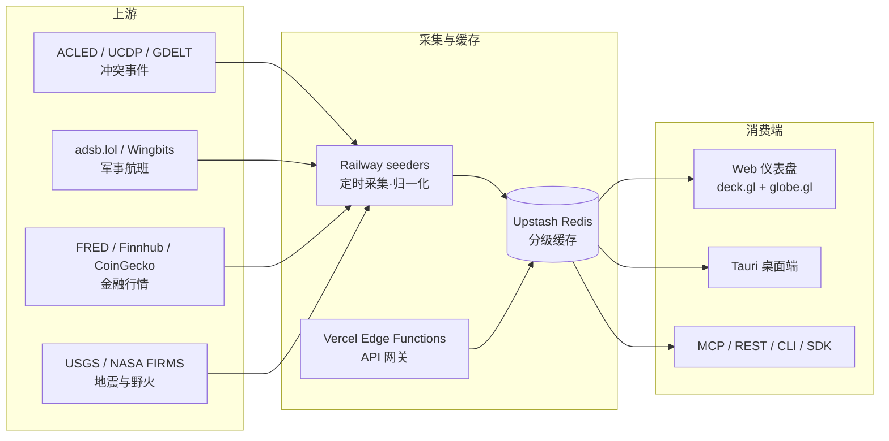

# World Monitor 解析：87,000 星的开源情报仪表盘，重的是数据管道而非预测模型

开源项目里做"地缘政治仪表盘"的不少，但多数停在 RSS 聚合加一张地图。[koala73/worldmonitor](https://github.com/koala73/worldmonitor)（对外名称 World Monitor）真正下功夫的地方在两处：一是数据管道——Railway 上的定时采集器把冲突事件、军事航班、市场行情、灾害警报这些异构上游源清洗、归一化、缓存成统一形态，仪表盘和 API 都只读缓存，用户的流量洪峰不会传导给数据源；二是评分与告警的可解释性——31 个一级国家的 Country Instability Index（CII，国家不稳定指数）公开了完整的权重公式、加分项和保底规则，每条新闻的威胁定级都带着 `keyword`、`ml`、`llm` 三种来源标签，读者能看到结论是怎么来的。

这个项目在中文技术社区常被介绍成"基于 BERT 和 LSTM 的地缘政治预测平台"，这和仓库的实际情况对不上：它是 Vanilla TypeScript 单页应用，仓库里没有 Python 训练代码，也不发布"预测准确率"。它做的事是把公开情报实时摆在一个界面里，AI 部分负责摘要、分类和检索，推理和判断留给用户。本文基于 2026-10-04 的仓库状态与 GitHub API 数据写成，先给系统地图，再拆开值得细看的机制，最后给上手路径和适用边界。

## 项目概况

| 项目 | 数据 |
|------|------|
| 仓库 | [koala73/worldmonitor](https://github.com/koala73/worldmonitor)，创建于 2026-01-08 |
| Stars / Forks | 87,722 / 13,375（2026-10-04 GitHub API 快照） |
| 最新版本 | v2.10.0（2026-09-08 发布） |
| 许可证 | AGPL-3.0-only，作者 Elie Habib（koala73） |
| 语言构成 | TypeScript 约 51%、JavaScript 约 47%（按 GitHub languages 字节数） |
| 在线实例 | [worldmonitor.app](https://www.worldmonitor.app) 及 tech、finance、commodity、happy、energy 五个变体站点 |
| 桌面端 | Tauri 2 封装，覆盖 macOS（ARM64/x64）、Windows、Linux |
| 文档 | [worldmonitor.app/docs](https://www.worldmonitor.app/docs/documentation)，仓库内另有 48KB 的 ARCHITECTURE.md |

创建九个月拿到 8.7 万 star，增速在开源仪表盘项目里少见。看它的 star 增长曲线和 issue 区能发现两个驱动因素：产品形态踩中了 OSINT（开源情报）工具大众化的窗口——同样这类能力过去装在 Palantir 这类闭源系统里，仓库 topics 里就有 `palantir` 这个自嘲式的标签；另外它对 agent 生态的适配做得很早，MCP server、Agent Skills、`llms.txt`、四语言 README 都是一等公民。

## 系统地图：一条单向数据流

World Monitor 的架构有一条清楚的主干：数据只朝一个方向流动。Railway 上的采集进程（seeder）和 Vercel Edge Functions 按固定节奏抓取上游，归一化后写入 Upstash Redis；浏览器端仪表盘从缓存水合（hydrate），不直接大量请求上游。官方架构文档统计的已观测上游主机超过 578 个，覆盖地缘政治与冲突、军事、金融、能源、基础设施与网络威胁、环境灾害、航空等 11 个情报域。


```mermaid
graph LR
    subgraph 上游
        A["ACLED / UCDP / GDELT<br/>冲突事件"]
        B["adsb.lol / Wingbits<br/>军事航班"]
        C["FRED / Finnhub / CoinGecko<br/>金融行情"]
        D["USGS / NASA FIRMS<br/>地震与野火"]
    end
    subgraph 采集与缓存
        E["Railway seeders<br/>定时采集·归一化"]
        F["Vercel Edge Functions<br/>API 网关"]
        G[("Upstash Redis<br/>分级缓存")]
    end
    subgraph 消费端
        H["Web 仪表盘<br/>deck.gl + globe.gl"]
        I["Tauri 桌面端"]
        J["MCP / REST / CLI / SDK"]
    end
    A --> E
    B --> E
    C --> E
    D --> E
    E --> G
    F --> G
    G --> H
    G --> I
    G --> J
```

部署拓扑比"一个前端项目"复杂得多，这也是它和常见 dashboard 模板拉开差距的地方：

| 组件 | 平台 | 职责 |
|------|------|------|
| SPA 与领域 API | Vercel Edge Functions | 静态资源、按 proto 契约生成的领域网关、机器人过滤 |
| CORS 预检 Worker | Cloudflare | 为 `api.worldmonitor.app` 在边缘短路 OPTIONS 请求 |
| AIS 中继与采集 | Railway | 船舶 AIS WebSocket 代理、行情/航空/风险分数等 seed 循环 |
| Redis | Upstash | 防击穿缓存、采集新鲜度追踪、限流 |
| 用户与计费 | Convex | 订阅计费（Dodo）、API key、180 天历史情报库（向量检索） |
| 桌面壳 | Tauri 2（Rust） | 打包桌面应用，内置 Node.js sidecar |
| 容器镜像 | GHCR | nginx 托管静态构建产物，API 反代到上游 |

前端本身没有引入 React 或 Vue。109 个面板类全部继承自一个 `Panel` 基类，渲染走 `setContent(html)` 加事件委托；状态管理是一个集中的 `AppContext` 可变对象，不依赖外部状态库。两套地图引擎并行：deck.gl + MapLibre 负责平面 WebGL 地图（散点、热力、弧线、H3 六边形等图层），globe.gl + Three.js 负责 3D 地球，两层共享同一份地图图层目录，按变体和订阅档位过滤。

## CII：把"局势紧张吗"变成一条可复查的公式

CII 是这个项目里最值得细看的机制，因为它直面一个难题：怎么把新闻报道、抗议人数、战斗烈度这些不同量纲的信号，压成一个 0-100 的国家风险分，还不沦为"媒体报道量指数"。v8 版做法是分两层：

```text
eventScore = Unrest * 0.25      # 社会动荡：ACLED 抗议与骚乱、断网断电
           + Conflict * 0.30    # 武力冲突：ACLED 战斗、爆炸、平民袭击伤亡
           + Security * 0.20    # 硬安全：军事航班、军舰、GPS 干扰、空域关闭
           + Information * 0.25 # 信息环境：分级新闻标题、国家归因威胁摘要

combinedScore = baselineRisk * 0.40   # 人工维护的基线风险
              + eventScore * 0.60     # 动态事件分
              + 补充加分项
```

加分项和保底规则全部公开。加分项有十种，幅度从"新闻紧迫 +5"到"强震 +25"不等；保底规则（floor）保证正在发生的危机不会因为数据缺口显得平静——UCDP 认定的活跃战争国家分数不低于 70，低烈度冲突不低于 50，美国国务院"请勿前往"旅行警告对应 60 的下限。UCDP 的冲突认定只统计两年滚动窗口内的事件，避免历史战争永久压住当前分数。最终分数分五档：Critical（81-100）、High（66-80）、Elevated（51-65）、Normal（31-50）、Low（0-30）。

三个工程细节能看出这套东西的成熟度。第一，分数在服务端预计算：`GET /api/intelligence/v1/get-risk-scores` 是唯一权威出口，结果按方法论版本（当前 `v8`）版本化缓存进 Redis，Railway 中继进程每 8 分钟主动预热一次，客户端拿到的永远是热缓存。第二，方法论变更有版本纪律——CHANGELOG 里 v6、v7、v8 每一版都写明了归因规则改了什么、哪些国家的分数会动、缓存键族整体迁移（如 `risk:scores:sebuf:v8`），客户端需要重新对基线。第三，防偏见是显式设计：新闻压力与冲突分量分离、高曝光国家使用更低的事件乘系数和对数阻尼、文档专门说明"加沙文本归因"这类已知误差来源。实时排名可在 [CII 页面](https://www.worldmonitor.app/country-instability-index/)直接查看。

## AI 部分：四层摘要链，每一层都有退路

World Monitor 的 AI 不做预测，做的是压缩、分类和检索。这几条链路的共同点是本地优先、逐层降级，任何一层不可用都不会让界面空转。

**摘要链**（World Brief，约每 2 分钟生成一次）：第一层 Ollama 或 LM Studio 走本地端点（OpenAI 兼容接口，无需任何 API key）；第二层 Groq（Llama 3.1 8B，温度 0.3）；第三层 OpenRouter 多模型兜底；最后一层是浏览器里的 T5-small（Transformers.js 跑 ONNX），完全离线可用。送入模型前，标题先做词重叠去重（Jaccard 相似度大于 0.6 的近重复合并），提示词因此缩短 20-40%；服务端再按 `summary:v9:{mode}:{variant}:{lang}:{hash}` 复合键缓存 24 小时——同样一组标题被一千个用户打开，也只触发一次 LLM 调用。

**威胁分类**是三级流水线，关键设计是"UI 永不等 AI"：

| 层级 | 方式 | 特点 |
|------|------|------|
| 第一级 | 关键词匹配 | 约 120 个威胁关键词按 5 档严重度、14 类事件组织，词边界正则避免 "war" 误中 "award"；先跑一张生活类排除词表，防止 "virus" 在美食标题里触发警报 |
| 第二级 | 浏览器端 ML | Transformers.js 在 Web Worker 里跑 NER、情感和主题分类，不出浏览器 |
| 第三级 | LLM 批量复核 | Groq（温度 0）或本地 Ollama 批量调用，Redis 缓存 24 小时；上游 5xx 时自动暂停队列并指数退避，省配额 |

每条分类结果带 `source` 标签（`keyword`/`ml`/`llm`），下游可以按来源决定采信权重。LLM 结果只在置信度更高时才覆盖关键词结果。

**浏览器端检索（Headline Memory）**是一个可选开启的本地 RAG：每条新闻标题经 MiniLM-L6-v2 嵌成 384 维向量，存进 IndexedDB（上限 5,000 条，按写入时间 LRU 淘汰），查询时游标全扫算余弦相似度。默认关闭，开启后模型加载、推理全部在本机 Web Worker 里完成，移动端自动禁用以省内存。另一套对应的服务端版本存在 Convex 里：Pro 用户可跨设备检索 180 天的冲突、军事、能源事件历史，提供语义搜索、时间线和先例匹配三种读法。

**信号关联（Focal Point Detector）**解决的是多源信号对不上的问题：伊朗在新闻里出现 12 次，同时地图上有 5 个军事航班信号、3 起抗议、1 次断网——单看任何一路都不算异常，合在一起就是重点对象。算法给每个实体算一个 0-100 的焦点分（新闻侧 0-40、信号侧 0-40、交叉关联 0-20），超过 70 或同时出现 3 类以上信号标记为 Critical，并反哺该国 CII 分数。

告警侧同样有节制：五条独立告警来源（RSS 快讯、关键词激增、热点升级、军事集结征兆、以色列本土防空警报）汇成一条突发新闻流，中间要过八道防噪闸门——同一事件 30 分钟去重、全局 60 秒冷却、超过 15 分钟的旧闻直接丢弃、三级以下来源必须 LLM 复核定级才能触发、应用启动后前 10 秒静默（防止重连时旧文重放成"突发"）。都过了，才以 `wm:breaking-news` 事件弹出横幅。

## 一次信号怎么流过系统

把上面的机制串起来，看一条"冲突升级"信号从上游到用户屏幕的完整路径：

1. **采集**。ACLED 记录到一场战斗事件，Reuters 快讯 RSS 带出 `isAlert: true` 的标题。Railway 上的 seeder 按固定节奏抓到这两路数据，归一化后写入 Redis，附上来源、层级和时间戳。
2. **水合**。浏览器端 `App.init()` 的 Bootstrap 阶段从 `/api/bootstrap` 分两级并发拉取（快层 3 秒、慢层 5 秒超时），面板按视口优先级逐个填数。
3. **定级**。关键词分类器即时给出 critical/high 定级，UI 立刻显示；几秒内 ML 和 LLM 的复核结果到达，`source` 标签更新。
4. **聚类与告警**。Jaccard 阈值 0.4 的快速聚类先合并同一事件的标题，ML 加载后语义相似度 0.78 以上的簇再合并一轮（比如 "NATO expands missile shield" 和 "Alliance deploys new air defense systems"）。突发横幅闸门逐项放行后弹出。
5. **进入评分**。事件计入相关国家的 CII Conflict 分量，服务端 `GetRiskScores` 重算；若该国同时出现军事航班聚集，Focal Point Detector 给出 Critical 焦点，触发 CII 加分。24 小时后的快照对比会给出 `dynamicScore` 趋势（变动超过 ±1 点才记为上升/下降）。
6. **多形态出口**。分析师点开国家简报页，看到四个分量的分解条、7 天事件时间线、带 `[1]`-`[8]` 引用锚点的 AI 简报；运行中的 agent 则通过 MCP 的 `get_conflict_events`、`get_country_risk` 等工具读到同一份数据。

这条链路里没有一步是"预测未来"——它做的是让同一条信号在不同形态的出口上保持一致，并且每个环节的置信来源可查。

## 面向智能体的程序化访问

World Monitor 是同类项目里最早把 agent 当一等用户的。四条通道对应四种集成深度：

```sh
# CLI：免 key 试用，正式使用配 API key（worldmonitor.app/pro 获取）
npx worldmonitor tools
npm install -g worldmonitor   # 命令别名 wm
worldmonitor risk IR --api-key wm_xxx
```

- **MCP server**：`https://worldmonitor.app/mcp`，Streamable HTTP 传输。`tools/list` 公开——向该端点 POST `{"jsonrpc":"2.0","id":1,"method":"tools/list"}`（`Accept` 头带 `application/json, text/event-stream`）即可列出全部工具，无需 key；`tools/call` 用 `X-WorldMonitor-Key` 请求头或 OAuth 认证。工具参考文档列出的工具超过 80 个，还通过 MCP 官方 skills 扩展（`skills/list`、`skills/get`、`skill://` 资源读取）发布了 27 个 [Agent Skills](https://github.com/koala73/worldmonitor/tree/main/skills)，从 `check-country-risk`、`track-conflict-events` 到 `assess-energy-shock`，粒度是"一次分析动作"而不是一整个仪表盘。
- **REST API**：基础地址 `api.worldmonitor.app`，全套端点有 [OpenAPI 规范](https://worldmonitor.app/openapi.yaml)，接口契约用 Protocol Buffers 定义、从 proto 生成边缘网关——这在纯前端项目里相当少见。
- **CLI 与 SDK**：官方 npm 包即 CLI；Python（`worldmonitor-sdk`）、Ruby、Go 三种语言的零依赖 SDK 与 CLI 能力一一对应。
- **发现文件**：`llms.txt`、agent-skills 清单、API 目录都放在 `.well-known` 下，agent 无需读文档即可自行发现能力。

值得一提的还有这个项目对"编造"的态度。它的公司情报功能曾因域名归因启发式会编造公司关联而被整体禁用（issue #3777），半年后改用 SEC EDGAR 的权威 ticker→CIK 解析重建（#5695）——解析不了的公司返回显式的空结果，宁可没有也不猜。CHANGELOG 里类似的行为级条目贯穿始终，连"YouTube 频道直播检测因违反对方服务条款而主动退役"（#8167）都写得一清二楚。对一个情报类工具，这种纪律比功能数量更重要。

## 上手路径

三档投入，按需选择：

**第一档：直接用在线实例。** 打开 [worldmonitor.app](https://www.worldmonitor.app)，公开数据源（地震、天气、冲突大事记等）无需注册即可看。六个变体站点共用一套代码库：`finance.` 侧重市场，`energy.` 侧重能源，`happy.` 只聚合正面事件。桌面版从官网下载对应平台的安装包，一个 Tauri 二进制内切换所有变体。

**第二档：本地开发。** 仓库对环境的要求只有 Node.js，无需任何环境变量即可启动：

```bash
git clone https://github.com/koala73/worldmonitor.git
cd worldmonitor
npm install
npm run dev        # 打开 localhost:3000
npm run dev:finance  # 或运行某个变体
```

特定数据源需要凭据时，照 `.env.example` 里的完整清单逐项配置。浏览器端 ML 默认按需加载，不开 Headline Memory 不会下载任何模型。

**第三档：自托管全栈。** 仓库的 SELF_HOSTING.md 给出完整的 Docker Compose 拓扑（nginx 应用容器、Redis、中继、采集器）。注意四个必需密钥必须先写入 `.env`，缺任何一个对应容器会拒绝启动：

```bash
echo "RELAY_SHARED_SECRET=$(openssl rand -hex 32)" >> .env
echo "REDIS_PASSWORD=$(openssl rand -hex 32)"      >> .env
echo "REDIS_TOKEN=$(openssl rand -hex 32)"         >> .env
echo "WM_SESSION_SECRET=$(openssl rand -hex 32)"   >> .env
docker compose up -d
./scripts/run-seeders.sh    # 向 Redis 灌入首批数据
```

自托管实例的 MCP server 挂在自己的 `/api/mcp` 路径下，用 `WORLDMONITOR_VALID_KEYS` 配置访问 key；托管版才支持 OAuth 路径。

## 采用建议与边界

**适合谁，按什么顺序用。** 个人研究者和学生从在线实例开始，零成本拿到一个可交互的全球态势面板；写分析报告的人加一步——国家简报页的 PNG 导出和证据包（Markdown，含引用来源与新鲜度说明）免费可用，结构化 JSON/CSV 导出需要 Pro Business 或 API 档订阅；开发者和 agent 生态玩家走 CLI/MCP 通道，免 key 的 `tools/list` 就够评估能力面；想私有化部署情报能力（例如安全团队做内部监控）的团队再考虑第三档自托管，预算一次 Redis 和 Railway 的运维成本。

**几条硬边界要清楚：**

- **AGPL-3.0 的约束是真实的。** 个人、研究、自托管都没问题；但拿它做商业 SaaS 或二开分发，必须遵守 copyleft 开源你的修改版源码，闭源需求要走作者的独立商业授权。用的前先读 [LICENSE](https://www.gnu.org/licenses/agpl-3.0) 和仓库里的通俗版说明。
- **它不给预测结论。** 没有"未来 30 天冲突概率 X%"这种数字——有 AI 推演面板（Deduction Panel，把最近 15 条新闻作为上下文让 LLM 做近程推演，缓存 1 小时）和 Polymarket 预测市场数据，但项目自己不发布准确率指标。要的是决策建议而不是情报呈现的话，这里只有半成品。
- **上游数据源决定能力上限。** ACLED 等 API 需要自己的凭据；没配凭据时相应信号降级（比如冲突分量只剩 UCDP 历史数据，健康检查会标 `COVERAGE_PARTIAL`）。自托管开箱即用的是公开源，深度数据要自己配 key。
- **浏览器端 ML 是资源换便利。** 模型按需下载几十 MB，移动端直接禁用；要完整体验需要一台像样的桌面浏览器。
- **警惕第三方转载的失真介绍。** 这个项目在传播中常被写成"Python + LSTM 预测系统"——与仓库事实不符。判断依据请以仓库本身为准：语言构成、README、ARCHITECTURE.md、CHANGELOG 都可以自行核对。

## 结语

World Monitor 的价值不在某个单点算法，而在把 OSINT 工程里最难的部分——几十个异构上游的稳定采集、新鲜度追踪、来源分级、评分方法论的正版迭代——做成了一个人人可以自托管、agent 可以直接调用的系统。八万多 star 里当然有地缘政治关注度的水位，但仓库里那 2,400 多个测试文件、逐条带 issue 编号的 CHANGELOG、以及"解析不了就返回空"的取舍，说明高热度之下工程是扎实的。对想理解"情报产品怎么工业化"的开发者，读它的 ARCHITECTURE.md 和 CII 方法论，比读十篇泛泛的 OSINT 综述收获更多。

---

## 资料口径说明

- **数据快照**：Stars/Forks/issues/语言构成来自 GitHub API，观测时间 2026-10-04；版本号以 [Releases](https://github.com/koala73/worldmonitor/releases) 页面为准（最新 v2.10.0，2026-09-08）。
- **机制描述**：CII 公式、AI 分层链路、告警闸门、部署拓扑均取自仓库内 [ARCHITECTURE.md](https://github.com/koala73/worldmonitor/blob/main/ARCHITECTURE.md)、[docs/ 目录](https://github.com/koala73/worldmonitor/tree/main/docs)（含 `country-instability-index.mdx`、`ai-intelligence.mdx`、`data-sources.mdx`）与 [SELF_HOSTING.md](https://github.com/koala73/worldmonitor/blob/main/SELF_HOSTING.md)，对应 2026-10-04 的 main 分支。
- **未验证项**：本文未实际部署运行该项目；自托管步骤与密钥行为以官方 SELF_HOSTING.md 的当前表述为准，后续版本可能调整。
- **历史说明**：本文早期版本（2026-03-31）对该项目的描述与仓库事实不符（曾误称其为 Python 技术栈的"预测平台"并给出无出处的准确率数字），2026-10-04 全文重写修正。
