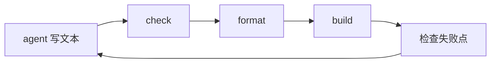
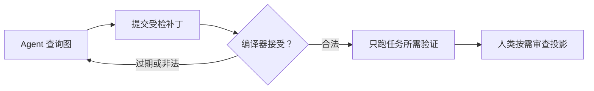

## 核心判断

zerolang 的赌注不是「给 AI 发明一套好学的语法」，而是**文本不该再充当程序的数据库**。在这门语言里，程序的本体是一张编译器管理的语义图（`zero.graph`），里面直接存着声明、类型、调用边、块、导入和能力事实。Agent 的日常操作是 `zero query` 查图、`zero patch` 提交受检补丁；`.0` 文本文件降级为给人看的投影，审查用，偶尔手改用，不再是编译入口。

传统 Agent 写代码的循环是「写文本 → check → format → build → 事后看报错」，每一步都在猜测文本的含义；zerolang 把主编辑操作挪进了编译器的语义模型，非法编辑在写入存储之前就被拒绝。这是与「在文本之上叠 LSP 和编辑器协议」完全相反的一条路线。

项目本体很小也很新：2026-05-15 建仓，次日发 v0.1.0，编译器用 C 写成，Apache-2.0 协议，挂在 Vercel Labs 名下。提交记录几乎全部来自 Chris Tate（@ctate，Vercel 工程师，1,187 次提交，另一位贡献者仅 1 次）。截至 2026-09-29 有 5,373 stars，最新 release 是 v0.3.4（2026-06-13），main 分支的修复持续到 2026-09-16。

| 基础信息 | |
|---|---|
| 仓库 | [vercel-labs/zerolang](https://github.com/vercel-labs/zerolang) |
| Stars | 5,373（2026-09-29） |
| 主要语言 | C（编译器本体） |
| 许可证 | Apache-2.0 |
| 官网与文档 | [zerolang.ai](https://zerolang.ai) |
| 最新版本 | v0.3.4（2026-06-13 发布） |
| 归属 | Vercel Labs 实验项目 |
| 状态 | 实验性，明确不适合生产环境 |

## 两个月换了三代工作流

zerolang 出生只有四个多月，工作流模型已经换了三代。读它的任何资料前先对版本，否则看到的很可能是过时口径：

| 版本 | 时间 | 工作流模型 |
|---|---|---|
| v0.1.x | 2026-05-16 起 | 文本 + 结构化检查：`zero check --json`、`zero fix --plan --json` 暴露诊断与修复计划；投影语法是前缀式（`pub fn main Void world World !`） |
| v0.2.0 | 2026-05-28 | `.0` 文本成为原生源面，ProgramGraph 从检查输出升级为可编辑工件，图补丁可以重写 `.0` 文件 |
| v0.3.0 | 2026-06-08 | **图优先成为标准工作流**：`zero.graph` 存储是编译器输入，`.0` 文件是投影，直接投喂源码文本会在编译器边界被拒绝；新增实验性 LLVM 后端 |
| v0.3.4 | 2026-06-13 | 当前最新 release；main 分支修复持续到 2026-09-16 |

语言表面也跟着换了。v0.1.x 时代的 README 里 Hello World 长这样：

```zero
fn answer i32
  ret + 40 2

pub fn main Void world World !
  if == answer() 42
    check world.out.write "math works\n"
```

到 v0.3，同一个程序已经是主流样貌：

```zero
pub fn main(world: World) -> Void raises {
    check world.out.write("hello from zero\n")
}
```

README 对此毫不遮掩：1.0 之前，项目偏好「单一现行语法与单一格式风格」，明确不为旧语法留兼容层。换句话说，本文接下来描述的一切——语法、命令、文件布局——都只是 v0.3.x 时点的快照。语言表面小，正是它敢这样连换三代的资本；代价是现在不存在任何语法层面的稳定承诺。

## 为什么文本对 Agent 是糟糕的编辑接口

传统循环里，Agent 的每一步都在和「文本可能是什么意思」搏斗：



官方文档把文本编辑的失败模式列得很具体：改错重名或近名的函数；弄丢一个 import 或闭合括号；写出「看起来合理但这个编译器不收」的语法；format 之后 span 变了，补丁打偏；拿着过期的文件内容继续编辑；源文件改了，真正的编译输入（图存储）没同步。

这些问题的共同根源是：**编辑操作的介质（文本）和程序的真实含义（语义）之间隔着一层推断**。人类程序员靠经验补上这层推断，Agent 靠额外的工具调用轮次补上——每轮都可能错。zerolang 的做法是直接拆掉这层间隔：



一次受检补丁把四件事合成一个编译器中介的步骤：编辑意图、过期状态保护、形状校验、格式化的投影输出。循环从「五步猜」缩成「两步证」。

## 核心机制

### 语义图是程序数据库

图存储里直接放声明、类型、调用、块、导入、能力与 source-map 事实。Agent 拿到的句柄是显式的：符号、节点 ID、图哈希、类型、副作用、所有权事实、能力、导入边、调用边、目标平台事实。

这意味着编辑可以指向语义结构，而不是行区间——「改这个 write 调用的字面量参数」「替换这个块的函数体」。补丁自带护栏：图哈希期望、节点哈希期望、字段期望、类型化操作名、dry-run 与 check-only 模式。哈希过期、字段值意外、形状非法、类型错误，都会在存储被写入**之前**失败。官方给这个契约的总结是：提交受检的语义编辑，而不是心怀希望的文本 diff。

### `.0` 投影：给人类的审查面

分工被写得非常直白：Agent 默认通过 `zero query` 和 `zero patch` 写图；人通过投影审查；人想手改投影是保留的逃生舱，改完用 `zero import` 重建图。投影不是二等公民，但也不是 Agent 的工作面。

图和投影之间用显式命令同步，靠内容哈希判定哪边更新，不依赖文件时间戳：

- `zero export`：把当前图导出为 `.0` 审查文本；
- `zero import`：人手改投影后，从文本重建图；
- `zero verify-projection`：只读的漂移检查，适合放进 CI 做投影漂移门禁；
- `zero status`：报告投影是干净、缺失、过期、冲突还是不可用。

冲突处理有明确规则。源投影被手改后，消费存储的命令（`check`/`build`/`run`/`test`/`query`/`view`/`diff`）会先从改过的源刷新存储并在 stderr 报告；图是较新一方时，这些命令继续用图并在 stderr 说明；**两边都被独立改过**则直接报 `RGP006` 诊断，给出 `zero import` 和 `zero export` 两个修复选项，不擅自选边。设置 `ZERO_STALE=fail` 可以把自动刷新改成 `RGP008` 硬失败。

这套规则防的是一种很具体的灾难：Agent 改了文本，看到 `zero check` 通过，然后跑起来的二进制是从另一份代码构建的。

### 诊断是修复契约，不是报错文案

zerolang 的诊断同时写给人和 Agent 看。一个真实的失败样例（引自官方文档）：

```text
error[NAM003]: Unknown identifier
  unknown identifier 'message'
  examples/hello.0:2:27

  2 |     check world.out.write(message)
    |                           ^^^^^^^
  rule: Names must be declared before use in the current lexical scope.
  expected: local binding, parameter, function, builtin value
  actual: no visible symbol named 'message'
  fix: Introduce a local binding before this use (local-edit)
  explain: zero explain NAM003
```

稳定字段（code、span、expected/actual、fix 标识）之外，每个诊断码可以用 `zero explain NAM003` 展开成修复指引。有个细节值得注意：诊断里的路径可能指向 `.0` 投影——那只是 source map 指向了可读文本，官方文档专门提醒，图优先包里正确的修复动作仍然是图补丁，不是去改那个文件。

### 显式能力，无隐藏运行时

语言层面没有环境性的全局访问：程序从 `main(world: World)` 显式接收能力，文件、进程、时间、随机数、网络、HTTP 这类托管 API 都要求目标能力声明。官方文档列了一份「不做隐藏」清单：没有隐藏方法注册表、没有 vtable、没有反射、没有环境性堆分配、没有进程级清理列表。标准库的缓冲类辅助函数写调用方持有的存储，而不是默默分配。

这些事实都能查：`zero inspect --json` 和 `zero size --json` 会列出程序实际保留了哪些辅助函数与能力，字段包括 `usedStdlibHelpers`、`effects`、`allocationBehavior`、`targetSupport`、`ownershipNotes` 等。对 Agent 来说，「这个程序依赖什么」是一次查询，不是一次源码考古。

### 图支撑的标准库

标准库本身也是图优先的：编译器直接消费二进制 `std/*.graph` 存储，旁边的 `std/*.0` 只是人类可读投影。文档站为 35 个 `std.*` 模块各留一页，大致分三组：

- **核心数据与内存**：`std.mem`（span、拷贝填充、分配器、定容向量）、`std.collections`、`std.search`、`std.sort`、`std.unicode`、`std.regex`、`std.inet` 等；
- **程序面**：`std.args`、`std.cli`、`std.env`、`std.io`、`std.fs`、`std.json`、`std.toml`、`std.csv`、`std.testing` 等；
- **运行时与 Web**：`std.time`、`std.rand`、`std.proc`、`std.crypto`、`std.net`、`std.http`（v0.3.0 起带路由、JSON 响应验证、CORS、bearer token、cookie/session 助手）。

Agent 学习标准库的方式也版本化了——编译器二进制自带版本匹配的技能文本：

```sh
npx skills add vercel-labs/zerolang   # Agent 引导技能
zero skills get agent                 # 图工作流
zero skills get graph                 # 图模型
zero skills get language              # 语言规则
zero skills get stdlib                # 标准库助手清单
```

这解决的是 Agent 工具链的一个真实痛点：网上搜到的教程永远可能过时，而 `zero skills get` 给出的规则与手上这个二进制严格同版。

## 一次真实任务流：改一行问候语

把机制串起来看一次真实编辑。任务：把输出从 `hello from zero` 改成 `hello graph`。

```sh
$ zero query --fn main
main
  check world.out.write "hello from zero\n"
  graphHash graph:a7f7e6899a73f3b4

$ zero patch --expect-graph-hash graph:a7f7e6899a73f3b4 \
    --op 'set node="#expr_653eeb6e" field="value" expect="hello from zero\n" value="hello graph\n"'
program graph patch ok

$ zero run
hello graph
```

三步各有含义。第一步查询拿到函数的图哈希和目标节点 ID——这是语义层的「定位」，不依赖行号。第二步的补丁带了四重约束：图哈希必须匹配（若图已被别的编辑改动，补丁整体拒绝，防陈旧编辑）、节点指名道姓、字段期望值写死、新值显式给出。第三步编译器接受补丁后直接运行。

对比文本循环里的同样任务：定位字符串、算行区间、改文本、祈祷 format 没挪动 span、check、build、跑。图循环把「改一个字面量」压缩成一次编译器裁决的原子操作。文档里的另一个案例更直白——`zero patch --op 'addMain'` 从零创建 main 函数，连 Hello World 都不用先写文本。

## 快速上手

安装编译器（官方一键脚本）：

```sh
curl -fsSL https://zerolang.ai/install.sh | bash
export PATH="$HOME/.zero/bin:$PATH"
zero --version
```

一个最小项目是三个文件：`zero.toml`（清单）、`zero.graph`（编译器输入）、`src/main.0`（投影）。从零到 Hello World：

```sh
zero init
zero patch --op 'addMain' --op 'addCheckWrite fn="main" text="hello from zero\n"'
zero run        # 输出：hello from zero
```

日常循环就是五条命令：

```sh
zero query
zero patch --op help
zero patch --op 'addMain'
zero check
zero test
zero run -- <args>
```

需要产物时构建可执行文件：

```sh
zero build --emit exe --target linux-musl-x64 --out .zero/out/app
```

公开的本地目标有八个：`darwin-arm64`、`darwin-x64`、`linux-arm64`、`linux-musl-arm64`、`linux-musl-x64`、`linux-x64`、`win32-arm64.exe`、`win32-x64.exe`。交叉编译前先用 `zero targets --json` 确认目标就绪状态，不要让 Agent 猜。

## 语言表面速览

投影语法读起来接近主流 braces 语言，但每个结构都对应图节点。函数带显式类型：

```zero
fn add(x: i32, y: i32) -> i32 {
    return x + y
}
```

可失败函数用 `raises` 标注错误集，`check` 沿显式控制流传播失败——没有隐藏异常：

```zero
fn requirePositive(value: i32) -> i32 raises [Invalid] {
    if value > 0 {
        return value
    }
    raise Invalid
}
```

条件必须是 `Bool`；`while` 和 `match` 都下落为显式的图控制流节点，所以 Agent 可以按块补丁——替换整个函数体，或者只替换 `#block_then_1234` 那个分支的块体。类型面里有 `Maybe<T>`、`Span<u8>`、`MutSpan<u8>` 这类显式所有权形状，标准库签名如 `fn handle(request: Span<u8>, response: MutSpan<u8>) -> Maybe<Span<u8>>` 一眼可见缓冲归谁、会不会失败。

## 性能数据怎么读

README 给的运行时目标有六条：省 token 的检查、低内存、快启动快构建、低运行延迟、显式能力、小而无依赖的产物。这些是目标清单，不是实测数字。

基准测试确实内置了（`pnpm run bench`），17 个案例覆盖 hello、parser、codec、arena、fallibility、fs-resource 等，指标包括 `buildMs`、`runMs`、`artifactBytes`、`peakRssBytes`。但官方文档对它的定位说得很克制：**回归信号，不是营销数字**——用途是对比同一条编译器在改动前后的图输入、产物体积、构建时间与内存变化，跑在本地，跨目标跑不了的案例报 `skipped` 而不是硬凑。

所以读到任何「zerolang 比 X 快/省 Y 倍」的说法（包括第三方转述）都应存疑：项目自己没有发布过与其他语言或工具链的对比数字。它目前能证的只有「比上一版的自己如何」。

## 风险与适用边界

当前 README 的安全警告原文：*"Zerolang is experimental. Expect breaking changes, rough edges, and security issues. Run it in isolated workspaces, not against production systems or sensitive data."* 翻译成决策语言：把它当成一次性的实验环境工具，隔离运行，别碰任何需要信任边界的东西。

具体的结构性风险有三条。**单人驱动**：1,188 次提交里 1,187 次来自同一位作者，bus factor 是 1，项目的存续取决于一位 Vercel 工程师的业余投入。**语法零承诺**：两个多月换三代工作流的历史摆在上面，1.0 之前任何命令、语法、文件布局都可能再换——你的 Agent 技能缓存今天写的，下个版本可能就失效。**生态为零**：没有包管理生态、没有生产用户案例，遇到问题基本只能读源码和提 issue。

它适合谁：

- 想研究「Agent 该怎么和编译器协作」的语言设计者——图补丁、投影同步、诊断契约这三套机制都是可运行的原型，不是论文；
- 做 coding agent 工具链的工程师——`zero skills get` 的版本匹配技能分发、结构化诊断、`--expect-graph-hash` 这类设计可以直接借鉴到自己的工具里，不必采用这门语言；
- 想提前理解「图原生」思路的人——如果这个方向成立，zerolang 是目前最完整的公开实现。

需要稳定语法、生产部署、长期维护的项目，等 1.0，或者干脆等别人先趟。

## 结语

zerolang 最终回答的是一个具体问题：**如果程序数据库不是文本，Agent 的编辑循环会变成什么样？**它的答案是一套完整的机制——语义图当本体、受检补丁当编辑、投影当审查面、内容哈希当同步裁判、诊断当修复契约。每一条都做成了可运行的命令，而不停留在宣言。

这门语言本身能不能活下来，不好说。但它演示的那条边界——编辑操作与编译器语义模型之间的距离，决定了 Agent 编码的可靠性上限——会被之后所有认真做 agent-native 工具链的人反复引用。想在隔离环境里试试的话，装好编译器和引导技能，对 Agent 说一句 `build hello world for zerolang`，然后看它 `zero init`、`zero patch`、`zero run`——那就是这套理念的全部日常。

---

## 数据口径说明

- 仓库数据（stars、贡献者、提交记录）经 GitHub API 核实于 2026-09-29；版本与工作流口径以 v0.3.4（2026-06-13）及 main 分支（最后提交 2026-09-16）为准。
- v0.1.x 时代的语法示例、命令与安全警告引文，按文章发布时点（2026-05-22）的 README 快照核对。
- 文中全部命令、命令输出与诊断样例引自官方 README 及 `docs/articles/`（getting-started、language-reference、concepts、standard-library、diagnostics、benchmarks），未做改写。
- 项目未发布与其他语言或工具链的性能对比数据，本文不引用任何第三方跑分。
