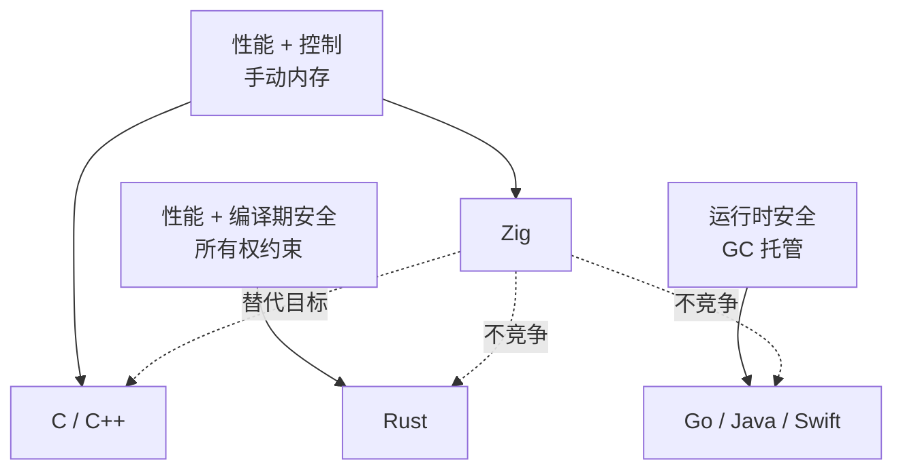
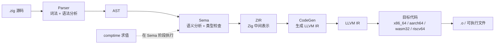

# Zig：把 C 重写一遍，而不是把 Rust 再造一遍

把 Zig 放在 Rust 的对立面去比较，是大多数技术选型文章的第一处误判。Zig 真正要对标的是 C——1972 年定下的那套"程序员信任机器、机器信任程序员"的契约。Rust 选择在编译期用借用检查器强制内存安全，Zig 选择保留手动内存管理，但把所有"隐式"的东西——分配、控制流、类型转换——全部搬到台面上让你看见。

这不是退步——系统编程里大量场景本来就在手动管理内存，问题不在"是否手动"——系统编程本来就手动——而在"手动时能不能看见所有分配和释放路径"。Zig 的设计围绕这个问题展开：显式分配器作为一等公民、`comptime` 把元编程收进类型系统、`defer`/`errdefer` 让资源释放路径可见、错误作为类型而不是异常。

> 仓库迁移提示：Zig 官方仓库已从 GitHub 迁移到 Codeberg（https://codeberg.org/ziglang/zig），GitHub 上的镜像不再同步更新。引用源码或提交 issue 时以 Codeberg 为准。

## 学习目标

读完本文后，你应当能够：

- 说清 Zig、C、Rust 在系统语言谱系里各自占据哪个象限，并解释为什么把 Zig 当作"Rust 竞争者"是误判。
- 跟着 Parser、Sema、CodeGen 三段描述一次 Zig 编译的流水线，并指出 `comptime` 求值发生在哪个阶段。
- 区分 `comptime` 与 C++ `constexpr`、Rust `const fn` 的边界，给出 `constexpr` 做不到但 `comptime` 能做的例子。
- 读函数签名判断它是否会分配内存、用哪个 allocator，并说明这种显式性如何改变代码审查和测试方式。
- 根据项目场景（系统工具、嵌入式、Web 服务、需要 1.0 稳定性）判断是否该评估 Zig，还是继续用 C 或 Rust。

阅读建议：刚接触系统编程的读者，先读"设计哲学"和"内存管理"两节建立直觉，再回头看编译流水线；已经熟悉 C 或 Rust 的读者，可以直接跳到"与 C 和 Rust 的工程取舍"对照选型维度，再按需回看具体机制。

> 导航：[下一节：本文结构](#本文结构) →

## 本文结构

- **学习目标**：读完本文应掌握的五项能力
- **Zig 在系统语言谱系里的位置**：拆边界，避免把 Zig 塞进"Rust 竞争者"的筐
- **设计哲学：显式优于隐式**：分配、控制流、类型转换三条硬约束
- **一次编译：从源码到目标文件**：跟着编译流水线理解 ZIR 和 `comptime` 的位置
- **comptime：把元编程收进类型系统**：为什么 `comptime` 不是 `constexpr`
- **内存管理：手动，但每一步都可见**：allocator、`defer`、`errdefer` 的工程含义
- **错误处理：错误是类型，不是异常**：error union 与 `try`/`catch`
- **作为 C 编译器的 Zig**：`zig cc` 与交叉编译
- **交叉编译与目标平台**：`-target` 参数与平台覆盖
- **构建系统与包管理**：`build.zig` 与 `build.zig.zon`
- **与 C 和 Rust 的工程取舍**：具体维度对比
- **适用边界**：什么时候该评估 Zig，什么时候不该
- **常见问题**：内存安全、`comptime` 开销、`async`/`await`、C++ 互操作、编译错误排查
- **自测：检验你的理解**：五道针对正文要点的练习
- **学习路径与资源**：从安装到读编译器源码的顺序
- **风险与现状**：1.0 之前的现实约束

## Zig 在系统语言谱系里的位置

先看清 Zig 处在哪条赛道上。这张图把"性能/控制"轴和"安全/自动化"轴拆开，避免把所有非 Rust 语言都塞进"竞争对手"这个筐。



Zig 和 C 落在同一个象限：手动内存、无运行时、可直接操作硬件。差别在于 Zig 用现代语法、显式错误类型和 `comptime` 把 C 里那些靠约定和宏维持的东西变成语言特性。Rust 则在另一个象限——编译器强制约束，Zig 让程序员自己约束。Zig 的学习曲线更平缓，但不会在编译期拦下你写出的内存错误，这是路线选择带来的取舍。

- Zig 目前未发布 1.0，标准库和编译器 API 仍在变动，跨版本升级经常需要改代码。
- Zig 自带 LLVM，可以作为 C/C++ 的交叉编译工具链使用（`zig cc`、`zig c++`）。
- Zig 没有垃圾回收、没有异常、没有隐式分配、没有隐藏的控制流跳转。
- 官方仓库已迁移到 Codeberg，GitHub 上的镜像不再同步。

## 设计哲学：显式优于隐式

Zig 的语言手册里反复出现一句话："显式优于隐式"（explicit is better than implicit）。这句话落到具体语法里是一组硬约束，不是停留在风格指南上。

最直接的体现是分配。Zig 里所有堆分配都必须通过显式传入的 allocator 参数完成。标准库容器（`ArrayList`、`HashMap`）的第一个参数永远是 allocator，函数签名里要不要分配、用哪个 allocator 分配，全部写在类型里。读一个函数签名就能知道它会不会分配内存、分配到哪里——C 程序员靠注释和约定维持的纪律，Zig 用类型系统强制。

控制流同样不留暗门。Zig 没有 `try`/`catch` 异常机制，错误是值，必须显式处理或显式向上传递（`try` 操作符）。`defer` 和 `errdefer` 是仅有的"函数结束时自动执行"的机制，且都写在显式位置。没有 C++ 的析构函数隐式调用，没有 Rust 的 `Drop` trait 自动触发。

类型转换和运算符也遵循同一原则。`if (a)` 在 Zig 里写不出来——条件必须是 `bool`，整数到布尔没有隐式转换，`0` 不是 `false`，非零整数也不是 `true`。指针之间不隐式转换，整数和指针之间要用 `@ptrCast`、`@intFromPtr` 这类内置函数显式标注。运算符不可重载：`+` 就是加法，`==` 就是相等，想要自定义行为就写函数调用。这牺牲了部分表达力（比如矩阵运算的语法糖），但换来了"看到运算符就知道在做什么"的可读性。

显式分配、显式错误处理、不可重载运算符——Zig 代码因此比 C++ 或 Rust 更"长"，但每一行在做什么都是显式的。系统编程里，这种显式性本身就是安全特性的一部分——代码审查、静态分析和性能调优都更直接，因为不需要在脑子里模拟隐式行为。

## 一次编译：从源码到目标文件

跟着一次编译走一遍，比拆开看每个机制更清楚。这条流水线是 Zig 编译器实际的工作流程，能解释为什么 Zig 需要 ZIR 这一层中间表示，以及 `comptime` 在哪个阶段生效。



**Parser 阶段**只做词法和语法分析，把源码变成 AST。这一阶段不做任何类型检查，也不求值。Zig 的语法刻意保持简单——没有宏、没有复杂的预处理器，Parser 的实现相对直接。

**Sema 阶段**是 Zig 编译器的核心。这一步做类型检查、语义分析，并把 AST 翻译成 ZIR（Zig Intermediate Representation）。`comptime` 求值就发生在这里——所有标记为 `comptime` 的表达式、所有可以用编译期信息推导的类型参数，都在 Sema 阶段求值并替换成具体值。`comptime` 因此不是"宏展开"，而是"语言级元编程"：它发生在类型系统内部，求值结果直接参与类型推导。

**CodeGen 阶段**把 ZIR 翻译成 LLVM IR。Zig 没有自己实现后端优化，而是把优化交给 LLVM（也支持自带的 x86_64 后端用于快速 debug 构建）。Zig 能轻松支持几十个目标平台，靠的就是复用 LLVM 的目标代码生成能力。

**目标代码生成**由 LLVM 完成，输出 `.o` 文件或可执行文件。Zig 自带 LLVM、Clang 和 MinGW 的头文件与运行时，`zig cc` 因此可以直接作为 C/C++ 交叉编译器使用——它实际上是一个打包好的 LLVM 工具链。

ZIR 这一层解决的是把 `comptime` 求值和类型推导放在 LLVM 之前——LLVM 的类型系统不够表达 Zig 的语义；Zig 能做交叉编译，是因为它把 LLVM 和目标平台的运行时全部打包进发行版，不需要用户额外配置 sysroot。

## comptime：把元编程收进类型系统

`comptime` 是 Zig 最容易被低估的特性。表面上看它只是"编译期求值"，但它和 C++ 的 `constexpr`、Rust 的 `const fn` 有关键区别：在 Zig 里，`comptime` 属于类型系统的一部分，不是修饰符。任何在编译期能求值的表达式自动成为 `comptime`，普通函数和 `comptime` 函数用同一套语法写，不需要两套心智模型。

看一个真实的例子——泛型容器。在 C 里写一个"任意类型的动态数组"要么用宏，要么用 `void*` 加类型擦除，两种方案都牺牲类型安全。在 Zig 里：

```zig
const std = @import("std");

fn Matrix(comptime T: type, comptime rows: usize, comptime cols: usize) type {
    return struct {
        data: [rows][cols]T,

        const Self = @This();

        fn get(self: *const Self, r: usize, c: usize) T {
            return self.data[r][c];
        }

        fn set(self: *Self, r: usize, c: usize, v: T) void {
            self.data[r][c] = v;
        }
    };
}

pub fn main() void {
    const Mat4f = Matrix(f32, 4, 4);
    var m: Mat4f = .{ .data = undefined };
    m.set(0, 0, 1.0);
    std.debug.print("{d}\n", .{m.get(0, 0)});
}
```

`Matrix` 是一个返回 `type` 的函数，`comptime` 参数在编译期求值，生成的 `Mat4f` 是一个具体的、类型完全确定的 struct。整个过程没有宏展开，也没有运行时开销——`comptime T: type` 这个签名同时表达了"这是泛型参数"和"它在编译期求值"两件事。

`comptime` 的另一个工程价值是"编译期断言"。Zig 标准库里大量使用 `comptime` 在编译期检查不变量——比如容器大小是否是 2 的幂、枚举值是否唯一、结构体字段是否对齐。这些检查不产生运行时代码，但能在编译期拦下整类错误。C 程序员用 `_Static_assert` 和宏勉强能做到一部分，Zig 把它变成通用机制。

需要说明的边界：`comptime` 求值发生在 Sema 阶段，能调用的函数必须是"编译期可执行"的——不能调用外部 C 函数、不能做 I/O、不能访问运行时内存。标准库会标注哪些函数是 `comptime` 友好的，违反约束会得到编译错误而不是运行时错误。

## 内存管理：手动，但每一步都可见

Zig 没有垃圾回收，也没有借用检查器，内存管理是手动的。但和 C 相比，Zig 把"分配"这件事变成了类型系统的一部分——分配器是一个显式对象，分配操作通过 allocator 完成，容器的生命周期和 allocator 绑定。

Zig 标准库提供几种 allocator，对应不同的工程场景：

```zig
const std = @import("std");

pub fn main() !void {
    // 页分配器：直接向操作系统申请页，适合大块分配
    const page_alloc = std.heap.page_allocator;

    // Arena 分配器：一次性分配，整体释放，适合短生命周期场景
    var arena = std.heap.ArenaAllocator.init(page_alloc);
    defer arena.deinit();
    const arena_alloc = arena.allocator();

    // GPA：通用分配器，适合长期运行的服务
    var gpa = std.heap.GeneralPurposeAllocator(.{}){};
    defer _ = gpa.deinit();
    const gpa_alloc = gpa.allocator();

    // 使用 arena 分配的内存会在 arena.deinit() 时统一释放
    const buf = try arena_alloc.alloc(u8, 1024);
    std.debug.print("allocated {d} bytes\n", .{buf.len});
}
```

这里的关键是工程含义。`ArenaAllocator` 适合请求处理、命令行工具这种"做完就整体释放"的场景——大量小分配只调用一次 `deinit`，分配开销摊薄到几乎为零。`GeneralPurposeAllocator` 适合长期运行的服务，它在释放时会检测双重释放和内存泄漏，是 debug 阶段的安全网。`page_allocator` 是最底层的，直接对应操作系统的 `mmap`/`VirtualAlloc`。

显式 allocator 让内存策略成为函数签名的一部分。一个函数签名是 `fn process(data: []const u8, allocator: Allocator) !void`，读这个签名就知道：这个函数会分配内存，分配器由调用方决定。调用方可以根据场景传入 arena、GPA 或者一个 mock allocator 做测试。C 语言里这种信息靠注释维持，Zig 用类型强制。

`defer` 和 `errdefer` 是这套机制的配套。`defer` 在函数返回时无条件执行，`errdefer` 只在错误返回时执行。两者一起覆盖了 C 语言里 `goto cleanup` 的所有场景，但作用域更清晰：

```zig
fn readFile(path: []const u8, allocator: std.mem.Allocator) ![]u8 {
    const file = try std.fs.cwd().openFile(path, .{});
    defer file.close();  // 无论成功失败都关闭

    const stat = try file.stat();
    const buf = try allocator.alloc(u8, stat.size);
    errdefer allocator.free(buf);  // 只有后续步骤失败时才释放

    const n = try file.readAll(buf);
    if (n != stat.size) return error.ShortRead;
    return buf;  // 成功时 buf 的所有权转移给调用方
}
```

这段代码的释放路径完全显式：`file.close()` 一定执行，`allocator.free(buf)` 只在出错时执行，成功时所有权转移给调用方。没有 RAII、没有析构函数、没有 `Drop` trait，但每一步资源释放都写在它该出现的位置。

## 错误处理：错误是类型，不是异常

Zig 没有异常。错误是类型系统的一部分，用错误联合（error union）表达。`!T` 表示"返回 T 或者一个错误"，`try` 操作符解包成功值或向上传递错误，`catch` 操作符处理错误。

```zig
const std = @import("std");

const ParseError = error{
    Empty,
    InvalidChar,
    Overflow,
};

fn parseHex(s: []const u8) ParseError!u32 {
    if (s.len == 0) return error.Empty;
    var result: u32 = 0;
    for (s) |c| {
        const digit: u32 = switch (c) {
            '0'...'9' => c - '0',
            'a'...'f' => c - 'a' + 10,
            'A'...'F' => c - 'A' + 10,
            else => return error.InvalidChar,
        };
        if (result > (std.math.maxInt(u32) - digit) / 16) return error.Overflow;
        result = result * 16 + digit;
    }
    return result;
}

pub fn main() !void {
    const stdout = std.io.getStdOut().writer();
    const value = parseHex("DEADBEEF") catch |err| {
        try stdout.print("parse failed: {}\n", .{err});
        return;
    };
    try stdout.print("result: {d}\n", .{value});
}
```

错误集（error set）是 Zig 的类型，编译器会检查你是否处理了所有可能的错误。`!T` 是 `anyerror!T` 的简写，表示任意错误集；显式声明 `ParseError!u32` 让调用方知道具体可能遇到哪些错误。这比 C 的 `errno` 严格，比 Java 的 checked exception 更轻量——错误就是值，没有栈展开，没有运行时开销。

Zig 不用异常，和它的目标场景有关。内核、嵌入式、实时系统里，异常机制的栈展开是不可接受的——它引入不可预测的控制流跳转，破坏实时性保证。把错误做成值类型，让调用方显式处理，是系统编程里更可控的方案。代价是代码里会有较多 `try` 和 `catch`，但这是显式性换来的可读性成本。

## 作为 C 编译器的 Zig

Zig 工具链自带 LLVM、Clang 和 MinGW 运行时，`zig cc` 和 `zig c++` 可以直接作为 C/C++ 编译器使用，而且开箱即用支持交叉编译。这一点经常被忽略，但在多平台构建场景里能省掉不少环境配置工作。

```bash
# 用 zig cc 编译 C 代码，目标为 Windows
zig cc -target x86_64-windows-gnu hello.c -o hello.exe

# 用 zig cc 交叉编译到 macOS arm64
zig cc -target aarch64-macos-gnu hello.c -o hello_mac

# 用 zig cc 交叉编译到 WebAssembly
zig cc -target wasm32-wasi hello.c -o hello.wasm
```

工程上的价值在于：你不再需要为每个目标平台配置独立的 sysroot、MinGW、cross toolchain。Zig 的发行版把所有平台的运行时和头文件打包在一起，`-target` 参数切换目标平台，剩下的交给工具链处理。对于需要交叉编译的 CI 流水线、嵌入式开发、多平台发布，这能省掉大量环境配置工作。

Zig 也能直接导入 C 头文件并调用 C 函数，通过 `@cImport`：

```zig
const c = @cImport({
    @cInclude("stdio.h");
});

pub fn main() void {
    _ = c.printf("hello from C: %d\n", 42);
}
```

这让 Zig 可以渐进式替换 C 代码——新模块用 Zig 写，老模块保持 C，两者通过 `@cImport` 互操作。Zig 作为"C 替代者"的路线在这里具体体现：不需要一次性重写整个代码库，新模块可以逐步用 Zig 写，老模块继续维护，迁移节奏由团队自己控制。

## 交叉编译与目标平台

Zig 内置的交叉编译支持覆盖了主流平台，下表列出官方支持的目标三元组中的常见组合：

| 平台 | 架构 |
|------|------|
| Linux | x86_64, aarch64, riscv64, arm, thumb |
| macOS | x86_64, aarch64 |
| Windows | x86_64, aarch64 |
| FreeBSD | x86_64 |
| NetBSD | x86_64 |
| WebAssembly | wasm32 |
| SPIR-V | spirv32, spirv64 |

交叉编译的命令统一通过 `-target` 参数指定：

```bash
# Linux 到 Windows
zig build -target x86_64-windows-gnu

# Linux 到 macOS arm64
zig build -target aarch64-macos-gnu

# 到 WebAssembly
zig build -target wasm32-wasi

# 指定 CPU 基线（避免使用目标平台不支持的指令集）
zig build -target x86_64-native -Dcpu=baseline
```

需要留意的边界：交叉编译到某些平台需要目标平台的 libc，Zig 自带了 musl 和 MinGW，但 glibc 版本可能和目标系统不完全匹配；SPIR-V 目标目前还在实验阶段，API 可能变动。

## 构建系统与包管理

Zig 自带构建系统，通过 `build.zig` 文件描述构建逻辑。这套系统用 Zig 程序实现，意味着构建逻辑可以用完整的 Zig 语言表达——条件判断、循环、函数调用都在语言层面，不需要学一套单独的 DSL。

```zig
const std = @import("std");

pub fn build(b: *std.Build) void {
    const target = b.standardTargetOptions(.{});
    const optimize = b.standardOptimizeOption(.{});

    const exe = b.addExecutable(.{
        .name = "myprogram",
        .root_source_file = b.path("src/main.zig"),
        .target = target,
        .optimize = optimize,
    });

    b.installArtifact(exe);

    const run_cmd = b.addRunArtifact(exe);
    run_cmd.step.dependOn(b.getInstallStep());

    const run_step = b.step("run", "Run the program");
    run_step.dependOn(&run_cmd.step);
}
```

包依赖通过 `build.zig.zon` 声明，这是 Zig 的包管理清单。`.zon` 是 Zig 的数据格式（类似 JSON 但支持注释和原始字符串）：

```zig
.{
    .name = "myproject",
    .version = "0.1.0",
    .dependencies = .{
        .zmath = .{
            .url = "https://github.com/michal-z/zig-zmath/archive/refs/tags/v0.1.0.tar.gz",
            .hash = "1220abc123...",
        },
    },
}
```

`hash` 字段是包内容的完整性校验值，由 `zig fetch --save <url>` 自动生成并写入。手动填写或留空会导致依赖校验失败，实际项目里不要直接复制上面的示意值。

依赖在 `build.zig` 里通过 `b.dependency` 引入，使用时 `@import` 对应的包名。Zig 的包管理目前还在演进中，包注册中心（https://pkg.zigtools.org/）已经上线，但生态规模和 Rust 的 crates.io、Go 的 proxy 相比还有差距。

常用构建命令：

```bash
# Debug 构建
zig build

# Release（带优化）
zig build -Doptimize=ReleaseSafe
zig build -Doptimize=ReleaseFast
zig build -Doptimize=ReleaseSmall

# 运行
zig build run

# 测试
zig build test

# 安装到指定前缀
zig build install --prefix ~/.local
```

`ReleaseSafe` 启用优化但保留运行时安全检查（整数溢出、越界访问）；`ReleaseFast` 关闭安全检查追求最大性能；`ReleaseSmall` 优化二进制体积。这三个选项对应不同的工程取舍：`ReleaseSafe` 适合需要兼顾性能和可调试性的服务端，`ReleaseFast` 适合性能敏感且已充分测试的发布构建，`ReleaseSmall` 适合嵌入式或带宽受限的部署场景。

## 与 C 和 Rust 的工程取舍

选型时需要看清 Zig 和 C、Rust 在具体维度上的差别，光停留在"哪个更好"的层面给不出可执行的结论。

**与 C 相比**。Zig 保留了 C 的几项关键能力（手动内存、无运行时、可直接操作硬件），但补上了 C 缺失的几样东西：显式错误类型、`comptime` 元编程、命名空间和模块系统、内置测试、跨平台构建系统。代价是 Zig 还没到 1.0，生态和 C 几十年的积累不在一个量级。如果项目要长期维护、需要大量第三方库、对稳定性要求极高，C 仍然是更稳妥的选择；如果是新项目、愿意承担语言演进的风险、看重代码可读性和工程化能力，Zig 值得评估。

**与 Rust 相比**。Rust 用借用检查器在编译期强制内存安全，Zig 把这个责任留给程序员。Rust 在编译期拦下整类内存错误（use-after-free、data race），Zig 不会。Rust 的代价是学习曲线陡峭、借用检查有时会和设计意图冲突、`unsafe` 边界需要人工保证。Zig 的代价是内存安全靠纪律和测试维持，没有编译器兜底。如果项目对内存安全有硬性要求（浏览器引擎、加密库、处理不可信输入的服务），Rust 是更严谨的选择；如果项目本来就在手动管理内存、团队对 C 风格编程熟悉、希望降低迁移成本，Zig 的曲线更平缓。

**与 Go 相比**。Go 有 GC、有运行时、有 goroutine，定位是服务端编程。Zig 没有这些，定位是系统编程。两者不在同一赛道，硬放在一起比较通常说明选型方向还没想清楚。

## 适用边界：什么时候该评估 Zig，什么时候不该

下面这些场景是评估 Zig 时的具体判断依据：

**适合评估 Zig 的场景**：

- 新写的系统级工具（编译器、构建工具、CLI 工具），希望比 C 更工程化但不想要 Rust 的复杂度。
- 需要交叉编译到多平台的 C/C++ 项目，可以把 Zig 当工具链用（`zig cc`）而不改业务代码。
- 嵌入式开发，目标平台资源受限，不能接受 GC 和运行时开销。
- 游戏引擎、渲染管线等对内存布局和分配时机有精细控制的场景。
- 渐进式重写 C 代码库，新模块用 Zig，老模块保持 C。

**不适合评估 Zig 的场景**：

- 需要 1.0 稳定性保证的生产系统。Zig 当前版本（0.13/0.14 阶段）API 仍在变动，跨版本升级有成本。
- 依赖大量第三方库的项目。Zig 生态还在早期，很多领域没有成熟库。
- 团队对内存安全有硬性要求且无法靠纪律保证。这种场景 Rust 的编译期检查更可靠。
- Web 服务端、CRUD 应用。这些场景 Go、Java、Python 的生态和开发效率优势更大。
- 需要长期稳定 ABI 的场景。Zig 的 ABI 还在演进，不适合作为长期稳定的二进制接口。

## 常见问题

**Zig 没有 GC 也没有借用检查器，内存安全怎么保证？**

靠四道防线：显式 allocator 让分配来源可见、`GeneralPurposeAllocator` 在 debug 构建时检测双重释放和泄漏、`defer`/`errdefer` 让释放路径可见、测试和代码审查。这套机制靠工程纪律维持，没有编译器强制。和 C 相比，Zig 把"分配"和"释放"都搬到类型系统里，让错误更容易被审查发现；和 Rust 相比，Zig 不会在编译期拦下内存错误，需要靠测试覆盖。学习曲线更平缓的代价，就是这个缺口要靠纪律和测试补上。

**`comptime` 求值有运行时开销吗？**

没有。`comptime` 表达式在 Sema 阶段求值，结果直接编译进最终代码。一个 `comptime` 计算的斐波那契数列在运行时就是一段预先算好的常量数据，和手写没有区别。代价是编译时间变长——复杂的 `comptime` 计算会拖慢编译，标准库里 `comptime` 的使用因此都有节制。

**Zig 的 `async`/`await` 现在能用吗？**

需要看版本。`async`/`await` 在 0.10 到 0.12 期间经历过较大调整，0.12 之后被移除并计划基于新的执行模型重新设计。依赖异步 I/O 的项目要先确认目标 Zig 版本的支持情况，不要假设 API 稳定。当前版本里做并发主要靠 `std.Thread`，异步 I/O 的官方方案还在演进。

**Zig 能和 C++ 互操作吗？**

可以，但不如和 C 那么直接。`@cImport` 只能导入 C 头文件，C++ 的类、模板、命名空间需要先写一层 C 风格的 wrapper（`extern "C"`）才能被 Zig 调用。反向（C++ 调用 Zig）也类似——Zig 导出的函数用 `export fn` 标注，C++ 侧当作普通 C 函数调用。复杂项目里这层 wrapper 的维护成本需要评估。

**`zig cc` 能完全替代 gcc/clang 吗？**

在交叉编译和 C/C++ 标准支持上基本可以，但有几个边界：`zig cc` 不支持 gcc 的部分扩展（如嵌套函数）、对 OpenMP 的支持有限、某些依赖 gcc 特定行为的构建脚本可能需要调整。把 `zig cc` 当作交叉编译工具链用是最稳妥的定位，完全替代 gcc/clang 作为日常开发编译器需要先验证依赖项。

**常见的编译错误怎么排查？**

几类高频错误和定位思路：

- `error: expected type 'X', found 'Y'`：类型不匹配。Zig 没有隐式转换，检查函数签名和实参类型，整数宽度（`u8` vs `u32`）和可选类型（`?T` vs `T`）是常见坑点。
- `error: unable to evaluate comptime expression`：`comptime` 求值失败。检查表达式是否依赖了运行时值、是否调用了不支持 `comptime` 的函数（如外部 C 函数、I/O）。
- `error: expected error set, found 'T'`：错误集声明和实际 `return error.Xxx` 不一致。把函数签名改成 `!T`（任意错误集）可以先让代码跑通，再补全具体错误集。
- `error: container 'X' has no member named 'Y'`：通常是导入路径或命名空间写错。`@import` 返回的是文件对应的 struct，访问其成员要用 `.` 而不是 `->`。
- 内存泄漏排查：在 debug 构建里用 `GeneralPurposeAllocator`，程序退出时 `gpa.deinit()` 会打印未释放的分配地址和大小，配合 `std.debug.print` 的地址输出可以定位到泄漏点。
- 交叉编译 libc 报错：`zig cc` 自带 musl 和 MinGW，但 glibc 版本可能和目标系统不匹配。用 `-target x86_64-linux-gnu.2.31` 这样的带版本号三元组可以指定 glibc 版本。

**生产环境里 Zig 程序崩溃了，怎么拿到可读的堆栈？**

Release 构建默认会剥离调试信息，直接看 core dump 只能看到地址。两个做法：构建时用 `-Doptimize=ReleaseSafe` 并保留调试信息（`-fno-strip`），这样崩溃时能打印符号化的堆栈；或者用 `zig build -Ddebug-extensions` 之类的方式保留 DWARF 信息，再用 `lldb` 或 `gdb` 解析。对应"构建系统与包管理"里 `ReleaseSafe` 的说明——它保留运行时安全检查，崩溃时会主动打印 panic 堆栈，比 `ReleaseFast` 更适合线上排查。线上长期跑的服务建议至少在灰度环境用 `ReleaseSafe`。

**Zig 程序性能不达预期，从哪里入手定位？**

先确认构建模式：Debug 构建没有优化，性能数字不能代表 Release。再用 `ReleaseFast` 跑一遍基线。定位热点用系统级 profiler（Linux 上 `perf`，macOS 上 `Instruments`），Zig 生成的 LLVM IR 带调试信息，profiler 能映射回源码行。常见瓶颈和 Zig 特性相关：`comptime` 计算过重会拖慢编译但不影响运行时；`ArenaAllocator` 用在长生命周期场景会放大内存占用；错误集过宽（用 `!T` 代替具体错误集）会让编译器难以优化。

**从 C 代码库迁移到 Zig，常见的坑有哪些？**

几类高频问题。C 的隐式转换在 Zig 里全部失效：`if (a)` 要改成 `if (a != 0)`，`void*` 泛型要改成 `comptime T: type` 的泛型函数。C 的 `errno` 模式要改成 error union，每个可能失败的调用都要 `try` 或 `catch`，迁移初期会让代码变长。C 的宏（`#define`）没有直接对应物，常量用 `const`，函数式宏用 `inline fn` 或 `comptime` 函数替代。C 的 `goto cleanup` 模式要改成 `defer`/`errdefer`，作用域语义不同，迁移时容易漏掉释放路径。建议从新模块开始用 Zig，老模块通过 `@cImport` 互操作，对应"作为 C 编译器的 Zig"里渐进式替换的策略。

**错误集该怎么设计？用 `!T` 还是显式声明错误集？**

短期原型阶段用 `!T`（任意错误集）可以让代码先跑通，但进入正式代码后建议显式声明错误集。原因有两条：显式错误集让函数签名成为文档，调用方知道会遇到哪些错误；编译器会在错误集不匹配时报错，比 `!T` 更早暴露问题。一个折中做法是模块级错误集——把一个模块里可能出现的错误合并成一个 `ModuleError`，函数签名用 `ModuleError!T`，既避免 `anyerror` 的宽泛，又不用每个函数都列一长串错误。

## 自测：检验你的理解

下面五道题对应正文的核心知识点，能答出来说明读懂了，答不出来建议回看对应章节。

1. **函数签名阅读**。给定 `fn process(data: []const u8, allocator: Allocator) !void`，调用方能从签名里读到哪四条信息？为什么这些信息在 C 里只能靠注释维持？
2. **`comptime` 边界**。`comptime` 和 C++ 的 `constexpr` 有什么关键区别？为什么说 `comptime` 不是宏展开？给一个 `constexpr` 做不到但 `comptime` 能做的例子。
3. **资源释放路径**。`defer` 和 `errdefer` 分别在什么时机执行？写一个需要两者配合的函数（提示：成功时转移所有权，失败时释放资源），并说明为什么单用 `defer` 会出错。
4. **错误处理选择**。为什么 Zig 选择把错误做成值类型而不是异常？这个选择在内核和实时系统里是优势，在什么场景下会变成劣势？
5. **`zig cc` 边界**。`zig cc` 和直接用 gcc/clang 相比，有哪三个边界需要注意？为什么把 `zig cc` 定位为"交叉编译工具链"比"日常开发编译器"更稳妥？

参考答案要点在正文对应章节里：第 1 题看"内存管理"的签名解读段落；第 2 题看"comptime"开头的对比和 Sema 求值说明；第 3 题看"内存管理"末尾的 `readFile` 示例；第 4 题看"错误处理"末尾的目标场景分析；第 5 题看"常见问题"里 `zig cc` 那一条。

## 学习路径与资源

评估 Zig 的切入顺序，从能跑起来的最小例子逐步深入：

1. **跑通安装和第一个程序**。从官方下载页（https://ziglang.org/download/）取对应平台的二进制，写一个 `hello.zig`，用 `zig build-exe hello.zig` 编译。这一步建立工具链直觉。
2. **过一遍 Ziglings**（https://ziglings.org/）。这是一套交互式练习，每个文件一个知识点，改错就能跑通。覆盖语法和标准库基础。
3. **读标准库源码**。Zig 标准库就是 Zig 写的，可读性高，是最好的进阶材料。从 `std/mem.zig`、`std/fs.zig` 开始，看 allocator 接口和文件 API 的设计。
4. **写一个真实的小项目**。比如一个简单的 HTTP 静态文件服务器、一个 JSON 处理 CLI、一个小的数据结构库。这一步会逼你处理错误、管理内存、用 `comptime`。
5. **读 Zig 编译器源码**（https://codeberg.org/ziglang/zig）。如果对语言实现感兴趣，编译器源码就是 Zig 大型项目范例，能看到 `comptime`、错误处理、构建系统的真实用法。

官方文档和社区入口：

| 资源 | 链接 |
|------|------|
| 官方仓库 | https://codeberg.org/ziglang/zig |
| 官方文档 | https://ziglang.org/documentation/ |
| 社区入口 | https://ziglang.org/community/ |
| Ziglings 练习 | https://ziglings.org/ |
| 学习资源汇总 | https://ziglang.org/learn/ |

## 风险与现状

评估 Zig 时，下面几项风险需要直接面对：

- **未到 1.0**。标准库 API、编译器内部接口、构建系统 API 都还在变动。跨版本升级经常需要改代码，生产使用要锁定版本并评估升级成本。
- **仓库迁移**。官方仓库已从 GitHub 迁移到 Codeberg，GitHub 上的镜像不再同步。引用源码、提交 issue、跟踪 roadmap 以 Codeberg 为准。
- **生态规模**。包管理、第三方库、工具链（调试器、profiler）的成熟度还不如 C/Rust/Go。复杂项目可能需要自己造轮子。
- **语言演进**。一些特性（如 `async`/`await`、错误集推导）在不同版本间有过较大调整，跟踪官方 RFC 和 changelog 是必要的。

Zig 的设计方向清晰，但"是否适合你的项目"取决于你能否接受这些成本——1.0 之前的 API 不稳定和生态规模限制这两项，会直接决定维护负担。

> 导航：← [上一节：学习路径与资源](#学习路径与资源) →

---

相关资源：

| 资源 | 链接 |
|------|------|
| Codeberg 仓库 | https://codeberg.org/ziglang/zig |
| 官方文档 | https://ziglang.org/documentation/ |
| Ziglings | https://ziglings.org/ |
| 社区入口 | https://ziglang.org/community/ |
