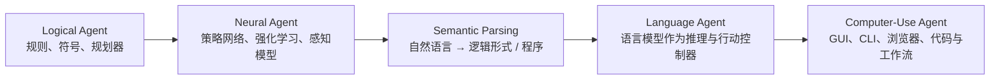

张小珺和苏煜的这期长访谈，难得的地方在于它没停在热词复述上，而是把 Agent 拉回工程语境里讨论。比起先问 Agent 像不像人，更有用的问题是：它能不能作为行动系统稳定运行。一个系统如果能感知环境、决定下一步、调用工具、读回结果、在出错时停住并把控制权交还给人，它才开始像 Agent；否则更像会说话的接口。

沿着这个坐标回看，Agent 史就不会只剩下 2023 年以后的那点热闹。苏煜把几条原本分散的技术线重新并到一起：逻辑代理把下一步写进规则，神经代理从数据里学下一步，语义解析把语言翻成可执行表示，Language Agent 则让语言直接参与计划、工具调用、记忆和协作。问题从“模型会不会回答”慢慢换成了“系统能不能在开放环境里连续做事”。

2026 之所以值得单独拎出来看，也不是因为 Agent 在这一年横空出世，而是数字执行栈终于开始拼到一起了：Computer Use 把 GUI、浏览器和桌面纳入接口，Agent SDK 和运行时开始把工具、状态、观测和权限装进同一套框架，OpenClaw 和 NeoCognition 这类新产品又把讨论重心从“能不能演示”推到“能不能长期执行、长期学习、长期负责”。

如果你想先抓住本文主线，可以带着四个问题往下读：

- Agent 技术史真正变化的，是“谁在决定下一步”。
- 2026 的分水岭，落在执行栈和运行时，而不只是模型参数。
- OpenClaw 看的是入口和界面，NeoCognition 看的是长期学习和专业化。
- 真正决定 Agent 能不能进生产的，不是它会不会说，而是它有没有权限边界、可观测性、验证信号和接管机制。

先把资料边界放在明处：下文使用节目公开信息、苏煜个人主页、OSU 公告、NeoCognition 新闻稿、OpenClaw 官网，以及 ReAct、Toolformer、Reflexion、Language Agents tutorial、OpenAI Operator、Anthropic Computer Use、Google ADK、Microsoft Agent Framework 等公开材料。NeoCognition 只写公开方向，不外推未发布的架构和算法。

## 节目信息

| 项目 | 内容 |
| ---- | ---- |
| 标题 | 《Agent 的综述》和苏煜聊 Agent 技术史、OpenClaw Moment、边界的消弭和社会的辐射 |
| 主持 | 张小珺 Jùn |
| 嘉宾 | 苏煜，俄亥俄州立大学 CSE 副教授、OSU NLP group 共同负责人、NeoCognition 联合创始人 |
| 发布时间 | 2026 年 5 月 1 日 |
| 时长 | Apple Podcasts 标注约 2 小时 18 分；节目 outline 最后一项为 02:10:13 |
| 主要议题 | Agent 技术史、Language Agent、OpenClaw Moment、NeoCognition、持续学习、世界模型、中美应用扩散 |
| 链接 | [Apple Podcasts](https://podcasts.apple.com/cy/podcast/139-agent%E7%9A%84%E7%BB%BC%E8%BF%B0-%E5%92%8C%E8%8B%8F%E7%85%9C%E8%81%8Aagent%E6%8A%80%E6%9C%AF%E5%8F%B2-openclaw-moment-%E8%BE%B9%E7%95%8C%E7%9A%84%E6%B6%88%E5%BC%AD%E5%92%8C%E7%A4%BE%E4%BC%9A%E7%9A%84%E8%BE%90%E5%B0%84/id1634356920?i=1000765020256&l=el) / [微博视频](https://weibo.com/tv/show/2373717:5293674209411091) |

## 为什么说 2026 是分水岭

如果把 2023 到 2024 看成“大家第一次相信 LLM 可以拿来当控制器”，那 2025 到 2026 更像“Agent 的执行栈终于开始长成产品栈”。这不是某个单点突破，而是几层东西差不多在同一阶段开始到位：

| 层 | 之前更像什么 | 到 2025-2026 发生了什么 | 这意味着什么 |
| ---- | ---- | ---- | ---- |
| 环境接口 | Prompt 内部演示、封闭 benchmark | 浏览器、桌面、代码仓库、文件系统开始作为公开接口和评测环境进入主流 | Agent 第一次要对真实软件负责 |
| 运行时 | demo 脚本、临时 glue code | Responses API、Agents SDK、ADK、Agent Framework 之类的 runtime 开始把工具、会话、工作流、checkpoint（检查点）、telemetry（遥测）做成基础设施 | 团队开始能系统化开发、运维和审计 Agent |
| 产品形态 | “问一句答一句”的助手 | 个人数字助手、computer-use agent、expert agent lab | 用户开始把执行权交出去，而不只是拿建议 |
| 责任边界 | 出错后重新 prompt | user approval、sandbox、日志、回放、human-in-the-loop 被写进官方文档 | 错误开始被当成生产问题，而不是模型趣事 |

所以，标题里说的“分水岭”不在某个模型突然变聪明，而在执行栈、运行时和责任边界第一次被一起推成产品问题。Agent 也因此不再只是一个让人惊叹的 demo，而开始变成一个必须对结果负责的系统。

## 先看主线：谁决定下一步

Agent 这个词在 AI 里一直存在。经典教材里的定义很朴素：智能体通过传感器感知环境，通过执行器作用于环境。这个定义看起来宽泛，却把边界说清楚了：Agent 不是只输出答案的函数，而是嵌在环境里的行动系统。

过去 60 年的变化，不是 Agent 突然出现，而是“下一步动作由谁决定”不断迁移。

| 阶段 | 下一步由谁决定 | 解决了什么 | 留下什么问题 |
| ---- | ---- | ---- | ---- |
| Logical Agent | 人写的规则、状态空间和规划器 | 把感知、推理、行动放进同一个形式系统 | 真实世界太开放，规则写不完 |
| Neural Agent | 从数据中学到的策略或价值函数 | 不再完全依赖手写规则，能在游戏、机器人等任务里优化行为 | 任务边界通常固定，迁移和解释困难 |
| Semantic Parsing | 解析器把语言映射到可执行表示 | 让自然语言接上数据库、知识库、API 和程序 | 后端 schema 固定，开放环境适应性弱 |
| Language Agent | LLM 在上下文、工具反馈和约束中决定下一步 | 语言成为任务描述、计划、工具调用、记忆和协作的共同接口 | 长程可靠性、权限、安全、评估仍然困难 |

苏煜的讲法有一个特点：他没有从产品热词切入 Agent，而是从几条长期技术路线的汇合处切入。符号规划、强化学习、语义解析、语言模型、工具使用、计算机界面和持续学习，今天都被“数字工作者”这个问题拉到了一起。

## 为什么是苏煜来讲这段历史

苏煜的公开资料显示，他现在是俄亥俄州立大学计算机科学与工程系副教授、Innovation Scholar，并共同领导 OSU NLP group。他在个人主页里把自己的研究兴趣概括为：语言作为推理和交流载体，在人工智能中扮演什么角色；近年的重点则放在 Language Agents 上。2025 年，他获得 Alfred P. Sloan Research Fellowship，OSU 公告也特别提到，他的工作同时推进了对 LLM 的基础理解和能像人一样使用计算机的 AI Agent 系统。

这个背景会改变读法。苏煜不是最近才转向 Agent 的创业者，而是一直站在 Semantic Parsing、Language Agent 和 Computer Use 这条线上。更重要的是，他这几年的公开工作几乎把节目里的几条主线都踩了一遍：`LLM-Planner` 对应 planning，`Mind2Web` 和 `SeeAct` 对应 web/computer use，`TravelPlanner` 和 `ScienceAgentBench` 对应评估，`HippoRAG` 对应 memory 与 non-parametric continual learning。节目里反复出现的 planning、memory、evaluation、computer use，也正是他这些年一直在做的事。

这样再回头看整期访谈，重心就清楚了。苏煜不是在评论席上解释 Agent 热潮，而是在顺着自己长期参与过的技术路径，说明为什么 Language Agent 不是“会调工具的聊天模型”，而是一种新的行动控制器。

语义解析做的事情，是把一句自然语言转成数据库查询、逻辑形式或程序。它一直关心一个问题：语言怎样变成可执行的东西。到了 Language Agent，这个问题不再停在单句翻译。模型要在执行过程中不断生成计划、调用工具、读取反馈、修正策略。Semantic Parsing 像是给 Language Agent 铺过一段路：语言除了表达，还可以成为行动的前端。

## 第一阶段：Logical Agent，把世界写进规则

如果从 1960 年代算起，Agent 的第一条主线是符号主义和逻辑代理。代表案例常被提到的是 SRI 的 Shakey 机器人。Shakey 在 1966 到 1972 年间开发，Computer History Museum 把它描述为第一台能够对自身行动进行推理的移动机器人。它能在简化环境里识别物体、规划路径、推动方块，背后依赖的是状态表示、搜索、STRIPS 规划等早期 AI 技术。

Logical Agent 的出发点很清楚：只要把世界状态、动作前提、动作效果和目标函数写清楚，系统就能通过推理找到行动方案。这条路很优雅，也很脆弱。它适合封闭、规则清晰的环境；一旦进入开放世界，规则数量、异常情况和感知噪声会迅速超过人类工程师能维护的范围。

它留下的遗产并没有消失。今天 Agent 系统里的状态机、规划器、工具 schema、权限规则、回滚策略，仍然带着这一代思想的影子。今天的区别是：工程系统不再假设所有世界知识都能被预先写进规则库。

## 第二阶段：Neural Agent，从数据里学策略

2000 年以后，深度学习和强化学习把 Agent 带到另一条路上。系统不再只靠人写规则，而是通过大量交互学习策略。DeepMind 的 Atari、AlphaGo、AlphaZero，机器人抓取和游戏智能体，都属于这条线的典型叙事。

Neural Agent 解决了一部分手写规则的麻烦。图像、语音、复杂棋局、连续控制动作，靠规则表达会很痛苦，靠神经网络学习表征和策略更自然。强化学习还给了 Agent 一条训练回路：观察状态、采取动作、得到奖励、更新策略。

但这条路也有自己的天花板。很多神经代理在特定环境里很强，换任务、换界面、换目标后就不稳定。它们知道如何在某个游戏里赢，却未必知道如何把“赢”的经验迁移到一个普通人的办公桌面。它们能优化策略，却不善于用自然语言解释自己为什么这样做，也不善于和人类协商任务边界。

Language Agent 出现在这个位置。它没有抛弃神经网络，而是把语言模型训练出的通用表征，放到环境交互和工具调用里。

## Semantic Parsing：被低估的中间桥梁

Semantic Parsing 在这条历史里经常被跳过，因为它不像 AlphaGo 那样容易传播，也不像 ChatGPT 那样有全民体验。但在苏煜这条技术线上，它不是旁支。

语义解析的目标，是把自然语言映射成可执行的逻辑形式、数据库查询或程序。例如，用户问“去年销售额最高的区域是哪一个”，系统不是直接生成一段解释，而是生成能在数据库上运行的 SQL；用户问知识库里的复杂关系，系统要生成 SPARQL 或其他逻辑表示。

语义解析离 Agent 并不远。它已经在处理三件今天仍然关键的问题：

- 语言怎样对齐结构化世界；
- 执行结果怎样反过来检验语言理解；
- 当系统不确定时，是否应该向用户追问，而不是硬生成答案。

苏煜参与过的交互式语义解析工作，就把 parser 放进更像 Agent 的框架里：系统维护状态，判断哪里需要用户反馈，并用自然语言提出澄清问题。今天看，这已经很接近现代 Agent 的几个基本动作：保持状态、发现不确定性、请求外部反馈、再执行。

Semantic Parsing 到 Language Agent 的关键差别在这里：过去，语言主要被翻译成一个固定后端能执行的程序；现在，语言同时承担任务说明、计划草稿、工具参数、观察摘要、记忆条目和人机协商界面。语言从入口延伸到了整个 Agent 运行时。

## Language Agent：过去三年为什么突然加速

苏煜在节目里强调，过去三年 Language Agent 的发展速度比之前几十年都快。更准确地说，不是“模型更大了，所以 Agent 自然出现了”，而是四个部件同时跨过了可用门槛。

- 语言推理：大语言模型先补上了可用的通用语言推理能力。Chain-of-Thought 让模型能把复杂任务拆成中间步骤。它不能直接保证可靠性，但让“用语言组织中间状态”变成了可操作的工程手段。
- 工具协议：ReAct 在 2022 年把 reasoning traces 和 actions 交替组织起来；Toolformer 在 2023 年讨论模型如何学习何时调用 API、传什么参数、怎样把结果放回上下文；Reflexion 则把失败反馈写成语言记忆，让 Agent 不改权重也能调整后续行为。
- 真实环境：WebGPT、Mind2Web、WebArena、OSWorld、SWE-bench 这类评测把网页、桌面、代码仓库和真实任务带进评估视野。Agent 不再只在 prompt 里“假装行动”，而是开始撞上按钮找不到、网页变化、权限不足、测试失败、费用超预算这些真实约束。
- 平台运行时：OpenAI 的 Operator、Responses API 和 Agents SDK，Anthropic 的 Computer Use 和 Claude Code，Google 的 ADK 与 Jules，Microsoft 的 Agent Framework，都在把模型能力、工具、状态、观测和安全边界包装成可开发、可部署的系统。

这四层叠在一起之后，Language Agent 才真正从论文概念变成工程对象。它不再只是“让模型多走几步”，而是把计划、行动、反馈、工具说明和人类协作都写进同一条执行链。

| 时间 | 代表工作或产品 | 对 Agent 的意义 |
| ---- | ---- | ---- |
| 2021 | WebGPT | 用浏览器环境训练和评估基于引用的问答 |
| 2022 | ReAct | 把推理和行动交替组织成可检查轨迹 |
| 2023 | Toolformer、Reflexion、AutoGPT 热潮 | 工具调用、自我反馈和大众化 Agent 想象开始汇合 |
| 2024 | Language Agents tutorial、Claude Computer Use、SeeAct 等 | Language Agent 被系统化讨论，GUI 操作进入主流实验 |
| 2025 | OpenAI Operator、Responses API、Agents SDK | Agent 平台开始把搜索、文件、计算机使用、追踪和编排合并 |
| 2026 | OpenClaw、NeoCognition 等新形态 | 关注点从“能否演示”转向“能否持续学习、专业化、可靠执行” |

“会想”这个说法太粗。更可检查的变化，是计划、行动、反馈、工具说明和人类协作开始被写进同一段上下文、同一套工具协议和同一组日志里。系统连接成本降了，错误传播也更容易被放大。

## OpenClaw Moment：界面边界开始松动

节目里最容易被单独拎出来的词，是 OpenClaw Moment。它确实适合类比 ChatGPT Moment，也最容易被写过头。

ChatGPT Moment 的关键，不是第一个聊天机器人出现，而是普通人突然意识到：模型的语言能力已经跨过一个主观可用门槛，可以参与写作、总结、翻译、编程、检索和知识组织。OpenClaw Moment 如果成立，指的也不是某一个项目单独完成了通用智能，而是普通用户开始意识到：Agent 可以进入我的数字环境，替我操作真实软件，而不是只给我建议。

OpenClaw 官网的定位很直白：用户可以从 WhatsApp、Telegram 或其他聊天入口发起任务，让 Agent 处理邮箱、日历、航班值机等操作。这些功能本身并不新，变化在于它把几个过去分散的接口放到了一起：

- 聊天入口：用户用自然语言表达目标；
- 本地或云端执行环境：Agent 有自己的运行上下文；
- 工具与插件：Agent 能接入邮件、日历、文件、浏览器、终端；
- 记忆与后台任务：Agent 不必每次从零开始；
- 编程能力：当现成工具不够时，Agent 可以写胶水代码补接口。

苏煜说“边界的消弭和 coding 有关”，落点就在这里。只会点按钮的 Agent，能力受限于已有界面；会写代码的 Agent，开始能为自己制造新工具。数字世界的很多工作并不是缺少智能，而是缺少把不同系统连起来的胶水。

一条普通办公任务就够说明问题：

1. 用户在聊天里说：“帮我把这批会议录音整理成纪要，发给项目组，并把下周三的跟进会排上。”
2. Agent 读取可访问的文件夹或网盘，识别录音和参会人。
3. 它调用转写、摘要和日历工具，生成纪要草稿。
4. 它发现项目组名单缺失，于是查邮件线程或询问用户确认。
5. 它草拟邮件和日历邀请，在发送前请求用户批准。
6. 它把这次任务的偏好写入记忆：纪要格式、常用收件人、审批习惯。

这类任务看起来普通，却会同时牵出权限、检索、工具调用、长程计划、错误恢复、记忆、用户确认和审计日志。演示视频里它可能很顺；一到真实公司环境，就会撞上账户权限、数据合规、私有系统、格式偏好和失败回滚。

看 OpenClaw Moment，不如先看入口变化：数字 Agent 正在从“聊天框里的建议”变成“带执行权限的工作台”。但这里还有距离。能不能在高频、长期、有风险的工作中稳定下来，还要继续看真实任务里的失败率和接管成本。

## NeoCognition：从通用助手到专业化智能

谈 NeoCognition 时，边界要收紧。公开新闻稿显示，NeoCognition 以 4000 万美元种子轮融资出场，定位是面向 specialized intelligence（专业化智能）和 expert agents（专家智能体）的 AI Agent lab。新闻稿里有一句话限定了它的方向：他们希望构建能持续学习所处环境的结构、工作流和约束，并通过学习“工作世界模型”（world model of work）成为领域专家的 Agent。

它和普通“通用助手”的叙事不一样。通用助手强调一上来什么都能做；NeoCognition 的公开表达更接近另一种路线：Agent 不是永远保持通用，而是在使用中逐渐专业化。新闻稿里另一句也很关键：当 general-purpose agents 逐渐变成 table stakes，真正难的部分会转向 expert-level intelligence。换句话说，它押注的不是“更通用”，而是“更像某个岗位里的熟手”。

“世界模型”这个词容易被误解成机器人或物理仿真里的世界模型。放到 NeoCognition 的语境里，更准确的理解是工作模型（work model），或者某个微型工作世界的结构化模型。它关心的不是杯子掉到地上会不会碎，而是：

- 一个企业里的审批链条是什么；
- 某个团队如何命名文件和写周报；
- 哪些操作必须先问人，哪些可以自动执行；
- 某类任务失败时，通常是哪一步出错；
- 某个行业里的例外情况和隐性约束是什么。

问题也正是在这里变难：Agent 要有可塑性，才能适应新环境；又要有可靠性，不能因为持续学习就一路漂移。人类专家之所以值钱，不是因为记住了无限知识，而是因为在某个领域里形成了稳定判断，知道什么可以省略，什么必须确认，什么风险不能碰。

NeoCognition 公开材料里反复出现的关键词，可以先放进三类问题里。

| 关键词 | 它想解决的问题 | 写作时要守住的边界 |
| ---- | ---- | ---- |
| Continual Learning | Agent 如何在使用中积累环境经验，而不是每次重置 | 公开资料说明了方向，不等于已经公开可验证的算法 |
| World Model of Work | Agent 如何理解工作流、约束、异常和局部规则 | 不应把它简单写成物理世界模型或万能常识库 |
| Specialized Intelligence | Agent 如何从通用能力走向领域专家能力 | 这是产品与研究命题，不是已经被独立评测证明的结论 |

把它和 OpenClaw 放在一起，分工更明显。OpenClaw 更像把“个人数字执行环境”推到用户手里；NeoCognition 更像在押“Agent 如何从长期使用中长出专业性”。前者让人看到 Agent 可以开始做事，后者追问做事系统怎样越用越可靠。

## 当前瓶颈：长程可靠性

节目后半段谈到 Agent 瓶颈时，话题从模型能力转到工程约束：Language Agent 能不能用，取决于能力怎样被约束、验证和复用。

### 先别把 workflow 和 agent 混成一件事

很多团队真正踩坑的地方，不是模型不够强，而是把本该写成 workflow 的任务硬做成了 agent。Microsoft 在 Agent Framework 文档里有一句很值得记住的话：如果一个任务可以写成函数，那就先不要用 AI agent。意思不是 Agent 没价值，而是开放任务和固定流程需要不同的控制方式。

固定步骤的任务，更适合显式工作流、类型约束、checkpoint 和可预测的失败处理；开放任务、目标会变化、需要边走边判断的任务，才更需要 Agent 的规划与工具选择能力。很多“Agent 失败案例”其实不是 Agent 天生不行，而是任务选型一开始就错了。

### 长程任务会放大小错误

单步回答错了，可以重问；多步任务第 7 步错了，后面 40 步可能都在错误前提上继续执行。Agent 的长程任务难在步骤多，也难在每一步都会改变环境。点错按钮、删错文件、用错账户、误解网页提示，都不是“生成质量差”这么简单，而是状态已经被写进现实系统。

因此，Agent 系统要有显式的停止条件、预算限制、回滚策略和人工接管点。缺了这些东西，执行能力越强，风险越难收。

### 可靠性不能靠“模型更大”自动解决

OpenAI 在 Operator 和 Computer-Using Agent 相关资料里反复强调 research preview、用户确认和安全隔离。Anthropic 2024 年发布 Computer Use 时也说得很直接：这一能力仍处在实验阶段，会笨拙，也会出错。这些提醒不是客套话。让模型操作计算机，已经比让模型回答问题更接近真实责任。

企业里敢用 Agent，至少要先交代四件事：

- 权限：它能看什么、改什么、代表谁操作；
- 观测：每一步为什么发生，能不能回放；
- 验证：任务完成不是模型自己说了算，要有外部信号；
- 回滚：失败后能否恢复到可接受状态。

### 记忆不等于向量数据库

很多 Agent 文章把 memory 写成“加一个向量数据库”，这会误导读者。记忆至少分三类：

| 记忆类型 | 保存什么 | 典型问题 |
| ---- | ---- | ---- |
| 工作状态 | 当前任务走到哪一步、临时变量、待确认事项 | 如何避免中途丢状态 |
| 会话记忆 | 最近对话、当前上下文、用户刚给的约束 | 如何压缩而不丢关键条件 |
| 长期记忆 | 用户偏好、历史决策、组织规则、领域知识 | 如何防止错误经验污染未来任务 |

持续学习的难点也在这里。一个 Agent 如果什么都记，会变慢、变乱、变危险；如果什么都不记，就永远只是一次性脚本。好的记忆系统要决定什么值得进入长期记忆，什么时候应该遗忘，什么时候必须让用户确认。

### Benchmark 只能说明一部分

SWE-bench、WebArena、OSWorld、TAU-bench 这些评估很重要，因为它们把 Agent 从主观演示拉回可比较任务。但数字不能直接换算成生产可靠性。一个模型在某个评测基准上提升，可能说明它更会操作浏览器、更会修代码、更会调用工具；它不能直接说明这个 Agent 能安全处理企业财务、医疗记录或客户合同。

写评测时，先问三件事：测的是什么，数字主要反映哪一层能力，不能推出什么结论。否则 Agent 评测很容易变成另一种分数转述。

## 大厂押注：模型、工具、运行时和工作流正在合流

把 2025 到 2026 年的大厂动作放在一起看，它们已经从模型发布往外走：工具、状态、权限、观测、评估和部署运行时都被补进了 Agent 产品栈。

| 公司或生态 | 代表动作 | 押注点 |
| ---- | ---- | ---- |
| OpenAI | Operator、Responses API、Agents SDK、Computer Use | 把搜索、文件、浏览器/计算机操作、追踪和多 Agent 编排平台化 |
| Anthropic | Claude Computer Use、Claude Code、工具调用和安全实践 | 把 coding、电脑操作和高信任工作流做成 Claude 的强场景 |
| Google | ADK、Jules、Workspace / Cloud 连接能力 | 用云、Workspace、企业连接器和 ADK 承接复杂 Agent 应用 |
| Microsoft | Agent Framework、Copilot、M365 生态 | 把 AutoGen/Semantic Kernel 的经验并入企业级状态、遥测和人机协作 |
| OpenClaw | 聊天入口、邮箱/日历/航旅等执行场景 | 把个人数字环境变成 Agent 可持续操作的工作台 |
| NeoCognition | Specialized intelligence、world model of work、持续学习 | 让 Agent 在使用中从通用执行者变成领域专家 |

从这张表里能看出来，竞争对象已经在变。模型层当然还重要，但产品能不能站住，越来越取决于工具接入是否安全，状态是否可恢复，执行是否可观测，错误是否可控，长期记忆能不能真的沉淀成经验。

## 中美扩散路径：一个从技术社区外溢，一个从应用场景提速

节目里关于中美科技辐射的讨论，更像观察，不像结论。美国生态往往先从模型、框架、论文、开发者工具和创业公司扩散；中国生态则更容易从内容平台、超级 App、企业应用和普通用户场景里快速试错。

| 维度 | 美国路径 | 中国路径 |
| ---- | ---- | ---- |
| 起点 | 模型公司、研究机构、开发者平台 | 应用产品、内容平台、企业场景 |
| 扩散方式 | API、SDK、论文、创业公司、开源框架 | 超级 App、私域运营、客服、营销、办公协同 |
| 优势 | 底层模型、开发者生态、研究密度 | 场景密度、用户反馈速度、应用包装能力 |
| 风险 | 技术强但离真实流程还有一层距离 | 落地快但容易被短期功能和流量指标牵引 |

Agent 会逼两条路径贴得更近。单有模型不够，单有场景也不够；模型、工具、权限、组织流程和反馈数据要同时存在。美国的底层创新如果缺少高频场景，会慢；中国的应用速度如果缺少底层可控性，也会被可靠性卡住。

这里也能看到苏煜说的“边界消弭”：模型公司、应用公司、开发工具公司、企业软件公司之间的分工正在重叠。谁能更快拿到真实任务反馈，谁就更可能把 Agent 从演示推到工作流。

## 如果你要学习或采用 Agent，顺序别反过来

对开发者和产品负责人来说，这期访谈的提醒很具体：别急着做“通用 Agent”，先别把路线走反。

采用顺序可以更朴素一点：

1. 先判断这是 workflow 问题还是 agent 问题。能写死的流程，不要急着交给模型决策。
2. 当固定流程覆盖不了异常，再让模型决定下一步，并把停止条件、预算和升级路径一并写清楚。
3. 工具接入前先定义权限、参数校验、超时、重试、日志和人工批准点。
4. 引入记忆前先分清工作状态、会话记忆和长期记忆，不要把所有历史都塞进一个 memory 桶。
5. 只有当使用数据足够密、反馈信号足够清楚时，再谈持续学习和专业化。
6. 任何高影响操作都要保留人工确认、回滚路径和事后可复盘的执行记录。

这些事情不能后补。没有评估和观测，Agent 的能力越强，排错越困难；没有权限边界，工具越多，风险越大；没有记忆治理，持续学习很容易变成持续污染。

## 如果你想继续追这条线，推荐按这个顺序补资料

如果这篇文章让你对 Agent 技术史有兴趣，继续往下读时，顺序最好不要从产品宣传开始。更稳的路线通常是：

1. 先看 `Shakey`、`STRIPS` 这类经典材料，理解 Agent 最早解决的到底是什么问题。
2. 再看 `Semantic Parsing`、`Text-to-SQL`、交互式语义解析，理解“语言怎样变成可执行表示”。
3. 接着看 `ReAct`、`Toolformer`、`Reflexion` 和 `Language Agents tutorial`，把现代 Language Agent 的控制回路补齐。
4. 最后再看 `Mind2Web`、`OSWorld`、`SWE-bench`、`Computer Use`、`OpenClaw`、`NeoCognition` 这些现实世界接口和产品形态，判断哪些东西已经能进生产，哪些还只是前夜。

按这个顺序，读者更容易把“历史路线”“论文机制”“评测环境”和“产品包装”拆开，而不会把所有新名词都误当成同一种进展。

## 这场访谈留下的问题

这期节目最后留下的，更像是一条一直没断过的问题链。产品名会换，问题本身没换：Logical Agent 告诉我们，行动需要形式化；Neural Agent 告诉我们，规则覆盖不了真实世界；Semantic Parsing 告诉我们，语言可以变成程序；Language Agent 又把这些线索重新拧到一起，逼着大家回答一个更难的问题: 一个会使用语言的模型，能不能在真实环境里长期、可靠、可审计地行动？

OpenClaw Moment 把入口和界面问题推到台前：用户开始看到 Agent 能进入自己的数字世界。NeoCognition 则把问题推向长期学习和专业化：Agent 如果不能积累对某个工作世界的稳定理解，就很难从“聪明助手”变成“可靠专家”。

到 2026 年，再看 Agent，先放下产品名会更有帮助，直接看那条执行链：语言、工具、记忆、权限、评估和反馈能不能连稳。分水岭不在它能不能给出一段惊艳回答，而在它能不能在长任务里留下可复查的轨迹，知道什么时候该停，什么时候该把控制权还给人。链路连不稳，再响的“通用数字 Agent”也还是停在演示里。

## 时间戳索引

| 时间段 | 主题 |
| ---- | ---- |
| 00:02:00 | 苏煜是谁 |
| 00:03:30 | Agent 技术演进史：Logical Agent → Neural Agent → Semantic Parsing → Language Agent |
| 00:27:21 | 人类进化史中语言的影响 |
| 00:29:28 | 过去三年 Language Agent 的关键工作 |
| 00:40:56 | Universal Digital Agent 与 coding 带来的边界变化 |
| 00:45:18 | 从 Semantic Parsing 到 Language Agent 的转型 |
| 00:48:56 | OpenClaw Moment 与 ChatGPT Moment 的比较 |
| 00:55:10 | 中美科技扩散路径差异 |
| 01:02:05 | NeoCognition 与 4000 万美元种子轮 |
| 01:20:30 | Continual Learning、世界模型、GUI vs. CLI |
| 01:44:34 | Agent 当前最大瓶颈 |
| 01:47:09 | 大厂在 Agent 上的押注 |
| 01:52:47 | 见证 Agent 完整周期与 conceptual framework |
| 02:10:13 | 快问快答 |

## 参考资料

- [Apple Podcasts：Agent 的综述，张小珺与苏煜访谈](https://podcasts.apple.com/cy/podcast/139-agent%E7%9A%84%E7%BB%BC%E8%BF%B0-%E5%92%8C%E8%8B%8F%E7%85%9C%E8%81%8Aagent%E6%8A%80%E6%9C%AF%E5%8F%B2-openclaw-moment-%E8%BE%B9%E7%95%8C%E7%9A%84%E6%B6%88%E5%BC%AD%E5%92%8C%E7%A4%BE%E4%BC%9A%E7%9A%84%E8%BE%90%E5%B0%84/id1634356920?i=1000765020256&l=el)
- [Yu Su 个人主页](https://ysu1989.github.io/)
- [OSU：Yu Su 获 2025 Sloan Research Fellowship](https://cse.osu.edu/news/2025/02/cse-assistant-professor-yu-su-honored-2025-sloan-research-fellowship)
- [Language Agents: Foundations, Prospects, and Risks](https://language-agent-tutorial.github.io/)
- [NeoCognition：4000 万美元种子轮新闻稿](https://www.prnewswire.com/news-releases/neocognition-emerges-from-stealth-with-40-million-seed-round-to-advance-specialized-intelligence-and-expert-agents-302749108.html)
- [OpenClaw 官网](https://openclaw.ai/)
- [ReAct: Synergizing Reasoning and Acting in Language Models](https://arxiv.org/abs/2210.03629)
- [Toolformer: Language Models Can Teach Themselves to Use Tools](https://arxiv.org/abs/2302.04761)
- [Reflexion: Language Agents with Verbal Reinforcement Learning](https://arxiv.org/abs/2303.11366)
- [WebGPT: Browser-assisted Question-Answering with Human Feedback](https://arxiv.org/abs/2112.09332)
- [OpenAI：Introducing Operator](https://openai.com/index/introducing-operator/)
- [OpenAI：New tools for building agents](https://openai.com/index/new-tools-for-building-agents/)
- [Anthropic：Introducing computer use](https://www.anthropic.com/news/3-5-models-and-computer-use)
- [Google Cloud：Agent Development Kit](https://docs.cloud.google.com/gemini-enterprise-agent-platform/build/adk)
- [Microsoft Learn：Agent Framework Overview](https://learn.microsoft.com/en-us/agent-framework/overview/)

> 本文不构成投资建议。NeoCognition、OpenClaw 等项目信息仅基于公开资料与节目内容整理，产品能力和商业进展以官方后续披露为准。
