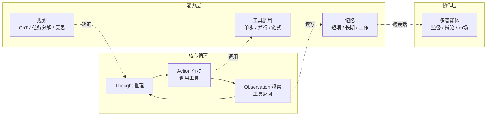

## 从"回答问题"到"完成任务"

传统 LLM 的使用方式是一次性的：你给一个 prompt，它返回一个回复，对话结束。"总结这篇文档"或"翻译这段文字"这种任务，单次问答够用。但换成"帮我整理这个季度的销售数据，标出异常，然后给每个客户经理发一封邮件"，单次问答就不够了。

AI Agent 把问题从"生成回复"变成了"完成任务"。Jeff Su 那支播放量超过 421 万的视频用一个类比说明了区别：传统 AI 是指路，Agent 是开车——它需要自己规划路线、识别路况、处理意外，并在到达后确认完成。这个类比不算精确，但抓住了核心：**Agent 不是一次回答，而是一个带状态、带工具、带反馈循环的执行过程。**

在进入细节前，先给一张系统地图。Agent 不是"一个东西"，而是四条彼此咬合的主线：循环（驱动）、规划（决定怎么做）、工具（动手）、记忆（记住做过的）。多智能体协作是建在这四者之上的扩展，不是第五条独立主线。



各主线在文中的对应关系：

| 主线 | 章节 | 一句话职责 |
|------|------|-----------|
| 循环 | 第一节 | 推理-行动-观察闭环，决定"何时停" |
| 规划 | 第二节 | 把大任务拆成可执行步骤，并自我修正 |
| 工具 | 第三节 | 让模型能调用外部能力，并保证调用质量 |
| 记忆 | 第四节 | 在会话内、跨会话、执行中保留状态 |
| 协作 | 第五节 | 多个 Agent 分工与通信的成本 |

下面按这条主线依次拆解。

---

## 一、Agent 不是"会调工具的 LLM"

很多人把 Agent 理解成"LLM + 函数调用"。这不算错，但漏掉了最关键的部分：**循环**。

单纯的 LLM 调用，即使接了工具，也是单次推理——模型看到工具返回结果就结束。Agent 的区别在于，它有一个持续运行的推理-行动-观察循环，可以在一次任务中多次调用工具、根据观察调整计划、甚至推翻之前的决策重新开始。

这个循环最早被明确形式化的是 **ReAct 模式**（Yao et al., 2023），它把推理和行动交织在一起：

```
Thought: 用户想知道本周的销售趋势，我需要先拿到数据
Action: 调用 get_sales_data(week=current)
Observation: 返回了 5 个区域的数据，华东区异常偏低
Thought: 华东区数据异常，需要看明细
Action: 调用 get_region_detail(region="华东")
...
```

**Thought（推理）不是一次性完成的**，每次拿到观察结果后都要重新评估。Agent 不是"先想好再做"，而是"做一步，想一步，再做下一步"。

2026 年主流的 Agent 框架——LangGraph 的状态机、CrewAI 的轮次调度、AutoGen 的对话驱动——底层都能追溯到这种循环结构。差别在于循环的编排方式：图结构（LangGraph）、对话轮次（AutoGen）或层级调度（CrewAI）。

### 循环的终止条件

Agent 循环中最难设计的往往不是"如何思考"，而是"什么时候停止"。三种常见策略：

- **最大步数截断**：最简单的做法，到了步数强制停止。适合预算敏感的场景。
- **目标验证**：Agent 自己判断任务是否完成。问题是 Agent 可能过于乐观或过于保守。
- **外部评估**：由另一个模型或人工判断是否终止。多用于高价值任务。

三种策略各有适用场景，但一个工程教训是：**不要只依赖 Agent 自我评估作为唯一终止条件**。"最大步数 + 外部兜底检查"的组合通常比纯自评更可靠。

---

## 二、规划：从 Chain-of-Thought 到分层分解

Agent 的规划能力决定它处理复杂任务的深度。三种递进的模式：

### 线性提示链（Chain-of-Thought）

最简单的规划形式，让模型在同一个上下文中逐步推理。没有分支，没有回退，适合"步骤明确、依赖清晰"的任务。CoT 的局限在于，一旦中间某一步出错，后续全部跑偏，且没有纠错机制。

### 任务分解（Task Decomposition）

把大任务拆成子任务，可以顺序执行，也可以并行。Plan-and-Execute 模式就是典型的任务分解：一个 Planner 负责拆解，多个 Executor 负责执行，Supervisor 监控进度。

任务分解的工程难点不在"拆"，而在**依赖管理**。子任务之间可能存在数据依赖（B 需要 A 的输出）、资源依赖（两个任务不能同时使用同一个工具）、以及决策依赖（C 是否需要执行取决于 B 的结果）。2026 年的大多数框架用 DAG（有向无环图）来表达这些依赖，LangGraph 是其中最成熟的实现。

### 反思与自我修正（Reflection）

Agent 在执行完一个动作后，可以对自己的输出做一次评估，然后决定是否修正。这个机制最早在 Reflexion（Shinn et al., 2023）中被形式化，后来被广泛采用。

反思分三步：

1. **执行**：Agent 完成一个子任务，产生输出
2. **评估**：对输出做质量检查（可以是规则检查，也可以是另一个模型的判断）
3. **修正**：如果评估不通过，根据反馈重新执行

这个模式在代码生成场景中尤其有效——Agent 写完代码后跑一遍测试，如果测试失败，把错误信息喂回去让它自己修。2026 年很多 coding agent（如 Claude Code、Devin）的核心流程就是这个。

---

## 三、工具调用：Agent 的双手

工具调用（Tool Use）是 Agent 区别于纯语言模型的关键能力。本质上是让模型在推理过程中，输出一个结构化的调用指令，然后由运行时解析并执行，把结果写回上下文。

### 三种工具调用模式

**1. 单步调用**
模型一次调用一个工具，拿到结果后继续推理。这是最基础的模式，ReAct 原生支持。

**2. 并行调用**
模型一次调用多个工具，运行时并行执行。适合"查多个数据源再综合"的场景。OpenAI 的 function calling API 从 2024 年起就支持并行调用，Anthropic 的 tool use 也在 2025 年跟进。

**3. 链式调用**
一个工具的输出作为下一个工具的输入。链式调用的编排可以交给 Agent 自己决定（动态链），也可以预定义（固定链）。在实际生产中，**固定链比动态链更可靠**——如果业务流程是确定的，用代码把链写死比让模型自己规划更稳定、更容易调试。

### 工具定义的质量直接影响 Agent 行为

**工具的描述文本（description）对模型的选择行为影响很大**。如果两个工具的功能类似但描述模糊，模型可能会随机选一个，或者反复尝试。好的工具定义应该包含：

- 工具做什么（清晰、无歧义）
- 什么时候该用这个工具（触发条件）
- 参数的格式要求（尤其是枚举值和边界条件）
- 调用这个工具可能产生什么样的副作用（如果有的话）

工具描述中增加"当 X 条件满足时使用此工具"这类触发条件，对工具选择准确率有明显改善。

---

## 四、记忆系统：Agent 的短期与长期

Agent 的记忆系统分三层。

### 短期记忆（上下文窗口）

短期记忆就是 LLM 的上下文窗口。2026 年主流模型的上下文已经达到 128K-200K token，足以容纳整本书。但长上下文不等于高质量记忆——模型在长上下文中检索信息的能力仍然有限，尤其是当相关信息分散在各处时。

### 长期记忆（外部存储）

当任务跨多个会话，或者需要积累领域知识时，Agent 需要外部存储。最常用的实现是向量数据库 + RAG：把历史信息向量化存储，在需要时检索相关片段写回上下文。

RAG 的问题通常不在"检索"本身，而在**检索时机**和**检索策略**。什么时候该查记忆，什么时候该直接推理，这个决策在 Agent 中通常由模型自己决定——但模型往往倾向于过度检索（因为"查一下更安全"）。一个实用的优化：在系统提示中明确告诉模型只在必要时才检索，并给出具体的触发条件。

### 工作记忆（执行状态）

工作记忆是 Agent 在单次任务执行过程中的状态追踪。它记录"已经做了什么、拿到了什么结果、还差什么"。这个在 ReAct 循环中由上下文自然承载，但一旦涉及多步操作或多个 Agent 协作，就需要显式的状态管理——这是 LangGraph 的 state 机制解决的问题。

---

## 五、多智能体协作：角色分工与通信开销

多 Agent 不是"把多个 Agent 放在一起就能协作"。挑战在于**通信协议**和**任务协调**。

### 三种协作模式

**1. 监督式（Supervisor）**
一个 Supervisor Agent 分配任务给 Worker Agent，收集结果，做下一步决策。CrewAI 的默认模式就是这种，简单直接，但 Supervisor 容易成为瓶颈。

**2. 辩论式（Debate）**
多个 Agent 各自独立完成任务，然后对比结果，选出最优方案。AutoGen 支持这种模式，适合需要多角度验证的任务。

**3. 市场式（Market）**
Agent 之间通过"发布任务-竞标-执行"的方式协作，没有一个中央调度器。这种模式学术界有讨论，但生产环境中部署较少。

### 通信开销是真实成本

每增加一个 Agent，通信轮次和 token 消耗都会显著增长。按业内经验估算，一个 3-Agent 系统的 token 开销通常是单 Agent 的 3-5 倍，而 5-Agent 系统可能达到 10 倍以上（具体倍数取决于中间结果回写的频率，不是固定值）。**在决定多 Agent 架构之前，先用单 Agent 跑通流程**，确认瓶颈在"能力不足"而非"流程不对"，否则多 Agent 只会放大问题而不是解决问题。

---

## 五·五、一次任务如何流过系统：修复销售报表

把上面五条主线放进一个真实任务里看它们如何配合。假设任务是"发现销售数据异常，并给相关客户经理写一封说明邮件"。

1. **循环启动**（第一节）：Agent 收到任务，进入推理-行动-观察循环。它先判断"异常"需要数据支撑，于是决定调用工具。
2. **工具调用**（第三节）：`get_sales_data(quarter=current)` 返回各区域数据。观察结果写回上下文，模型发现华东区异常偏低。
3. **规划**（第二节）：Agent 决定先查华东区明细，再决定是否群发。这里触发了一次任务分解——"查明细"和"写邮件"是两个子任务，前者依赖数据，后者依赖前者的结论。
4. **反思**（第二节）：写完邮件草稿后，Agent 对内容做一次自检——数据引用是否准确、异常是否已解释。若发现有区域数据缺失，它会回到调用工具那一步补充。
5. **记忆**（第四节）：华东区"本期异常"这个结论被写进工作记忆，供"写邮件"子任务读取；如果这是跨会话的持续监控 Agent，结论还会沉淀到长期记忆，供下次对比。
6. **协作**（第五节）：如果团队用 Supervisor 模式，一个调度 Agent 把"查数据"和"写邮件"分给两个 Worker，并汇总结果；若用单 Agent，这一步省掉，直接在第 5 步收尾。

这个例子说明两件事：第一，五条主线不是串行发生的，而是围绕同一个目标交织推进；第二，**任务里真正吃 token 的往往不是"写邮件"，而是第 2、4 步反复的观察回写和反思重试**。预算要按这个来。

---

## 六、框架选型对照

| 框架 | 核心抽象 | 最适合的场景 | 学习曲线 | 生产成熟度 |
|------|---------|------------|---------|-----------|
| **LangGraph** | 状态图（StateGraph） | 复杂工作流、状态敏感的任务 | 中-高 | 高 |
| **CrewAI** | 角色 + 任务 | 多 Agent 协作、角色分工明确 | 低-中 | 中-高 |
| **AutoGen** | 对话代理 | 研究实验、多轮交互 | 中 | 中 |
| **SmolAgents** | 轻量 Agent | 快速原型、教学演示 | 低 | 低 |
| **Mastra** | Workflow + Agent | Next.js 集成、Web 应用 | 中 | 中 |

- **LangGraph** 是生产环境中部署最广的选择，图结构能精确控制 Agent 执行流程，状态管理机制也相对成熟。代价是代码量较大，学习曲线比较陡。
- **CrewAI** 上手门槛最低，角色 + 任务的抽象直观，适合"让几个 Agent 扮演不同角色协作"的场景。但调度策略相对简单，复杂流程的控制力不如 LangGraph。
- **SmolAgents** 适合学习，10 行代码就能跑一个 Agent，但不适合生产。
- **Mastra** 较新，与 Next.js 生态集成紧密，适合作为 Web 应用的 Agent 层。

---

## 七、工程实践：构建 Agent 的常见陷阱

### 陷阱 1：任务定义太宽

"帮我分析销售数据"这种任务对 Agent 来说太模糊。好的任务定义应该是 3-5 个明确步骤，包含输入输出规格。**如果你自己没办法用 3 句话描述清楚这个任务，Agent 也不可能做对**。

### 陷阱 2：忽略错误恢复

大多数 Agent 框架的默认流程是"顺利路径"——Agent 一步一步执行，所有工具调用都成功返回。但生产环境里，工具可能超时、API 可能返回错误、模型可能输出格式不正确的工具调用。**错误恢复不是可选项，是必要组件**。至少需要处理：工具调用超时、返回格式异常、以及"模型陷入循环"（连续 N 步没有进展）的检测。

### 陷阱 3：过度信任 Agent 的自我评估

Agent 说"任务完成了"不一定真的完成了。在关键节点设置人工确认（human-in-the-loop）或自动验证（assertion check），是生产级 Agent 的标配。

### 陷阱 4：低估 token 消耗

一个看似简单的 Agent 任务，实际 token 消耗可能是直接 LLM 调用的 5-20 倍（同为经验估算，高倍数通常来自多次反思重试和长工具结果回写）。每次推理、每次工具调用结果的回写、每次反思和自我修正，都在消耗上下文。在早期设计阶段就做好 token 预算，比上线后再优化省力得多。

---

## 七·五、采用顺序：先单后多，先固定后动态

前面五条主线没有一个场景需要"一次性全上"。给一个务实的推进顺序：

1. **第一个版本：单 Agent + 固定工具链 + 明确任务定义**。这也是第七节四个陷阱的预防位置——任务定义够具体、错误恢复够用、token 有预算。此时不引入反思，更不引入多 Agent。
2. **第二步：加反思（Reflection）**。当任务出现"一次跑不中对"（典型如代码生成要跑测试），再引入反思。反思是成本收益比最高的单项增强——它只增加重试，不增加通信。
3. **第三步：按需引入多 Agent**。只有当单 Agent 的瓶颈是"一个模型同时做太多事导致上下文混乱"，而不是"模型能力不够"时，才拆成多 Agent。判断标准回到第五节：先确认瓶颈在"能力"还是"流程"。
4. **最后：自定义终止条件与外部验证**。当任务进入高价值、不可逆场景（付款、发信、改生产数据），用外部评估或人工确认兜底，替代纯自评。

厂商选型上，这条顺序对应的默认选择是：第一步用 LangGraph 或任一轻量框架跑通；第二步仍用单框架；第三步才需要比较 CrewAI / AutoGen 的协作抽象。**不要在第一步就为一个还不存在的多 Agent 场景选型**。

---

## 八、从视频到实践

Jeff Su 那支视频最大的价值，是让更多人意识到：AI 的使用方式正在从"我问你答"转向"我派任务，你执行"。

但视频受限于时长和受众，有意简化了 Agent 的技术复杂性。如果你正在考虑把 Agent 引入生产环境，建议从单 Agent + 明确任务定义 + 固定工具链开始，跑通后再逐步引入多 Agent 协作和反思机制。**2026 年的 Agent 框架已经足够成熟来支撑生产，前提是你理解它的工作方式**——不是把它当成黑盒，而是理解它的循环结构、终止条件和失败模式。

---

*文章基于 Jeff Su 视频「AI Agents, Clearly Explained」（421 万播放）及其他公开技术资料整理。*