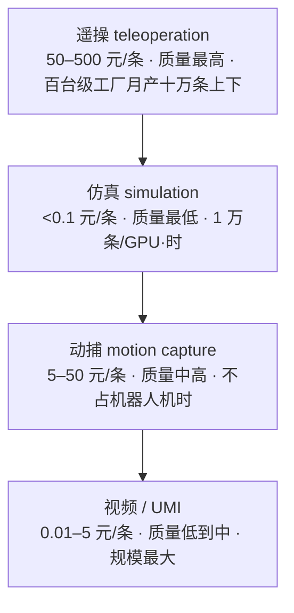

## 这篇在回答什么

本文围绕机器人数据这条主线，想讲清四件事：具身智能的「ImageNet 时刻」为何落在 2024 年底；四层数据金字塔在成本、质量、速度上的取舍，为什么 2026 年要靠四层叠加；200 台机器人的数采工厂难在哪里；以及「涌现时刻」还差什么。

篇幅较长，上面四点既是主线，也可以当目录跳读。

---

## 写在前面

2024 年 12 月 30 日，智元机器人联合上海人工智能实验室、国家地方共建人形机器人创新中心等机构，开源了 AgiBot World——数据规模比既有公开数据集高出一个数量级的真机数据集（完整版 Beta 于 2025 年 3 月放出，100 万条轨迹）。硅谷 101 实地探访视频《揭秘数采工厂：稀缺的机器人数据，到底难在哪儿？》（BV1uQ5Y6mExN，39 分钟，2026-05-15 发布）里，智元合伙人姚卯青与 Sharpa 研究科学家张凯峰把这件事讲得很直白，视频简介里有一句话：

> 「当 AI 大模型靠"吃遍互联网"完成进化，机器人却还困在现实世界的数据荒漠里。」

2026 年 4 月 16 日，觅蜂科技在上海张江科学会堂发布一站式物理 AI 数据服务平台和 MEgo 系列无本体采集设备。姚卯青的另一重身份是觅蜂科技董事长兼 CEO——智元的数采工厂经验、觅蜂的无本体采集、Sharpa 的触觉 AI，三件事落在同一个方向上：把机器人数据从少数公司手里攥着，变成行业共享的资产。

本文以硅谷 101 节目为骨架，叠加 AgiBot World 技术报告（arXiv:2503.06669）、智元与觅蜂的公开发布材料、Sharpa 灵巧手公开报道，从数据生产、数据质量、数据回灌三块展开。文中数字、规格、时间表均来自公开报道或已标注为量级估算，不外推未发布产品。

---

## 一、先看地图：机器人数据为什么是「荒漠」

把机器人数据和大模型数据并排放在一起，差距一目了然：

| 维度 | 大模型数据 | 机器人数据 |
| --- | --- | --- |
| 数据源 | 互联网文本 / 图片 / 视频 | 物理世界机器人执行任务 |
| 单条数据成本 | 几乎为 0（爬虫） | 0.01–500 元（遥操 / 仿真 / 动捕 / 视频） |
| 数据规模 | 万亿 token | 百万级轨迹（行业公开数据） |
| 标注方式 | 自动 + 弱监督 | 必须人工标注 + 质量把控 |
| 通用性 | 一个模型适用多任务 | 数据绑死机器人本体（硬件变 → 数据重采） |
| 隐私 / 物理风险 | 文本无风险 | 物理执行有风险（损坏设备 / 伤人） |

差距最集中的是单条数据成本和通用性这两行。互联网数据免费且通用，机器人数据贵且不通用。

量化看一下（成本为依据公开材料的量级估算）：

- AgiBot World 百万条真机数据，按每条 50–200 元的遥操成本估算，总投入在 5,000 万到 2 亿元量级
- 公开机器人数据集（RT-1 / Bridge / Open X-Embodiment）各在数万到百万条轨迹量级
- 一家头部公司自建数采工厂，年投入按同样的单价推算要过亿
- Sam Altman 公开说过 GPT-4 一轮训练成本超过 1 亿美元，产出的还是通用文本模型

机器人数据贵在单价：百万条就要上亿元，产出的却还是绑死单本体的具身模型。具身智能的 ImageNet 时刻拖到 2024 年底，根子就卡在「贵且不通用」上。

---

## 二、AgiBot World：具身智能的「ImageNet 时刻」具体指什么

### 2.1 为什么这件事是 ImageNet 时刻

2012 年的 ImageNet 和 2024 年的 AgiBot World 放在一起看：

- **ImageNet 2009–2012**：1400 万张标注图片、2 万多个类别，2012 年 ILSVRC 竞赛上 AlexNet 夺冠 → 计算机视觉从「手工特征」进入「深度学习」
- **AgiBot World 2024**：100 万条真机轨迹、217 个任务、5 大场景（家居 / 商超 / 餐饮 / 工业 / 办公）→ 具身智能从「仿真小数据集」进入「真机大数据集」

类比的关键不在规模，而在数据、标准、评测三样同时开源：

- 数据：100 万条真机轨迹（每条是一个完整任务的多模态时序数据）
- 标准：统一的硬件平台（8 摄像头 + 6 自由度灵巧手 + 双臂 + 移动底盘，可扩展视触觉传感器）+ 统一的任务定义
- 评测：217 个任务上的公开评测脚本 + 开源 baseline 模型 GO-1

ImageNet 成为里程碑，靠的是把数据、评测、baseline 一起公开，让全球研究者站在同一个标准上竞争。AgiBot World 做的正是同一件事。

### 2.2 100 万条数据的工程构成

**一条轨迹长什么样**（示意，字段依公开数据格式简化）——它不是一张图，而是一段带动作标签的多模态时序：

```json
{
  "task": "把杯子从桌上抓到水槽（scene: 家居）",
  "embodiment": "8 摄像头 + 6-DoF 灵巧手 + 移动底盘",
  "observation": ["rgb×8", "depth×2", "joint_state", "gripper"],
  "action": ["Δjoint×7", "gripper_cmd"],
  "annotation": {"success": true, "instruction": "pick up the cup, put it in the sink"}
}
```

技术报告披露的口径是 5 大部署场景、217 个任务，没有给出逐场景占比。下表按官方与媒体公开描述，整理每个场景里的代表性任务：

| 场景 | 代表任务 |
| --- | --- |
| 家居 | 整理衣物 / 叠被 / 洗碗 / 收拾桌子 |
| 商超 | 货架补货 / 商品抓取 / 价签扫描 |
| 餐饮 | 端盘 / 倒水 / 食材分类 |
| 工业 | 零件分拣 / 装配 / 检测 |
| 办公 | 递文件 / 整理桌面 / 开关门 |

5 大场景挑的不是研究课题，是未来 1–3 年商业部署会落地的清单。

### 2.3 「真机数据」为什么贵

把真机和仿真并排对比：

- 仿真数据（Isaac Sim / MuJoCo / Genesis 生成）：1 万条 / 1 GPU 小时 / 1 人，单条成本约 0.01 元
- 真机数据（AgiBot World 的生产端是 100 台双臂机器人在 4000 平方米数采工厂里运转，视频探访时工厂已扩到 200 台规模）：单条成本约 50–200 元

仿真数据便宜上万倍，但有两个根本性缺陷：

- Sim-to-Real Gap：仿真的物理参数（摩擦 / 阻尼 / 接触力学）和真实世界存在差距，模型部署到真机时性能会明显缩水（行业经验值在三到五成）
- 物理真实性：仿真很难还原柔性物体（衣物 / 食物 / 流体），而它们恰恰是具身智能的关键场景

AgiBot World 用真机加大规模的组合，把 sim-to-real gap 绕过去，直接用真机数据训练，代价是钱。

---

## 三、四层数据金字塔：遥操 / 仿真 / 动捕 / 视频

硅谷 101 节目里，姚卯青和张凯峰提到行业共识——四层数据金字塔，从最贵、最稀缺到最便宜、最大规模，2026 年的现实选择是四层叠加。



金字塔自上而下，成本递减、规模递增。下面逐层拆解取舍。

### 3.1 第一层：遥操（teleoperation）—— 最贵，质量最高

遥操是人类用 VR 头显加手套远程控制机器人，机器人记录观察和动作轨迹。

- 单条成本：50–500 元（人工 + 机器人 + VR 设备 + 场地）
- 质量：最高（人类真实动作 + 真实物理反馈）
- 速度：视频探访的工厂是 200 台机器人配约 200 名操作员，月产量在十万条量级
- 瓶颈：操作员人力成本 + 重复性劳动疲劳

AgiBot World 主要靠遥操采集，技术报告写明数据来自 100 台真机；视频探访的工厂已扩到 200 台，产能在往上走。

### 3.2 第二层：仿真（simulation）—— 最便宜，质量最低

仿真数据在 Isaac Sim / MuJoCo / Genesis 等物理引擎里生成。

- 单条成本：< 0.1 元（GPU + 软件许可）
- 质量：最低（sim-to-real gap 导致部署缩水）
- 速度：最快（1 万条 / 1 GPU / 小时）
- 关键价值：数据规模放大器——10 万条真机数据 + 1 亿条仿真数据混训，提升模型泛化

### 3.3 第三层：动捕（motion capture）—— 中价，适合精细操作

动捕用动捕服（Xsens / OptiTrack）加手部手套（Manus / DexCap）记录人类动作，不绑死机器人本体。

- 单条成本：5–50 元（动捕设备 + 操作员）
- 质量：中高（人类真实动作，但缺少真实物理反馈）
- 速度：快于遥操——不占机器人机时，几个动捕员就能批量产出，代价是清洗工作量大
- 关键价值：手部精细动作——叠衣服 / 盘核桃 / 削苹果这些 6 自由度以上的灵巧手任务

张凯峰在节目里强调，精细操作不只是手的事，全身都在参与。动捕是目前最经济的精细操作数据采集方案。

### 3.4 第四层：视频（video / UMI）—— 最便宜，规模最大

视频学习用人类视频（YouTube / 厨房监控 / 第一人称视角）和 UMI（Universal Manipulation Interface，便携式手持数据采集器）训练。

- 单条成本：< 0.01 元（YouTube 视频）或 1–5 元（UMI 采集）
- 质量：低到中（缺真实物理交互）
- 速度：最大（全球公开视频存量以十亿小时计）
- 关键价值：规模加多样性——把全世界的人类视频变成可训练数据

UMI 的核心创新是采集端不绑死机器人本体。觅蜂科技 2026-04-16 发布的 MEgo 系列无本体采集，是这一方向的工程化产品。

### 3.5 四层叠加的工程现实

| 层 | 单条成本 | 质量 | 速度 | 典型角色 |
| --- | --- | --- | --- | --- |
| 遥操 | 50–500 元 | ⭐⭐⭐⭐⭐ | 百台级工厂月产十万条上下 | 高质量真机轨迹主力 |
| 仿真 | < 0.1 元 | ⭐⭐ | 1 万 / GPU 时 | 预训练规模打底 |
| 动捕 | 5–50 元 | ⭐⭐⭐⭐ | 不占机器人机时 | 精细操作补强 |
| 视频 / UMI | 0.01–5 元 | ⭐⭐⭐ | 十亿小时量级存量 | 多样性与先验 |

各家的层间配比是按任务清单调出来的工程参数，公开材料里没有统一数字，照抄任何一家的比例都没有意义。可以确定的是分层逻辑：

- 简单任务（抓取 / 搬运）→ 视频 + 仿真（便宜）
- 中等任务（叠衣 / 装配）→ 动捕 + 仿真（性价比高）
- 复杂任务（柔性物体 / 工具使用）→ 遥操（必须）
- 全场景预训练 → 仿真打底（规模）

所以 2026 年没有哪一层能独当一面，四层按任务难度搭配，是行业里在跑的通行的做法。

---

## 四、200 台数采工厂：硬件不难，难在 3 个软环节

硅谷 101 实地探访了 200 台机器人规模的数采工厂。硬件层面（200 台机器人 + 200 名操作员 + VR 头显 + 灵巧手 + 工业相机）不难。难的其实是 3 个软环节：

### 4.1 任务编排：200 台机器人同时开工

200 人 × 每天 8 小时 × 7 天 = 每周 11,200 人时。要让这么多人和机器不空转，需要一套任务调度系统：

- 任务池：1 万多个候选任务（5 大场景 × 多个子任务）
- 操作员分配：1 人 = 1 机器 = 1 个任务（频繁轮换会影响数据一致性）
- 设备分配：200 套 VR / 灵巧手 / 相机，由调度系统保证 7×24 运行
- 故障恢复：机器人卡住 / VR 失联 / 相机标定偏移，5 分钟内自动重置

姚卯青在节目里把觅蜂的定位讲得很直接：把数采工厂的任务调度、质量审核、数据回灌做成平台化工具。他同时是智元合伙人和觅蜂科技董事长兼 CEO，智元数采工厂趟出来的坑，顺着人流向觅蜂的产品，这条线是公开信息，不需要回避。

### 4.2 质量把控：1 万条里 1000 条能用已算不错

节目里给了一个粗口径：1 万条数据里 1000 条能用，已经算不错——这是细活难任务、新手操作员的下限。整体口径要高不少：按行业常见的三分之一可用率倒推，100 万条可用轨迹意味着原始采集量要到 300 万条量级。具体可用率官方没有披露，这个倍数只是量级推算。

数据质量不达标通常有四种原因：

- 物理错误：机器人撞到桌子 / 抓空 / 漏抓
- 视觉遮挡：相机被操作员的手或物体挡住
- 同步错误：观察帧和动作指令错位
- 重复数据：同一种任务采了 1 万次，但结果都一样

质量把控分两道：

- 自动过滤：用 VLM 自动识别「机器人撞桌子」/「抓空」等错误帧，自动剔除
- 人工审核：剩余数据 10% 抽样复核，二次过滤

这套流程只有工业级数采工厂才撑得起来。

### 4.3 数据回灌：模型训练 → 失败案例 → 再采集

数据回灌是把模型训练的失败案例反馈回数采工厂，让操作员专门采集模型没做好的任务。这一节的数字是一轮示意推演，用来说明循环怎么转，不是某个公开项目的实测结果：

- 第一轮：100 万条数据 → 训练 VLA 模型 → 80% 任务成功率
- 失败案例归因：20% 的失败任务里，一部分是「模型从未见过的场景」 → 反馈给数采工厂
- 第二轮：针对这批失败场景定向补采 → 再训练 → 成功率往上抬
- 持续迭代：每一代模型都把失败案例回灌，成功率逐代逼近可用上限

「数据 → 模型 → 失败案例 → 数据」这条循环，决定了 AgiBot World 开源之后能不能真正被用起来。

---

## 五、觅蜂科技 + Sharpa：2026 年数据生态的两个新支点

### 5.1 觅蜂科技：把数采工厂平台化

2026 年 4 月 16 日，成立仅 72 天的觅蜂科技（Maniformer）在上海张江科学会堂举办「蜂行天下，数驱智能」发布会，一口气发布三件产品：MEgo Gripper 采集夹爪、MEgo View 头戴式采集设备、MEgo Engine 数据治理引擎。

无本体采集意味着数据采集端不绑死特定机器人本体。传统数采工厂是「用 A 机器人采 → 训练 A 模型 → 只能部署在 A」；无本体则让采集端输出通用数据格式（关节轨迹 + 视觉 + 力矩），下游可以映射到不同机器人本体。MEgo View 头戴设备加腕部相机、MEgo Gripper 夹爪，与人形本体原生同构，采完的数据可以直接落到对应机器人上。

这等于把数据可移植性做成了产品——数据不跟着本体走，是具身智能跨过单本体瓶颈的前提。

发布会通稿给出的目标：

- 产能：2026 年实现千万小时级数据产能，2030 年冲击百亿小时级
- 数据治理：亚毫秒级时空同步，配合「蜂巢数据共创行动」联合多家机构共建数据
- 成本：官方口径是「大幅降低数据获取门槛与成本」，没有公布单价数字——对照 2025 年遥操 50–500 元 / 条的成本，这也是无本体路线最值得盯的变量

### 5.2 Sharpa：触觉 AI 是「精细操作」的关键

张凯峰在节目里强调，精细操作不只是手的事，全身都在参与。Sharpa（背靠禾赛的灵巧手团队）在做的灵巧手加触觉 AI，是在补主流视觉数据采集漏掉的另一半。

触觉 AI 三件套：

- 触觉传感器（6 维力矩 + 温度 + 振动）：每根手指 1 个，灵巧手 5 根 + 手腕 1 个 = 6 个
- 触觉模型（Tactile-VLA）：把触觉信号并入 VLA 模型，抓鸡蛋 / 折风车 / 削苹果时不抓破
- 触觉回灌：把触觉失败案例回灌，训练触觉模型

Sharpa 灵巧手在 CES 上翻扑克牌、折风车，在春晚盘核桃，在 GTC 大会期间削苹果——这些 Demo 每一个都依赖触觉 AI。这些任务没有触觉数据、只靠视觉，根本做不到。

把三家合起来看：

- 智元 AgiBot World：100 万条视觉 + 动作真机数据
- 觅蜂 MEgo：无本体采集，把多本体兼容数据做成产品
- Sharpa 触觉 AI：把触觉维度也变成可训练数据

2026 年的机器人数据生态，正在从视觉单维度向视觉 + 触觉 + 跨本体多维度升级。

---

## 六、实战示例：一次「机器人抓杯子」任务的数据生产流

下面用一轮假设推演走完整个数据生产流。数字是示意性的——按前文公开的单价区间取中值估算，重点是各环节的衔接顺序和成本结构，不是某个真实项目的账本。假设一家公司要让机器人学会「从桌上抓杯子放到水槽里」：

### 阶段 1：仿真预训练（1 个月 / 1 GPU）

- 目标：用 1 亿条仿真数据训练 VLA 模型，让模型先有「抓杯子」的初始能力
- 数据：Isaac Sim 生成 1 亿条抓杯子轨迹（不同杯子形状 / 桌面材质 / 光照 / 视角）
- 成本：< 1000 元（GPU 时间）
- 模型：VLA 7B 端到端模型

### 阶段 2：真机数据采集（2 周 / 200 台机器人）

- 目标：用真机数据修正 sim-to-real gap
- 数据：200 台 × 14 天 × 8 小时 = 22,400 机时。按单条遥操约 13 分钟（含设备调试与任务切换），产出约 10 万条原始轨迹
- 成本：10 万条 × 约 125 元 / 条（遥操 50–200 元区间的中值）≈ 1,250 万元（含操作员、设备、场地、质量审核）
- 质量过滤：VLM 自动过滤 + 人工抽样复核，可用率按三分之一估，约 3 万条可用

### 阶段 3：模型再训练 + 失败案例回灌（2 周）

- 目标：用 3 万条真机数据微调 VLA 模型
- 模型性能：抓杯子成功率从 60% 提到 85%（推演假设值）
- 失败案例：15% 失败中，相当一部分是「杯子倒了」/「抓空」/「卡住」等模型没见过的场景
- 回灌：几千条失败指令反馈给数采工厂

### 阶段 4：定向补采（1 周）

- 目标：专门采集失败场景
- 数据：200 台 × 7 天 × 8 小时 = 11,200 机时，定向补采约 1 万条原始轨迹。失败场景多为柔性操作，布置一次场景只能采几条，大量机时花在重摆桌面、复位杯子上，单条等效耗时数倍于常规遥操
- 成本：1 万条 × 约 125 元 / 条 ≈ 125 万元
- 数据进入下一轮训练

总账：约 1,000 元（仿真）+ 1,250 万元（首轮真机）+ 125 万元（补采）≈ 1,400 万元，两个月左右，模型抓杯子成功率推演到 95%。

1,400 万元换 95% 成功率——这就是「机器人抓杯子」在 2026 年的价格，也是 ImageNet 时刻落到工程上的样子：有公开数据集、有现成工具链，这笔账任何一家公司都能自己复算。

---

## 七、机器人真正的「涌现时刻」还差什么

节目里姚卯青和张凯峰提到「机器人涌现时刻」，但没给具体定义。用工程语言说：

涌现时刻 = 在 100 多个真实工业 / 家居场景下，机器人 8 小时一班次稳定工作，故障率 < 5%，单台成本 < 10 万人民币。

按这个标准，2026 年离涌现时刻还差 3 件事：

1. 高质量真机数据规模：百万级轨迹够基础研究，不够商业部署，需要 10 亿条以上轨迹（成本 100 亿以上）。AgiBot World 走开源，觅蜂科技走平台化数据服务，三五年内能不能做到 10 亿轨迹是第一个分水岭。
2. 跨本体数据通用性：数据绑死机器人本体，用宇树采的不能直接训练智元。觅蜂 MEgo 的无本体方向是第二个分水岭——能否在 2–3 年内让数据格式标准化，让一家采的数据全行业可用。
3. 触觉 / 力反馈信号：现有数据绝大多数只有视觉 + 关节轨迹，没有触觉。Sharpa 在做触觉 AI，但要 2–3 年才能形成视觉 + 触觉 + 力矩三模态的主流，这是第三个分水岭。

具身智能 2026–2028 年的窗口期：

- 2026 年：100 万到 1000 万条真机数据 + 单一本体 + 视觉主导
- 2027 年：1000 万到 1 亿条数据 + 多本体（觅蜂 MEgo 推动）+ 视觉 + 力矩
- 2028 年：1 亿到 10 亿条数据 + 全行业通用 + 视觉 + 触觉 + 力矩三模态

如果 2028 年这三件事同步就绪，机器人涌现时刻就到了。

---

## 八、硬件成熟之后，下一个瓶颈是数据

过去两年机器人硬件快速成熟（电机 / 减速器 / 丝杠 / 传感器国产替代），人形机器人整机成本从百万元级降到十万元级。硬件把能动的机器人造出来了，剩下的难题是「让它学会动」，这一步卡在数据。

AgiBot World（2024 年底启动开源，2025 年放出完整百万真机轨迹）、觅蜂科技（2026-04-16 发布 MEgo 无本体采集）、Sharpa（触觉 AI + 灵巧手）三件事在同一时间窗口出现，不是巧合。等机器人进工厂、进家、进仓库，卡进度的将不再是本体厂商，而是数据生态的供给速度。

---

## 九、常见误读

- 「仿真数据足够便宜，迟早取代真机」——错。仿真解决不了 sim-to-real gap 与柔性物体（衣物 / 食物 / 流体），真机数据是绕不过去的地基；仿真是放大器，不是替代品。
- 「数采工厂难在硬件」——错。200 台机器人谁都能堆，真正难的是任务编排 / 质量把控 / 数据回灌这 3 个软环节，1 万条里能用 1000 条已算不错。
- 「数据越多越好」——不全对。绑死单一本体的数据换个机器人就作废；跨本体通用性（觅蜂 MEgo 那一路）比单纯堆量更决定天花板。

## 十、读者判断：这篇文章和原视频，分别适合谁

原视频 39 分钟，胜在实地探访的现场感，姚卯青和张凯峰的表情、数采工厂的运作画面是文字带不来的。如果你关心的是「数采工厂长什么样、人怎么和机器配合」，值得花 40 分钟看原片。

如果你在意的是结论本身——四层金字塔怎么取舍、数据为什么贵、2026 年行业卡在哪——读本文就够了，原视频里这些判断都已经写在这里。写作者、做具身智能的产品经理、想判断数据赛道方向的投资者，读本文更省时间。

## 十一、自测清单

读完可以对着问自己几个问题：

- [ ] 说得出四层数据金字塔每层的成本 / 质量 / 速度取舍，以及为什么要 4 层叠加而不是选一层？
- [ ] 解释得清真机数据为什么贵，和 sim-to-real gap 的关系？
- [ ] 讲得出 200 台数采工厂真正难的 3 个软环节？
- [ ] 说得清无本体采集为什么是跨本体通用性的前提？
- [ ] 列得出 2026 年离涌现时刻还差的 3 件事？

## 十二、下一步与参考资料

想继续深入，把 AgiBot World 的公开数据格式过一遍，再对照硅谷 101 的实地探访，会比只读本文更有体感。

- 硅谷 101《揭秘数采工厂：稀缺的机器人数据，到底难在哪儿？》：[BV1uQ5Y6mExN](https://www.bilibili.com/video/BV1uQ5Y6mExN)（39 分钟，2026-05-15，本文骨架来源）
- [AgiBot World 技术报告（arXiv:2503.06669）](https://arxiv.org/abs/2503.06669)：五大域、217 任务、100 台真机的官方口径
- [AgiBot World 官网](https://agibot-world.com) ｜ [GitHub](https://github.com/OpenDriveLab/AgiBot-World) ｜ [HuggingFace 数据集](https://huggingface.co/datasets/agibot-world/AgiBotWorld-Alpha)
- [觅蜂科技官网](https://www.maniformer.net)：MEgo Gripper / View / Engine 产品资料与 2026-04-16 发布会信息
- Sharpa 灵巧手公开 Demo（CES 翻扑克牌、春晚盘核桃、GTC 削苹果）与触觉 AI 行业报道
- 公开行业报告：四层数据金字塔（遥操 / 仿真 / 动捕 / 视频 / UMI）的成本 + 质量 + 速度对比
- 姊妹篇《机器人「肉身」的工程化：宇树半马破纪录、智元量产和特斯拉 Optimus 留下的不是空翻，是供应链重组》——本文是「数据 / 算法」视角，姊妹篇是「整机 / 供应链」视角

> 说明：本文以硅谷 101 节目为骨架，叠加 AgiBot World 技术报告与各家公开发布材料整理。文中成本、比例、时间表为依据公开报道的量级估算，已在正文标注；第四节数据回灌与第六节实战示例的数字为示意推演。无法核实的口径已注明出处边界。
