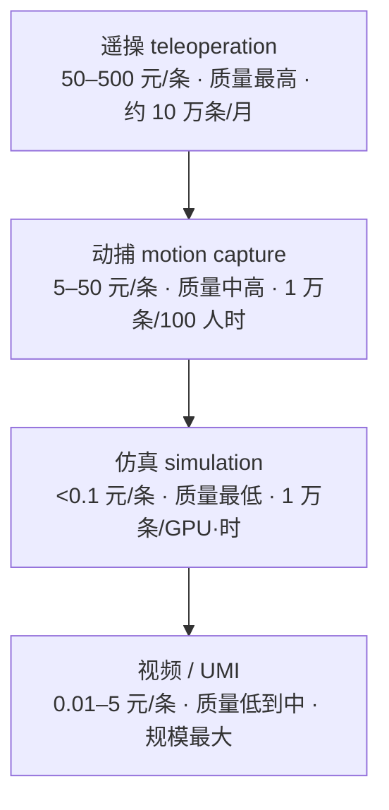

## 这篇在回答什么

本文围绕机器人数据这条主线，想讲清四件事：具身智能的「ImageNet 时刻」为何落在 2024 年底；四层数据金字塔在成本、质量、速度上的取舍，为什么 2026 年要靠四层叠加；200 台机器人的数采工厂难在哪里；以及「涌现时刻」还差什么。

篇幅较长，上面四点既是主线，也可以当目录跳读。

---

## 写在前面

2024 年底，智元机器人联合上海人工智能实验室、国家地方共建人形机器人创新中心和上海库帕思，开源了 AgiBot World——具身智能领域第一个百万级真机数据集。硅谷 101 实地探访视频《揭秘数采工厂：稀缺的机器人数据，到底难在哪儿？》（BV1uQ5Y6mExN，39 分钟，2026 年发布）里，智元合伙人姚卯青与 Sharpa 研究科学家张凯峰说：

> 「当 AI 大模型靠吃遍互联网完成进化，机器人却还困在现实世界的数据荒漠里。」

2026-04-16 觅蜂科技在上海张江发布一站式物理 AI 数据服务平台和 MEgo 无本体采集方案。智元开源 100 万条数据、觅蜂的无本体采集、Sharpa 的触觉 AI，三件事落在同一个方向上：把机器人数据从一只手里攥着，变成行业共享的资产。

本文以硅谷 101 节目为骨架，叠加智元 AgiBot World 公开发布材料、觅蜂科技 2026-04-16 发布会公开报道、Sharpa 灵巧手公开 Demo，以及行业四层数据金字塔公开报告，从数据生产、数据质量、数据回灌三块展开。文中数字、规格、时间表均来自公开报道，不外推未发布产品。

---

## 一、先看地图：机器人数据为什么是「荒漠」

把机器人数据和大模型数据并排放在一起，差距一目了然：

| 维度 | 大模型数据 | 机器人数据 |
| --- | --- | --- |
| 数据源 | 互联网文本 / 图片 / 视频 | 物理世界机器人执行任务 |
| 单条数据成本 | 几乎为 0（爬虫） | 1–1000 元（遥操 / 仿真 / 动捕） |
| 数据规模 | 万亿 token | 百万级轨迹（行业公开数据） |
| 标注方式 | 自动 + 弱监督 | 必须人工标注 + 质量把控 |
| 通用性 | 一个模型适用多任务 | 数据绑死机器人本体（硬件变 → 数据重采） |
| 隐私 / 物理风险 | 文本无风险 | 物理执行有风险（损坏设备 / 伤人） |

差距最集中的是单条数据成本和通用性这两行。互联网数据免费且通用，机器人数据贵且不通用。

量化看一下：

- AgiBot World 百万条真机数据，每条成本 50–200 元，总成本 5,000 万到 2 亿元
- NeurIPS / CoRL 公开机器人数据集（RT-1 / Bridge / OpenX-Embodiment）累计 50–100 万条轨迹
- 单家头部公司年采集成本 1–5 亿元（200 台机器人 × 1 年 × 100 万轨迹）
- GPT-4 训练数据成本约 5 亿美元，但产出的是通用文本模型

机器人数据成本只有 GPT-4 训练数据的 1/10–1/100，产出的却是单本体的具身模型。具身智能的 ImageNet 时刻拖到 2024 年底，根子就卡在「贵且不通用」上。

---

## 二、AgiBot World：具身智能的「ImageNet 时刻」具体指什么

### 2.1 为什么这件事是 ImageNet 时刻

2012 年的 ImageNet 和 2024 年的 AgiBot World 放在一起看：

- **ImageNet 2012**：1400 万张标注图片 → 1 万类别 → 计算机视觉从「手工特征」进入「深度学习」
- **AgiBot World 2024**：100 万条真机轨迹 → 5 大场景（家居 / 商超 / 餐饮 / 工业 / 办公）→ 具身智能从「仿真小数据集」进入「真机大数据集」

类比的关键不在规模，而在数据、标准、评测三样同时开源：

- 数据：100 万条真机轨迹（每条是一个完整任务的多帧数据）
- 标准：统一的硬件配置（8 摄像头 + 6 自由度灵巧手）+ 统一的任务定义
- 评测：公开 benchmark（5 大场景 × 多个子任务）+ 公开 baseline

ImageNet 成为里程碑，靠的是把数据、评测、baseline 一起公开，让全球研究者站在同一个标准上竞争。AgiBot World 做的正是同一件事。

### 2.2 100 万条数据的工程构成

**一条轨迹长什么样**（示意，字段依公开数据格式简化）——它不是一张图，而是一段带动作标签的多模态时序：

```json
{
  "task": "把杯子从桌上抓到水槽（scene: 家居）",
  "embodiment": "8 摄像头 + 6-DoF 灵巧手 + 移动底盘",
  "observation": ["rgb×8", "depth×2", "joint_state", "gripper"],
  "action": ["Δjoint×7", "gripper_cmd"],
  "annotation": {"success": true, "instruction": "pick up the cup, put it in the sink"}
}
```

按智元公开材料，100 万条数据按 5 大场景分布：

| 场景 | 占比 | 代表任务 | 关键硬件 |
| --- | --- | --- | --- |
| 家居 | ~30% | 整理衣物 / 叠被 / 洗碗 / 收拾桌子 | 8 摄像头 + 6 自由度灵巧手 + 移动底盘 |
| 商超 | ~20% | 货架补货 / 商品抓取 / 价签扫描 | 摄像头 + 灵巧手 + 升降结构 |
| 餐饮 | ~15% | 端盘 / 倒水 / 食材分类 | 触觉手 + 6 摄像头 |
| 工业 | ~20% | 零件分拣 / 装配 / 检测 | 高速摄像头 + 力矩传感器 |
| 办公 | ~15% | 递文件 / 整理桌面 / 开关门 | 通用 8 摄像头配置 |

5 大场景挑的不是研究课题，是未来 1–3 年商业部署会落地的清单。

### 2.3 「真机数据」为什么贵

把真机和仿真并排对比：

- 仿真数据（Isaac Sim / MuJoCo / Genesis 生成）：1 万条 / 1 GPU 小时 / 1 人，单条成本约 0.01 元
- 真机数据（200 台机器人 + 200 名遥操员 + 质量审核）：1 万条 / 1 个月 / 200 人，单条成本约 50–200 元

仿真数据便宜一万倍，但有两个根本性缺陷：

- Sim-to-Real Gap：仿真的物理参数（摩擦 / 阻尼 / 接触力学）和真实世界存在差距，模型部署时性能掉 30–50%
- 物理真实性：仿真很难还原柔性物体（衣物 / 食物 / 流体），而它们恰恰是具身智能的关键场景

AgiBot World 用真机加大规模的组合，把 sim-to-real gap 绕过去，直接用真机数据训练，代价是钱。

---

## 三、四层数据金字塔：遥操 / 仿真 / 动捕 / 视频

硅谷 101 节目里，姚卯青和张凯峰提到行业共识——四层数据金字塔，从最贵、最稀缺到最便宜、最大规模，2026 年的现实选择是四层叠加。



金字塔自上而下，成本递减、规模递增。下面逐层拆解取舍。

### 3.1 第一层：遥操（teleoperation）—— 最贵，质量最高

遥操是人类用 VR 头显加手套远程控制机器人，机器人记录观察和动作轨迹。

- 单条成本：50–500 元（人工 + 机器人 + VR 设备 + 场地）
- 质量：最高（人类真实动作 + 真实物理反馈）
- 速度：200 台机器人 + 200 操作员，10 万到 50 万条 / 月
- 瓶颈：操作员人力成本 + 重复性劳动疲劳

智元 AgiBot World 主要靠遥操采集，200 台机器人的数采工厂就是在这个量级。

### 3.2 第二层：仿真（simulation）—— 最便宜，质量最低

仿真数据在 Isaac Sim / MuJoCo / Genesis 等物理引擎里生成。

- 单条成本：< 0.1 元（GPU + 软件许可）
- 质量：最低（sim-to-real gap 30–50%）
- 速度：最快（1 万条 / 1 GPU / 小时）
- 关键价值：数据规模放大器——10 万条真机数据 + 1 亿条仿真数据混训，提升模型泛化

### 3.3 第三层：动捕（motion capture）—— 中价，适合精细操作

动捕用动捕服（Xsens / OptiTrack）加手部手套（Manus / DexCap）记录人类动作，不绑死机器人本体。

- 单条成本：5–50 元（动捕设备 + 操作员）
- 质量：中高（人类真实动作，但缺少真实物理反馈）
- 速度：100 人小时 = 1 万条
- 关键价值：手部精细动作——叠衣服 / 盘核桃 / 削苹果这些 6 自由度以上的灵巧手任务

张凯峰在节目里的原话是「精细操作不只是手的事，全身都在参与」。动捕是目前最经济的精细操作数据采集方案。

### 3.4 第四层：视频（video / UMI）—— 最便宜，规模最大

视频学习用人类视频（YouTube / 厨房监控 / 第一人称视角）和 UMI（Universal Manipulation Interface，便携式手持数据采集器）训练。

- 单条成本：< 0.01 元（YouTube 视频）或 1–5 元（UMI 采集）
- 质量：低到中（缺真实物理交互）
- 速度：最大（YouTube 视频 100 亿小时）
- 关键价值：规模加多样性——把全世界的人类视频变成可训练数据

UMI 的核心创新是采集端不绑死机器人本体。觅蜂科技 2026-04-16 发布的 MEgo 系列无本体采集，是这一方向的工程化产品。

### 3.5 四层叠加的工程现实

| 层 | 单条成本 | 质量 | 速度 | 占 AgiBot World 比例 | 占仿真预训练比例 |
| --- | --- | --- | --- | --- | --- |
| 遥操 | 50–500 元 | ⭐⭐⭐⭐⭐ | 10 万 / 月 | ~70% | ~5% |
| 仿真 | < 0.1 元 | ⭐⭐ | 1 万 / GPU 时 | ~5%（混合） | ~80% |
| 动捕 | 5–50 元 | ⭐⭐⭐⭐ | 1 万 / 100 人时 | ~10% | ~5% |
| 视频 / UMI | 0.01–5 元 | ⭐⭐⭐ | 100 亿小时 | ~15% | ~10% |

四层叠加不按成本选，按任务难度分层：

- 简单任务（抓取 / 搬运）→ 视频 + 仿真（便宜）
- 中等任务（叠衣 / 装配）→ 动捕 + 仿真（性价比高）
- 复杂任务（柔性物体 / 工具使用）→ 遥操（必须）
- 全场景预训练 → 仿真打底（规模）

所以 2026 年没有哪一层能独当一面，按任务难度四层搭配，才是行业里都在做、却没人写进文档的做法。

---

## 四、200 台数采工厂：硬件不难，难在 3 个软环节

硅谷 101 实地探访了 200 台机器人规模的数采工厂。硬件层面（200 台机器人 + 200 名操作员 + VR 头显 + 灵巧手 + 工业相机）不难。难的其实是 3 个软环节：

### 4.1 任务编排：200 台机器人 × 1 周 × 100 万条数据

200 人 × 8 小时 / 天 × 7 天 = 56 小时 / 周。要让 200 人同时跑 100 万条数据，需要一套任务调度系统：

- 任务池：1 万多个候选任务（5 大场景 × 多个子任务）
- 操作员分配：1 人 = 1 机器 = 1 个任务（频繁轮换会影响数据一致性）
- 设备分配：200 套 VR / 灵巧手 / 相机，由调度系统保证 7×24 运行
- 故障恢复：机器人卡住 / VR 失联 / 相机标定偏移，5 分钟内自动重置

姚卯青在节目里说，觅蜂科技的服务平台就是为这件事而生——把 200 台数采工厂的任务调度、质量审核、数据回灌做成 SaaS 化工具。

### 4.2 质量把控：1 万条里 1000 条能用已算不错

节目里强调：「1 万条数据里 1000 条能用，已经很好了」——这是细活难任务、新手操作员的下限。整体口径要高不少：AgiBot World 的 100 万条最终可用轨迹，对应约 1.5–2 倍原始采集量（约 300 万条原始 → 100 万条可用，可用率约 1/3）。

数据质量不达标通常有四种原因：

- 物理错误：机器人撞到桌子 / 抓空 / 漏抓
- 视觉遮挡：相机被操作员的手或物体挡住
- 同步错误：观察帧和动作指令错位
- 重复数据：同一种任务采了 1 万次，但结果都一样

质量把控分两道：

- 自动过滤：用 VLM 自动识别「机器人撞桌子」/「抓空」等错误帧，自动剔除
- 人工审核：剩余数据 10% 抽样复核，二次过滤

这套流程只有工业级数采工厂才撑得起来。

### 4.3 数据回灌：模型训练 → 失败案例 → 再采集

数据回灌是把模型训练的失败案例反馈回数采工厂，让操作员专门采集模型没做好的任务。

- 第一轮：100 万条数据 → 训练 VLA 模型 → 80% 任务成功率
- 失败案例回灌：20% 失败任务中 5% 是「模型从未见过的场景」 → 反馈给数采工厂
- 第二轮：5% 场景 × 10 万条 = 50 万条新数据 → 再训练 → 90% 成功率
- 持续迭代：每一代模型都把失败案例回灌 → 成功率 95% → 98% → 99% → 99.5%

「数据 → 模型 → 失败案例 → 数据」这条循环，决定了 AgiBot World 开源之后能不能真正被用起来。

---

## 五、觅蜂科技 + Sharpa：2026 年数据生态的两个新支点

### 5.1 觅蜂科技：把数采工厂 SaaS 化

2026-04-16 觅蜂科技（Maniformer）发布一站式物理 AI 数据服务平台和 MEgo 系列无本体采集。

无本体采集意味着数据采集端不绑死特定机器人本体。传统数采工厂是「用 A 机器人采 → 训练 A 模型 → 只能部署在 A」；无本体则让采集端输出通用数据格式（关节轨迹 + 视觉 + 力矩），下游可以映射到任何机器人本体（宇树 / 智元 / 优必选 / 特斯拉 Optimus）。

这等于把数据可移植性做成了产品——数据不跟着本体走，是具身智能跨过单本体瓶颈的前提。

觅蜂科技 2026-04 发布会公开承诺：

- 数据规模：2026 年底前累计交付 1000 万条多本体物理 AI 数据
- 硬件覆盖：国内主流 5 种以上机器人本体（智元 / 宇树 / 优必选等）
- 价格：单条数据成本压到仿真级别（< 0.1 元），而 2025 年遥操成本是 50–500 元

### 5.2 Sharpa：触觉 AI 是「精细操作」的关键

张凯峰在节目里说「精细操作不只是手的事，全身都在参与」。Sharpa 在做的灵巧手加触觉 AI，是在补主流视觉数据采集漏掉的另一半。

触觉 AI 三件套：

- 触觉传感器（6 维力矩 + 温度 + 振动）：每根手指 1 个，灵巧手 5 根 + 手腕 1 个 = 6 个
- 触觉模型（Tactile-VLA）：把触觉信号并入 VLA 模型，抓鸡蛋 / 折风车 / 削苹果时不抓破
- 触觉回灌：把触觉失败案例回灌，训练触觉模型

Sharpa 灵巧手在 CET 翻扑克牌、春晚上盘核桃、GTC 削苹果这些 Demo，每一个都依赖触觉 AI。这些任务没有触觉数据、只靠视觉，根本做不到。

把三家合起来看：

- 智元 AgiBot World：100 万条视觉 + 动作真机数据
- 觅蜂 MEgo：1000 万条多本体兼容真机数据
- Sharpa 触觉 AI：把触觉维度也变成可训练数据

2026 年的机器人数据生态，正在从视觉单维度向视觉 + 触觉 + 跨本体三维度升级。

---

## 六、实战示例：一次「机器人抓杯子」任务的数据生产流

假设一家公司要让机器人学会「从桌上抓杯子放到水槽里」，真实的数据生产流是这样走的：

### 阶段 1：仿真预训练（1 个月 / 1 GPU）

- 目标：用 1 亿条仿真数据训练 VLA 模型，让模型先有「抓杯子」的初始能力
- 数据：Isaac Sim 生成 1 亿条抓杯子轨迹（不同杯子形状 / 桌面材质 / 光照 / 视角）
- 成本：< 1000 元（GPU 时间）
- 模型：VLA 7B 端到端模型

### 阶段 2：真机数据采集（2 周 / 200 台机器人）

- 目标：用真机数据修正 sim-to-real gap
- 数据：200 台 × 14 天 × 8 小时 = 22,400 机时。按单条遥操约 13 分钟（含设备调试与任务切换），产出约 10 万条原始轨迹
- 成本：10 万条 × 中位 112 元 / 条 ≈ 1,120 万元（含操作员、设备、场地、质量审核，落在遥操 50–200 元区间）
- 质量过滤：VLM 自动过滤 + 人工抽样复核，可用率约 1/3，约 3 万条可用

### 阶段 3：模型再训练 + 失败案例回灌（2 周）

- 目标：用 3 万条真机数据微调 VLA 模型
- 模型性能：抓杯子成功率从 60% 提到 85%
- 失败案例：15% 失败中约 5% 是「杯子倒了」/「抓空」/「卡住」等模型没见过的场景
- 回灌：3 万 × 5% ≈ 1,500 条失败指令反馈给数采工厂

### 阶段 4：定向补采（1 周）

- 目标：专门采集失败场景
- 数据：200 台 × 7 天 × 8 小时 = 11,200 机时，定向补采约 1 万条原始轨迹（含场景布置，单条更慢）
- 成本：1 万条 × 112 元 / 条 ≈ 112 万元
- 数据进入下一轮训练

总成本：约 1,000 元（仿真）+ 1,120 万元（首轮真机）+ 112 万元（补采）= 约 1,200 万元；最终模型抓杯子成功率 95%。

1,200 万元换 95% 成功率，就是「机器人抓杯子」这件事的价格。5 年前是 1 个亿 / 50% 成功率，5 年降本约 8 倍、成功率翻倍——这就是 ImageNet 时刻落到工程上的样子。

---

## 七、机器人真正的「涌现时刻」还差什么

节目里姚卯青和张凯峰提到「机器人涌现时刻」，但没给具体定义。用工程语言说：

涌现时刻 = 在 100 多个真实工业 / 家居场景下，机器人 8 小时一班次稳定工作，故障率 < 5%，单台成本 < 10 万人民币。

按这个标准，2026 年离涌现时刻还差 3 件事：

1. 高质量真机数据规模：百万级轨迹够基础研究，不够商业部署，需要 10 亿条以上轨迹（成本 100 亿以上）。AgiBot World 走开源，觅蜂科技走 SaaS 化，三五年内能不能做到 10 亿轨迹是第一个分水岭。
2. 跨本体数据通用性：数据绑死机器人本体，用宇树采的不能直接训练智元。觅蜂 MEgo 的无本体方向是第二个分水岭——能否在 2–3 年内让数据格式标准化，让一家采的数据全行业可用。
3. 触觉 / 力反馈信号：现在 95% 数据是视觉 + 关节轨迹，没有触觉。Sharpa 在做触觉 AI，但要 2–3 年才能形成视觉 + 触觉 + 力矩三模态的主流，这是第三个分水岭。

具身智能 2026–2028 年的窗口期：

- 2026 年：100 万到 1000 万条真机数据 + 单一本体 + 视觉主导
- 2027 年：1000 万到 1 亿条数据 + 多本体（觅蜂 MEgo 推动）+ 视觉 + 力矩
- 2028 年：1 亿到 10 亿条数据 + 全行业通用 + 视觉 + 触觉 + 力矩三模态

如果 2028 年这三件事同步就绪，机器人涌现时刻就到了。

---

## 八、硬件成熟之后，下一个瓶颈是数据

过去两年机器人硬件快速成熟（电机 / 减速器 / 丝杠 / 传感器国产替代），单台成本从 80 万降到 10 万。硬件把能动的机器人造出来了，剩下的难题是「让它学会动」，这一步卡在数据。

AgiBot World（2024 年底开源百万真机轨迹）、觅蜂科技（2026-04-16 发布 MEgo 无本体采集）、Sharpa（触觉 AI + 灵巧手）都指向同一个切换点：2026 年是具身智能从硬件量产转向数据规模化的分界。

届时让机器人进工厂、进家、进仓库，胜负手不在机器人公司手里，在数据生态手里。

---

## 九、常见误读

- 「仿真数据足够便宜，迟早取代真机」——错。仿真解决不了 sim-to-real gap 与柔性物体（衣物 / 食物 / 流体），真机数据是绕不过去的地基；仿真是放大器，不是替代品。
- 「数采工厂难在硬件」——错。200 台机器人谁都能堆，真正难的是任务编排 / 质量把控 / 数据回灌这 3 个软环节，1 万条里能用 1000 条已算不错。
- 「数据越多越好」——不全对。绑死单一本体的数据换个机器人就作废；跨本体通用性（觅蜂 MEgo 那一路）比单纯堆量更决定天花板。

## 十、读者判断：这篇文章和原视频，分别适合谁

原视频 39 分钟，胜在实地探访的现场感，姚卯青和张凯峰的表情、数采工厂的运作画面是文字带不来的。如果你关心的是「数采工厂长什么样、人怎么和机器配合」，值得花 40 分钟看原片。

如果你在意的是结论本身——四层金字塔怎么取舍、数据为什么贵、2026 年行业卡在哪——读本文就够了，原视频里这些判断都已经写在这里。写作者、做具身智能的产品经理、想判断数据赛道方向的投资者，读本文更省时间。

## 十一、自测清单

读完可以对着问自己几个问题：

- [ ] 说得出四层数据金字塔每层的成本 / 质量 / 速度取舍，以及为什么要 4 层叠加而不是选一层？
- [ ] 解释得清真机数据为什么贵，和 sim-to-real gap 的关系？
- [ ] 讲得出 200 台数采工厂真正难的 3 个软环节？
- [ ] 说得清无本体采集为什么是跨本体通用性的前提？
- [ ] 列得出 2026 年离涌现时刻还差的 3 件事？

## 十二、下一步与参考资料

想继续深入，把 AgiBot World 的公开数据格式过一遍，再对照硅谷 101 的实地探访，会比只读本文更有体感。

- 硅谷 101《揭秘数采工厂：稀缺的机器人数据，到底难在哪儿？》：[BV1uQ5Y6mExN](https://www.bilibili.com/video/BV1uQ5Y6mExN)（39 分钟，本文骨架来源）
- [AgiBot World 官网](https://agibot-world.com) ｜ [GitHub](https://github.com/OpenDriveLab/AgiBot-World) ｜ [HuggingFace 数据集](https://huggingface.co/datasets/agibot-world/AgiBotWorld-Alpha)
- 觅蜂科技（Maniformer）一站式物理 AI 数据服务平台 + MEgo 无本体采集，2026-04-16 上海张江发布
- Sharpa 灵巧手公开 Demo 与触觉 AI 行业资料
- 公开行业报告：四层数据金字塔（遥操 / 仿真 / 动捕 / 视频 / UMI）的成本 + 质量 + 速度对比
- 姊妹篇《机器人「肉身」的工程化：宇树半马破纪录、智元量产和特斯拉 Optimus 留下的不是空翻，是供应链重组》——本文是「数据 / 算法」视角，姊妹篇是「整机 / 供应链」视角

> 说明：本文以硅谷 101 节目为骨架，叠加各家公开发布材料整理。文中成本、比例、时间表为依据公开报道的量级估算，已在正文标注。
