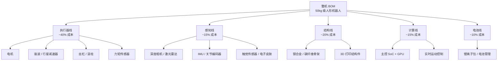

2026 年 4 月 19 日，北京亦庄第二届人形机器人半程马拉松，「闪电」跑出 48 分 19 秒夺冠，快过人类半马世界纪录（基普利莫 2025 年在巴塞罗那跑出的 56 分 42 秒），也领先同场的人类冠军约 17 分钟。一年前首届赛事，天工 Ultra 拿冠军用了 2 小时 40 分 42 秒。一年时间，机器人的长距离奔跑速度翻了三倍。智元机器人同在 2025 年 1 月官宣累计下线 1000 台，Figure 02 进了宝马工厂，特斯拉的 Optimus 在弗里蒙特工厂分拣电池。

这些事件背后有一个共同的工程事实，视频简介里的说法是：人形机器人几乎每天都在承受接近车祸级别的冲击，还要站稳不散架。

硅谷 101《空翻之后，它还要学会接住一片落叶？拆解机器人「肉身」、量产与供应链》（BV1hjV96MEUE，38 分 37 秒，2026-06-01 发布）把这层意思讲得更直白：厉害的不是某一个动作，是它背后那套复杂的身体系统。

这期节目的嘉宾覆盖了三个视角：智元机器人合伙人、高级副总裁王闯（整机厂），前特斯拉人工智能硬件负责人 Kerry 刘向科（头部公司硬件），一位匿名的机器人公司前采购总监（供应链）。这篇文章以节目为骨架，按电机、减速器、丝杠、力矩传感器四条主线拆开机器人的「肉身」，回答两个问题：为什么机器人过去两年进化这么快；为什么 2026 年之后，单点技术领先不够用了。

文中公司时间线均取自可公开核查的事件；技术规格与价格标注了口径（公司官网、发布会或行业报道的量级估算），节目里嘉宾给出而无法回放核对的数字，单独标注「节目口径」。2026 年下半年的部署数字以各公司公告为准，本文不外推。

---

## 一、机器人圈 2023–2026 时间线：从舞台到仓库

拆供应链之前，先看这三年发生了什么。判断标准不是「又一家公司发了新品」，而是哪台机器人在真实环境里跑了多久、能干什么活。

| 时间 | 事件 | 工程意义 |
| --- | --- | --- |
| 2023-08 | 宇树发布首款全尺寸人形 H1（65 万元起），智元发布远征 A1 | 国产全尺寸人形起步 |
| 2023-12 | 特斯拉发布 Optimus Gen 2 演示：双手 22 个自由度，比 Gen 1 减重 10 kg | 头部公司自研路线定型 |
| 2024-01 | Figure 与宝马宣布合作，在其斯帕坦堡工厂试点 | 美国路线进入真实车厂 |
| 2024-04 | 波士顿动力发布电动 Atlas，液压版同月退役 | 全行业转向电驱的标志 |
| 2024-05 | 宇树 G1 发布，9.9 万元起 | 消费级价格信号 |
| 2024-08 | 智元发布远征 A2 系列（含 A2-Max）与灵犀 X2；Figure 02 发布并进宝马试点 | 机型矩阵成型，中外同步 |
| 2025-01 | 智元官宣第 1000 台通用具身机器人下线 | 国产量产里程碑 |
| 2025-04 | 北京亦庄首届人形机器人半马，天工 Ultra 以 2:40:42 夺冠 | 全球首届，机器人跑完 21 公里 |
| 2025-07 | 优必选 Walker S2 发布，支持自主换电 | 工业场景连续作业 |
| 2025-10 | Figure 03 发布，配套 BotQ 量产工厂 | 美国路线转向量产基建 |
| 2026-04 | 亦庄第二届人形半马，「闪电」48 分 19 秒夺冠，超越人类半马世界纪录 | 运动能力一年内三级跳 |
| 2026-08 | 第二届世界人形机器人运动会，百米跑出 8.86 秒 | 运动能力进入赛事化检验 |

把表竖着看，三段式：

- 2023–2024 年，机器人能跑能跳，主要在发布会视频里。
- 2025 年，机器人进工厂，智元下线千台，Figure 02、Walker S 系列车厂实训。
- 2026 年，比的是谁跑得久、谁不停机——半马破人类纪录、运动会百米破 9 秒，都是耐久和可靠性的公开测试。

「空翻 → 半马 → 工厂分拣」这条路径，是从舞台炫技切到工业部署。每一步的工程难度都比上一步高一个量级，而最陡的那一跃不在动作本身，在于机器人不能停。

---

## 二、机器人的「肉身」由什么构成

先拆硬件 BOM（Bill of Materials，物料清单）。以一台 1.7 米级、50 公斤级的人形机器人为例，硬件大致分五条线：

_执行器线（电机 + 减速器 + 丝杠 + 力矩传感器）约占整机 BOM 四成，比例为行业报道口径的量级估算，也是过去两年供应链变化最剧烈的一环。_

五条线里执行器线最贵也最难，三位嘉宾都认可这个判断。下面按四条子线拆。

### 2.1 电机：永磁同步为主，国产替代加速

人形机器人关节电机的主流路线是无刷永磁同步电机（PMSM，Permanent Magnet Synchronous Motor），部分设计引入同步磁阻结构，扭矩密度在每公斤几十牛·米的量级。看几个公开案例：

- 宇树 G1：官网公开 23 个自由度（EDU 版可扩至 43），膝关节最大扭矩 90 N·m，整机约 35 kg，续航约 2 小时，采用低惯量高速内转子永磁同步电机
- 特斯拉 Optimus Gen 2：自研关节方案，发布会口径为双手 22 个自由度、整机减重 10 kg
- 智元、Figure：均为自研关节模组，智元部分型号交由国内伺服电机厂代工

国产电机厂进入整机供应链从 2023 年起明显加速，鸣志电器、雷赛智能、双环传动等都有公开配套信息。整机厂更常见的做法是「控制算法自研 + 电机本体国产代工」。

关节电机为什么几乎都选 PMSM，而不是更便宜的有刷电机？机器人关节每一秒都在频繁启停、正反转，有刷电机的电刷在这种工况下磨损极快，撑不过量产要求的几千小时寿命。PMSM 靠转子永磁体建立磁场，没有电刷，寿命长、噪音低；代价是控制复杂，要靠矢量控制（FOC）实时跟踪转子位置。这门控制功夫恰好是国产伺服驱动近几年追平日系厂商（安川、多摩川）的方向。

### 2.2 减速器：谐波减速器是瓶颈中的瓶颈

减速器把电机的高转速（每分钟上万转）降到关节需要的低转速（每分钟几十转），同时放大扭矩几十倍。一台 40 关节的人形机器人，需要 30–40 个减速器。

公开供应链格局：

- 谐波减速器：日本哈默纳科（Harmonic Drive Systems）在全球谐波减速器市场份额约 60%（行业通用口径），国产替代是绿的谐波、来福谐波、同川科技
- 行星减速器：日本新宝、德国威腾斯坦占高端，国产有纽氏达特（纽卡特）等
- RV 减速器：日本纳博特斯克主导，国产替代是双环传动、巨轮智能

谐波减速器难在哪？它靠柔轮被波发生器挤压出周期性弹性变形来传力：刚轮固定、柔轮转动，一次啮合完成降速。三个核心零件就实现了超大减速比，重量轻、几乎零背隙，天然适合关节。代价是柔轮要承受千万次反复弹性变形，对材料疲劳寿命和加工精度的要求都在微米级，全球能稳定量产的厂商是个位数。

「瓶颈中的瓶颈」还有产能账。人形机器人单台用 30 个以上减速器，按行业媒体对 2026 年数万台级出货的预期倒推，年需求是百万个量级；绿的谐波等头部国产厂的年产能至今仍在几十万到百万台的量级爬坡。价格上，进口谐波减速器长期在数千元一只，国产放量后明显下探；即便如此，减速器仍是单台 BOM 里最重的一块。整机厂想跨过年产万台这条线，先要把国产减速器的供应和良率打通——智元、宇树、优必选的共同动作，都是自研关节模组，同时投资或战略绑定国产减速器厂。

### 2.3 丝杠：行星滚柱丝杠的国产化拐点

旋转驱动器带动转动关节，但膝关节、踝关节、腰部升降需要直线伸缩，这就轮到丝杠：把电机的旋转运动转换成直线推力。人形机器人的线性关节用滚珠丝杠或行星滚柱丝杠。

- 行星滚柱丝杠是高端方案，德国 INA（舍弗勒）、瑞士 SKF 长期主导。它的寿命是同尺寸滚珠丝杠的十倍以上，承载能力高数倍（行业报道口径）
- 国产阵营：博特精密、秦川机床、恒立液压、鼎智科技在 2023–2025 年陆续拿出样品
- 2025 年下半年起，主流整机厂开始把行星滚柱丝杠纳入新型号 BOM

滚珠丝杠靠滚珠在螺纹间滚动传力，接触点少，扛不住反复重载冲击；行星滚柱丝杠改用一排滚柱同时啮合，受力分散，寿命和承载都上一个台阶。代价是结构复杂、加工环节多、良率难控，这正是国产厂商卡住的点。

2026 年这条线就看一件事：哪家国产厂能把行星滚柱丝杠的良品率稳定做到 90% 以上、把单价压进千元区间。做到的，会成为下一轮机器人产业链的投资标的。

### 2.4 力矩传感器：精度与成本的赛跑

力矩传感器让机器人知道自己正在用多大力。没有它，关节只能按位置指令盲转，碰到障碍物也不知道收力；有了它，控制器才能做力控——拧螺丝时既压紧又不拧爆。主流结构是应变片加弹性体，分关节扭矩传感器（每个关节一两个）和末端六维力传感器（手腕、脚踝）。

- 进口：美国 ATI、德国 HBM，单只数千到上万元（行业报道口径）
- 国产：坤维科技、宇立仪器、海伯森等，价格明显低于进口同类
- 2024 年起的趋势：力矩传感器与编码器一体化，两个部件合成一个，省空间省成本

「六维」指同时测出三维空间里的 3 个力分量和 3 个力矩分量，等于一只传感器把整个手腕的受力状态测全。要解出这 6 个量，得在弹性体不同位置贴多组应变片做矩阵解耦，标定和温漂补偿都难。到 2026 年，国产单维和多维力传感器已经量产，六维力传感器仍以进口为主，是四条子线里最没被攻下的一格。

---

## 三、「肉身」降本：从六七十万到十万元以内

把四条供应链子线汇总，整机成本的下移看得非常直接。下面是宇树两代产品的公开定价，一条真实的锚点链：

| 时间 | 公开价格锚点 | 说明 |
| --- | --- | --- |
| 2023-08 | 宇树 H1 65 万元起 | 首款国产全尺寸人形的公开售价 |
| 2024-05 | 宇树 G1 9.9 万元起 | 全尺寸人形首次进入十万元以内 |

从 65 万到 9.9 万，宇树用了 21 个月。同期实验室原型机的整机成本普遍在几十万到百万元区间（行业报道口径），下降由三件事驱动：国产谐波减速器和电机替代进口、单一型号规模化摊薄模具与产线成本、关节模组集成度提高减少零件数。

三位嘉宾在节目里分别给过整机厂的定价逻辑（以下为节目口径）：

- 王闯（智元）：通用平台加行业定制。硬件平台统一（远征 A 系列），上层能力按行业适配（汽车、3C、仓储），避免每进一个行业就重做一套硬件。
- Kerry 刘向科（前特斯拉）：自家工厂做试验场。弗里蒙特的电池产线是现成的测试环境，机器人故障的成本由工厂内部消化。
- 匿名采购总监：未来两三年，关键不是哪家技术最好，而是谁能在万台级年产量下把单台成本压进十万元。跨过这条线，资本会跟着出货量走。

---

## 四、空翻、半马、工厂分拣：三个动作隔着几道门槛

硅谷 101 节目的标题比喻是「空翻之后，它还要学会接住一片落叶」。这背后是从「表演型」到「实用型」的跨越。

下表是我按公开演示内容对工程难度做的量级排序（相对倍数为作者粗估，不是任何技术报告的实测数据）：

| 动作 | 相对难度（粗估） | 关键能力要求 | 摔倒代价 |
| --- | --- | --- | --- |
| 原地站立 | 1× | 静态平衡 | 容易起身 |
| 平地行走 | 5× | 动态平衡、步态规划 | 较容易起身 |
| 空翻 / 功夫 | 20× | 瞬时高扭矩、缓冲控制 | 难自行起身 |
| 半马（21.1 km） | 50× | 长时续航、散热、关节寿命 | 高温高损耗 |
| 工厂分拣 | 100× | 重复定位精度、长时间稳定、力控 | 停机即产线损失 |
| 家庭陪护 | 200× | 人机共处安全、多任务 | 摔人比摔机更糟 |

空翻和半马是性能上限的展示，工厂分拣和家庭陪护是 24×7 不出错的下限保障。一台能空翻起身的机器人，到能在工厂连续一个班次不出故障，中间隔着可靠性的整段工程，而不是再刷一个动作纪录。这也是为什么 2026 年的运动能力赛事（半马、运动会百米）值得看：它们第一次把耐久性放进了公开可比的赛道，而不是剪辑过的发布会视频。

---

## 五、为什么单点技术领先已经不够用

视频结尾抛出的判断是：当供应链越来越成熟，决定一家机器人公司能不能跑出来的，是单点技术还是系统整合能力。四组对照：

- 液压 vs 电驱：波士顿动力 Atlas 的液压方案曾是运动能力的天花板，但成本高、维护重、漏油问题难解。2024 年 4 月电动 Atlas 发布、液压版退役之后，全球主要人形机器人路线基本收敛到电驱。
- 自研 vs 代工：宇树自研关节模组，智元自研加部分国产代工，优必选部分外购。自研程度越高，毛利空间越大，但量产爬坡越慢；反过来，代工比例高的公司出货快，议价权弱。这是每家整机厂 2026 年都要做的取舍，没有标准答案。
- 软件 vs 硬件：执行器技术路线趋同之后，差距转移到软件怎么调度硬件。同样的电机、减速器、传感器，配上端到端 VLA（Vision-Language-Action，视觉-语言-动作）模型和传统运动控制器，跨越复杂地形的表现完全不同。器件上分不出的胜负，在软件上拉开。
- 资本 vs 出货：Figure 一家在 2025 年 9 月完成超 10 亿美元的 C 轮融资（估值 390 亿美元），1X、Apptronik 的累计融资在数亿美元量级；而中国阵营里，智元在 2025 年 1 月就官宣下线第 1000 台。美国公司用融资买技术深度，中国公司靠供应链把量产门槛降下来。这不是谁技术更强的差异，是两种工程路径的差异。

未来两三年，单点技术领先（比如跑酷性能）能撑起品牌，撑不起出货。决定出货的是系统整合：BOM 优化、供应链管理、生产良率、整机可靠性测试。这些环节没有发布会，只有产线。

---

## 六、头部五家：两条路线怎么分

按公开材料，把 2026 年上半年头部五家的进展列一张表。台数与金额均为公司官宣或行业媒体引述的口径，不是审计数字：

| 公司 | 代表机型 | 公开量产/部署节点 | 主要场景 |
| --- | --- | --- | --- |
| 特斯拉 | Optimus Gen 2 | 2025 年起在弗里蒙特工厂承担电池分拣类任务（公司公开视频与口径） | 自家工厂 |
| Figure | Figure 02 / 03 | 宝马工厂试点；2025-10 发布 Figure 03 与 BotQ 工厂 | 汽车制造 |
| 宇树 | H1 / G1 | G1 定价 9.9 万元起；2024 年公司整体营收超 10 亿元（创始人访谈口径） | 科研、展演、消费 |
| 智元 | 远征 A2 系列 / A3 | 2025-01 官宣累计下线 1000 台 | 汽车、3C、仓储 |
| 优必选 | Walker S / S2 | 2024 年起在多家车厂实训；Walker S2 支持自主换电 | 汽车制造 |

五家分两类：

- 自上而下：特斯拉、Figure。先用 AI 模型能力回答「机器人能干什么」，拿单点客户突破，再用规模降本。
- 自下而上：宇树、智元、优必选。先用国产供应链回答「机器人能不能量产」，多行业并行铺开，再靠规模打价格。

2026 年这个时点，自下而上派在出货量上领先，因为供应链和量产是已经发生的工程事实；自上而下派的端到端模型还需要更多真实部署数据喂养。两条路线的胜负，要到工厂班次和家庭场景里见。

---

## 七、判断一家人形机器人公司的四个维度

看完供应链和时间线，可以给出一套判断框架：

量产台数。累计出货决定供应链议价权。智元 2025 年初的千台下线是一个参照点，低于千台的公司，量产风险尚未释放。

单台成本。BOM 能否压进十万元以内。压不进，量产的经济学不成立。

单台可靠工作时间。工厂要的是一整个班次不停机，MTBF（Mean Time Between Failures，平均无故障时间）是核心指标，目前头部厂商都在朝数百小时量级爬坡（节目口径）。

软件调度能力。能否跑通端到端 VLA 或力反馈实时控制。做不到，硬件再便宜也只是表演型机器人。

四项对照 2026 年上半年：宇树和智元在量产台数与单台成本上领先；特斯拉和 Figure 在软件调度上领先；优必选的多车厂交付经验是它的位置。硅谷 101 这期节目三位嘉宾拼出来的，不是哪家公司会赢，而是人形机器人已经从 PPT 走到产线、走到工位这个事实本身。

---

## 八、结语：下一个分水岭在软件调度

过去两年最大的变化，不是谁会空翻，而是四条供应链线的国产替代基本完成，整机价格从六七十万级压到十万元以内。几句常被误读的话，值得拆开：

「机器人进化快 = AI 变强」只对了一半。半马成绩一年翻三倍，靠的是电机、减速器、丝杠这些「肉身」部件的成熟，模型只是把肉身的潜力放出来。

「会空翻 = 能干活」错在难度方向。空翻是 20× 的瞬时性能，工厂班次是 100× 的持续可靠性，方向完全不同。

「单点技术最强就能赢」在 2026 年不再成立。Atlas 的液压路线曾是最强单点，电动化之后整条路线退役；中国厂商量产过千台，靠的是供应链整合，不是某一项技术参数领先。

这几条误读指向同一个分水岭：软件调度能力。同样一台十万元以内的硬件，配上端到端模型就能在产线分拣电池，配传统控制器只能在舞台上踢腿。硬件拉不开差距的时候，差距全在软件怎么用它。

2026–2028 年，竞争重心会从单点技术转到软硬件协同的整机可靠性。空翻和半马还会有人继续刷，但真正决定订单的，是能在 8 小时班次里全程不出错的那批机器人。

## 九、读者判断：这篇文章够不够

- 读本文就够了：想了解机器人「为什么过去两年突然能干活」，本文按电机、减速器、丝杠、力矩传感器四条线拆完，重点结论都在。
- 建议回去看原片（BV1hjV96MEUE）：想听三位嘉宾的现场表达和追问细节，文字转写会丢信息。原片 38 分 37 秒，适合通勤时听。
- 说明：本文未标注引语在视频中的具体时间点，回看时按章节主题定位即可；文中「节目口径」标注的数字来自嘉宾口述，无法逐字回放核对；量级估算（BOM 占比、难度倍数、价格区间）为作者或行业报道口径，不是公司披露值。

## 参考与延伸

- 硅谷 101《空翻之后，它还要学会接住一片落叶？拆解机器人「肉身」、量产与供应链》：[BV1hjV96MEUE](https://www.bilibili.com/video/BV1hjV96MEUE)（2026-06-01 发布，本文骨架来源）
- 北京亦庄人形机器人半程马拉松（2025、2026 两届）赛事公开报道；央视新闻「48 分 19 秒！2026 人形机器人半马冲线时刻」（2026-04）
- 第二届世界人形机器人运动会（2026-08）赛事公开报道
- 宇树 Unitree H1 / G1 官网技术规格页（unitree.com）
- 智元机器人第 1000 台通用具身机器人下线公告（2025-01）及远征系列发布会材料
- 特斯拉 AI Day 2021 / 2022 及 Optimus 后续公开更新
- Figure 公司公告：宝马合作（2024-01）、Figure 02（2024-08）、Figure 03 与 BotQ 工厂（2025-10）
- 优必选 Walker S / S2 公开发布材料
- 行业报道：谐波减速器国产替代、行星滚柱丝杠国产化、六维力传感器市场格局
