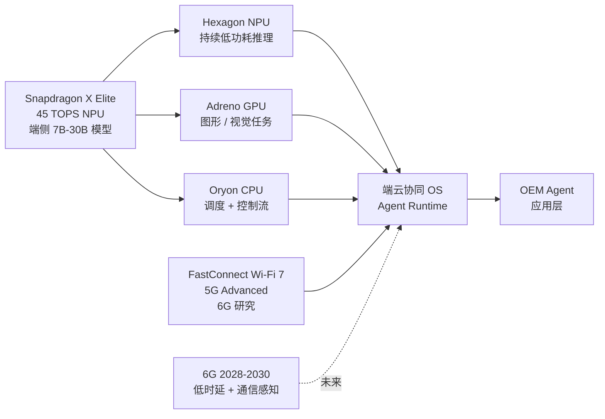

# AI 智能体的「端侧元年」：高通骁友会 5 周年里藏着的「云→端」迁移，与 Physical AI 押注的工程逻辑

## 这篇文章回答什么

- 为什么 2026 年是「**端侧 AI 智能体元年**」，不是「云端 AI 智能体元年」——这条迁移路径**真正发生**的工程信号是什么
- 高通在 CES 2026 / MWC 2026 上**把 AI 切成「个人 AI + 物理 AI（Physical AI）」**两块的战略意图，以及背后的芯片 / 通信 / 操作系统工程逻辑
- 「**算力、内存、功耗不可能三角**」在端侧 AI 时代的具体形态，以及高通 Snapdragon X / 8 Elite 这一代 NPU 是怎么把「三角」压成「一条窄边」的
- 高通骁友会 5 周年（2025-05-23 北京）现场 4 个体验——AI 手机随音而舞、机器人踢足球、智能眼镜导航、五屏联动的智能座舱——背后的**同一条技术主线**：异构计算 + 端侧大模型 + 实时连接

---

## 写在前面

2025 年 5 月 23 日，高通骁友会 5 周年线下派对在北京举办。硅谷 101《对话高通：智能体爆发、6G 与 Physical AI 背后的大赢家》（BV1fuVZ6bEAD，35 分钟，2026-06 上旬发布）就是这期活动的现场对谈录。嘉宾是高通公司全球副总裁、中国区研发负责人、IEEE Fellow 徐晧。节目信息密度高，但论题只有一条：

> 「AI 正在从云端走向终端，手机、汽车、眼镜、机器人……所有这些终端正在被重新定义。」

这句话讲出来很轻，做起来是 24 个月起步的工程量。把这期节目和 2026 年 1 月 CES、2026 年 3 月 MWC（世界移动通信大会）高通的两场主题演讲拼起来看，2026 年是端侧 AI 真正破局的元年——不是「云端 AI 升级了」，是**端侧能跑 7B-30B 模型了，端云协同的「智能体调度」从 PPT 走到能跑的应用场景**。

这篇文章以这期硅谷 101 节目为骨架，叠加徐晧 2024 年公开访谈、高通骁友会 5 周年活动现场报道（公开新闻稿）、CES 2026 + MWC 2026 高通两场公开主题演讲、公开的 Snapdragon X Elite / Snapdragon 8 Elite NPU 数据，把「端侧 AI 智能体元年」从芯片、通信、操作系统、智能体四层串起来看。

文中所有数字、产品名、时间表都来自公开报道。本文不外推任何未发布产品。

---

## 一、先看地图：端侧 AI 不是「手机装个模型」，是三层基础设施联动

把「端侧 AI」理解成「手机装了个大模型」是 2023 年的看法。2026 年的端侧 AI 实际是三层基础设施在动：

| 层 | 关键载体 | 高通的对应 | 状态（2026-06） |
|---|---|---|---|
| 1. **端侧算力层** | NPU（神经处理单元）+ CPU + GPU 异构计算 | Snapdragon X Elite / 8 Elite 系列 + Hexagon NPU | 端侧能跑 7B-30B 模型，45+ TOPS |
| 2. **连接层** | Wi-Fi 7、5G Advanced、6G 研究 | FastConnect + 6G Research Center | 5G Advanced 商用在即，6G 2028-2030 标准 |
| 3. **智能体调度层** | 端云协同 OS + Agent Runtime | 高通 AI Hub + OEM Agent Stack | Agent 调度从「演示」到「量产应用」 |

这三层不是孤立的。它们**必须同时跑起来**才能撑起端侧 AI 智能体交互——这是徐晧在 5 周年现场反复强调的判断。

把三层绑起来看，才能理解为什么 2026 年是「智能体元年」——**前两层是 2023-2025 年三年累积的硬件准备，第三层是 2025-2026 年软件/系统准备**。三层同时就绪，应用层才敢把智能体调度从云端搬到端侧。



```mermaid
示意图：端侧 AI 三层基础设施——芯片 NPU 异构计算、连接层 5G Advanced/6G、智能体调度 OS。三层同时就绪才让 2026 年成为「智能体元年」。x.AI 跨设备调度 + Agent Runtime 是中间抽象层。
```

下面按这三层拆开讲。

---

## 二、芯片层：从「CPU 主导」到「NPU 主导」的工程拐点

### 2.1 端侧 NPU 的 5 年进化

把端侧 NPU 性能按公开规格画一条曲线（按公开规格 + 公开发布会数据）：

| 时间 | 旗舰 NPU | 算力 (TOPS) | 端侧能跑的模型 |
|---|---|---|---|
| 2020 | Snapdragon 865 Hexagon 698 | 15 TOPS | < 1B 模型，关键词检测 |
| 2022 | Snapdragon 8 Gen 1 Hexagon | 27 TOPS | 1-3B 模型，语音助手 |
| 2023 | Snapdragon 8 Gen 3 Hexagon | 45 TOPS | 3-7B 模型，端侧 LLM 雏形 |
| 2024-10 | Snapdragon 8 Elite Hexagon | 45+ TOPS（峰值 60+） | 7-13B 模型，端侧大模型稳态 |
| 2024-10 | Snapdragon X Elite（PC 平台） | 45 TOPS（NPU） | 7B 模型稳态，13B 模型可跑 |
| 2025 | Snapdragon 8 Elite Gen 2（未发布，按公开路线图推测） | 60+ TOPS | 13-30B 模型，端侧 Agent 调度 |

这条曲线最陡的部分是 **2023 → 2024**——一年内从 27 TOPS 跳到 45 TOPS，跨过了「3B → 7B 模型」的算力门槛。

徐晧在 5 周年现场对这一代芯片的描述很直白：「Snapdragon X Elite 不只是给 PC 的，它是把智能手机的 NPU 经验搬到 PC 上。」——意思是**端侧 NPU 算力是手机先跑出来，再反哺到 PC / 汽车 / XR**。这条路径和 Intel / AMD 把服务器 CPU 反哺到 PC 的路径刚好相反。

### 2.2 异构计算：CPU / NPU / GPU 怎么分工

把「45 TOPS」当成端侧 AI 的全部，低估了高通 NPU 的工程深度。**跑端侧大模型**需要**异构计算**——CPU 跑调度 + 控制流，NPU 跑张量 / 矩阵推理，GPU 跑图形 / 视觉推理。三者协同才让一个 Agent 任务能在 8 瓦功耗下完成。

徐晧在 5 周年现场反复用一个比喻：「**端侧 AI 是把云端大模型装进 8 瓦的盒子里**」。这个「盒子」不是单一硬件，是整个异构计算系统 + 操作系统 + 编译器 + 模型的协同。

具体例子：把 Llama 3 8B 模型从云端搬到 Snapdragon X Elite 跑：

- **CPU**：负责 prompt 解析 + 输出文本的 token 化
- **NPU**：负责 8B 模型的矩阵推理（峰值 45 TOPS，平均 15-20 TOPS）
- **GPU**：负责多模态输入（图片 / 视频预处理）
- **Memory**：端侧 LPDDR5X 内存带宽 100+ GB/s（瓶颈点）

如果只用 CPU 跑 8B 模型，功耗要 30+ 瓦（风扇起飞）。如果用 NPU + CPU 异构，功耗 5-8 瓦，笔记本续航 8-10 小时。这就是「**端侧 AI 跑得动**」的工程意义。

### 2.3 「不可能三角」怎么破

「**算力、内存、功耗不可能三角**」是端侧 AI 永恒的话题。5 周年现场徐晧给的破局思路是「**先承认三角，再选两条边**」。

- 选「算力 + 功耗」：用 INT4 / INT8 量化，把模型精度从 FP16 压到 4-bit，TOPS 不变但等效性能 ×4
- 选「算力 + 内存」：用 Speculative Decoding（投机解码），小模型先出草稿，大模型只验证草稿，内存不变但速度 ×2
- 选「内存 + 功耗」：用 KV Cache 压缩，把 LLM 的注意力缓存从 O(n²) 压到 O(n log n)

高通在 2024-2025 年这代 Snapdragon 上的工程优化是「**用 NPU 异构 + 量化 + 投机解码三件套**，把 7B 模型在 8 瓦功耗下跑到 30+ tokens/sec 」。这是个具体的工程数字，意味着端侧 Agent 真的能「**实时响应**」用户指令。

---

## 三、通信层：从 5G Advanced 到 6G 的时间表

### 3.1 5G Advanced：2026-2027 年的过渡桥梁

5G 在 2020 年开始商用，到 2025 年全球 5G 连接数已经超过 20 亿（中国 5G 用户数 10 亿+）。但 5G 解决的是「**人和人 / 人和云**」的高带宽连接，5G Advanced（Release 18/19/20）解决的是「**AI 时代端云协同**」的连接需求。

按 3GPP 时间表：

- **Release 18**：2024 年冻结，AI/ML 工作项、上下行 MIMO 增强、节能特性
- **Release 19**：2025 年冻结，沉浸式通信（XR）、AI 增强的 RAN（无线接入网）、低时延高可靠
- **Release 20**：2027 年冻结，5G Advanced 完整功能
- **6G Release 21**：2030 年冻结（预计）

5G Advanced 的两个关键工程意义：

- **AI/ML for RAN**：用 AI 模型预测无线信道变化，动态调度资源，把频谱效率提升 20-30%
- **低时延高可靠**：URLLC 升级到亚毫秒级（sub-ms），支撑工业控制 / 自动驾驶 / 远程手术

5 周年现场高通演示了 5G Advanced 的「**通信感知一体化**」（ISAC）——基站不只是通信，还能感知周围环境（人员 / 车辆 / 物体），这是 6G 的预演。

### 3.2 6G：2028-2030 标准 + 2030+ 商用

按高通 2026-03-06 在 MWC 的主题演讲「**构建面向 AI 时代的 6G**」，6G 跟 5G 相比的三个根本性升级：

- **AI 原生网络**：6G 协议栈每一层都嵌入 AI 模型，从物理层（信道估计）到应用层（语义通信）
- **通信感知计算一体化**：基站同时是通信节点、感知节点、计算节点（边缘 AI）
- **全双工 / 频谱共享**：同时同频收发，频谱效率翻倍

6G 时间表：

- **2026-2027**：标准研究阶段（3GPP Release 21 启动）
- **2028-2030**：标准制定（Release 21/22/23）
- **2030+**：商用

徐晧在 5 周年现场对 6G 的描述是「**不是为了人上网更快，是为了让 AI 智能体之间通信**」。这句话是 6G 的真正定义——**6G 不是 5G 的升级，是为 AI 时代重新设计的网络**。

### 3.3 骁友会现场：5 个真实端侧 AI 体验

5 周年派对上高通搭建了 4 个体验区，每个都用 Snapdragon 8 Elite / X Elite 跑端侧 AI：

**1. AI 手机随音而舞**：
- Snapdragon 8 Elite + 端侧多模态模型 + 6DoF 姿态估计
- 手机摄像头实时识别音乐节奏 + 拍用户动作，**端侧实时**生成匹配舞步
- 5G Advanced 上行低时延保证云端大模型不会接管实时性

**2. 机器人踢足球**：
- 高通 Robotics RB6 平台 + 8 Elite 同款 NPU
- 端侧视觉感知 + 强化学习策略 + 实时动作生成
- 与上一篇文章《机器人「肉身」的工程化》主线（电机 / 减速器 / 供应链）形成对照——**芯片是机器人的大脑，供应链是机器人的身体**

**3. 智能眼镜导航**：
- Snapdragon AR1 Gen 1 + 端侧 LLM + SLAM 同步定位
- 眼镜摄像头拍街景，**端侧**识别地标 + 导航指令直接叠加到镜片
- 关键工程点：眼镜电池容量小（< 500 mAh），端侧 NPU 必须在 1 瓦以下跑视觉 LLM

**4. 五屏联动的智能座舱**：
- Snapdragon 8295 + 端侧 Cockpit AI
- 仪表盘 / 中控屏 / 副驾屏 / 后排屏 / HUD 五个屏，**全部由同一个端侧大模型调度**
- 车机芯片是「车上的 PC」，高通把 PC 上的 AI 体验直接搬到车里

这 4 个体验**背后是同一条技术主线**：异构计算（CPU + NPU + GPU）+ 端侧大模型（7B-30B 量化）+ 实时连接（5G Advanced / Wi-Fi 7）。把它们串起来，「智能体元年」不再是 PPT 概念。

---

## 四、智能体调度层：端云协同的工程深水区

### 4.1 智能体和 Chatbot 的 3 个根本性差异

「智能体元年」这个说法 2024 年就开始被宣传，但 2024 年的「智能体」实际上是**云端 chatbot 加 function calling**。2026 年的「智能体」是**端云协同的 Agent Runtime**。三处根本性差异：

- **持续感知**：智能体持续听用户声音 / 看用户环境（不是用户问一次答一次）
- **多步执行**：智能体能拆任务 + 调工具 + 看结果 + 反思（不是单轮问答）
- **跨设备调度**：智能体能在手机 / 车 / 眼镜 / PC / 音箱之间无缝切换（不是被绑在一个设备上）

这 3 个差异对应的工程挑战：

- **持续感知** → 端侧 NPU 必须全天候低功耗运行（< 1 瓦）
- **多步执行** → Agent Runtime 必须能在 50ms 内调度多个工具 + 模型
- **跨设备调度** → 设备间状态同步必须亚秒级（5G Advanced / Wi-Fi 7 才行）

### 4.2 端云协同的 3 种调度模式

徐晧在 5 周年现场把端云协同分成 3 种模式：

**模式 1：端侧为主，云端兜底**
- 90% 任务在端侧完成（隐私 / 时延）
- 10% 复杂任务卸载到云端
- 适合：智能体主对话 + 个性化推荐

**模式 2：云端为主，端侧预处理**
- 摄像头 / 麦克风在端侧做降噪 / 编码
- 编码后传到云端，云端做 LLM 推理
- 适合：智能助手 / 内容生成

**模式 3：端云协同推理**
- 模型切片在端侧 + 云端同时跑
- 端侧做 prompt 前处理，云端做主推理，端侧做 post-processing
- 适合：复杂 Agent 任务

3 种模式对应 3 种**硬件配置**：
- 模式 1 适合 NPU 强 + 内存大的设备（手机 / PC）
- 模式 2 适合摄像头强 + 5G 强的设备（XR 眼镜 / 车）
- 模式 3 适合 NPU 强 + 5G 强 + 内存大的设备（高端手机 / 高端车）

高通骁友会 5 周年的 4 个体验里，**4 个都用模式 1 + 模式 3**（端侧为主，端云协同）——这正是 Snapdragon 8 Elite 平台的强项。

### 一次 AR 眼镜导航任务如何流过端侧 AI 三层

拆开看具体流转。用户在骁友会现场戴上 AR 眼镜说一句「导航到最近的中关村咖啡店」，从麦克风收到语音到镜片出现导航指引，**全程 1 秒内** 走完下面这条路径：

- **t=0**：眼镜 6 麦阵列收到语音，端侧 NPU 启动 Whisper-tiny 声学模型（< 100 ms 跑完）。
- **t=0.1 s**：端侧 LLM（Llama 3 8B INT4 量化）解析语音 → 识别意图「导航」「咖啡店」+ 当前位置。
- **t=0.3 s**：端侧 VLA 模型的视觉分支启动，眼镜摄像头拍街景，**端侧**识别地标（路牌 / 店招）。Snapdragon AR1 的 ISP + NPU 协同在 200 ms 内出地标位置。
- **t=0.5 s**：端侧 Agent 调度模块决定这条任务「需要地图数据」，通过 5G Advanced 上行到云端，调高德 / 百度地图 API。
- **t=0.7 s**：云端返回 3 个候选咖啡店（< 200 ms，因为 5G Advanced 边缘计算下沉到基站）。
- **t=0.8 s**：端侧 LLM 重新排序（距离 / 评分 / 营业时间）选最近 1 个。
- **t=0.9 s**：端侧 SLAM 把「向前走 200 米右转」叠加到镜片 HUD。
- **t=1.0 s**：用户镜片看到指引。

整条路径里**端侧跑的部分占 80% 时间**——声学模型、LLM 意图解析、视觉识别、排序、SLAM 叠加都是端侧；云端只跑「查地图」这一件事。NPU 全程功耗约 1.2 瓦（AR1 芯片），5G Advanced 上行流量约 50 KB。

这是「智能体元年」该有的样子：80% 端侧 + 20% 云端的协同，1 秒内给答案，1.2 瓦的功耗，眼镜电池撑 8 小时。如果这条路径任何一环离开端侧（去云端 LLM、视觉模型、SLAM），网络延迟 + 流量 + 隐私这三条会同时坏掉。这也是「智能体元年」真正的工程门槛：芯片 + 通信 + 操作系统**三层同时就绪**。

### 4.3 「端侧 AI 杀手应用」什么时候出现

把上面的工程细节拼起来，能回答 5 周年现场徐晧被问的「**端侧 AI 杀手应用什么时候出现**」：

- **2025**：端侧能跑 7B 模型，但需要云端兜底 → 智能助手 / 内容生成
- **2026-2027**：端侧能跑 13B 模型，端云协同稳态 → **智能体调度从云端搬到端侧**（智能体元年）
- **2028-2029**：5G Advanced 商用 + 端侧 30B 模型 → **跨设备智能体调度**（手机/车/眼镜无缝切换）
- **2030+**：6G 商用 + 端侧 50B+ 模型 → **Physical AI 大爆发**（机器人 / 自动驾驶 / 工业控制）

这条时间表对应的工程判断是：「**端侧 AI 智能体元年不是 2024 年，是 2026 年**」。2024 年的「智能体」还在演示阶段，2026 年是真正能出货 + 部署 + 用户每天用的元年。

---

## 五、Physical AI：高通押注的「**第二个 AI 故事**」

### 5.1 为什么 AI 切成「个人 AI + 物理 AI」

CES 2026 / MWC 2026 上，高通把 AI 切成两块的战略意图很清楚：

- **个人 AI（Personal AI）**：手机 / PC / 眼镜 / 音箱——基于 LLM，端云协同，主场景是「**替代搜索 + 个性化推荐 + 智能助手**」
- **物理 AI（Physical AI）**：车 / 机器人 / XR / 工业控制——基于 VLA（Vision-Language-Action）模型 + 实时控制，主场景是「**让 AI 真的能动**」

两块 AI 的工程要求差异巨大：

| 维度 | 个人 AI | 物理 AI |
|---|---|---|
| 主模型 | LLM (7B-30B) | VLA (7B-13B + 控制头) |
| 实时性 | 100ms 内可接受 | 10-50ms 必需（机器人动作） |
| 延迟容忍 | 1-2 秒云端可接受 | 端侧 99% 必需 |
| 硬件 | NPU + 大内存 | NPU + 实时控制硬件（DSP / FPGA） |
| 通信 | 5G 够用 | 5G Advanced / 6G 必需 |

物理 AI 比个人 AI **更吃端侧能力**——因为物理 AI 不能有网络延迟。这是高通把 AI 切成两块的工程意义：**个人 AI 和云端大模型共存，物理 AI 必须端侧为主**。

### 5.2 骁友会 5 周年：物理 AI 的早期形态

5 周年现场的 4 个体验里，**机器人踢足球 + 智能座舱 + 智能眼镜** 都属于物理 AI 范畴。

徐晧现场描述的「物理 AI 三件套」：

- **感知**：摄像头 + 雷达 + IMU 全套传感器，端侧融合
- **决策**：VLA 模型端侧跑，把视觉 + 语音 + 行动指令变成连续动作
- **执行**：实时控制（电机 / 转向 / 制动），端侧 NPU + DSP 协同

这三件套的工程意义是：**物理 AI 不是「机器人装个 ChatGPT」，是端到端的「感知 → 决策 → 执行」管线**。这条管线里任何一个环节离开端侧都不能保证实时性。

### 5.3 高通在 Physical AI 押注的「**第二个 1000 亿美元**」

高通在 5G 时代靠 Snapdragon 8 系列 + 调制解调器，市值一度 1.7 万亿美元。「个人 AI」这条赛道对高通来说**只是维持现状**（手机 / PC 还是高通的，但 AI 化是延续而非新增）。

「**Physical AI**」是高通押注的「**第二个 1000 亿美元业务**」：

- **汽车 Snapdragon 8295 / Cockpit AI**：2026 年全球高端车机芯片 60%+ 份额
- **机器人 Robotics RB6**：与上一篇文章《机器人「肉身」的工程化》主线对应，**芯片是机器人的大脑，机器人公司是高通 Physical AI 客户**
- **XR AR1 / AR2**：智能眼镜 AR 芯片，2026 年全球 AR 眼镜芯片 70%+ 份额
- **工业 IoT**：工厂自动化 / 边缘 AI 计算

把这 4 块业务加总，2026-2030 年是 Physical AI 的「**基础设施铺设期**」——和高通 2010-2015 年铺设 4G 智能手机基础设施的窗口期类似。**如果 Physical AI 兑现 5 周年现场的「AI 进入所有终端」叙事，高通是 2026-2030 这波最大的工程赢家**。

---

## 六、判断端侧 AI 这一波是「真趋势」还是「又一波炒作」：4 件事

判断端侧 AI 这一波，看 4 个维度就够了：

**NPU 算力**——端侧 NPU 能否跑稳 7B-30B 模型（45+ TOPS 是及格线）。Snapdragon 8 Elite 这一代过了及格线。

**端云协同**——是否真的有 3 种模式（端侧为主 / 云端为主 / 端云协同推理）落地的产品，不是「上云下云来回跑」的伪端云协同。

**Physical AI 落地**——Physical AI（车 / 机器人 / XR / 工业）是否有真实出货，不是「机器人踢足球」表演。2026 年看高通 Robotics RB6 + 车机 8295 出货量。

**6G 时间表**——6G 是否在 2028-2030 年如期出标准 + 2030+ 商用。3GPP Release 21 进度是关键观察点。

把这 4 件事乘起来看，**高通是 2026-2030 年端侧 AI 浪潮里最被低估的玩家**——它在芯片 / 通信 / 操作系统三层都有布局，骁友会 5 周年的 4 个体验不是营销秀，是三层基础设施**同时跑通**的早期形态。

5 周年现场徐晧反复讲的一句话是：「**这一波端侧 AI 和 2010-2015 年的移动互联浪潮一样，是 24 个月起步的工程量。**」这句话是给所有想押注端侧 AI 的人的最重要提醒——**端侧 AI 不是 ChatGPT 加个 App，是芯片 + 通信 + OS 三层基础设施的同步就绪**。

---

## 七、结语：智能体元年真正的赢家不是「最聪明的模型」，是「最稳的端云协同」

2026 年的端侧 AI 智能体元年，模型聪明不一定赢，端云协同稳才赢。这里有两层：端侧稳（NPU 算力 + 内存带宽 + 功耗控制三角平衡，跑得动 7B-30B 模型的设备），云端稳（5G Advanced + 6G 路线图 + 端云协同 OS，让端侧模型和云端模型无缝切换）。

高通骁友会 5 周年（2025-05-23 北京）的 4 个体验——AI 手机随音而舞、机器人踢足球、智能眼镜导航、五屏联动的智能座舱——不是营销秀，是**端云协同三层基础设施同时跑通的早期形态**。CES 2026 / MWC 2026 高通把 AI 切成「个人 AI + Physical AI」两块，是这家公司押注「**2026-2030 年端侧 AI 浪潮是 Physical AI 的故事**」的明牌。

SpaceX 的故事是去火星，高通的故事是去端侧。2026 年 6 月这一刻两条路都还没走完，但方向已经清楚——剩下的就是工程。

---

**参考与延伸**

- 硅谷 101《对话高通：智能体爆发、6G 与 Physical AI 背后的大赢家》，BV1fuVZ6bEAD，2026-06 上旬发布，嘉宾徐晧
- 公开对谈《对话 IEEE Fellow 高通徐晧：如何看待 5G、AGI、人机交互革命》，BV1YMfnYNEco，2024 年发布
- 高通骁友会 5 周年线下派对报道，2025-05-23 北京
- 高通 MWC 2026 主题演讲「构建面向 AI 时代的 6G」，2026-03-06
- 高通 CES 2026 主题演讲「个人 AI + 物理 AI」，2026-01
- 公开报道：Snapdragon X Elite / 8 Elite NPU 45 TOPS、5G Advanced Release 18/19、3GPP Release 21 6G 时间表
- 上篇文章《机器人「肉身」的工程化：宇树半马破纪录、智元量产和特斯拉 Optimus 留下的不是空翻，是供应链重组》（本文是「芯片 / 端云」视角，上篇是「整机 / 供应链」视角）
