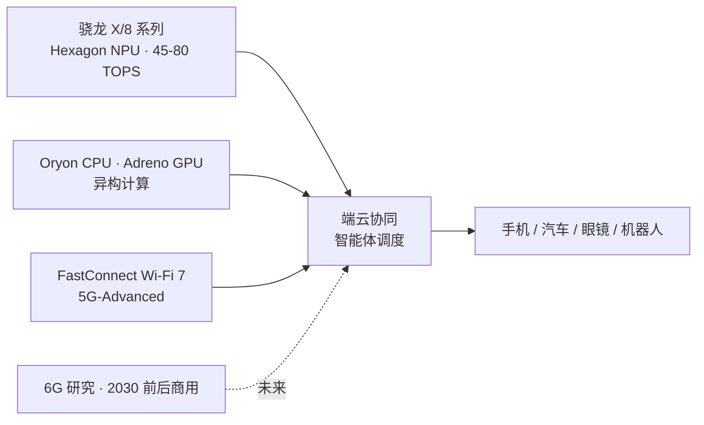

2026 年 6 月 2 日，硅谷 101 在 B 站发布《对话高通：智能体爆发、6G 与 Physical AI 背后的大赢家》（[BV1fuVZ6bEAD](https://www.bilibili.com/video/BV1fuVZ6bEAD)，35 分 06 秒）。录制地点是高通骁友会五周年活动现场，嘉宾为高通公司全球副总裁、中国区研发负责人徐晧（IEEE Fellow）。截至 2026-09-24 查询，播放约 20.6 万。视频简介开头交代了整期节目的主线：

> AI正在从“云”走向“端”，手机、汽车、眼镜、机器人等等这些终端都正在被重新定义。

先把证据边界说清楚：这期视频没有可公开引用的官方字幕，本文不做逐句转录。文中唯一保留引号的句子来自官方视频简介，其余不带引号的表述，均为本文基于公开材料的分析或推演；涉及的时间、规格、营收数字都标注了来源，查不到出处的没有写。

视频简介里有两个关键词定了调：一个是「AI 智能体的元年」，另一个是「算力、内存与功耗的不可能三角」。整场对话不是芯片发布会的复述，它在回答一个更基础的问题：**AI 智能体要从云端落到手机、汽车、眼镜和机器人上，基础设施得先就绪到什么程度。**

## 一、端侧 AI 是三层基础设施同时就绪

把「端侧 AI」理解成「手机装了个大模型」，是 2023 年的看法。到 2026 年，它实际是三层基础设施一起动：

| 层 | 关键载体 | 公开口径（2026-06） |
| --- | --- | --- |
| 1. 端侧算力层 | 骁龙 X/8 系列移动平台 + Hexagon NPU（高通的神经网络处理单元） | X Elite 的 NPU 算力 45 TOPS，官方称可在端侧运行 13B 参数级大模型；2025 年 X2 系列把 NPU 算力提到 80 TOPS |
| 2. 连接层 | FastConnect Wi-Fi 7、5G-Advanced、6G 研究 | 5G-Advanced 对应 3GPP Release 18/19/20，Rel-18 已于 2024-03 功能冻结 |
| 3. 智能体调度层 | 高通 AI Hub、端云协同开发工具链 | AI Hub 2024 年上线，负责把模型部署到高通硬件 |

视频简介里那句「高通又是如何把芯片、通信和端侧 AI 放到同一个布局里的」，说的就是这三层的耦合。它们不是各自独立的产品线：算力层决定单台设备能跑多大的模型，连接层决定端和云怎么分工，调度层决定开发者的模型能不能顺利落到芯片上。三层同时就绪，「智能体元年」这个说法才有讨论的基础——任何一层缺位，智能体要么跑不动，要么只能退回纯云端。

```mermaid
flowchart LR
  A[骁龙 X/8 系列<br>Hexagon NPU · 45-80 TOPS] --> E[端云协同<br>智能体调度]
  N[Oryon CPU · Adreno GPU<br>异构计算] --> E
  H[FastConnect Wi-Fi 7<br>5G-Advanced] --> E
  G[6G 研究 · 2030 前后商用] -.未来.-> E
  E --> F[手机 / 汽车 / 眼镜 / 机器人]
```

_示意图：端侧 AI 的三层结构——算力层的 NPU 异构计算、连接层的 Wi-Fi 7 与 5G-Advanced、调度层的端云协同；6G 是尚未落地的远期变量。_

下面按这三层拆开讲。

## 二、芯片层：NPU 进化与「不可能三角」

### 2.1 端侧 NPU 的几个可验证锚点

高通旗舰芯片的 NPU 算力（TOPS，每秒万亿次运算），公开材料里有明确数字的节点不多，先把它们排成一条线：

| 时间 | 平台 | NPU 算力（公开口径） | 备注 |
| --- | --- | --- | --- |
| 2019-12 | Snapdragon 865 | 15 TOPS | 第五代 AI 引擎 |
| 2020-12 | Snapdragon 888 | 26 TOPS | 第六代 AI 引擎 |
| 2023-10 | Snapdragon X Elite（PC 平台） | 45 TOPS | 官方称支持端侧运行 13B 参数级大模型 |
| 2025-09 | Snapdragon X2 系列 | 80 TOPS | 官方口径见微软 Surface 对骁龙 X2 的介绍页 |

还有一个口径问题：8 Gen 3 与 8 Elite 两代手机旗舰的公开材料没有给出统一的 TOPS 数字，高通改用相对上一代的性能百分比来描述 NPU 升级。这不是数据缺失，是口径转变：对跑大模型来说，峰值 TOPS 撑不起结论，真正的约束是下面这三样。

另外这条演进路径有个容易被忽略的细节：端侧 AI 算力是手机先跑出来，再反哺到 PC 和汽车，X Elite 的 Hexagon NPU 直接继承了手机侧的积累。这和传统 PC 厂商从服务器往笔记本下放技术的路径方向相反。

### 2.2 异构计算：45 TOPS 之外的真约束

只看 NPU 峰值算力会高估端侧 AI 的能力。跑一次端侧大模型推理，实际是 CPU、NPU、GPU 分工协作：CPU 负责调度和控制流，NPU 承担矩阵运算主体，GPU 处理图形与视觉任务，内存带宽则是三者共同的瓶颈。

用一组示意估算看这件事的量级（非官方数据，仅用于建立直觉）：云端 8B 参数级模型的推理可以轻松占用几十瓦功耗，而手机和笔记本留给 AI 的功耗预算只有个位数瓦。所以端侧的工程问题从来不是「算力够不够」，而是**在几瓦的功耗预算里，内存带宽、散热和续航能不能同时过关**。同样的模型，云端可以堆卡硬算，端侧必须每一毫焦都算得值。

### 2.3 不可能三角的三条工程路径

算力、内存、功耗互相牵制，社区习惯称之为不可能三角。它没法被「打破」，只能针对具体场景选边妥协，公开的工程路径主要有三条：

- **量化**：把权重从 16-bit 压到 4-bit，模型体积和访存量降到约四分之一。同样的算力，要么跑更大的模型，要么出 token 更快；代价是精度损失需要校准来兜。
- **投机解码**：小模型先起草稿，大模型一次前向验证多个 token，生成速度可以提升；代价是设备里要同时驻留两套模型，用内存换速度。
- **KV 缓存管理**：KV 缓存（Key-Value 缓存，存放注意力机制的中间结果）随上下文长度线性增长，长对话阶段它是内存带宽的主要开销。压缩或复用 KV 缓存，直接决定同一台设备能撑多长的上下文。

三条路径都不新增算力，但都直接改善用户体验。端侧 AI 的竞争，很大程度上就是这些工程细节的竞争。

## 三、通信层：从 5G-Advanced 到 6G 的时间表

### 3.1 5G-Advanced：先校准两个事实

第一个事实：5G 商用始于 2019 年——韩国 2019 年 4 月 3 日首发全国商用网，中国同年 10 月底正式放号，不是 2020 年。

第二个事实：3GPP 的版本节奏是按「功能冻结」推进的，官网公示的时间表如下：

| 版本 | 功能冻结 | 主要方向 |
| --- | --- | --- |
| Release 18（5G-Advanced 起点） | 2024-03（已完成） | AI/ML 用于无线接入网、MIMO 增强、网络节能 |
| Release 19 | 2025-09（已完成） | AI 增强 RAN 走向规范、沉浸式通信、ISAC（通信感知一体化）研究立项 |
| Release 20 | 2027-03（预计，提案） | 5G-Advanced 完整能力，并行开展 6G 研究 |

未来日期是 3GPP 的规划提案，可能调整，这是官网原话。但对判断端侧 AI 来说，这张表的含义很直接：**AI 与网络的融合已经从研究课题变成规范条文**。AI/ML for RAN 让基站侧能用模型预测信道、调度资源，这是网络为 AI 时代做的第一步改造。

### 3.2 6G：研究已立项，商用瞄准 2030 年前后

按 3GPP 公开的规划，6G 研究课题在 Release 20 阶段启动，首个包含 6G 规范的版本是 Release 21，业界普遍预期商用时间在 2030 年前后。几个反复被讨论的技术方向：

- **AI 原生网络**：从物理层的信道估计起就把 AI 模型嵌进协议栈，而不是在网络优化层贴一层 AI 补丁。
- **通信感知一体化（ISAC）**：基站在通信之外同时具备感知能力，可感知周围的人员、车辆与物体。
- **更高频谱效率**：全双工、频谱共享等方向在研究中。

对端侧 AI 而言，6G 的意义不在「网速更快」，而在于为端云协同提供更低时延、更细粒度的感知与计算下沉。不过要把期待压住：6G 仍处于研究阶段，本文写作时没有任何已冻结的 6G 规范，一切具体能力都以最终标准为准。

## 四、骁友会现场：四个演示对应的工程问题

视频在正片之外还记录了现场的四个体验区，这四个演示全部来自官方视频简介的明确描述：

| 现场演示 | 简介描述的看点 | 涉及的工程问题 |
| --- | --- | --- |
| 「随音而舞」AI 手机 | 手机实时识别音乐节奏与用户动作，生成匹配舞步 | 端侧多模态模型的实时性 |
| 机器人踢足球 | 机器人在真实场地上对抗 | 视觉感知与运动控制的闭环时延 |
| 智能眼镜导航 | 街景识别与导航信息叠加到镜片 | 低功耗设备上跑视觉模型 |
| 五屏联动智能座舱 | 多块车机屏幕由端侧 AI 统一调度 | 车内多任务并发与确定性时延 |

（各演示具体搭载哪款芯片，视频简介未说明，本文不做断言；高通公开产品线中确有对应品类——座舱平台 8295、机器人平台 Robotics RB6、眼镜平台 AR1，此处仅作背景参照。）

四个演示有一个共同点：**它们都对时延敏感，而时延敏感的任务天然偏向端侧。** 舞步要跟得上节拍，机器人动作要跟得上环境，眼镜叠加要跟得上视线。这些环节一旦依赖云端往返，网络抖动会直接毁掉体验。

拿智能眼镜导航把这件事推演一遍（时间为假设值，非现场实测，仅用于演示各环节如何接力）。用户戴着眼镜说一句「导航到最近的咖啡店」：

- 眼镜麦克风阵列收到语音，端侧小型声学模型转文本，耗时可忽略；
- 端侧量化后的 LLM（大语言模型）解析意图：目的地「咖啡店」＋当前位置；
- 眼镜摄像头拍摄街景，端侧识别路牌与店招做位置校准；
- 意图明确后，设备通过蜂窝网络请求云端地图服务，这一步必须联网，因为地图数据在端侧没有；
- 云端返回候选，端侧按距离与营业时间排序，把「向前 200 米右转」叠加到镜片。

整条链路里，凡是要求实时响应的环节全部留在端侧，端侧做不了的事（地图数据）交给云端。这个分工结构就是端云协同的缩影：**实时性决定什么必须在端侧，数据与算力决定什么可以放到云端。** 如果把视觉识别或意图解析也搬到云端，时延、流量和隐私三个账会一起恶化。

## 五、端云协同的三种模式与 Physical AI

### 5.1 端云协同的三种模式

把业界讨论收敛一下，端云协同大致有三种模式（这是本文的归纳框架，不代表访谈原话）：

- **端侧为主，云端兜底**：绝大多数任务在端侧完成，复杂任务才上云。适合主对话、个性化推荐这类要实时响应的场景，前提是设备算力够强，手机和 PC 属于这类。
- **云端为主，端侧预处理**：摄像头、麦克风在端侧做降噪和编码，推理放云端。适合眼镜这类算力弱但传感器强的设备。
- **端云协同推理**：模型切片分别部署在端侧和云端，端侧做前处理与后处理，云端跑主推理。适合复杂智能体任务，但对网络的稳定性要求最高。

三种模式没有优劣，只有设备和场景的匹配。判断一个端侧 AI 产品是否成熟，看它有没有把「哪些环节在端侧、哪些在云端」想清楚，比看它宣称跑了几 B 的模型更有信息量。

### 5.2 个人 AI 与 Physical AI：同一个底座，两套约束

视频标题里的 Physical AI，对应高通近年公开叙事里的一条主线：AI 分成跑在数字世界里的个人 AI（手机、PC、眼镜），和跑在物理世界里的 Physical AI（汽车、机器人、工业设备）。两者的工程约束差异很大：

| 维度 | 个人 AI | Physical AI |
| --- | --- | --- |
| 典型终端 | 手机 / PC / 眼镜 | 汽车 / 机器人 / 工业设备 |
| 时延容忍 | 交互级（百毫秒） | 控制级（数十毫秒内） |
| 失败代价 | 答案不理想 | 人身与财产风险 |
| 部署倾向 | 端云协同 | 端侧为主，尽量少依赖网络 |

Physical AI 对端侧的要求更苛刻，原因不在性能而在责任：机器人和汽车的动作直接作用于物理世界，一次网络抖动可能就是一次事故。所以它几乎必须是端侧为主的架构，这也解释了为什么高通把汽车和机器人当作芯片业务的战略方向，而不只是「再多一类客户」。

2025 年 9 月有一个可以直接引用的落地案例：高通与宝马联合开发的自动驾驶系统发布，将首发于宝马 iX3（新世代平台首款车型）。这是高通自动驾驶能力第一次以整车合作的形式走到台前（来源：CNBC 2025-09-10 报道）。

### 5.3 为什么高通押注 Physical AI

先看家底：高通 2025 财年（截至 2025 年 9 月底）营收 442.8 亿美元，主要来自手机芯片与授权。这个基本盘依然稳固，但智能手机市场增速有限，「个人 AI」对高通来说是防守——把已有的手机和 PC 份额守住、升级。

Physical AI 则是进攻。汽车座舱与自动驾驶、机器人平台、XR 眼镜、工业边缘计算，这四条线共享同一套技术底座（NPU 异构计算 + 连接 + 端侧 AI 工具链），对应的是尚在铺设期的基础设施市场。这个位置类似高通在 4G 智能手机爆发前夜的站位：设备形态还在演化，但底层芯片供应商已经先锁定了入口。

当然，「类似 2010 年前夜的移动互联网」是一种类比推演，不是结论。它成立的前提是 Physical AI 的终端形态在 2030 年前完成从演示到出货的跨越。这需要跟踪验证，见下一节。

## 六、四个可跟踪的观察维度

判断这波端侧 AI 是真趋势还是叙事，有四个可以逐季核对的维度：

1. **端侧模型能力**：旗舰平台能否稳跑 10B 参数级以上的量化模型，NPU 算力与内存带宽是否继续按代提升（X2 系列的 80 TOPS 是最新公开锚点）。
2. **端云协同产品化**：是否有消费级产品明确采用端侧为主的调度架构，而不是「上云下云来回跑」的演示。
3. **Physical AI 出货**：汽车座舱与自动驾驶平台的装机量，机器人、XR 平台有无规模商用；高通与宝马合作的 iX3 量产表现是最近的一个观察点。
4. **6G 标准进度**：3GPP Release 20 阶段的 6G 研究是否按计划推进，Release 21 立项是否落地。

四个维度相互独立，任何一个掉队都会拖慢整体节奏。反过来说，如果四个维度都在推进，「智能体元年」就不只是营销口径。

## 七、三个容易搞错的地方

- **「端侧 AI 就是手机装个大模型」**——不对。端侧 AI 是算力、连接、调度三层同时就绪的结果。只有芯片没有工具链，模型落不了地；只有模型没有网络规划，端云协同无从谈起。
- **「NPU 算力越高，体验越好」**——不成立。峰值 TOPS 只是上限，实际体验由量化、投机解码、KV 缓存管理这些工程细节决定，内存带宽和功耗往往比算力先到瓶颈。
- **「6G 是为了让人上网更快」**——至少不全面。从公开研究方向看，6G 的重点在 AI 原生网络与通信感知一体化，服务对象既包括人也包括海量智能体与设备。它仍在研究阶段，任何具体能力都未定型。

## 八、自测

读完能回答这几个问题，说明这篇没有白看：

- 端侧 AI 的三层基础设施分别是什么？为什么缺一层都不行？
- 量化、投机解码、KV 缓存管理各自用什么换什么？
- 5G-Advanced 对应 3GPP 哪些版本？6G 商用预期在哪一年前后？
- 个人 AI 和 Physical AI 在时延与部署倾向上的核心差异是什么？

## 九、谁该去看原片

本文把 35 分钟的访谈重构成「三层基础设施 + 工程细节 + 观察维度」的分析框架。以下情况值得回原片：

1. 想听徐晧本人的论证节奏与现场语气。本文不给时间点——视频没有官方字幕，凭印象标注时戳只会制造伪信息，所以只给结构不给时戳。
2. 关心 6G 细节的读者。访谈里 6G 是重要话题，本文只保留了可核实的时间表，具体讨论需要听原片。
3. 想看四个演示的实际效果。文字给不出「随音而舞」跟拍节拍的观感，视频可以。

只需要结论和框架的读者，读到这里就够了。

## 十、结语

「智能体元年」这个说法，2024 年就有人喊，但当时撑起它的是云端模型加函数调用。2026 年这一轮的不同之处在于底座变了：NPU 算力按代增长，5G-Advanced 已经冻结，AI Hub 这类工具链把模型部署的成本打了下来。三层就绪之后，智能体从演示走向产品才有工程上的可能。

高通在这局里的位置很清楚：手机基本盘之上，用同一套 NPU 与连接底座横向覆盖汽车、机器人、眼镜和工业设备。宝马 iX3 的合作是自动驾驶这条线的第一个整车级锚点，6G 则是连接层的远期期权。这些判断里哪些能兑现，用第六节的四个维度逐季去核对就行——趋势判断的验证，从来靠日历，不靠情绪。

## 参考来源

以下链接均于 2026-09-24 访问核实。

1. 硅谷 101《对话高通：智能体爆发、6G 与 Physical AI 背后的大赢家》，Bilibili，2026-06-02 发布：[BV1fuVZ6bEAD](https://www.bilibili.com/video/BV1fuVZ6bEAD)（嘉宾头衔、四个现场演示、「不可能三角」「智能体元年」等表述出自该视频官方简介）
2. 《对话 IEEE Fellow 高通徐晧：如何看待 5G、AGI、人机交互革命》，UP「科技行者」，2025-01-24 发布：[BV1YMfnYNEco](https://www.bilibili.com/video/BV1YMfnYNEco)
3. 3GPP Releases 页面（Rel-18 于 2024-03 功能冻结、Rel-19 于 2025-09 功能冻结、Rel-20 预计 2027-03；未来日期为提案）：[3gpp.org/specifications/releases](https://www.3gpp.org/specifications/releases)
4. 5G 商用时间（2019-04-03 韩国首发）：Wikipedia [5G](https://en.wikipedia.org/wiki/5G)
5. 高通 2025 财年营收 442.8 亿美元（截至 2025-09-28 财年，源自 10-K）：Wikipedia [Qualcomm](https://en.wikipedia.org/wiki/Qualcomm)
6. 高通与宝马联合开发自动驾驶系统、首发 iX3：CNBC 2025-09-10 报道，参见 Wikipedia [BMW iX3](https://en.wikipedia.org/wiki/BMW_iX3) 所引条目
7. 骁龙 X2 系列 NPU 80 TOPS 口径：Microsoft Surface《What is Snapdragon?》[microsoft.com](https://www.microsoft.com/en-us/surface/do-more-with-surface/what-is-snapdragon)
8. 骁龙 865（15 TOPS）、888（26 TOPS）、X Elite（45 TOPS、端侧 13B 模型）为历年骁龙峰会官方公告口径
9. 本系列上一篇：《机器人「肉身」的工程化：半马跑进 48 分、智元下线千台、Optimus 进厂之后，拼的不再是单点技术》（embodied-robotics-hardware-supply-chain-2026），可对照机器人产业链视角
