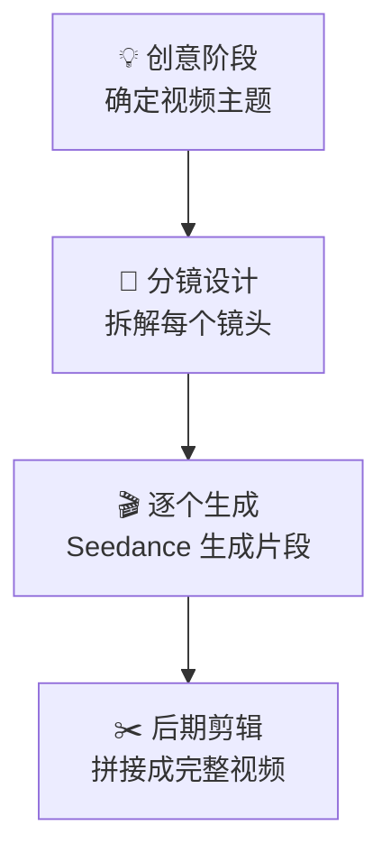

# Seedance 2.0 视频制作实战指南：从提示词到分镜的全流程教程

> **目标读者**：想要掌握 Seedance 2.0 视频生成工具的内容创作者和 AI 视频爱好者
> **核心问题**：如何用 Seedance 2.0 高效生成高质量视频？提示词怎么写？分镜怎么做？

---

## 1. 学习目标

完成本文档后，你将掌握：

- ✅ 理解 Seedance 2.0 的核心能力与局限
- ✅ 掌握 Seedance 2.0 的五模块提示词结构
- ✅ 学会设计角色参考图以保证一致性
- ✅ 理解「剪辑师思维」的分镜工作流
- ✅ 能够独立完成从创意到成片的完整流程
- ✅ 了解文生视频与图生视频的提示词差异

---

## 2. Seedance 2.0 核心原理

### 2.1 什么是 Seedance 2.0？

**Seedance 2.0** 是一款 AI 视频生成工具，由字节跳动开发。它能够根据文本描述或参考图像，生成高质量的动态视频内容。

> 💡 **重要认知转变**：Seedance 2.0 不是「一键生成电影」的工具，而是一个「智能剪辑助手」。它最擅长的是生成短片段（最多 15 秒 720p），然后通过剪辑组合成完整视频。

### 2.2 核心技术参数

| 参数 | 规格 | 说明 |
|------|------|------|
| **单次生成时长** | 最多 15 秒 | 720p 分辨率 |
| **分辨率** | 720p | 适合短视频平台 |
| **生成速度** | 快速迭代 | 适合快速出片 |
| **参考图支持** | ✅ | 图生视频模式 |
| **时长控制** | 可生成多个片段 | 后期拼接 |

### 2.3 核心理念：「剪辑师思维」

Seedance 2.0 官方团队提出的核心方法论是**「剪辑师思维」**：

> 不要想着一次生成一整段视频，要像真正的剪辑师一样，**一个镜头一个镜头地生成，最后拼起来**。

这种方法的优势：

| 传统思维 | 剪辑师思维 |
|-----------|------------|
| 一次生成完整视频 | 分镜生成每个镜头 |
| 长片段难以控制质量 | 短片段质量更稳定 |
| 后期剪辑空间小 | 后期剪辑空间大 |
| 风格一致性难保证 | 每个镜头可单独调整 |

---

## 3. 提示词工程：五模块结构

### 3.1 五模块框架概述

Seedance 2.0 官方总结了高效的提示词结构，包含五个核心模块：


### 3.2 各模块详解

#### 模块一：主体（Subject）

**定义**：视频的核心对象——人物、物体或场景。

**写作要点**：
- 使用具体名词而非抽象描述
- 加入身份或特征描述
- 保持描述简洁明了

**示例**：
```
❌ 一个人
✅ 一位身穿红色连衣裙的年轻女子
❌ 一只猫
✅ 一只橘色的英国短毛猫，正在舔爪子
```

#### 模块二：动作（Action）

**写作要点**：
- **只写一个动词**：动作越少，模型理解越清晰
- 写多了模型会「晕」
- 用精确的动作词而非模糊描述

**示例**：
```
❌ 走路、转头、看镜头、微笑
✅ 沿着石板路缓缓行走

❌ 说话、挥手、转头
✅ 转身面向镜头挥手致意
```

#### 模块三：镜头（Camera）

**定义**：摄像机的视角和运动方式。

**常用镜头术语**：

| 术语 | 英文 | 说明 |
|------|------|------|
| **远景** | Wide Shot / Long Shot | 展示整体环境 |
| **全景** | Full Shot | 展示角色全身 |
| **中景** | Medium Shot | 膝盖以上 |
| **近景** | Close-up | 胸部以上 |
| **特写** | Extreme Close-up | 脸部/细节 |

**镜头运动**：
```
静止类：locked frame, static shot, stationary camera
运动类：slow pan left, tilt up, tracking shot, dolly forward
复杂类：orbits around the subject, crane shot, handheld
```

#### 模块四：风格（Style）

**写作要点**：
- 不要只写「cinematic」这种单一词
- 使用**组合描述**效果更好
- 胶片锚点是强暗示

**强力风格组合**：
```
胶片风格：
- Kodak Vision3 500T
- 35mm film grain
- Anamorphic lens flare

数字风格：
- 4K digital cinema
- ARRI Alexa look
- RED camera color science

艺术风格：
- Impressionist painting style
- Studio Ghibli animation
- Art Deco design
```

#### 模块五：画质后缀（Quality Suffix）

**这是最容易被忽略但最重要的模块**。

**必加后缀**：
```
4K, Ultra HD, Sharp clarity
cinematic lighting
professional color grading
film grain subtle
```

**为什么后缀重要**？
- 告诉模型你期望的输出质量
- 补偿模型对「高清」理解的偏差
- 统一整体视觉风格

---

## 4. 文生视频 vs 图生视频

### 4.1 核心差异

| 模式 | 提示词长度 | 参考图 | 适用场景 |
|------|-----------|--------|---------|
| **文生视频** | 120-280 词 | ❌ | 创意想象、概念视频 |
| **图生视频** | 50-80 词 | ✅ | 角色一致、场景延伸 |

### 4.2 文生视频提示词模板

```markdown
[主体描述] + [动作] + [镜头] + [风格组合] + [画质后缀]

示例（约 200 词）：

A young woman in her twenties wearing a flowing red dress stands
at the edge of a misty cliffside. She turns slowly to face the 
camera, her hair moving gently in the wind. 

Wide shot, locked frame, subtle camera push forward.

Kodak Vision3 500T film look, 35mm lens flare, impressionist 
painting colors, soft morning light.

4K, Ultra HD, Sharp clarity, cinematic lighting, professional 
color grading, film grain subtle.
```

### 4.3 图生视频提示词模板

**核心原则**：图生视频的提示词要**短**，让模型更多依赖参考图。

```markdown
[简短动作] + [镜头调整] + [风格强调] + [画质后缀]

示例（约 70 词）：

Slowly walks toward camera, hair flowing in wind.

Medium shot, subtle tilt up.

Same lighting, enhanced cinematic mood.

4K, Ultra HD, Sharp clarity, cinematic.
```

**⚠️ 重要警告**：
> 写太长的图生视频提示词，模型会**忽略你给的参考图**，专注于文字描述。

---

## 5. 角色一致性：参考图设计

### 5.1 为什么角色会「变脸」？

AI 视频生成中，角色一致性问题源于：
1. 每次生成都是「重新理解」
2. 文字描述的模糊性
3. 模型对「同一个人」认知不稳定

### 5.2 三角度参考图法

官方建议为每个角色准备**三张参考图**：

| 角度 | 用途 | 示例 |
|------|------|------|
| **正面** | 对话镜头 | 证件照角度，面部清晰 |
| **侧面** | 侧脸展示 | 90度侧脸，轮廓分明 |
| **四分之三侧面** | 最常用角度 | 45度角，灵活性最高 |

### 5.3 参考图拍摄要求

**❌ 不要这样做**：
- 拼接网格图（一张图多人）
- 模糊或遮挡严重的照片
- 光线不一致的照片

**✅ 正确做法**：
- 每张图单独裁剪
- 统一的光线和背景
- 清晰的面部特征
- 面部占画面 30-50%

### 5.4 参考图位置与权重

在图生视频中，参考图的位置影响权重：

| 位置 | 权重 | 说明 |
|------|------|------|
| **@Image1** | 最高 | 主参考，角色核心特征 |
| **@Image2** | 中等 | 辅助参考（如场景） |
| **@Image3** | 较低 | 风格参考 |

**最佳实践**：
> 将角色参考图放在 `@Image1` 的位置，这是最高权重区域。

---

## 6. 分镜工作流：从创意到成片

### 6.1 四步创作流程



### 6.2 实例：一分钟产品展示视频

**创意**：展示一款新型智能手表

**分镜设计**：

| 镜头 | 时长 | 内容 | 提示词要点 |
|------|------|------|-----------|
| 1 | 5秒 | 开场全景 | 手表放在岩石上，清晨光线，cinematic |
| 2 | 5秒 | 手腕佩戴 | 特写手腕，硅胶表带质感，close-up |
| 3 | 5秒 | 表盘特写 | 数字显示，屏幕点亮，extreme close-up |
| 4 | 5秒 | 功能展示 | 滑动切换界面，medium shot |

### 6.3 镜头时长分配技巧

| 视频总长 | 推荐镜头数 | 每镜头时长 |
|----------|-----------|------------|
| 15 秒 | 1-2 个 | 7-15 秒 |
| 30 秒 | 2-4 个 | 7-15 秒 |
| 60 秒 | 4-6 个 | 10-15 秒 |

---

## 7. 否定提示词：永远不要用

### 7.1 Seedance 不支持否定提示词

这是一个**关键区别**：

> ⚠️ **永远不要用否定提示词（Negative Prompts）**
>
> Seedance 2.0 **不认**否定提示词。

### 7.2 正确做法

**❌ 错误示范**：
```
不要有路人，不要背景模糊，不要抖动
```

**✅ 正确做法**：
- **直接描述你想要的**：
```
A woman walking alone on a quiet street, no other people in frame
```

- **用「纯净」描述替代否定**：
```
Clean background, minimalist setting, isolated subject
```

---

## 8. 实战案例：情感短片制作

### 8.1 项目背景

**主题**：展现城市中孤独的上班族

**时长**：45 秒

**风格**：文艺电影感

### 8.2 分镜脚本

| # | 镜头描述 | 时长 | 类型 | 提示词关键词 |
|---|---------|------|------|-------------|
| 1 | 清晨城市天际线 | 5s | 文生 | city skyline, dawn, mist, cinematic |
| 2 | 白领走进地铁站 | 5s | 文生 | woman in suit, walking, subway entrance |
| 3 | 地铁车厢内 | 5s | 图生 | 参考图+close-up, interior train |
| 4 | 出站人群 | 5s | 文生 | people rushing, blur motion |
| 5 | 主角独自等待 | 5s | 图生 | 参考图+sitting alone, bench |
| 6 | 夕阳西下 | 5s | 文生 | sunset, silhouette, golden hour |
| 7 | 结尾空镜头 | 5s | 文生 | empty bench, fading light |

### 8.3 完整提示词示例（镜头 2）

```markdown
A professional woman in her thirties wearing a dark blazer and 
carrying a leather briefcase walks confidently toward a modern 
subway entrance. Her steps are purposeful and measured.

Medium shot, tracking shot following her movement, slight Dutch angle.

Kodak Vision3 500T film, 35mm lens, cool blue tones of early morning,
cinematic lighting from above.

4K, Ultra HD, Sharp clarity, professional color grading, 
film grain subtle, depth of field shallow.
```

---

## 9. 常见问题与解决方案

### Q1: 生成的视频抖动严重怎么办？

**原因**：镜头运动参数设置不当

**解决**：
- 使用 `locked frame` 或 `static shot`
- 避免 `handheld` 类型描述
- 增加 `smooth camera movement`

### Q2: 角色脸部变形怎么办？

**原因**：参考图不够清晰或角度单一

**解决**：
- 准备更高质量的参考图
- 增加三角度参考图
- 将参考图放在 `@Image1` 位置

### Q3: 风格不统一怎么办？

**原因**：每个镜头风格描述不一致

**解决**：
- 建立「风格模板」，每个镜头复用
- 固定使用相同的画质后缀
- 记录成功的提示词组合

### Q4: 图生视频忽略了我的参考图？

**原因**：提示词太长

**解决**：
- 缩短到 50-80 词
- 专注于动作和镜头调整
- 让参考图承担主体描述

---

## 10. 总结：核心要点

### 10.1 Seedance 2.0 制作心法

| 原则 | 说明 |
|------|------|
| **剪辑师思维** | 一个镜头一个镜头生成，最后拼接 |
| **五模块提示词** | 主体 + 动作 + 镜头 + 风格 + 画质后缀 |
| **动作只写一个** | 越少越清晰，写多模型会晕 |
| **风格用组合** | 胶片锚点效果稳定，不用单一词 |
| **画质后缀必加** | 4K, Ultra HD, Sharp clarity |
| **文生视频 120-280 词** | 图生视频 50-80 词 |
| **永远不用否定提示词** | 直接描述你想要的 |
| **角色准备三角度参考图** | 正面 + 侧面 + 四分之三侧面 |
| **参考图放 @Image1** | 最高权重位置 |

### 10.2 快速参考卡

```
📝 提示词结构：
主体 + 动作 + 镜头 + 风格 + 画质后缀

📊 字数控制：
文生视频：120-280 词
图生视频：50-80 词

🎭 角色参考：
正面 + 侧面 + 四分之三侧面

✨ 画质后缀（必加）：
4K, Ultra HD, Sharp clarity

❌ 永远不用：
否定提示词
```

---

*文档信息：Seedance 2.0 视频制作指南 | 更新日期：2026-03-30 | 难度：⭐⭐⭐*
