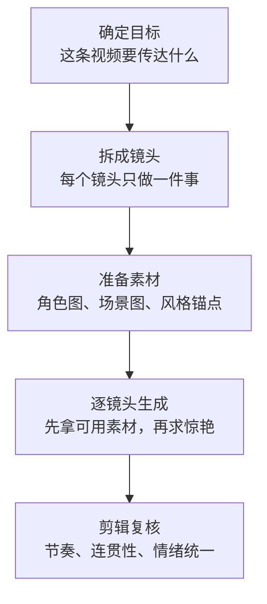

> **目标读者**：已经接触过 AI 视频工具，想把 Seedance 2.0 用到“可稳定出片”水平的创作者、运营和短视频团队
> **核心问题**：Seedance 2.0 到底适合做什么？提示词应该写到什么粒度？怎样把“偶尔出好片”变成“稳定复现可剪辑素材”？
> **信息边界**：本文基于公开演示、常见实操经验和通用视频生成方法论整理。不同时间的产品界面、时长档位、清晰度和参考图机制可能调整，具体以你当前账号中的产品界面为准。

如果你只记住一句话，请记住这一句：**Seedance 2.0 最适合的不是“一次生成整条成片”，而是“批量生成可剪辑镜头素材”。** 这会直接决定你怎么写提示词、怎么拆镜头，以及怎么评估结果是否可用。

为了让这篇文章真正能指导实操，而不是停留在“看起来懂了”，下面会同时回答三类问题：

1. 什么是适合交给 Seedance 2.0 的任务，什么不适合。
2. 怎样构造更稳定的提示词、参考图和分镜表。
3. 当输出结果不稳定时，应该优先排查什么。

---

## 1. 学习目标

读完本文后，你应该能够：

- 判断一个视频创意是否适合用 Seedance 2.0 执行，而不是盲目开生成。
- 用“主体 + 动作 + 镜头 + 风格 + 技术收尾”的结构写出高质量提示词。
- 区分文生视频和图生视频的写法差异，知道什么时候该多写、什么时候该少写。
- 为角色、场景和风格建立参考素材包，降低人物变脸和风格漂移的概率。
- 按镜头表组织一次完整的视频制作流程，从创意、生成到剪辑衔接。
- 使用排错清单定位抖动、跑题、脸崩、风格不统一等常见问题。

---

## 2. 先建立正确预期：Seedance 2.0 擅长什么，不擅长什么

### 2.1 它更像“镜头生成器”，而不是“成片导演”

很多新手第一次使用 AI 视频工具，都会默认它应该一键给出一条完整短片。这个预期本身就是问题的起点。

原因很简单：**视频越长，变量越多；变量越多，一致性越差。** 角色表情、服装、景别、机位、光线、动作节奏，任何一个环节漂移，都会让长镜头失控。

所以更可靠的策略是：

- 把每次生成当成一个“可剪辑镜头”。
- 把成片质量建立在分镜设计和后期拼接上。
- 把生成环节的目标从“完美成片”改成“稳定可用素材”。

这就是本文强调的“剪辑师思维”。它不是口号，而是降低失败率的工作方法。

### 2.2 影响成片质量的，不只是提示词

很多教程把问题都归结为“提示词不够强”。这只对了一半。Seedance 2.0 的结果，通常由以下三项共同决定：

| 因素 | 你能控制什么 | 为什么重要 |
| ---- | ------------ | ---------- |
| **镜头设计** | 景别、运动、时长、叙事目的 | 决定结果是不是可剪、可接、可讲故事 |
| **提示词表达** | 主体、动作、风格、镜头语言 | 决定模型优先理解什么 |
| **参考素材质量** | 角色图、场景图、风格图 | 决定一致性和稳定性上限 |

如果你的参考图混乱、镜头设计模糊，仅靠堆更多形容词，通常不会得到更好的结果。

### 2.3 关于参数和版本，不要写死

很多文章会把具体时长、分辨率、参考图权重写得非常绝对。但在 AI 工具里，**版本更新比文章更新更快**。更稳妥的写法是把“可迁移的方法”讲清楚，把“可能变化的参数”写成使用建议。

| 项目 | 更稳妥的理解方式 | 实操建议 |
| ---- | ---------------- | -------- |
| 单次生成时长 | 常见做法是生成数秒到十余秒的短片段 | 优先追求“可剪辑”，不要追求单镜头塞满全部信息 |
| 分辨率 | 平台档位可能变化 | 先验证运动和构图，再追求高分辨率 |
| 参考图数量与顺序 | 不同版本可能有不同交互 | 如果界面支持多参考图，第一张优先放角色主参考 |
| 提示词长度 | 并非越长越好 | 文生视频允许更完整描述，图生视频则要明显收短 |

---

## 3. 从创意到成片的标准工作流

### 3.1 五步闭环



这五步里，最容易被跳过的是第二步。很多人看到一个想法，直接开始写提示词。但**没有分镜，就没有稳定的输出标准**。你连“这一镜到底要什么”都没定义，模型当然只能随机发挥。

### 3.2 每个镜头都要回答四个问题

在你输入任何提示词之前，先把这个镜头的任务写清楚：

1. 这一镜的叙事功能是什么：交代场景、推动动作，还是制造情绪？
2. 观众首先应该看到什么：人物、产品、环境，还是某个细节？
3. 镜头应该是稳的、慢的，还是有明显运动感的？
4. 这一镜结束后，下一镜怎么接？

如果你不能快速回答这四个问题，说明不是提示词的问题，而是镜头定义还不够清晰。

### 3.3 一个高复用的镜头表模板

建议你在正式生成前，先写一张镜头表：

| 镜头 | 目的 | 主体 | 动作 | 镜头语言 | 风格锚点 | 时长建议 | 备注 |
| ---- | ---- | ---- | ---- | -------- | -------- | -------- | ---- |
| 1 | 交代场景 | 城市天际线 | 云层缓慢移动 | wide shot, locked frame | 冷蓝清晨、轻雾 | 3-5 秒 | 作为开场建立氛围 |
| 2 | 引出角色 | 女主角 | 走向地铁入口 | medium shot, tracking shot | 纪实电影感 | 4-6 秒 | 与镜头 3 保持服装一致 |
| 3 | 情绪靠近 | 女主角面部 | 短暂停顿后抬眼 | close-up, static shot | 柔和背光 | 3-4 秒 | 为后续内心戏留白 |

这张表的价值在于，它会逼你先做导演，再做提示词工程师。

---

## 4. 提示词工程：五模块不是公式，而是控制变量的方法

### 4.1 五模块框架

最实用的写法，不是把所有想到的词都堆上去，而是按固定顺序组织信息：


这里最后一个模块，我更建议理解成“技术收尾”而不是“画质后缀”。因为它不只是在说清晰度，还包括光线、色彩、质感、景深等一组统一的输出要求。

### 4.2 模块一：主体

主体不是“写得越多越完整”，而是“写到足以排除歧义”。

**推荐写法**：身份 + 外观关键特征 + 当前场景。

**不推荐写法**：堆砌十几个服装、年龄、情绪、光影细节，让主体描述本身变成一段小说。

示例：

```text
较弱：一个女人
较强：一位三十岁左右、穿深灰色西装外套的都市女性，站在地铁入口前

较弱：一块手表
较强：一块银黑配色的运动智能手表，放置在潮湿岩石表面
```

### 4.3 模块二：动作

很多人听过“动作只写一个”，然后机械地理解成“一句里只能出现一个动词”。这不够准确。真正的原则是：**一个镜头只保留一个主要动作意图。**

为什么？因为动作越多，模型越难判断哪个是主任务。你写“走路、转头、微笑、抬手、看向镜头”，实际是在同时要求五件事，结果通常是哪件都不够好。

更稳妥的写法：

- 把一个镜头聚焦为一个主动作。
- 次级动作只保留自然伴随项。
- 如果动作链真的重要，就拆成两个镜头。

示例：

```text
较弱：她走进门口后转头看向镜头并微笑着抬起手整理头发
较强：她缓慢走向门口，临近镜头时轻微转头
```

### 4.4 模块三：镜头

镜头模块的核心作用，是把“你想拍什么”翻译成“摄影机应该怎么工作”。

| 目标 | 常见镜头表达 | 作用 |
| ---- | ------------ | ---- |
| 交代环境 | wide shot, locked frame | 先让观众知道人在哪里 |
| 展示人物状态 | medium shot | 平衡人物与环境信息 |
| 强调情绪细节 | close-up | 把注意力收拢到面部或局部 |
| 展示产品细节 | extreme close-up | 放大材质、按钮、纹理 |
| 制造推进感 | slow push in, tracking shot | 提升叙事张力 |

如果你对镜头语言不熟，最简单的原则是：**先用静，再逐步加动。** 稳定输出通常比花哨运镜更重要。

### 4.5 模块四：风格

风格模块最常见的误区，是只写一个泛词，比如 cinematic、beautiful、high quality。问题在于，这类词太宽泛，不足以约束结果。

更有效的方式是写成“风格组合”：

- 视觉媒介：35mm film、digital cinema、anime illustration。
- 光线方向：soft morning light、neon rim light、overcast daylight。
- 色彩倾向：muted blue tones、warm amber highlights、desaturated palette。
- 质感特征：film grain、clean commercial finish、soft haze。

示例：

```text
较弱：cinematic
较强：35mm film look, cool blue dawn tones, soft haze, subtle film grain
```

### 4.6 模块五：技术收尾

技术收尾不是可有可无的附加项，它的作用是把前面的内容“定稿”。

你可以把它理解成最后一层统一口径，例如：

```text
sharp detail, cinematic lighting, professional color grading, shallow depth of field
```

这类描述的意义，不是迷信某几个魔法词，而是让模型在清晰度、光线和质感上朝同一个方向收束。

---

## 5. 文生视频和图生视频，为什么写法必须不同

### 5.1 文生视频：文字承担“定义世界”的职责

在文生视频里，模型主要依赖文字理解主体、环境和氛围，所以提示词需要更完整。一般来说，你至少要交代：

- 主体是谁。
- 在哪里。
- 在做什么。
- 镜头怎么拍。
- 风格和光线是什么。

适合文生视频的场景：

- 概念预演。
- 没有现成角色素材的创意探索。
- 需要先找视觉方向，再决定是否进入精修。

通用模板：

```text
[主体与环境]
[主要动作]
[镜头语言]
[风格组合]
[技术收尾]
```

示例：

```text
A young office worker in a dark blazer stands at the entrance of a subway station on a misty morning. She slowly walks forward as commuters blur in the distant background.

Medium shot, gentle tracking shot, stable camera movement.

35mm film look, cool blue morning tones, soft diffused light, subtle urban haze.

Sharp detail, cinematic lighting, professional color grading, shallow depth of field.
```

### 5.2 图生视频：文字应该让位给参考图

图生视频的核心目标不是“重新定义主体”，而是“在保留主体的前提下，让它动起来”。因此图生视频提示词要更短、更克制。

推荐只保留三类信息：

- 当前镜头的动作。
- 机位和镜头微调。
- 风格和光线上的微调要求。

如果你把主体外貌、服装、场景细节再完整写一遍，模型反而更容易偏向文字而弱化参考图。

示例：

```text
Walks slowly toward camera, slight turn of the head near the end.

Medium shot, stable tracking, soft push in.

Maintain the same lighting and wardrobe, subtle cinematic contrast, clean skin texture.
```

### 5.3 一条很重要的经验法则

**文生视频靠“描述完整度”，图生视频靠“约束克制度”。**

这也是为什么很多人会觉得：同样的写法，在文生视频里效果不错，换到图生视频就开始跑偏。不是模型突然变差了，而是输入策略错了。

---

## 6. 一致性控制：角色、场景、风格要分开管理

### 6.1 为什么角色会变脸、场景会漂移

AI 视频生成不是在调用一个固定演员和固定片场，而是在每次采样时重新“理解”你的要求。只要约束不够稳，漂移就会发生。

常见漂移类型：

- **角色漂移**：脸型、五官、发型、服装前后不一致。
- **场景漂移**：背景结构、时间段、天气状态前后跳变。
- **风格漂移**：某一镜偏纪实，下一镜偏广告，整体调性断裂。

### 6.2 建议准备三类参考素材包

不要只准备“角色参考图”。更稳的做法是同时准备三类素材：

| 素材包 | 作用 | 具体建议 |
| ------ | ---- | -------- |
| **角色包** | 锁定人物身份 | 正面、侧面、四分之三侧面，各自单独裁切 |
| **场景包** | 锁定环境结构 | 选能代表空间关系的参考图，而不是只选漂亮图 |
| **风格包** | 锁定视觉方向 | 统一光线、色调、镜头质感 |

### 6.3 角色参考图的最低要求

角色一致性最怕三类参考图：

- 一张图里塞多个人物。
- 脸部被头发、手、阴影或大面积饰品遮挡。
- 每张图的光线、妆容、滤镜差别非常大。

更稳妥的做法：

- 每张图只服务一个主体。
- 尽量统一光线和背景复杂度。
- 面部清晰，关键特征可辨认。
- 同一角色的服装和发型尽量固定。

### 6.4 关于参考图顺序的实操建议

如果你当前版本的界面支持多张参考图，并且存在顺序输入逻辑，通常可以按下面的优先级组织：

1. 第一张放角色主参考。
2. 第二张放场景或构图参考。
3. 第三张再放风格或材质参考。

这不是不可动摇的产品规则，而是一种更容易稳定结果的工作顺序。真正重要的是：**不要让角色图、场景图、风格图在同一张图里互相打架。**

---

## 7. 分镜设计：把“会出片”写进流程，而不是寄希望于运气

### 7.1 先写分镜，再写提示词

真正影响成片质量的，是镜头之间能不能接起来，而不是某一个镜头有没有单独惊艳。分镜的作用，就是提前控制“镜头之间的关系”。

你至少要控制四个连续性变量：

- 人物外观是否连续。
- 光线和时间是否连续。
- 运动方向是否连续。
- 情绪强度是否连续。

### 7.2 一个一分钟产品片的标准拆法

假设你要做一条 45 到 60 秒的智能手表广告，推荐不要让每个镜头都承担介绍全部卖点，而是按“建立印象 → 展示细节 → 展示使用场景 → 收束品牌记忆”拆开。

| 镜头 | 目的 | 时长建议 | 内容 | 生成方式 | 关键控制点 |
| ---- | ---- | -------- | ---- | -------- | ------------ |
| 1 | 建立高级感 | 3-4 秒 | 手表置于岩石表面，晨雾轻微流动 | 文生 | 构图和材质优先 |
| 2 | 展示佩戴状态 | 4-5 秒 | 手腕抬起，表带质感清晰 | 图生或文生 | 手部动作不要太复杂 |
| 3 | 展示交互细节 | 3-4 秒 | 手指滑动表盘，界面切换 | 图生 | 局部动作和屏幕反光 |
| 4 | 展示户外场景 | 4-5 秒 | 跑步中看表，背景轻微虚化 | 图生 | 人物与产品同框稳定 |
| 5 | 品牌收尾 | 3-4 秒 | 产品特写，标识清晰 | 文生 | 背景简洁，利于剪辑收尾 |

### 7.3 什么时候该拆镜头

出现下面任何一种情况，都建议拆镜头，而不是强行塞进一段生成：

- 既想展示环境，又想展示表情，还想展示产品细节。
- 人物需要完成明显动作链，例如走近、停下、抬手、转头。
- 你发现提示词已经开始用很多“同时”“然后”“接着”。

一旦提示词里出现太多时间顺序词，通常说明你在让一个镜头承担过多叙事任务。

---

## 8. 四套可直接复用的提示词模板

### 8.1 通用文生视频模板

```text
[主体与场景]
[一个主要动作]
[镜头语言]
[风格组合]
[技术收尾]
```

### 8.2 通用图生视频模板

```text
[简短动作]
[机位或镜头微调]
[保持一致性的要求]
[少量技术收尾]
```

### 8.3 产品质感镜头模板

```text
A premium smart watch resting on a wet dark rock surface.

Extreme close-up, locked frame, slight atmospheric motion in the background.

Luxury commercial look, cool grey palette, soft dawn highlights, clean reflections.

Sharp detail, cinematic lighting, premium product finish, professional color grading.
```

### 8.4 情绪人物镜头模板

```text
A young office worker sits alone on a station bench at dusk, holding a bag on her lap.

Close-up, static shot, subtle pause before she raises her eyes.

35mm film look, muted blue tones, soft ambient city light, gentle haze.

Natural skin texture, cinematic lighting, shallow depth of field, subtle film grain.
```

这些模板的价值不在于复制粘贴后一定直接出片，而在于它们体现了一个稳定原则：**每个镜头只服务一个明确目标。**

---

## 9. 常见失败场景与修复方法

### 9.1 镜头抖动、画面晃

**常见原因**：

- 提示词里同时要求太多镜头运动。
- 使用了 handheld、dynamic motion 等高不确定性词汇。
- 场景元素过多，模型在运动中难以维持稳定。

**修复顺序**：

1. 先把镜头改成 locked frame 或 stable tracking。
2. 删掉多余动作，只保留一个主动作。
3. 缩短镜头长度，先拿到稳镜头再尝试加动感。

### 9.2 角色脸崩或像另一个人

**常见原因**：

- 参考图质量不稳定。
- 图生视频提示词过长，重新定义了主体。
- 同一角色跨镜头的服装、妆容、光线差异太大。

**修复顺序**：

1. 先统一角色参考图。
2. 缩短图生视频提示词，让参考图承担主体定义。
3. 固定同一角色的服装、发型和主光方向。

### 9.3 画面高级，但完全不符合需求

这是最容易被误判的一种失败。很多结果看起来“很电影”，但它并没有完成你的镜头任务。

**常见原因**：

- 风格词过强，压过了动作和主体。
- 镜头目的本身没有写清楚。
- 提示词追求华丽，而不是可控。

**修复原则**：先把风格词减半，再重新检查镜头目的是否单一。

### 9.4 同一条视频前后风格不统一

**常见原因**：

- 每个镜头都临时换一套风格词。
- 不同镜头使用了完全不同的光线描述。
- 没有固定一套“风格锚点”。

**修复方法**：

- 为整条视频先定义一套统一风格短语。
- 每个镜头只在此基础上做轻微变化。
- 建一个“成功镜头词库”，复用已验证过的描述。

### 9.5 图生视频忽略参考图

**常见原因**：

- 提示词太长。
- 参考图本身信息噪声太大。
- 文字里重新定义了角色外貌和场景。

**修复方法**：

- 把提示词压缩到只剩动作、镜头和少量风格要求。
- 用更干净的单主体参考图。
- 删除重复主体描述。

---

## 10. 一套真正能落地的制作 SOP

### 10.1 生成前检查

在点击生成前，逐项确认：

- 这个镜头只有一个主动作。
- 你能说清这个镜头的叙事目的。
- 文生视频和图生视频用了不同的写法。
- 参考图只承担一种主要职责，不混杂太多信息。
- 风格锚点与前后镜头保持一致。

### 10.2 生成后复核

判断一个镜头是否“可用”，不要只看美不美，而要看它是否适合进入剪辑时间线：

| 检查项 | 判断标准 |
| ------ | -------- |
| **主体稳定** | 角色或产品的关键特征没有明显漂移 |
| **动作清楚** | 观众一眼能看出镜头在表达什么 |
| **机位稳定** | 没有破坏观感的异常抖动或透视跳变 |
| **风格统一** | 能与前后镜头接上，不像来自另一条片子 |
| **可剪辑** | 开头和结尾留有剪辑空间，不是满幅混乱运动 |

### 10.3 推荐的迭代顺序

当结果不理想时，不要一次性改十个变量。按这个顺序改，效率更高：

1. 先改镜头目的和主动作。
2. 再改机位和运动方式。
3. 再改参考图。
4. 最后才微调风格和技术收尾。

这样做的原因是：前两项决定“有没有拍对”，后两项才决定“拍得是否更漂亮”。

---

## 11. 实战案例：45 秒情绪短片怎么做

### 11.1 项目设定

- **主题**：城市通勤中的孤独感。
- **成片目标**：做一条 45 秒左右、可发布到短视频平台的情绪短片。
- **统一风格**：冷蓝城市色调、轻胶片颗粒、偏纪实电影感。

### 11.2 分镜脚本

| 镜头 | 目的 | 时长建议 | 类型 | 核心提示 |
| ---- | ---- | -------- | ---- | ---------- |
| 1 | 建立城市氛围 | 4 秒 | 文生 | 城市天际线、清晨薄雾、稳定远景 |
| 2 | 引入角色 | 5 秒 | 文生 | 女主角走向地铁站、轻微跟拍 |
| 3 | 拉近情绪 | 4 秒 | 图生 | 角色参考图、中近景、轻停顿 |
| 4 | 展示环境压迫感 | 5 秒 | 文生 | 人群快速移动、主角相对静止 |
| 5 | 进入情绪核心 | 4 秒 | 图生 | 长椅独坐、低头后缓慢抬眼 |
| 6 | 情绪释放 | 4 秒 | 文生 | 黄昏逆光、角色剪影 |
| 7 | 结尾空镜 | 4 秒 | 文生 | 空长椅、余光渐暗 |

### 11.3 镜头 2 的可用写法

```text
A young office worker in a dark blazer walks toward the entrance of a subway station on a cold morning.

Medium shot, gentle tracking shot, stable movement.

35mm film look, cool blue tones, diffused urban light, subtle haze.

Sharp detail, cinematic lighting, professional color grading, shallow depth of field.
```

### 11.4 为什么这样写

这一镜只承担“引入角色”任务，所以它没有再同时要求夸张情绪表演、复杂运镜和剧情转折。这样做的好处是：

- 更容易把角色先立住。
- 更容易和前后镜头做连续剪辑。
- 后续要加强情绪时，还有镜头空间可以递进。

---

## 12. 常见误区

### 12.1 误区一：提示词越长越专业

不对。更长往往只代表变量更多，不代表控制更强。专业提示词的本质是“信息优先级清晰”，不是“词数很多”。

### 12.2 误区二：生成结果漂亮，就说明镜头成功

不对。一个镜头是否成功，标准首先是它有没有完成任务，其次才是它漂不漂亮。

### 12.3 误区三：否定提示词一定完全无效

更准确的说法是：**在视频生成任务中，正向描述通常比堆砌否定描述更稳定。**

与其写“不要路人、不要抖动、不要背景乱”，不如直接写：

```text
single subject, clean background, stable camera, no other people in frame
```

这里的重点不是某个语法规则，而是让模型明确知道你想要什么画面。

### 12.4 误区四：角色一致性只靠参考图就够了

不对。参考图只能提高上限，真正决定一致性的，还包括服装设定、镜头光线、场景连续性和提示词克制度。

---

## 13. 自测与练习

### 13.1 三个理解题

1. 为什么同一套长提示词在文生视频里有效，换到图生视频里却可能失效？
2. 为什么说“一个镜头只保留一个主动作”比“一个句子只写一个动词”更准确？
3. 判断一个镜头是否成功时，为什么“可剪辑性”比“单帧好看”更重要？

### 13.2 一个实战练习

请你为“咖啡店清晨开门营业”设计 3 个镜头，要求：

- 第一镜交代环境。
- 第二镜展示人物动作。
- 第三镜收拢到情绪或细节。

完成后，逐镜检查：

- 是否每镜只有一个主动作？
- 是否能明确接到下一镜？
- 是否复用了同一套风格锚点？

### 13.3 进阶挑战

选一条你之前生成失败的视频，把失败原因归类到以下四类之一：

- 镜头定义错误。
- 提示词变量过多。
- 参考素材不稳定。
- 风格锚点不统一。

如果你能准确归因，下一轮迭代通常会比盲目重生更有效。

---

## 14. FAQ

### 14.1 新手最该先练什么？

先练分镜拆解，而不是先背很多提示词。因为不会拆镜头的人，即使抄到好提示词，也很难稳定复现。

### 14.2 一条视频应该先做文生还是图生？

如果你还在找视觉方向，先用文生视频探索；如果你已经有角色或产品主视觉，需要保持一致性，就尽快切到图生视频。

### 14.3 什么时候该放弃继续调一个镜头？

当你已经连续几轮都在改风格词，但主体、动作和镜头目的仍然不清楚时，就应该停下来重写镜头定义，而不是继续在同一版本上硬调。

### 14.4 怎样提高整条片子的统一感？

最有效的方式不是给每一镜都加更多华丽词，而是提前固定三件事：统一风格锚点、统一参考素材、统一分镜节奏。

---

## 15. 总结：真正决定你能否稳定出片的，不是“魔法词”，而是流程

如果把本文再压缩成一张行动卡，可以记住下面这几条：

| 关键原则 | 实操含义 |
| -------- | -------- |
| **按镜头生成，不按成片幻想生成** | 每次只解决一个镜头任务 |
| **一个镜头一个主动作** | 复杂动作链拆开做 |
| **文生视频写完整，图生视频写克制** | 让文字和参考图各司其职 |
| **角色、场景、风格分开管理** | 不要把所有约束塞进同一张参考图 |
| **先求可剪，再求惊艳** | 可用素材比偶然神图更重要 |
| **排错先改镜头，再改风格** | 先确保拍对，再追求拍美 |

当你真正把 Seedance 2.0 当作“镜头素材引擎”来使用，很多原本看似玄学的问题，都会变成可分析、可拆解、可迭代的工程问题。

---

## 16. 版本说明与使用边界

为了避免文章在几次产品更新后迅速过时，这里把最容易变化的部分单独说明。

### 16.1 哪些内容最容易随版本变化

如果你后续要维护这篇文章，优先复核下面 5 项：

- 单次生成时长档位是否变化。
- 清晰度、比例、运镜控制等界面选项是否变化。
- 多参考图的上传方式、顺序逻辑和权重表现是否变化。
- 图生视频与文生视频的提示词容忍度是否变化。
- 是否新增了角色一致性、镜头控制或风格锁定相关能力。

### 16.2 哪些方法在版本变化后仍然成立

下面这些方法，即使产品界面变化，通常仍然有效：

| 稳定方法 | 为什么不容易过时 |
| -------- | ---------------- |
| 先拆分镜，再开生成 | 这是降低变量复杂度的通用方法 |
| 一个镜头只保留一个主动作 | 这是控制模型注意力的通用方法 |
| 文生写完整，图生写克制 | 这是文字与参考图分工的通用方法 |
| 角色、场景、风格分开管理 | 这是降低漂移的通用方法 |
| 先求可剪，再求惊艳 | 这是视频工作流而不是单次出图心态 |

### 16.3 这篇文章不解决什么问题

为了避免误用，这篇文章刻意没有展开以下主题：

- 不同账号套餐、积分价格和商业计费策略。
- 具体平台界面的逐按钮操作截图教程。
- 某个特定版本的全部参数枚举。
- 与其他视频模型的横向性能排行榜。

这些内容更新更快，也更依赖你当下实际使用的产品版本。

---

## 17. 如果你要持续更新这篇文章，应该怎么维护

一篇顶级实战文档，不只是“今天写得好”，还要“一个月后还能修得动”。建议你按这个顺序维护：

1. 先更新参数和界面变化，再判断是否影响正文方法论。
2. 如果产品新增控制能力，优先补到第 9 节排错和第 10 节 SOP。
3. 如果你积累了新案例，优先补到第 11 节实战案例，而不是到处插零散经验。
4. 如果社区出现稳定共识，再把它沉淀到第 8 节模板区，而不是直接写成绝对规则。

这样维护的好处是：文章会越来越稳，而不是越来越杂。

---

## 18. 参考资料

本文的判断主要基于以下三类信息源：

- Seedance 2.0 的公开演示内容、产品界面与常见创作工作流。
- 通用 AI 视频生成实践中已经被反复验证的方法，例如分镜拆解、参考素材分层、镜头级迭代。
- 作者在整理同类 AI 视频工具经验时形成的可迁移方法论。

如果你后续要继续打磨这篇文章，建议额外补充两类材料：

- 官方更新日志或产品公告，用来校验参数与功能变化。
- 真实项目案例复盘，用来验证模板和排错方法在不同题材下是否仍然成立。

文档信息：Seedance 2.0 视频制作指南 | 更新日期：2026-03-30 | 难度：⭐⭐⭐ | 建议用法：先按第 3 节写镜头表，再回到第 8 节套模板生成。
