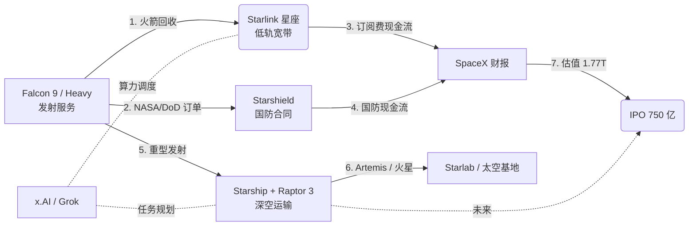

# SpaceX 24 年：从猎鹰 1 号的灰烬到「人类最大 IPO」，一家被嘲笑的公司如何重写进入太空的成本

## 这篇文章在回答什么

- SpaceX 这 24 年**真正在跑的系统**是什么（不是火箭，是「发射 + 轨道 + 深空」三层基础设施）
- 为什么「**复用率 + 订单结构 + 生态绑定 + 高管留存**」4 件事能比单看一次试飞结果更准地判断一家商业航天公司
- Lewis Hong 7 年在 SpaceX 的内部叙述里哪些细节是公开财报不会告诉你的
- 2026 年 6 月这次「750 亿美元 IPO」背后那个把「**太空 + AI**」讲成同一个故事的商业框架

---

## 写在前面

SpaceX 这家公司过去 24 年的公开材料极多，但大多数报道把「火箭」当主角，忽略了三件更重要的事：复用率怎么改写了发射的现金流结构、政府订单怎么变成这家公司的护城河、Starlink + Starshield + x.AI 这三块业务怎么在 2024–2026 年拼成一个新的估值故事。

这篇文章以硅谷 101《SpaceX 崛起史：一切，为了去火星》（BV1y5EY62E8B，75 分钟，2026-06-10 发布，实地探访 Boca Chica 与洛杉矶总部）与张小珺商业访谈录《口述 SpaceX 开发史：和前高管洪力德聊》（BV1HfEy6jEUx，180 分钟，2026-06-11 发布）两期节目为骨架，用 Lewis Hong（洪力德）这位在 SpaceX 工作 7 年的前首席制造工程师在两期节目 + 2023 年「甲子光年」专访 + 2024 年 SV101 E155《马斯克太空梦进度条 70%》里反复出现的几段内部叙述，把这家公司过去 24 年真正在做、真正跑通、和目前还差什么拆成可读懂的工程判断。

文中所有时间、金额、人物细节均来自上述四期节目 + SpaceX 官方公告与公开财报。

---

## 一、先看地图：SpaceX 24 年实际跑通的是三套并行系统

把火箭当主角是个误导。SpaceX 真正跑通的是三套并行系统，火箭只是其中一环的载体：

| 系统 | 关键载体 | 主要客户 | 状态（2026-06） |
|---|---|---|---|
| 1. **发射服务** | Falcon 9 / Falcon Heavy | NASA、商业卫星、DoD | 稳态运营，发射频率全球第一 |
| 2. **近地轨道基础设施** | Starlink v2 Mini / Starshield | 全球宽带、DoD/情报 | 已成最大低轨星座 + 国防合同 |
| 3. **深空运输** | Starship + Raptor 3 | NASA Artemis、商业月球、最终火星 | 仍在试飞，但 2025 年下半年已多次筷子夹回收 |

把这三套系统分开看，2026 年 6 月这次 IPO 融 750 亿美元、估值 1.77 万亿（按硅谷 101 description）就不奇怪——投资人买的不是火箭公司，是一段「发射 + 轨道 + 深空」三层基础设施的长期订阅权。



```mermaid
示意图：SpaceX 三大系统怎么互锁——发射服务，Starlink 订阅，Starshield 国防合同三路给财报供血，Starship 重型发射+Artemis 任务在远期补一个「火星」高客单价业务。x.AI/Grok 是横向层的算力调度，被 Starlink 和 Starship 同时使用。
```

张小珺 2026-06-11 那期访谈的标题把这层意图写明了：「**随着 SpaceX 收购整合 x.AI 并完成截至目前史上的最大一起 IPO，在太空与 AI 加速融合的背景之下，这会不会是人类文明扩张的前奏？**」

她在节目 OUTLINE 02:11:19「航天产业的地图与权力」一节里点出 SpaceX 当下的关键操作：**把发射、通信、国防、月球任务和太空港口，串成一套新的太空基础设施**。造一个能飞的星舰只是手段，这套基础设施才是 SpaceX 商业模型的总纲。

下面所有讨论都围绕这张表展开。先把火箭和飞船放回它们应该待的位置。

---

## 二、2002–2008：被嘲笑的 6 年，猎鹰 1 号三连败差点让公司关门

很多人以为 SpaceX 的故事是 2008 年开始的——那年 NASA 给了 COTS 合同，公司活下来。但 2002 到 2008 才是真正决定这家公司的 6 年。

按公开资料，猎鹰 1 号前三次发射全部失败：

- 2006-03-24，第一次点火 25 秒后燃油管路泄漏起火，火箭坠海。
- 2007-03-21，第二次进入飞行阶段 5 秒后主引擎熄火，第二级失控。
- 2008-08-03，第三次一级表现良好，二级在分离后第二分钟翻滚失控，坠海。

到第三次失败时，公司账面现金只够再做一次发射。马斯克在 2008 年那次发射前告诉团队：「这次再失败，SpaceX 就完了。」这次飞行历史上称作「猎鹰 1 号第四次飞行」（Flight 4）——也是 SpaceX 历史上的真正分水岭。第四次发射成功，5 个月后，NASA 给 SpaceX 签下 16 亿美元的 COTS 合同，公司活了下来。

Lewis Hong 在 2023 年「甲子光年」专访里反复强调 SpaceX 早期那种「没失败过几次就做不出东西来」的氛围：「两次爆炸，都与我的团队有关……如果跨不过去这道坎，我们也许都会万劫不复」。他 2012 年 9 月才加入 SpaceX，没赶上 2002–2008 这段。但他在张小珺 180 分钟访谈里（OUTLINE 01:56:35「SpaceX 开发史、Falcon 9 成与败」）专门把这段历史从内部视角补了一刀。

他把 2002–2008 这 6 年定位为「**在没有可借鉴供应链、没有 NASA 大单的情况下，先把一条民商航天的工业链条从零拉起来**」的阶段。Falcon 1 是产品，更是公司商业模型的一次端到端验证。

这 6 年没在「造大型火箭」，练的是**流程**。这 6 年建立起来的内部供应链、迭代节奏和「全员看发射直播 + 失败后 24 小时内出事故报告」的公司文化，是 Falcon 9 接下来 10 年能稳定的隐性资产。

---

## 三、2008–2015：NASA 订单 + 猎鹰 9 号的「过关」

2008 年 COTS 合同 + 后续 CRS（Commercial Resupply Services）合同给了 SpaceX 两样东西：**现金流**和**政府客户**。这两样是商业航天最难获得的两个要素。

COTS 后续演化成 Dragon 飞船 + Falcon 9 + 国际空间站货运补给。2012 年 Dragon 首次对接国际空间站，2013 年首次执行 NASA 货运补给任务。到 2015 年，SpaceX 已经稳定成为 NASA 商业补给的主要承包方之一。

但猎鹰 9 号并不是一上来就稳的。2015 年是另一道分水岭：

- **2015-06-28 CRS-7 任务**：猎鹰 9 号发射 139 秒后空中爆炸。Lewis Hong 那时是**猎鹰 9 号首席制造工程师**（the chief manufacturing engineer），爆炸当天的细节他在 2023 年「甲子光年」专访里复述过——「gut wrenching（像肚子被打了一拳）」。他说这次爆炸他们团队的工艺缺陷有直接责任。马斯克在 7 月 20 日电话会议给出结论：二级液氧箱内部固定氦气罐的支架折断。SpaceX 停飞半年。订单被推迟。股价开始被唱空。
- **2016-09-01 AMOS-6 任务前的湿彩排（wet dress rehearsal）**：猎鹰 9 号在发射台爆炸，0.093 秒内数据全失。马斯克后来形容这是「SpaceX 历史上最困难、最复杂的故障」。Lewis Hong 当时没在测试现场（前一晚工作到清晨 6 点才睡），电话吵醒他时只听见一句话：「Lewis，猎鹰出事了，你快来吧。」AMOS-6 同时炸毁，扎克伯格的 Internet.org 项目跟着遭殃。

两次爆炸在一年内。SpaceX 的决策是**重新设计 Falcon 9 全箭，而不是修小补丁**。Lewis Hong 提到 SpaceX 内部当时流传一句话：「Get shit done（废话少说，去干活）」——这是 SpaceX 公司文化最浓缩的一句。

到 2017 年，Falcon 9 已经稳定在「Block 4 / Block 5」代。一级回收变成标配（2015-12 首次陆地回收，2016-04 首次海上回收），二级回收也于 2017 年开始。这件事彻底改变了商业航天的成本结构——下面会展开。

---

## 四、2015–2024：复用火箭 + 星链，把发射成本打到原来 1/3

Falcon 9 一级回收这件事，公开层面看是 SpaceX 的技术胜利，工程层面看是 SpaceX 的**财务模型胜利**。

按公开估算：

- Falcon 9 全新火箭单次发射价格约 6,700 万美元（截至 2023 年公开价目）。
- 同等运力下，**复用 Falcon 9 边际成本** 主要是一级翻修 + 燃料，按多次公开访谈与机构测算，单次成本可降到 1,500–2,500 万美元。
- 商业卫星运营商拿到的是「同等运力 + 1/3 价格」。

这个成本结构的两端都是 SpaceX：

- **上游**：通过复用拿到单次发射毛利。
- **下游**：把节省的成本反哺到自家 Starlink。

Starlink 这件事是 SpaceX 商业模型的另一个支柱：2019-05 首批 60 颗 v0.9 上轨，到 2026 年 6 月已经超过 7,500 颗在轨（按公开统计），是全球最大的低轨星座。它解决的是「**运力过剩时卖给谁**」这个问题：

- 商业卫星订单排不上时，SpaceX 仍有任务
- 任务之间有空档时，火箭顺手把自家 Starlink 卫星送上去，不让发射台闲置
- 数量堆起来后，Starlink 自身变成营收主力（按公开数据 Starlink 2024 年已破百亿美元年化营收）

Lewis Hong 在张小珺访谈里（OUTLINE 01:56:35）专门提到 SpaceX 现金流结构的变化：早期是「**火箭送完货才有钱**」的单轮收入；到 2018 年以后，「**Starlink 订阅费 + 发射服务**」开始构成稳定的双轮营收。这不是偶然的财务设计，是回收火箭带来的结构性现金流稳定化。

把这条和 2024 年 Starshield 国防合同串起来看：SpaceX 已经从一家「接订单造火箭」的承包商，长成一家**「在低轨卖宽带、给政府卖接入」**的运营商。火箭是它的发电厂。

---

## 五、2024–2026：星舰 + 收购 x.AI，把「太空 + AI」讲成同一个故事

2026 年 6 月这次「史上最大 IPO」最关键的不是融资金额（750 亿美元），也不是估值（1.77 万亿，按硅谷 101 描述）。SpaceX 对外讲的那个新故事才是：

> 「地球上是算力（x.AI / Grok）+ 通讯（Starlink / Starshield），地球外是发射 + 轨道 + 深空（Falcon / Starship / 火星）。太空和 AI 在一起跑。」

这次收购的时间线，按公开报道拼起来：

- x.AI 是马斯克 2023 年创办的 AI 公司，主打 Grok 模型。2024 年 5 月完成 60 亿美元 B 轮。
- 2026 年 4 月起，马斯克把 x.AI 与 X（原 Twitter）整合。
- 2026 年 5–6 月，SpaceX 收购/合并 x.AI 的细节陆续披露。
- 2026 年 6 月，SpaceX 完成 IPO。

合并后的逻辑，硅谷 101 描述里其实写得很直白：

> 「SpaceX 正在把发射、通信、国防、月球任务和太空港口，串成一套新的太空基础设施。」

四块业务的分工：

- **x.AI** 提供算力与算法（Grok / 太空任务规划 / 卫星调度）
- **Starlink** 提供带宽
- **Starshield** 提供政府合同入口
- **Starship** 提供地球外物理运输

马斯克对「人类成为跨行星物种」这件事的商业化系统答案并不要求先去火星：先把地球上能跑通的钱流跑通（x.AI / Starlink / Starshield），再把这条钱流延伸到太空（Starship / 火星任务）。四块拼起来才是这个答案。

这条商业故事在 2026 年 6 月这个时点之所以成立，是因为 Starship 在 2024–2025 年间已经从「连续失败」走到「**多次筷子夹回收 + 重型运力验证**」：

- 2024-10-13：IFT-5，星舰首次实现「筷子夹」（Mechazilla 发射塔夹住返回的超重助推）。
- 2025-01-16：IFT-7，再次筷子夹。
- 2025-03-06：IFT-8，第二级在印度洋软溅落。
- 2025-05-27：IFT-9，第二级再次成功软溅落。
- 2025-08-26：IFT-10，第二级在加勒比海失控解体，但助推器筷子夹成功。
- 2025-10-13：IFT-11，第二级再次失控解体。
- 2026-04–05：星舰 v3 准备发射，但数次延期。

这些数字现在看是「还没稳」，纵向看已经是 6 年内进步最快的阶段。每代星舰迭代的间隔从 18 周缩到 8 周。Lewis Hong 在张小珺访谈里反复强调：SpaceX 真正恐怖的不是单次试飞成功率，是**单次试飞数据复用到下一枚星舰的速度**。

### 一次 Falcon 9 商业卫星发射任务如何流过 SpaceX

抽象机制讲完了，看一次具体任务怎么把上面三套系统串起来。假设一家商业卫星运营商（类似 Iridium / SES / OneWeb 级别）下了一单 Falcon 9 拼车发射：

- **t-30 天**：客户提交 payload spec，SpaceX 商业销售把任务排进共享发射窗口。Starlink 拼车时，这单直接被排进同一发 Starlink 任务里，**客户不用单独买一枚火箭**。
- **t-7 天**：任务被分给一枚已翻修过的 Falcon 9 Block 5（这枚火箭可能已飞过 15 次以上）。Lewis Hong 管理的制造团队从任务批次里拉出这枚箭的飞行历史，决定是否需要换哪几个发动机、热防护修不修。x.AI/Grok 在这一阶段已经开始参与——根据历史任务数据预测这枚火箭本次飞行的可靠性。
- **t-1 天**：Falcon 9 运到 SLC-40 / SLC-4E，发射场团队做静态点火。Starshield 任务也常常在同一发射场错峰做。
- **t-0**：发射。一级 MECO 后返回。SpaceX 海上回收船 OCISLY / JRTI 在大西洋或太平洋待命。着陆成功，一级 7 天后再次复用。
- **t+1 小时**：任务结束。Starlink 卫星继续上行；商业客户卫星在预定轨道释放。SpaceX 任务控制中心把数据写入发射报告。x.AI/Grok 把本次任务数据加进训练集。
- **t+1 月**：客户收到发射报告 + 账单。SpaceX 团队复盘，把这枚一级翻修决策再次写进流程。

这个流转说明一件事：SpaceX 的产品不是一个火箭，是**一整套从「复用制造 → 排期 → 发射 → 回收 → 数据回流」的可循环系统**。Falcon 9 是这系统里最容易被看到的一环，但只占价值链 1/3。剩下 2/3 在 Starlink 订阅、Starshield 国防合同、x.AI 算力调度这些**不叫「火箭」**的业务里。

---

## 六、Lewis Hong 的内部叙述：1 个普通工程师看到的 7 年 SpaceX

把视角从公司切到个人。Lewis Hong（洪力德）在 2023 年「甲子光年」专访、2024 年 SV101 E155《马斯克太空梦进度条 70%》、2026 年硅谷 101 实地探访版、2026 年张小珺商业访谈 180 分钟版里，是同一组故事反复讲的人。综合这几期他的内部叙述，能拼出一张普通工程师视角下的 SpaceX。

入职 2012 年 9 月，他被老同学 Eric（前 50 号员工）两分钟电话说服入伙。那时 SpaceX 不到 500 人。Eric 的话术是：「Lewis，你想造火箭吗？这是全世界第一家火箭工厂。我们不但要建造火箭，而且还要在洛杉矶的市中心干这件事。」

面试环节他被问过十几轮。其中现任 SpaceX 舰身工程副总裁、星舰基地负责人 Mark Juncosa 给他出过一道环应力问题——他快 20 年没碰物理，直接回答「我忘了具体公式，或许可以尝试着推导」。后来 Mark 告诉他「我不相信有任何人知道那个答案」，但 Lewis Hong 在压力下的应对让 Mark 觉得「无论如何都必须留下这个人」。这件事浓缩了 SpaceX 的用人观：**不要找最懂答案的人，要找在高压下还能继续推导的人**。

入职 3 个月他进猎鹰 9 号研发与制造。2015-06-28 CRS-7 爆炸时他已是首席制造工程师，全公司一起看直播他迟到了——「不祥的预感」。2016-09-01 AMOS-6 爆炸他不在现场。两次爆炸后他被调去重建工艺流程。2017 年起他开始管理研发、生产、物流等 7 个部门，覆盖 3000 多个火箭部件。

2019 年他选择离开 SpaceX，去做卡车电池的罗密欧动力（Romeo Power），担任制造与运营总监。他给的理由是「深信自己触碰到了汽车的未来脉络」。后来罗密欧动力与 RMG Acquisition 合并上市。他从中结识了现在的合伙人 KC McCreery，一起创办了 FP Solutions 做 VC 投资。

他对 SpaceX 的内部判断有几句值得单独引出来——不是「金句」，是他对工程文化的两条具体观察：

> SpaceX 真正能跑通的原因不是某项技术比别人强，是**整家公司能围绕一个目标持续高速迭代**，这在传统航天工业是反常的。
>
> 星舰现在不完美的部分，**5 年内一定会解决**，但**5 年内 SpaceX 能不能成为 NASA 和美军都无法绕开的航天基础**，这件事在 2024 年已经决定了。

Lewis Hong 视角的价值在于他走完了「产品工程师 → 制造负责人 → 7 部门管理者 → 离开做 VC」这条路。他对 SpaceX 的判断带着公司内部分钟级的记忆：爆炸当天的日历、面试时的具体问题、被调去重建工艺的那几个月。这种密度不是公司 PR 稿能复刻的，也不是旁观复述能追平的。

---

## 七、现在的 SpaceX：750 亿美元 IPO 之后会怎么走

把上面六节拼起来，2026-06 这个时点的 SpaceX 实际是一张三段式增长表：

| 阶段 | 时间 | 主要营收 | 估值支撑 |
|---|---|---|---|
| 早期 | 2002–2014 | NASA COTS/CRS 合同 | 「能造能飞的火箭」 |
| 中期 | 2015–2024 | Falcon 9 商业发射 + Starlink 订阅 | 「可复用的发射服务 + 早期低轨宽带」 |
| 现在 | 2025– | Falcon 9 + Starlink + Starshield + Starship + x.AI | 「太空 + AI 基础设施」 |

下一步的关键观察点：

**Starship v3 何时进入稳态运行**——2026 年下半年若能完成「成功入轨 + 完整回收 + 重型载荷交付」三次连续成功，则 2027 年起能开始替代 Falcon 9 一部分高轨任务，估值故事「v2」会从预期变现实。

**x.AI 与 SpaceX 的整合深度**——Grok 已经在 SpaceX 内部卫星调度和任务规划中应用。如果 Grok 模型能跑出独立收入，x.AI 这一块会让 SpaceX 估值里再算上一份 AI 业务。

**Starshield 国防合同的稳定化**——五角大楼 / 太空军 / 情报体系的合同一旦签到 2030 年，SpaceX 的现金流就会和军工级一样稳。

**火星时间表**——马斯克 2026 年公开表态「4 年内无人星舰去火星，8 年内载人」。Starship 节奏 + 资金 + NASA Artemis 计划这三条决定这件事能不能落地。

---

## 八、结语：判断一家商业航天公司该不该投资，看 4 件事

判断一家商业航天公司，看 4 个维度：

**复用率**——一级（和二级）火箭在同一年的复用次数，是判断工程能力的第一指标。Falcon 9 Block 5 的工程极限至今仍在刷新。

**订单结构**——NASA + DoD + 大型商业卫星三类客户的比例，单类客户超过 60% 就是结构脆弱。SpaceX 当前三类客户均衡。

**生态绑定**——发射服务 + 卫星宽带 + 国防合同 + AI 算力，至少要有 3 项才不是单纯卖火箭。SpaceX 4 项全有。

**高管留存**——制造、推进、结构、运营的副总裁是否在岗。SpaceX 在 2024–2025 年流失了 Mark Juncosa、Tom Mueller（推进 CTO）等人，这构成对未来星舰节奏的一个不确定性。

硅谷 101 实地探访 Boca Chica 与洛杉矶总部，张小珺 180 分钟访谈 Lewis Hong，两期节目拼出来的，是「**一家被嘲笑的工程公司怎么长成 NASA、DoD、资本市场都绕不开的基础设施**」这件事的现场实录。

去火星这件事是不是梦想，是工程题。等下一枚星舰落地再回来看。

---

**参考与延伸**

- 硅谷 101《SpaceX 崛起史：一切，为了去火星》，BV1y5EY62E8B，2026-06-10 发布，嘉宾 Lewis Hong
- 张小珺商业访谈录《口述 SpaceX 开发史：和前高管洪力德聊》，BV1HfEy6jEUx，2026-06-11 发布，180 分钟
- 硅谷 101 E155《马斯克太空梦进度条 70%》，2024-06-13，Lewis Hong 早期访谈
- 甲子光年《独家专访 SpaceX 前华裔高管：真实的马斯克，跟畅销书里的不一样》，2023-11-17，作者苏霍伊
- SpaceX 官方公告与 NASA COTS / CRS / Artemis 公开合同
- 公开统计：Starlink 在轨数、SpaceX 2024 年收入结构、Falcon 9 发射次数
