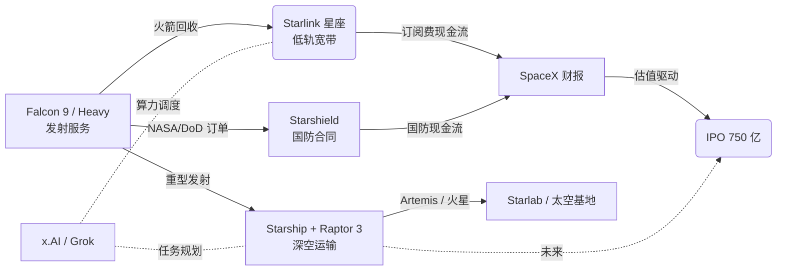

# SpaceX 24 年：从猎鹰 1 号的灰烬到「人类最大 IPO」，一家被嘲笑的公司如何重写进入太空的成本

2008 年 9 月 28 日，一枚叫「猎鹰 1 号」的火箭从马绍尔群岛的夸贾林环礁升空。这是 SpaceX 的第四次尝试。前三枚全炸了，公司账面现金只够再做一次。马斯克在发射前告诉团队：「这次再失败，SpaceX 就完了。」

火箭入轨了。5 个月后，NASA 签下 16 亿美元的 COTS 合同。

这不是一个关于「梦想成真」的故事。SpaceX 过去 24 年的真正成果，是一套无法用「火箭公司」概括的系统：Falcon 9 发射服务打底，Starlink 订阅费供血，Starshield 国防合同锁住政府客户，Starship 把触角伸向深空，x.AI 则在 2026 年把算力和通信叠了进去。2026 年 6 月的 750 亿美元 IPO（按硅谷 101 报道口径）——史上最大——卖的是这套「发射 + 轨道 + 深空」三层基础设施的长期订阅权。

以下内容以硅谷 101 实地探访（BV1y5EY62E8B，75 分钟，2026-06-10）与张小珺 180 分钟访谈 Lewis Hong（BV1HfEy6jEUx，2026-06-11）为主，辅以 2023 年「甲子光年」专访和 2024 年 SV101 E155。

---

## 一、三层系统，不是一枚火箭

大多数报道把「火箭」当主角。SpaceX 跑通的是三套并行系统，火箭只是其中一环的载体：

| 系统 | 关键载体 | 主要客户 | 状态（2026-06） |
|---|---|---|---|
| **发射服务** | Falcon 9 / Falcon Heavy | NASA、商业卫星、DoD | 稳态运营，发射频率全球第一 |
| **近地轨道基础设施** | Starlink v2 Mini / Starshield | 全球宽带、DoD/情报 | 最大低轨星座 + 国防合同 |
| **深空运输** | Starship + Raptor 3 | NASA Artemis、商业月球、火星 | 试飞中，2025 下半年已多次筷子夹回收 |

```mermaid
flowchart LR
  A[Falcon 9 / Heavy<br>发射服务] -->|火箭回收| B(Starlink 星座<br>低轨宽带)
  A -->|NASA/DoD 订单| C[Starshield<br>国防合同]
  B -->|订阅费现金流| D[SpaceX 财报]
  C -->|国防现金流| D
  A -->|重型发射| E[Starship + Raptor 3<br>深空运输]
  E -->|Artemis / 火星| F[Starlab / 太空基地]
  D -->|估值驱动| G(IPO 750 亿)
  E -.未来.-> G
  X[x.AI / Grok] -.算力调度.- B
  X -.任务规划.- E
```

发射服务、Starlink 订阅、Starshield 合同三路支撑财报，Starship 在远期补一个高客单价深空业务。x.AI 是横向的算力层，被 Starlink 和 Starship 同时使用。张小珺在节目里（OUTLINE 02:11:19）把它概括成一句话：**SpaceX 正在把发射、通信、国防、月球任务和太空港口，串成一套新的太空基础设施**。造一枚能飞的星舰只是手段，这套基础设施才是商业模型的核心。

---

## 二、2002–2008：被嘲笑的 6 年

SpaceX 的故事常从 2008 年拿到 NASA 合同讲起。但 2002 到 2008 才是决定这家公司的 6 年。

猎鹰 1 号前三次发射全部失败：

- 2006-03-24：点火 25 秒后燃油管路泄漏起火，火箭坠海。
- 2007-03-21：进入飞行阶段 5 秒后主引擎熄火，第二级失控。
- 2008-08-03：一级表现良好，二级分离后第二分钟翻滚失控，坠海。

第三次失败后，公司账面现金只够再做一次发射。第四次——猎鹰 1 号 Flight 4——成功了。

Lewis Hong 2012 年 9 月才加入 SpaceX，没赶上这段。但他在张小珺 180 分钟访谈里（OUTLINE 01:56:35）特意补了一刀：他把这 6 年定位为「**在没有可借鉴供应链、没有 NASA 大单的情况下，先把一条民商航天的工业链条从零拉起来**」。Falcon 1 是产品，更是公司商业模型的一次端到端验证。这 6 年练的不是火箭，是流程——内部供应链、迭代节奏、以及「全员看发射直播 + 失败后 24 小时内出事故报告」的公司文化。这些是 Falcon 9 接下来 10 年能稳定的隐性资产。

---

## 三、2008–2015：NASA 订单让公司活下来，但猎鹰 9 号差点又杀了它

COTS 合同 + 后续 CRS（Commercial Resupply Services）给了 SpaceX 两样东西：**现金流**和**政府客户**。商业航天最难的就是这两个。2012 年 Dragon 首次对接国际空间站，2013 年首次执行 NASA 货运补给任务。到 2015 年，SpaceX 已经是 NASA 商业补给的主要承包方。

但猎鹰 9 号并不稳。2015–2016 年，两次爆炸差点击垮公司：

- **2015-06-28 CRS-7 任务**：发射 139 秒后空中爆炸。Lewis Hong 那时是猎鹰 9 号首席制造工程师，他在 2023 年「甲子光年」专访里复述过当时的感受——「gut wrenching」。这次爆炸源于他们团队的工艺缺陷。马斯克在 7 月 20 日电话会议给出结论：二级液氧箱内部固定氦气罐的支架折断。SpaceX 停飞半年。

- **2016-09-01 AMOS-6 任务湿彩排**：猎鹰 9 号在发射台爆炸，0.093 秒内数据全失。马斯克后来形容这是 SpaceX 历史上最复杂的一次故障。Lewis Hong 前一晚工作到清晨 6 点，电话吵醒他时只听见一句：「Lewis，猎鹰出事了，你快来吧。」AMOS-6 同时炸毁，扎克伯格的 Internet.org 项目跟着遭殃。

两次爆炸后，SpaceX 的决策是**重新设计 Falcon 9 全箭，不是修小补丁**。内部流传一句话：「Get shit done。」

到 2017 年，Falcon 9 进入 Block 5 代。一级回收变成标配（2015-12 首次陆地回收，2016-04 首次海上回收）。这件事改写了商业航天的成本结构。

---

## 四、2015–2024：复用 + Starlink，把发射成本打到 1/3

Falcon 9 一级回收，表面是技术胜利，底子是**财务模型胜利**。

按公开估算：

- Falcon 9 全新火箭单次发射价格约 6,700 万美元（2023 年公开价目）。
- 复用 Falcon 9 的边际成本主要是一级翻修 + 燃料，按多次公开访谈与机构测算，单次可降到 1,500–2,500 万美元。
- 商业卫星运营商拿到的是「同等运力 + 约 1/3 价格」。

这个成本结构的两端都是 SpaceX 自己的：上游通过复用拿到单次发射毛利，下游把节省的成本反哺到自家 Starlink。

Starlink 是这个商业模型的另一个支柱。2019 年 5 月首批 60 颗 v0.9 上轨，到 2026 年 6 月已超过 7,500 颗在轨（按公开统计），是全球最大低轨星座。它解决的是一个很实际的问题：**运力过剩时卖给谁**。商业卫星订单排不上时，SpaceX 仍有自家任务可发；任务之间有空档，火箭顺手把 Starlink 送上去，不让发射台闲置。Starlink 自身在 2024 年已破百亿美元年化营收（按公开数据）。

Lewis Hong 在张小珺访谈里提到 SpaceX 现金流结构的变化：早期是「火箭送完货才有钱」的单轮收入，2018 年以后，「Starlink 订阅费 + 发射服务」构成稳定的双轮营收。这不是偶然的财务设计，是回收火箭带来的现金流稳定化。加上 2024 年 Starshield 国防合同，SpaceX 已经从「接订单造火箭」的承包商，长成一家**在低轨卖宽带、给政府卖接入**的运营商。火箭是它的发电厂。

---

## 五、2024–2026：Starship + x.AI，把「太空 + AI」串成同一个故事

2026 年 6 月的 IPO，关键不在融资金额（750 亿美元），也不在估值（1.77 万亿，按硅谷 101 描述），而在 SpaceX 对外讲的新故事：

> 地球上是算力（x.AI / Grok）+ 通信（Starlink / Starshield），地球外是发射 + 轨道 + 深空。太空和 AI 在一起跑。

收购整合的时间线，按公开报道拼起来：

- x.AI 是马斯克 2023 年创办的 AI 公司，主打 Grok 模型。2024 年 5 月完成 60 亿美元 B 轮。
- 2026 年 4 月起，x.AI 与 X（原 Twitter）整合。
- 2026 年 5–6 月，SpaceX 收购/合并 x.AI 的细节陆续披露。
- 2026 年 6 月，SpaceX 完成 IPO。

合并后的四块业务分工：**x.AI** 提供算力与算法（Grok / 太空任务规划 / 卫星调度），**Starlink** 提供带宽，**Starshield** 提供政府合同入口，**Starship** 提供地球外物理运输。先把地球上能跑通的钱流跑通，再延伸到太空。

这条故事在 2026 年 6 月成立，是因为 Starship 在 2024–2025 年间已经从「连续失败」走到多次筷子夹回收：

- 2024-10-13：IFT-5，星舰首次实现「筷子夹」（Mechazilla 发射塔夹住返回的超重助推）。
- 2025-01-16：IFT-7，再次筷子夹。
- 2025-03-06：IFT-8，第二级失控解体，但助推器筷子夹成功。
- 2025-05-27：IFT-9，第二级再次成功软溅落。
- 2025-08-26：IFT-10，第二级在加勒比海失控解体，但助推器筷子夹成功。
- 2025-10-13：IFT-11，第二级再次失控解体。
- 2026-04–05：星舰 v3 准备发射，数次延期。

这些数字单独看「还没稳」，放在 6 年尺度上已经是进步最快的阶段。每代星舰迭代间隔从 18 周缩到 8 周。Lewis Hong 反复强调：SpaceX 恐怖的不在单次试飞成功率，在**单次试飞数据复用到下一枚星舰的速度**。

### 一次 Falcon 9 商业卫星发射任务如何流过 SpaceX

用一个具体任务把上面三套系统串起来。假设一家商业卫星运营商（类似 Iridium / SES 级别）下了一单 Falcon 9 拼车发射：

- **t-30 天**：客户提交 payload spec，排进共享发射窗口。Starlink 拼车时直接排进同一发任务，客户不用单独买一枚火箭。
- **t-7 天**：任务分给一枚已翻修过的 Falcon 9 Block 5（可能已飞过 15 次以上）。制造团队从任务批次里拉出这枚箭的飞行历史，决定哪些发动机该换、热防护修不修。x.AI/Grok 在这一阶段已参与——根据历史数据预测这枚火箭本次飞行的可靠性。
- **t-1 天**：Falcon 9 运到 SLC-40 / SLC-4E，做静态点火。Starshield 任务也在同一发射场错峰进行。
- **t-0**：发射。一级 MECO 后返回，海上回收船 OCISLY / JRTI 待命。着陆成功，一级 7 天后再次复用。
- **t+1 小时**：任务结束。Starlink 卫星继续上行；商业客户卫星在预定轨道释放。任务数据写入报告，x.AI/Grok 把数据加进训练集。
- **t+1 月**：客户收到报告 + 账单。团队复盘，一级翻修决策写进流程。

SpaceX 的产品不是一枚火箭，是**一整套从「复用制造 → 排期 → 发射 → 回收 → 数据回流」的系统**。Falcon 9 是系统里最容易被看到的一环，但只占价值链 1/3。剩下 2/3 在 Starlink 订阅、Starshield 合同、x.AI 算力调度这些不叫「火箭」的业务里。

---

## 六、一个工程师的 7 年 SpaceX

Lewis Hong（洪力德）2012 年 9 月入职，被老同学 Eric（前 50 号员工）两分钟电话说服：「这是全世界第一家火箭工厂，而且要在洛杉矶市中心干这件事。」那时 SpaceX 不到 500 人。

面试时，现任星舰基地负责人 Mark Juncosa 给他出了一道环应力问题。他快 20 年没碰物理，直接回答「我忘了具体公式，可以尝试着推导」。后来 Mark 告诉他：「我不相信有任何人知道那个答案。」但 Lewis Hong 在压力下的应对让 Mark 觉得「无论如何都必须留下这个人」。这件事浓缩了 SpaceX 的用人观：**不要找最懂答案的人，要找在高压下还能继续推导的人**。

入职 3 个月进猎鹰 9 号研发与制造。2015 年 CRS-7 爆炸时他已是首席制造工程师，全公司一起看直播，他迟到了——「不祥的预感」。2016 年 AMOS-6 爆炸他不在现场。两次爆炸后他被调去重建工艺流程。2017 年起管理研发、生产、物流等 7 个部门，覆盖 3,000 多个火箭部件。

2019 年他离开，去做卡车电池的 Romeo Power。后来公司上市，他结识了现在的合伙人 KC McCreery，一起创办了 FP Solutions 做 VC 投资。

他对 SpaceX 的判断，有一段话：

> SpaceX 真正能跑通的原因不是某项技术比别人强，是整家公司能围绕一个目标持续高速迭代，这在传统航天工业是反常的。
>
> 星舰现在不完美的部分，5 年内一定会解决。但 5 年内 SpaceX 能不能成为 NASA 和美军都无法绕开的航天基础，这件事在 2024 年已经决定了。

Lewis Hong 走完了「产品工程师 → 制造负责人 → 7 部门管理者 → 离开做 VC」这条路。他的判断带着公司内部分钟级的记忆：爆炸当天的日历、面试时的具体问题、被调去重建工艺的那几个月。这种密度不是 PR 稿能复刻的。

---

## 七、750 亿美元 IPO 之后

2026 年 6 月这个时点的 SpaceX，是一张三段式增长表：

| 阶段 | 时间 | 主要营收 | 估值支撑 |
|---|---|---|---|
| 早期 | 2002–2014 | NASA COTS/CRS 合同 | 「能造能飞的火箭」 |
| 中期 | 2015–2024 | Falcon 9 商业发射 + Starlink 订阅 | 「可复用的发射服务 + 低轨宽带」 |
| 现在 | 2025– | Falcon 9 + Starlink + Starshield + Starship + x.AI | 「太空 + AI 基础设施」 |

下一步的关键观察点：

**Starship v3 何时进入稳态运行**——2026 年下半年若能完成「成功入轨 + 完整回收 + 重型载荷交付」三次连续成功，2027 年起可替代 Falcon 9 一部分高轨任务，估值故事从预期变现实。

**x.AI 与 SpaceX 的整合深度**——Grok 已在卫星调度和任务规划中应用。若能跑出独立收入，x.AI 会让 SpaceX 估值里再算上一份 AI 业务。

**Starshield 国防合同稳定化**——五角大楼 / 太空军 / 情报体系的合同签到 2030 年，SpaceX 的现金流就会和军工级一样稳。

**火星时间表**——马斯克 2026 年公开表态「4 年内无人星舰去火星，8 年内载人」。这取决于 Starship 节奏、资金和 NASA Artemis 计划三条线。

判断一家商业航天公司，看四件事：**复用率**——一级火箭一年复用多少次，是工程能力的第一指标，Falcon 9 Block 5 的极限至今仍在刷新；**订单结构**——NASA + DoD + 商业卫星三类客户的比例，单类超过 60% 就是结构脆弱，SpaceX 当前三类均衡；**生态绑定**——发射 + 宽带 + 国防 + AI 算力，至少要有 3 项才不是单纯卖火箭，SpaceX 4 项全有；**高管留存**——制造、推进、结构、运营的副总裁是否在岗，SpaceX 在 2024–2025 年流失了 Mark Juncosa 和推进 CTO Tom Mueller，给星舰节奏带来不确定性。

硅谷 101 实地探访 Boca Chica 与洛杉矶总部，张小珺 180 分钟访谈 Lewis Hong，两期节目拼出来的是一家被嘲笑的工程公司怎么长成 NASA、DoD、资本市场都绕不开的基础设施。

去火星这件事是不是梦想，是工程题。等下一枚星舰落地再回来看。

---

**参考与延伸**

- 硅谷 101《SpaceX 崛起史：一切，为了去火星》，BV1y5EY62E8B，2026-06-10 发布，嘉宾 Lewis Hong
- 张小珺商业访谈录《口述 SpaceX 开发史：和前高管洪力德聊》，BV1HfEy6jEUx，2026-06-11 发布，180 分钟
- 硅谷 101 E155《马斯克太空梦进度条 70%》，2024-06-13，Lewis Hong 早期访谈
- 甲子光年《独家专访 SpaceX 前华裔高管：真实的马斯克，跟畅销书里的不一样》，2023-11-17，作者苏霍伊
- SpaceX 官方公告与 NASA COTS / CRS / Artemis 公开合同
- 公开统计：Starlink 在轨数、SpaceX 2024 年收入结构、Falcon 9 发射次数
