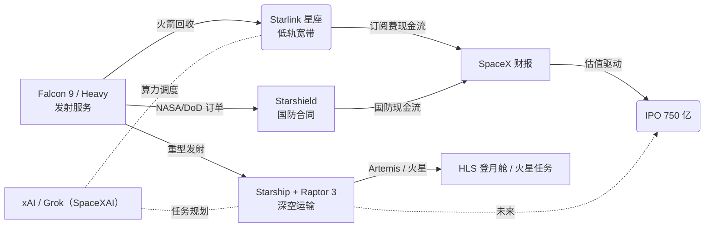

# SpaceX 24 年：从猎鹰 1 号的灰烬到「人类最大 IPO」，一家被嘲笑的公司如何重写进入太空的成本

2008 年 9 月 28 日，一枚叫「猎鹰 1 号」的火箭从马绍尔群岛的夸贾林环礁升空。这是 SpaceX 的第四次尝试。前三枚全炸了，公司账面现金只够再做一次。马斯克在发射前告诉团队：「这次再失败，SpaceX 就完了。」

火箭入轨了。86 天后，NASA 签下 16 亿美元的 CRS 商业补给合同（2008-12-23）。

这不是一个关于「梦想成真」的故事。SpaceX 过去 24 年的真正成果，是一套无法用「火箭公司」概括的系统：Falcon 9 发射服务打底，Starlink 订阅费供血，Starshield 国防合同锁住政府客户，Starship 把触角伸向深空，xAI 则在 2026 年把算力和通信叠了进去。2026 年 6 月 12 日，公司以代码 SPCX 挂牌纳斯达克：发行价 135 美元，募资 750 亿美元、估值 1.77 万亿美元，双双史上最大——卖的是这套「发射 + 轨道 + 深空」三层基础设施的长期订阅权。

以下内容以硅谷 101 实地探访（BV1y5EY62E8B，75 分钟，2026-06-10）与张小珺 180 分钟访谈 Lewis Hong（BV1HfEy6jEUx，2026-06-11）为主，辅以 2023 年「甲子光年」专访和 2024 年 SV101 E155；涉及 IPO、星舰试飞、Starlink 财务等公开数据，另按 2026-09-23 的公开记录复核过一轮。

---

## 一、三层系统，不是一枚火箭

大多数报道把「火箭」当主角。SpaceX 跑通的是三套并行系统，火箭只是其中一环的载体：

| 系统 | 关键载体 | 主要客户 | 状态（2026-09） |
|---|---|---|---|
| **发射服务** | Falcon 9 / Falcon Heavy | NASA、商业卫星、DoD | 稳态运营：F9/重猎累计 702 次，约每周 3 发 |
| **近地轨道基础设施** | Starlink v2 Mini / Starshield | 全球宽带、DoD/情报 | 最大低轨星座：在轨约 1.04 万颗，用户超 1,200 万 |
| **深空运输** | Starship + Raptor 3 | NASA Artemis、商业月球、火星 | 试飞中：V3 已首飞（2026-05），累计 13 次试飞 |

```mermaid
flowchart LR
  A[Falcon 9 / Heavy<br>发射服务] -->|火箭回收| B(Starlink 星座<br>低轨宽带)
  A -->|NASA/DoD 订单| C[Starshield<br>国防合同]
  B -->|订阅费现金流| D[SpaceX 财报]
  C -->|国防现金流| D
  A -->|重型发射| E[Starship + Raptor 3<br>深空运输]
  E -->|Artemis / 火星| F[HLS 登月舱 / 火星任务]
  D -->|估值驱动| G(IPO 750 亿)
  E -.未来.-> G
  X[xAI / Grok（SpaceXAI）] -.算力调度.- B
  X -.任务规划.- E
```

发射服务、Starlink 订阅、Starshield 合同三路支撑财报，Starship 在远期补一个高客单价深空业务。xAI 是横向的算力层，被 Starlink 和 Starship 同时使用。张小珺在节目里（OUTLINE 02:11:19）把它概括成一句话：**SpaceX 正在把发射、通信、国防、月球任务和太空港口，串成一套新的太空基础设施**。造一枚能飞的星舰只是手段，这套基础设施才是商业模型的核心。

---

## 二、2002–2008：被嘲笑的 6 年

SpaceX 的故事常从 2008 年拿到 NASA 合同讲起。但 2002 到 2008 才是决定这家公司的 6 年。

猎鹰 1 号前三次发射全部失败：

- 2006-03-24：点火 33 秒后燃油管路泄漏起火，火箭坠海。起初归咎于螺帽没拧紧，DARPA 复查发现是运输途中盐雾腐蚀惹的祸。
- 2007-03-21：一级正常，二级飞行到 4 分 20 秒起出现锥形摆动，7 分 30 秒主引擎提前关机——液氧晃动叠加分离时对喷管的磕碰，姿态控制过补偿后失控，火箭未入轨。
- 2008-08-03：一级工作正常，分离后一级残余燃料蒸发产生瞬态推力，一级追上二级直接相撞。

第三次失败后，公司账面现金只够再做一次发射。第四次——猎鹰 1 号 Flight 4——成功了。三连败各败在一层不同的东西上：管路、推进剂管理、分离时序。这也是复用火箭和快速迭代的隐含前提：每一次失败都要能定位到具体一层，下一次才能改对地方。

Lewis Hong 2012 年 9 月才加入 SpaceX，没赶上这段。但他在张小珺 180 分钟访谈里（OUTLINE 01:56:35）特意补了一刀：他把这 6 年定位为「**在没有可借鉴供应链、没有 NASA 大单的情况下，先把一条民商航天的工业链条从零拉起来**」。Falcon 1 是产品，更是公司商业模型的一次端到端验证。这 6 年练的不是火箭，是流程——内部供应链、迭代节奏、以及「全员看发射直播 + 失败后 24 小时内出事故报告」的公司文化。这些是 Falcon 9 接下来 10 年能稳定的隐性资产。

---

## 三、2008–2015：NASA 订单让公司活下来，但猎鹰 9 号差点又杀了它

CRS 合同给了 SpaceX 两样东西：**现金流**和**政府客户**。商业航天最难的就是这两个。2012 年 5 月 Dragon 首次与国际空间站对接，同年 10 月执行第一单正式补给任务（CRS-1）。到 2015 年，SpaceX 已经是 NASA 商业补给的主要承包方。

但猎鹰 9 号并不稳。2015–2016 年，两次爆炸差点击垮公司：

- **2015-06-28 CRS-7 任务**：发射 139 秒后空中爆炸。Lewis Hong 那时是猎鹰 9 号首席制造工程师，他在 2023 年「甲子光年」专访里复述过当时的感受——「gut wrenching」。这次爆炸源于他们团队的工艺缺陷。马斯克 7 月 20 日对外给出结论：二级液氧箱内固定氦气罐的钢质支架折断。SpaceX 停飞半年。

- **2016-09-01 AMOS-6 任务静态点火前加注**：猎鹰 9 号在发射台爆炸，箭星俱毁。马斯克后来形容这是 SpaceX 历史上最复杂的一次故障，直到 2017 年 1 月才定性：二级液氧箱复合材料压力容器（COPV）衬套失稳，固体氧在缝隙间摩擦点燃。Lewis Hong 前一晚工作到清晨 6 点，电话吵醒他时只听见一句：「Lewis，猎鹰出事了，你快来吧。」Facebook 为 Internet.org 租下的 Ka 波段容量也随之打了水漂。

两次事故后，SpaceX 的选择是改设计、改流程，但不停摆：CRS-7 后停飞半年复飞，AMOS-6 后四个半月复飞。内部流传一句话：「Get shit done。」

一级回收变成标配（2015-12-21 首次陆地回收，2016-04-08 首次海上回收）；2017 年 3 月 SES-10 任务首次把飞回来的旧一级再飞一次；2018 年 5 月 Block 5 首飞，同一枚一级反复使用从此常态化——单枚复用纪录已到 37 次（2026-09），还在刷新。这件事改写了商业航天的成本结构。

---

## 四、2015–2024：复用 + Starlink，把发射成本打下来

Falcon 9 一级回收，表面是技术胜利，底子是**财务模型胜利**。

按公开口径：

- Falcon 9 单次发射标价 2026 年为 7,400 万美元（Block 5 价目）。
- 机构对单次内部成本的估算在 1,500–2,800 万美元（2024 口径），大头是一级翻修与运营，燃料只占零头。
- 复用省下的差价 SpaceX 没有让利——标价不降反升，真正拿到便宜的是拼车客户：2025 年起拼车价 30 万美元/50 公斤起。

这个成本结构的两端都是 SpaceX 自己的：上游通过复用拿到单次发射毛利，下游把节省的成本反哺到自家 Starlink。

Starlink 是这个商业模型的另一个支柱。2019-05-24 首批 60 颗上轨，到 2026 年 6 月在轨约 1.04 万颗，占全球活跃可机动卫星约四分之三，用户突破 1,200 万。它解决的是一个很实际的问题：**运力过剩时卖给谁**。商业卫星订单排不上时，SpaceX 仍有自家任务可发；任务之间有空档，火箭顺手把 Starlink 送上去，不让发射台闲置。IPO 招股书（S-1）披露：Starlink 2025 年营收 114 亿美元、经营利润 44 亿美元，2024 年已实现首次盈利。

Lewis Hong 在张小珺访谈里提到 SpaceX 现金流结构的变化：早期是「火箭送完货才有钱」的单轮收入，2018 年以后，「Starlink 订阅费 + 发射服务」构成稳定的双轮营收。这不是偶然的财务设计，是回收火箭带来的现金流稳定化。加上 Starshield 国防合同（2022 年底启动，太空发展局是其导弹防御卫星的关键客户），SpaceX 已经从「接订单造火箭」的承包商，长成一家**在低轨卖宽带、给政府卖接入**的运营商。火箭是它的发电厂。

---

## 五、2024–2026：Starship + xAI，把「太空 + AI」串成同一个故事

2026 年 6 月的 IPO，关键不在募资 750 亿美元、估值 1.77 万亿这两个数字——虽然它们都是史上最大——而在 SpaceX 对外讲的新故事：

> 地球上是算力（xAI / Grok）+ 通信（Starlink / Starshield），地球外是发射 + 轨道 + 深空。太空和 AI 在一起跑。

收购整合的公开时间线：

- 2023：马斯克创办 xAI（3 月注册、7 月公开），主打 Grok。
- 2024-05 / 2024-12：先后完成两轮 60 亿美元融资，投后估值从 240 亿走到 500 亿。
- 2025-03-28：xAI 全股票收购 X（原 Twitter），X 作价 330 亿（含债务 450 亿）、xAI 作价 800 亿，合并为 X.AI Holdings。
- 2026-02-02：SpaceX 全股票收购 xAI——xAI 作价 2,500 亿、SpaceX 作价 1 万亿，合并作价 1.25 万亿，迄今最高作价的收购。此前 2025 年 7 月，SpaceX 已向 xAI 注资 20 亿美元。
- 2026-06-11 / 06-12：IPO 定价 135 美元/股，12 日挂牌纳斯达克，代码 SPCX。
- 2026-07：合并后的 AI 业务统一更名 SpaceXAI。

四块业务的分工由此重新划线：**SpaceXAI** 出算力与模型，合并时给出的目标是太空 AI 数据中心、星载算力与月球/火星长期运营；**Starlink** 出带宽与订阅现金流，前 Starlink 副总裁 Michael Nicolls 2026 年 4 月出任 SpaceXAI 总裁；**Starshield** 出政府合同入口；**Starship** 出地球外物理运输。先把地球上能跑通的钱流跑通，再延伸到太空。

这条故事在 2026 年讲得通，是因为 Starship 在 2024–2026 年间走完了一轮完整的「炸—修—稳」：

- 2024-10-13：Flight 5，首次「筷子夹」（Mechazilla 发射塔臂夹住返回的超重助推器）。
- 2025-01-16 / 03-06：Flight 7 / 8，助推器又夹住两次，但飞船分别因推进剂泄漏和上升段失稳损毁。
- 2025-05-27：Flight 9，首次复用旧助推器，助推器与飞船双双解体——这是 V2 的谷底。
- 2025-08-26 / 10-13：Flight 10 / 11，连续两次全成功（助推器受控海上溅落，飞船溅落点距目标 3 米以内），V2 就此收尾。
- 2026-05-22：Flight 12，V3 首飞，首次携带约 44 吨入轨载荷（Starlink 模拟器），飞船再入正常，助推器高速落水。
- 2026-07-24：Flight 13，部署 20 颗 Starlink V3 试验星（按计划再入烧毁），飞船首次在溅落后保持结构完整、可供检验。

这些数字单独看「还没稳」，放在 6 年尺度上已经是进步最快的阶段：迭代间隔从 Flight 1 到 Flight 2 的 7 个月，压到 2025 年最快 7 周一发（Flight 10 到 11）；V3 换代叠加发射台改造把间隔拉长到约 31 周，Flight 12 到 13 又回到 9 周。Lewis Hong 反复强调：SpaceX 恐怖的不在单次试飞成功率，在**单次试飞数据复用到下一枚星舰的速度**。

### 一次 Falcon 9 商业卫星发射任务如何流过 SpaceX

用一个具体任务把上面三套系统串起来。假设一家商业卫星运营商（类似 Iridium / SES 级别）下了一单 Falcon 9 拼车发射：

- **t-30 天**：客户提交 payload spec，排进共享发射窗口。Starlink 拼车时直接排进同一发任务，客户不用单独买一枚火箭。
- **t-7 天**：任务分给一枚已翻修过的 Falcon 9 Block 5（可能已飞过 15 次以上，纪录是 37 次）。制造团队从任务批次里拉出这枚箭的飞行历史，决定哪些发动机该换、热防护修不修。按访谈口径，Grok 在这一阶段已参与——根据历史数据预测这枚火箭本次飞行的可靠性。
- **t-1 天**：Falcon 9 运到 SLC-40 / SLC-4E，做静态点火。Starshield 任务也在同一发射场错峰进行。
- **t-0**：发射。一级 MECO（主引擎关机）后返回，海上回收船 OCISLY / JRTI 待命。着陆成功，一级几天后即可再次复用。
- **t+1 小时**：任务结束。Starlink 卫星继续上行；商业客户卫星在预定轨道释放。任务数据写入报告，按访谈口径回流进 Grok 的训练集。
- **t+1 月**：客户收到报告 + 账单。团队复盘，一级翻修决策写进流程。

SpaceX 的产品不是一枚火箭，是**一整套从「复用制造 → 排期 → 发射 → 回收 → 数据回流」的系统**。Falcon 9 是系统里最容易被看到的一环，但只占价值链 1/3。剩下 2/3 在 Starlink 订阅、Starshield 合同、SpaceXAI 算力调度这些不叫「火箭」的业务里。

---

## 六、一个工程师的 7 年 SpaceX

Lewis Hong（洪力德）2012 年 9 月入职，被老同学 Eric（前 50 号员工）两分钟电话说服：「这是全世界第一家火箭工厂，而且要在洛杉矶市中心干这件事。」那时 SpaceX 不到 500 人。

面试时，Mark Juncosa 给他出了一道环应力问题。他快 20 年没碰物理，直接回答「我忘了具体公式，可以尝试着推导」。后来 Mark 告诉他：「我不相信有任何人知道那个答案。」但 Lewis Hong 在压力下的应对让 Mark 觉得「无论如何都必须留下这个人」。这件事浓缩了 SpaceX 的用人观：**不要找最懂答案的人，要找在高压下还能继续推导的人**。

入职 3 个月进猎鹰 9 号研发与制造。2015 年 CRS-7 爆炸时他已是首席制造工程师，全公司一起看直播，他迟到了——「不祥的预感」。2016 年 AMOS-6 爆炸他不在现场。两次爆炸后他被调去重建工艺流程。2017 年起管理研发、生产、物流等 7 个部门，覆盖 3,000 多个火箭部件。

2019 年他离开，去做卡车电池的 Romeo Power。后来公司上市，他结识了现在的合伙人 KC McCreery，一起创办了 FP Solutions 做 VC 投资。

他对 SpaceX 的判断，有一段话：

> SpaceX 真正能跑通的原因不是某项技术比别人强，是整家公司能围绕一个目标持续高速迭代，这在传统航天工业是反常的。
>
> 星舰现在不完美的部分，5 年内一定会解决。但 5 年内 SpaceX 能不能成为 NASA 和美军都无法绕开的航天基础，这件事在 2024 年已经决定了。

Lewis Hong 走完了「产品工程师 → 制造负责人 → 7 部门管理者 → 离开做 VC」这条路。他的判断带着公司内部分钟级的记忆：爆炸当天的日历、面试时的具体问题、被调去重建工艺的那几个月。这种密度不是 PR 稿能复刻的。

---

## 七、750 亿美元 IPO 之后

2026 年 6 月这个时点的 SpaceX，是一张三段式增长表：

| 阶段 | 时间 | 主要营收 | 估值支撑 |
|---|---|---|---|
| 早期 | 2002–2014 | NASA COTS/CRS 合同 | 「能造能飞的火箭」 |
| 中期 | 2015–2024 | Falcon 9 商业发射 + Starlink 订阅 | 「可复用的发射服务 + 低轨宽带」 |
| 现在 | 2025– | Falcon 9 + Starlink + Starshield + Starship + xAI | 「太空 + AI 基础设施」 |

下一步的关键观察点：

**Starship v3 何时进入稳态运行**——V3 两飞，飞船都正常，助推器还没成（Flight 12 / 13 均高速落水）。下一发 Flight 14 目标 2026 年 9 月底，首次真正入轨任务、部署 26 颗运营级 Starlink V3。若能完成「成功入轨 + 完整回收 + 重型载荷交付」的连续成功，2027 年起可替代 Falcon 9 一部分高轨任务，估值故事从预期变现实。

**xAI 与 SpaceX 的整合深度**——整合本身已经完成：2026-02-02 交割，7 月更名 SpaceXAI，8 月又把 Cursor（Anysphere）以 600 亿美元全股票收进来。下一个观察点不是整合，而是 SpaceXAI 能不能跑出独立收入——「星载算力 + 编程智能体」是这张故事里最新的一块。

**Starshield 国防合同稳定化**——五角大楼 / 太空军 / 情报体系的多年期合同若持续滚动，SpaceX 的现金流就会和军工级一样稳。

**火星时间表**——公开记录是 2026-02-09 马斯克宣布火星计划推迟约 5–7 年、优先月球基地；在此之前，他给 2026/27 转移窗口（无人星舰与 Optimus 先行）开出的把握只有五成。火星从时点题变成了节奏题，取决于 Starship 节奏、资金和 NASA Artemis 计划三条线。

判断一家商业航天公司，看四件事：**复用率**——一级火箭一年复用多少次，是工程能力的第一指标，Falcon 9 单枚复用纪录 37 次且仍在刷新；**订单结构**——NASA + DoD + 商业卫星三类客户的比例，单类超过 60% 就是结构脆弱，SpaceX 当前三类均衡；**生态绑定**——发射 + 宽带 + 国防 + AI 算力，至少要有 3 项才不是单纯卖火箭，SpaceX 4 项全有；**高管留存**——制造、推进、结构、运营的副总裁是否在岗，推进 CTO Tom Mueller 2020 年底退休（次年创办 Impulse Space），车辆工程负责人 Mark Juncosa 2024 年离开（访谈口径），给星舰节奏带来不确定性。

硅谷 101 实地探访 Boca Chica 与洛杉矶总部，张小珺 180 分钟访谈 Lewis Hong，两期节目拼出来的是一家被嘲笑的工程公司怎么长成 NASA、DoD、资本市场都绕不开的基础设施。

去火星这件事是不是梦想，是工程题。等下一枚星舰落地再回来看。

---

## 谁该去补看原片

这篇是两期节目拼出来的，两期各自的观看价值不一样。

**张小珺 180 分钟访谈（BV1HfEy6jEUx）**：讲者是前首席制造工程师，视角偏"人"。想听 SpaceX 内部怎么开会、面试问什么、爆炸当天的日历细节、一个工程师怎么从产品岗走到 7 部门管理，这期值得完整看。它对"SpaceX 怎么干活"的回答，比任何 PR 稿都具体。

**硅谷 101 实地探访（BV1y5EY62E8B）**：75 分钟，视角偏"系统"。想理解 SpaceX 三层业务结构（发射 + 低轨 + 深空）、Starlink 供血、以及 2026 IPO 的估值逻辑，这期更合适。

**读本文就够**：你只想要"航天 + AI 基础设施"这条判断，或想知道 2026 年 9 月这个时点 SpaceX 的大致版图与投资观察点——上面正文已经覆盖了，不需要再花 4 个多小时刷视频。

---

## 常见误读

- **「筷子夹已经是常规操作」**——不对。筷子夹总共只成功过 3 次（2024-10 Flight 5、2025-01 Flight 7、2025-03 Flight 8）；2025 年下半年起 SpaceX 转向受控海上溅落，给 V3 换代让路。
- **「2025 年星舰连败，项目失控」**——上半年飞船三连损毁（Flight 7/8/9），下半年 Flight 10/11 两连全成功收尾 V2；换到 V3 之后飞船又是两连正常。失败和收尾在同一个年份里。
- **「750 亿美元 IPO 是账上的钱」**——那是募资额。上市后估值 1.77 万亿，募来的钱进公司和早期股东，不等于经营现金流；经营层面的供血者仍是 Starlink 订阅和国防合同。
- **「马斯克说几年内就载人去火星」**——公开记录是 2026-02-09 宣布火星计划推迟约 5–7 年、优先月球。此前最激进的说法也只是 2026/27 窗口无人先行的五成把握。

## 自测清单

- [ ] 说得清 Falcon 1 三连败各败在哪一层吗（管路、推进剂管理、分离时序）？
- [ ] 讲得出 SpaceX 现金流为什么从「一单一结」变成「发射 + 订阅」双轮？
- [ ] 列得出 2024–2026 星舰从首次筷子夹到 V3 两连正常的关键节点吗？
- [ ] 说得出这轮 IPO 的四个硬数字（发行价、募资额、估值、代码）吗？

---

**参考与延伸**

**视频与访谈**

- 硅谷 101《SpaceX 崛起史：一切，为了去火星》，BV1y5EY62E8B，2026-06-10 发布，嘉宾 Lewis Hong
- 张小珺商业访谈录《口述 SpaceX 开发史：和前高管洪力德聊》，BV1HfEy6jEUx，2026-06-11 发布，180 分钟
- 硅谷 101 E155《马斯克太空梦进度条 70%》，2024-06-13，Lewis Hong 早期访谈
- 甲子光年《独家专访 SpaceX 前华裔高管：真实的马斯克，跟畅销书里的不一样》，2023-11-17，作者苏霍伊

**公开记录（2026-09-23 查证口径）**

- SpaceX 招股书（SEC Form S-1，2026-05-20 提交）：Starlink 2025 年营收 114 亿美元、经营利润 44 亿美元，2024 年首次盈利
- 纳斯达克：SPCX 2026-06-12 挂牌，发行价 135 美元，募资 750 亿美元、估值 1.77 万亿美元
- NASA：CRS 商业补给合同公告（2008-12-23，16 亿美元）；CRS-1 任务（2012-10-08）
- Wikipedia：List of Starship launches、SpaceX、xAI、Falcon 1、Falcon 9、Starlink、SpaceX Mars program
- SpaceX 官方公告与 Starshield / Artemis 公开合同信息
