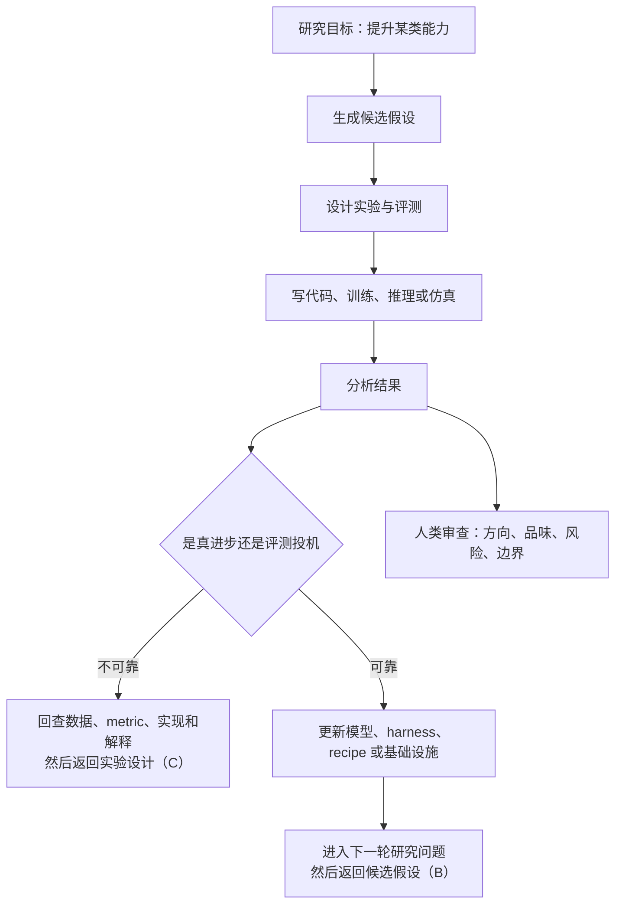

> **作者**：钳岳星君  
> **视频来源**：硅谷 101 视频播客《"不做 AI 螺丝钉"：被 Meta 裁员半年后，田渊栋带着 46 亿美元 AI 实验室回来了》，B 站 BV1DY7C6nEWM，2026-06-05 发布，时长约 1 小时 32 分钟。  
> **对照材料**：B 站视频页、硅谷 101 授权 36 氪发布的文字稿、[Recursive Superintelligence 官网](https://www.recursive.com/)、[GV 对 RSI 的投资说明](https://www.gv.com/news/recursive-superintelligence-self-improving-ai)、[Anthropic《When AI builds itself》](https://www.anthropic.com/institute/recursive-self-improvement)、[TechCrunch 对 RSI 概念的分析](https://techcrunch.com/2026/05/28/rsi-is-the-new-agi-and-its-just-as-hard-to-pin-down/)、[Darwin Gödel Machine](https://sakana.ai/dgm/) 与 [Hyperagents](https://arxiv.org/abs/2603.19461) 等公开研究。  
> **校订说明**：B 站与 YouTube 直抓字幕分别遇到平台限制，这版以硅谷 101 授权文字稿为主要逐段对照文本，并用公开资料核对公司、融资、团队和技术背景。正文只保留极短必要引语，重点做分析和重构。

## RSI 押的不是模型，是研究速度

“田渊栋去了一个 46.5 亿美元估值的新实验室”只是这场访谈的入口。

更大的问题在后面：当模型开始帮助研究模型，AI 产业竞争会从参数、数据和算力，扩展到研究循环、评估体系、组织结构和个人意义。

Recursive Superintelligence（下文简称 RSI）押注的递归自我改进，不该被简化成“AI 自己升级 AI”。田渊栋在访谈里把它拆得很具体：AI 先接手繁琐、重复、重体力的研究劳动，再进一步承担发现新逻辑、新强化方式、新洞察的环节。

最终要提高的不是某个榜单分数，而是 knowledge discovery rate，也就是知识发现速率。

只看前半段，RSI 像是一家 Neolab 的创业故事；看完整场，另外两层含义会浮出来：

1. **技术层**：AI 研究正在从“人类设计、AI 执行”走向“人类设目标、AI 参与发现”。
2. **组织层**：前沿模型竞争越来越像组织工程，能不能 push back、能不能快速反馈、能不能让小团队贯彻信念，会影响技术结果。
3. **个人层**：当公司开始“蒸馏”员工、岗位水位下降，个人不能只在大厂之间跳，而要变成能持续产生新数据、新判断、新作品的系统。

三层合在一起，才是这期视频的主线：AI 自动化研究正在改变先进生产力，而旧的组织关系和职业路径还没跟上。

## 这场访谈追问的是实验室形态

如果只做逐章摘要，这场访谈会被切碎。主持人陈茜一直在换角度追问：田渊栋为什么去 RSI，递归自我改进到底递归什么，AI 能不能做研究，大公司为什么会在模型竞赛里反复暴露组织问题，以及普通人该怎样面对“鱼缸变浅”。

这些问题表面分散，底下连着同一件事：当 AI 开始进入研究流程，实验室不再只是“人类研究员 + 算力 + 论文”的组合，而会变成一个更自动化、更依赖评估、也更受组织结构影响的生产系统。

从视频节奏看，前半小时是在把 RSI 放到桌面上：为什么加入、谁在团队里、Recursive 到底指什么。中段转入技术深处：可解释性、Coconut、潜在推理、顿悟与泛化。后半段则把问题从实验室推到公司和个人：Google、Meta、xAI 的竞争，员工蒸馏的反向激励，以及鱼离开水坑之后还能不能活。

抓住这条线，RSI 就不是一条孤立创业新闻，而是一个观察窗口：AI 研究如何被 AI 改写，组织如何适应新的生产力，个人又该怎样少依赖岗位本身。

## 为什么是 RSI

### 加入 RSI 不是复仇，是换一种实验

很多传播喜欢把这件事写成“前 Meta FAIR 研究总监被裁半年后王者归来”。这个标题抓眼球，也容易遮住田渊栋在视频里的真实动机。

他谈加入 RSI 时，先说的不是估值，也不是“我要证明 Meta 错了”，而是两个更个人、更结构化的理由。

第一，他想体验不一样的人生。他在访谈里提到自己也是小说家，所以“体验人生”本身就重要。

这句话听起来轻，却解释了为什么他没有选择另一个大公司高位，而是进入一个刚组建的实验室。对研究者来说，创业不是单纯换雇主，而是进入一个新的叙事和约束系统。

第二，他判断大模型行业正在变成“小而精、速度快、摩擦少”的方向。大团队的资源优势仍然存在，但组织摩擦会吞掉很多研究判断。

尤其当 AI 工具把执行层速度拉高，慢的地方就不再是写代码，而是目标、反馈、沟通和取舍。

RSI 对他的吸引力不在“这里钱多”，而在“这里是 co-founder 位置，可以参与定义系统”。

他在访谈里也提到，其他团队给他的角色更像 head of AI 或 head of research；既然要创业，联合创始人的身份才对应完整的责任边界。

这使 RSI 超出了一份工作选择，变成田渊栋对下一代 AI 实验室形态的押注。

### 估值先押人，再押产品

RSI 公开资料显示，它由 Richard Socher 领导，联合创始人包括 Caiming Xiong、Tim Rocktaschel、Jeff Clune、Josh Tobin、Alexey Dosovitskiy、Tim Shi、Yuandong Tian 等人。

融资 6.5 亿美元、估值 46.5 亿美元，发生在产品尚未完全公开之前。

为什么资本愿意买单？田渊栋的回答很直：最顶级的资本看重人。

这不是客套话。AI 领域变化太快，早期很难把五年后的产品路线讲死。今天写进 deck 的商业化方向，两个月后可能就被模型能力、算力价格或竞品路线推翻。

此时投资人买的是团队在不确定技术环境里重新定向的能力。

拆开联创背景，RSI 更像一支围绕“研究系统”组起来的队伍。Richard Socher 和 Caiming Xiong 带来创业、研究管理和 Salesforce Research 经验；Tim Rocktaschel 与 Jeff Clune 靠近 open-endedness、agent 和科学发现方向；Josh Tobin、Tim Shi 偏工程、agent 和产品化；Alexey Dosovitskiy 与 Yuandong Tian 则连接 ViT、强化学习、后训练、建模和理论理解。

“8 位联创”不能只看成明星堆叠。RSI 要做的是研究系统，不是单模型。它需要建模、后训练、agent harness、open-ended search、工程落地和商业判断一起工作。一个只会发论文的团队不够，一个只会搭产品的团队也不够。

田渊栋在访谈里说团队整体比较民主，大家会有很多碰撞，最后在想法和逻辑上达成一致。对前沿研究公司来说，民主不是管理姿态，而是降低错误方向被权威强推的概率。

## 递归的是研究循环，不是神话

### 递归自我改进先从脏活累活开始

RSI 最容易被误读的地方，是把 recursive self-improvement 想象成某个模型突然觉醒，然后无限自我升级。

田渊栋讲得更朴素：用 AI 优化 AI 自己的一些环节，让 AI 变得更强，再在新的基础上继续迭代。

这个定义里有三个层次。

第一层是自动化劳动。研究员大量时间花在搭环境、跑实验、改配置、排查错误、写脚本、整理结果上。AI 先替代这些繁琐工作，是最现实的起点。

第二层是自动化洞察。AI 不只是执行人类列好的任务，还要发现新的逻辑、新的强化方式、新的实验方向。到这一步，系统才碰到研究能力本身。

第三层是自动化研究系统。把计算资源输入系统，输出新的知识、见解和可验证结果。RSI 官方与访谈里都强调 knowledge discovery rate，说明它关心的是研究循环吞吐，而不是单次模型分数。

田渊栋没有把 benchmark 神化。主持人追问“是真能力提升，还是指标过拟合”时，他的回答是：benchmark 只是手段，最终要看高层次任务是否真的有价值。指标只能服务研究判断，不能替代研究判断。

把这件事画成任务流，大致是这样：

这条链路最难的不是写实验代码，而是判断结果是否值得保留。AI 可以生成很多方案，研究能力却体现在少数正确方向的识别上。

### RSI 的第一道墙是评估

访谈里有一个问题切得很准：如果 AI 开始自主设计实验、自主评估结果，人类还可不可以作为可靠评判者？这是 RSI 的第一道硬墙。

田渊栋的回答很克制：至少现在，AI 还达不到人类评估标准，所以短期内人类仍然可以当评判者。

但当 AI 继续变强，很多评估会从客观标准转向主观判断。比如代码结构好不好、模块划分是否优雅、研究方向有没有价值，本来就没有单一正确答案。

评估会沿着任务难度往上迁移。执行层还能靠单元测试、benchmark 和 metric；到了工程层，代码结构、稳定性、可维护性已经需要人类判断；再往上到研究层，问题变成“有没有产生新洞察、有没有打开新方向”；最后到了系统层，评价对象不再是单次输出，而是人与 AI 合作后的整体产出。

RSI 不是简单把人类从研究流程中拿掉，而是在不断调整人类的位置。早期人类是任务定义者和结果评审者；中期人类会更像研究品味和风险边界的维护者。

如果未来 AI 真能越过人类能力边界，人类评估也必须升级为多模型验证、机制解释、外部审计和最终产出判断的组合。

“评估者也要被评估”不是哲学段子，而是工程需求。一个自我改进系统，如果评估体系被自己骗过，就会在错误方向上加速。

### 可解释性也是省算力的工具

田渊栋谈可解释性时，没有只讲安全。他把可解释性拆成两件事：安全机制和效率机制。

安全层面不难理解。AI 如果开始修改代码、权重或训练流程，人类必须知道它为什么这样做。

否则，所谓监管就只剩下事后看结果：结果好就放行，结果坏就回滚。这在普通软件里已经危险，在递归自我改进里更危险，因为错误可能被后续系统继承。

效率层面更容易被忽略。前沿训练动辄几千、几万块卡。如果每次都等训练结束后再判断方向，研究循环会极慢。可解释性如果能把判断提前，让团队在训练中途就看出模型方向和内部机制，就能少走很多昂贵弯路。

放进 RSI 语境，可解释性就不只是道德姿态或 safety 包装。它更像仪表盘和刹车系统：不必等最终指标出来才知道方向错没错；模型修改代码、权重或训练流程时，人类能追问意图和影响范围；评测分数上升时，团队也能区分是真能力提升，还是模型钻了 metric 的空子。

RSI 路线越激进，可解释性越不能后置。自我改进系统越会动自己的内部结构，人类越不能只做结果消费者。

## 模型怎么想，比模型说什么更重要

### 语言不是思考本体

视频中段谈到 Coconut 和 latent reasoning。这不仅是田渊栋过去在 Meta 的研究兴趣，也和 RSI 的自动化研究路线高度相关。

田渊栋的判断可以压缩成一句：语言很有用，但语言不是思考本身。

当前大模型大量依赖 Chain of Thought（思维链），也就是把推理过程写成自然语言。田渊栋并不认为这条路线错。它实用、可解释、好训练，也是今天模型推理能力的重要来源。

但如果把语言当成思考本体，就会错过另一种可能：人类很多思考并不是先以句子形式发生，而是以图像、结构、模糊方向、并行候选路径出现，最后才被压缩成语言。

潜在推理的想法，是让模型在连续潜在空间里思考，而不是每一步都吐出语言 token。它的潜在优势有两个：

1. **信息密度更高**：latent token 可能承载比语言 token 更丰富的状态。
2. **并行候选更多**：模型可以在内部同时保留几条思路，再选择更好的路径，而不必把每条路径都写成语言。

这会直接影响 RSI 的想象空间。自动化科研的目标不是写一篇漂亮的推理过程，而是找到有用的研究方向。

语言推理适合解释，潜在推理可能更适合搜索、压缩和并行探索。AI 如果要做研究员，而不只是做会写报告的助手，可能需要一种比自然语言更接近“思考空间”的内部表示。

这里也要保持边界：访谈里并没有说 RSI 已经公开采用某种具体 Coconut 路线，也没有披露内部架构。能确定的是，田渊栋把“语言不是思考本体”视为推理路线的重要判断，这会影响他如何看待下一代研究系统。

### 顿悟发生在记忆塌缩之后

另一段常被传播稿略过的内容，是“顿悟”与泛化。

田渊栋提到，他过去关于模型顿悟的研究，关注的是模型如何从记忆走向泛化。

在一些结构化数据上，可以观察到模型早期像是在记忆样本；当数据量达到某个临界条件后，系统突然转向更泛化的解。这个过程甚至可以用能量函数来描述：数据不足时，能量最低点对应记忆解；数据足够时，结构会转向泛化解。

这段话和 RSI 的关系不在表面，而在底层。递归自我改进如果只是让 AI 更快试错，还不够。系统必须理解训练机制：模型什么时候只是在记忆，什么时候学到可迁移规律；什么时候更多数据会触发泛化，什么时候只是堆料。

这些问题最后会汇到同一个方向：潜在推理关心 AI 内部如何更高效地表示和搜索思路；顿悟与泛化关心模型什么时候从记忆跃迁到理解；可解释性关心人类如何提前看见模型内部变化；自动化科研则要把这些机制放进可迭代的研究系统。

一般新闻稿会停在“AI 自我进化”这层叙事；技术上更难的问题在后面。RSI 的“递归”不只是外层流程递归，还可能牵涉模型内部表示、训练动力学和研究评估机制的递归。

## RSI 卖的可能是一台研究机器

主持人问 RSI 商业化时，田渊栋没有给一个传统产品清单，而是讲了几类可能落地的方向。

第一类是推理效率。能不能训练出模型，让大模型推理更快、成本更低？这类成果离产品最近，因为它直接影响推理成本和延迟。

第二类是训练 recipe。能不能找到新的训练方案，让模型效果更好或训练更省？这也是明确的商业价值。

第三类是建模人类研究思维。如果系统能把人类做研究时的思考方式建模得足够好，就可以承担原来只有人类研究者才能做的复杂任务。

这三类方向看似不同，却共享同一套底层系统：自动提出方案、自动试验、自动验证、自动总结。田渊栋说研究会更像一个 product，指的不是“把论文打包出售”，而是把研究循环本身产品化。

这里有一个节奏判断：他提到最初一年到一年半，目标是把系统先扎实做好、深入推进，之后再寻找更好的落地场景。这个节奏比普通 AI 应用创业慢得多，也说明 RSI 不是在做“六个月跑 MVP”的产品，而是在搭一个研究基础设施。

因此，46.5 亿美元估值不能用普通 SaaS 收入逻辑理解。资本押的是：如果自动化科研系统成立，它会先改造 AI 研究，再外溢到物理、化学、生物、材料、药物和工程优化等领域。这个赌注极大，但风险也极大。

### 三道闸门决定 RSI 能不能成立

把视频和公开资料放在一起看，RSI 的成败不取决于某一个模型指标，而取决于三道闸门能不能同时打开。

| 闸门 | 要解决的问题 | 过关信号 | 失败信号 |
| --- | --- | --- | --- |
| 研究闸门 | AI 能否产生有用研究候选，而不是堆方案 | 候选实验能被人类研究者采纳，并反复带来新 recipe | 想法很多，但大多停在已有论文重组 |
| 评估闸门 | 系统能否分辨真进步和评测投机 | 新结果能通过外部分布、人工审查和机制解释 | benchmark 上升，真实任务没有改善 |
| 组织闸门 | 小团队能否把分歧压成更快反馈 | 研究者能直接 push back，坏方向早停 | 创始人光环压过证据，估值压力逼出伪产品 |

三道闸门少任何一个，系统都容易失真：研究闸门没过，会变成想法生成器；评估闸门没过，会变成刷榜机器；组织闸门没过，会变成高估值实验室的演示工程。

### DGM 和 Hyperagents 只能走到半路

理解 RSI，不能只看公司叙事。过去一年，自我改进智能体已经有几个公开参照物。

Darwin Gödel Machine（DGM）展示了一个自我改进 coding agent：系统改写自己的代码，再用 SWE-bench、Polyglot 等 benchmark 验证改动是否有效。

它的意义在于绕开“必须数学证明自我修改必然更好”的不现实要求，改用经验验证筛选有用分支。

Hyperagents 则把任务智能体和元智能体放进同一个可编辑程序里：任务智能体解决目标任务，元智能体修改系统自身。

它提醒我们，自我改进不是单个 agent 多跑几次，而是元级别机制和任务级别表现之间形成正反馈。

把它们放到 RSI 旁边，差距会很清楚：

| 层级 | 公开研究已经能看到什么 | RSI 需要跨过什么 |
| --- | --- | --- |
| 代码自改 | DGM 能让 coding agent 修改自身工具链并评测 | 从 coding benchmark 扩展到 AI 研究流程 |
| 元级改进 | Hyperagents 能把任务与元修改放入同一程序 | 让元级改进在开放研究中长期有效 |
| 验证机制 | benchmark 可以筛掉部分坏改动 | 防止评测投机、伪进步和自我欺骗 |
| 安全边界 | 沙箱、人类监督、有限任务 | 面向前沿模型训练的审计和解释体系 |

RSI 不是凭空冒出的口号。它站在 coding agent、自修改系统、开放式算法和 AI safety 的交叉点上。难点在于：公开研究多半还停留在局部任务，RSI 想把局部可行机制放大为实验室级研究系统。

## 模型竞赛会暴露组织结构

访谈后半段谈到 Google、Meta、xAI 和 scaling，表面上是在评论公司，实际谈的是组织结构。

田渊栋认为，大模型没有永远赢家。模型发布后，几个月内就可能被别人超过。

工业级模型很多时候不是靠某个人灵光一现，而是靠团队把 pipeline 每个环节做细、做稳、做通。有人注意到某个小细节，有人没注意到，最后差距就从这些地方积累出来。

这也是他反复谈 push back 的原因。xAI 或 Llama 4 这类案例在他的叙述里，不只是技术失败，而是组织压力传导失败。

老板希望事情很快发生，下面的人如果不能反驳，就会把 promise 和 delivery 之间的差距滚大，最后以一次组织地震的方式暴露。

这段判断可以和 RSI 的团队文化连起来看。田渊栋说 RSI 的文化比较 direct，反馈快，technical，大家把结果摊在桌上讨论。AI 把执行速度拉高以后，组织里的慢变量会暴露得更明显：不能 push back，错误目标就会被强推；汇报链条太长，实验反馈就会延迟；CEO 追热点，大公司路线就会趋同；绩效机制僵硬，研究者就不愿押不确定但重要的方向。

田渊栋说 scaling 还会继续卷，因为大厂有惯性、资源和思维路径。但他也认为，小厂有自己的优势：人少，有信念，更可能把一个更新想法贯彻下去。这里的“小”不是规模崇拜，而是减少生产关系对先进生产力的摩擦。

### Neolab 赢在信念，也输在信念

这期访谈属于硅谷 101 的 Neolabs 特辑。Neolab 指从大公司和顶级实验室出来的研究者重新组建的小型前沿实验室，SSI、RSI、Thinking Machines 都在这条线上。

Neolab 的机会不是“大厂平替”，而是押大厂暂时不敢或来不及押的曲线。大公司擅长确定性 scaling、平台工程、基础设施和分发；Neolab 擅长用更强的创始团队信念，压在尚未成为共识的新方向上。

这条路也有天然陷阱：

1. 估值高，外部期待容易提前透支。
2. 研究路线不确定，短期产品化可能被迫过早承诺。
3. 团队明星太多，如果没有共同评估框架，分歧会快速放大。
4. 一旦方向被验证，大公司可以用算力、薪酬和基础设施追上来。

RSI 的特殊之处在于，它押的是“实验室自身的工作方式会被 AI 改写”。

如果这个判断成立，RSI 的价值不只是做出一个模型，而是掌握一台可以持续产生研究进步的机器。如果不成立，它就会面对高估值和长周期研究之间的张力。

### 员工蒸馏会反噬数据质量

访谈后半段最锋利的问题，是“员工蒸馏”。

所谓员工蒸馏，就是公司把员工的工作过程、代码、文档、沟通和决策记录沉淀下来，用来训练内部 AI，让模型观察并学习员工如何完成任务。

田渊栋没有简单站队。他承认，从公司利益看，拿到数据、提高效率、训练内部模型，是大公司会做的事。

但他也指出了反向激励：如果员工知道自己会被蒸馏，甚至蒸馏后被替代，就不会愿意把关键判断拿出来，甚至可能埋雷、投毒，让训练数据变坏。

这不是道德口号，而是博弈论。公司短期理性是尽可能拿到员工工作数据，副作用是信任下降、数据质量塌陷；员工短期理性是保留关键判断、降低被替代风险，副作用是协作变弱、组织学习变慢；AI 系统最后学到的可能只是可见流程和表层输出，而不是品味、责任和边界。

再往下看，问题就不只在公司和员工之间。过去教育和职场把人训练成大机器里的零件。AI 到来后，大机器不再需要那么多零件，每个人都要重新寻找意义。

田渊栋把这称作一种新的文艺复兴。这个说法听起来浪漫，背后却很冷：不是每个人都主动想成为创业者，而是组织不再提供那么多稳定插槽。

## 鱼缸里的鱼不能只练习跳跃

这场访谈传播最广的比喻，是鱼缸。

田渊栋说，如果一个人只是从一个大厂跳到另一个大厂，被裁后再跳到下一个大厂，就像鱼在水坑里跳。问题是水正在干涸。

这个比喻借用了《三体》里“有人把水弄干了”的意象：当环境维度改变，原来的生存方式不再成立。

这句话刺痛人的地方，不在“别去大厂”，而在“别把换水缸当进化”。跳槽能改变位置，但不能改变生存形态。水位下降时，鱼不能只练习跳得更远，而要长出离开鱼缸的能力。

落到个人策略，不是喊一句“去创业”就结束。更现实的做法，是让自己逐渐变成独特数据源：持续接触别人没有的问题、用户、现场或经验；形成独立判断：不只是执行组织目标，而能判断什么问题值得做；训练端到端能力：把问题定义、方案、执行、复盘连起来；沉淀可迁移作品：文章、代码、产品、研究、社群、客户关系，都比岗位头衔更能跨鱼缸。

田渊栋最后谈到自己写小说，也说 AI 可以帮写，但机器生成文本会留下自己的腔调，关键还是找到自己想写的东西并写好。

这句话和整场访谈形成一个回环：AI 能帮你做很多事，但它不能替你决定你要成为什么样的人。

### 田渊栋讲研究，阳萌讲组织

同一时间段，另一场可以对照的是 Anker 阳萌谈 AI 时代的组织。两场放在一起看，AI 的两条战线会更清楚。

田渊栋讲的是“智能如何生产智能”：递归自我改进、潜在推理、可解释性，核心问题是 AI 能不能自动化科研。阳萌讲的是“组织如何吸收智能”：AI 中台、分层授权、创造者分配，核心问题是商业组织能不能用 AI 重构效率。

两者并不冲突。前者更靠近研究范式，后者更靠近管理范式。共同点是：AI 不只是工具升级，它正在重写人、组织和价值分配之间的关系。

## 别把 RSI 写成神话

围绕 RSI 的讨论常常滑向夸张，几个误读先排除掉。

**第一，RSI 不等于已经实现超级智能。**  
公开资料支持的是“团队正在构建递归自我改进系统”，不是“系统已经完全自主研发下一代模型”。

**第二，AI 写代码不等于完整 RSI。**  
写代码只是研究循环的一环。完整 RSI 还需要提出问题、设计实验、判断结果、修正评价体系和控制风险。

**第三，潜在推理不是对思维链的否定。**  
田渊栋明确承认 Chain of Thought 很实用。潜在推理更像下一层补充：当语言 token 太低效时，模型可能需要更高密度的内部表示。

**第四，46.5 亿美元估值不等于商业模式已被验证。**  
这个估值反映的是团队和范式期权，不是当前收入。它有巨大想象空间，也有同等巨大的验证压力。

**第五，“鱼要进化”不是让所有人都创业。**  
它强调的是减少岗位依附，建立可迁移能力。创业只是其中一种路径，研究、作品、客户、社群和专业信用也可以是翅膀。

## 最后，把鱼缸和翅膀都写下来

AI 研究者可以先回看自己的研究流程：哪些环节已经可以交给 AI，哪些环节仍然依赖品味、直觉和问题选择能力。

在大公司做 AI，要认真区分“资源多”和“方向正确”。当组织不能 push back、不能快速反馈、不能允许异质探索时，资源会变成惯性。

创业者和投资人可以把 RSI 当成一个判断框架：当 AI 进入自动化科研阶段，价值可能从“卖模型能力”转向“拥有持续发现能力的系统”。

关心个人职业，就先写下自己的鱼缸：平台、公司、行业周期、岗位技能，哪个正在变浅？再写下自己的翅膀：数据源、作品、客户、研究能力、表达能力、组织能力，哪一个能让你离开当前水位仍然有价值？

这也是这场访谈最后留下的四个问题：不用“超级智能”四个字，能不能解释 RSI 想提高的到底是哪种速率？能不能说清“AI 写代码”和“AI 做研究”之间缺了哪几层能力？能不能理解田渊栋为什么会同时谈可解释性、潜在推理和顿悟？能不能写下自己当前职业里的一个鱼缸，以及一项离开鱼缸仍然有价值的能力？

如果这些问题都有答案，RSI 就不再只是一个 46.5 亿美元估值的新实验室。它更像一面镜子：照出 AI 研究的下一次换挡，也照出每个人在旧水位下降时，愿不愿意重新训练自己的生存方式。

## 资料与出处

- [B 站：硅谷 101《不做 AI 螺丝钉》田渊栋访谈](https://www.bilibili.com/video/BV1DY7C6nEWM/)
- [36 氪：硅谷 101 授权文字稿《没水了，鱼需要进化》](https://www.36kr.com/p/3844335321250439)
- [Recursive Superintelligence 官网](https://www.recursive.com/)
- [GV：Recursive Superintelligence: Why Self-Improving AI is the Next Frontier](https://www.gv.com/news/recursive-superintelligence-self-improving-ai)
- [Anthropic：When AI builds itself](https://www.anthropic.com/institute/recursive-self-improvement)
- [TechCrunch：RSI is the new AGI — and it’s just as hard to pin down](https://techcrunch.com/2026/05/28/rsi-is-the-new-agi-and-its-just-as-hard-to-pin-down/)
- [SiliconANGLE：Recursive Superintelligence raises $650M to build self-improving AI models](https://siliconangle.com/2026/05/13/recursive-superintelligence-raises-650m-build-self-improving-ai-models/)
- [Sakana AI：Darwin Gödel Machine](https://sakana.ai/dgm/)
- [arXiv：Hyperagents](https://arxiv.org/abs/2603.19461)
- [田渊栋个人主页](https://yuandong-tian.com/)
- [硅谷 101 旧访谈：对话 Meta 田渊栋](https://sv101.fireside.fm/151)
