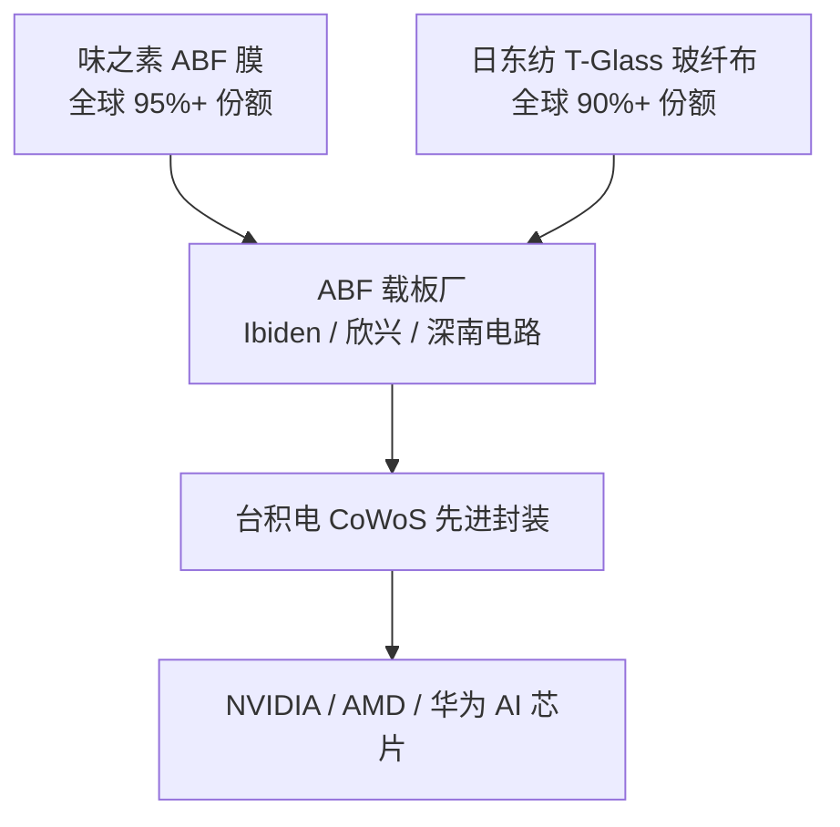

# ABF 膜与 ABF 载板产业深度解析：AI 芯片封装材料的技术瓶颈与国产替代

**AI 芯片封装有一个材料环节，全球 95% 以上的供给来自日本一家调味品公司——味之素（Ajinomoto）。它的 ABF 膜直接决定了 GPU 封装能做到多大。**

2027-2028 年，供需缺口将超过 50%。华正新材和生益科技已经拿出了指标接近的产品，但量产良率差距仍然很大——85% 对 99%。

---

## 一、ABF 是什么，为什么突然受关注

### 1.1 先从一张 GPU 的"底座"说起

拿 NVIDIA B200 来看。芯片本身（逻辑 die + HBM 堆叠）放在硅中介层（Interposer）上，中介层下面是一块巴掌大的基板——面积超过 100×100mm，层数 16-20 层。这块基板就是 **ABF 载板**。

ABF 载板不是 PCB，而是芯片到外部世界的唯一物理通道。GPU 的万级 I/O 引脚、几十吉赫兹的信号频率、几百瓦的热量，全都从这块板子穿过去。如果这块板子不够密、不够平、信号损耗太大，芯片再强也没用。

这块板子的核心材料是 **ABF 膜**（Ajinomoto Build-up Film，味之素积层膜）——一种绝缘增层材料，决定载板的布线密度、信号完整性和热机械可靠性。

台积电 CoWoS-L 封装从下到上的结构：

| 层级 | 组件 | 作用 |
|------|------|------|
| 4 | PCB 主板 | 系统电路板 |
| 3 | ABF 载板 | 封装基板，芯片的物理底座和信号通道 |
| 2 | 硅中介层（Interposer） | 含 TSV 和 RDL，实现芯片间高密度互连 |
| 1 | 逻辑 die + HBM | 计算核心 |

ABF 载板通过 C4 Cu Bump 连接中介层。CoWoS-L 技术路线支持光罩级超大中介层，用于 B200、MI300 这类 AI 训练芯片。

整条链的卡点，从这张链路图能一眼看清：



上游材料被两家公司各占九成以上份额，中游载板厂要同时向它们取料。任何一个环节断供，整条链就停摆。

### 1.2 ABF 凭什么成为瓶颈

ABF 膜只有一家供应商，而且它的产能扩张速度永远追不上需求增长。三个数字可以说明问题：

- ABF 载板占 AI 芯片封装成本的 **60% 以上**。断供意味着国产 AI 芯片无法封装，高性能计算进度明显倒退。
- NVIDIA Rubin Ultra 的单芯片 ABF 消耗量是传统 CPU 的 **15-18 倍**。
- 味之素计划到 2028 年产能只提升 **30%**，而 AI GPU 的需求增速以三位数计。

这是半导体产业链的单点失效，已经超出了商业层面的供不应求。

---

## 二、ABF 膜的技术门槛：味之素三十年积累的物理基础

### 2.1 三层结构，核心在 10-25 微米的树脂层

ABF 膜的三层结构看起来简单：

- PET 支撑膜（~100μm）：机械支撑与离型
- 功能树脂层（10-25μm）：电气绝缘与线路构建的核心
- 保护膜：防污染损伤

但核心在那层只有头发丝直径 1/5 的树脂层里。介电损耗（Df）、热膨胀系数（CTE）、吸水性，直接决定了载板能在多高频率下传输信号、能承受多少次热循环。

### 2.2 三代固化剂迭代：把信号损耗压到原来的 1/5

ABF 膜的性能差异，根源在固化剂体系。味之素花了三十年，三代固化剂，把 Df 从 0.019 压到 0.0044：

| 代际 | 产品系列 | 固化剂体系 | Df (5.8GHz) | CTE (ppm/°C) |
|------|----------|-----------|------------|--------------|
| 第一代 | GX 系列 | 酚醛固化 | 0.019 | 46 |
| 第二代 | GY 系列 | 活性酯 | 0.0073 | 39 |
| 第三代 | GZ / GL 系列 | 氰酸酯 / 酚醛酯复合 | **0.0044** | **20** |

GL-102 现在是 AI GPU / ASIC 用 FC-BGA 载板的事实标准。

Df 从 0.019 到 0.0044 不是一个小数点调整。高频信号的介质损耗与 Df 成正比——Df 降低 77%，意味着同样频率下信号损耗降低 77%。AI 芯片运行在几十吉赫兹的频率上，如果介质损耗降不下来，信号在穿过 20 层载板的过程中就会退化到不可用的程度。

**这个参数在量产中每一卷膜都必须保持 ±5% 以内波动，实验室测一次不算数。**

### 2.3 纳米填料：工程难度最高的环节

SiO₂ 填料的演进是 ABF 膜技术进步中工程难度最高的环节之一。四个维度在同步推进：

- **纯度**：≥99.99%，金属杂质 ≤5ppm。杂质超标会直接导致铜线路电化学迁移短路，不是性能差一档的问题。
- **粒径**：从 5μm 推进到百纳米级。物理研磨解决不了这个问题——纳米粒径下粒子表面能急剧上升，团聚倾向压倒分散力。
- **含量**：从 38% 到 72%。72% 的填料含量意味着树脂只是"胶水"，每增加一个百分点都会影响粘度、涂布均匀性和层间剥离强度。
- **表面处理**：硅烷偶联剂（KH-560）用量 0.8%-1.2%，剥离强度目标 1.2N/mm。用量差 0.1 个百分点，剥离强度就可能差 20%。

把这四个维度同时做到量产水平，目前只有味之素。

### 2.4 配方之外：一整套工程系统的积累

ABF 膜涉及的不只是配方，而是一整套工程系统：

**配方层**：复合固化剂体系涉及三种固化剂的协同：主固化剂决定交联密度、潜伏性固化剂决定 B-stage 窗口、有机膦促进剂决定反应速率。三者之间不是独立变量。共聚反应转化率需 ≥98%，味之素在规模化生产中波动控制在 1% 以内。

**工艺层**：功能层厚度 10-100μm，涂布均匀性 ±1μm。B-stage 固化度必须控制在 92%-98% 的狭窄窗口——低于 92% 则压合时树脂流动性过大导致线路偏移；高于 98% 则层间结合力不足导致分层。在高填料含量（60%-72%）下维持均匀分散，靠的是设备、工艺参数、质量控制体系的整套磨合，配方调整解决不了。

**认证层**：材料从送样到通过芯片厂商认证，完整周期 2-3 年。每一批材料都要在不同温湿度、不同线宽线距、不同层数组合下通过可靠性测试。切换材料意味着重新投入数亿美元验证费用。台积电的态度很明确：换料风险远大于涨价压力。

配方可以分析，工艺可以模仿，但味之素三十年积累的工艺偏差数据、客户耦合经验、产线调试直觉，砸钱很难在三年内复现。

---

## 三、一个信号穿过 ABF 载板的全过程——Df 和 CTE 的实际影响

### 3.1 信号从 die 到外部世界的路径

一个计算结果的电压信号，从 GPU die 边缘的 C4 bump 出发，经过以下路径到达 PCB：

```
GPU die → C4 bump (30-50μm pitch) → ABF 载板顶层微线路 (线宽/线距 ~5μm/5μm)
→ 穿过第 1 层 ABF 介质层 → 第 2 层铜线路 → 穿过第 2 层 ABF 介质层
→ ... → 穿过第 N 层 → 载板底部 BGA 焊球 → PCB
```

在 20 层的 ABF 载板里，信号要穿过 20 层介质、20 层铜线路布线。每穿过一层，信号就衰减一次。

### 3.2 Df 决定的是"能跑多快"

介质损耗 α_d 的公式：

```
α_d ∝ f × tanδ × √ε_r
```

f 是频率，tanδ 就是 Df，ε_r 是介电常数。

当 GPU 运行在 30 GHz 频率下，因为 α_d 与 tanδ 成正比，GX（Df=0.019）与 GL-102（Df=0.0044）的介质损耗之比就是 0.019 / 0.0044 ≈ 4.3 倍。信号在 20 层载板里逐层穿越，每一层都按这个比例衰减，层数越多、频率越高，差距越被放大。

AI GPU 只能用 GL-102：信号物理上过不去。

### 3.3 CTE 决定的是"能用多久"

GPU die 是硅（CTE ~2.5 ppm/°C），HBM 也是硅。ABF 载板如果 CTE 差太远，每次芯片从室温到 80°C 运行温度的热循环中，C4 bump 就要承受剪切应力。数百次热循环下来，CTE 失配会导致 bump 开裂——这是渐进性失效，测试时可能没事，上线半年后突然出现信号不稳定。CTE 从 46 ppm/°C 降到 20 ppm/°C，直接效果是让芯片活过三年的出厂保修期。

### 3.4 AI 芯片对 ABF 的消耗为什么是传统 CPU 的 3-5 倍

| 参数 | 传统服务器 CPU | AI GPU（NVIDIA H100） | 影响 |
|------|-------------|--------------------|------|
| 载板面积 | ~600mm² | ~2000mm² | ABF 膜消耗面积 ×3-5 |
| 封装层数 | 8-12 层 | 16-32 层 | ABF 膜消耗体积 ×2-3 |
| I/O 引脚数 | 千级 | 万级 | 线路密度要求高一个数量级 |
| 运行频率 | <5 GHz | >30 GHz | Df 要求从"够用"变成"物理极限" |

综合下来，一颗 AI GPU 消耗的 ABF 膜面积和载板制造复杂度，是传统 CPU 的 3-5 倍。这个数字是 H100 这一代以面积和层数计的基准；下一代 Rubin Ultra 载板更大、层数更高，单芯片 ABF 消耗量会进一步放大到传统 CPU 的 15-18 倍（§1.2 已提及）。而 AI GPU 的出货量正在以每年翻倍的速度增长——两条曲线叠加，供需缺口不是线性扩大的。

---

## 四、市场规模和增长驱动力

### 4.1 三组预测数据

| 机构 | 预测 | 时间维度 |
|------|------|---------|
| Yole Group | 106.5 亿美元 | 2028 年，CAGR 14%（2022-2028） |
| Goldman Sachs（偏乐观） | 113 亿美元 | 2028 年，CAGR 33%（2025-2028） |
| Prismark | 121 亿美元 | 2030 年 |

Goldman 的 33% 复合增速隐含的假设是 AI GPU 每年的出货面积增长 + 单芯片 ABF 面积增长 + 价格温和上涨，三者叠加。Prismark 的 121 亿则把玻璃基板渗透后 ABF 仍有增量的情景也放了进去。

### 4.2 三条线同时拉扯

ABF 市场扩张，三条驱动力同时在作用，而且相互放大：

**第一层，AI GPU 超级周期**：NVIDIA、AMD、Intel 每代产品载板面积和层数都在攀升。GB200 的载板已到 100×100mm 级别，下一代 Rubin 更大。这层驱动力跟 PC 换机周期那种"波峰波谷"不一样，是持续上台阶。

**第二层，先进封装渗透率提升**：CoWoS、Chiplet 把越来越多的功能整合进一个封装，FC-BGA 载板从高端 GPU 专属变成中端芯片的标配。封装层数和面积的"双增"是结构性趋势，不受单一产品周期影响。

**第三层，产能扩张跟不上**：ABF 载板产线从建设到满产需要 2.5-3 年。味之素膜材料产能只计划提升 30%。下游载板厂（Ibiden、欣兴、深南电路）的扩产更激进——膜材料的供需缺口会比载板缺口更早出现、持续时间更长。

三层效果叠加：即使 AI 芯片出货增速从三位数降到两位数，ABF 膜的供需缺口仍然会扩大——产能爬坡和需求增长的时间错配至少持续到 2029 年。

---

## 五、竞争格局：一家调味品公司的半导体生意

### 5.1 市场集中度

| 厂商 | 全球市占率 | 产品定位 | 备注 |
|------|----------|---------|------|
| 味之素（Ajinomoto） | **95%+** | 全系列覆盖，GL-102 为 AI GPU 标准 | 营业利润率超 50% |
| 积水化学（Sekisui） | 3-5% | 中低端产品 | 技术差距显著，没有 AI GPU 级产品 |
| 台湾 TBF | 小批量 | 早期验证阶段 | 未规模化 |

95% 这个数字的分量在于：整个 AI 芯片产业的材料安全系于一家公司的产能决策。味之素的 ABF 业务营业利润率超过 50%——垄断定价只是表象，三十年技术迭代让后来者拿不出竞品才是根因。

### 5.2 四代产品演进：每一代都在设新的标准

| 系列 | 固化机理 | Df | CTE | 量产良率 |
|------|---------|-----|------|---------|
| GX | 酚醛树脂 | 0.019 | 46 | 95-99%+ |
| GY | 活性酯 | 0.0073 | 39 | 99%+ |
| GZ | 氰酸酯 | 0.0074 | 20 | 99%+ |
| GL | 酚醛酯复合 | 0.0044 | 20 | 99%+ |

味之素的做法很直接：不等竞争对手追上来，就推出下一代产品。GX 被追上？GY 来了。GY 被追上？GZ 来了。GL-102 的参数已经走到当前材料体系的物理极限——Df 0.0044、CTE 20、吸水率 <0.5%，这三项同时满足的，目前只有味之素。

### 5.3 上游也被卡着：日东纺的 T-Glass 垄断

ABF 载板的另一个核心材料——玻纤布，同样高度集中。ABF 载板需要超低 CTE 的玻纤布来匹配硅芯片热膨胀，而日东纺（Nittobo）的 T-Glass 供应了全球 90%+ 的份额。

要做 ABF 载板，你既要让味之素把膜卖给你，又要让日东纺把布卖给你。两条供应链都是单点，任何一条卡住都等于卡住整个产业链。

### 5.4 专利到期不等于壁垒消失

味之素的基础专利 2028 年到期，但这不意味着"2028 年一过大家就可以合法仿制"。味之素通过 GX→GY→GZ→GL 的连续迭代，每一代产品都申请了新的工艺专利和配方专利，形成了多重专利保护。

况且，专利只是门槛之一。2-3 年的认证周期和数十亿美元的验证投入是另一道屏障。客户不会因为"专利到期了"就切换材料——他们需要看到替代材料在自己产线上跑上两年没出问题才会考虑。

---

## 六、供需缺口时间线：2027-2028 是峰值

| 时间节点 | 关键事件 | 供需状态 |
|---------|---------|---------|
| 2025 年 | 味之素第三工厂投产，产能提升有限 | 供需偏紧 |
| 2026 年 H2 | 新产能开始爬坡，但需求增速远超供给 | 缺口开始扩大 |
| **2027-2028 年** | **供需缺口达峰**，美银预测超 50% | **缺口峰值** |
| 2029 年及以后 | 华正新材等国产材料或开始形成有效补充 | 国产替代起步 |

缺口达峰的时间点和国产替代的时间点之间有一个 1-2 年的真空期。这个真空期会把 ABF 膜的定价权进一步推向味之素，同时让下游芯片厂和载板厂更积极地推进替代材料认证。

味之素的涨价反而在帮国产替代降低阻力：当 ABF 膜价格涨到占载板成本 30% 以上时，客户切换国产材料的盈亏平衡点就会移动。只要国产材料定价在味之素的 70% 以下，就足以覆盖切换成本和良率损失。

---

## 七、国产替代：走到哪一步了

### 7.1 三层不对称：设备、载板、材料进度不同

国产 ABF 产业链存在"设备-载板-材料"三层不对称：

- **设备层**：国产化率 <20%，关键设备（激光钻孔、电镀线、AOI 检测）高度依赖日美欧进口。短期难以突破。
- **载板层**：深南电路等实现 14-30 层量产，国产化率约 30%。中端已经可以打，高端还在追。
- **材料层**：ABF 膜国产化率 <5%。目前 Df 指标已接近味之素，瓶颈在量产良率和一致性，配方能力已经不是主要问题。

### 7.2 国产 ABF 膜玩家对比

| 指标 | 味之素 GL-102 | 华正 CBF | 生益 SIF | 积水化学 | 台湾 TBF |
|------|------------|--------|--------|---------|---------|
| Df (5.8GHz) | 0.0044 | **0.004** | 0.002-0.003 | 0.007 | 0.008 |
| CTE (ppm/°C) | 20 | 20-22 | 12-15 | 25 | 28 |
| 量产良率 | 99%+ | **85%+** | 实验室阶段 | 90% | 未量产 |
| 认证状态 | 行业标准 | **华为昇腾验证通过** | 未送样 | 量产 | 验证中 |

**华正新材**是目前国产 ABF 膜里跑得最快的一家。自主研发的环氧树脂体系，Df 0.004 与 GL-102 处于同一水平，CTE 20-22 ppm/°C 也够用。华为昇腾验证通过、进入小批量供货，意味着最难的认证关已经过了第一步。接下来要看：能不能把良率从 85% 拉到 95%+，能不能在客户产线上跑出稳定性数据。

**生益科技 SIF** 的 Df 做到了 0.002-0.003，比味之素更低。但还在实验室阶段。从实验室到量产是 ABF 膜行业最难过的一关——小批量打样和大批量生产之间的 CTE 一致性、Df 批次间波动、涂布均匀性，每一个都是独立的技术挑战。

### 7.3 良率差距的经济账

为什么 85% 对 99% 的良率差距如此关键？

在 ABF 膜的实际生产中，**良率每低 1 个百分点，单位成本上升约 5%**。85% 的良率意味着单位生产成本比味之素高出约 70%。加上客户切换材料要承担的产线调试成本、认证费用、潜在的质量风险，即使国产材料定价更低，客户的总拥有成本（TCO）仍然可能更高。

但这不意味着国产材料没有机会。缺口达峰 + 价格上涨 + 地缘政治压力，三者合力会重新定义客户的"合理成本"边界。当味之素自己供不上货的时候，客户对良率的要求就会放宽。

---

## 八、玻璃基板：替代还是共存

### 8.1 巨头全部入局

英特尔、三星、NVIDIA、AMD、台积电——全球半导体巨头都已启动玻璃基板技术研发和产线建设。玻璃基板的优势在于：

- 超高平整度（表面粗糙度远低于有机基板）
- 可调 CTE（热膨胀系数可精确匹配硅芯片）
- 超高布线密度（TGV 孔径 5-15μm，有机板约 50μm）
- 高频低损耗特性

### 8.2 有机基板 vs 玻璃基板的真实差距

| 参数 | 有机 ABF 基板 | 玻璃基板 | 关键差异 |
|------|------------|---------|------|
| CTE (ppm/°C) | 15-20 | 3-5（可调） | 玻璃更接近硅（2.5） |
| TGV 孔径 | ~50μm | 5-15μm | 玻璃布线密度高一个量级 |
| 量产成熟度 | 20+ 年 | 验证中 | 有机产线已摊销完毕 |
| 成本 | 中 | 高（初期 3-5 倍） | 成本差距是主要阻力 |

### 8.3 ABF 与玻璃基板的关系

玻璃基板时间线：

| 时间 | 节点 |
|------|------|
| 2025 年 | 台积电 CoPoS 中试线全面建成，进入工艺验证 |
| 2026 年 | 玻璃基板小批量商业化出货的关键节点 |
| 2027-2028 年 | 英特尔、三星等有望实现玻璃基板规模量产 |
| 2030 年后 | 玻璃基板高端封装渗透率有望达到 30%+ |

玻璃基板的增层工艺仍然需要使用 ABF 类薄膜材料做绝缘层——也就是说，即使玻璃基板全面替代有机基板，ABF 膜的市场不会归零，它会换一种方式嵌进新的封装结构里。短期看（2027 年前），玻璃基板渗透率约 10%，ABF 有机基板仍是主流；中期看（2027-2032），两者共生互补，玻璃做高端、有机做中端。

**玻璃基板改变的是载板的材料组合，ABF 膜在封装结构里仍然有位置。**

---

## 九、投资窗口与风险

### 9.1 为什么现在是窗口期

三个条件同时出现：

1. **供需缺口 2027-2028 年达峰**：超过 50% 的缺口意味着味之素不可能满足所有客户，国产替代的市场空间被打开。
2. **地缘政治加速替代进程**：ABF 膜已经成为半导体产业链安全的关键单点，政策推力从商业维度转向安全维度。
3. **技术路径收敛、窗口清晰**：华正新材的 Df 和 CTE 已追平味之素，剩下的是工程化问题，不是科学问题。基础专利 2028 年到期也提供了绕开的空间。

窗口在收窄：如果国产材料在未来 2-3 年内不能把良率拉到 95%+ 并完成主流客户的导入认证，味之素的下一代产品可能再次拉开差距。

### 9.2 优先关注方向

在设备-载板-材料三层格局中，材料层（ABF 膜）的弹性最大：

- **国产化率最低**（<5%）→ 替代空间最大
- **卡位最重**（下游绕不开）→ 一旦突破，锁定效应强
- **Df 指标已追平** → 剩下的是工程化问题，不是能不能做的问题

载板层（深南电路）已是国产化率 30% 的成熟赛道。设备层短期难有突破。

### 9.3 值得关注的标的

| 标的 | 业务 | 核心观测点 |
|------|------|----------|
| 华正新材 | CBF 膜 | 华为昇腾验证通过，看良率能否从 85% 拉到 95%+ |
| 生益科技 | SIF 膜 | Df 做到 0.002-0.003，看何时进入中试阶段 |
| 深南电路 | ABF 载板 | 14-30 层量产，高端层数突破进度 |
| 三安光电 | 化合物半导体 | 材料平台型布局 |
| 兆驰股份 | LED + 半导体 | ABF 膜上游材料布局 |

### 9.4 风险

| 风险 | 具体情景 | 发生概率 |
|------|---------|---------|
| 良率提升慢于预期 | 国产 85%→95% 的爬坡耗时超过 2 年 | 中高 |
| 认证周期拉长 | 客户导入节奏受供应链保守策略拖慢 | 中 |
| 味之素激进降价 | 产能扩张后降价压制国产材料价格空间 | 中低（味之素没动力） |
| 玻璃基板加速替代 | 2028 年前高端转向玻璃，压缩 ABF 市场天花板 | 低 |
| 地缘政治缓和 | 中美科技摩擦降温，国产替代紧迫性下降 | 低 |

---

## 结语

ABF 膜在 AI 芯片封装中的位置短期内绕不开。占封装成本 60%+、一旦断供高性能计算进度明显倒退——这两组数字说明供应链单点失效的实际后果。

2027-2028 年是国产替代的关键窗口。供需缺口达峰、味之素基础专利到期、地缘政治推力——三件事撞在一起。但窗口不会自动变成突破。国产材料必须在 85% 到 99% 的良率鸿沟上搭桥，这桥能不能搭成，取决于未来两年产线上的工程迭代速度。

落到操作上，国产替代的胜负手在材料层：设备层短期无解，载板层已是三成国产化的成熟赛道，只有材料层能从不到 5% 的国产化率往上打。华正新材和生益科技把两条路线摆在了桌面上——先量产再提良率，还是先突破物理极限再量产。哪条路先跑通，就定义国产替代的下一个阶段。