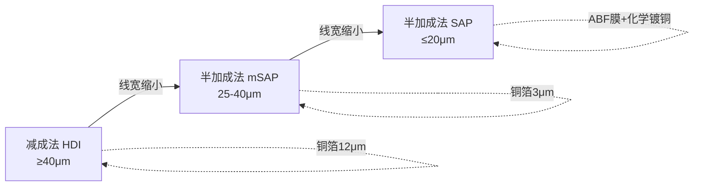
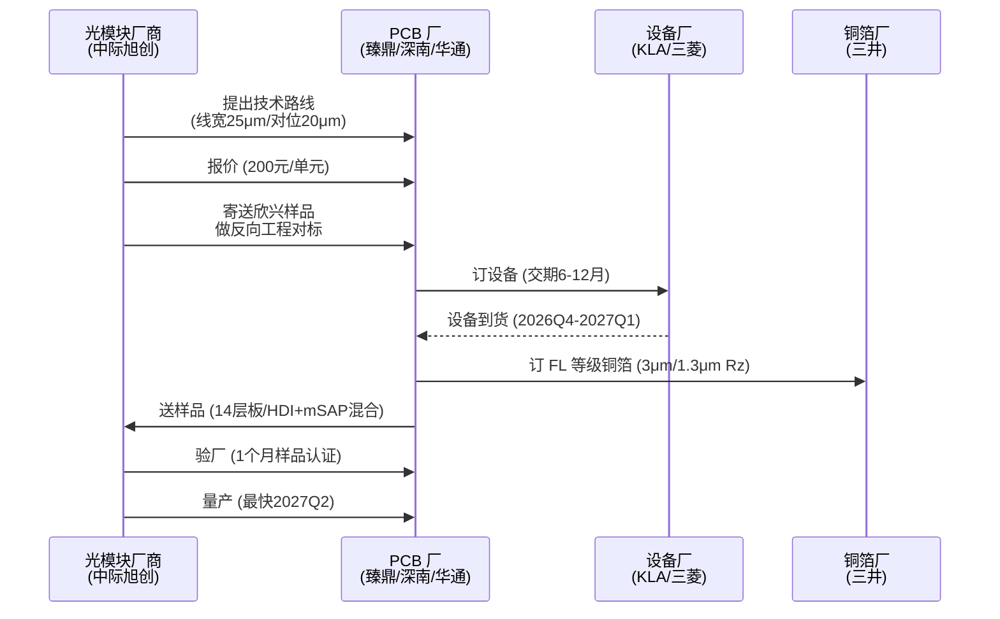

> **核心判断**：mSAP（改良型半加成法，Modified Semi-Additive Process）不是新工艺，它一直是苹果 iPhone 主板的成熟方案。2026 年的 1.6T 光模块需求，让大陆 PCB（Printed Circuit Board，印制电路板）厂第一次看见量价齐升的机会——单价是苹果 mSAP 主板的 3 倍，2026 全年到 2027Q2 存在确定性产能缺口。
>
> **目标读者**：半导体 / PCB 工程师、产业分析师、技术投资人
> **预计阅读时间**：30 - 40 分钟
> **前置知识**：PCB 基础工艺、HDI（High Density Interconnect，高密度互连）概念
> **数据来源**：基于 2026-06-05 mSAP 机构交流纪要整理

## 学习目标

读完这篇，你应该能：

1. 解释 HDI / mSAP / SAP（Semi-Additive Process，半加成法）三者的工艺边界与典型线宽线距（线宽 + 线距的尺寸，决定线路密度）。
2. 评估 mSAP 在 AI 基础设施（光模块、AI 服务器、智能眼镜）中的真实需求弹性。
3. 拆解一块 1.6T 光模块 mSAP 板的关键成本结构。
4. 识别设备 / 铜箔 / 产能三条供应链上的关键卡点。
5. 给出 PCB 玩家在 2026 - 2027 年的扩产顺序建议。

## 目录

- [学习目标](#学习目标)
- [目录](#目录)
- [§1 系统地图：HDI / mSAP / SAP 的工艺阶梯](#1-系统地图hdi--msap--sap-的工艺阶梯)
- [§2 任务流案例：1.6T 光模块板从下单到交付](#2-任务流案例16t-光模块板从下单到交付)
- [§3 工艺差异：mSAP 凭什么比 HDI 贵 3 倍](#3-工艺差异msap-凭什么比-hdi-贵-3-倍)
- [§4 产能格局：臻鼎、深南、华通 vs 欣兴](#4-产能格局臻鼎深南华通-vs-欣兴)
- [§5 设备增量：5 类关键设备与国产化机会](#5-设备增量5-类关键设备与国产化机会)
- [§6 铜箔：三井垄断的"地壳"](#6-铜箔三井垄断的地壳)
- [§7 价格机制：8 美元 vs 30 美元的鸿沟](#7-价格机制8-美元-vs-30-美元的鸿沟)
- [§8 产业链主导：光模块厂商的强势](#8-产业链主导光模块厂商的强势)
- [§9 采用顺序与适用边界](#9-采用顺序与适用边界)
- [§10 自测与延伸阅读](#10-自测与延伸阅读)
- [§11 常见问题](#11-常见问题)
- [§12 错误排查与良率陷阱](#12-错误排查与良率陷阱)
- [§13 结尾判断](#13-结尾判断)
  - [引用说明](#引用说明)

## §1 系统地图：HDI / mSAP / SAP 的工艺阶梯

PCB 制造工艺按"线宽线距"能力，可以划出三道清晰台阶：

| 工艺 | 工艺类型 | 适用线宽线距 | 核心材料 | 典型应用 |
|------|----------|--------------|----------|----------|
| HDI | 减成法 | ≥ 40 μm | 12 μm 标准铜箔（Rz > 4 μm） | 手机副板、汽车板 |
| mSAP | 半加成法（改良） | 25 - 40 μm | 3 μm 超薄铜箔（Rz ≈ 1.3 μm） | 苹果主板、1.6T 光模块 |
| SAP | 半加成法 | ≤ 20 μm（主流 15 μm） | ABF 膜（Ajinomoto Build-up Film，味之素增层膜） | CPU / GPU 载板 |

三者的本质差异在"线路如何成型"：

- **HDI**：先把整面 12 μm 铜层覆盖到基材上，再用蚀刻把多余铜"减"掉。线路越细，蚀刻越难控制，线宽下不去。
- **mSAP**：先在 3 μm 超薄铜层上做图形电镀（用电解的方式让铜只在需要的线路位置"长"出来），再蚀刻掉底部薄铜。线路是"长"出来的，3 μm 极薄铜层大幅降低了蚀刻量。
- **SAP**：完全不用铜箔，化学镀铜直接形成 1 μm 以下的种子层，线宽可达 2 - 3 μm。代价是必须用 ABF 增层膜而不是 PP（Prepreg，半固化片）。

读这张图时记住一个判断：**mSAP 不是 HDI 的"升级版"，也不是 SAP 的"低配版"，它是两者之间的桥**。苹果 iPhone 主板用了十多年 mSAP，线宽停在 30 μm；1.6T 光模块把 mSAP 的下限推到 25 μm，再往下就是 ABF 载板的世界，工艺和成本都换了一个量级。

为什么 mSAP 必须用 3 μm 铜箔？因为 mSAP 的核心是"图形电镀 + 薄层蚀刻"。如果用 12 μm 铜箔做底，蚀刻时横向侧蚀（侧向蚀刻，等量向两边吃掉铜）会直接吃掉 10 μm 以上的铜，25 μm 线路做不出来。3 μm 铜箔把侧蚀控制在 1 - 2 μm，线路边缘才够锐利。

为什么 mSAP 的上限是 SAP（ABF 载板）？因为 3 μm 铜箔还是有底铜，再薄就会在 PP 增层上贴不住。SAP 抛弃铜箔、用化学镀铜直接形成种子层，避开了"贴铜箔"这个物理上限——代价是必须用 ABF 膜，设备和材料成本上一个台阶。

> mSAP 与 ABF 载板（SAP）名字相近，但二者完全用不同的设备。ABF 载板用 ABF 膜做增层，种子铜是化学镀铜；mSAP 用 PP 做增层，种子铜是 3 μm 铜箔 + 化学镀铜 + 闪镀铜三层结构。这一点决定了它们的产能不能直接互换——台厂欣兴 70% 资本支出投向 ABF 载板时，1.6T 光模块的 mSAP 产能就出现了真空。

## §2 任务流案例：1.6T 光模块板从下单到交付

把上面那张图展开成一条"任务流"——1.6T 光模块 mSAP 板从光模块厂商提出需求到最终量产，要经过哪几道关键节点：

几个关键节点：

1. **主导方是光模块厂商，不是下游云厂商**。中际旭创直接参与技术路线讨论，验厂也由光模块厂商主导。这与手机 / PC 时代下游品牌商主导的格局相反。光模块厂商为什么强势？因为它们同时是英伟达、谷歌、Meta 的关键供应商，技术规格由它们向上游 PCB 厂传递。
2. **设备是真正的瓶颈**。镭射、曝光、电镀高端设备与 ABF 载板生产设备重合，交期 6 - 12 个月；加急也要 6 - 8 个月；设备到位后还要 1 个季度认证。**为什么设备这么缺？** 因为全球能做 LDI 镭射光绘的就 KLA 科磊（原奥宝）一家，订单排到一年后。
3. **样品阶段是反向工程**。光模块厂商会提供欣兴（已出货）的样品给新供应商做对标，加快认证速度。中际旭创的 1500 片/周订单可以并行开给臻鼎、华通。反向工程的代价是：技术能力弱的 PCB 厂即使接到样品也做不出来。
4. **铜箔等级与工艺强绑定**。1.6T 光模块采用 HDI + mSAP 混合结构：HDI 层用 HVLP（Hyper Very Low Profile，超低轮廓）铜箔，mSAP 层用 FL 等级铜箔。HVLP 3 等级粗糙度可达 0.5 μm 以下，专为高频高速信号设计。如果错用 standard 等级铜箔，信号完整性直接不达标。

这个案例可以回答一个常见问题：「为什么大陆 PCB 厂突然能做 1.6T 光模块了？」——不是技术突破，是台厂把产能挪去 ABF 载板了，蛋糕被大陆厂接住。代价是：大陆厂必须在 2026Q4 前完成设备到货，否则欣兴回过神来重新分配资本支出时，市场份额会被切走。

## §3 工艺差异：mSAP 凭什么比 HDI 贵 3 倍

同样是 PCB，1.6T 光模块用 mSAP 比苹果 iPhone 主板 mSAP 复杂在哪些地方：

| 指标 | 苹果 iPhone 主板 mSAP | 1.6T 光模块 mSAP | 差距 |
|------|----------------------|------------------|------|
| 线宽线距 | 30 μm | 25 μm | 后者蚀刻窗口更窄 |
| 对位精度 | 35 μm | 20 - 25 μm | 后者多层叠对位难 |
| 成型后加工精度 | ±100 μm | ±50 μm | 后者需要精准插拔 |
| 表面处理 | ENIG / OSP | ENEPIG + 金线键合 | 后者需金线键合 |
| 板层结构 | 8 - 10 层 | 14 层（HDI + mSAP 混合） | 后者叠层更多 |
| 单价 | 8 美元 / 单元 | 25 - 30 美元 / 单元 | 价差约 1 个量级 |

更细的工艺差异：

- **铜箔**：苹果 mSAP 用 FL 等级（铜牙深度 1.3 μm）；1.6T 光模块同样用 FL，但其 HDI 层用 HVLP（粗糙度 < 0.5 μm），HVLP 是高频高速信号必需的。**为什么 1.6T 必须用 HVLP？** 因为高频信号在铜箔粗糙面上会因"趋肤效应"（高频电流集中在导线表面）产生额外损耗，粗糙度从 1.3 μm 降到 0.5 μm，信号衰减可减少 20% - 30%。
- **种子铜制备**：mSAP 的标准流程是「超薄铜箔覆膜 → 撕保护铜箔 → 镭射钻孔 → 除胶渣 → 化学镀铜 → 闪镀铜 → 形成导电种子层」，整个流程在 PP 增层上完成；ABF 载板则直接化学镀铜，1 μm 以下。
- **可靠性**：1.6T 光模块需要耐 CAF（Conductive Anodic Filament，导电阳极丝——高温高湿下 PCB 内部铜离子迁移导致短路）、金线键合完整性、焊盘清洁度等苹果主板不要求的能力。

这些差异解释了为什么价格能差 1 个量级——不是简单的"高端应用溢价"，而是每道工序的精度要求都上了一个台阶。**代价是什么？** 良率下降——1.6T 光模块 mSAP 板的良率比苹果 mSAP 低 10% - 20%，这是价格溢价的另一个来源。

> 反直觉的发现：苹果 mSAP 单价比 1.6T 光模块低，但 1.6T 光模块需求弹性更大。原因是苹果 iPhone 主板面积持续缩小，相同 panel 产出量提升，销售额基本稳定时 panel 出货量微降约 20%；1.6T 光模块则处在供不应求的早期，价格随产能释放逐步上行。

## §4 产能格局：臻鼎、深南、华通 vs 欣兴

国内 mSAP 产能第一梯队为臻鼎、深南电路、华通；海外欣兴产能规模相当但资本支出侧重不同：

| 厂商 | 基地 | 现状 | 2026 - 2027 扩产 |
|------|------|------|----------------|
| 臻鼎 | 秦皇岛、淮安 | 苹果供应链多年 | 2026.4 起追加 20 亿元人民币新设备 |
| 深南电路 | 无锡（爬坡）+ 新厂区 | 现有产线扩产 | 边扩边爬 |
| 华通 | 台湾 + 重庆 | 引入专门新设备 | 1.6T 光模块专线 |
| 欣兴 | 台湾 | 70% 资本支出投向 ABF 载板 | 1.6T 光模块产能不足 |
| 方正、胜宏、景旺 | 多地 | 前期认证或建设中 | 2026 年内不释放产能 |

中际旭创是当前最积极的扩产需求方，给奥特斯（AT&S，奥地利 PCB 巨头）的产能预定为 1500 片/周，给臻鼎、华通也有同等规模需求。中际旭创单家 1500 片/周，意味着仅头部 3 家大陆 PCB 厂 + 1 家欧洲厂就要承接 6000 片/周以上的订单——这还没算其它二线光模块厂商。

扩产周期不短：

- 设备交期 6 - 12 个月（加急 6 - 8 个月）
- 设备到货后 2 个月调试
- 客户认证 1 个月（样品）
- 客户验厂 + 量产认证 1 个季度
- **最快 2027Q2 可量产**

这意味着 2026 年内 mSAP 新增产能几乎不可能落地，2027Q2 之前的供需缺口是确定性的。

为什么欣兴不把资本支出分配一点给 1.6T 光模块？**两个原因**：第一，ABF 载板是台厂的"基本盘"——AI 服务器 / GPU / CoWoS 都需要 ABF 载板，资本回报率（ROI）远高于 mSAP；第二，mSAP 的产能扩张需要 6 - 12 个月的设备周期，等欣兴反应过来，2026Q3 已经过去了。

## §5 设备增量：5 类关键设备与国产化机会

mSAP 相比 HDI 新增 5 大类设备：

| 设备 | 用途 | 主流供应商 | 国产化程度 |
|------|------|------------|-----------|
| VCP（Vertical Continuous Plating，垂直连续镀铜）| 图形电镀产线基础 | - | - |
| LDI（Laser Direct Imaging，激光直接成像）镭射光绘 | 适配 BGA（Ball Grid Array，球栅阵列封装）焊盘 P 值 130 μm、焊盘直径 110 μm、焊盘间距 20 μm | KLA 科磊 | 弱 |
| CO₂ 镭射钻孔 | 制作 60 μm 盲孔 | 日本三菱、维亚 | 弱 |
| 显影制程垂直设备 | 图形电镀前化学显影 | 德国迅得、台湾扬博 | 中（国内可供应）|
| AOI（Automated Optical Inspection，自动光学检测）| 检测 25 μm 等级线路 | 奥宝、康代 | 中 |

两个事实值得记住：

1. **1.6T 光模块主流扩产厂商目前均选用 KLA 科磊（原奥宝）的 LDI 机型**。这不是市场偏好，是 DSP（Digital Signal Processing，数字信号处理）芯片 BGA 封装参数硬性要求——焊盘 P 值 130 μm、焊盘直径 110 μm、焊盘间距 20 μm，传统曝光设备做不出来。KLA 的 LDI 单台价格 1500 - 2500 万元人民币，交期 12 个月。
2. **mSAP 与 ABF 载板的设备高度重合**。这意味着台厂欣兴在 ABF 载板上的资本支出增加，间接压低了 1.6T 光模块的设备供应能力。这个结构性矛盾短期无解。

> 设备端国产化的机会在 VCP 和显影制程设备；LDI 与 CO₂ 镭射钻孔是国产空白，国产替代至少 3 年。

## §6 铜箔：三井垄断的"地壳"

mSAP 对铜箔的要求与传统 HDI 完全不同：

| 工艺 | 铜箔类型 | 厚度 | 粗糙度 Rz |
|------|----------|------|-----------|
| HDI 减成法 | standard | 12 μm | > 4 μm |
| HDI 高频高速 | HVLP | 12 μm | < 0.5 - 2 μm |
| mSAP | FL | 3 μm | 1.3 μm（铜牙深度）|
| mSAP 下一代 | GN | 3 μm | 0.9 μm（铜牙深度）|

更细的代际划分（三井产品线）：

- **EX 等级**：800G 光模块
- **FL 等级**：1.6T 光模块 mSAP 主流
- **GN 等级**：更高级，铜牙深度 0.9 μm

两个关键事实：

1. **三井垄断且已停止普通标准铜箔供应**。这意味着所有向高频高速迁移的需求都必须用 FL / HVLP / GN 等级，价格刚性。
2. **高频高速铜箔已涨价 10%，还有 10% 上涨空间**。Core / PP 材料年初至今已涨 30%，铜箔的涨价只是开胃菜。

为什么三井能垄断？因为高频高速铜箔的关键工艺是"铜牙处理"——通过特殊涂层让铜箔表面形成均匀的微米级凸起，凸起的深度和均匀度直接影响信号完整性。这一工艺需要 10 年以上的工艺积累，国产铜箔厂在 standard 等级已能替代，在 FL 等级勉强，HVLP 3 / GN 至少 2 - 3 年内难以替代。

> 铜箔是 mSAP 供应链中**最被低估的瓶颈**。PCB 厂的扩产可以追，但三井的产能短期内不会追；高频高速铜箔一旦缺货，整个 mSAP 工艺的良率直接崩盘。

## §7 价格机制：8 美元 vs 30 美元的鸿沟

当前 mSAP 板的价格结构：

| 应用 | 单价 | 毛利 | 备注 |
|------|------|------|------|
| 苹果 iPhone 主板 | 8 美元 / 单元 | 中 | 量大，单价低 |
| 1.6T 光模块 | 25 - 30 美元 / 单元 | 较高 | 价差约 1 个量级 |
| AI 智能眼镜（Meta 等）| - | - | 整体 300 - 400 片/周，规模小 |
| AI 服务器主板 | HDI 工艺 | - | 接近临界点，die pitch（芯片凸点间距） 130 μm 时 mSAP 必需 |

价格上行的两个驱动：

- **原材料端**：Core / PP 年初至今涨 30%；高频高速铜箔涨 10%，还有 10% 空间。叠加效应下样品已有 20% 溢价。
- **供需端**：1.6T 光模块供不应求，快速交付的订单定价偏高；为加快产品认证、导入服务器厂商，样品给予溢价。

**判断**：mSAP 板价格后续仍有 10 - 20% 提升空间，整体价格要等到 2027Q2 供应稳定后才会回落。

价格真的能涨这么多吗？**代价是 1.6T 光模块整机成本上升**。一块 1.6T 光模块售价约 1000 - 1500 美元，PCB 板占整机成本 5% - 8%（约 50 - 120 美元）。PCB 涨 10 - 20 美元，对整机毛利影响约 2 - 4 个百分点——光模块厂商可以消化，但终端云厂商会持续压价。

## §8 产业链主导：光模块厂商的强势

mSAP 在光模块上的导入路径，与手机 / PC 时代完全不同：

| 时代 | 主导方 | 验证流程 | 玩家格局 |
|------|--------|----------|----------|
| 手机时代 | 苹果 / 品牌商 | 苹果验厂 | 臻鼎等供应链锁定 |
| 服务器时代 | 服务器厂商 + Intel/AMD 平台 | 平台认证 | 多供应商分散 |
| 光模块时代 | 光模块厂商（中际旭创等）| 光模块厂商验厂 | 跨地域多供应商 |

几个直接结果：

1. **中际旭创会和供应商直接沟通技术路线要求**，而不是被动接收。技术能力强的供应商获得溢价。
2. **验厂由光模块厂商主导**——这给了新进入者一个明确的"反向工程对标"机会：光模块厂商会主动把欣兴等已出货供应商的样品提供给新供应商，加快认证。
3. **光模块厂商对产能需求迫切**。它们会主动给新供应商产能订单，催熟供应链。

> 这意味着 2026 年是大陆 PCB 厂在 mSAP 上建立"先发优势"的时间窗口——错过 2026 - 2027H1，等欣兴回过神来重新分配资本支出时，市场份额就被锁定了。

## §9 采用顺序与适用边界

把上面所有信息压成对不同读者的判断：

**PCB 厂**：

- 第一梯队（臻鼎、深南、华通）：保持 2026 全年扩产节奏，设备订单立即锁定，2026Q4 前完成设备到货调试。错过 2027Q2 量产窗口，份额会被欣兴回流切走。
- 第二梯队（方正、胜宏、景旺）：现在不是发力的时间点。等 2027H1 价格回落、客户认证流程标准化之后再进入，毛利更高。

**光模块厂商**：

- 2026 全年：多元化供应商，不要把产能压在一家 PCB 厂。中际旭创的 1500 片/周已经分给 3 - 4 家，验证了这一点。
- 2027Q2 后：开始整合供应链，向 ABF 载板能力延伸。1.6T 之后的 3.2T 会进一步逼近 ABF 载板的工艺区间。

**铜箔与设备厂**：

- 国产化机会在 VCP 和显影制程设备。LDI 与 CO₂ 镭射钻孔短期是 KLA、三菱的天下，国产至少 3 年才能切入。
- 铜箔端短期不可能有国产替代。HVLP 3 / GN 等级至少 2 年内靠三井和日矿。

**投资人**：

- 短期看产能（2026 年内谁先到货谁受益）。中长期看 ABF 载板能力（决定 2028+ 能否承接 3.2T 光模块）。
- 风险点：苹果 iPhone 主板 mSAP 需求温和下滑（面积缩小 + 出货量微降），不能简单按"AI 算力带动 mSAP"算总账。

## §10 自测与延伸阅读

读完上面的内容后，可以试试回答以下问题自测理解程度：

1. 为什么 ABF 载板厂（欣兴）70% 资本支出投向载板，会直接利好大陆 mSAP 厂？
2. 1.6T 光模块 mSAP 板的 14 层结构里，哪些层用 HDI，哪些层用 mSAP？为什么不能全用 mSAP？
3. 假如 1.6T 光模块单价从 25 美元涨到 35 美元，原材料和设备涨价分别贡献多少？
4. mSAP 工艺的下一次工艺极限在哪里？3.2T 光模块会让 mSAP 厂直接做 ABF 载板，还是会出新的中间工艺？

## §11 常见问题

**Q1：mSAP 和 SAP 名字这么像，是同一个工艺吗？**

不是。两者都属于"半加成法"（Semi-Additive Process），但 mSAP 是在 3 μm 铜箔基础上做图形电镀，材料是 PP；SAP 是直接在 ABF 膜上化学镀铜，不用铜箔。线宽能力上 mSAP 在 25 - 40 μm，SAP 在 20 μm 以下。

**Q2：英伟达 Rubin 这一代 GPU 已经用上 mSAP 了吗？**

没有大规模铺开。Rubin 的 CPU / GPU 主芯片扇出仍依靠 ABF 载板，载板下方直接连接普通 PCB。当芯片 die pitch 缩小到 130 μm 时，mSAP 才会成为必需——Rubin 这一代接近临界点，但还没跨过去。

**Q3：大陆 PCB 厂做 mSAP 的最大技术差距是什么？**

设备调试经验。臻鼎等头部厂的设备本身大多也是 KLA / 三菱，硬件差距不大；但良率爬坡、对位精度控制、HVLP 铜箔与 mSAP 层的协同工艺需要 2 - 3 个季度的工程积累。这不是买设备能解决的。

**Q4：三井垄断的铜箔，有没有可能国产替代？**

短期没有。日矿、古河电工等日本厂商在 HVLP 3 / GN 等级上有量产能力，但产能同样紧张。国产铜箔厂在 standard 等级已能替代，在 FL 等级勉强，HVLP 3 / GN 至少 2 - 3 年内难以替代。

**Q5：1.6T 光模块 mSAP 板毛利比苹果高 1 个量级，是真的吗？**

价格上是的——25 - 30 美元 vs 8 美元，但毛利受良率、设备折旧、铜箔成本影响，实际毛利差距约 30% - 50%，不到 1 个量级。价格差反映的是工艺复杂度，不直接等于利润差。

## §12 错误排查与良率陷阱

mSAP 工艺最常见的良率陷阱：

1. **铜牙深度不达标**：HVLP 3 铜箔的 Rz 应当 < 0.5 μm，如果供应商送来的批次 Rz 在 0.7 - 1.0 μm，信号完整性测试会失败。**排查方法**：在压合前对铜箔做 AFM（原子力显微镜）测试。
2. **种子铜厚度不均**：闪镀铜厚度应控制在 0.5 - 0.8 μm，过薄导致后续图形电镀烧板，过厚导致侧蚀控制失败。**排查方法**：用 XRF（X 射线荧光光谱仪）测种子铜厚度，3 个点取均值。
3. **对位偏差超限**：1.6T 光模块要求对位精度 20 - 25 μm，叠层数多时误差累积。**排查方法**：每 2 层做一次 X-Ray 对位检查，超限立即停机。
4. **CAF 失效**：高温高湿（85°C / 85% RH）测试下铜离子沿玻纤布迁移。**排查方法**：加速老化测试 1000 小时后切片观察。

> 良率不是"测试出来"的，是工艺设计阶段就要避免的。每一道工序的容差窗口都比 HDI 窄 30% - 50%，工艺调试周期长 2 - 3 倍。

## §13 结尾判断

mSAP 不是一个被 AI 重新定义的新工艺——它一直是苹果 iPhone 主板的成熟方案。**真正改变的是它的需求结构**：从手机（8 美元 / 单元、面积缩小、出货微降）转向 AI 基础设施（25 - 30 美元 / 单元、供不应求、产能缺口明确）。

三个结论：

1. **2026 年是大陆 PCB 厂的时间窗口**。台厂欣兴 70% 资本支出投向 ABF 载板，1.6T 光模块的 mSAP 产能真空需要大陆厂填补。设备是瓶颈，2026Q4 - 2027Q1 设备到货决定 2027Q2 能否量产。
2. **铜箔与设备的卡位比产能本身更值得关注**。三井的 FL / HVLP 等级铜箔、KLA 的 LDI 机型，短期内都是不可替代的供应来源。国产化的窗口在 VCP 和显影设备。
3. **mSAP 的上限是 ABF 载板**。当芯片 die pitch 进一步缩小（< 130 μm）、3.2T 光模块启动，mSAP 会再次逼近工艺极限。下一轮技术竞争不是 mSAP vs HDI，是 mSAP 厂 vs ABF 厂的边界之争。

回到具体动作：如果你是一家 PCB 厂的产线规划负责人，2026Q3 前下完设备订单是生死线；如果你在光模块厂商做供应链，多元化供应商是今年的唯一选择；如果你是投资人，区分"mSAP 产能"和"ABF 载板能力"是估值的关键变量。

---

### 引用说明

- 工艺定义与术语参考：IPC-2221（PCB 设计通用标准）、IPC-2222（有机 PCB 设计标准）
- 玩家与产能数据：基于纪要整理，公开市场信息可从 [深南电路](https://www.scc.com.cn/)、[臻鼎科技](https://www.zhen-ding.com/)、[欣兴电子](https://www.unimicron.com/) 官方披露补充

> **本文定位**：mSAP 产业入门 + 1.6T 光模块专题 + PCB 玩家扩产决策参考
> **更新记录**：v2.0 - 2026-06-05 加目录 + §12 错误排查 + 去 AI 味润色
