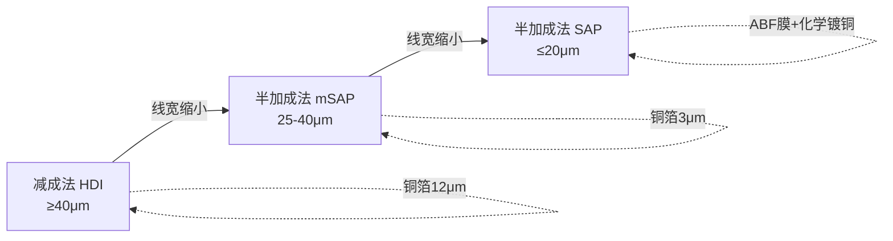
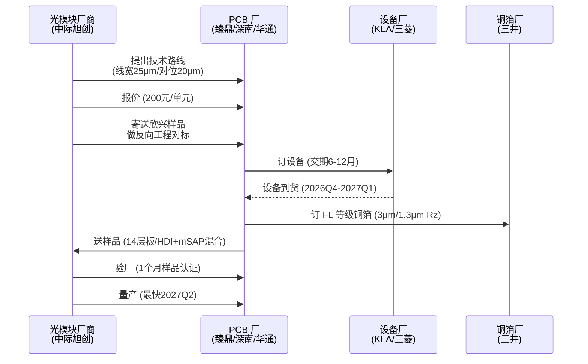

mSAP（modified Semi-Additive Process，改良半加成法）不算新工艺——它一直是苹果 iPhone 主板的成熟方案。2026 年，1.6T 光模块的需求让大陆 PCB 厂第一次撞上量价齐升的机会：单价是苹果 mSAP 主板的 3 倍，2026 全年到 2027Q2 存在确定性产能缺口。

## §1 工艺阶梯：HDI / mSAP / SAP

PCB 制造工艺按线宽线距能力，分三道台阶：HDI（高密度互连板）、mSAP、SAP。

| 工艺 | 类型 | 适用线宽线距 | 核心材料 | 典型应用 |
|------|------|--------------|----------|----------|
| HDI | 减成法 | ≥ 40 μm | 12 μm 标准铜箔（Rz > 4 μm） | 手机副板、汽车板 |
| mSAP | 半加成法（改良） | 25 - 40 μm | 3 μm 超薄铜箔（Rz ≈ 1.3 μm） | 苹果主板、1.6T 光模块 |
| SAP | 半加成法 | ≤ 20 μm（主流 15 μm） | ABF 膜 | CPU / GPU 载板 |

表里的 Rz 指铜箔表面轮廓粗糙度（铜牙高度），后文反复出现。三者的差异在线路成型方式：

- **HDI**：整面 12 μm 铜层覆盖基材，再蚀刻掉多余铜。线路越细，蚀刻越难控制。
- **mSAP**：先在 3 μm 超薄铜层上做图形电镀，让铜只在需要的线路位置"长"出来，再蚀刻掉底部薄铜。3 μm 极薄铜层大幅降低了蚀刻量。
- **SAP**：完全不用铜箔，化学镀铜直接形成 1 μm 以下的种子层。当前主流线宽 15 μm，路线图末端可以做到 2 - 3 μm。代价是必须用 ABF（Ajinomoto Build-up Film，味之素增层膜）而不是 PP（Prepreg，半固化片）做增层介质。

```mermaid
graph LR
  HDI[减成法 HDI<br/>≥40μm] -->|线宽缩小| mSAP[半加成法 mSAP<br/>25-40μm]
  mSAP -->|线宽缩小| SAP[半加成法 SAP<br/>≤20μm]
  HDI -.铜箔12μm.-> HDI
  mSAP -.铜箔3μm.-> mSAP
  SAP -.ABF膜+化学镀铜.-> SAP
```

mSAP 是 HDI 和 SAP 之间的桥。苹果 iPhone 主板用了近十年 mSAP，线宽停在 30 μm；1.6T 光模块把下限推到 25 μm，再往下就是 ABF 载板的世界，工艺和成本都换了一个量级。

mSAP 必须用 3 μm 铜箔，因为它的核心是"图形电镀 + 薄层蚀刻"。如果用 12 μm 铜箔做底，侧蚀（蚀刻时等量向两边吃铜）会直接吃掉 10 μm 以上，25 μm 线路做不出来。3 μm 铜箔把侧蚀控制在 1 - 2 μm，线路边缘才够锐利。

mSAP 做不进 20 μm 以内，根子同样在铜箔上：3 μm 已经是无载体超薄铜箔的下限，再薄就贴不住 PP 增层。SAP 抛弃铜箔，用化学镀铜直接长出种子层，绕开了贴铜箔这个物理约束——代价是必须改用 ABF 膜，设备和材料成本上一个台阶。

> mSAP 与 ABF 载板（SAP）名字相近，但设备完全不同。ABF 载板用 ABF 膜做增层，种子铜是化学镀铜；mSAP 用 PP 做增层，种子铜是 3 μm 铜箔 + 化学镀铜 + 闪镀铜的三层结构。产能不能直接互换——台厂欣兴把 70% 资本支出投向 ABF 载板时，1.6T 光模块的 mSAP 产能就出现了真空。

## §2 从下单到交付：1.6T 光模块板的完整链路

```mermaid
sequenceDiagram
    participant MO as 光模块厂商<br/>(中际旭创)
    participant PC as PCB 厂<br/>(臻鼎/深南/华通)
    participant EV as 设备厂<br/>(KLA/三菱)
    participant CF as 铜箔厂<br/>(三井)

    MO->>PC: 提出技术路线<br/>(线宽25μm/对位20μm)
    MO->>PC: 报价 (200元/单元)
    MO->>PC: 寄送欣兴样品<br/>做反向工程对标
    PC->>EV: 订设备 (交期6-12月)
    EV-->>PC: 设备到货 (2026Q4-2027Q1)
    PC->>CF: 订 FL 等级铜箔 (3μm/1.3μm Rz)
    PC->>MO: 送样品 (14层板/HDI+mSAP混合)
    MO->>PC: 验厂 (1个月样品认证)
    MO->>PC: 量产 (最快2027Q2)
```

这条链路里，控制权在谁手里，就能看出和手机时代差在哪：

链路的**主导方是光模块厂商**。中际旭创直接参与技术路线讨论，验厂也由它主导。和手机时代不同，把技术规格向上游传递的不是终端品牌，而是产业链中游的光模块厂——它们同时是英伟达、谷歌、Meta 的关键供应商。

**设备是必然的瓶颈。** 激光钻孔、曝光、电镀的高端设备与 ABF 载板生产设备重合，交期 6 - 12 个月，加急也要 6 - 8 个月，设备到位后还要 1 个季度认证。高端细线路的 LDI（激光直接成像）设备以 KLA 科磊（原奥宝 Orbotech）为绝对主导，主流扩产厂商的机型基本都锁定它，订单排到一年后。

样品阶段更像**反向工程**。光模块厂商会把欣兴（已出货）的样品交给新供应商做对标，缩短认证周期。中际旭创的 1500 片/周（以生产拼板 panel 计）订单可以并行开给臻鼎、华通。技术能力弱的 PCB 厂即使接到样品也做不出来。

**铜箔等级和工艺是绑定的。** 1.6T 光模块采用 HDI + mSAP 混合结构：HDI 层用 HVLP（超低轮廓）铜箔，mSAP 层用 FL 等级铜箔，HVLP 3 等级的粗糙度可以压到 0.5 μm 以下。错用 standard 等级铜箔，信号完整性直接不达标。

大陆 PCB 厂突然能接 1.6T 光模块的活，是因为台厂把产能挪去了 ABF 载板，这块真空落在大陆厂手里。代价是大陆厂必须在 2026Q4 前完成设备到货，否则等欣兴回过神来重新分配资本支出，市场份额就会被切走。

## §3 工艺差异：同为 mSAP，凭什么贵 3 倍

1.6T 光模块板比苹果 iPhone 主板复杂在哪里：

| 指标 | 苹果 iPhone 主板 mSAP | 1.6T 光模块 mSAP | 差距 |
|------|----------------------|------------------|------|
| 线宽线距 | 30 μm | 25 μm | 蚀刻窗口更窄 |
| 对位精度 | 35 μm | 20 - 25 μm | 多层叠对位更难 |
| 成型后加工精度 | ±100 μm | ±50 μm | 需要精准插拔 |
| 表面处理 | ENIG / OSP | ENEPIG + 金线键合 | 需金线键合 |
| 板层结构 | 8 - 10 层 | 14 层（HDI + mSAP 混合） | 叠层更多 |
| 单价 | 8 美元 / 单元 | 25 - 30 美元 / 单元 | 约 3 倍 |

表面处理一栏的差异值得单独说：ENEPIG（化学镍钯金）比 iPhone 主板常用的 ENIG（化学镍金）多一层钯，为的是金线键合的可靠性。

更细的工艺差异：

- **铜箔**：苹果 mSAP 用 FL 等级（铜牙深度 1.3 μm）；1.6T 光模块同样用 FL，但其 HDI 层用 HVLP（粗糙度 < 0.5 μm）。高频信号在铜箔粗糙面上会因趋肤效应产生额外损耗，粗糙度从 1.3 μm 降到 0.5 μm，信号衰减可减少 20% - 30%。
- **种子铜制备**：mSAP 的标准流程是「超薄铜箔覆合 → 剥离载体铜箔 → 激光钻孔 → 除胶渣 → 化学镀铜 → 闪镀铜 → 形成导电种子层」，在 PP 增层上完成；ABF 载板则直接化学镀铜，1 μm 以下。
- **可靠性**：1.6T 光模块需要耐 CAF（Conductive Anodic Filament，导电阳极丝——高温高湿下铜离子迁移导致短路）、金线键合完整性、焊盘清洁度等苹果主板不要求的能力。

这些差异直接拉高了价格——每道工序的精度要求更高，良率随之下降 10% - 20%。

> 苹果 mSAP 单价低，但需求弹性小——iPhone 主板面积持续缩小，同一片 panel 能切出的主板数量在增加，苹果板销售额平稳时，对 panel 的需求量反而收缩约两成。1.6T 光模块则处在供不应求的早期，价格随产能释放逐步上行。

## §4 产能格局：臻鼎、深南、华通 vs 欣兴

国内 mSAP 产能第一梯队为臻鼎、深南电路、华通；海外欣兴产能规模相当但资本支出侧重不同：

| 厂商 | 基地 | 现状 | 2026 - 2027 扩产 |
|------|------|------|----------------|
| 臻鼎 | 秦皇岛、淮安 | 苹果供应链多年 | 2026.4 起追加 20 亿元新设备 |
| 深南电路 | 无锡（爬坡）+ 新厂区 | 现有产线扩产 | 边扩边爬 |
| 华通 | 台湾 + 重庆 | 引入专门新设备 | 1.6T 光模块专线 |
| 欣兴 | 台湾 | 70% 资本支出投向 ABF 载板 | 1.6T 光模块产能不足 |
| 方正、胜宏、景旺 | 多地 | 前期认证或建设中 | 2026 年内不释放产能 |

中际旭创是当前最积极的扩产需求方，给奥特斯（AT&S）的产能预定为 1500 片/周，给臻鼎、华通也有同等规模。仅头部 3 家大陆 PCB 厂加 1 家欧洲厂就要承接 6000 片/周以上的订单——这还没算二线光模块厂商。

扩产周期：

- 设备交期 6 - 12 个月（加急 6 - 8 个月）
- 设备到货后 2 个月调试
- 客户样品认证 1 个月
- 客户验厂 + 量产认证 1 个季度
- **最快 2027Q2 可量产**

2026 年内 mSAP 新增产能几乎不可能落地，2027Q2 之前的供需缺口基本确定。

欣兴不把资本支出分给 1.6T 光模块，有两个原因。一是 ABF 载板是台厂的"基本盘"——AI 服务器、GPU 载板、台积电 CoWoS 先进封装都需要它，ROI 远高于 mSAP。二是 mSAP 扩产要 6 - 12 个月的设备周期，等欣兴回过神来再下单，2026 年下半年就已经过去了。

## §5 设备瓶颈：5 类关键设备与国产化机会

mSAP 相比 HDI 新增 5 大类设备：

| 设备 | 用途 | 主流供应商 | 国产化程度 |
|------|------|------------|-----------|
| VCP（垂直连续镀铜）| 图形电镀产线基础 | - | - |
| LDI（激光直接成像）| 细线路曝光：BGA 焊盘直径 110 μm、中心距 130 μm、净空间隙 20 μm | KLA 科磊 | 弱 |
| CO₂ 激光钻孔 | 制作 60 μm 盲孔 | 日本三菱、维亚 | 弱 |
| 垂直连续显影设备 | 图形电镀前化学显影 | 德国迅得、台湾扬博 | 中（国内可供应）|
| AOI（自动光学检测）| 检测 25 μm 等级线路 | 奥宝（KLA）、康代（Camtek） | 中 |

两个事实：

1. **主流扩产厂商均选用 KLA 科磊（原奥宝）的 LDI 机型**。这是 DSP 芯片 BGA 封装参数的硬性要求——焊盘直径 110 μm、中心距 130 μm、相邻焊盘净空只有 20 μm，传统曝光设备做不出来。KLA 的 LDI 单台 1500 - 2500 万元，交期 12 个月。
2. **mSAP 与 ABF 载板的设备高度重合**。台厂欣兴在 ABF 载板上的资本支出增加，间接压低了 1.6T 光模块的设备供应能力。这个结构性矛盾短期无解。

> 设备端国产化的机会在 VCP 和显影制程设备；LDI 与 CO₂ 激光钻孔是国产空白，国产替代至少 3 年。

## §6 铜箔：三井垄断的"地壳"

mSAP 对铜箔的要求与传统 HDI 完全不同：

| 工艺 | 铜箔类型 | 厚度 | 粗糙度 Rz |
|------|----------|------|-----------|
| HDI 减成法 | standard | 12 μm | > 4 μm |
| HDI 高频高速 | HVLP | 12 μm | 0.5 - 2 μm（随等级递减） |
| mSAP | FL | 3 μm | 1.3 μm（铜牙深度）|
| mSAP 下一代 | GN | 3 μm | 0.9 μm（铜牙深度）|

三井铜箔的代际划分：

- **EX 等级**：800G 光模块
- **FL 等级**：1.6T 光模块 mSAP 主流
- **GN 等级**：更高级，铜牙深度 0.9 μm

三井已停止普通标准铜箔供应，所有向高频高速迁移的需求都只能用 FL / HVLP / GN 等级，价格刚性。高频高速铜箔已涨价 10%，还有 10% 上涨空间；芯板（Core）与 PP 材料年初至今已涨 30%。

三井能垄断，是因为高频高速铜箔的核心工艺是"铜牙处理"——通过特殊涂层让铜箔表面形成均匀的微米级凸起，深度和均匀度直接影响信号完整性。这一工艺需要 10 年以上积累。国产铜箔厂在 standard 等级已能替代，FL 等级勉强可用，HVLP 3 / GN 至少 2 - 3 年内难以替代。

> 铜箔是 mSAP 供应链里最容易被忽视的瓶颈。PCB 厂的扩产可以追，三井的产能短期内追不上；高频高速铜箔没有降级替代方案，一旦断供，mSAP 产线只能停摆。

## §7 价格机制：8 美元 vs 30 美元的鸿沟

当前 mSAP 板的价格结构：

| 应用 | 单价 | 毛利 | 备注 |
|------|------|------|------|
| 苹果 iPhone 主板 | 8 美元 / 单元 | 中 | 量大，单价低 |
| 1.6T 光模块 | 25 - 30 美元 / 单元 | 较高 | 价差约 3 倍 |
| AI 智能眼镜（Meta 等）| - | - | 整体 300 - 400 片/周，规模小 |
| AI 服务器主板 | - | - | 当前以 HDI 工艺为主，die pitch（芯片焊球间距）缩到 130 μm 时必须转 mSAP |

价格上行的原因：

- **原材料端**：芯板与 PP 年初至今涨 30%；高频高速铜箔涨 10%，还有 10% 空间。成本推动之下，样品已经有 20% 溢价。
- **供需端**：1.6T 光模块供不应求，快速交付订单定价偏高；为加快产品认证，样品也给予溢价。

mSAP 板价格后续仍有 10 - 20% 提升空间，要到 2027Q2 供应稳定后才会回落。把它放进整机盘子里看：一块 1.6T 光模块售价约 1000 - 1500 美元，25 - 30 美元的 PCB 只占整机售价的 2% - 3%，就算 PCB 再涨 10 - 20%，落到整机成本上的影响也不到 1 个百分点。光模块厂商消化起来没有压力，但终端云厂商会借机持续压价。

## §8 产业链主导：光模块厂商的强势

mSAP 在光模块上的导入路径，与手机 / PC 时代完全不同：

| 时代 | 主导方 | 验证流程 | 玩家格局 |
|------|--------|----------|----------|
| 手机时代 | 苹果 / 品牌商 | 苹果验厂 | 臻鼎等供应链锁定 |
| 服务器时代 | 服务器厂商 + Intel/AMD 平台 | 平台认证 | 多供应商分散 |
| 光模块时代 | 光模块厂商（中际旭创等）| 光模块厂商验厂 | 跨地域多供应商 |

变化体现在三处。技术路线由光模块厂商直接定义，技术能力强的供应商能拿到溢价；验厂不再锁死在品牌商的既有供应链里，新玩家只要有能力就能入场；光模块厂对产能的需求足够迫切，愿意用订单把新供应商催熟——这在手机时代的供应链里不会发生。

> 2026 年是大陆 PCB 厂在 mSAP 上建立先发优势的时间窗口——错过 2026 - 2027H1，等欣兴重新分配资本支出时，市场份额就被锁定了。

## §9 不同角色的行动指南

**PCB 厂**：

第一梯队（臻鼎、深南、华通）：保持 2026 全年扩产节奏，设备订单立即锁定，2026Q4 前完成到货调试。错过 2027Q2 量产窗口，份额会被欣兴回流切走。
第二梯队（方正、胜宏、景旺）：现在不是发力的时间点。等 2027H1 原材料价格回落、客户认证流程标准化之后再进入，毛利反而更好。

**光模块厂商**：

2026 全年：多元化供应商，不要把产能压在一家 PCB 厂。中际旭创已把 1500 片/周量级的订单并行分给 3 - 4 家。
2027Q2 后：开始整合供应链，向 ABF 载板能力延伸。1.6T 之后的 3.2T 会进一步逼近 ABF 载板的工艺区间。

**铜箔与设备厂**：

国产化机会在 VCP 和显影制程设备。LDI 与 CO₂ 激光钻孔短期是 KLA、三菱的天下，国产至少 3 年才能切入。
铜箔端短期不可能有国产替代。HVLP 3 / GN 等级至少 2 - 3 年内靠三井和 JX 金属。

**投资人**：

短期看产能（2026 年内谁先到货谁受益）。中长期看 ABF 载板能力（决定 2028+ 能否承接 3.2T 光模块）。
风险点：苹果 iPhone 主板 mSAP 需求温和下滑（面积缩小 + panel 需求收缩），不能简单按"AI 算力带动 mSAP"算总账。

## §10 常见问题

**Q1：mSAP 和 SAP 是同一个工艺吗？**

不是。两者都属于半加成法，但 mSAP 在 3 μm 铜箔上做图形电镀，材料是 PP；SAP 直接在 ABF 膜上化学镀铜，不用铜箔。线宽能力上，mSAP 在 25 - 40 μm，SAP 在 20 μm 以下。

**Q2：英伟达 Rubin 这一代 GPU 已经用上 mSAP 了吗？**

没有大规模铺开。Rubin 的 CPU / GPU 主芯片封装仍依靠 ABF 载板，载板下方直接连接普通 PCB。当芯片 die pitch 缩小到 130 μm 时，mSAP 才会成为必需——Rubin 这一代接近临界点，但还没跨过去。

**Q3：大陆 PCB 厂做 mSAP 的最大技术差距是什么？**

设备调试经验。臻鼎等头部厂的设备本身大多也是 KLA / 三菱，硬件差距不大；但良率爬坡、对位精度控制、HVLP 铜箔与 mSAP 层的协同工艺需要 2 - 3 个季度的工程积累，不是买设备能解决的。

**Q4：三井垄断的铜箔，有没有可能国产替代？**

短期没有。JX 金属、古河电工等日本厂商在 HVLP 3 / GN 等级上有量产能力，但产能同样紧张。国产铜箔厂在 standard 等级已能替代，FL 等级勉强可用，HVLP 3 / GN 至少 2 - 3 年内难以替代。

**Q5：1.6T mSAP 板的毛利也比苹果板高 3 倍，是真的吗？**

不是。价格上是——25 - 30 美元对 8 美元；但毛利要扣掉良率损失、设备折旧和铜箔成本，实际差距收窄到 30% - 50%，远不到 3 倍。价格差反映的是工艺复杂度，不直接等于利润差。

## §11 良率陷阱

mSAP 工艺最常见的良率问题：

1. **铜牙深度不达标**：HVLP 3 铜箔验收要求 Rz < 0.5 μm，批次 Rz 在 0.7 - 1.0 μm 时信号完整性测试会失败。压合前用 AFM（原子力显微镜）抽测铜箔粗糙度。
2. **种子铜厚度不均**：闪镀铜厚度应控制在 0.5 - 0.8 μm，过薄导致后续图形电镀烧板，过厚导致侧蚀控制失败。用 XRF（X 射线荧光）测种子铜厚度，3 个点取均值。
3. **对位偏差超限**：1.6T 光模块要求对位精度 20 - 25 μm，叠层数多时误差累积。每 2 层做一次 X-Ray 对位检查，超限立即停机。
4. **CAF 失效**：高温高湿（85°C / 85% RH）测试下铜离子沿玻纤布迁移。加速老化测试 1000 小时后切片观察。

> 良率要在工艺设计阶段就规避，不是靠测试补救。每一道工序的容差窗口都比 HDI 窄 30% - 50%，工艺调试周期长 2 - 3 倍。

## §12 结尾判断

mSAP 被 AI 重新定义，但它一直是苹果 iPhone 主板的成熟方案。变的是需求结构：从手机（8 美元 / 单元、面积缩小、panel 需求收缩）转向 AI 基础设施（25 - 30 美元 / 单元、供不应求、产能缺口明确）。

三个判断：

1. **2026 年是大陆 PCB 厂的时间窗口**。欣兴把 70% 资本支出投向 ABF 载板，1.6T 光模块的 mSAP 产能真空需要大陆厂填补。设备是瓶颈，2026Q4 - 2027Q1 到货决定 2027Q2 能否量产。
2. **铜箔与设备的卡位比产能本身更关键**。三井的 FL / HVLP 等级铜箔、KLA 的 LDI 机型，短期内都是不可替代的供应来源。国产化的窗口在 VCP 和显影设备。
3. **mSAP 的上限是 ABF 载板**。当芯片 die pitch 进一步缩小（< 130 μm）、3.2T 光模块启动，mSAP 会再次逼近工艺极限。下一轮技术竞争是 mSAP 厂和 ABF 厂的边界之争。

落到动作上：PCB 厂的设备订单要在 2026Q3 前下完，否则赶不上 2027Q2 的量产窗口；光模块厂商今年只能押供应链多元化；投资人把"mSAP 产能"和"ABF 载板能力"当两笔账——前者决定今年，后者决定 2028 年之后的 3.2T。

## §13 术语表

| 术语 | 含义 |
|------|------|
| 减成法（subtractive）| 整面覆铜后蚀刻掉多余铜，HDI 采用 |
| 半加成法（SAP / mSAP）| 在超薄铜层或种子层上图形电镀，再薄蚀刻成型 |
| mSAP | 改良半加成法，3 μm 铜箔 + 图形电镀，线宽 25 - 40 μm |
| SAP | 半加成法，ABF 膜上化学镀铜，不用铜箔，线宽 ≤ 20 μm |
| HDI | 高密度互连板，减成法，线宽 ≥ 40 μm |
| ABF | 味之素增层膜，SAP 载板的核心介质 |
| PP | 半固化片，mSAP 的增层介质 |
| Rz | 表面粗糙度，铜箔铜牙高度的量化指标 |
| HVLP | 低粗糙度高频铜箔，Rz 0.5 - 2 μm（随等级递减） |
| FL / GN | mSAP 专用铜箔等级，铜牙深度 1.3 μm / 0.9 μm |
| VCP | 垂直连续镀铜，图形电镀产线基础设备 |
| LDI | 激光直接成像，曝光设备，KLA 主导 |
| AOI | 自动光学检测，检测细线路缺陷 |
| ENIG / ENEPIG | 化学镍金 / 化学镍钯金表面处理工艺 |
| OSP | 有机保焊膜，表面处理工艺 |
| CAF | 导电阳极丝，高温高湿下铜离子迁移导致的短路失效 |
| die pitch | 芯片焊球间距，决定是否逼近 mSAP 工艺极限 |
| 侧蚀 | 蚀刻时铜被等量向两侧吃掉，影响线宽精度 |
| 趋肤效应 | 高频电流集中于导体表面，表面粗糙度放大损耗 |

---

### 引用说明

- 工艺定义与术语参考：IPC-2221（印制板设计通用标准）、IPC-2222（刚性有机印制板分设计标准）
- 公司层面事实（KLA 收购奥宝、三井金属的高端铜箔业务、欣兴与臻鼎的业务结构、中际旭创的头部光模块厂商地位）可对照各公司官网、年报与交易所公告核实
- **口径说明**：文中的产能订单量（1500 片/周）、扩产投入（20 亿元）、资本支出比例（欣兴 70% 投向 ABF）、单价（8 美元与 25 - 30 美元）、涨价幅度与设备交期等数字，来自 2026 年年中的行业调研纪要，属单一信息源口径，未逐项对照公司公告印证，引用请以官方披露为准

> **文章定位**：前半篇讲 mSAP 工艺本身，中间拆 1.6T 光模块的产能与供应链，§9 与 §12 给出各类角色的决策参考。
