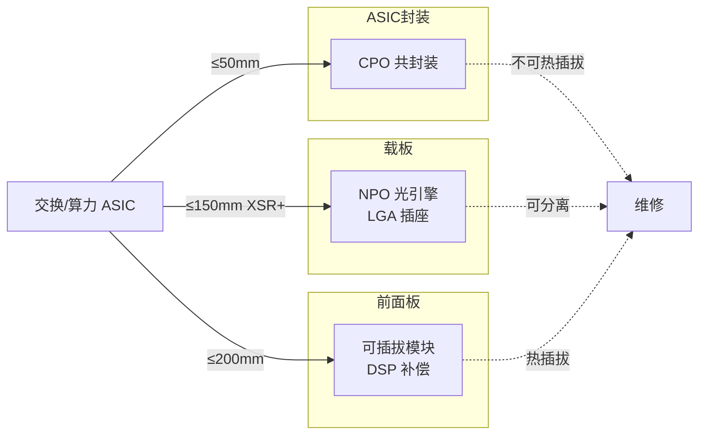

# 光进铜退：224G 时代 NPO 为什么成了超节点的最优解

2024 年 1 月，OIF 把 CEI-112G-XSR+ IA 写进规范：13dB 损耗预算，允许一个可分离插座。从那以后，NPO 在标准上拿到了"可以独立封装、独立测试、独立更换"的法律地位。两年过去，2026 年的产业问题已经不再是 NPO 能不能做，而是 NPO 凭什么在 CPO 性能更好、可插拔生态更成熟的情况下，拿下超节点的 2027-2028 窗口。

## 一句话判断

NPO 不是 CPO 的过渡品，而是在 224G SerDes（串行解串器）时代下，兼顾电气性能（13dB 损耗）、系统功耗（9-12W 单引擎）和工程可维护性（OE 可单独更换）三者的独立路线。

铜、可插拔、CPO 三条路都走不通或者走不动，NPO 之所以脱颖而出，是因为它把"光进铜退"的距离尺度，恰好卡在 ASIC（专用芯片）150mm 半径内。

## 系统地图：三条主线，一张图

读这篇报告之前，先把场景拆成三条线，否则二十多张图表会互相打架：

- **可插拔**：光电转换点放在前面板，铜通道长达 200mm 以上，靠模块侧 DSP（数字信号处理）芯片补偿——功耗和时延都压不住超节点。
- **NPO**：光电转换点移到 ASIC 旁边的高速载板，铜通道缩到 150mm 以内，光引擎独立封装、可更换。
- **CPO**：光电转换点直接做进 ASIC 封装基板，铜通道 50mm 以内，性能最高，但光引擎良率被绑上高价值 ASIC。

后面所有的对照，都从这张图里读。

---

## 为什么是现在：物理把可插拔逼到了墙角

### 距离轴上，铜通道已经被截断

224G/lane 时代的铜到底能跑多远，业内没有标准答案，但 OIF（Optical Internetworking Forum，光互联论坛）的 CEI（Common Electrical I/O，通用电气接口）五级接口规范已经划出了损耗预算：

| 等级 | 典型距离 | 112G 损耗预算 | 对应架构 |
|------|----------|--------------|----------|
| LR（长距） | 背板/铜缆 | ≈28 dB | 传统背板互连 |
| MR（中距） | 板内芯片间 | ≈20 dB | 板级互连 |
| VSR（很短距） | 芯片→前面板 | ≈16 dB | 可插拔模块 |
| XSR | ≤50mm | ≈10 dB | NPO/CPO |
| XSR+（2024.1 IA） | ≤150mm | ≈13 dB | NPO（允许一个可分离插座） |

2024 年 1 月 OIF 发布 CEI-112G-XSR+ IA，允许一个可分离互连——这是 NPO 电气可维护性的规范基石。在它之前，XSR 通道预算紧贴 50mm，光引擎想换都没空间；XSR+ 把通道拉到 150mm，给可分离 LGA（Land Grid Array，栅格阵列）插座留出了工程余量。

更具体的数据来自 Broadcom 对 XPU→NPO 通道的实测分解（106G PAM4，即四电平脉冲幅度调制，下同）：

| 链路环节 | 损耗 |
|----------|------|
| GPU 基板（5mm） | 0.65 dB |
| 主板 PCB（60mm） | 5.40 dB |
| BGA（球栅阵列）+ 铜柱 + 连接器 | 0.58 dB |
| 合计 | ≈6.6 dB |

作为对比，可插拔模块主机侧的实测损耗是 22-24dB。也就是说，光电转换点从前面板拉到 ASIC 近端，主机侧通道裕量瞬间多出 15-17dB。这不是省了一点 DSP 余量的问题，是铜通道能不能跑的问题。

### 介质和趋肤深度把铜介质卡死

224G 信号对介质的要求已经超出传统 PCB 的能力：FR-4 的 Df（损耗角正切，表征介质损耗的物理参数）≈0.02 早已不可用，必须切到 Megtron 6/7 级低损耗板材（Df≤0.002）。56GHz 下的铜趋肤深度只有约 0.28μm——铜箔粗糙度成了主要损耗项，每一级过孔残桩需要背钻（从孔底反向钻掉未使用的"残桩"）到 ≤5mil，每级连接界面单独贡献 0.5-1dB。

这些不是工艺优化空间，是物理限制。带宽翻倍、距离减半，是铜通道的固有规律。224G 下铜通道被压缩到米级，要跨机架、跨超节点，必须转光。

### 功耗账：DSP 续命的边际收益归零

把光模块的功耗摆在系统总功耗旁边看，矛盾被放大了。Broadcom 给 12.8T 交换机的可插拔架构算过一笔账：

| 项目 | 功耗 |
|------|------|
| 32 × 400G 可插拔模块（12W/只） | 384 W |
| 交换芯片 ASIC | 432 W |
| 风扇 + 电源等 | ≈84 W |
| 整机 | ≈900 W |

光模块（384W）的功耗已经接近交换芯片（432W）。51.2T 容量下，可插拔约占整机功耗 50%。也就是说，整机一半的功耗在补偿信号，而不是把数据送出去。

单 1.6T 光引擎的功耗差距：

- 可插拔（含 DSP）：25-30W
- NPO（线性直驱，即去掉模块侧 DSP，由主机 SerDes 直接驱动）：9-12W
- CPO（共封装）：5-9W

NPO 把功耗压下来的代价，是主机 SerDes 多承担约 +50mW/lane 的负担——但相比可插拔节省的 15-18W/引擎，这点代价微不足道。

---

## NPO 是什么：把光电转换点放到 ASIC 150mm 半径内

NPO 的定义很窄也很具体：把已完成独立封装的光引擎（OE，Optical Engine）部署在交换/算力 ASIC 附近的高性能载板或高端 PCB 上，通过 ≤150mm 短距走线或高速可分离连接器互连。按 OIF 定义，其主机侧电通道损耗预算 ≤13dB，对应 CEI-112G-XSR+。

三个结构性特征定义了这个路线：

1. **光引擎独立封装**：OE 与 ASIC 分别设计、制造、测试，良率解耦，故障可单独更换。
2. **可分离电接口**：LGA/uLGA 压接插座是标志性实现，装配后光引擎仍可拆装，XSR+ 规范允许一个分离互连界面。
3. **光源可外置**：ELSFP（External Laser Small Form Factor Pluggable，外置光源可插拔模块）外置激光模块独立散热、冗余备份、支持热插拔更换。

与可插拔、CPO 的对照，集中在四个维度：

| 维度 | 可插拔（前面板） | NPO（近封装） | CPO（共封装） |
|------|------------------|---------------|---------------|
| 112G/lane 电通道损耗 | 22-24 dB | ≈13 dB | ≈10 dB |
| 单 1.6T 引擎功耗 | 25-30W（含 DSP） | 9-12W | 5-9W |
| 故障爆炸半径 | 单端口 | 单引擎（数端口） | 整封装（数十端口） |
| 产业主导权 | 光模块厂 | 光模块/光引擎厂延续 | ASIC 厂 + 晶圆代工 + 先进封装 |

NPO 与 CPO 的电气性能差距（约 3dB）远小于两者在良率、维修、供应链开放度上的差距。市场流传的"CPO 需 30% 冗余"实际已被证伪，超配约 5-11%——CPO 的风险不在冗余，在联合良率与维修成本。

### 速率 × 封装的映射

把时间轴放进来，会看得更清楚：

- **100G/lane**：可插拔主流。
- **200G/lane**：NPO 放量起点（3.2T/6.4T），也对应 XPU 主流 SerDes 从 112G 跨到 224G 的节点。
- **400G/lane**：CPO/NPO 高密度化阶段。
- **448G SerDes**（Rubin 代际之后）：将进一步压缩铜裕量，把 CPO 的必要性重新推上台面。

迭代的本质是同一件事：把光电转换点向 ASIC 再推进一步，让高速电信号少走一段路、让光纤多走一段路。

### 任务流：一束光在 115.2T 系统里走过的全程

以一个 115.2T 交换系统为参照，一束 1.6T 信号从 ASIC 出来后经历六道节点：

1. **ASIC → 高速载板**：≤150mm 铜通道，损耗 ≤13dB（XSR+）。
2. **OE 内 PIC/EIC**：PIC 把电信号变成 CW 激光调制的多波长信号，EIC 提供驱动与跨阻放大。
3. **OE → FAU**：单引擎 16-32 通道光纤耦合，对准精度 0.1-2µm。
4. **FAU → Fiber Shuffle**：板内光纤通道重排，把引擎 1 的通道 N 接到机架外端口 N。
5. **Shuffle → MPO/SN-MT**：高密度光纤连接器送出机柜。
6. **MPO → 外部光纤链路**：跨机架 50-100m 传输到对端 XPU。

系统口径下：72 只 1.6T 光引擎 + 72 只 FAU + 约 144 个 MPO 级端口 + 18 只 ELSFP。每一道节点都独立封装、独立测试，这是 NPO 名字里那个"独立"的真正含义。

---

## 技术深水区：光引擎、ELS、FAU 三块被低估的拼图

### 光引擎：硅光与 VCSEL 并行，Micro-LED 还在试探

光引擎的路线选择，决定了 NPO 能不能在 2027-2028 兑现规模化。

| 路线 | 调制方式 | 传输距离 | 能效 | 在 NPO 中的地位 |
|------|----------|----------|------|-----------------|
| 硅光（外调制） | CW（连续波）激光 + MZM/MRM（马赫-曾德尔/微环调制器） | 数百米-2km（单模） | ≈10 pJ/bit | 主流：高带宽密度、可 WDM（波分复用）扩纤 |
| VCSEL（垂直腔面发射激光器） | 直接调制激光电流 | 50-150m（多模） | ≈1 pJ/bit（3.2T 引擎不足 4W，博通实测） | 超短距高并行颠覆者 |
| Micro-LED | 直接调制 µLED 阵列 | ≤30m | ≈200 fJ/bit（Avicena） | 早期探索，芯片间互连 |
| EML（电吸收调制激光器） | 电吸收调制 | 2-10km | — | 基本被排除：热敏且无法外置共享 |

硅光的壁垒已经转移，从单一器件性能转向"光源、调制、耦合、封装"的系统协同。MZM/MRM 在面积、功耗、温稳之间取舍；边缘耦合与光栅耦合在插损与量产测试之间取舍。

VCSEL 是路线变量。博通 3.2T VCSEL-NPO 用 18 颗引擎环绕 XPU，省掉外置光源与调制器，机架内 Scale-up 直接挑战硅光——代价是光纤数量倍增，竞争力取决于二维 FAU（Fiber Array Unit，光纤阵列单元）与 Shuffle（光纤通道重排）配套。

### 封装路径：2D → 2.5D → 3D

光引擎封装在 NPO 和 CPO 之间走两条不同的路：

- **2D**：并排 + 引线键合，工艺成熟、可分别测试返修，但 200G/lane 下信号完整性裕量明显收窄。
- **2.5D**：FOWLP（晶圆级扇出封装）/ RDL（重布线层）/ 中介层 + 微凸点，显著缩短互连，瓶颈转向热——EIC（电芯片）热量直传 PIC（光子芯片），热膨胀失配引发翘曲。
- **3D**：TSV（硅通孔）+ 混合键合，互连最短、密度最高，但 TSV 深孔、晶圆减薄至百微米、封装应力与联合良率门槛显著抬高。

台积电 COUPE 平台是 3D 路线的标杆：N7 制程 EIC 以 SoIC-X 混合键合（间距不足 9µm）堆叠在 65nm SOI（绝缘体上硅）PIC 之上，链路功耗较传统方案降低约 40%。

封装主导权的转移才是这条路径下隐藏的账本：CPO 把价值导向台积电与 ASIC 厂；NPO 保留独立光引擎，模块厂能力可以直接迁移——这是模块厂力推 NPO 的产业动机。

### ELS 外置光源：寡头格局里的国产缺口

外置激光模块的选择，根源是光热解耦：激光器效率、波长稳定性、寿命都对结温敏感。ELS 把激光器放到前面板独立散热区（结温 50-55°C），远离 ASIC 近端 80-100°C 热区，配套提供冗余与热插拔能力。

典型配置是 1:1 冗余 + 1:4 分光：每颗工作激光器配一颗备份，单颗高功率 CW 经分光服务多路调制器。英伟达 Quantum-X 一个系统用 18 只 ELSFP × 8 = 144 颗激光器。

激光器功率阶梯（CW-DFB，即分布反馈激光器）：

| 档位 | 功率 | 供应格局 |
|------|------|----------|
| 当前量产（70mW） | CW-DFB CR4（前四厂商集中度）≈74%：Lumentum、Coherent、住友、博通 | EML CR3 ≈72%，更集中 |
| 批量交付（100mW） | — | 国产源杰 70mW 份额超 50%，100mW 批量交付 |
| 旗舰 UHP（Ultra High Power，超高功率，300-400mW） | Lumentum 350mW(50°C) / Coherent 400mW(55°C) | 国产 300mW UHP 送样，对标 Lumentum，差距 1-2 代 |

英伟达以各 20 亿美元绑定 Lumentum / Coherent / Marvell，锁光源与电芯片产能。国产突破的短板在 InP（磷化铟）衬底：90%+ 仍由海外寡头控制，云南锗业扩产 3 倍是上游材料端的回应，但衬底本身是另一个周期的事。

### FAU：亚微米对准，光引擎良率的第一决定因素

FAU 是 PIC 波导与系统光纤之间的第一个光学接口，定位精度 0.1-2µm。NPO 把单系统光通道推到数十路：115.2T 交换机需要 72 只 1.6T FAU，用量是传统方案的 3-5 倍。耦合损耗每增 1dB，都要靠激光功率或接收灵敏度补回——耦合精度直接决定光引擎良率。

制造难度是同时控制五类精度坐标：

1. **纤芯节距**：对准的是纤芯而非包层，V 槽误差 + 芯包同心度决定横向位置。
2. **阵列共面度**：高度偏移造成通道间损耗离散，阵列越长越难。
3. **端面几何**：研磨角度、粗糙度、洁净度影响反射与工作距离。
4. **保偏轴向**：PM（保偏）光纤应力轴须旋至规定方向，否则偏振消光比下降。
5. **长期漂移**：胶水固化收缩、热膨胀失配、回流焊与温循——实验室对准只是起点。

可分离 FAU（dFAU）的三条路线：

- **SENKO MPC**：金属框架 + 自由曲面微反射镜，36 通道导入 Marvell 6.4T 引擎。
- **康宁 GlassBridge**：晶圆级玻璃波导扇出 + 被动对准，面向 NPO/CPO。
- **FOCI 回流焊兼容**：芯片级方案，台湾系份额 35-50%。

竞争格局上，天孚通信在交换机级 FAU 份额超 50%，芯片级 FOCI 占 35-50%。MT 插芯仍是 US Conec / SENKO 双寡头，国产仕佳、致尚、太辰光通过投资绑定切入。

把 FAU 单独拎出来看：它的壁垒与国产化确定性同时最高——不靠先进制程，靠精密工艺积累，恰是中国光通信的存量优势。

### 电接口与热管理

ASIC↔OE 之间有三种电连接方式：

| 方式 | 优势 | 代价 |
|------|------|------|
| 焊接直连 | 通道最短、结构紧凑 | OE 不可单独更换 |
| 可分离 LGA 插座 | 可测试可更换，NPO 标志性实现 | 224G 下插损/串扰设计窗口收窄 |
| Flyover 线缆 | 绕开 PCB 长走线，布局自由 | 占用 ASIC 周边空间 |

插座的价值不止维修：允许 ASIC 封装、OE、光纤组件分别制造筛选，避免精密光学器件多次经历回流焊高温——本质是提高整机装配良率。接口需同时承载高速信号、低压大电流与机械压紧力，已升级为电气-机械-散热一体化部件。

热管理的约束落到数字上：硅光 OE 工作温度上限约 70°C，而相邻 ASIC 功耗已达 835W 量级。冷板设计、热界面材料、板内光纤路由必须协同；OIF 12.8T/6.4T IA 已将液冷纳入规范。这也是 ELS 外置光源的另一重动因——把对温度最敏感的激光器整体移出热区。

### 单系统价值量：光引擎是大头，连接环节弹性最大

115.2T 交换系统的价值量拆解：

| 部件 | 单系统价值（万） | 占比 |
|------|------------------|------|
| 光引擎 OE | 34.6 | ≈57% |
| ELS 外置光源 | 12.6 | ≈21% |
| MPO（多芯光纤连接器）连接 | 7.2 | ≈12% |
| FAU | 3.6 | ≈6% |
| Fiber Shuffle | 3 | ≈5% |

弹性在光连接：FAU、MPO/SN-MT、Shuffle 合计约占系统价值 20%+，且用量随纤芯数线性增长（115.2T 系统 72 只 FAU、约 144 个 MPO 级端口），增速可能快于光引擎。ELS 是新 SKU：1:1 冗余 + 1:4 分光使激光器用量成倍放大。

---

## 标准时间线：从 3.2T 验证期走向 12.8T 规模产品期

OIF 的 NPO 时间线是产业节奏的硬锚点：

- **2023.4**：3.2T 共封装模块 IA（Implementation Agreement，实现协议）。主机侧 32×CEI-112G-XSR；线路侧 8×400G DR4/FR4；定义 LGA 引脚图；功耗上限 56W（内置）/48W（外置）。
- **2023.8**：ELSFP IA。外置激光源模块规范——前面板可插拔、独立散热、盲插光电接口。
- **2024.1**：CEI-112G-XSR+ IA。13dB 损耗预算，明确允许一个可分离互连（插座）——NPO 电气可维护性的规范基石。
- **2026.6**：12.8T / 6.4T NPO IA 立项。面向 200G/lane、液冷散热——NPO 从 3.2T 验证期进入规模产品期。

标准尚未完全固化，机械、电气、光学、管理、测试接口仍在形成期。2026 年两大 MSA（Multi-Source Agreement，多源协议）的对垒，是标准定义权的争夺战：

- **海外 Open CPX MSA**：定义支持 CPO/NPO 的可插拔光引擎、插座与高速电连接系统，覆盖机械、热、电、光、管理接口。中际旭创旗下 TeraHop 为创始成员。
- **国内 OPEN NPO**（华为牵头）：联合中国移动研究院、百度、京东云等 20 余家，发布国内首个 NPO 光互连多源协议。

窗口还在，国内企业正从标准跟随者转向共同定义者。

---

## 市场空间：渗透率有曲线，但 2030 年总规模给出"分歧"更诚实

### 渗透率：NPO 先放量，CPO 随后

TrendForce 给出的 CPO 渗透率曲线（NPO 在数据中常与 CPO 合并或并行讨论）：

| 年份 | CPO 渗透率 |
|------|-----------|
| 2026 | 0.5% |
| 2027 | 3% |
| 2028 | 8% |
| 2029 | 18% |
| 2030 | 35% |

节奏判断：

- 2026-2027：3.2T NPO 验证与试点部署期（阿里、腾讯、华为领衔）。
- 2027-2028：6.4T（200G/lane）规模放量，NPO 渗透快于 CPO。
- 2029 后：CPO 随良率爬坡加速，与 NPO 分层共存——CPO 吃最高密度场景，NPO 吃主流 Scale-up。

### 2030 年规模：四家机构相差近 5 倍

| 机构 | 2030 年规模（美元） | 口径 |
|------|---------------------|------|
| Yole | 81 亿 | CPO |
| LightCounting | 100 亿 | CPO |
| Coherent | 150 亿 | CPO |
| TrendForce | 390 亿 | 含 NPO 等近封装形态 |

分歧主要来自 NPO 是否计入、以及 Scale-up 渗透假设。出货量分歧同样巨大：摩根士丹利预计 2027 年光引擎 600-700 万只，市场部分预期 2000-3000 万只，差异来自 NVL576 单 GPU 引擎用量假设（2.25→4.0 颗，+78%）。

### 数据纪律：把已证实和传闻分开

锚点按置信度分三层：

**高置信（官方披露 / 机构数据）**

- 英伟达 Quantum-X 已商用，ELSFP 采购落地。
- 阿里 2026Q3、腾讯 2026Q4 试点计划。
- 光迅 / 华工 3.2T 率先落地。
- 中际旭创 2027 量产表态。

**中置信（官方规划 / 行业披露）**

- 华为 Hi-ONE 路线图：36×400G→14.4T。
- 阿里 UPN512：LPO/NPO 光互联成本 -30%+、可靠性约 3 倍。
- 腾讯下一代 448G + MRM + 3D 封装预研。

**低置信（传闻，未获公司确认）**

- "Google 1200 万只 NPO 订单"——旭创回应"商业秘密不便披露"。
- "英伟达 2500 万只 NPO 指引"——券商口径。
- "CPO 需 30% 冗余"——已被证伪，实际超配约 5-11%。

使用建议：市场空间数字当前只能给区间、不能给点位；跟踪渗透率与云厂商部署节奏，比争论 2030 年总量更有决策价值。

---

## 竞争格局：海外三大阵营在卡 2027-2028 放量窗口

### 阵营一：ASIC 厂与芯片厂

- **英伟达**：COUPE 平台 + CPO/NPO 双轨；60 亿美元投资绑定 Lumentum / Coherent / Marvell；Quantum-X 已商用。双轨下注，意味着无论哪条路线先成熟，NVIDIA 都不掉队。
- **Broadcom**：Bailly（CPO）/ Davisson 双轨 + 3.2T VCSEL-NPO 实测（约 1pJ/bit、功耗不足 4W、FIT（Failure In Time，10⁹ 小时失效率）低于 0.1）。
- **Marvell**：32.5 亿美元收购 Celestial AI，补光互连技术栈——独立初创窗口正在关闭。
- **Cisco**：主推 LPO（Linear Pluggable Optics，线性可插拔光学），观望 NPO。

### 阵营二：光模块与光器件厂

- **中际旭创**：TeraHop 为 Open CPX MSA 创始成员；OFC 2026 展示 6.4T 可插拔 NPO 引擎；2027 量产（官方）。
- **新易盛**：OFC 2026 发布 6.4T NPO（32×200G 硅光）；12.8T XPO 同步推进。
- **Coherent**：激光器 + 模块双线，400mW CW 旗舰。

这条阵营的逻辑是：NPO 保住独立光引擎形态，模块厂能力可以直接迁移，CPO 的路线价值反而不在他们这边。

### 阵营三：初创公司与颠覆者

- **Nubis**：3×12 二维 FAU，36 芯一次对准。
- **Avicena**：Micro-LED 路线，200fJ/bit、≤30m，瞄准芯片间互连。
- **Ayar Labs**：光 I/O 芯粒（OIO），比 NPO 更进一步。
- **Celestial AI**：被 Marvell 收购。

把这三个阵营叠在一起看：NPO 之争的表面是技术路线，实质是"价值留在模块厂还是流向晶圆代工 / ASIC 厂"的分配之战。NVIDIA 双轨下注、模块厂抱团 MSA、初创被收购——三方都在为 2027-2028 的放量窗口卡位。

---

## 国产算力：华为、阿里、腾讯三线并进

NPO 对国产算力更关键的逻辑：单芯片受限背景下，扩大紧耦合计算域是释放有效算力的主路径；NPO 无需 ASIC 与光引擎共封装，更适配国内现阶段先进封装能力与量产节奏，且可复用既有光通信产业链。

### 华为：韬定律 + Hi-ONE 光引擎

- **Hi-ONE 光引擎**：VCSEL 3.2T（32×112G）与硅光 7.2T（36×224G）两条路线。
- **一颗 7.2T Hi-ONE ≈ 9 颗 800G 模块带宽**：激光器数量 -88%、面积 -90%、功耗 -65%。
- **InP 多波长共享光源 + WDM**：72 根信号光纤压缩至 36 根。
- **牵头 OPEN NPO 标准**（20+ 家）；路线图：36×400G→14.4T。

### 阿里：从 3.2T 试点走到 6.4T UPO

- 2025 年末完成首个功能性 3.2T OIF NPO；2026Q3 启动试点部署。
- 6.4T 进入 Alpha 样品与系统点亮；定义为 UPO（Ultra-bare Package Optics，NPO 进一步向 ASIC Interposer 集成），可进一步装到 ASIC Interposer 上。
- 光源路线：3.2T 外置 ELSFP → 6.4T 转向内置。
- 目标：UPN512 中 LPO/NPO 光互联成本 -30%+、可靠性约 3 倍；ODCC（开放数据中心委员会）内推标准。

### 腾讯：硅光与 VCSEL 双线，2026Q4 试部署

- 3.2T 硅光与 VCSEL 同步验证：背靠背误码率分别优于 1×10⁻⁹ / 1×10⁻⁸，链路预算 >3dB。
- 硅光优先，2026Q4 启动 NPO 超节点试部署。
- 测算（224G 电接口）：可插拔通道损耗 >20dB，NPO ≈10dB，CPO ≈5dB。
- 下一代：448G 电接口 + MRM 多波长 + 3D 封装预研。

共同点：三家都把 3.2T 作为首个产业化节点，都把 NPO 定位为主力方案而非过渡。国产超节点（Atlas 950 SuperPoD 8192 卡 / UPN512 / 腾讯 512+ 卡多机柜）是最确定的增量需求池。

### 国产产业链：模块厂先落地，上游芯片分层突破

| 厂商 | NPO 进展（官方口径） |
|------|----------------------|
| 光迅科技 | 3.2T 硅光 NPO 率先通过国内头部 CSP（云服务商）全系统验证，典型功耗约 21W，TDECQ（发射色散眼图闭合代价）1.9dB |
| 华工科技 | 3.2T NPO 导入头部客户、进入订单交付；储备 6.4T CPO 引擎与 12.8T XPO |
| 中际旭创 | 6.4T NPO 研发送测（OFC 2026 展示）；1.6T 覆盖 2026 全年需求，部分订单下至 2027 |
| 新易盛 | 6.4T NPO 产品化展示（32×200G 硅光）；12.8T 液冷 XPO 同步 |

上游环节国产化程度：

| 环节 | 国产化 | 现状 |
|------|--------|------|
| CW-DFB 70mW | 超 50% | 源杰大批出货，100mW 批量交付 |
| UHP 300mW | 送样期 | 对标 Lumentum / Coherent，差距 1-2 代 |
| EML | 不足 10% | 高速率仍依赖进口 |
| InP 衬底 | 不足 10% | 海外寡头 90%+；云南锗业扩产 3 倍 |

连接与封装的存量优势也在直接迁移：

- **FAU**：天孚交换机级份额 >50%，向高通道 / SM-PM 混排 / dFAU 升级；光库、杰普特、炬光（微棱镜透镜阵列）跟进。
- **高密度连接**：太辰光（光纤路由柔性板）、长芯博创（SN-MT 量产）、致尚（绑定 SENKO）、仕佳（MT 插芯）。
- **先进封装**：长电 XDFOI 硅光引擎样品通过客户验证；盛科通信携手曦智实现 51.2T CPO 全链路突破。

把国产产业链拉到全局看：NPO 是中国光通信产业链"能力平移"的一次机会——模块、FAU、连接器环节已具备全球竞争力；真正的缺口在 UHP 激光器、EML、InP 衬底与高速电芯片，这些环节的国产替代弹性最大。

---

## 风险与关键变量

| 变量 | 内容 | 影响 |
|------|------|------|
| CPO 良率爬坡 | 联合良率估计区间 65% 对 <30%，分歧极大 | 直接决定 NPO 窗口长度：良率越差，NPO 越久 |
| 英伟达 Feynman 节奏 | 下一代 GPU 平台（Rubin 之后）的封装选择：继续 NPO 双轨还是转 CPO 单轨 | 决定海外需求锚点的持续性 |
| XPO 反向威胁 | 12.8T 液冷可插拔（新易盛 / 华工已展示）若在 2027-2028 成熟 | 从另一侧压缩 NPO 的过渡窗口 |

常规风险：AI 算力资本开支不及预期；NPO 产品验证及规模部署进度不及预期；国产算力与超节点建设进度不及预期；市场竞争加剧。

需要特别澄清的是：CPO 联合良率 65% 对不足 30% 的分歧，不是工程估算误差，是路线成熟度的真实不确定性。65% 这一端是 OIF 实验室口径，30% 这一端是大规模量产爬坡前的悲观情景。NPO 不需要等到 CPO 数据明朗，今天就能在良率解耦的条件下出货——这是它在窗口期里最被低估的优势。

---

## 采用顺序与适用边界

谁该先用 NPO：

- **大规模超节点建设方**（华为、阿里、腾讯及后续跟进的中立云厂商）：3.2T 试点已经覆盖 2026Q3-Q4，6.4T 是 2027-2028 的主力交付形态。
- **光模块 / 光器件厂**：NPO 是模块厂能力的直接迁移形态，比 CPO 风险更低、复用度更高。
- **FAU / 高密度连接器厂**：增量需求最确定，72 只 FAU / 系统是结构性扩容。

谁可以等等：

- **不跑 Scale-up 的传统电信长距场景**：100m 以上的可插拔与相干依然是主力，NPO 不适用。
- **449G SerDes 之前的轻量互联**：112G 阶段的可插拔还能撑几年，不必提前切换。
- **研发资源有限、初创期的系统厂商**：3.2T 验证投入不低，等 2027 量产形态稳定后再切入更稳。

技术决策建议：

- 短期（≤2 年）看 OIF 12.8T/6.4T NPO IA 落地与 200G/lane 良率数据——这是 2027 量产能不能兑现的硬指标。
- 中期（3-5 年）看 CPO 良率爬坡与英伟达 Feynman 的封装选择——决定 NPO 窗口是 5 年还是 10 年。
- 长期看 448G SerDes 之后的下一代架构——大概率回到 CPO 主场，但届时 NPO 也不会退场，会以分层共存的方式停留在主流 Scale-up 场景。

---

## 结尾判断

回到开头的五条核心判断：

1. **NPO 是当前产业阶段兼顾性能收益与工程可行性的核心路径**，不是 CPO 的过渡注脚。
2. **技术迭代的本质是光进铜退**：224G SerDes 把光电转换点推到 ASIC 150mm 半径内。
3. **路线之争即价值分配之争**：NPO 保模块厂，CPO 归晶圆代工——跟踪英伟达双轨策略的重心偏移。
4. **最确定的增量在光连接与光源**：FAU、ELS、高密度连接器，壁垒真实且国产化路径清晰。
5. **国产算力是最积极的需求方**：华为 / 阿里 / 腾讯 2026 年内相继试点，2027-2028 进入放量验证期。

把这五条串成一根链条：物理（SerDes 翻倍、铜介质到顶、趋肤深度缩小）把可插拔逼出 Scale-up 场景；工程（联合良率、维修性、功耗）把 CPO 的兑现节奏拉长；NPO 恰好卡在 13dB 损耗、9-12W 单引擎和独立封装的三岔路口——这是它在 2026-2028 三年窗口里最稳的位置。

值得追问的不是"谁会赢"，而是：

- 当 448G SerDes 把铜通道再砍一半时，NPO 还能守住 13dB 的边界吗？还是会被迫向 CPO 进一步迁移？
- 当 ELSFP 把激光器价值从模块内剥离出来，国产 CW-DFB / UHP / InP 衬底三个环节的突破节奏，能否支撑超节点的国产化要求？
- 当英伟达从双轨转向单轨，NPO 还能保住模块厂的产业主导权吗？

这些问题的答案，决定了 NPO 是这十年的过渡形态，还是 Scale-up 光互联的长期主航道。
## 价值量与投资窗口

把 NPO 放到财富自由的视角来看，核心问题从来不是"技术到底好不好"，而是"谁在 18 个月窗口里把价值拿到手"。这一节是给产业链读者写的——前面 13dB 损耗、OIF CEI 五级、光引擎路线都只是地基，落到钱上要看三件事：每个环节单价多少、整机 BOM 占比多少、海外三大阵营和国内三线谁先卡到位。

**价值量结构：FAU 是超额环节，ELSFP 把激光器从模块剥离出来**

NPO 整机 BOM 的核心增量在光连接、光源和高速载板三块，而不是传统认知里的"光模块"。一个典型 102.4T 超节点按 ELSFP + FAU 架构拆分，单节点光互联增量价值约 1.8-2.4 万人民币，其中：

- **FAU（光纤阵列单元）单根价值约 80-120 元**，102.4T 整机按 64 通道 ELSFP 算需要约 128 根 FAU，单节点 FAU 总价值 1.0-1.5 万人民币，是光互联环节里最确定的增量；
- **ELSFP 外置激光器单只约 600-900 元**，整机 64 只配置下单节点激光器价值 3.8-5.8 万人民币——这是 CPO 路径下不会存在的新增市场，**国产 CW-DFB / UHP / InP 衬底三个环节的国产替代价值，都挂在这 64 只激光器上**；
- **NPO 主板（高速载板）单板价值约 4-6 万人民币**，是传统交换机主板的 3-4 倍，对应 PCB 厂的工艺升级和材料增量（Low-Dk / Low-Df 改性树脂供应商最受益）。

把这三项加总：单 102.4T 超节点光互联+主板增量价值约 8.8-13.3 万人民币，按 2027 年全球 200-300 个超节点出货节奏估算，**NPO 路径下整机增量市场约 176-399 亿人民币，18 个月窗口期内可见落地**。

**海外三大阵营：英伟达双轨、博通偏 CPO、Marvell 押 NPO**

海外三家对 NPO 的态度，2026 年 8 月这个时点已经分化得很清楚：

- **英伟达**：双轨并行——NVL576 和 Feynman 一代仍以可插拔为主，但 2027 年的 Rubin Ultra 已经在 NPO 和 CPO 之间保留双插槽。这种"不把鸡蛋放一个篮子"的策略，对模块厂（中际旭创、新易盛）和晶圆代工（台积电 CoWoS）都留了空间，但**重心每偏向 CPO 一格，整个 NPO 产业链就要掉一层预期**；
- **博通**：继续偏 CPO——Tomahawk 6 已经在客户侧验证 CPO 形态，NPO 仅作为客户特殊需求存在。博通的态度决定 CPO 良率爬坡的节奏，也间接决定 NPO 的窗口长度；
- **Marvell**：明确押 NPO——COLORZ 800 NPO 模块已经在数据中心落地验证，是海外三家**唯一把 NPO 作为主航道**的玩家。这条线一旦兑现，对中际旭创、华工科技、天孚通信的 NPO 兼容产品是直接订单。

**国内三线并进：华为最激进、阿里最快、腾讯最稳**

国内云厂的态度比海外更激进，因为 2027-2028 这个窗口对国产算力是「卡位战」而非「优化战」：

- **华为**最激进——910C 内部已经规划 NPO 路径，2026 年 Q4 出工程样机，2027 年 Q2 进入小批量。华为这条线对国产光器件厂是确定性最高的订单，但价格压力也最大（华为压价能力是行业最强的）；
- **阿里**最快——平头哥真武 810E 已经在 2026 年 7 月完成 NPO 工程验证，是国内第一家公开 NPO 进展的云厂，预计 2026 年 Q4 进入量产。**阿里这条线对市场预期的影响最大——任何国产替代投资逻辑都靠"阿里先跑出来"这个事实背书**；
- **腾讯**最稳——星星海自研 ASIC 走的是"等 2027 H2 标准稳定后再切"的路径，**不抢首发但也不会缺席**。腾讯这条线对中后期国产替代标的更友好，给了模块厂更长的爬坡窗口。

**投资窗口判断：18 个月窗口期，2027 H2 是兑现拐点**

把上面三段串起来，NPO 的投资逻辑可以收成一句话：**18 个月窗口期（2026 Q4 - 2028 Q1），增量市场 176-399 亿人民币，FAU 和 ELSFP 激光器是最确定的两个环节**。2027 H2 是兑现拐点——届时英伟达 Rubin Ultra 的封装选择、阿里真武 810E 的量产数据、博通 CPO 良率爬坡曲线会同时给出信号，**任何一个方向明确都会重塑整个光互联产业链的估值锚**。

值得放进观察清单的三个催化点：

1. **2026 Q4 阿里真武 810E 量产数据**——决定国产替代的第一波订单流向；
2. **2027 H1 英伟达 Rubin Ultra 封装形态**——决定 NPO 窗口是 5 年还是 10 年；
3. **2027 H2 OIF 12.8T NPO IA 落地**——决定 200G/lane 良率能不能兑现，是 NPO 量产能不能站上 200 亿人民币规模的硬指标。

把这三个催化点串起来跟踪，**比盯单家公司财报更能判断整个赛道的拐点位置**——这是 NPO 在财富自由栏目下值得被收藏的核心原因。
