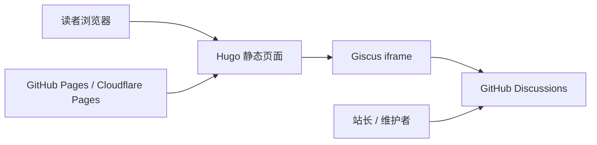
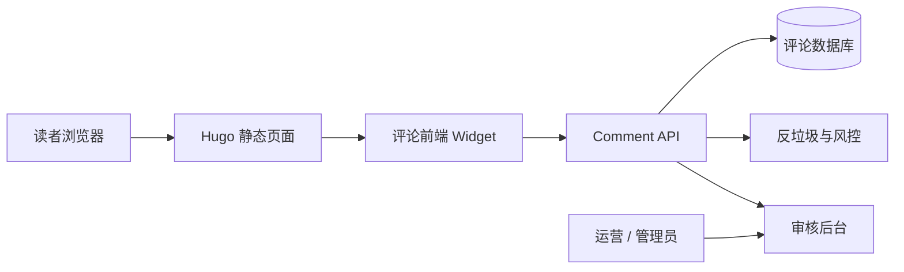

> 结论先行
>
> 对 text-matrix 这类 Hugo + LoveIt + GitHub/Cloudflare Pages 的静态内容站，最优先的工业化方案不是自建评论后端，而是采用“静态站点 + 外部托管评论域”的架构。
>
> 在本仓库现状下，首选方案是 Giscus，次选方案是 Utterances；只有在明确需要“非 GitHub 登录、匿名评论、强审计、私有化数据 ownership”时，才应升级到 Waline 或自建边缘评论服务。

## 1. 背景与目标

本文不是泛泛地比较评论插件，而是基于 text-matrix 当前真实架构回答三个问题：

1. 现有系统是否适合直接加评论。
2. 哪种评论方案与当前架构最匹配。
3. 业界更稳妥的工业实践应该如何分阶段落地。

本文同时覆盖以下维度：

- 技术架构适配性
- 部署与运维复杂度
- 安全与隐私
- 反垃圾与治理
- SEO、性能与搜索影响
- 将来升级到自有评论域的演进路径

## 2. 基于当前仓库的关键事实

先看结论，再看影响。

| 观察项 | 当前现状 | 架构影响 |
| ---- | ---- | ---- |
| 站点形态 | text-matrix 是 Hugo 静态站点，使用 LoveIt 主题 | 评论最好不要依赖本站自带服务端 |
| 页面模板 | `layouts/posts/single.html` 与 `layouts/_default/single.html` 都会调用评论 partial | 一旦全局启用，评论可能不止出现在文章页，也会出现在普通页面 |
| 评论能力 | LoveIt 已内建 Giscus、Utterances、Waline 等接入逻辑 | 不需要从零写前端 widget |
| 配置注入时机 | 评论配置在主题初始化时只在 production 环境注入 | 本地默认开发环境可能看不到评论，验证方式需要调整 |
| 发布链路 | 当前仓库已有 GitHub Pages Actions，也有 Cloudflare Pages 构建脚本 | 评论方案应尽量不依赖额外后端部署，或者至少与主站解耦 |
| 搜索能力 | 当前站内搜索依赖 Pagefind | 客户端注入评论默认不会被 Hugo 和 Pagefind 纳入静态索引 |

这几个事实决定了一件事：

**text-matrix 具备“低成本接入评论”的前提，但不适合一上来就自建评论后端。**

## 3. 先明确评论系统到底要解决什么

评论功能不是一个 iframe，而是一套完整的能力边界。工业实践里至少要回答下面 8 个问题：

1. 谁可以评论：匿名、GitHub 登录、邮箱登录，还是站内账号。
2. 评论存哪：GitHub Discussions、第三方平台、自建数据库。
3. 怎么审核：先审后发、后审、敏感词、举报、封禁。
4. 怎么反垃圾：身份门槛、频率限制、验证码、信誉分。
5. 怎么通知：站长是否能及时收到新评论提醒。
6. 怎么扩展：以后是否需要点赞、置顶、回复、精选。
7. 怎么合规：隐私政策是否需要补充第三方数据处理说明。
8. 怎么运营：垃圾评论、争议评论、删帖策略由谁执行。

对内容型站点来说，评论系统应视为一个独立边界，而不是 Markdown 的附属字段。

## 4. 工业实践的选型原则

### 4.1 静态站优先选择“托管式评论域”

如果主站是静态站，最佳实践通常不是让 Hugo 直接承担“读写评论”的职责，而是：

- Hugo 只负责渲染页面和挂载评论容器。
- 评论数据存储、鉴权、审核、通知交给外部评论域。
- 主站和评论域之间只做最小耦合。

原因很简单：

- 静态站没有天然写入能力。
- 评论是高噪音、高风控、高运维的业务。
- 为评论引入自建数据库、认证系统、管理后台，复杂度会远超正文系统本身。

### 4.2 不要把机密放进前端配置

任何需要把真正机密直接暴露到浏览器的方案，都不符合工业实践。

这也是为什么：

- Gitalk 不应作为首选，因为常见接法会让 OAuth client secret 进入前端配置。
- 自建 API 若依赖长期有效的管理员 token，也不能直接写死在静态资源中。

### 4.3 评论是“附加载荷”，不能拖垮首屏

评论对内容站的目标是提升讨论质量，而不是影响正文阅读体验。

因此评论必须满足：

- 延迟加载或懒加载
- 不阻塞正文渲染
- JS 失败时不影响正文可读性
- 第三方服务异常时页面仍然可用

### 4.4 评论要遵守 canonical URL 策略

评论与页面绑定，真正绑定的不是“文章概念”，而是映射规则。

如果映射规则设计错误，会导致：

- 同一篇文章在不同域名下生成两份讨论线程
- URL 变更后旧评论孤儿化
- 预览环境产生脏线程

这在静态站里是高频坑，必须在接入前先定规则。

## 5. 候选方案比较

### 5.1 方案总览

| 方案 | 适配 text-matrix 程度 | 主要优点 | 主要问题 | 结论 |
| ---- | ---- | ---- | ---- | ---- |
| Giscus | 很高 | LoveIt 原生支持、无需后端、基于 GitHub Discussions、主题切换支持好 | 需要 GitHub 登录、评论公开、评论数扩展较弱 | 首选 |
| Utterances | 高 | 极简、成熟、接入成本低 | 基于 Issues，讨论治理不如 Discussions，仓库 Issues 容易被污染 | 次选 |
| Waline | 中高 | 更适合非 GitHub 用户，可做更低门槛评论 | 需要独立服务端与存储，治理成本显著上升 | 有明确需求时采用 |
| Disqus | 中 | 接入快、功能全 | 隐私、性能、第三方依赖和体验争议较大 | 不建议优先 |
| Gitalk | 中低 | GitHub 生态、历史上常见 | 前端暴露 secret 风险、维护体验一般 | 不建议 |
| 自建评论服务 | 视需求而定 | 数据完全自控、可深度定制 | 建设与治理成本最高 | 只在业务明确时进入 |

### 5.2 为什么首选 Giscus

对 text-matrix 来说，Giscus 的匹配度最高，原因不是“它流行”，而是它恰好贴合当前系统边界：

- 仓库本身在 GitHub 上，天然适合使用 GitHub Discussions 承载评论。
- LoveIt 已原生支持 Giscus，不需要额外写评论挂载逻辑。
- Giscus 不需要自建后端、数据库、管理面板。
- 评论者必须使用 GitHub 身份，天然提高反垃圾门槛。
- GitHub Discussions 自带一定的审核、锁帖、删除、订阅能力。
- 站点当前既可能部署在 GitHub Pages，也可能部署在 Cloudflare Pages，Giscus 作为前端嵌入方案对这两条链路都友好。

但这里必须补充一个经常被忽略的前提：

**Giscus 天然会暴露其所绑定的 GitHub 仓库。**

原因不是配置疏忽，而是产品机制如此：

- Giscus 依赖公开 GitHub 仓库与公开的 GitHub Discussions。
- 页面前端会携带 `repo`、`repoId`、`category` 等配置参数。
- 访客可以从页面源码、网络请求、评论区跳转链接，或 GitHub Discussions 页面本身识别出评论绑定到了哪个仓库。

因此，Giscus 适合的不是“完全隐藏评论后端”的场景，而是：

- 你能接受评论后端基于 GitHub 公开存在。
- 你能接受站点与某个公开仓库建立明确关联。

如果你的诉求是“评论能用，但外部不能知道背后是哪一个 GitHub 仓库”，那 Giscus 就不适合作为最终方案。

进一步说，Giscus 有两种不同的暴露等级：

1. 直接绑定主站源码仓库。
2. 绑定独立的 comments 仓库。

两者都无法做到“仓库完全不可见”，但第二种可以把暴露面从“主站源码仓库”收敛为“专用评论仓库”。对工程隔离、仓库卫生和品牌控制都更稳。

### 5.3 为什么不是一上来就 Waline 或自建

Waline 和自建评论服务不是坏方案，但它们适合的是另一类目标：

- 你明确要服务大量非 GitHub 用户。
- 你需要匿名、邮箱、验证码等更细粒度的交互能力。
- 你需要评论数据做 BI、推荐、用户画像或合规留存。

如果现在还没有这些确定需求，直接上 Waline 或自建，大概率是在为未来假设提前付出长期运维成本。

### 5.4 为什么不建议 Disqus 和 Gitalk 作为主方案

Disqus 的主要问题不在于“不能用”，而在于它对内容站的长期控制力偏弱：

- 隐私与第三方脚本压力较大。
- 用户体验和品牌感较弱。
- 平台依赖更强。

Gitalk 的主要问题则更偏安全和架构边界：

- 常见静态站接法需要在前端配置 GitHub OAuth client secret。
- 这不符合“机密只存在服务端”的基本工程原则。

## 6. 推荐目标架构

### 6.1 V1 推荐架构



这个架构的特点是：

- 主站仍然是纯静态站。
- 评论数据不进入 Hugo 构建链路。
- 评论域与正文域解耦。
- 没有额外私有后端，也没有机密注入前端。

### 6.2 V2 演进架构

如果未来评论需求明显升级，可以把评论域单独演进成边缘服务：



这个 V2 不是当前首选，而是“将来必要时的升级路线”。

## 7. 在 text-matrix 上的推荐落地方式

### 7.1 范围控制先于功能开启

这是本仓库最容易踩的第一个坑。

当前仓库的文章页模板和默认单页模板都会调用评论 partial。也就是说，如果你在全局配置里直接把评论打开：

- `posts` 下的文章会有评论
- `content/docs` 下的文档页会有评论
- `about`、`contact`、`privacy-policy` 这类普通页面也可能出现评论

这通常不是你真正想要的结果。

**推荐策略：评论默认只对文章页开放，文档页按需开启，关于/联系/隐私/搜索页关闭。**

推荐做法有两种。

#### 方案 A：最小改动，使用 front matter 逐页关闭

优点是快，缺点是靠人工维护，时间长了容易漏。

示例：

```yaml
comment: false
```

适用于：

- 你暂时不想改模板
- 页面数量不多

#### 方案 B：推荐做法，模板按 section 控制

这是更稳的工业实践。

建议原则：

- `posts` 永久开启评论入口
- `docs` 只对明确需要讨论的页面开启
- 其他普通页面默认不渲染评论容器

这样做能把“评论适用范围”从人工约定变成模板约束。

### 7.2 Giscus 的映射规则建议

当前主题对 Giscus 暴露的配置项里，最适合 text-matrix 的映射规则是：

```toml
mapping = "pathname"
```

选择它的理由：

- 对静态内容站最直观。
- 不依赖标题，避免标题改动导致线程漂移。
- 对中文文章也没有额外 slug 翻译问题。

但它有两个前提：

1. 页面 permalink 要稳定。
2. 非生产预览地址不应作为正式评论入口暴露。

这里是本仓库最容易踩的第二个坑。

如果同一篇内容同时在以下地址可评论：

- 生产主域名
- GitHub Pages 项目路径
- Cloudflare Pages 预览域名

那么 `pathname` 可能因为路径前缀差异而生成不同的讨论线程。

因此最佳实践是：

- 只在 canonical production 域名上启用评论。
- 预览环境默认关闭评论 widget。
- 文章 permalink 一旦确定，不要随意改写。

### 7.3 推荐的 Giscus 配置形态

在真正写配置之前，建议先决定评论承载仓库的策略。

#### 方案 A：直接绑定主仓库

也就是直接把 Giscus 绑定到 `A1pha3/text-matrix`。

优点：

- 最省事
- 不需要额外维护一个仓库
- 讨论与主项目上下文天然在一起

问题：

- 外部会更明确地知道评论绑定的是主站源码仓库
- 评论 discussions 会和主项目其他 discussions 共存，长期可能影响仓库信息整洁度
- 如果未来想把站点源码仓库与评论域解耦，迁移成本会更高

#### 方案 B：独立 comments 仓库

这是我更推荐的工业实践。

做法是单独创建一个公开仓库，例如：

- `A1pha3/text-matrix-comments`
- `A1pha3/comments`

这个仓库只做一件事：承载 Giscus 的 Discussions。

优点：

- 暴露的是评论仓库，不一定是主站源码仓库
- 评论流量、站务讨论、产品讨论可以和源码仓库解耦
- 权限边界更清晰，后续迁移也更容易
- 即使以后主站换仓库、拆仓、私有化，也不一定影响评论仓库

缺点：

- 多维护一个公开仓库
- 需要单独初始化 Discussions 分类与仓库说明

如果你的顾虑是“会不会暴露我的仓库地址”，那更准确的回答应该是：

- 用 Giscus，一定会暴露某个 GitHub 仓库。
- 但这个仓库不一定必须是主站源码仓库。

对 text-matrix 来说，更稳妥的建议是：

**如果采用 Giscus，优先使用独立 comments 仓库，而不是直接绑定主仓库。**

#### 独立 comments 仓库实施清单

下面给出一套可以直接照做的操作顺序。目标是把评论从主站源码仓库中隔离出来，同时保持接入成本最低。

##### Step 1：创建公开 comments 仓库

建议命名：

- `A1pha3/text-matrix-comments`

如果你希望把评论域与主账号进一步隔离，也可以把 comments 仓库创建在另一个 GitHub 账号或组织下，例如：

- `beta/text-matrix-comments`
- `txtmix/comments`

建议仓库说明：

- `Comment discussions for txtmix.com, powered by Giscus and GitHub Discussions.`

建议原则：

- 仓库必须是公开仓库，否则 Giscus 无法正常工作。
- 仓库不要承载主站源码、CI、构建脚本，只承载评论 discussions。
- README 可以只写简短说明，告诉维护者这是评论承载仓库，不是主站开发仓库。
- comments 仓库不必和主站源码仓库位于同一个 GitHub 账号；跨账号、跨组织都可以正常接入 Giscus。
- 但要明确一点：Giscus 仍然会公开暴露它绑定的 owner/repo，只是暴露的可以是独立 comments 仓库，而不一定是主站源码仓库。
- 如果评论仓库放在另一个账号下，后续的 Discussions 审核、分类维护、Giscus app 安装与仓库权限管理，也都要以那个账号或组织为准。
- 从长期治理看，独立组织通常比“另注册一个个人小号”更稳，因为权限交接、多人协作和品牌一致性都更容易管理。

##### Step 2：启用 GitHub Discussions

在新仓库里操作：

1. 打开仓库首页。
2. 进入 `Settings`。
3. 在 `Features` 区域开启 `Discussions`。

建议确认：

- 仓库已出现 `Discussions` 标签页。
- 你拥有该仓库管理员权限，否则后续无法安装 Giscus app 和管理分类。

##### Step 3：安装 Giscus GitHub App

在 GitHub 上打开 Giscus app 安装页后：

1. 选择你的账号或组织。
2. 选择 `Only select repositories`。
3. 只勾选新建的 comments 仓库。

这是更稳妥的最小授权原则，不建议把 Giscus app 一次性装到所有仓库。

##### Step 4：创建专用 Discussions 分类

进入 comments 仓库的 `Discussions`，创建一个专用分类，建议：

- 分类名：`Comments`
- 分类类型：`Announcements`

推荐使用 `Announcements` 的原因：

- 新 discussion 更适合由维护者和 Giscus 自动创建。
- 能降低访客在 GitHub 侧随意开新话题的噪音。

如果你后面还要做站务讨论、建议反馈、Bug 交流，建议另建其他分类，不要和评论混在同一个分类里。

##### Step 5：用 Giscus 配置工具生成关键参数

打开 Giscus 官方配置页，按顺序填写：

1. 仓库：填 comments 仓库，例如 `A1pha3/text-matrix-comments`。
2. 映射方式：选择 `pathname`。
3. 分类：选择刚创建的 `Comments`。
4. 语言：选择 `zh-CN`。
5. 懒加载：开启。

完成后，记录下面 4 个关键值：

- `repo`
- `repoId`
- `category`
- `categoryId`

其中真正需要手工回填到 Hugo 配置里的，核心就是这 4 个值。

##### Step 6：把配置回填到站点

回填时，建议采用下面这组目标值：

```toml
[params.page.comment]
    enable = true

    [params.page.comment.giscus]
        enable = true
        repo = "A1pha3/text-matrix-comments"
        repoId = "<repoId>"
        category = "Comments"
        categoryId = "<categoryId>"
        lang = "zh-CN"
        mapping = "pathname"
        reactionsEnabled = "1"
        emitMetadata = "0"
        inputPosition = "bottom"
        lazyLoading = true
        lightTheme = "light"
        darkTheme = "dark"
```

这里有几个具体建议：

- `mapping` 先固定为 `pathname`，不要一开始就频繁试不同映射。
- `emitMetadata` 先保持 `0`，避免在第一阶段引入额外前端联动复杂度。
- `Comments` 分类名应和 GitHub Discussions 里的真实分类名一致。

##### Step 7：先限制评论展示范围，再全局启用

不要先把 Giscus 配好再去想“哪些页面该显示评论”。顺序应该反过来：

1. 先决定只有 `posts` 文章页显示评论。
2. 再把 `docs`、`about`、`contact`、`privacy-policy`、`search` 等页面排除出去。
3. 最后再启用全局评论配置。

否则第一次上线时，很容易出现评论被渲染到所有 single page 上的问题。

##### Step 8：只在生产域名验证评论线程

因为当前仓库存在 GitHub Pages、Cloudflare Pages 和本地预览等多条访问路径，所以验证时要遵守一个原则：

- 只在最终 production 域名上确认评论线程是否正确创建。

检查项建议按顺序执行：

1. 打开一篇文章页。
2. 确认评论容器被渲染。
3. 确认 Giscus iframe 已加载。
4. 登录 GitHub 后发送一条测试评论。
5. 跳转到 comments 仓库的 `Discussions`，确认自动创建的 discussion 位于 `Comments` 分类下。
6. 再打开第二篇文章，确认会创建第二个 discussion，而不是串到第一篇文章。

##### Step 9：上线前做一次风险复核

正式启用前，建议逐项确认：

- 你是否接受 comments 仓库对外可见。
- 你是否接受评论者需要 GitHub 账号。
- 你是否已在隐私政策中说明评论由 GitHub Discussions 承载。
- 你是否确定预览环境不会被搜索引擎或真实用户当作正式评论入口。

##### Step 10：给未来迁移留余地

即使采用独立 comments 仓库，也建议一开始就保留下面这些约束：

- 文章 permalink 尽量稳定。
- 不随意改 `mapping` 方式。
- 不把评论 discussion 与产品讨论混用。
- 不在第一阶段依赖评论数、精选评论等衍生能力。

这样如果未来你要从 Giscus 迁移到 Waline 或自建评论服务，迁移对象会更清晰，数据清理也更容易。

下面是适合当前仓库的配置骨架：

```toml
[params.page.comment]
  enable = true

  [params.page.comment.giscus]
    enable = true
        repo = "A1pha3/text-matrix-comments"
    repoId = "<repoId>"
    category = "Comments"
    categoryId = "<categoryId>"
    lang = "zh-CN"
    mapping = "pathname"
    reactionsEnabled = "1"
    emitMetadata = "0"
    inputPosition = "bottom"
    lazyLoading = true
    lightTheme = "light"
    darkTheme = "dark"
```

说明：

- `repoId` 与 `categoryId` 由 Giscus 官方配置工具生成。
- `repo` 更建议指向独立 comments 仓库，而不是主站源码仓库。
- `category` 建议单独创建 `Comments`，不要和产品讨论、站务讨论混在一起。
- `lazyLoading = true` 符合内容站性能优先原则。
- `lang = "zh-CN"` 更贴合当前站点语言。

### 7.4 本地验证方式

当前主题初始化逻辑会在 production 环境才把评论配置注入到页面上下文，因此：

- 普通的 `hugo server` 开发态可能看不到评论。
- 这不是评论坏了，而是环境条件没有满足。

验证建议：

- 使用 production 环境预览评论是否正常挂载。
- 或直接通过生产构建产物验证。

工业实践里，这类第三方评论接入不应只看“模板里有没有 div”，而应看：

- 评论容器是否渲染
- widget 是否加载
- 主题切换是否同步
- 非目标页面是否未渲染评论

### 7.5 与部署链路的关系

Giscus 方案对当前部署链路几乎没有新增复杂度：

- GitHub Pages 无需新增后端
- Cloudflare Pages 无需新增后端
- 不需要在 CI 中注入敏感 secret
- 不影响当前 Hugo 与 Pagefind 的构建链路

这正是它适合 text-matrix 的原因。

### 7.6 text-matrix 实际接入时建议修改哪些文件

如果后面要把文档里的方案真正落地到当前仓库，建议优先关注下面这些文件。

#### 1. Hugo 全局配置文件

文件：`hugo.toml`

建议修改内容：

- 增加或启用 `[params.page.comment]`
- 回填 Giscus 的 `repo`、`repoId`、`category`、`categoryId`
- 固定 `mapping = "pathname"`
- 设置 `lazyLoading = true`

为什么改这里：

- 这是评论系统的全局配置入口。
- LoveIt 初始化时会从这里把评论参数注入页面上下文。

建议控制原则：

- 这里只放“全站默认评论配置”。
- 不要在这里直接假设所有 single page 都应该展示评论。

#### 2. 文章页模板

文件：`layouts/posts/single.html`

建议修改内容：

- 保留文章页评论入口。
- 如有需要，可在这里对 `posts` 做更明确的评论显示判断。

为什么改这里：

- 这是正文文章的主承载模板。
- text-matrix 的评论第一阶段最适合只对文章页开放。

推荐目标：

- `posts` 下的文章默认允许评论。

#### 3. 默认单页模板

文件：`layouts/_default/single.html`

建议修改内容：

- 不要无条件渲染评论 partial。
- 改成按 section、type 或 front matter 条件判断后再渲染。

为什么改这里：

- 当前很多普通页面和文档页都会走这个模板。
- 如果这里不加约束，一旦全局启用评论，`docs`、`about`、`contact`、`privacy-policy`、`search` 都可能出现评论。

推荐目标：

- 默认 single page 不显示评论。
- 仅在满足明确条件时显示。
- 条件示例：属于 `posts`。
- 条件示例：front matter 显式写了 `comment: true`。

#### 4. 隐私政策页面

文件：`content/privacy-policy.md`

建议修改内容：

- 增加第三方评论服务说明。
- 说明评论数据由 GitHub Discussions 承载。
- 说明页面会向 Giscus/GitHub 发起请求。
- 说明评论需要 GitHub 身份登录。

为什么改这里：

- 一旦接入 Giscus，前端就会加载第三方资源并发生用户数据交互。
- 这是合规和用户告知的最小要求。

#### 5. 需要评论的文档页 front matter

文件范围：`content/docs/**/*.md` 或其他未来需要开放评论的内容页

建议修改内容：

- 对个别确实需要讨论的文档显式加：

```yaml
comment: true
```

为什么改这里：

- 文档页不应该默认开放评论。
- 但少数教程、方案对比、架构文档可能确实适合收集反馈。

推荐目标：

- 通过 front matter 白名单方式开启，而不是默认打开。

#### 6. 不需要评论的普通页面 front matter

文件范围：

- `content/about.md`
- `content/contact.md`
- `content/privacy-policy.md`
- `content/search.md`

建议修改内容：

- 显式加：

```yaml
comment: false
```

为什么改这里：

- 即使后面模板判断发生调整，这些页面也不应成为评论入口。
- 用 front matter 做二次保险，比只依赖模板更稳。

#### 7. 可选：评论接入说明文档

文件：本文件所在路径

- `docs/comment/comment-system-architecture-design.md`

建议修改内容：

- 在真正实施后，把最终生效的仓库名、分类名、模板策略、验证结果补回文档。

为什么改这里：

- 架构文档如果不记录最终实现状态，后面很容易出现“文档设计”和“线上实际配置”漂移。

#### 最小改动版本的推荐顺序

如果要用最小改动把 Giscus 接进去，我建议按下面顺序改：

1. 改 `hugo.toml`，写入 Giscus 全局配置。
2. 改 `layouts/_default/single.html`，阻止普通页面默认显示评论。
3. 检查 `layouts/posts/single.html`，确保文章页仍能显示评论。
4. 给 `content/privacy-policy.md` 补评论服务声明。
5. 给不需要评论的普通页面显式加 `comment: false`。
6. 如有需要，再给少量文档页加 `comment: true`。

这样做的好处是：

- 风险最可控
- 变更面最小
- 最符合当前仓库“静态站 + 明确内容分层”的结构

## 8. 业界最佳工业实践

如果把“最佳实践”写成一句话，就是：

**对静态内容站，优先采用托管式评论服务，先把评论当成独立边界接入，再通过模板、治理和环境控制把风险收住；只有当业务明确要求更强的身份与数据控制时，才升级为自有评论域。**

更具体地说，工业实践至少应满足以下 10 条。

### 8.1 先选边界，再选产品

不要先问“装哪个评论系统”，要先问：

- 这是不是静态站边界外的能力。
- 我们要不要为它维护长期写服务。

### 8.2 先上托管，再看是否值得自建

对内容站来说，先用 Giscus 这样的轻运维方案上线，是更稳妥的工程顺序。

如果采用 Giscus，优先把它绑定到独立 comments 仓库，而不是默认绑定主站源码仓库。

### 8.3 绝不把机密放到客户端

任何要求在静态资源中暴露真正机密的方案，都应降级甚至淘汰。

### 8.4 评论默认不应全站开启

评论应受 section、模板或 front matter 控制，而不是“有页面就有评论”。

### 8.5 预览环境不要生成正式讨论

这是很多团队都会忽略的点。预览环境是验证页面，不是生成长期用户内容的入口。

### 8.6 评论不应阻塞正文加载

评论 iframe 或 widget 必须是附加层，而不是关键渲染路径。

### 8.7 审核策略必须先于上线

至少要有：

- 谁负责看新评论
- 垃圾评论怎么处理
- 争议评论怎么锁帖
- 删除与封禁由谁执行

### 8.8 隐私政策必须同步更新

当前站点已有隐私政策页面。引入第三方评论后，应补充：

- 会向哪些第三方域名发起请求
- 评论数据由谁存储
- 用户登录可能依赖哪种第三方身份体系

### 8.9 不把评论搜索当作 V1 目标

当前仓库搜索依赖 Pagefind。Giscus 评论是客户端动态加载内容：

- 不会自然进入 Hugo 生成的静态 HTML
- 不会自然进入 Pagefind 索引

因此“站内搜索评论”不应作为 V1 的阻塞项。

### 8.10 评论数、热门评论、精选评论不要抢跑

这些都属于二期能力。

尤其是评论数，如果想在文章列表页展示，通常需要：

- 额外的 GitHub API 拉取
- 构建期缓存
- path 到 discussion 的稳定映射

V1 不建议因为这类衍生能力把系统复杂度提前拉高。

## 9. 推荐实施路线

### Phase 1：最小可用版本

目标：两周内稳定上线评论能力，但不引入额外后端。

建议范围：

- 只在 `posts` 文章页启用 Giscus
- 文档页先不开，或者只对少量高讨论价值文档显式开启
- About、Contact、Privacy、Search 关闭评论

交付物：

- Giscus category 建好
- Hugo 配置完成
- 模板范围控制完成
- 生产域名可用
- 隐私政策补充完成

### Phase 2：运营与治理增强

目标：让评论真正可维护，而不是“能发就算完成”。

建议项：

- 维护者订阅 Discussions 通知
- 建立垃圾评论处理规则
- 定义锁帖、删帖和隐藏标准
- 监控评论活跃度与质量

### Phase 3：按需求决定是否升级评论域

以下任一条件长期成立时，再考虑 Waline 或自建评论服务：

- GitHub 登录门槛导致评论转化明显过低
- 需要匿名或邮箱登录
- 需要更细粒度的审核和运营工具
- 需要把评论纳入自有数据资产体系
- 需要评论搜索、推荐、聚合或 BI

## 10. 若未来升级到自建评论服务，建议长什么样

只有在业务明确时，才进入这一层。

建议架构原则：

- 评论服务作为独立 bounded context
- 主站继续保持静态站
- 评论 API 独立部署在边缘或 serverless 环境
- 鉴权、风控、审核、通知解耦

建议最小能力集：

- `GET /comments?path=...`
- `POST /comments`
- `POST /comments/{id}/report`
- `POST /admin/comments/{id}/approve`
- `POST /admin/comments/{id}/hide`

建议最小数据模型：

- `comment_threads`
- `comments`
- `moderation_actions`
- `abuse_reports`

建议最小治理链路：

- 身份校验
- 频控
- 验证码或人机校验
- 审核状态机
- 管理员通知

这套体系一旦上了，就已经不是“装一个评论插件”，而是在维护一个独立产品。

## 11. 最终建议

针对 text-matrix，最合理的决策是：

1. 采用 Giscus 作为第一阶段正式方案，但优先绑定独立 comments 仓库。
2. 评论范围严格控制在文章页，文档页按需开启。
3. 只在 canonical production 环境展示评论，预览环境关闭。
4. 不把评论数、评论搜索、精选评论作为第一阶段目标。
5. 等有真实运营数据后，再决定是否升级到 Waline 或自建评论域。

如果你不能接受任何 GitHub 仓库在评论系统中被外部识别出来，那么这不是“换个 Giscus 配置”能解决的问题，而是应直接放弃 Giscus，改走 Waline 或自建评论服务。

换句话说，**现在最好的架构不是“最强大的评论系统”，而是“以最低系统复杂度，把足够好的讨论能力接进当前静态站架构里”。**

对 text-matrix 而言，这个答案就是 Giscus。
