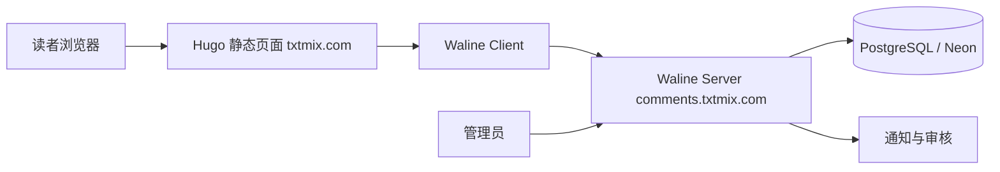

> 结论先行
>
> 如果 text-matrix 最终因为“非 GitHub 登录、匿名评论、需要更强审核和运营能力”而不使用 Giscus，那么 Waline 是最合适的第二阶段方案。
>
> 但 Waline 不是“改一个仓库名就能替换 Giscus”的方案。对当前仓库，正确的接法是：主站继续保持 Hugo 静态站，Waline 作为独立评论服务部署在站外域名，Hugo 只负责挂载客户端。

本文对应 [comment-system-architecture-design.md](./comment-system-architecture-design.md) 里的 Waline 路线，重点不是泛泛介绍 Waline，而是回答一个更具体的问题：如果 text-matrix 真的要上 Waline，应该怎样落地，哪些地方必须先改，哪些坑必须先避开。

## 1. 适用范围

这份文档适用于下面这类目标：

- 你希望评论者不必拥有 GitHub 账号。
- 你需要比 Giscus 更强的审核、通知和反垃圾能力。
- 你接受为了评论系统额外维护一个服务端和数据库。
- 你希望评论系统和主站源码仓库彻底解耦。

如果你的目标仍然是“运维最轻、几乎零后端、只接受 GitHub 登录”，那 Waline 不是第一选择，优先看 [comment-system-architecture-design.md](./comment-system-architecture-design.md) 里的 Giscus 方案。

## 2. 读完后你应该能完成什么

读完本文，你应该能完成下面几件事：

- 为 text-matrix 设计一套独立的 Waline 评论架构。
- 在 Vercel + PostgreSQL 或自托管 VPS 上把 Waline 服务端跑起来。
- 明确当前仓库里哪些文件需要改，哪些页面必须默认关闭评论。
- 理解 LoveIt 主题对 Waline 的真实支持边界，避免照抄官方文档后发现配置不生效。
- 在上线前补齐审核、隐私、通知和预览环境隔离这些工程边界。

## 3. 基于当前仓库的硬约束

先看结论，再看影响。

| 观察项 | 当前现状 | 实施影响 |
| ---- | ---- | ---- |
| 站点形态 | text-matrix 是 Hugo 静态站，主题为 LoveIt | 评论系统必须独立于主站服务端 |
| 模板调用 | [layouts/posts/single.html](../../layouts/posts/single.html) 与 [layouts/_default/single.html](../../layouts/_default/single.html) 都会调用评论 partial | 一旦全局开启评论，普通页面和文档页也可能出现评论 |
| 注入时机 | [themes/LoveIt/layouts/partials/init.html](../../themes/LoveIt/layouts/partials/init.html) 只在 `production` 环境注入评论配置 | 本地普通开发态默认看不到评论，验证必须用生产环境 |
| 主题集成 | [themes/LoveIt/layouts/partials/comment.html](../../themes/LoveIt/layouts/partials/comment.html) 对 Waline 只直接透传 `serverURL`、`lang`、`emoji` | 官方文档里的很多 Waline 客户端参数，直接写进 `hugo.toml` 不会自动生效 |
| 主题内置资源 | LoveIt 当前内置的是 Waline `2.6.1` 资源，而 Waline 官方文档已以 `v3` 为主 | 必须明确是走“最小改动路径”还是“自定义 partial 的完整版路径” |
| 全局配置现状 | 当前主站 `hugo.toml` 尚未启用评论配置 | 可以从零设计，改动面可控 |

这 6 个事实决定了一件事：

**Waline 在 text-matrix 上不是“能不能接”的问题，而是“要按哪条路径接”的问题。**

## 4. 推荐目标架构

推荐先把 Waline 看成一个独立评论域，而不是 Hugo 的一个小插件。



这个架构的关键点只有 4 个：

- 主站仍然是纯静态站，不承担评论写入。
- 评论服务端跑在独立域名，例如 `comments.txtmix.com`。
- 评论数据进入独立数据库，而不是主站仓库。
- Waline 管理后台与评论审核能力都留在评论域，不污染正文系统。

## 5. text-matrix 上的两条实施路径

### 5.1 路径 A：最小改动路径

这条路径直接使用 LoveIt 当前对 Waline 的内建集成，不改主题逻辑，只在 `hugo.toml` 里配置最基本参数。

优点：

- 改动最少。
- 可以最快验证 Waline 是否适合站点。
- 不需要立即维护主题覆盖文件。

缺点：

- 主题层只直接透传 `serverURL`、`lang`、`emoji`。
- 官方文档里常见的 `login`、`meta`、`requiredMeta`、`wordLimit`、`pageSize`、`locale`、`Turnstile` 等高级配置，不能指望只靠 `hugo.toml` 自动生效。
- 主题内置 Waline 客户端版本落后于官方当前主线文档，后续扩展空间有限。

适用场景：

- 你当前只想先验证 Waline 的基础评论闭环。
- 你接受先用默认能力上线，再决定要不要做完整版集成。

### 5.2 路径 B：完整版路径

这条路径会把主题里的评论 partial 覆盖到项目里，由项目自己决定要传给 Waline 哪些参数、使用哪个版本的客户端资源。

优点：

- 可以按 Waline 官方客户端 API 暴露更多能力。
- 可以切换到 Waline `v3` 的资源与能力模型。
- 可以把登录、审核提示、验证码、页面浏览量、评论数等能力做完整。

缺点：

- 你需要维护一个项目级的 `comment.html` 覆盖文件。
- 以后升级 LoveIt 时，要自己关注评论 partial 的兼容性。

适用场景：

- 你确认 Waline 会成为正式评论方案，而不只是实验方案。
- 你需要比“基础评论 + 后台审核”更完整的能力集。

### 5.3 对 text-matrix 的建议

如果你只是验证 Waline 是否值得替代 Giscus，先走路径 A。

如果你已经明确需要下面任一能力，建议直接走路径 B，不要先上线一个功能阉割版再回头补：

- 强制登录评论。
- Cloudflare Turnstile 或 reCAPTCHA。
- 更细的输入字段和字数限制。
- 页面浏览量、评论数、文章反应等衍生能力。
- 完整接入 Waline `v3` 客户端能力。

## 6. 服务端部署推荐

### 6.1 推荐路径：Vercel + Neon PostgreSQL

对 text-matrix 这种静态主站，最稳妥的 Waline 服务端路径是：

- Waline Server 部署在 Vercel。
- 数据库存储在 Neon PostgreSQL。
- 评论域名单独绑定到 `comments.txtmix.com`。

这样做的理由很直接：

- 主站已经是静态站，不需要把评论后端塞进主站部署链路。
- Vercel 的 Waline 模板路径成熟，初始化成本低。
- PostgreSQL 比 GitHub CSV 更稳，也比直接上 SQLite 更适合长期在线服务。
- 评论域和主域天然分离，后续替换或迁移成本更低。

### 6.2 不推荐作为首发主路径的方案

| 方案 | 不推荐原因 |
| ---- | ---- |
| GitHub 作为 Waline 存储 | 访问稳定性、性能和治理边界都不理想，不适合国内内容站长期使用 |
| 主站同机自带 SQLite 但无持久化备份 | 上手快，但恢复、迁移和备份边界太弱 |
| 把 Waline 后端和主站源码仓库强绑定 | 会把评论服务的运维、权限和发布链路和正文系统混在一起 |

## 7. Vercel + Neon 的落地步骤

### 7.1 准备域名与命名

建议统一采用下面的边界：

- 主站：`txtmix.com`
- 评论服务端：`comments.txtmix.com`
- 管理后台：`comments.txtmix.com/ui`

命名原则：

- 评论域名必须和主域分离，不要把 Waline 直接挂到主站根域或子路径。
- `comments` 这样的语义化子域名比随机前缀更利于后续维护。
- 以后如果你替换评论产品，只需要迁移 `comments.` 这条子域，而不是改正文站点。

### 7.2 部署 Waline 服务端

可以直接按 Waline 官方的 [Vercel 部署文档](https://waline.js.org/guide/deploy/vercel.html) 走一遍，但对 text-matrix 来说，建议在开始前先明确下面这几点：

1. Waline 是独立评论服务，不要部署进主站仓库。
2. 先拿到 Vercel 默认地址，确认服务跑通，再绑定自定义域名。
3. 只有数据库初始化完成之后，Waline 才算真正可用。

### 7.3 创建 PostgreSQL 数据库

Neon 初始化后，需要导入 Waline 官方提供的 PostgreSQL 建表 SQL：

- [waline.pgsql](https://github.com/walinejs/waline/blob/main/assets/waline.pgsql)

如果数据库没导入成功，你可能会看到服务能访问、后台能打开，但评论写入或读取失败。这不是前端问题，而是服务端数据层没有准备完毕。

### 7.4 建议的环境变量基线

下面是一套适合 text-matrix 的基线配置，重点不是逐项堆功能，而是先把安全边界和治理边界收住：

```dotenv
# Basic
SITE_NAME=Text Matrix
SITE_URL=https://txtmix.com
SERVER_URL=https://comments.txtmix.com

# Security
SECURE_DOMAINS=txtmix.com,comments.txtmix.com
JWT_TOKEN=<replace-with-strong-random-string>
IPQPS=60
COMMENT_AUDIT=true
DISABLE_REGION=true
DISABLE_USERAGENT=true

# PostgreSQL / Neon
PG_DB=<your_db_name>
PG_USER=<your_db_user>
PG_PASSWORD=<your_db_password>
PG_HOST=<your_db_host>
PG_PORT=5432
PG_SSL=true

# Notification
AUTHOR_EMAIL=<your_admin_email>
SMTP_SERVICE=<your_smtp_provider>
SMTP_USER=<your_smtp_user>
SMTP_PASS=<your_smtp_password>
SMTP_SECURE=true
```

推荐原因：

- `SECURE_DOMAINS` 必须同时包含主站域名和 Waline 服务端域名，否则安全校验容易出问题。
- `JWT_TOKEN` 是鉴权基础，必须是强随机字符串，不能偷懒。
- `COMMENT_AUDIT=true` 更适合作为 V1 默认值，先审后发能显著降低匿名垃圾评论风险。
- `DISABLE_REGION=true` 与 `DISABLE_USERAGENT=true` 更符合内容站的最小暴露原则。
- SMTP 先接上，至少保证新评论通知能送到站长。

### 7.5 首个管理员注册

部署完成后，访问：

- `https://comments.txtmix.com/ui/register`

Waline 的第一个注册用户会成为管理员。对 text-matrix 来说，这一步不要拖到上线后再做，应该在接入前就完成，并确认下面几件事：

- 管理员账户已成功创建。
- 可以登录管理后台。
- 可以审核、隐藏、删除评论。
- 邮件通知或你选用的通知通道已打通。

## 8. 自托管备选路径

如果你明确不想用 Vercel，也可以走 VPS 自托管。Waline 官方提供了 [独立部署文档](https://waline.js.org/guide/deploy/vps.html)。

最小 Docker Compose 示例可以长这样：

```yaml
version: '3'

services:
  waline:
    image: lizheming/waline:latest
    container_name: waline
    restart: always
    ports:
      - 8360:8360
    volumes:
      - ./data:/app/data
    environment:
      TZ: 'Asia/Shanghai'
      SITE_NAME: 'Text Matrix'
      SITE_URL: 'https://txtmix.com'
      SERVER_URL: 'https://comments.txtmix.com'
      SECURE_DOMAINS: 'txtmix.com,comments.txtmix.com'
      JWT_TOKEN: '<replace-with-strong-random-string>'
      SQLITE_PATH: '/app/data'
      SQLITE_DB: 'waline'
      COMMENT_AUDIT: 'true'
      IPQPS: '60'
      DISABLE_REGION: 'true'
      DISABLE_USERAGENT: 'true'
      AUTHOR_EMAIL: '<your_admin_email>'
```

这条路径的优点是完全自控，缺点也很直接：

- 你要自己维护容器、备份、反向代理、证书和监控。
- SQLite 适合小站起步，但长期看不如 PostgreSQL 稳。
- 如果只是为了评论功能，这条路径的运维成本明显高于 Vercel + Neon。

所以对 text-matrix，我只在下面两种情况下推荐自托管：

- 你明确希望评论数据与服务完全自管。
- 你已经有稳定的 VPS 运维基础设施。

## 9. text-matrix 的接入方式

### 9.1 最小改动版 `hugo.toml`

如果你先走路径 A，那么全站评论配置至少应该有下面这部分：

```toml
[params.page.comment]
  enable = true

  [params.page.comment.waline]
    enable = true
    serverURL = "https://comments.txtmix.com"
    lang = "zh-CN"
    emoji = [
      "//unpkg.com/@waline/emojis@1.1.0/weibo",
      "//unpkg.com/@waline/emojis@1.1.0/tieba"
    ]
```

这里必须明确一点：

**对当前仓库来说，把更多 Waline 选项写进 `hugo.toml`，并不意味着主题会自动把它们传给客户端。**

原因在于 [themes/LoveIt/layouts/partials/comment.html](../../themes/LoveIt/layouts/partials/comment.html) 当前只直接把下面几项合进 Waline 初始化对象：

- `el`
- `serverURL`
- `lang`
- `emoji`

所以最小改动版配置的目标应该很克制：

- 先让评论区正常挂载。
- 先让评论可发、可审、可删。
- 不要以为官方客户端所有高级参数都能直接照抄进当前主题。

### 9.2 完整版接入的正确做法

如果你需要 Waline 的完整客户端能力，建议直接做项目级覆盖：

1. 把 [themes/LoveIt/layouts/partials/comment.html](../../themes/LoveIt/layouts/partials/comment.html) 复制到项目下的 `layouts/partials/comment.html`。
2. 在项目级 partial 里扩展 Waline 配置对象，把你真正需要的参数透传进去。
3. 如果要切到 Waline `v3`，同时替换引用的客户端资源，而不是继续使用主题内置的 `2.6.1` 资源。

这条路径更稳，因为你不再受限于主题当前只暴露少数字段的实现方式。

对 text-matrix，我建议只有在下面需求出现时才做这一步：

- 强制登录评论。
- 接 Cloudflare Turnstile 或 reCAPTCHA。
- 自定义输入字段、字数限制、排序和本地化文本。
- 使用评论数、浏览量、文章反应等衍生能力。

## 10. 页面范围控制

这是 Waline 实施里最容易踩的第一个坑。

当前仓库的 [layouts/posts/single.html](../../layouts/posts/single.html) 和 [layouts/_default/single.html](../../layouts/_default/single.html) 都会调用评论 partial。如果你只在 `hugo.toml` 全局启用评论，而不限制页面范围，结果大概率是：

- `posts` 文章页会显示评论。
- `docs` 文档页也会显示评论。
- `about`、`contact`、`privacy-policy`、`search` 这类普通页面也可能出现评论。

### 10.1 推荐规则

对 text-matrix，推荐规则应该写死为：

- `posts` 默认显示评论。
- `docs` 默认不显示，只对白名单页面开放。
- `about`、`contact`、`privacy-policy`、`search` 永久关闭评论。

### 10.2 推荐实现方式

建议把 [layouts/_default/single.html](../../layouts/_default/single.html) 改成“按 section 或 front matter 决定是否渲染评论”，而不是无条件渲染。

逻辑上至少应满足下面这个判断：

```go-html-template
{{- $allowComment := or (eq .Section "posts") (eq .Params.comment true) -}}
{{- if and $allowComment (ne .Params.comment false) -}}
  {{- partial "comment.html" . -}}
{{- end -}}
```

同时，下面这些页面建议显式写死 front matter：

```yaml
comment: false
```

适用范围：

- `content/about.md`
- `content/contact.md`
- `content/privacy-policy.md`
- `content/search.md`

如果将来你想让少量文档页支持评论，再对白名单文档加：

```yaml
comment: true
```

## 11. 生产环境与 canonical 约束

这是 Waline 实施里最容易踩的第二个坑。

当前主题在 [themes/LoveIt/layouts/partials/init.html](../../themes/LoveIt/layouts/partials/init.html) 里，只会在 `production` 环境把评论配置注入页面上下文。这意味着：

- 普通 `hugo server` 开发态默认看不到评论。
- 本地预览时，如果没切到生产环境，不能据此判断 Waline 配置有问题。

但光有 `production` 还不够，对 text-matrix 还必须满足下面这条更严格的规则：

**只有 canonical 生产域名才应该真正开放评论。**

原因：

- 预览环境不是正式用户内容入口。
- Waline 默认按页面 path 组织评论线程，错误的预览入口会带来脏数据。
- 如果 GitHub Pages、Cloudflare Pages 预览和主域并存，最好只让最终生产域参与真实评论。

因此，推荐约束是：

- 本地开发默认不验证真实评论发送。
- 预览环境默认不开放正式评论。
- 只有 `txtmix.com` 正式域名用于创建和验证真实评论数据。

## 12. 隐私、审核与反垃圾基线

Waline 的价值不只是“让人能发评论”，而是它终于把审核和治理带进了静态站。

### 12.1 建议作为 V1 默认开启的能力

- `COMMENT_AUDIT=true`
- `IPQPS=60`
- `DISABLE_REGION=true`
- `DISABLE_USERAGENT=true`

这 4 项组合的效果是：

- 新评论默认进入审核流。
- 同一 IP 的灌水速度被限制。
- 评论区不额外暴露访客地理位置和 UA。

### 12.2 强制登录的取舍

Waline 支持账号体系，也支持强制登录评论。这能进一步减少伪造和匿名垃圾内容，但会提高评论门槛。

对 text-matrix，我建议这样看：

- 如果你希望评论转化优先，先不要在 V1 强制登录。
- 如果你发现匿名垃圾评论明显干扰运营，再进入“强制登录 + 验证码”阶段。

注意：如果你要上强制登录或 Turnstile，这基本意味着你已经进入路径 B，而不是只靠当前主题的最小集成。

### 12.3 通知方式

Waline 支持多种通知方式。对 text-matrix，V1 最实用的还是邮件通知，因为它最容易形成稳定闭环。

可选增强路径：

- SMTP 邮件通知。
- Telegram 通知。
- 飞书、Discord、企业微信等机器人通知。

具体环境变量可以参考：

- [Waline 评论通知文档](https://waline.js.org/guide/features/notification.html)
- [Waline 服务端环境变量文档](https://waline.js.org/reference/server/env.html)

## 13. 需要改动的仓库文件

如果以后真的把 Waline 方案落进当前仓库，优先关注下面这些文件。

| 文件 | 作用 | 为什么要改 |
| ---- | ---- | ---- |
| [hugo.toml](../../hugo.toml) | 全站评论默认配置 | 设置 Waline 的启用状态和服务端地址 |
| [layouts/_default/single.html](../../layouts/_default/single.html) | 默认单页评论范围控制 | 防止普通页面和文档页误出现评论 |
| [layouts/posts/single.html](../../layouts/posts/single.html) | 文章页评论入口 | 保证 `posts` 文章仍然默认支持评论 |
| [content/privacy-policy.md](../../content/privacy-policy.md) | 隐私与第三方说明 | 告知用户评论数据、第三方请求和身份体系 |
| `layouts/partials/comment.html` | 可选的项目级评论 partial 覆盖 | 只有走完整版路径时才需要 |
| `content/docs/**/*.md` | 文档页白名单控制 | 仅对确实需要讨论的文档页显式开启评论 |

## 14. 上线前验证清单

Waline 上线不要只看“页面上有没有评论框”，至少按下面顺序验证：

1. Waline 服务端域名可访问。
2. `comments.txtmix.com/ui/register` 可以完成首个管理员注册。
3. 文章页评论容器能渲染。
4. 能成功发布一条测试评论。
5. 审核流生效，未审核评论不会直接对外可见。
6. 第二篇文章会生成独立评论线程，而不是串到第一篇文章。
7. `about`、`contact`、`privacy-policy`、`search` 页面不出现评论。
8. 预览环境不会成为正式评论入口。
9. 通知渠道至少有一条能稳定收到新评论提醒。
10. 隐私政策已明确说明 Waline 服务端域名、评论数据处理方式和可能的身份登录机制。

## 15. 不建议的做法

下面这些做法对 text-matrix 都不稳：

- 只改 `hugo.toml` 开关，不做页面范围控制。
- 用当前主题内建的最小 Waline 接口，却期待官方 `v3` 的全部客户端能力。
- 让预览环境和正式环境共用真实评论入口。
- 把评论后端混进主站部署链路，而不是独立子域部署。
- 不开审核直接匿名放行，再寄希望于后面手工清垃圾。

## 16. 最终建议

如果 text-matrix 真要走 Waline，我的建议是：

1. 服务端优先用 `Vercel + Neon PostgreSQL + comments.txtmix.com`。
2. V1 默认开启审核，不把匿名直出作为默认策略。
3. 评论只对 `posts` 默认开放，`docs` 用白名单，普通页面永久关闭。
4. 如果只是先验证 Waline，可先走 LoveIt 的最小集成路径。
5. 一旦需要强制登录、验证码、评论数、浏览量或更完整的客户端能力，直接切到项目级 partial 覆盖，不要在主题的最小接口上做“配置幻觉”。

一句话总结：

**Waline 适合 text-matrix，但前提不是“把 Giscus 换成 Waline”，而是把评论真正升级成一个独立服务边界。**
