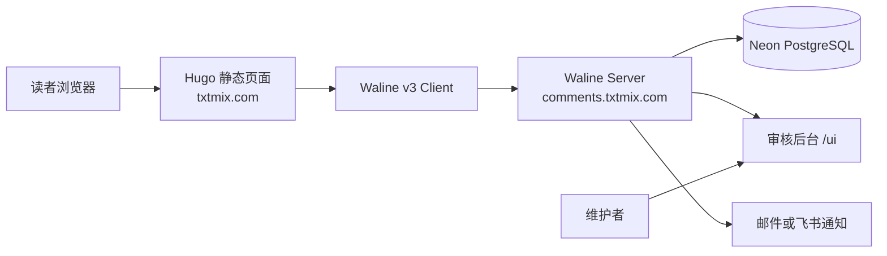

> 本文的生产结论：Text Matrix 应采用 `Waline v3 + Vercel + Neon PostgreSQL + comments.txtmix.com`。评论与回复由 Waline 处理；文章反应只作为非权威的轻量互动数据，不能用于排名、奖励或其他需要防刷的数据场景。Hugo 只渲染容器和经过固定、校验的 Waline v3 客户端。
>
> 不要把正式站建立在 LoveIt 内置的 Waline `2.6.1` 集成上。它只透传少量参数，且与 Waline v3 的客户端能力不匹配。正式方案使用项目级 `layouts/partials/comment.html` 覆盖文件，避免修改主题源码。

本文面向 Text Matrix 的维护者，给出从服务端、数据库和域名，到 Hugo 接入、审核、备份和发布验证的完整路径。Waline 可以同时提供评论和文章反应，但两者的安全边界不同：评论提交可使用 Turnstile、审核和限频，文章反应计数则没有同等级别的服务端防刷保证。

## 1. 适用范围与决策边界

选择 Waline 的前提是：希望读者无需 GitHub 账号即可评论，愿意维护一个独立评论服务，并且接受“匿名互动不可能严格证明一人一次”的事实。尤其是文章反应接口不受评论 Turnstile 和 `IPQPS` 的同等保护，攻击者可以直接调用接口改变计数；若业务要求可信点赞，应另建带验证码、限频和幂等约束的服务端接口。[Waline 1.41.5 文章计数服务端逻辑](https://github.com/walinejs/waline/blob/152f6fd71577dc4c2906950f54979d19da8045b1/packages/server/src/logic/article.js)

| 目标 | 本方案的处理方式 |
| --- | --- |
| 文章反应 | 使用 Waline 文章反应；默认显示在评论框上方，但视为可被操纵的非权威计数 |
| 评论与回复 | Waline v3 客户端与独立服务端 |
| 数据归属 | 独立 PostgreSQL 数据库，不写入 Hugo 仓库 |
| 反垃圾 | Turnstile、人工审核、服务端内容校验与边缘限频；审核开启时不依赖 Akismet |
| 生产隔离 | 仅生产构建渲染客户端；`SECURE_DOMAINS` 只作为来源过滤，不作为身份认证 |
| 可迁移性 | 数据库备份 + 保留稳定页面键；不依赖主题私有行为 |

这不是零运维方案。维护者仍要审核评论、关注服务异常、验证备份和按需升级 Waline。不过相比自建账户、审核后台和反垃圾 API，Waline 已把大部分评论业务收敛在成熟组件中。

如果只接受 GitHub 登录且互动数据可以公开，优先使用 [Giscus 方案](./comment-system-architecture-design.md)。如果只需要一个独立的匿名“有帮助”按钮，而不计划评论，Waline 的反应 UI 可能过重，应另做专用点赞组件。

## 2. 本仓库的实际约束

| 观察项 | 当前现状 | 实施含义 |
| --- | --- | --- |
| 站点形态 | Hugo 静态站，主题为 LoveIt | 评论读写必须由独立服务承担 |
| 评论调用点 | `layouts/posts/single.html`、`layouts/_default/single.html` 与 `layouts/topic/single.html` 都会调用 `comment.html` | 页面范围必须在 partial 内集中控制 |
| 主题内建集成 | LoveIt 只把 `serverURL`、`lang`、`emoji` 传给 Waline | `hugo.toml` 里堆 Waline v3 参数不会生效 |
| 主题资源 | 内建 CDN 资源为 Waline `2.6.1` | 正式站需由项目加载 Waline v3 |
| 构建环境 | Cloudflare Pages 主分支为 `production`；预览为 `preview`；GitHub Pages 镜像为 `github-pages` | 正式评论只能在 `production` 渲染 |
| 当前配置 | 根 `hugo.toml` 尚未启用评论 | 可以从零接入，不必兼容旧评论数据 |

LoveIt 在非 `production` 环境不会把主题评论配置写进页面上下文，因此正常的本地构建不会加载正式评论客户端。但这不是服务端安全边界：Waline 会自动把 `localhost` 和 `127.0.0.1` 加入 `SECURE_DOMAINS`，而且来源检查依赖可伪造的 `Referer` 或 `Origin`。本地只做样式和构建验证；真实写入测试放在受控生产测试文章中，服务端再由 Turnstile、内容校验和边缘限频保护。[Waline 服务端配置](https://waline.js.org/en/reference/server/config.html)

## 3. 推荐架构


```mermaid
flowchart LR
    A[读者浏览器] --> B[Hugo 静态页面<br/>txtmix.com]
    B --> C[Waline v3 Client]
    C --> D[Waline Server<br/>comments.txtmix.com]
    D --> E[(Neon PostgreSQL)]
    D --> F[审核后台 /ui]
    D --> G[邮件或飞书通知]
    H[维护者] --> F
```

边界要保持清楚：

- `txtmix.com` 只发布正文和加载客户端，不保存评论密钥或数据库凭据。
- `comments.txtmix.com` 只负责 Waline API 与管理后台，不承载 Hugo 页面。
- 数据库、Vercel、SMTP 密钥都只能保存在对应服务的加密变量中，不能提交到仓库。
- 评论服务不可用时，正文仍能正常阅读；评论区显示失败不应阻断文章。

## 4. 先完成服务端与数据库

### 4.1 创建受保护的独立 Waline 服务

按 [Waline 的 Vercel 部署文档](https://waline.js.org/en/guide/deploy/vercel.html) 从官方模板创建一个独立项目。不要把该服务放进 `text-matrix` 仓库，也不要让它复用主站部署。在服务端仓库的 `package.json` 中固定 `@waline/vercel` 的精确版本并提交 lockfile；本文校验时的基线为 `1.41.5`，它已包含 `1.41.1` 修复的认证漏洞，禁止回退到受影响的 `1.40.3` 或更早版本。[GHSA-jf75-q64q-g65r](https://github.com/walinejs/waline/security/advisories/GHSA-jf75-q64q-g65r)

`1.41.3` 起不能只更新依赖版本：保留当前模板的 `index.cjs`，并同步采用与版本匹配的 `vercel.json`。`1.41.5` 对应模板包含 `NODE_OPTIONS=--experimental-require-module`、`index.cjs` rewrite 和额外运行时文件；漏掉这些设置可能导致 Vercel Function 启动失败。[1.41.5 对应的 vercel.json](https://github.com/walinejs/waline/blob/152f6fd71577dc4c2906950f54979d19da8045b1/example/vercel.json) 实施前仍应复核发布说明和安全公告，再记录最终采用的版本与模板提交。

首位注册用户会直接成为管理员，因此第一次部署不能裸奔等待人工注册。优先在 Vercel 开启 Deployment Protection；若当前套餐不支持，则先通过受控代理限制整个服务，只允许维护者访问。完成数据库、环境变量和管理员注册后，再解除保护。不要把“默认域名难以猜到”当作保护措施。

### 4.2 创建 Neon PostgreSQL 并导入表结构

在 Vercel Storage 中关联 Neon，或直接创建一个独立 Neon 项目。然后在 Neon SQL Editor 执行与服务端 `1.41.5` 同一已核验提交的 [PostgreSQL 建表脚本](https://github.com/walinejs/waline/blob/152f6fd71577dc4c2906950f54979d19da8045b1/assets/waline.pgsql)。不要把固定版本服务端和 `main` 分支上可能已经变化的数据库脚本混用。

建表和结构升级使用独立的数据库 owner；Waline 运行账户只授予目标 schema 的连接、使用、表级 `SELECT/INSERT/UPDATE/DELETE` 和所需 sequence 权限，不授予创建角色、创建数据库或管理其他 schema 的权限。建表后，在 Vercel 为 Waline 项目配置数据库变量并重新部署。Waline 的 PostgreSQL 变量为 `PG_DB`、`PG_USER`、`PG_PASSWORD`、`PG_HOST`、`PG_PORT` 与 `PG_SSL`；端口必须采用 Neon 提供的实际值，不要凭经验填写。[Waline 服务端变量参考](https://waline.js.org/reference/server/env.html)

### 4.3 绑定独立域名

在管理员初始化完成后，再在 Vercel 项目中添加 `comments.txtmix.com`，并按 Vercel 给出的值设置 DNS 记录。域名生效后，以下地址都必须能访问：

```text
https://comments.txtmix.com/
https://comments.txtmix.com/ui/register
```

解除部署保护前必须完成以下动作：

1. 在 `/ui/register` 创建首位管理员并确认其角色确为 `administrator`。
2. 设置唯一强密码；若当前 Waline 后台提供 2FA，则立即启用。
3. 为 Vercel、Neon、DNS 和备份存储账户启用 MFA，并限制团队成员权限。
4. 保存紧急停用流程：关闭 `params.waline.enabled`、回滚上一个 Vercel 部署并轮换 `JWT_TOKEN`。

对 `/ui/**` 增加 Cloudflare Access 或同类访问控制可以减少后台暴露面，但它不能单独保护共用的 `/api/**`；Waline 管理员凭据和 2FA 仍是必要防线。

## 5. 生产环境变量基线

以下是 Vercel 生产环境的最小安全基线；尖括号中的内容只应出现在 Vercel 的加密变量中。`JWT_TOKEN` 可用 `openssl rand -hex 32` 生成，不要复用数据库或其他服务密码。

```dotenv
# Basic
SITE_NAME=Text Matrix
SITE_URL=https://txtmix.com
SERVER_URL=https://comments.txtmix.com

# Security and privacy
SECURE_DOMAINS=txtmix.com,comments.txtmix.com
JWT_TOKEN=<64-hex-characters>
IPQPS=60
COMMENT_AUDIT=true
DISABLE_REGION=true
DISABLE_USERAGENT=true
AKISMET_KEY=false

# PostgreSQL / Neon
PG_DB=<database-name>
PG_USER=<database-user>
PG_PASSWORD=<database-password>
PG_HOST=<database-host>
PG_PORT=<database-port>
PG_SSL=true

# Turnstile: site key is public and goes to Hugo config; secret stays here
TURNSTILE_KEY=<turnstile-site-key>
TURNSTILE_SECRET=<turnstile-secret>

# Notification example: implicit TLS on port 465
AUTHOR_EMAIL=<maintainer-email>
SMTP_HOST=<smtp-host>
SMTP_PORT=465
SMTP_USER=<smtp-user>
SMTP_PASS=<smtp-password-or-app-password>
SMTP_SECURE=true
SENDER_NAME=Text Matrix
SENDER_EMAIL=<sender-email>
```

配置说明：

- `SECURE_DOMAINS` 填域名，不带 `https://`；必须同时包含正文域名和 Waline 服务域名。它只检查请求携带的来源信息，且 Waline 自动允许 `localhost` 和 `127.0.0.1`，不能替代验证码、认证或限频。
- `IPQPS=60` 表示同一 IP 的评论提交间隔至少 60 秒，不是“每秒 60 次请求”。
- `COMMENT_AUDIT=true` 会让新评论先进入审核；前端必须提示读者“评论审核后显示”。
- `DISABLE_REGION` 与 `DISABLE_USERAGENT` 防止评论区展示访客地区与浏览器信息，不等于数据库完全不处理网络请求信息。
- Waline 当前只在评论初始状态为 `approved` 时调用 Akismet。`COMMENT_AUDIT=true` 会把评论直接设为 `waiting`，因此 V1 明确设置 `AKISMET_KEY=false`，依赖 Turnstile、服务端校验和人工审核，不制造“Akismet 已保护待审评论”的错觉。将来关闭全量审核时，再申请并验证自己的 Akismet key。[Waline 1.41.5 评论保存逻辑](https://github.com/walinejs/waline/blob/152f6fd71577dc4c2906950f54979d19da8045b1/packages/server/src/controller/comment.js)
- Turnstile 必须同时配置客户端 `turnstileKey` 和服务端 `TURNSTILE_SECRET`；只有前端 site key 不构成防护。[Waline 客户端属性](https://waline.js.org/reference/client/props.html)
- 在 Cloudflare Turnstile 控制台把正式 widget 的允许主机名限定为 `txtmix.com`；预览和本地测试使用 Cloudflare 官方测试 key，不把生产 widget 放宽到 `pages.dev` 或 `localhost`。
- SMTP 的 TLS 设置必须与服务商端口一致：465 通常使用 `SMTP_SECURE=true`；587/STARTTLS 通常使用 `SMTP_SECURE=false`。若使用 Waline 支持列表中的服务商，可用 `SMTP_SERVICE` 替代 `SMTP_HOST` 与 `SMTP_PORT`，不要同时堆两套互相矛盾的参数。

V1 建议允许匿名提交但要求昵称，邮箱保持可选：这比强制账户更容易获得真实反馈。若垃圾评论变多，再同时把客户端 `login` 与服务端 `LOGIN` 改为 `force`；只改其中一侧不会形成完整的强制登录策略。

### 5.1 在服务端强制执行评论约束

客户端的 `requiredMeta`、`wordLimit` 和 `imageUploader` 只约束正常浏览器 UI，不能阻止直接调用 API；Waline 服务端默认只要求评论路径和正文为字符串。正式服务必须在服务端仓库的 `index.cjs` 中通过 `preSave` hook 再校验一次。下面的示例要求昵称为 1–50 个 Unicode 码点、正文为 1–1000 个码点且不超过 4 KiB，并拒绝 Base64 图片。[Waline 1.41.5 评论服务端校验逻辑](https://github.com/walinejs/waline/blob/152f6fd71577dc4c2906950f54979d19da8045b1/packages/server/src/logic/comment.js) [Waline preSave 配置](https://waline.js.org/en/reference/server/config.html#presave-comment)

```js
const Waline = require('@waline/vercel');

module.exports = Waline({
  preSave(comment) {
    if (typeof comment.nick !== 'string' || typeof comment.comment !== 'string') {
      return { errmsg: '昵称和评论必须是字符串。' };
    }

    const nick = comment.nick.trim();
    const body = comment.comment.trim();
    const nickLength = Array.from(nick).length;
    const bodyLength = Array.from(body).length;

    if (nickLength < 1 || nickLength > 50) {
      return { errmsg: '昵称长度必须为 1–50 个字符。' };
    }
    if (bodyLength < 1 || bodyLength > 1000) {
      return { errmsg: '评论长度必须为 1–1000 个字符。' };
    }
    if (Buffer.byteLength(body, 'utf8') > 4 * 1024) {
      return { errmsg: '评论内容过大。' };
    }
    if (/\bdata:image\//iu.test(body)) {
      return { errmsg: '不允许提交 Base64 图片。' };
    }
  },
});
```

这段 hook 要和服务端仓库一起纳入测试和版本控制。它能保护存储内容，但请求体已经到达应用，因此还要在 Vercel Firewall 或经过验证的 Cloudflare 代理层，对 `POST /api/comment` 设置请求速率和请求体大小限制。`POST /api/article` 是文章反应接口，也应设置边缘限频，但即便如此，反应计数仍不是可信的一人一票数据。

## 6. 推荐的 Hugo 接入：项目级 Waline v3 partial

### 6.1 不使用 LoveIt 的 Waline 配置段

不要在根 `hugo.toml` 中启用 `[params.page.comment.waline]`。否则主题会尝试加载旧的 Waline 集成，而项目级 Waline v3 初始化又会再执行一次。

改为在根 `hugo.toml` 添加只供项目 partial 使用的公开配置：

```toml
[params.waline]
  enabled = true
  serverURL = "https://comments.txtmix.com"
  turnstileKey = "<public-turnstile-site-key>"
  reaction = true
```

`turnstileKey` 是可公开的站点密钥；`TURNSTILE_SECRET`、数据库变量、SMTP 密码和 `JWT_TOKEN` 不得写入此文件。`reaction` 是紧急开关：发生刷量或不再接受非权威计数时，将它改为 `false` 并重新部署主站。

### 6.2 固定并托管客户端资源

生产代码不能引用浮动的 `@v3` CDN 地址。本文校验时采用 `@waline/client@3.15.2`；实施时先核对发布说明，再用精确版本安装，把分发文件和许可证复制进 Hugo 资源目录并提交 `package-lock.json`：

```bash
npm install --save-exact @waline/client@3.15.2
mkdir -p assets/lib/waline-v3
cp node_modules/@waline/client/dist/waline.css assets/lib/waline-v3/waline.css
cp node_modules/@waline/client/dist/waline.js assets/lib/waline-v3/waline.js
cp node_modules/@waline/client/LICENSE assets/lib/waline-v3/LICENSE
```

不要提交 `node_modules`。升级时一次只改一个精确版本，重新复制三项文件，执行生产构建和端到端验收后再发布。Hugo 会为本地资源生成内容指纹，运行时不再依赖 unpkg，也不需要为动态远程模块放宽 CSP。

### 6.3 创建覆盖文件

新建 `layouts/partials/comment.html`。Hugo 会优先使用项目同路径文件，因此无需修改 `themes/LoveIt`。下面的实现使用同源、指纹化资源，并完成页面范围控制、生产环境隔离、稳定页面键、深色模式、审核提示、延迟初始化和加载失败重试。生产构建缺少服务地址、Turnstile key 或客户端资源时会直接失败，而不是静默发布残缺评论区。

```go-html-template
{{- $waline := .Site.Params.waline | default dict -}}
{{- $enabled := eq .Section "posts" -}}
{{- if eq .Params.comment true -}}
  {{- $enabled = true -}}
{{- end -}}
{{- if eq .Params.comment false -}}
  {{- $enabled = false -}}
{{- end -}}

{{- if and $waline.enabled $enabled (eq hugo.Environment "production") -}}
  {{- if not $waline.serverURL -}}{{- errorf "params.waline.serverURL is required" -}}{{- end -}}
  {{- if not $waline.turnstileKey -}}{{- errorf "params.waline.turnstileKey is required" -}}{{- end -}}
  {{- $path := .Params.walinePath | default .RelPermalink -}}
  {{- $fingerprint := .Scratch.Get "fingerprint" -}}
  {{- $walineCSS := resources.Get "lib/waline-v3/waline.css" -}}
  {{- $walineJS := resources.Get "lib/waline-v3/waline.js" -}}
  {{- if not $walineCSS -}}{{- errorf "missing assets/lib/waline-v3/waline.css" -}}{{- end -}}
  {{- if not $walineJS -}}{{- errorf "missing assets/lib/waline-v3/waline.js" -}}{{- end -}}
  {{- with $fingerprint -}}
    {{- $walineCSS = $walineCSS | fingerprint . -}}
    {{- $walineJS = $walineJS | fingerprint . -}}
  {{- end -}}

  <section id="comments" class="comments" data-pagefind-ignore="all" aria-label="文章评论">
    <p class="comments-notice">评论将在审核后显示。</p>
    <p id="waline-status" role="status" aria-live="polite">评论区将在滚动到附近时加载。</p>
    <button id="waline-retry" type="button" hidden>重新加载评论区</button>
    <div id="waline"></div>
  </section>

  <link rel="stylesheet" href="{{ $walineCSS.RelPermalink }}"{{ with $walineCSS.Data.Integrity }} integrity="{{ . }}" crossorigin="anonymous"{{ end }}>
  <script type="module">
    const mount = document.getElementById('waline');
    const status = document.getElementById('waline-status');
    const retry = document.getElementById('waline-retry');
    const clientURL = {{ $walineJS.RelPermalink | jsonify | safeJS }};
    let booting = false;

    const boot = async () => {
      if (booting) return;
      booting = true;
      status.textContent = '正在加载评论区…';
      retry.hidden = true;

      try {
        const { init } = await import(clientURL);
        init({
          el: '#waline',
          serverURL: {{ $waline.serverURL | jsonify | safeJS }},
          path: {{ $path | jsonify | safeJS }},
          lang: 'zh-CN',
          dark: 'body[theme="dark"]',
          login: 'disable',
          meta: ['nick', 'mail'],
          requiredMeta: ['nick'],
          wordLimit: [1, 1000],
          pageSize: 20,
          commentSorting: 'oldest',
          imageUploader: false,
          reaction: {{ ($waline.reaction | default false) | jsonify | safeJS }},
          turnstileKey: {{ $waline.turnstileKey | jsonify | safeJS }},
        });
        status.hidden = true;
      } catch (error) {
        console.error('Waline failed to load', error);
        booting = false;
        status.hidden = false;
        status.textContent = '评论区暂时无法加载，正文阅读不受影响。';
        retry.hidden = false;
      }
    };

    retry.addEventListener('click', boot);

    if ('IntersectionObserver' in window) {
      const observer = new IntersectionObserver((entries) => {
        if (!entries.some((entry) => entry.isIntersecting)) return;
        observer.disconnect();
        boot();
      }, { rootMargin: '600px 0px' });
      observer.observe(mount);
    } else {
      boot();
    }
  </script>
{{- end -}}
```

客户端选项仍然只是交互约束；真正的昵称、正文长度和 Base64 图片限制由第 5.1 节的服务端 `preSave` hook 执行。当前站点和这段模板都包含内联脚本；若将来启用严格 CSP，必须把 nonce 或逐构建 hash 纳入整个 Hugo 站点的脚本策略，同时允许 `connect-src https://comments.txtmix.com` 和 Turnstile 官方要求的脚本、frame 与连接来源。不要只为评论区临时加入无限制的 `script-src *`、`unsafe-inline` 或 `unsafe-eval`。

### 6.4 页面范围与页面键

上述 partial 的规则是：

- `content/posts/**` 默认显示评论与文章反应。
- 其他页面默认关闭。
- 非文章页面只有显式 `comment: true` 才显示。
- 任意页面写 `comment: false` 都能关闭评论。
- 非 `production` 构建一律不输出评论组件。

Waline 用 `path` 区分文章线程和文章反应；该值必须唯一且稳定。默认使用 Hugo 的 `.RelPermalink`。改标题、摘要、标签不会改变它；如果必须改文章 URL，在该文章 front matter 保留旧键：

```yaml
walinePath: "/posts/old-slug/"
```

不要在上线后随意改变 `walinePath`、删除末尾斜杠或调整反应顺序。Waline 的反应按位置计数，路径或顺序变化会让历史数据看起来像新线程或新反应。[Waline 文章反应说明](https://waline.js.org/en/guide/features/reaction.html)

### 6.5 为什么不用“最小主题集成”作为生产路径

LoveIt 内置 partial 只组装 `el`、`serverURL`、`lang` 和 `emoji`。它不会自动传递 `path`、`dark`、`requiredMeta`、`wordLimit`、`imageUploader`、`reaction`、`turnstileKey` 等 Waline v3 参数。

最小集成仍可用于临时验证“服务端是否响应”，但不能验证本文的安全、审核、反应和稳定页面键要求。正式接入请只保留项目级 partial 一条路径。

## 7. 审核、隐私和反垃圾策略

| 场景 | V1 策略 | 升级条件 |
| --- | --- | --- |
| 新评论 | 全部待审核 | 审核工作量稳定且垃圾极少时，才评估自动放行 |
| 频率 | `IPQPS=60` + 边缘请求限频 | 被刷时同时调整应用层间隔和边缘规则 |
| 验证码 | 评论提交强制 Turnstile | 无法提交时先检查 key、secret、域名和 CSP，不得只删除服务端 secret |
| 身份 | 不强制登录，昵称必填，邮箱可选 | 冒名、垃圾或争议持续发生时改为强制登录 |
| 评论内容 | 客户端提示 + 服务端 `preSave` 强制限制 1–1000 字并拒绝 Base64 图片 | 需要图片时接入独立对象存储，并在服务端校验类型、大小和目标域名 |
| 文章反应 | 可开启，但视为非权威计数；对写接口做边缘限频 | 需要可信计数时迁移到独立的防刷接口 |
| 隐私展示 | 不向普通访客显示地区和 User-Agent；数据库仍会处理 IP、UA 等请求信息 | 数据处理目的、保留期或服务商变化时重新审查 |

Waline 会在服务端清理危险 HTML、为链接添加安全属性，并提供评论频率限制、相似内容拦截和审核能力；这些是基础防线，不覆盖文章反应，也不替代 Turnstile、服务端业务校验、边缘限频和维护者审核。[Waline 安全文档](https://waline.js.org/en/guide/features/safety.html)

在开放任何评论入口前更新 [content/privacy-policy.md](../../content/privacy-policy.md)，至少准确说明：

- 评论数据由 Vercel 上的 `comments.txtmix.com` 处理，并存入 Neon PostgreSQL。
- 发布评论时会处理昵称、可选邮箱、评论正文、时间、IP 地址和 User-Agent；`DISABLE_REGION` 与 `DISABLE_USERAGENT` 只控制公开展示，不停止服务端处理和数据库存储。
- Cloudflare Turnstile 会处理验证请求；SMTP 服务会处理通知邮件；若头像功能请求外部头像服务，也要列明相应服务商。
- 未审核评论默认不公开；文章反应计数不用于识别身份，也不保证一人一次。
- 明确数据用途、正常数据与备份的保留期、删除请求渠道，以及删除操作何时从轮换备份中自然淘汰。
- 读者可通过联系页面请求访问、更正或删除自己的评论和关联邮箱；无法可靠验证匿名请求归属时，要说明需要提供哪些证明信息。

## 8. 通知、备份与维护

### 8.1 通知

先配置一条可稳定送达的 SMTP 通道，分别验证普通新评论、待审核评论和回复通知。发件域应配置 SPF、DKIM 和 DMARC，并使用专用 app password；不要使用维护者邮箱的主密码。Waline 也支持飞书、Telegram、Discord 等通知，这些可以作为冗余告警，但不能取代对 SMTP 失败日志的监控。[Waline 通知文档](https://waline.js.org/en/guide/features/notification.html)

### 8.2 备份

Neon 的恢复能力不能替代独立备份。V1 目标为 RPO 不超过 24 小时、RTO 不超过 4 小时：每天导出一次 PostgreSQL，保留最近 7 个日备份、4 个周备份和 12 个每月备份。备份必须在离开受控主机前加密，并上传到与 Neon、Vercel 不同故障域的私有对象存储；不要放进 Hugo 仓库、公开 GitHub 仓库或 Vercel 构建产物。

在具备 `pg_dump` 和 `age` 的受控备份环境中，先创建权限为 `0600` 的 PostgreSQL password file，并通过 `WALINE_PGPASSFILE` 指向它。下面的脚本先生成临时自定义格式备份，验证目录可读，再加密并计算校验和：

```bash
set -eu
umask 077

backup_stamp=$(date -u +%Y-%m-%dT%H%M%SZ)
plain_dump=$(mktemp "${TMPDIR:-/tmp}/waline-${backup_stamp}.XXXXXX.dump")
encrypted_dump="waline-${backup_stamp}.dump.age"
trap 'rm -f "$plain_dump"' EXIT HUP INT TERM

PGPASSFILE="$WALINE_PGPASSFILE" pg_dump \
  --host="$WALINE_PG_HOST" \
  --port="$WALINE_PG_PORT" \
  --username="$WALINE_PG_USER" \
  --dbname="$WALINE_PG_DB" \
  --format=custom \
  --no-acl \
  --no-owner \
  --file="$plain_dump"

pg_restore --list "$plain_dump" >/dev/null
age --recipient "$WALINE_BACKUP_AGE_RECIPIENT" \
  --output "$encrypted_dump" \
  "$plain_dump"
shasum -a 256 "$encrypted_dump" >"${encrypted_dump}.sha256"
```

脚本成功后，上传 `.age` 和 `.sha256` 两个文件，再按保留策略清理旧的加密备份。解密私钥必须存放在备份存储之外，至少准备一份离线恢复副本。

每季度在新建的隔离数据库中执行恢复演练。先验证下载文件的 SHA-256，再执行：

```bash
set -eu
umask 077

backup_file=${1:?usage: restore-waline.sh WALINE_BACKUP_FILE}
restore_dump=$(mktemp "${TMPDIR:-/tmp}/waline-restore.XXXXXX.dump")
trap 'rm -f "$restore_dump"' EXIT HUP INT TERM

shasum -a 256 -c "${backup_file}.sha256"
age --decrypt \
  --identity "$WALINE_BACKUP_AGE_IDENTITY_FILE" \
  --output "$restore_dump" \
  "$backup_file"

PGPASSFILE="$WALINE_RESTORE_PGPASSFILE" pg_restore \
  --exit-on-error \
  --no-acl \
  --no-owner \
  --host="$WALINE_RESTORE_PG_HOST" \
  --port="$WALINE_RESTORE_PG_PORT" \
  --username="$WALINE_RESTORE_PG_USER" \
  --dbname="$WALINE_RESTORE_PG_DB" \
  "$restore_dump"
```

`.age` 与 `.sha256` 文件必须保持脚本生成时的原始文件名并放在同一目录。`WALINE_RESTORE_PG_DB` 必须是隔离环境中新建的空数据库。恢复后检查 Waline 表数量、管理员能否登录、测试文章评论和反应是否存在，并记录实际恢复耗时。备份脚本、存储位置、密钥责任人、保留期和最近一次恢复结果应写入私有运维文档。

### 8.3 维护节奏

本文在 2026-08-26 核验的版本基线如下。它不是“自动追最新版”指令；实际部署版本必须以服务端仓库 lockfile、Hugo 仓库 `package-lock.json` 和本表三处一致为准。

| 组件 | 已核验版本 |
| --- | --- |
| `@waline/client` | `3.15.2` |
| `@waline/vercel` | `1.41.5` |
| Hugo | `0.161.1` |

升级任一组件时同步更新本表和 front matter 的 `lastmod`，并重新执行第 9.1 节全部验收；不要只改文档中的数字而不更新 lockfile 和资源文件。

| 周期 | 动作 |
| --- | --- |
| 每天 | 自动备份并验证任务成功；失败立即告警 |
| 每周 | 审核待处理评论；发送一次通知探针；检查 Vercel 错误率与 Neon 用量 |
| 每月 | 核对备份保留策略、管理员和基础设施成员权限、Turnstile 与边缘限频命中情况 |
| 每季度 | 恢复演练；检查 Waline v3 发布说明和依赖升级 |
| 每次 URL 迁移 | 为文章保留旧 `walinePath`，确认测试评论仍在原线程 |

### 8.4 监控、停用与回滚

至少配置三类告警：Waline 服务连续不可用或 5xx 增长、Neon 存储或连接数接近配额、每日备份或 SMTP 探针失败。健康检查以只读请求为主，不要由监控任务自动发布评论或增加文章反应。

每次升级同时记录客户端版本、服务端版本、数据库变更和上一个可用 Vercel deployment。回滚顺序为：先将 `params.waline.enabled=false` 或 `params.waline.reaction=false` 停止前端入口，再回滚 Waline 服务端 deployment；只有确认升级改坏了数据结构时才从备份恢复数据库。数据库恢复是最后手段，不能用来替代普通代码回滚。

## 9. 发布步骤与验收

按以下顺序执行，避免把未审核的匿名评论入口直接暴露到生产：

1. 创建受 Deployment Protection 或受控代理保护的 Waline 服务，固定 `@waline/vercel` 版本并提交 lockfile。
2. 创建 Neon 数据库、导入表结构、配置最小权限的运行账户和生产环境变量。
3. 在保护仍开启时注册首位管理员，核验角色、强密码和 2FA，再绑定 `comments.txtmix.com`。
4. 在 Waline 服务端加入第 5.1 节的 `preSave` 校验，为评论和文章反应写接口配置边缘限频。
5. 在更新后的隐私政策已经发布、每日加密备份任务和 SMTP 告警已经启用后，再开放服务端公网访问。
6. 将固定版本的 Waline v3 客户端及许可证复制到 Hugo 资源目录，添加 `params.waline` 和项目级 `layouts/partials/comment.html`。
7. 先只发布一篇受控测试文章。在页面源代码和网络面板确认只加载一次同源、带内容指纹的 Waline CSS 与 JS；正文必须在评论服务故障时照常可读。
8. 完成下面的正常、失败与绕过测试；全部通过后再为所有 `posts` 开启评论。
9. 检查 `about`、`contact`、`privacy-policy`、搜索页、`topic` 页面、Cloudflare Preview 和 GitHub Pages 镜像均不输出评论组件。
10. 修改测试文章标题后复查同一线程；模拟 URL 迁移并用 `walinePath` 验证旧评论与反应仍存在。

### 9.1 必须通过的验收矩阵

| 类别 | 操作 | 预期结果 |
| --- | --- | --- |
| 正常评论 | 昵称 + 1–1000 字正文 + 有效 Turnstile | 提交成功、状态为待审核、管理员收到通知 |
| 审核 | 管理员批准待审评论 | 评论随后公开；回复通知按预期发送 |
| 验证码 | 缺失、无效、重复使用 Turnstile token | 服务端拒绝，不写入数据库 |
| 内容绕过 | 直接调用 API，提交非字符串/空昵称、1001 字、超过 4 KiB 或 Base64 图片 | `preSave` 拒绝，不写入数据库 |
| 来源过滤 | 缺失、错误及伪造的 `Origin`/`Referer`，以及 `localhost` 来源 | 记录实际行为；不得把 `SECURE_DOMAINS` 的结果误判为认证保证 |
| 限频 | 同一 IP 连续发评论并高频调用文章反应接口 | 评论触发 `IPQPS`；边缘规则限制两个写接口 |
| 审核与 Akismet | `COMMENT_AUDIT=true` 下提交典型垃圾文本 | 进入待审核；确认未把 Akismet 写成已执行的防线 |
| 文章反应 | 添加、取消、刷新，并直接调用接口改变计数 | UI 正常；同时确认计数可被操纵且未用于可信业务 |
| 稳定页面键 | 改标题、改 URL 并保留旧 `walinePath` | 仍读取同一评论线程与反应计数 |
| 故障降级 | 阻断客户端资源或评论服务 | 显示失败提示和重试按钮，正文及站点导航正常 |
| 通知 | 新评论、待审评论、回复、SMTP 认证失败 | 成功场景送达；失败场景在日志或监控中告警 |
| 恢复 | 从最近的加密备份恢复到空数据库 | 表、管理员、测试评论和反应完整，RTO 不超过 4 小时 |

建议执行的仓库检查：

```bash
npm run validate:frontmatter
npm run build
CF_PAGES_URL=https://txtmix.com \
  CF_PAGES_BRANCH=main \
  npm run build:cloudflare-pages
```

`npm run build` 已显式使用 `production` 环境，能覆盖 Waline partial 的生产分支。Cloudflare Pages 命令必须同时给出 `CF_PAGES_URL` 和 `CF_PAGES_BRANCH=main`；若省略主分支变量，脚本会按 `preview` 构建，不能证明生产评论组件已被输出。构建完成后，在 `public` 中确认生产文章存在一次 Waline 初始化，而非文章页和镜像环境不存在。

## 10. 常见故障

| 现象 | 优先检查 |
| --- | --- |
| 生产构建失败并提示缺少 Waline 资源 | 是否完成第 6.2 节的精确版本安装与资源复制；`assets/lib/waline-v3` 是否完整 |
| 页面没有评论区 | 构建环境是否为 `production`；`.Section` 是否为 `posts`；是否被 `comment: false` 覆盖；`params.waline.enabled` 是否为 `true` |
| 页面出现两个评论框 | 是否同时启用了 `params.page.comment.waline` 与项目级 partial；必须移除前者 |
| 评论区显示加载失败 | 检查同源指纹化 JS 是否为 200、浏览器控制台、CSP 和构建产物；不要临时改回浮动 CDN |
| 评论提交被拒绝 | `SECURE_DOMAINS` 是否包含两个无协议域名；Turnstile 的客户端 key 与服务端 secret 是否匹配；`preSave` 返回了什么错误 |
| 发布后不可见 | `COMMENT_AUDIT=true` 时需在 `/ui` 审核通过 |
| 待审垃圾评论没有被 Akismet 标记 | 这是 `COMMENT_AUDIT=true` 下的预期行为；V1 依赖 Turnstile、服务端校验和人工审核 |
| 昵称、长度限制在直接 API 请求中失效 | 服务端是否真正部署了第 5.1 节的 `preSave` hook，而不只是配置了客户端选项 |
| 文章反应被刷 | 立即把 `params.waline.reaction` 改为 `false`；检查边缘限频；不要把现有计数用于排名 |
| 两篇文章串评论 | `path` 或 `walinePath` 重复；检查 `.RelPermalink` 与 URL 迁移 |
| 改 URL 后评论消失 | 在 front matter 设置旧的 `walinePath`，不要让新 URL 成为新线程 |
| 深色模式不匹配 | 确认页面仍使用 `body[theme="dark"]`；主题改造时同步更新 `dark` 选择器 |
| 预览站出现正式评论 | 检查构建是否误用了 `production`；Cloudflare Preview 应维持 `preview` 环境 |

## 11. 不建议的做法

- 把数据库密码、`JWT_TOKEN`、SMTP 密码或 Turnstile secret 写进 `hugo.toml`、前端脚本或仓库。
- 同时使用 LoveIt 内建 Waline 和项目级 Waline v3 初始化。
- 在生产代码中使用 `@v3`、`latest` 或未提交 lockfile 的浮动依赖。
- 把 `requiredMeta`、`wordLimit`、`imageUploader`、`SECURE_DOMAINS` 当作不可绕过的服务端安全边界。
- 把 Waline 文章反应称为“一人一票”点赞，或用于排名、奖励和风控。
- 让预览、GitHub Pages 镜像和生产域名共用正式评论入口。
- 关闭审核后再依赖人工清理垃圾评论。
- 把文章路径、反应数组的顺序当作可随意调整的展示配置。
- 仅依赖 Neon 的恢复窗口，或把未加密的 `pg_dump` 上传到远端。

## 12. 最终建议

Text Matrix 的 Waline 首发应是：`精确固定的 Waline v3 + Vercel + Neon PostgreSQL + comments.txtmix.com + 服务端 preSave 校验 + Turnstile + 边缘限频 + 项目级 Hugo partial`。

V1 保持克制：评论仅覆盖文章页，图片上传关闭，匿名评论经过 Turnstile、服务端校验和人工审核后显示；SMTP、每日加密备份与恢复流程都在上线前验证。文章反应可以作为装饰性的轻量反馈开启，但必须明确其计数可被操纵，并保留一键关闭能力。后续若需要可信点赞、强制登录、富媒体或评论数展示，应在各自安全边界内扩展，而不是修改主题源码或把客户端 UI 当成服务端防线。
