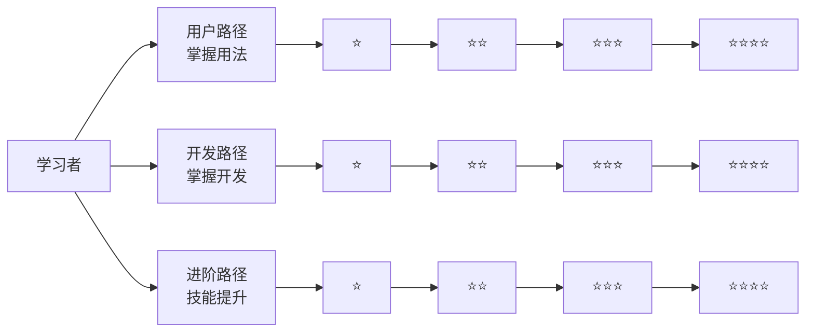
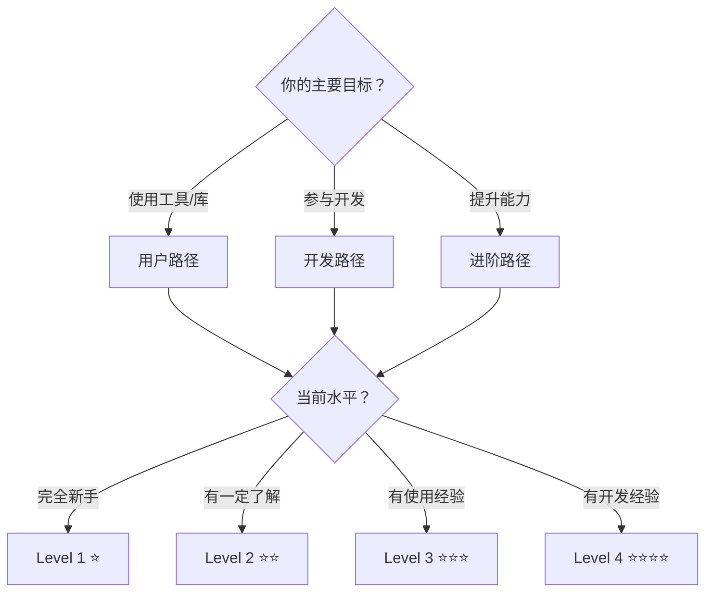
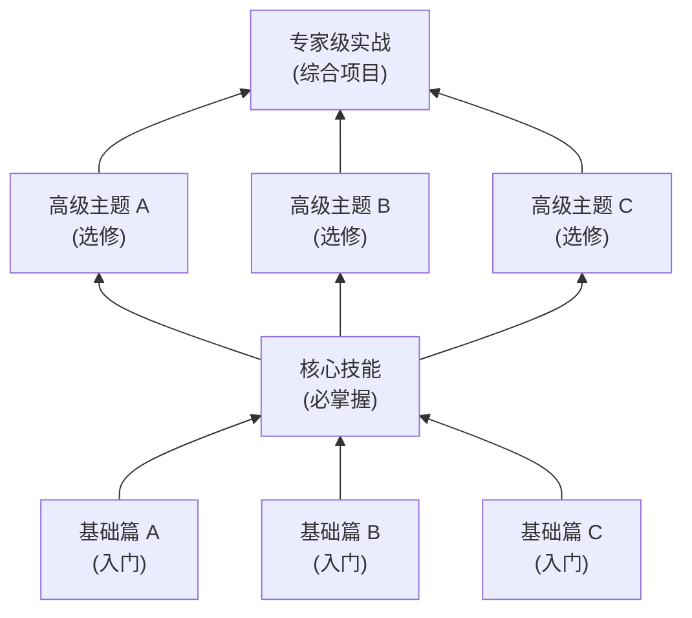

# 三条学习路径完整指南

本文档详细描述了三条并行的学习路径，帮助不同目标的学习者找到适合自己的学习方向。

---

## 概述

我们设计了**三条并行的学习路径**，每条路径都有独立的进阶体系，满足不同目标的学习者：



---

## 路径一：用户路径（从新手用户到专家用户）⭐

**目标人群**：只想使用工具/库的人  
**核心问题**："这个怎么用？"  
**学习重点**：功能用法、配置选项、使用场景、常见问题

### 四级进阶体系

| 级别 | 定位 | 学习目标 | 验证标准 |
|-----|-----|---------|---------|
| **Level 1** ⭐ | 入门 | 成功运行第一个示例 | 能完成基础任务 |
| **Level 2** ⭐⭐ | 核心 | 理解主要概念和常规用法 | 能解决 80% 常规问题 |
| **Level 3** ⭐⭐⭐ | 进阶 | 掌握高级特性和复杂场景 | 能处理复杂需求 |
| **Level 4** ⭐⭐⭐⭐ | 专家 | 能够排查问题和优化 | 能独立解决所有使用场景 |

### 文档结构

```text
docs/user-guide/
├── level1-basics/        # 基础用法 ⭐
│   ├── 01-installation.md
│   ├── 02-quickstart.md
│   ├── 03-first-example.md
│   └── exercises/
├── level2-core/          # 核心功能 ⭐⭐
│   ├── 01-core-concepts.md
│   ├── 02-common-usage.md
│   ├── 03-configuration.md
│   └── exercises/
├── level3-advanced/      # 高级特性 ⭐⭐⭐
│   ├── 01-advanced-features.md
│   ├── 02-performance-tuning.md
│   ├── 03-integration.md
│   └── exercises/
└── level4-expert/        # 专家技巧 ⭐⭐⭐⭐
    ├── 01-troubleshooting.md
    ├── 02-best-practices.md
    ├── 03-edge-cases.md
    └── exercises/
```

---

## 路径二：开发路径（从新手开发者到核心贡献者）⭐

**目标人群**：想参与开发或二次开发的人  
**核心问题**："这个怎么实现的？"  
**学习重点**：代码结构、贡献流程、架构理解、开发规范

### 四级进阶体系

| 级别 | 定位 | 学习目标 | 验证标准 |
|-----|-----|---------|---------|
| **Level 1** ⭐ | 入门 | 搭建开发环境，成功运行测试 | 能本地启动项目 |
| **Level 2** ⭐⭐ | 核心 | 理解代码结构和架构设计 | 能读懂主要模块代码 |
| **Level 3** ⭐⭐⭐ | 进阶 | 能够贡献代码和修复 Bug | 能提交 PR 并被合并 |
| **Level 4** ⭐⭐⭐⭐ | 专家 | 能够维护项目和发布版本 | 能独立维护项目 |

### 文档结构

```text
docs/developer-guide/
├── level1-setup/         # 环境搭建 ⭐
│   ├── 01-dev-environment.md
│   ├── 02-build-from-source.md
│   ├── 03-running-tests.md
│   └── exercises/
├── level2-architecture/  # 架构理解 ⭐⭐
│   ├── 01-project-structure.md
│   ├── 02-code-organization.md
│   ├── 03-key-modules.md
│   └── exercises/
├── level3-contribution/  # 贡献代码 ⭐⭐⭐
│   ├── 01-contribution-guide.md
│   ├── 02-coding-standards.md
│   ├── 03-testing-guide.md
│   └── exercises/
└── level4-maintain/      # 维护项目 ⭐⭐⭐⭐
    ├── 01-release-process.md
    ├── 02-deprecation-policy.md
    ├── 03-community-management.md
    └── exercises/
```

---

## 路径三：进阶路径（从会用代码到精通架构）⭐

**目标人群**：想提升技术能力的人  
**核心问题**："为什么这样设计？"  
**学习重点**：设计原理、架构模式、性能优化、创新实践

### 四级进阶体系

| 级别 | 定位 | 学习目标 | 验证标准 |
|-----|-----|---------|---------|
| **Level 1** ⭐ | 入门 | 掌握基本设计模式 | 能识别和应用常见模式 |
| **Level 2** ⭐⭐ | 核心 | 理解设计原则和架构思想 | 能做出合理的设计决策 |
| **Level 3** ⭐⭐⭐ | 进阶 | 掌握性能优化和源码分析 | 能优化复杂系统性能 |
| **Level 4** ⭐⭐⭐⭐ | 专家 | 能够架构设计和创新 | 能设计新系统并解决复杂问题 |

### 文档结构

```text
docs/mastery-guide/
├── level1-patterns/      # 设计模式 ⭐
│   ├── 01-creational-patterns.md
│   ├── 02-structural-patterns.md
│   ├── 03-behavioral-patterns.md
│   └── exercises/
├── level2-principles/    # 设计原则 ⭐⭐
│   ├── 01-solid-principles.md
│   ├── 02-design-heuristics.md
│   ├── 03-architecture-styles.md
│   └── exercises/
├── level3-optimization/  # 性能优化 ⭐⭐⭐
│   ├── 01-performance-analysis.md
│   ├── 02-source-code-reading.md
│   ├── 03-advanced-techniques.md
│   └── exercises/
└── level4-innovation/    # 创新实践 ⭐⭐⭐⭐
    ├── 01-architecture-design.md
    ├── 02-research-methods.md
    ├── 03-innovation-practice.md
    └── exercises/
```

---

## 路径选择指南

### 如何选择适合自己的路径？



### 路径之间的关系

- **并行关系**：三条路径可以并行学习，互不依赖
- **交叉关系**：某些知识点可能出现在多条路径中
- **进阶关系**：完成一条路径后，可以开始另一条路径

---

## 技能树设计



---

## 进阶路径

### 初级 → 中级

**时间**：2-3 个月  
**目标**：能够独立完成日常工作

**必备技能**：
- [ ] 掌握核心概念和基本 API（应用程序接口）
- [ ] 能够阅读和理解他人代码
- [ ] 能够解决常见问题
- [ ] 写出自测文档的代码

**推荐资源**：
- 本教程基础章节
- 官方示例项目
- 练习题库

**评估标准**：
- 能够在一周内独立完成一个新功能
- 能够读懂并修改他人代码
- 能够定位和修复简单 bug

---

### 中级 → 高级

**时间**：6-12 个月  
**目标**：能够解决复杂问题

**必备技能**：
- [ ] 深入理解原理和设计思想
- [ ] 能够设计系统架构
- [ ] 能够优化性能问题
- [ ] 能够指导初中级开发者

**推荐资源**：
- 本教程高级章节
- 技术书籍和论文
- 开源项目贡献

**评估标准**：
- 能够独立设计和实现中等复杂度系统
- 能够定位和解决生产环境问题
- 能够进行技术分享和代码评审

---

### 高级 → 专家

**时间**：2-3 年  
**目标**：能够制定技术方向

**必备技能**：
- [ ] 深刻理解技术本质和演进趋势
- [ ] 能够制定技术规范和最佳实践
- [ ] 能够解决跨领域复杂问题
- [ ] 能够培养和带领团队

**推荐资源**：
- 行业会议和技术博客
- 经典书籍（重读、常读常新）
- 技术社区参与

**评估标准**：
- 团队遇到疑难问题会向你求助
- 你写的代码/文档成为团队参考标准
- 你能预判技术趋势并提前布局

