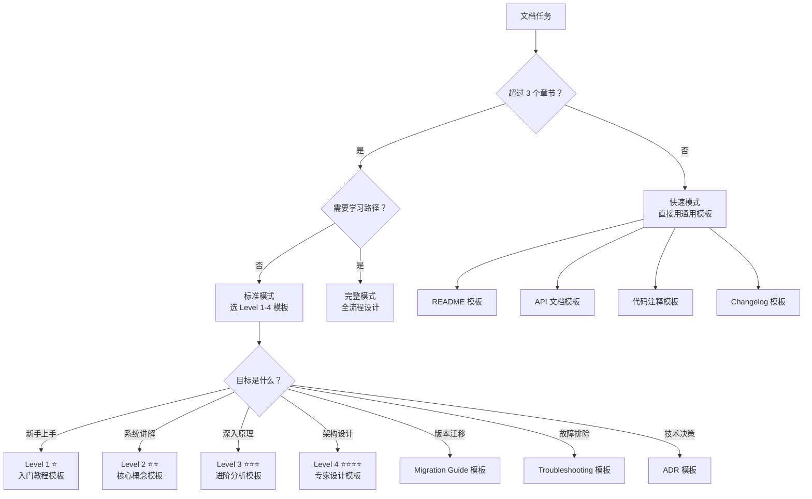
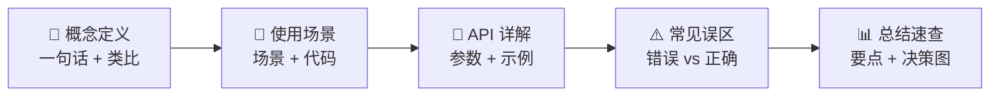
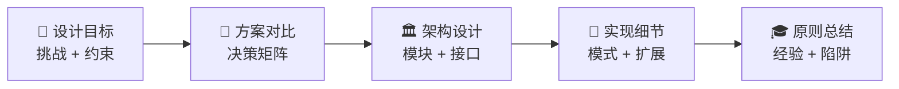
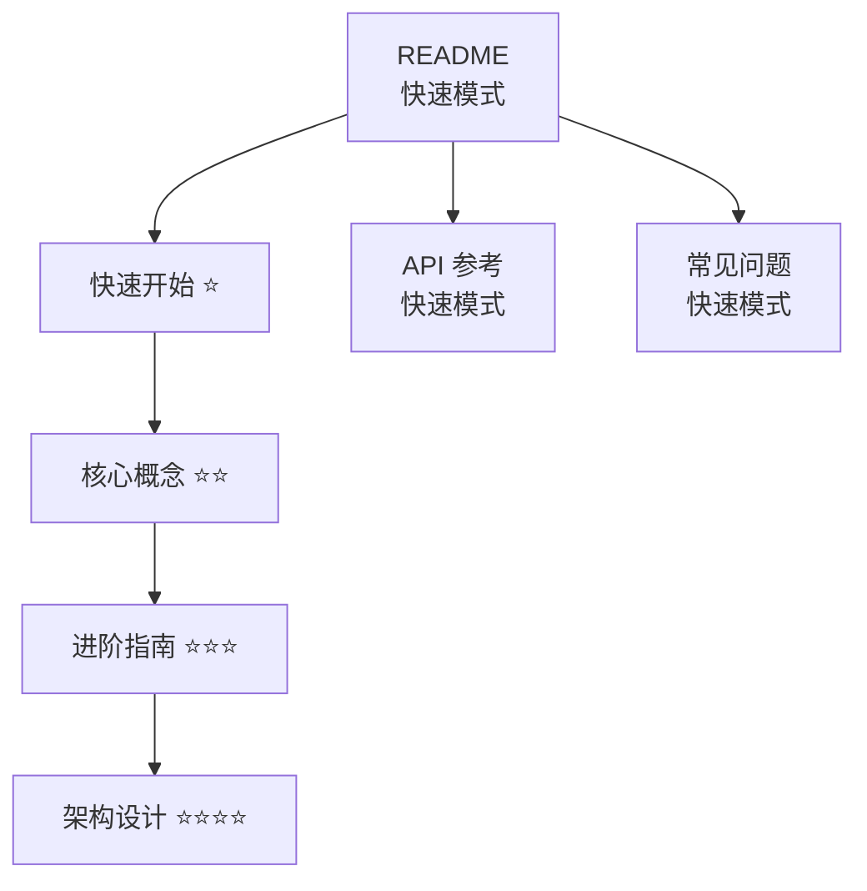

# 文档模板库

> **模板选择决策**：参见 SKILL.md §1.2 的命令执行流程，按场景和级别选择。



---

## 通用结构约定

所有 Level 1-4 模板共享以下结构元素：

### 文档元数据头（Frontmatter）

```yaml
---
难度：⭐ / ⭐⭐ / ⭐⭐⭐ / ⭐⭐⭐⭐
类型：入门教程 / 核心概念 / 进阶分析 / 专家设计
预计时间：XX 分钟
前置知识：
  - [文档名](link) 难度标记
后续推荐：
  - [文档名](link) 难度标记
学习路径：
  - 用户路径：第 X 阶段
  - 开发路径：第 X 阶段
---
```

### 文档页脚

```markdown
---
**文档元信息**
难度：⭐⭐ | 类型：核心概念 | 更新日期：YYYY-MM-DD | 预计阅读时间：XX 分钟
```

---

## 快速模式模板

### README 模板

```markdown
# 项目名称

[](链接)
[](链接)

一句话简介，说明项目核心功能。

## ✨ 特性

- **特性一**：详细说明
- **特性二**：详细说明

## 📦 安装

### 前置条件

- Python 3.8+
- Git

### 安装步骤

‌```bash
git clone https://github.com/username/project-name.git
cd project-name
pip install -r requirements.txt
‌```

## 🚀 快速开始

‌```python
from project_name import main
result = main.run()
print(result)
‌```

## 📖 文档

- [快速开始](docs/quickstart.md)
- [API 参考](docs/api.md)
- [常见问题](docs/faq.md)

## 🔧 配置

创建 `.env` 文件：

‌```env
API_KEY=your-api-key
SERVER_URL=http://localhost:8080
‌```

## 🧪 测试

‌```bash
pytest
pytest --cov=project_name
‌```

## 🤝 贡献

1. Fork 本仓库
2. 创建特性分支 (`git checkout -b feature/AmazingFeature`)
3. 提交更改 (`git commit -m 'Add AmazingFeature'`)
4. 推送到分支 (`git push origin feature/AmazingFeature`)
5. 开启 Pull Request

## 📄 许可证

本项目采用 MIT 许可证 - 查看 [LICENSE](LICENSE)
```

### API（应用程序接口）文档模板

```markdown
# API 参考

> 更新时间：YYYY-MM-DD | 版本：v1.0

## 概述

一句话说明 API 的核心功能。

### 基础 URL

‌```
https://api.example.com/v1
‌```

### 认证

‌```
Authorization: Bearer YOUR_API_KEY
‌```

---

## [资源名称] 接口

### 获取 [资源]

**Endpoint**：`GET /resources/:id`

**路径参数**：

| 参数 | 类型 | 必填 | 说明 |
| ------ | ------ | ------ | ------ |
| id | string | 是 | 资源 ID |

**查询参数**：

| 参数 | 类型 | 必填 | 默认值 | 说明 |
| ------ | ------ | ------ | -------- | ------ |
| page | int | 否 | 1 | 页码 |
| limit | int | 否 | 20 | 每页数量 |

**成功响应** `200 OK`：

‌```json
{
  "id": "123",
  "name": "示例",
  "created_at": "2024-01-01T00:00:00Z"
}
‌```

**错误响应**：

| 状态码 | 错误码 | 说明 |
| -------- | -------- | ------ |
| 400 | INVALID_PARAM | 请求参数错误 |
| 401 | UNAUTHORIZED | 未认证 |
| 404 | NOT_FOUND | 资源不存在 |
| 500 | INTERNAL_ERROR | 服务器内部错误 |
```

### 代码注释模板

#### Python

```python
def function_name(
    param1: Type1,
    param2: Type2,
    optional: Type3 = default
) -> ReturnType:
    """
    一句话描述函数功能。

    详细说明函数的作用、使用场景和实现细节。

    Args:
        param1: 参数说明，包括类型、取值范围
        param2: 参数说明
        optional: 可选参数说明，默认值为 default

    Returns:
        返回值说明

    Raises:
        ExceptionType: 抛出条件

    Example:
        >>> result = function_name("input", 123)
        >>> print(result)
        'expected output'
    """
```

#### Bash

```bash
#!/bin/bash
# =============================================================================
# 脚本名称：script.sh
# 功能描述：一句话说明
# 使用方法：./script.sh [--option]
# =============================================================================

set -euo pipefail
```

---

## Level 1 模板：入门教程 ⭐

**定位**：消除恐惧，建立信心
**认知模式**：模仿 → 执行
**使命**：让学习者成功运行第一个示例

### Level 1 独有结构


### Level 1 模板

```markdown
# [主题名称] ⭐ 入门指南

> **目标读者**：第一次接触此功能的新手
> **预计时间**：15-30 分钟
> **前置要求**：无 / [具体前置知识链接]

---

## 🎯 本节目标

完成本教程后，你将能够：
- [ ] 成功运行第一个 [功能/示例]
- [ ] 理解 [核心概念] 的基本含义
- [ ] 独立完成 [基础任务]

---

## 📋 准备工作

### 环境检查清单
- [ ] 已安装 [软件/依赖] 版本 X.X+
- [ ] 已配置 [必要配置项]

### 快速验证
‌```bash
# 运行此命令验证环境
[验证命令]
# 预期输出
[预期输出]
‌```

---

## 🚀 步骤指南

### 步骤 1：[具体操作]（预计 5 分钟）

**做什么**：[一句话说明目的]

‌```[语言]
[完整可运行代码]
‌```

**代码解释**：
- `[关键代码]` - [作用]

### ✅ 验证点 1
运行后应看到：
‌```
[确切的预期输出]
‌```

### 步骤 2：[具体操作]（预计 10 分钟）
[同上格式...]

---

## 🎉 完成验证

### 你学到了什么
1. **[概念 1]**：[一句话总结]
2. **[概念 2]**：[一句话总结]

---

## ❓ 常见问题

### Q1: [最常见的问题]
**A**: [简洁回答]

---

## 🔄 故障排除

1. **检查环境**：`[诊断命令]`
2. **查看日志**：错误信息在 `[位置]`
3. **对比代码**：与 [完整示例链接] 对比

---

## 📚 下一步

| 推荐内容 | 难度 | 说明 |
| --------- | ------ | ------ |
| [核心概念详解](link) | ⭐⭐ | 深入理解 |
| [实践项目](link) | ⭐⭐ | 动手练习 |
```

---

## Level 2 模板：核心概念 ⭐⭐

**定位**：建立知识体系
**认知模式**：理解 → 应用
**使命**：系统掌握核心概念和常规用法

### Level 2 独有结构



### Level 2 模板

```markdown
# [概念名称] ⭐⭐ 核心概念

> **目标读者**：已完成入门教程，想系统掌握的使用者
> **核心问题**：这是什么？什么时候用？怎么用最好？

---

## 📝 概念定义

### 一句话定义
**[概念名称]** 是 [简洁定义，不超过 50 字]。

### 类比理解
> 💡 就像 [类比物]，[概念名称] [类比解释]。

### 为什么需要它
[解决什么问题，与替代方案的区别]

---

## 🎯 使用场景

### 场景 1：[典型场景]
**问题**：[描述]
**解决方案**：
‌```[语言]
[代码示例]
‌```

**最佳实践**：
- ✅ [建议]
- ❌ [反例]

### 场景对比表

| 场景 | 使用方式 | 注意事项 | 性能影响 |
| ------ | ---------- | ---------- | ---------- |
| A | [用法] | [注意点] | [影响] |
| B | [用法] | [注意点] | [影响] |

---

## 🔧 API / 配置详解

### `[参数/方法名]`

| 属性 | 类型 | 必填 | 默认值 | 说明 |
| ------ | ------ | ------ | -------- | ------ |
| param1 | string | 是 | - | [说明] |

---

## ⚠️ 常见误区

### 误区 1：[错误认知]
**错误理解**：[描述]
**正确理解**：[纠正]

‌```[语言]
# ❌ 错误
[错误代码]

# ✅ 正确
[正确代码]
‌```

---

## 🔗 知识关联

- **前置**：[概念 A](link) ⭐
- **相关**：[概念 B](link) ⭐⭐
- **进阶**：[概念 C](link) ⭐⭐⭐

---

## 📊 总结速查

### 核心要点
1. [要点 1]
2. [要点 2]

### 快速参考
‌```[语言]
# 用法 1：基础用法
[代码]
# 用法 2：常见配置
[代码]
‌```
```

---

## Level 3 模板：进阶分析 ⭐⭐⭐

**定位**：培养深度思考
**认知模式**：分析 → 优化
**使命**：深入原理，掌握高级特性和复杂场景

### Level 3 独有结构


### Level 3 模板

```markdown
# [高级主题] ⭐⭐⭐ 进阶分析

> **目标读者**：已掌握核心概念，想深入原理的开发者
> **核心问题**：为什么这样设计？内部如何工作？如何优化？

---

## 🎓 问题背景

### 简单方案的局限
用 Level 2 的知识，我们会这样解决：
‌```[语言]
[简单但不够好的方案]
‌```

**存在的问题**：
1. [问题 1]
2. [问题 2]

---

## 🔬 原理深度剖析

### 整体架构
‌```mermaid
graph TD
    A[输入] --> B[模块 1]
    B --> C[模块 2]
    C --> D[输出]
‌```

### 源码解析
‌```[语言]
[关键源码片段]
‌```
**逐行解析**：
- 第 X 行：[作用]
- 第 Y 行：[设计意图]

---

## 🛠️ 高级用法

### 用法 1：[高级场景]
‌```[语言]
[完整代码]
‌```

**可能遇到的问题**：
- **问题**：[描述] → **解决**：[方案]

---

## ⚡ 性能分析

| 操作 | 时间复杂度 | 空间复杂度 |
| ------ | ----------- | ----------- |
| 操作 A | O(n) | O(1) |

### 优化建议
**优化前**：[数据] → **优化后**：[数据] → **提升**：X%

---

## 🏗️ 实战案例

### 需求分析
- 功能需求：[列表]
- 约束条件：[列表]

### 完整实现
‌```[语言]
[生产级代码]
‌```

### 方案评估
- **优点**：[列表]
- **缺点**：[列表]
```

---

## Level 4 模板：专家设计 ⭐⭐⭐⭐

**定位**：激发创新能力
**认知模式**：创造 → 设计
**使命**：培养架构设计能力和技术决策能力

### Level 4 独有结构



### Level 4 模板

```markdown
# [架构主题] ⭐⭐⭐⭐ 专家设计

> **目标读者**：想掌握系统设计能力的开发者
> **核心问题**：如何设计更好的系统？如何权衡方案？

---

## 🎯 设计目标与挑战

### 核心挑战

| 挑战 | 描述 | 约束条件 |
| ------ | ------ | ---------- |
| 挑战 1 | [描述] | [约束] |

### 设计目标
- **功能性**：[列表]
- **非功能性**：性能 [指标] / 可扩展性 [要求] / 可维护性 [要求]

---

## 🧠 方案设计与决策

### 方案对比

| 评估维度 | 权重 | 方案 A | 方案 B | 方案 C |
| ---------- | ------ | -------- | -------- | -------- |
| 性能 | 30% | 8/10 | 6/10 | 9/10 |
| 复杂度 | 20% | 7/10 | 9/10 | 5/10 |
| 可维护性 | 25% | 6/10 | 8/10 | 7/10 |
| 可扩展性 | 25% | 7/10 | 7/10 | 8/10 |
| **加权总分** | | **6.95** | **7.40** | **7.35** |

### 最终决策
**选择方案**：[方案 X]
**Trade-off**：牺牲 [什么] 换取 [什么]

---

## 🏛️ 架构设计

### 整体架构
‌```mermaid
graph TD
    Client --> Gateway
    Gateway --> ServiceA
    Gateway --> ServiceB
    ServiceA --> DB[(Database)]
    ServiceB --> Cache[(Redis)]
‌```

### 核心模块

#### 模块 1：[名称]
**职责**：[单一职责描述]
**设计决策**：
- 选项 A → 不选：[原因]
- 选项 B → 选择：[原因]

---

## 🔧 设计模式应用

| 模式 | 应用场景 | 解决的问题 |
| ------ | ---------- | ----------- |
| [模式 A] | [场景] | [问题] |

---

## 🚀 扩展性设计

### 扩展点 1：[能力]
**当前**：[描述] → **扩展方式**：[方法]

---

## 🎓 设计原则总结

### 可复用的经验
1. [经验 1]
2. [经验 2]

### 常见陷阱
- **陷阱 1**：[描述] → **避免**：[方法]
```

---

## 模板组合示例

一个完整项目文档体系通常组合使用多个模板：



---

## Changelog / Release Notes 模板

> **适用场景**：版本发布说明、更新日志。按语义化版本组织，清晰传达每次发布的变更内容。

````markdown
# 更新日志

本项目遵循[语义化版本](https://semver.org/lang/zh-CN/)规范。

## [未发布]

### 新增
- 

### 变更
- 

### 修复
- 

## [X.Y.Z] - YYYY-MM-DD

### 🚀 新增（Added）

- **[模块名]**：新增功能描述（#Issue编号）

### ♻️ 变更（Changed）

- **[模块名]**：变更内容描述
  - **破坏性变更**：如有不兼容改动，必须醒目标注
  - **迁移方法**：`旧用法` → `新用法`

### 🐛 修复（Fixed）

- **[模块名]**：修复的问题描述（#Issue编号）

### 🗑️ 废弃（Deprecated）

- `废弃的API/功能`：替代方案说明，计划移除版本

### ❌ 移除（Removed）

- `被移除的API/功能`：原因和替代方案

### 🔒 安全（Security）

- 修复了 [漏洞描述]，影响版本范围

---

**完整变更记录**：[X.Y.Z...HEAD](仓库对比链接)

**升级前请阅读**：[迁移指南](链接)（如有破坏性变更）
````

### Changelog 编写规范

| 规则 | 说明 |
| ------ | ------ |
| 版本倒序 | 最新版本在最上方 |
| 日期格式 | `YYYY-MM-DD`，ISO 8601 格式 |
| 分类顺序 | Added → Changed → Fixed → Deprecated → Removed → Security |
| 破坏性变更 | 用 `⚠️ 破坏性变更` 醒目标注，附迁移说明 |
| 关联 Issue | 每条变更后附 `(#123)` 链接 |
| 面向用户 | 写用户能理解的变更，不写内部重构细节 |

---

## Migration Guide 模板

> **适用场景**：大版本升级指南、API 迁移指引。帮助用户从旧版本平滑过渡到新版本。

````markdown
# 从 vX 迁移到 vY

> **预计耗时**：约 N 分钟（小型项目） / N 小时（大型项目）
>
> **影响范围**：[列出受影响的模块/功能]

## 概览

| 项目 | 说明 |
| ------ | ------ |
| **当前版本** | vX.x.x |
| **目标版本** | vY.0.0 |
| **破坏性变更数** | N 项 |
| **新增功能** | N 项 |
| **废弃功能** | N 项 |

## 前置条件

- [ ] 备份当前项目
- [ ] 确认 Node.js 版本 ≥ XX
- [ ] 阅读 [vY 发布说明](链接)

## 自动迁移

如果项目提供了迁移工具（codemod），优先使用：

```bash
npx @project/migrate@latest
```

## 手动迁移步骤

### 步骤 1：更新依赖

```bash
npm install package@^Y.0.0
```

### 步骤 2：[破坏性变更名称]

**变更说明**：描述具体改了什么、为什么改。

**之前（vX）**：

```typescript
// 旧的写法
oldFunction(param);
```

**之后（vY）**：

```typescript
// 新的写法
newFunction(param, options);
```

**搜索替换正则**（可选）：

```
查找：oldFunction\(([^)]+)\)
替换：newFunction($1, {})
```

### 步骤 3：[下一个破坏性变更]

（重复上述格式）

## 验证清单

- [ ] 项目能正常构建
- [ ] 所有测试通过
- [ ] 关键功能手动验证

## 常见问题

### Q：遇到 `ErrorXXX` 怎么办？

A：这通常是因为...，解决方法是...

## 回退方案

如果迁移后发现严重问题：

```bash
npm install package@^X.0.0
```
````

### Migration Guide 编写规范

| 规则 | 说明 |
| ------ | ------ |
| 预估时间 | 必须给出迁移预估耗时 |
| 前后对比 | 每个破坏性变更必须给出「之前/之后」代码对比 |
| 可验证 | 每步完成后有验证方法 |
| 回退方案 | 必须提供回退/降级方案 |
| 自动化优先 | 有 codemod 的优先推荐自动迁移 |

---

## Troubleshooting Guide 模板

> **适用场景**：故障排除手册、常见问题排查指南。按「症状 → 原因 → 解决」结构组织。

````markdown
# [项目名] 故障排除指南

> 本指南收集了最常见的问题和解决方案。
>
> 如果本指南未覆盖您的问题，请[提交 Issue](链接)。

## 快速诊断

按照以下步骤快速定位问题类别：

```
问题发生在哪个阶段？
├── 安装阶段 → 参见「安装问题」
├── 配置阶段 → 参见「配置问题」
├── 运行阶段
│   ├── 启动失败 → 参见「启动问题」
│   ├── 运行中报错 → 参见「运行时问题」
│   └── 性能异常 → 参见「性能问题」
└── 部署阶段 → 参见「部署问题」
```

## 安装问题

### 症状：`npm install` 报错 `ERESOLVE`

**错误信息**：

```
npm ERR! ERESOLVE unable to resolve dependency tree
```

**可能原因**：

1. 依赖版本冲突
2. Node.js 版本不兼容

**解决方案**：

```bash
# 方案 1：使用 --legacy-peer-deps
npm install --legacy-peer-deps

# 方案 2：使用 --force
npm install --force

# 方案 3：删除 node_modules 重新安装
rm -rf node_modules package-lock.json
npm install
```

**验证**：运行 `npm ls` 检查依赖树是否正常。

---

### 症状：[下一个常见问题]

（重复「症状 → 错误信息 → 可能原因 → 解决方案 → 验证」结构）

## 诊断工具

| 工具/命令 | 用途 | 示例 |
| ----------- | ------ | ------ |
| `--verbose` | 查看详细日志 | `command --verbose` |
| `--debug` | 开启调试模式 | `DEBUG=* command` |
| 日志文件 | 查看完整日志 | `cat ./logs/error.log` |

## 获取帮助

如果以上方案都无法解决，请提供以下信息提交 Issue：

1. **操作系统**：（如 macOS 14.0）
2. **运行时版本**：（如 Node.js 20.x）
3. **项目版本**：（如 v2.1.0）
4. **完整错误日志**
5. **最小复现步骤**
````

### Troubleshooting 编写规范

| 规则 | 说明 |
| ------ | ------ |
| 症状优先 | 以用户看到的症状/错误信息作为标题，而非内部原因 |
| 完整错误信息 | 附上用户实际看到的完整报错 |
| 多方案 | 每个问题提供 2-3 个解决方案，按推荐度排序 |
| 可验证 | 每个方案后附验证步骤 |
| 诊断树 | 开头用决策树帮助快速定位 |
| 搜索友好 | 标题包含关键错误代码，便于搜索引擎索引 |

---

## Architecture Decision Record (ADR) 模板

> **适用场景**：记录重要技术决策和上下文。ADR（架构决策记录）让团队理解「为什么这样做」。

````markdown
# ADR-NNN：[决策标题]

| 属性 | 值 |
| ------ | ------ |
| **状态** | 🟡 提议中 / 🟢 已采纳 / 🔴 已废弃 / 🔁 已替代 |
| **决策日期** | YYYY-MM-DD |
| **决策者** | @name1, @name2 |
| **替代** | ADR-XXX（如果本 ADR 替代了之前的决策） |

## 背景

描述促成本决策的背景和问题：

- 当前情况是什么？
- 遇到了什么问题或限制？
- 有哪些驱动因素（业务需求、技术约束、团队规模等）？

## 决策

**我们决定** [采用方案的简明描述]。

## 备选方案

### 方案 A：[方案名称]（✅ 采纳）

- **描述**：方案详细说明
- **优势**：列出优点
- **劣势**：列出缺点
- **成本**：实施成本预估

### 方案 B：[方案名称]（❌ 未采纳）

- **描述**：方案详细说明
- **优势**：列出优点
- **劣势**：列出缺点
- **未采纳原因**：具体原因

### 方案 C：[方案名称]（❌ 未采纳）

- **描述**：方案详细说明
- **未采纳原因**：具体原因

## 影响

### 正面影响

- 

### 负面影响

- 

### 风险

- 风险 1：描述 → 缓解措施
- 风险 2：描述 → 缓解措施

## 验证指标

决策实施后，通过以下指标验证效果：

| 指标 | 基线值 | 目标值 | 达成条件 |
| ------ | -------- | -------- | ---------- |
| | | | |

## 参考

- [相关文档/讨论链接]
- [类似项目的决策参考]
````

### ADR 编写规范

| 规则 | 说明 |
| ------ | ------ |
| 编号连续 | ADR 按时间顺序编号，不跳号 |
| 不可修改 | 已采纳的 ADR 只能废弃/替代，不能修改 |
| 背景充分 | 背景部分要让 6 个月后的新人也能理解决策上下文 |
| 备选完整 | 至少列出 2 个备选方案，每个都有优劣分析 |
| 影响量化 | 尽可能量化影响（性能数据、成本估算等） |
| 状态清晰 | 用 emoji 标注状态，一目了然 |

---

## 反模式与认知锚点

> **反模式**指常见但有害的文档写法。在编写和审查时，主动对照检查。

### 常见反模式清单

| 反模式 | 问题 | 正确做法 | 认知锚点 |
| -------- | ------ | ---------- | ---------- |
| **知识诅咒** | 作者默认读者知道背景，跳过关键概念 | 每个术语首次出现时给一句话定义 | 🧠 "如果我第一天接触这个，能看懂吗？" |
| **代码墙** | 一次展示 50+ 行代码，无分段解释 | 分段展示，每段 ≤15 行，附逐行解释 | 📏 "读者能一口气消化这些吗？" |
| **没有为什么** | 只写"怎么做"，不解释"为什么这样做" | 每个设计决策附 2-3 句理由 | ❓ "读者会不会问 '为什么不用 X？'" |
| **假设读者路径** | 默认读者按顺序阅读全部内容 | 每篇文档自包含，标注前置知识链接 | 🔗 "中途跳进来的人能看懂吗？" |
| **过时示例** | 代码示例使用已废弃 API 或旧版本 | 标注适用版本，定期检查更新 | 📅 "这个示例今天还能跑吗？" |
| **错误信息缺失** | 只展示成功路径，不提可能的错误 | 每个操作步骤附常见错误和解决方案 | ⚠️ "如果失败了，读者知道怎么办吗？" |
| **术语不一致** | 同一概念用不同名称（实例/对象/实体混用） | 全文统一术语，首次出现时定义 | 📖 "这个词前面出现过吗？用的同一个吗？" |
| **段落过长** | 超过 10 行的密集段落 | 每段 3-8 行，关键信息用列表/表格呈现 | 👁️ "这段有视觉停顿点吗？" |

### 认知锚点使用指南

认知锚点是自检问题，在以下时机使用：

1. **写完每个段落后** — 用 🧠 锚点检查是否有知识诅咒
2. **写完代码示例后** — 用 📏 锚点检查代码长度和解释
3. **写完步骤指南后** — 用 ⚠️ 锚点检查错误处理覆盖
4. **全文写完后** — 用 📖 锚点全文搜索术语一致性
