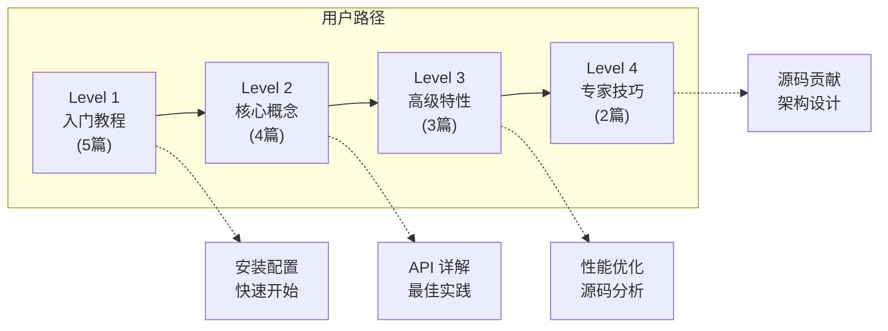
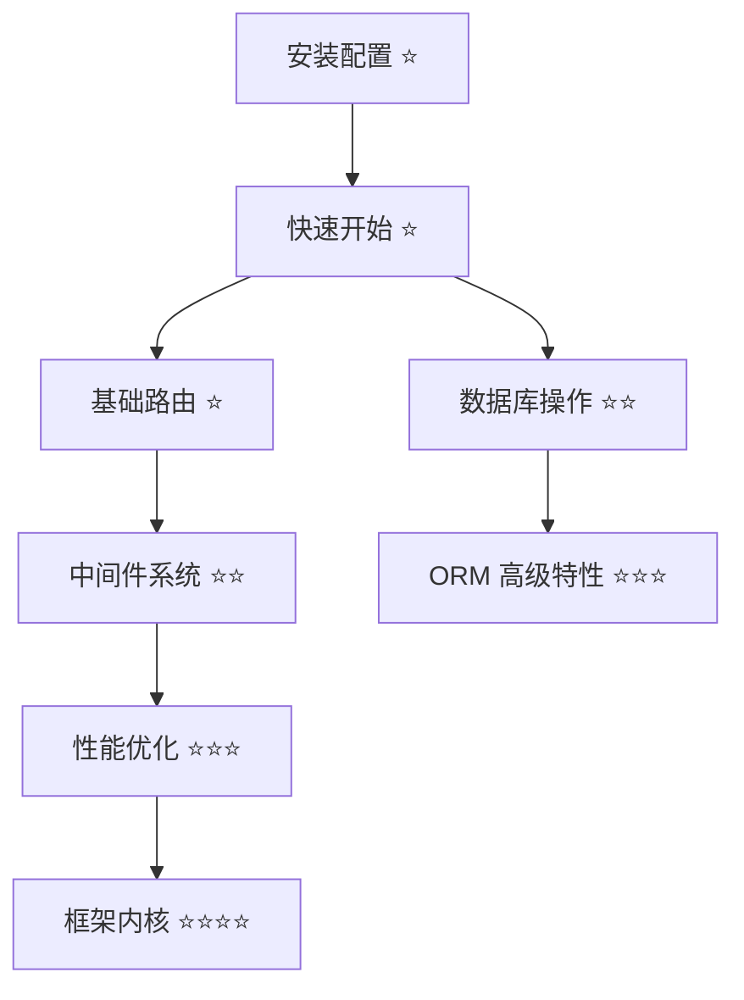
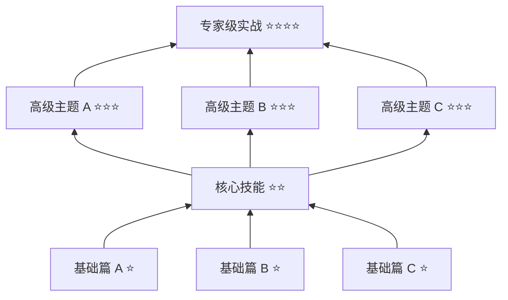

# 学习路径规划工具

本文档提供四个实用工具，帮助文档编写者快速构建渐进式学习体系。

---

## 工具 1：路径生成器

**功能**：根据项目类型生成完整的文档体系结构

**输入参数**：
- 项目类型（Web 框架/工具库/CLI（命令行工具）/等）
- 核心功能列表
- 目标用户水平（初级/中级/高级）
- 技术栈

**输出**：完整的目录结构和文档清单

**使用示例**：
```markdown
请为我的项目生成渐进式文档体系：

项目信息：
- 类型：Python Web 框架
- 核心功能：路由、中间件、ORM、模板引擎
- 目标用户：中级 Python 开发者
- 技术栈：Python 3.8+, asyncio

生成要求：
1. 三条学习路径的完整目录结构
2. 每个级别的文档清单
3. 知识依赖关系图
4. 配套练习任务列表
```

**输出示例**：
```yaml
文档体系结构:
  getting-started/:
    - installation.md
    - quickstart.md
    - prerequisites.md
  
  user-guide/:
    level1-basics/:      # ⭐
      - 01-hello-world.md
      - 02-routing-basics.md
      - 03-first-app.md
      - exercises/
        - ex1-setup.md
        - ex2-basic-routing.md
    level2-core/:        # ⭐⭐
      - 01-middleware.md
      - 02-orm-basics.md
      - 03-template-engine.md
      - exercises/
    level3-advanced/:    # ⭐⭐⭐
      - 01-async-patterns.md
      - 02-performance.md
      - 03-security.md
      - exercises/
    level4-expert/:      # ⭐⭐⭐⭐
      - 01-internals.md
      - 02-custom-extensions.md
      - exercises/
  
  developer-guide/:      # 类似结构...
  mastery-guide/:        # 类似结构...

知识依赖图:
  入门阶段:
    - 安装配置
      - 快速开始
        - Hello World
          - 基础路由
            - 中间件系统
              - 性能优化
                - 框架内核

练习任务清单:
  Level 1 (⭐):
    - 练习 1.1: 环境搭建验证
    - 练习 1.2: 第一个应用
    - 练习 1.3: 基础路由配置
  
  Level 2 (⭐⭐):
    - 练习 2.1: 中间件开发
    - 练习 2.2: 数据库操作
    - 练习 2.3: 模板渲染
  
  Level 3 (⭐⭐⭐):
    - 练习 3.1: 异步优化
    - 练习 3.2: 源码阅读
    - 练习 3.3: 复杂场景实现
  
  Level 4 (⭐⭐⭐⭐):
    - 练习 4.1: 架构设计
    - 练习 4.2: 源码贡献
    - 练习 4.3: 创新项目
```

---

## 工具 2：模板选择器

**功能**：根据文档级别和类型选择对应的模板

**输入**：
- 文档级别（Level 1-4）
- 文档类型（教程/概念/分析/设计）
- 技术栈

**输出**：对应的文档模板

**模板类型对照表**：

| 级别 | 模板名称 | 适用场景 | 模板位置 |
|-----|---------|---------|---------|
| ⭐ | 入门教程模板 | 第一次接触，需要手把手教学 | references/templates.md - Level 1 |
| ⭐⭐ | 核心概念模板 | 系统学习核心概念和用法 | references/templates.md - Level 2 |
| ⭐⭐⭐ | 进阶分析模板 | 深入原理，解决复杂问题 | references/templates.md - Level 3 |
| ⭐⭐⭐⭐ | 专家设计模板 | 架构设计，制定技术决策 | references/templates.md - Level 4 |

**选择决策树**：
```markdown
Q: 这篇文档的目标是什么？
├── 让新手成功运行第一个示例
│   └── → Level 1 模板（入门教程）⭐
│
├── 系统讲解核心概念和用法
│   └── → Level 2 模板（核心概念）⭐⭐
│
├── 深入原理，解决复杂问题
│   └── → Level 3 模板（进阶分析）⭐⭐⭐
│
└── 讲解架构设计和技术决策
    └── → Level 4 模板（专家设计）⭐⭐⭐⭐
```

---

## 工具 3：路径检查器

**功能**：检查文档体系的完整性和合理性

**检查维度**：

### 1. 完整性检查
- [ ] 每个级别是否有足够的文档（建议每个级别至少 3-5 篇）
- [ ] 前置知识是否都有对应文档
- [ ] 练习任务是否覆盖所有核心知识点
- [ ] 是否有配套的验证机制

### 2. 难度递进检查
- [ ] 难度是否平滑递增（没有跳跃）
- [ ] Level 1 → Level 2 的过渡是否自然
- [ ] Level 2 → Level 3 的过渡是否自然
- [ ] Level 3 → Level 4 的过渡是否自然
- [ ] 前置依赖是否合理（没有循环依赖）

### 3. 知识覆盖检查
- [ ] 核心知识点是否都有对应文档
- [ ] 是否存在知识盲区
- [ ] 文档之间是否有重复内容
- [ ] 三条路径的知识是否有合理交叉

### 4. 导航完整性检查
- [ ] 每篇文档是否有前置知识标注
- [ ] 每篇文档是否有后续推荐
- [ ] 路径导航是否清晰（上一步/下一步）
- [ ] 相关概念是否有关联链接

### 5. 质量检查
- [ ] 每个级别是否有配套的练习
- [ ] 练习是否有明确的验证标准
- [ ] 文档是否有难度标记（⭐）
- [ ] 文档是否有预计学习时间

**检查报告模板**：
```markdown
## 文档体系检查报告

### 项目：[项目名称]

### 检查日期：YYYY-MM-DD

---

### 一、完整性检查

| 路径 | Level 1 | Level 2 | Level 3 | Level 4 | 状态 |
|-----|---------|---------|---------|---------|------|
| 用户路径 | 5 篇 ✅ | 4 篇 ✅ | 3 篇 ⚠️ | 2 篇 ❌ | 需补充 Level 4 |
| 开发路径 | 3 篇 ✅ | 3 篇 ✅ | 2 篇 ⚠️ | 1 篇 ❌ | 需补充 Level 3-4 |
| 进阶路径 | 4 篇 ✅ | 3 篇 ✅ | 3 篇 ✅ | 2 篇 ⚠️ | 基本完整 |

### 二、难度递进检查

- ✅ Level 1 → Level 2：过渡自然
- ✅ Level 2 → Level 3：过渡自然
- ⚠️ Level 3 → Level 4：[具体问题]

### 三、知识覆盖检查

- ✅ 核心知识点覆盖：95%
- ⚠️ 知识盲区：[列出缺失的知识点]
- ❌ 重复内容：[列出重复的文档]

### 四、导航完整性检查

- ✅ 前置知识标注：90% 完成
- ✅ 后续推荐：85% 完成
- ⚠️ 相关概念链接：70% 完成

### 五、改进建议

1. **高优先级**：
   - [ ] 补充用户路径 Level 4 的文档
   - [ ] 添加缺失的前置知识链接

2. **中优先级**：
   - [ ] 完善相关概念之间的链接
   - [ ] 补充 Level 3 的练习任务

3. **低优先级**：
   - [ ] 优化文档的预计学习时间
   - [ ] 添加更多的实战案例

### 六、总体评分

**当前状态**：良好（8/10）

**建议**：优先完成高优先级改进项，预计需要 2-3 天工作量。
```

---

## 工具 4：学习路径可视化

**功能**：生成学习路径的可视化图表

**可视化形式**：

### 1. 路径流程图



### 2. 知识依赖图



### 3. 技能树



---

## 工具使用示例

**完整工作流程**：

```markdown
## 为项目创建渐进式文档体系的步骤

### 步骤 1：使用路径生成器
输入项目信息，生成基础目录结构

### 步骤 2：使用模板选择器
为每篇文档选择合适的模板

### 步骤 3：编写文档
按照模板编写具体内容

### 步骤 4：使用路径检查器
检查文档体系的完整性和质量

### 步骤 5：生成可视化图表
创建学习路径图和知识依赖图

### 步骤 6：持续迭代
根据用户反馈不断优化
```

